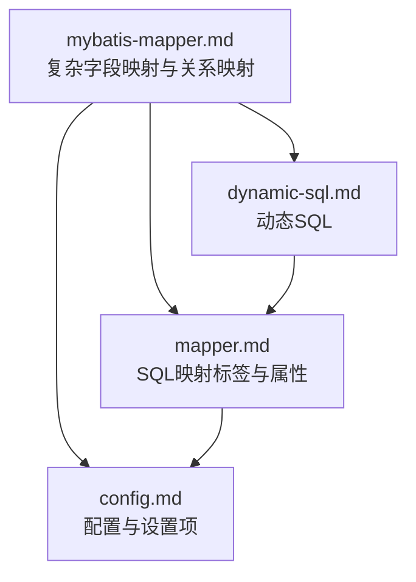
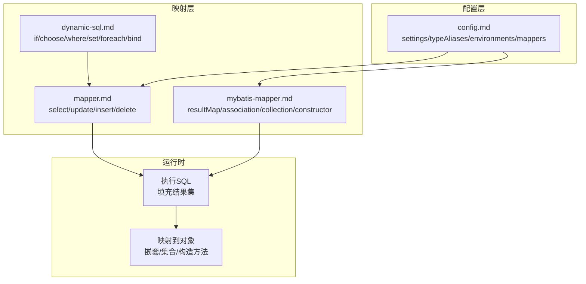
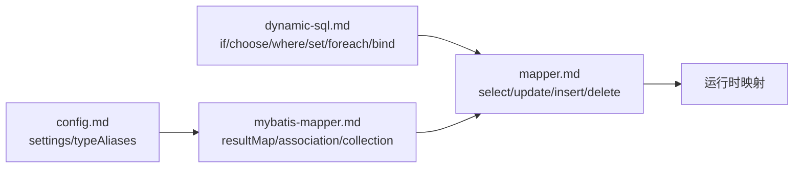

# 复杂字段映射

<cite>
**本文引用的文件**
- [mybatis-mapper.md](file://docs/backend-base/mybatis/mybatis-mapper.md)
- [mapper.md](file://docs/backend-base/mybatis/mapper.md)
- [config.md](file://docs/backend-base/mybatis/config.md)
- [dynamic-sql.md](file://docs/backend-base/mybatis/dynamic-sql.md)
</cite>

## 目录
1. [简介](#简介)
2. [项目结构](#项目结构)
3. [核心组件](#核心组件)
4. [架构总览](#架构总览)
5. [详细组件分析](#详细组件分析)
6. [依赖分析](#依赖分析)
7. [性能考量](#性能考量)
8. [故障排查指南](#故障排查指南)
9. [结论](#结论)
10. [附录](#附录)

## 简介
本篇文档围绕 MyBatis 的复杂字段映射展开，系统讲解 resultMap 的完整配置与使用，包括 id、result、constructor、association、collection 等子元素的详细说明与最佳实践。文档同时覆盖嵌套结果映射与嵌套查询两大高级映射技术，给出一对一、一对多、多对多关系的实现方案，并结合 fetchType 懒加载策略与自动映射设置，帮助读者在复杂业务场景下构建高性能、可维护的映射层。

## 项目结构
本仓库与 MyBatis 相关的文档集中在 backend-base/mybatis 目录，包含：
- 映射与 SQL 标签使用：mapper.md
- 复杂字段映射与关系映射：mybatis-mapper.md
- 配置与设置项：config.md
- 动态 SQL：dynamic-sql.md

图表来源
- [mybatis-mapper.md:1-488](file://docs/backend-base/mybatis/mybatis-mapper.md#L1-L488)
- [mapper.md:1-242](file://docs/backend-base/mybatis/mapper.md#L1-L242)
- [config.md:1-240](file://docs/backend-base/mybatis/config.md#L1-L240)
- [dynamic-sql.md:1-278](file://docs/backend-base/mybatis/dynamic-sql.md#L1-L278)

章节来源
- [mybatis-mapper.md:1-488](file://docs/backend-base/mybatis/mybatis-mapper.md#L1-L488)
- [mapper.md:1-242](file://docs/backend-base/mybatis/mapper.md#L1-L242)
- [config.md:1-240](file://docs/backend-base/mybatis/config.md#L1-L240)
- [dynamic-sql.md:1-278](file://docs/backend-base/mybatis/dynamic-sql.md#L1-L278)

## 核心组件
- resultMap：MyBatis 最强大的结果映射机制，支持简单字段映射、构造方法注入、嵌套结果映射与嵌套查询。
- id/result：映射简单字段，id 表示对象标识，有助于缓存与比较性能。
- association：处理“有一个类型”的关系，支持嵌套查询与嵌套结果映射。
- collection：处理集合类型，支持嵌套查询与嵌套结果映射。
- constructor：通过构造方法注入，避免暴露 setter。
- 自动映射：基于列名与属性名的自动映射，可配合驼峰命名转换提升开发效率。
- fetchType：控制集合的懒加载策略，影响 N+1 问题与性能权衡。

章节来源
- [mybatis-mapper.md:90-161](file://docs/backend-base/mybatis/mybatis-mapper.md#L90-L161)
- [mybatis-mapper.md:234-298](file://docs/backend-base/mybatis/mybatis-mapper.md#L234-L298)
- [mybatis-mapper.md:163-232](file://docs/backend-base/mybatis/mybatis-mapper.md#L163-L232)
- [config.md:56-71](file://docs/backend-base/mybatis/config.md#L56-L71)

## 架构总览
MyBatis 的复杂映射由 SQL 映射文件与配置共同驱动，核心流程如下：
- SQL 映射文件定义 select/update/insert/delete 语句与 resultMap。
- 配置文件设置全局 settings、类型别名、环境与数据源等。
- 动态 SQL 提供条件拼装能力，减少重复映射。
- 运行时，MyBatis 将 SQL 执行结果映射到 Java 对象，支持嵌套与集合。

图表来源
- [config.md:54-240](file://docs/backend-base/mybatis/config.md#L54-L240)
- [mapper.md:1-242](file://docs/backend-base/mybatis/mapper.md#L1-L242)
- [mybatis-mapper.md:90-488](file://docs/backend-base/mybatis/mybatis-mapper.md#L90-L488)
- [dynamic-sql.md:1-278](file://docs/backend-base/mybatis/dynamic-sql.md#L1-L278)

## 详细组件分析

### resultMap 节点与属性
- id：唯一标识，用于识别映射。
- type：目标类的完全限定名或类型别名。
- autoMapping：覆盖全局 autoMappingBehavior，控制是否启用自动映射。

章节来源
- [mybatis-mapper.md:92-99](file://docs/backend-base/mybatis/mybatis-mapper.md#L92-L99)

### id 与 result 子元素
- id：标识属性，有助于缓存与比较性能。
- result：普通结果映射，支持 property、column、javaType、jdbcType、typeHandler 等属性。
- 共同点：均支持复杂属性导航（如 address.street.number）。

章节来源
- [mybatis-mapper.md:117-132](file://docs/backend-base/mybatis/mybatis-mapper.md#L117-L132)

### constructor 子元素
- 通过构造方法注入，避免暴露 setter。
- idArg：ID 参数，有助于性能。
- arg：普通参数。
- 示例：构造方法注入 Integer id、String username、int age。

章节来源
- [mybatis-mapper.md:133-161](file://docs/backend-base/mybatis/mybatis-mapper.md#L133-L161)

### association 嵌套映射
- 处理“有一个类型”的关系，如博客与作者。
- 两种加载方式：
  - 嵌套 Select 查询：通过另一个 SQL 加载复杂类型。
  - 嵌套结果映射：使用连接结果的重复子集。
- 嵌套 Select 查询示例：Blog 与 Author 的关联。
- 嵌套结果映射示例：Blog 与 Author 的重用 resultMap。

章节来源
- [mybatis-mapper.md:234-298](file://docs/backend-base/mybatis/mybatis-mapper.md#L234-L298)

### collection 嵌套映射
- 处理集合类型，如博客与文章集合。
- 两种方式：
  - 嵌套 Select 查询：通过另一个 SQL 加载集合。
  - 嵌套结果映射：基于连接结果映射集合。
- ofType：区分 JavaBean 属性类型与集合存储类型。
- columnPrefix：为集合列设置统一前缀，便于复用映射。

章节来源
- [mybatis-mapper.md:163-232](file://docs/backend-base/mybatis/mybatis-mapper.md#L163-L232)

### 自动映射与驼峰命名
- 自动映射：基于列名与属性名匹配（忽略大小写）。
- mapUnderscoreToCamelCase：开启后可将下划线命名自动转驼峰命名。
- 自动映射与手动映射共存：未手动映射的部分由自动映射处理。

章节来源
- [mybatis-mapper.md:66-88](file://docs/backend-base/mybatis/mybatis-mapper.md#L66-L88)
- [config.md:62](file://docs/backend-base/mybatis/config.md#L62)

### fetchType 懒加载策略
- fetchType：eager（立即加载）/lazy（懒加载）。
- 一对多集合通常设置为 lazy，避免 N+1 问题。
- 一对一也可设置为 eager，减少额外查询。

章节来源
- [mybatis-mapper.md:359-377](file://docs/backend-base/mybatis/mybatis-mapper.md#L359-L377)
- [mybatis-mapper.md:394-413](file://docs/backend-base/mybatis/mybatis-mapper.md#L394-L413)

### 一对一映射
- 使用 association + select，将 Person 的 card 属性通过外键 card_id 关联查询 Card。
- 适合强关联且数据量较小的场景。

章节来源
- [mybatis-mapper.md:300-340](file://docs/backend-base/mybatis/mybatis-mapper.md#L300-L340)

### 一对多映射
- 使用 collection + select，Class 的 students 通过外键 id 关联查询 Student。
- fetchType 设为 lazy，按需加载，避免 N+1。

章节来源
- [mybatis-mapper.md:341-377](file://docs/backend-base/mybatis/mybatis-mapper.md#L341-L377)

### 多对多映射
- 通过中间表维护关系，User 的 orders 与 Order 的 articles 通过中间表关联。
- fetchType 设为 lazy，按需加载，提升性能。

章节来源
- [mybatis-mapper.md:379-413](file://docs/backend-base/mybatis/mybatis-mapper.md#L379-L413)

### 注解风格的映射
- @Results/@Result：等价于 XML 的 resultMap/association/collection。
- @One/@Many：分别对应 association/collection 的嵌套查询。
- fetchType：EAGER/LAZY 控制加载策略。

章节来源
- [mybatis-mapper.md:415-487](file://docs/backend-base/mybatis/mybatis-mapper.md#L415-L487)

### SQL 映射标签与属性
- select：查询语句，支持 resultType/resultMap/useCache/flushCache/timeout 等。
- insert/update/delete：DML 语句，支持 keyProperty/keyColumn/useGeneratedKeys 等。
- sql：可复用的 SQL 片段，配合 include 使用。

章节来源
- [mapper.md:5-45](file://docs/backend-base/mybatis/mapper.md#L5-L45)
- [mapper.md:46-91](file://docs/backend-base/mybatis/mapper.md#L46-L91)
- [mapper.md:177-242](file://docs/backend-base/mybatis/mapper.md#L177-L242)

### 动态 SQL
- if/choose/when/otherwise/where/set/trim/foreach/bind：灵活拼装 SQL。
- 与复杂映射结合，可实现条件查询与批量操作。

章节来源
- [dynamic-sql.md:1-278](file://docs/backend-base/mybatis/dynamic-sql.md#L1-L278)

## 依赖分析
- XML 映射文件依赖配置文件中的 settings 与类型别名。
- 复杂映射依赖动态 SQL 的条件拼装能力。
- 嵌套查询依赖多个 select 语句与关联字段映射。
- 懒加载策略依赖 fetchType 与集合映射。

图表来源
- [config.md:54-240](file://docs/backend-base/mybatis/config.md#L54-L240)
- [dynamic-sql.md:1-278](file://docs/backend-base/mybatis/dynamic-sql.md#L1-L278)
- [mapper.md:1-242](file://docs/backend-base/mybatis/mapper.md#L1-L242)
- [mybatis-mapper.md:90-488](file://docs/backend-base/mybatis/mybatis-mapper.md#L90-L488)

章节来源
- [config.md:54-240](file://docs/backend-base/mybatis/config.md#L54-L240)
- [dynamic-sql.md:1-278](file://docs/backend-base/mybatis/dynamic-sql.md#L1-L278)
- [mapper.md:1-242](file://docs/backend-base/mybatis/mapper.md#L1-L242)
- [mybatis-mapper.md:90-488](file://docs/backend-base/mybatis/mybatis-mapper.md#L90-L488)

## 性能考量
- 自动映射与驼峰命名：开启 mapUnderscoreToCamelCase，减少列名与属性名不一致带来的手动映射成本。
- id 标识：在 resultMap 中使用 id，有助于缓存与比较性能。
- fetchType：集合映射优先使用 lazy，避免 N+1 问题；仅在确定会使用集合时才设为 eager。
- 嵌套查询 vs 嵌套结果映射：嵌套查询简洁但易触发 N+1；嵌套结果映射需合理设计列别名与 columnPrefix，减少重复列与冗余查询。
- 动态 SQL：通过 if/choose/where/set/trim 等标签减少 SQL 冗余，避免全表扫描。
- 配置优化：合理设置 localCacheScope、useGeneratedKeys、jdbcTypeForNull 等，平衡性能与一致性。

章节来源
- [mybatis-mapper.md:66-88](file://docs/backend-base/mybatis/mybatis-mapper.md#L66-L88)
- [mybatis-mapper.md:117-132](file://docs/backend-base/mybatis/mybatis-mapper.md#L117-L132)
- [mybatis-mapper.md:359-377](file://docs/backend-base/mybatis/mybatis-mapper.md#L359-L377)
- [config.md:56-71](file://docs/backend-base/mybatis/config.md#L56-L71)
- [dynamic-sql.md:1-278](file://docs/backend-base/mybatis/dynamic-sql.md#L1-L278)

## 故障排查指南
- N+1 查询问题：一对多集合映射使用 lazy，避免在循环中频繁查询；必要时评估嵌套结果映射。
- 列名与属性名不一致：开启 mapUnderscoreToCamelCase 或在 SQL 中使用别名，确保自动映射生效。
- 集合类型不匹配：使用 ofType 区分集合元素类型，避免类型推断错误。
- 嵌套查询参数传递：确认 association/collection 的 column 与 select 语句参数一致。
- 动态 SQL 语法：注意 where/set/trim 的前后缀与逗号处理，避免生成非法 SQL。
- 主键生成：insert 语句使用 useGeneratedKeys 或 selectKey，确保 keyProperty 正确。

章节来源
- [mybatis-mapper.md:263-265](file://docs/backend-base/mybatis/mybatis-mapper.md#L263-L265)
- [mybatis-mapper.md:183](file://docs/backend-base/mybatis/mybatis-mapper.md#L183)
- [mapper.md:86-91](file://docs/backend-base/mybatis/mapper.md#L86-L91)
- [mapper.md:92-136](file://docs/backend-base/mybatis/mapper.md#L92-L136)
- [dynamic-sql.md:115-155](file://docs/backend-base/mybatis/dynamic-sql.md#L115-L155)

## 结论
MyBatis 的复杂字段映射以 resultMap 为核心，结合 association、collection、constructor 等子元素，能够高效表达一对一、一对多、多对多等复杂关系。通过合理运用嵌套查询与嵌套结果映射、fetchType 懒加载策略、自动映射与驼峰命名、动态 SQL 条件拼装，可在保证性能的同时提升开发效率与可维护性。建议在实际项目中：
- 优先使用嵌套结果映射减少 N+1；
- 集合映射统一使用 lazy；
- 开启驼峰命名自动映射；
- 使用动态 SQL 精准拼装条件；
- 通过配置项与类型别名简化映射配置。

## 附录
- 代码示例路径（不展示具体代码内容）：
  - 基础映射与自动映射示例：[mybatis-mapper.md:53-88](file://docs/backend-base/mybatis/mybatis-mapper.md#L53-L88)
  - 构造方法注入示例：[mybatis-mapper.md:155-161](file://docs/backend-base/mybatis/mybatis-mapper.md#L155-L161)
  - 嵌套 Select 查询（association）示例：[mybatis-mapper.md:245-257](file://docs/backend-base/mybatis/mybatis-mapper.md#L245-L257)
  - 嵌套结果映射（association）示例：[mybatis-mapper.md:268-298](file://docs/backend-base/mybatis/mybatis-mapper.md#L268-L298)
  - 嵌套 Select 查询（collection）示例：[mybatis-mapper.md:169-181](file://docs/backend-base/mybatis/mybatis-mapper.md#L169-L181)
  - 嵌套结果映射（collection）示例：[mybatis-mapper.md:189-232](file://docs/backend-base/mybatis/mybatis-mapper.md#L189-L232)
  - 一对一映射示例：[mybatis-mapper.md:306-337](file://docs/backend-base/mybatis/mybatis-mapper.md#L306-L337)
  - 一对多映射示例：[mybatis-mapper.md:345-371](file://docs/backend-base/mybatis/mybatis-mapper.md#L345-L371)
  - 多对多映射示例：[mybatis-mapper.md:383-411](file://docs/backend-base/mybatis/mybatis-mapper.md#L383-L411)
  - 注解风格映射示例：[mybatis-mapper.md:417-487](file://docs/backend-base/mybatis/mybatis-mapper.md#L417-L487)
  - SQL 映射标签与属性：[mapper.md:27-45](file://docs/backend-base/mybatis/mapper.md#L27-L45)
  - insert/update/delete 属性与主键生成：[mapper.md:46-91](file://docs/backend-base/mybatis/mapper.md#L46-L91)
  - 动态 SQL 标签与用法：[dynamic-sql.md:3-91](file://docs/backend-base/mybatis/dynamic-sql.md#L3-L91)
  - 配置与设置项：[config.md:54-240](file://docs/backend-base/mybatis/config.md#L54-L240)