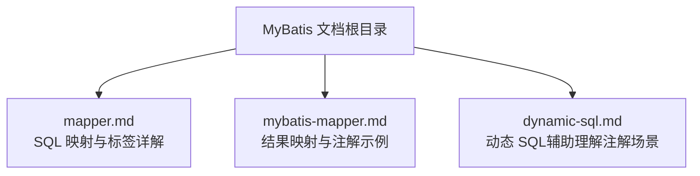
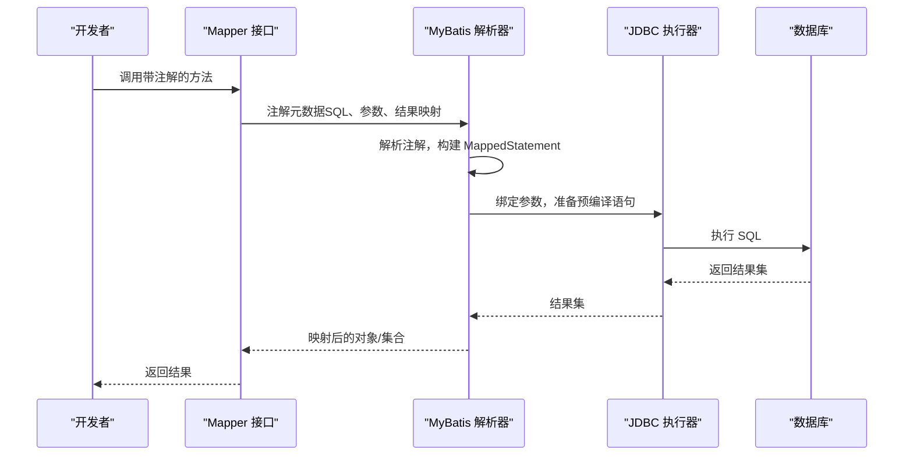
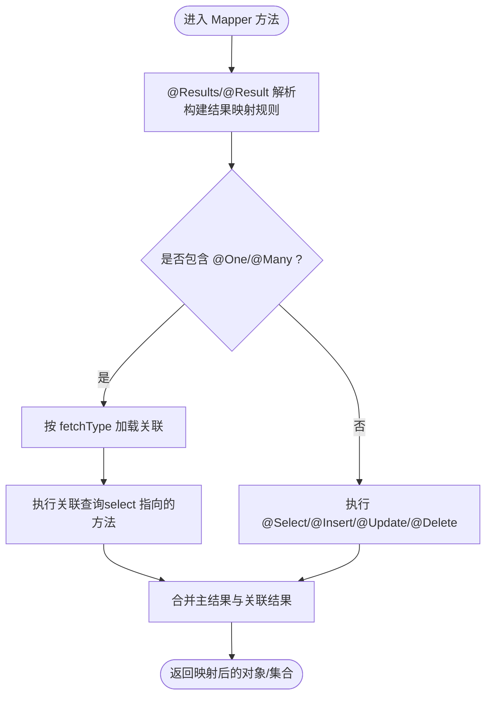

# 注解映射

<cite>
**本文引用的文件**
- [mapper.md](file://docs/backend-base/mybatis/mapper.md)
- [mybatis-mapper.md](file://docs/backend-base/mybatis/mybatis-mapper.md)
- [dynamic-sql.md](file://docs/backend-base/mybatis/dynamic-sql.md)
</cite>

## 目录
1. [简介](#简介)
2. [项目结构](#项目结构)
3. [核心组件](#核心组件)
4. [架构总览](#架构总览)
5. [详细组件分析](#详细组件分析)
6. [依赖分析](#依赖分析)
7. [性能考量](#性能考量)
8. [故障排查指南](#故障排查指南)
9. [结论](#结论)
10. [附录](#附录)

## 简介
本指南聚焦于 MyBatis 注解映射，系统讲解基础注解（@Select、@Insert、@Update、@Delete）与高级注解（@Results、@Result、@One、@Many）的使用方法、配置要点与典型场景。同时提供注解映射与 XML 映射的对比分析，帮助开发者在不同业务需求下做出合适的选择，并给出从简单查询到复杂关联查询的完整实践路径与最佳实践建议。

## 项目结构
本仓库中与 MyBatis 注解映射直接相关的文档集中在 backend-base/mybatis 目录下，包含：
- SQL 映射与常用标签说明（select、insert、update、delete、sql、selectKey）
- 结果映射与复杂关联映射（resultMap、association、collection）
- 注解映射示例（@Select、@Results、@One、@Many、@SelectKey、@Options）

图表来源
- [mapper.md:1-242](file://docs/backend-base/mybatis/mapper.md#L1-L242)
- [mybatis-mapper.md:1-488](file://docs/backend-base/mybatis/mybatis-mapper.md#L1-L488)
- [dynamic-sql.md:1-278](file://docs/backend-base/mybatis/dynamic-sql.md#L1-L278)

章节来源
- [mapper.md:1-242](file://docs/backend-base/mybatis/mapper.md#L1-L242)
- [mybatis-mapper.md:1-488](file://docs/backend-base/mybatis/mybatis-mapper.md#L1-L488)
- [dynamic-sql.md:1-278](file://docs/backend-base/mybatis/dynamic-sql.md#L1-L278)

## 核心组件
- 基础注解族：@Select、@Insert、@Update、@Delete，用于直接在 Mapper 接口上声明 SQL 语句。
- 结果映射注解族：@Results、@Result、@One、@Many，用于将查询结果映射到 Java 对象及其关联对象。
- 主键生成注解：@Options（自增主键）、@SelectKey（自定义主键或 Oracle 序列等）。
- 动态 SQL 辅助：结合注解与动态 SQL 片段，实现灵活的条件查询与批量操作。

章节来源
- [mapper.md:138-176](file://docs/backend-base/mybatis/mapper.md#L138-L176)
- [mybatis-mapper.md:415-487](file://docs/backend-base/mybatis/mybatis-mapper.md#L415-L487)

## 架构总览
MyBatis 注解映射的工作流可概括为：Mapper 接口方法通过注解声明 SQL 与结果映射；MyBatis 在启动时解析注解，生成对应的 MappedStatement；执行阶段按需绑定参数、执行 SQL 并将结果映射到目标类型。

图表来源
- [mapper.md:138-176](file://docs/backend-base/mybatis/mapper.md#L138-L176)
- [mybatis-mapper.md:415-487](file://docs/backend-base/mybatis/mybatis-mapper.md#L415-L487)

## 详细组件分析

### 基础注解：@Select、@Insert、@Update、@Delete
- @Select：用于声明查询语句，支持参数占位符与动态 SQL 片段组合。
- @Insert/@Update/@Delete：用于声明 DML 语句，可配合主键生成策略（@Options、@SelectKey）。
- 使用建议：
  - 简单查询优先使用 @Select；复杂条件可结合动态 SQL。
  - DML 语句尽量配合主键生成策略，避免手写主键逻辑。
  - 将 SQL 抽象为常量或工具方法，提升可读性与复用性。

章节来源
- [mapper.md:11-25](file://docs/backend-base/mybatis/mapper.md#L11-L25)
- [mapper.md:50-84](file://docs/backend-base/mybatis/mapper.md#L50-L84)
- [mapper.md:138-176](file://docs/backend-base/mybatis/mapper.md#L138-L176)

### 高级注解：@Results、@Result、@One、@Many
- @Results：容器注解，包裹多个 @Result，统一声明结果映射规则。
- @Result：声明单列到属性的映射，支持 id=true 标识主键属性。
- @One：一对一关联，通过 select 指向另一个查询方法，可设置 fetchType 控制加载策略。
- @Many：一对多/多对多集合关联，通过 select 指向集合查询方法，可设置 fetchType 控制加载策略。
- 使用建议：
  - 简单字段映射优先使用 @Result；复杂对象使用 @One/@Many。
  - fetchType 默认策略视场景而定：一对一可 EAGER，一对多/多对多建议 LAZY。
  - 合理拆分 Mapper 接口，避免单接口承担过多职责。

章节来源
- [mybatis-mapper.md:415-487](file://docs/backend-base/mybatis/mybatis-mapper.md#L415-L487)

### 主键生成：@Options 与 @SelectKey
- @Options：适用于数据库自增主键（如 MySQL/SQL Server），通过 useGeneratedKeys 与 keyProperty 自动回填主键。
- @SelectKey：适用于 Oracle 序列、UUID 等非自增主键场景，支持 before/after 两种执行顺序。
- 使用建议：
  - 优先使用 @Options；特殊主键场景使用 @SelectKey。
  - 指定明确的 resultType，避免类型推断带来的歧义。

章节来源
- [mapper.md:156-176](file://docs/backend-base/mybatis/mapper.md#L156-L176)

### 复杂关联映射：一对一、一对多、多对多
- 一对一：使用 @One，select 指向关联实体查询，fetchType 可设为 EAGER。
- 一对多/多对多：使用 @Many，select 指向集合查询，fetchType 建议 LAZY。
- 示例覆盖：
  - 人员与身份证（一对一）
  - 班级与学生（一对多）
  - 订单与文章（多对多）

章节来源
- [mybatis-mapper.md:415-487](file://docs/backend-base/mybatis/mybatis-mapper.md#L415-L487)

### 注解映射与 XML 映射对比
- 可读性与维护性
  - 注解映射：适合简单 SQL 与轻量映射，代码即文档，便于快速迭代。
  - XML 映射：适合复杂 SQL、大量动态片段与重结果映射，结构清晰、可读性强。
- 性能与调试
  - 注解映射：无额外 XML 解析成本；SQL 与映射集中，便于定位问题。
  - XML 映射：可利用 SQL 日志与慢查询分析工具，便于性能优化。
- 可扩展性
  - 注解映射：适合小型项目与快速原型；复杂场景易膨胀。
  - XML 映射：适合大型项目与团队协作，便于版本控制与评审。
- 选择建议
  - 简单 CRUD：注解映射更高效。
  - 复杂查询与多表关联：XML 映射更清晰。
  - 团队协作与长期演进：XML 更利于规范与治理。

章节来源
- [mapper.md:1-242](file://docs/backend-base/mybatis/mapper.md#L1-L242)
- [mybatis-mapper.md:1-488](file://docs/backend-base/mybatis/mybatis-mapper.md#L1-L488)

### 完整代码示例（路径指引）
以下为关键示例所在位置，便于对照学习与复制粘贴：
- 一对一注解示例（Person 与 Card）
  - [mapper 接口与注解示例:415-436](file://docs/backend-base/mybatis/mybatis-mapper.md#L415-L436)
- 一对多注解示例（Clazz 与 Students）
  - [mapper 接口与注解示例:438-462](file://docs/backend-base/mybatis/mybatis-mapper.md#L438-L462)
- 多对多注解示例（Order 与 Articles）
  - [mapper 接口与注解示例:464-487](file://docs/backend-base/mybatis/mybatis-mapper.md#L464-L487)
- DML 与主键生成（@Options 与 @SelectKey）
  - [主键生成示例:156-176](file://docs/backend-base/mybatis/mapper.md#L156-L176)

章节来源
- [mybatis-mapper.md:415-487](file://docs/backend-base/mybatis/mybatis-mapper.md#L415-L487)
- [mapper.md:156-176](file://docs/backend-base/mybatis/mapper.md#L156-L176)

### 复杂逻辑流程（以注解映射为例）

图表来源
- [mybatis-mapper.md:415-487](file://docs/backend-base/mybatis/mybatis-mapper.md#L415-L487)

## 依赖分析
- 组件耦合
  - @One/@Many 依赖 select 指向的 Mapper 方法；需确保命名空间与方法签名一致。
  - @Options 与 @SelectKey 与 DML 注解配合，共同完成主键生成。
- 外部依赖
  - JDBC 驱动与数据库类型；fetchType 与懒加载策略受框架与数据库特性影响。
- 循环依赖风险
  - 注解映射中避免相互 select 引用导致的循环；必要时拆分接口或调整映射策略。

章节来源
- [mybatis-mapper.md:415-487](file://docs/backend-base/mybatis/mybatis-mapper.md#L415-L487)
- [mapper.md:138-176](file://docs/backend-base/mybatis/mapper.md#L138-L176)

## 性能考量
- 懒加载策略
  - fetchType=LAZY 可减少不必要的关联查询，降低网络与数据库压力。
  - EAGER 适合确定会使用关联数据的场景，避免 N+1 查询问题。
- 主键生成
  - 优先使用数据库自增主键（@Options），减少额外查询。
  - 非自增主键使用 @SelectKey，注意 before/after 的顺序与性能影响。
- 结果映射
  - 精准映射字段，避免不必要的列传输；合理使用 id 标识主键属性，提升缓存命中率。

章节来源
- [mybatis-mapper.md:415-487](file://docs/backend-base/mybatis/mybatis-mapper.md#L415-L487)
- [mapper.md:156-176](file://docs/backend-base/mybatis/mapper.md#L156-L176)

## 故障排查指南
- 常见问题
  - 关联查询未生效：检查 @One/@Many 的 select 是否指向正确 Mapper 方法，参数是否匹配。
  - fetchType 导致 N+1：确认是否需要 LAZY；必要时改为嵌套结果映射或批量加载。
  - 主键未回填：检查 @Options 的 useGeneratedKeys 与 keyProperty 是否正确；Oracle 场景使用 @SelectKey。
  - SQL 语法错误：结合动态 SQL 片段（if/where/set/foreach 等）逐步定位。
- 调试建议
  - 开启 MyBatis SQL 日志，观察最终执行的 SQL 与参数。
  - 将复杂 SQL 提前在数据库客户端验证，再迁移到注解或 XML。

章节来源
- [dynamic-sql.md:1-278](file://docs/backend-base/mybatis/dynamic-sql.md#L1-L278)
- [mapper.md:138-176](file://docs/backend-base/mybatis/mapper.md#L138-L176)
- [mybatis-mapper.md:415-487](file://docs/backend-base/mybatis/mybatis-mapper.md#L415-L487)

## 结论
- 注解映射适合简单到中等复杂度的查询与映射，具备高可读性与快速开发优势。
- 复杂关联与动态 SQL 场景更适合 XML 映射，便于结构化维护与性能优化。
- 合理选择 fetchType、主键生成策略与结果映射，是获得稳定性能与可维护性的关键。
- 建议在团队内形成统一的注解与 XML 使用规范，结合项目规模与演进节奏动态调整。

## 附录
- 快速参考
  - 基础注解：@Select、@Insert、@Update、@Delete
  - 结果映射：@Results、@Result、@One、@Many
  - 主键生成：@Options、@SelectKey
  - 动态 SQL：if、where、set、foreach、bind（用于 XML 或注解中的 SQL 片段）

章节来源
- [mapper.md:1-242](file://docs/backend-base/mybatis/mapper.md#L1-L242)
- [mybatis-mapper.md:1-488](file://docs/backend-base/mybatis/mybatis-mapper.md#L1-L488)
- [dynamic-sql.md:1-278](file://docs/backend-base/mybatis/dynamic-sql.md#L1-L278)