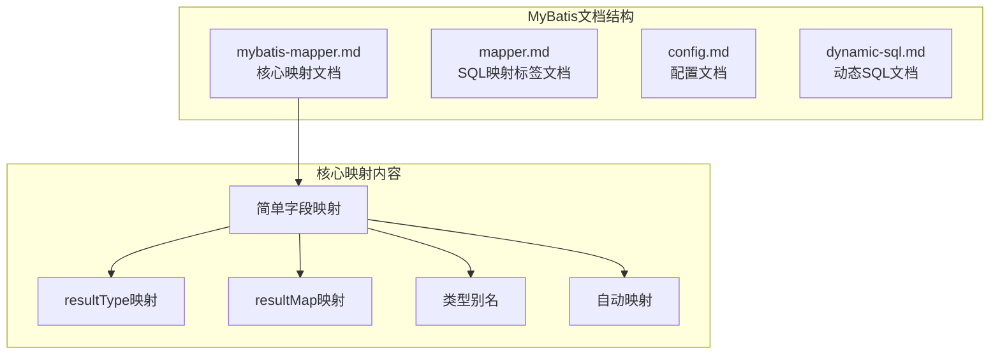
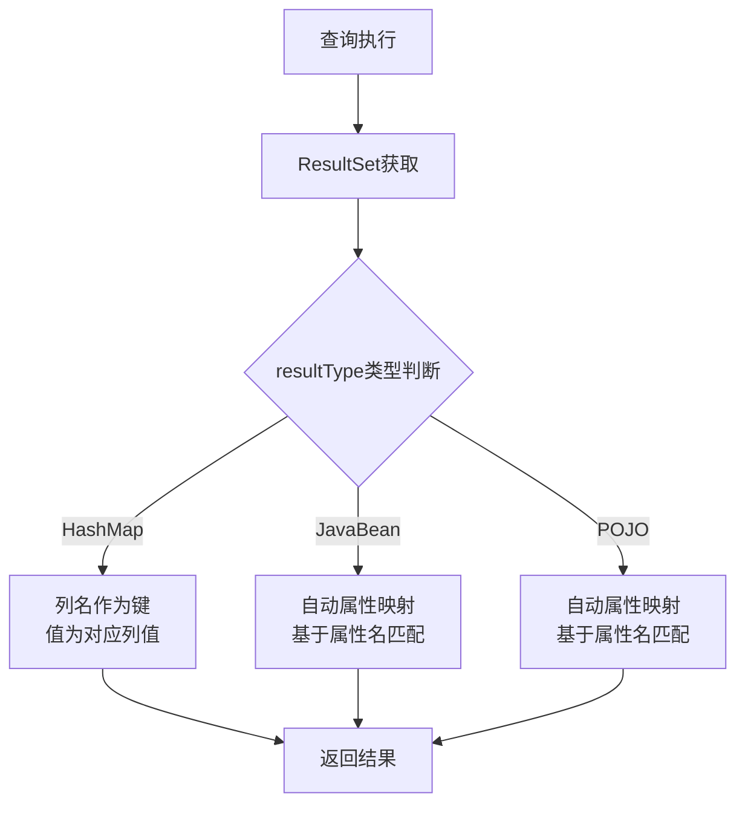
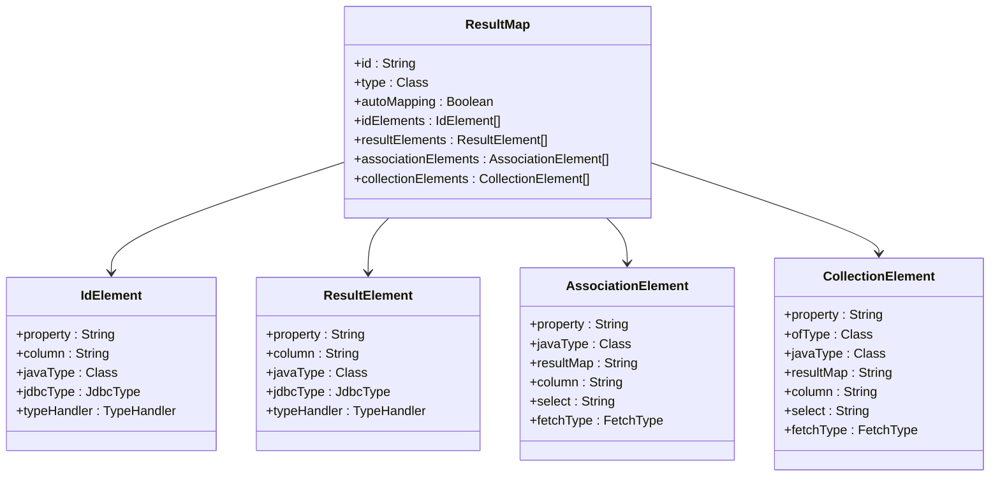
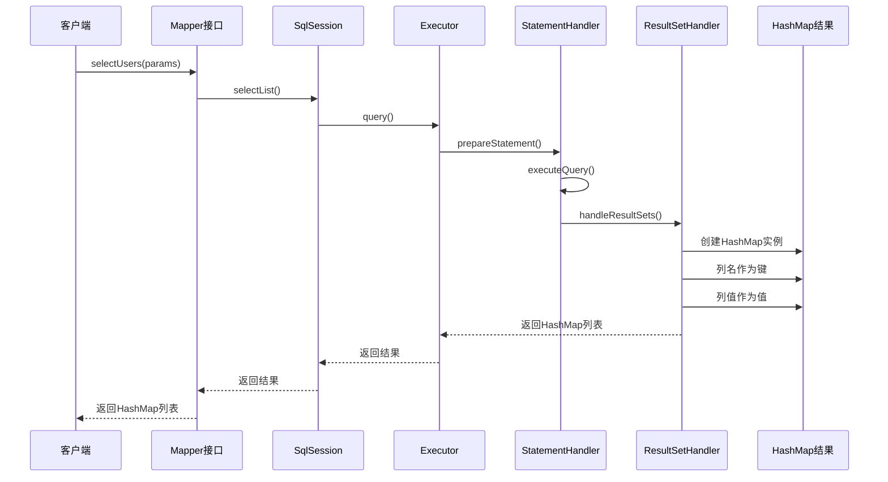
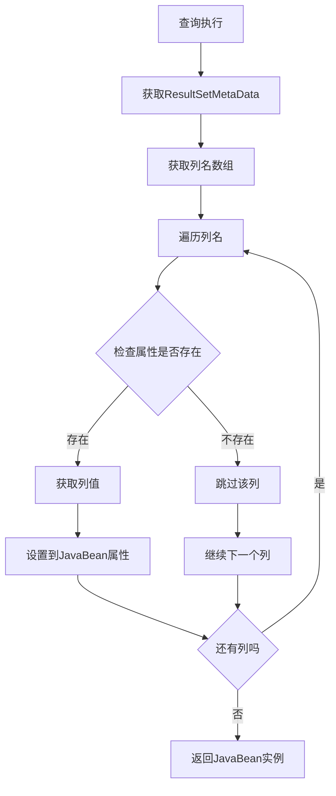
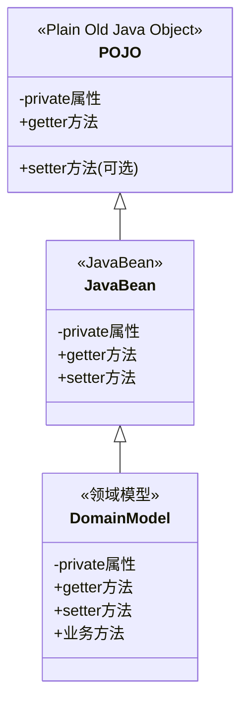
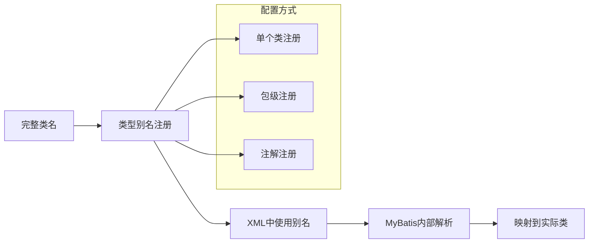
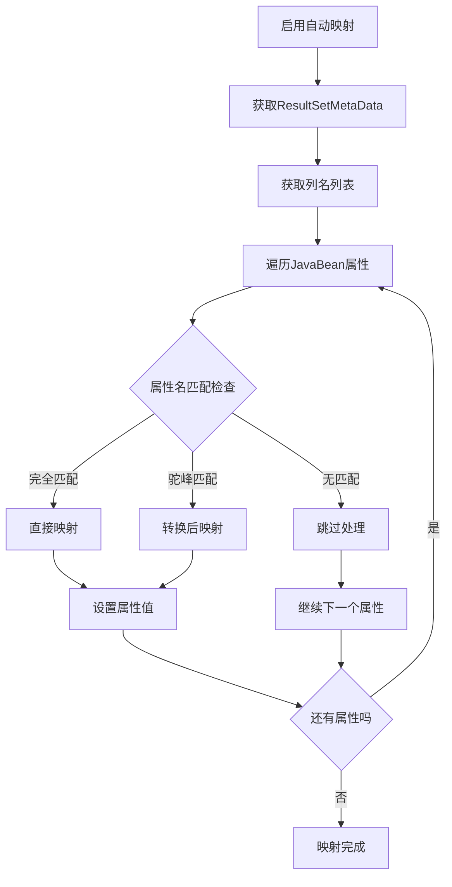
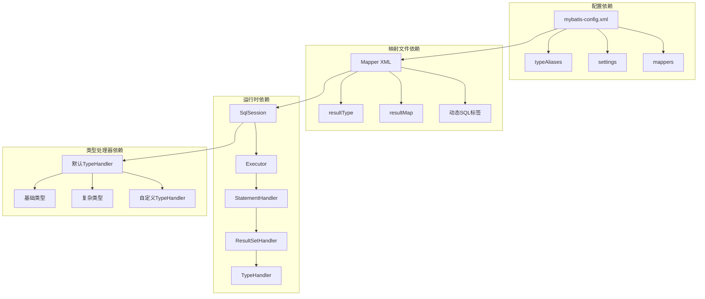
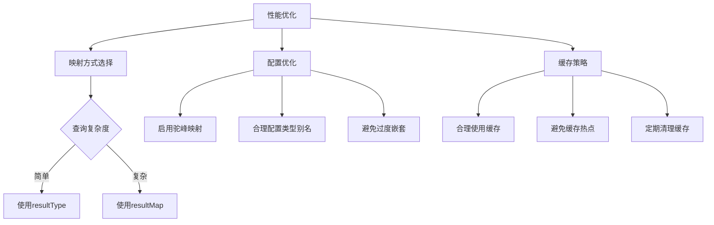

# 简单字段映射

<cite>
**本文档引用的文件**
- [mybatis-mapper.md](file://docs/backend-base/mybatis/mybatis-mapper.md)
- [mapper.md](file://docs/backend-base/mybatis/mapper.md)
- [config.md](file://docs/backend-base/mybatis/config.md)
- [dynamic-sql.md](file://docs/backend-base/mybatis/dynamic-sql.md)
</cite>

## 目录
1. [简介](#简介)
2. [项目结构](#项目结构)
3. [核心组件](#核心组件)
4. [架构概览](#架构概览)
5. [详细组件分析](#详细组件分析)
6. [依赖分析](#依赖分析)
7. [性能考虑](#性能考虑)
8. [故障排除指南](#故障排除指南)
9. [结论](#结论)

## 简介

MyBatis是一个优秀的持久层框架，其核心优势在于强大的SQL映射能力。简单字段映射是MyBatis中最基础也是最重要的功能之一，它能够将数据库查询结果自动映射到各种Java对象类型中，包括HashMap、JavaBean、POJO等。

本文档将深入解析MyBatis的简单字段映射机制，详细说明resultType和resultMap的基本概念、使用场景和最佳实践，帮助开发者更好地理解和运用MyBatis的映射功能。

## 项目结构

MyBatis相关文档主要集中在`docs/backend-base/mybatis/`目录下，包含以下关键文件：



**图表来源**
- [mybatis-mapper.md:1-50](file://docs/backend-base/mybatis/mybatis-mapper.md#L1-L50)
- [mapper.md:5-45](file://docs/backend-base/mybatis/mapper.md#L5-L45)

**章节来源**
- [mybatis-mapper.md:1-50](file://docs/backend-base/mybatis/mybatis-mapper.md#L1-L50)
- [mapper.md:1-50](file://docs/backend-base/mybatis/mapper.md#L1-L50)

## 核心组件

### resultType映射机制

resultType是最简单的映射方式，它直接将查询结果映射到指定的Java类型：



**图表来源**
- [mybatis-mapper.md:8-21](file://docs/backend-base/mybatis/mybatis-mapper.md#L8-L21)

### resultMap映射机制

resultMap提供了更灵活的映射控制，允许精确指定列与属性的对应关系：



**图表来源**
- [mybatis-mapper.md:117-132](file://docs/backend-base/mybatis/mybatis-mapper.md#L117-L132)

**章节来源**
- [mybatis-mapper.md:5-64](file://docs/backend-base/mybatis/mybatis-mapper.md#L5-L64)
- [mapper.md:27-44](file://docs/backend-base/mybatis/mapper.md#L27-L44)

## 架构概览

MyBatis简单字段映射的整体架构如下：

```mermaid
graph TB
subgraph "应用层"
A[DAO接口]
B[XML映射文件]
end
subgraph "MyBatis核心层"
C[SqlSession]
D[Executor执行器]
E[StatementHandler]
F[ResultSetHandler]
end
subgraph "映射层"
G[resultType处理器]
H[resultMap处理器]
I[自动映射引擎]
J[类型处理器(TypeHandler)]
end
subgraph "数据源层"
K[DataSource]
L[Connection]
M[PreparedStatement]
end
A --> C
B --> C
C --> D
D --> E
E --> M
M --> L
L --> K
F --> G
F --> H
G --> I
H --> I
I --> J
```

**图表来源**
- [mapper.md:9-15](file://docs/backend-base/mybatis/mapper.md#L9-L15)
- [config.md:200-239](file://docs/backend-base/mybatis/config.md#L200-L239)

## 详细组件分析

### HashMap映射实现

HashMap是最简单的映射方式，适用于临时查询和动态数据处理：



**图表来源**
- [mybatis-mapper.md:9-13](file://docs/backend-base/mybatis/mybatis-mapper.md#L9-L13)

### JavaBean映射实现

JavaBean映射是最常用的领域模型映射方式，支持自动属性映射：



**图表来源**
- [mybatis-mapper.md:37-48](file://docs/backend-base/mybatis/mybatis-mapper.md#L37-L48)

### POJO映射实现

POJO映射与JavaBean类似，但不需要setter方法：



**图表来源**
- [mybatis-mapper.md:15-21](file://docs/backend-base/mybatis/mybatis-mapper.md#L15-L21)

### 列名与属性名不匹配解决方案

当数据库列名与Java属性名不匹配时，有以下几种解决方案：

#### 方案一：使用SQL别名
```sql
-- 数据库列名 user_id -> Java属性 id
SELECT user_id AS id, user_name AS userName FROM users
```

#### 方案二：使用resultMap精确映射
```xml
<resultMap id="userResultMap" type="User">
    <id property="id" column="user_id" />
    <result property="username" column="user_name"/>
    <result property="password" column="hashed_password"/>
</resultMap>
```

#### 方案三：启用驼峰命名自动映射
```xml
<setting name="mapUnderscoreToCamelCase" value="true"/>
```

**章节来源**
- [mybatis-mapper.md:37-88](file://docs/backend-base/mybatis/mybatis-mapper.md#L37-L88)

### 类型别名配置与使用

类型别名是MyBatis提供的便捷功能，可以简化XML配置：



**图表来源**
- [config.md:72-104](file://docs/backend-base/mybatis/config.md#L72-L104)

**章节来源**
- [config.md:72-104](file://docs/backend-base/mybatis/config.md#L72-L104)
- [mybatis-mapper.md:25-35](file://docs/backend-base/mybatis/mybatis-mapper.md#L25-L35)

### 自动映射工作原理

自动映射是MyBatis的核心特性之一，它能够智能地将数据库列映射到Java属性：



**图表来源**
- [mybatis-mapper.md:66-72](file://docs/backend-base/mybatis/mybatis-mapper.md#L66-L72)

**章节来源**
- [mybatis-mapper.md:66-88](file://docs/backend-base/mybatis/mybatis-mapper.md#L66-L88)

## 依赖分析

MyBatis简单字段映射涉及多个层次的依赖关系：



**图表来源**
- [config.md:200-239](file://docs/backend-base/mybatis/config.md#L200-L239)
- [mapper.md:27-44](file://docs/backend-base/mybatis/mapper.md#L27-L44)

**章节来源**
- [config.md:200-239](file://docs/backend-base/mybatis/config.md#L200-L239)
- [mapper.md:27-44](file://docs/backend-base/mybatis/mapper.md#L27-L44)

## 性能考虑

### 映射性能优化策略

1. **选择合适的映射方式**
   - 简单查询使用resultType，复杂查询使用resultMap
   - 避免不必要的自动映射处理

2. **类型别名优化**
   - 使用类型别名减少XML冗余
   - 合理使用包级类型别名

3. **自动映射配置**
   - 启用mapUnderscoreToCamelCase提升驼峰转换效率
   - 避免过度复杂的resultMap嵌套

4. **缓存策略**
   - 合理使用二级缓存
   - 避免缓存大量临时数据

### 最佳实践建议



**章节来源**
- [mybatis-mapper.md:66-88](file://docs/backend-base/mybatis/mybatis-mapper.md#L66-L88)
- [config.md:54-71](file://docs/backend-base/mybatis/config.md#L54-L71)

## 故障排除指南

### 常见映射问题及解决方案

#### 问题1：列名与属性名不匹配
**症状**：映射结果为null或属性值不正确
**解决方案**：
- 使用SQL别名确保列名与属性名一致
- 使用resultMap精确指定映射关系
- 启用驼峰命名自动映射

#### 问题2：HashMap映射异常
**症状**：HashMap键值对不完整
**解决方案**：
- 确保SQL查询包含所有需要的列
- 检查列名是否正确
- 验证数据库连接和权限

#### 问题3：类型别名解析失败
**症状**：XML中使用别名时报错
**解决方案**：
- 检查typeAliases配置是否正确
- 确认别名与类名的对应关系
- 验证包级扫描配置

#### 问题4：自动映射性能问题
**症状**：查询响应时间过长
**解决方案**：
- 分析resultMap复杂度
- 考虑使用resultType简化映射
- 优化数据库查询语句

**章节来源**
- [mybatis-mapper.md:37-88](file://docs/backend-base/mybatis/mybatis-mapper.md#L37-L88)
- [config.md:72-104](file://docs/backend-base/mybatis/config.md#L72-L104)

## 结论

MyBatis的简单字段映射功能为开发者提供了灵活而强大的数据持久化解决方案。通过合理选择resultType和resultMap，结合类型别名和自动映射机制，可以实现高效、准确的数据映射。

关键要点总结：
1. **resultType适用于简单映射场景**，使用方便但灵活性有限
2. **resultMap提供精确控制**，适合复杂映射需求
3. **类型别名简化配置**，提升开发效率
4. **自动映射提升开发体验**，但需注意性能影响
5. **合理选择映射策略**，平衡开发效率与运行性能

通过深入理解这些概念和最佳实践，开发者可以更好地运用MyBatis进行数据持久化开发，构建高质量的应用程序。