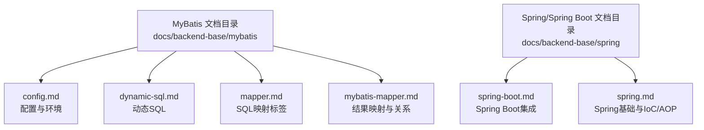
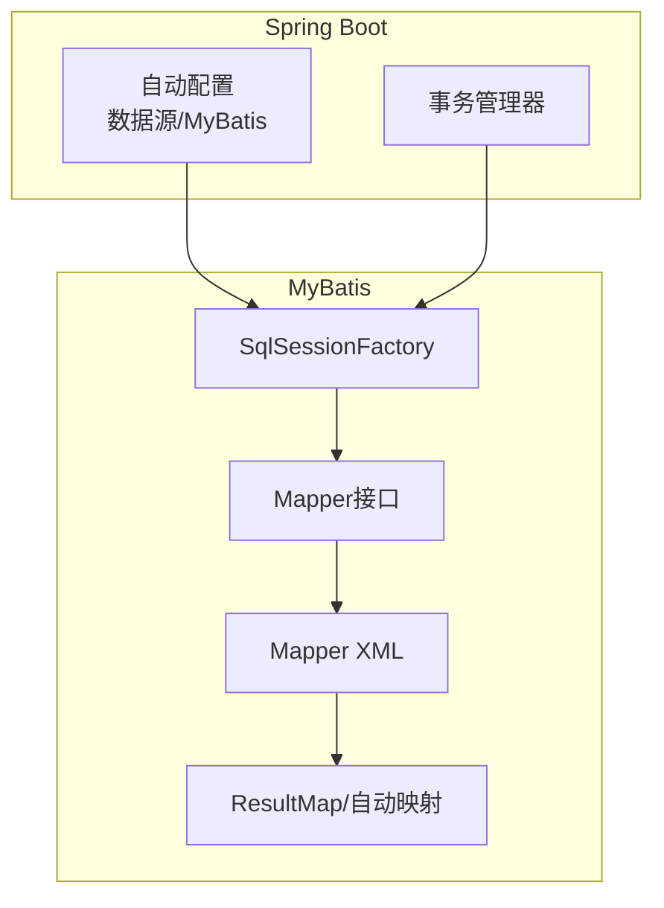
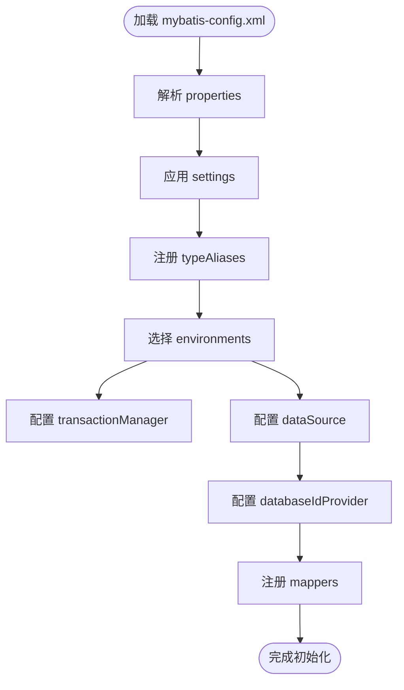
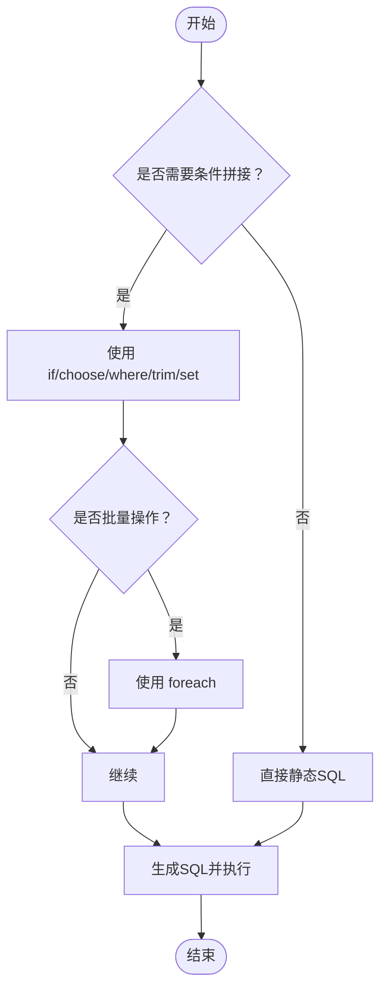
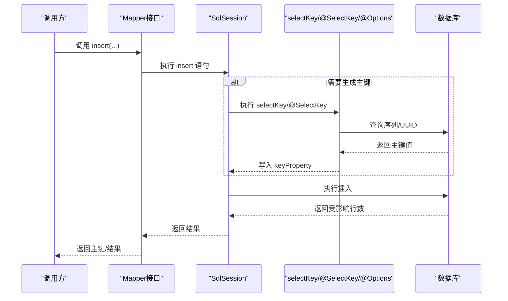
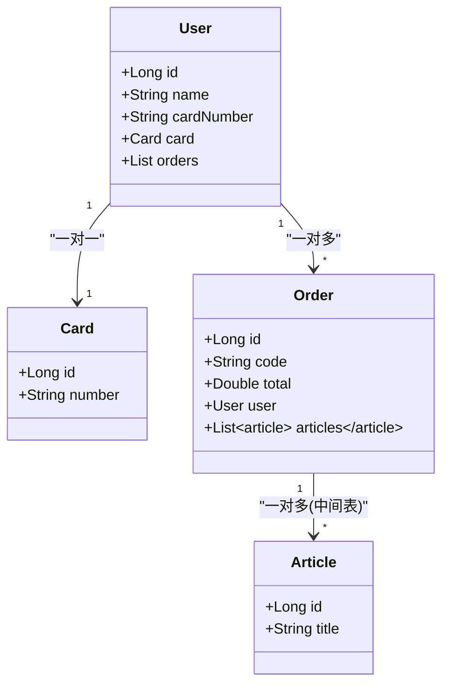
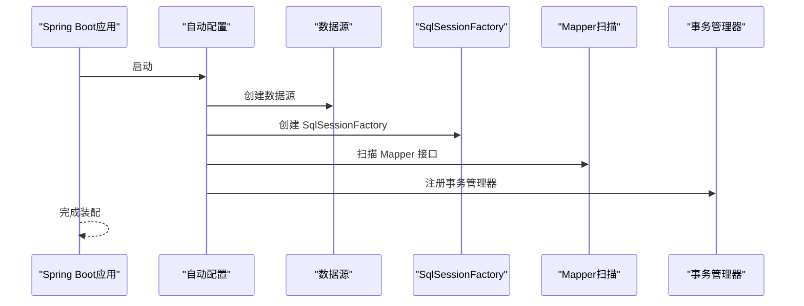

# MyBatis框架

<cite>
**本文引用的文件**
- [config.md](file://docs/backend-base/mybatis/config.md)
- [dynamic-sql.md](file://docs/backend-base/mybatis/dynamic-sql.md)
- [mapper.md](file://docs/backend-base/mybatis/mapper.md)
- [mybatis-mapper.md](file://docs/backend-base/mybatis/mybatis-mapper.md)
- [spring-boot.md](file://docs/backend-base/spring/spring-boot.md)
- [spring.md](file://docs/backend-base/spring/spring.md)
</cite>

## 目录
1. [简介](#简介)
2. [项目结构](#项目结构)
3. [核心组件](#核心组件)
4. [架构总览](#架构总览)
5. [详细组件分析](#详细组件分析)
6. [依赖分析](#依赖分析)
7. [性能考量](#性能考量)
8. [故障排查指南](#故障排查指南)
9. [结论](#结论)
10. [附录](#附录)

## 简介
本技术文档围绕MyBatis框架展开，系统梳理其核心概念、配置文件、动态SQL、Mapper接口与映射机制，并结合Spring/Spring Boot集成实践，给出最佳实践与性能优化策略。文档面向Java持久层开发者，兼顾初学者与进阶读者，帮助快速掌握MyBatis在实际项目中的落地方法。

## 项目结构
本仓库中与MyBatis相关的核心文档位于docs/backend-base/mybatis目录，配套Spring/Spring Boot集成说明位于docs/backend-base/spring目录。MyBatis相关文档包括：
- 配置文件与环境：config.md
- 动态SQL：dynamic-sql.md
- SQL映射与标签：mapper.md
- 结果映射与复杂关系：mybatis-mapper.md

Spring集成与Spring Boot自动装配相关内容位于spring-boot.md与spring.md中，用于指导MyBatis与Spring生态的协同工作。



**图表来源**
- [config.md:1-240](file://docs/backend-base/mybatis/config.md#L1-L240)
- [dynamic-sql.md:1-278](file://docs/backend-base/mybatis/dynamic-sql.md#L1-L278)
- [mapper.md:1-242](file://docs/backend-base/mybatis/mapper.md#L1-L242)
- [mybatis-mapper.md:1-488](file://docs/backend-base/mybatis/mybatis-mapper.md#L1-L488)
- [spring-boot.md:2098-3331](file://docs/backend-base/spring/spring-boot.md#L2098-L3331)
- [spring.md:1-10735](file://docs/backend-base/spring/spring.md#L1-L10735)

**章节来源**
- [config.md:1-240](file://docs/backend-base/mybatis/config.md#L1-L240)
- [dynamic-sql.md:1-278](file://docs/backend-base/mybatis/dynamic-sql.md#L1-L278)
- [mapper.md:1-242](file://docs/backend-base/mybatis/mapper.md#L1-L242)
- [mybatis-mapper.md:1-488](file://docs/backend-base/mybatis/mybatis-mapper.md#L1-L488)
- [spring-boot.md:2098-3331](file://docs/backend-base/spring/spring-boot.md#L2098-L3331)
- [spring.md:1-10735](file://docs/backend-base/spring/spring.md#L1-L10735)

## 核心组件
- 配置文件与环境：涵盖properties、settings、typeAliases、environments（含transactionManager与dataSource）、databaseIdProvider、mappers等配置要点与最佳实践。
- 动态SQL：if/choose/where/trim/set/foreach/bind等标签的使用场景与注意事项。
- SQL映射标签：select/insert/update/delete及selectKey/@SelectKey/@Options等主键生成策略。
- 结果映射：resultType/resultMap、自动映射、id/result/constructor、association/collection等复杂关系映射。
- Spring/Spring Boot集成：数据源、SqlSessionFactory、Mapper扫描、事务管理、自动配置等。

**章节来源**
- [config.md:54-240](file://docs/backend-base/mybatis/config.md#L54-L240)
- [dynamic-sql.md:3-278](file://docs/backend-base/mybatis/dynamic-sql.md#L3-L278)
- [mapper.md:5-176](file://docs/backend-base/mybatis/mapper.md#L5-L176)
- [mybatis-mapper.md:5-488](file://docs/backend-base/mybatis/mybatis-mapper.md#L5-L488)
- [spring-boot.md:2098-3331](file://docs/backend-base/spring/spring-boot.md#L2098-L3331)

## 架构总览
MyBatis在Spring生态中的典型工作流：
- Spring Boot自动配置提供数据源与MyBatis自动装配；
- 通过@MapperScan或MapperScannerConfigurer扫描Mapper接口；
- SqlSessionFactoryBean负责创建SqlSessionFactory；
- Mapper接口与XML映射文件协作，执行SQL并返回结果；
- Spring事务管理器与MyBatis事务管理器协同工作。



**图表来源**
- [spring-boot.md:2098-3331](file://docs/backend-base/spring/spring-boot.md#L2098-L3331)
- [config.md:106-240](file://docs/backend-base/mybatis/config.md#L106-L240)
- [mapper.md:46-176](file://docs/backend-base/mybatis/mapper.md#L46-L176)
- [mybatis-mapper.md:5-488](file://docs/backend-base/mybatis/mybatis-mapper.md#L5-L488)

## 详细组件分析

### 配置文件与环境
- properties：支持外部属性文件与运行时传入，占位符支持默认值。
- settings：涵盖缓存、驼峰映射、日志实现、参数名使用、SQL空白压缩等关键设置。
- typeAliases：为Java类型设置简短别名，减少XML冗余。
- environments：多环境配置，transactionManager支持JDBC/MANAGED；dataSource支持UNPOOLED/POOLED/JNDI。
- databaseIdProvider：按数据库厂商选择SQL语句。
- mappers：资源路径、URL、接口类、包扫描四种注册方式。



**图表来源**
- [config.md:3-240](file://docs/backend-base/mybatis/config.md#L3-L240)

**章节来源**
- [config.md:3-240](file://docs/backend-base/mybatis/config.md#L3-L240)

### 动态SQL
- if：条件判断，常用于where、insert、update。
- choose/when/otherwise：类似switch，择一执行。
- where：自动处理AND/OR前缀，避免语法错误。
- trim：prefix/suffix/prefixOverrides/suffixOverrides，灵活裁剪SQL片段。
- set：自动前置SET并去除尾部逗号。
- foreach：IN条件与批量插入，支持collection/item/index/open/separator/close。
- bind：在映射文件中定义变量，便于模糊匹配等场景。



**图表来源**
- [dynamic-sql.md:3-278](file://docs/backend-base/mybatis/dynamic-sql.md#L3-L278)

**章节来源**
- [dynamic-sql.md:3-278](file://docs/backend-base/mybatis/dynamic-sql.md#L3-L278)

### SQL映射与主键生成
- select/insert/update/delete标签属性详解：id、parameterType、resultType/resultMap、flushCache/useCache、timeout、statementType、resultSetType、databaseId、resultOrdered、resultSets等。
- insert特有属性：useGeneratedKeys、keyProperty、keyColumn。
- selectKey/@SelectKey/@Options：在insert前后生成主键，支持自定义序列/UUID等策略。



**图表来源**
- [mapper.md:92-176](file://docs/backend-base/mybatis/mapper.md#L92-L176)

**章节来源**
- [mapper.md:5-176](file://docs/backend-base/mybatis/mapper.md#L5-L176)

### 结果映射与复杂关系
- 简单映射：resultType与自动映射，mapUnderscoreToCamelCase提升命名适配。
- 复杂映射：id/result/constructor、association（一对一/一对多）、collection（集合映射）。
- 嵌套查询与嵌套结果映射：两种加载策略，注意N+1问题与懒加载策略。
- 注解方式：@Results/@Result/@One/@Many等注解映射复杂关系。



**图表来源**
- [mybatis-mapper.md:300-488](file://docs/backend-base/mybatis/mybatis-mapper.md#L300-L488)

**章节来源**
- [mybatis-mapper.md:5-488](file://docs/backend-base/mybatis/mybatis-mapper.md#L5-L488)

### Spring与Spring Boot集成
- Spring Boot自动配置：自动装配数据源、MyBatis、Mapper扫描、事务管理器。
- 传统Spring集成：SqlSessionFactoryBean、MapperScannerConfigurer、DataSourceTransactionManager、@EnableTransactionManagement。
- 配置要点：application.properties/yml中数据源与MyBatis配置项、@MapperScan扫描包、驼峰映射等。



**图表来源**
- [spring-boot.md:2098-3331](file://docs/backend-base/spring/spring-boot.md#L2098-L3331)

**章节来源**
- [spring-boot.md:2098-3331](file://docs/backend-base/spring/spring-boot.md#L2098-L3331)
- [spring.md:1-10735](file://docs/backend-base/spring/spring.md#L1-L10735)

## 依赖分析
- MyBatis与Spring：MyBatis通过mybatis-spring或mybatis-spring-boot-starter与Spring容器集成，借助SqlSessionFactoryBean与MapperScannerConfigurer完成Bean注册与Mapper扫描。
- 事务管理：Spring事务管理器与MyBatis事务管理器协同，Spring Boot中可通过@EnableTransactionManagement启用注解事务。
- 数据源：Spring Boot默认使用HikariCP，可配置Druid、DBCP2等；MyBatis配置中可使用JNDI数据源。

```mermaid
graph LR
MB["MyBatis"] <- --> MSB["mybatis-spring / mybatis-spring-boot-starter"]
MSB --> SC["Spring Container"]
SC --> TX["Spring Transaction Manager"]
SC --> DS["DataSource"]
DS --> DB["Database"]
```

**图表来源**
- [spring-boot.md:2098-3331](file://docs/backend-base/spring/spring-boot.md#L2098-L3331)
- [config.md:148-197](file://docs/backend-base/mybatis/config.md#L148-L197)

**章节来源**
- [spring-boot.md:2098-3331](file://docs/backend-base/spring/spring-boot.md#L2098-L3331)
- [config.md:148-197](file://docs/backend-base/mybatis/config.md#L148-L197)

## 性能考量
- 映射与缓存
  - 启用驼峰映射以减少列别名配置，提升开发效率与可维护性。
  - 合理使用二级缓存与本地缓存，注意缓存一致性与失效策略。
- SQL优化
  - 使用动态SQL避免硬编码，减少分支与重复SQL。
  - foreach批量插入时注意批处理大小与数据库驱动支持。
- 连接池与事务
  - 选择合适的连接池（HikariCP/Druid），合理配置连接数与超时。
  - Spring事务管理器与MyBatis事务管理器配合，避免重复事务边界。
- 结果映射
  - 复杂关系映射优先嵌套结果映射，减少N+1查询；必要时使用懒加载降低初始负载。
- 日志与监控
  - 配置合适的日志实现（如SLF4J/Log4j2），便于定位慢SQL与异常。

[本节为通用性能建议，不直接分析具体文件]

## 故障排查指南
- 动态SQL语法错误
  - where标签末尾追加“and/or”会导致语法错误，应使用trim或重构条件。
  - if条件中字符串比较需注意空值与空串判断。
- 主键生成问题
  - useGeneratedKeys与keyProperty配置不当会导致主键丢失或类型不匹配。
  - selectKey顺序（BEFORE/AFTER）与数据库方言不匹配时需调整。
- 结果映射不一致
  - 数据库字段与Java属性命名不一致时，启用驼峰映射或使用resultMap明确映射。
  - 集合映射ofType与集合元素类型不一致会导致类型转换异常。
- Spring集成问题
  - 未正确扫描Mapper接口或未配置SqlSessionFactory导致Bean无法注入。
  - 事务注解未生效时检查@EnableTransactionManagement与事务管理器配置。

**章节来源**
- [dynamic-sql.md:115-155](file://docs/backend-base/mybatis/dynamic-sql.md#L115-L155)
- [mapper.md:86-176](file://docs/backend-base/mybatis/mapper.md#L86-L176)
- [mybatis-mapper.md:66-88](file://docs/backend-base/mybatis/mybatis-mapper.md#L66-L88)
- [spring-boot.md:2098-3331](file://docs/backend-base/spring/spring-boot.md#L2098-L3331)

## 结论
MyBatis以其灵活的SQL控制能力与强大的映射机制，成为Java持久层的重要选择。通过合理的配置、动态SQL与结果映射设计，结合Spring/Spring Boot的自动装配与事务管理，可在保证性能的同时提升开发效率与可维护性。建议在实际项目中：
- 明确命名规范与驼峰映射策略；
- 合理使用动态SQL与批量操作；
- 重视复杂关系映射的加载策略与缓存设计；
- 借助Spring生态完善数据源、事务与监控体系。

[本节为总结性内容，不直接分析具体文件]

## 附录
- 常用配置项速查
  - properties：占位符与默认值、运行时传入。
  - settings：cacheEnabled、mapUnderscoreToCamelCase、localCacheScope、jdbcTypeForNull、logImpl等。
  - typeAliases：包扫描与注解别名。
  - environments：JDBC/MANAGED事务管理器与UNPOOLED/POOLED/JNDI数据源。
  - databaseIdProvider：DB_VENDOR与厂商映射。
  - mappers：resource/url/class/package四种注册方式。
- Spring Boot集成要点
  - application.yml中配置数据源与MyBatis相关属性；
  - @MapperScan扫描Mapper接口；
  - 自动装配SqlSessionFactory与事务管理器。

**章节来源**
- [config.md:54-240](file://docs/backend-base/mybatis/config.md#L54-L240)
- [spring-boot.md:2098-3331](file://docs/backend-base/spring/spring-boot.md#L2098-L3331)