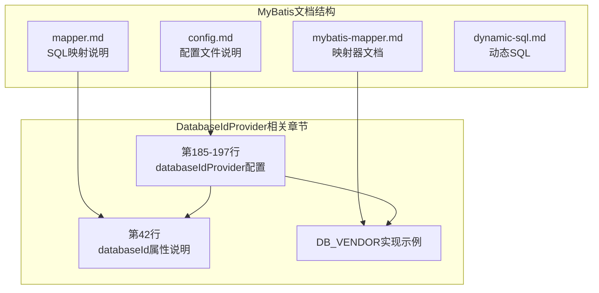
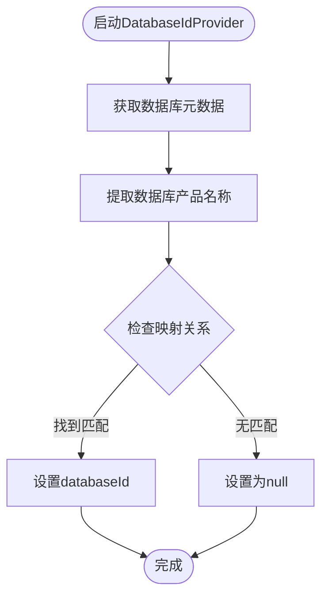
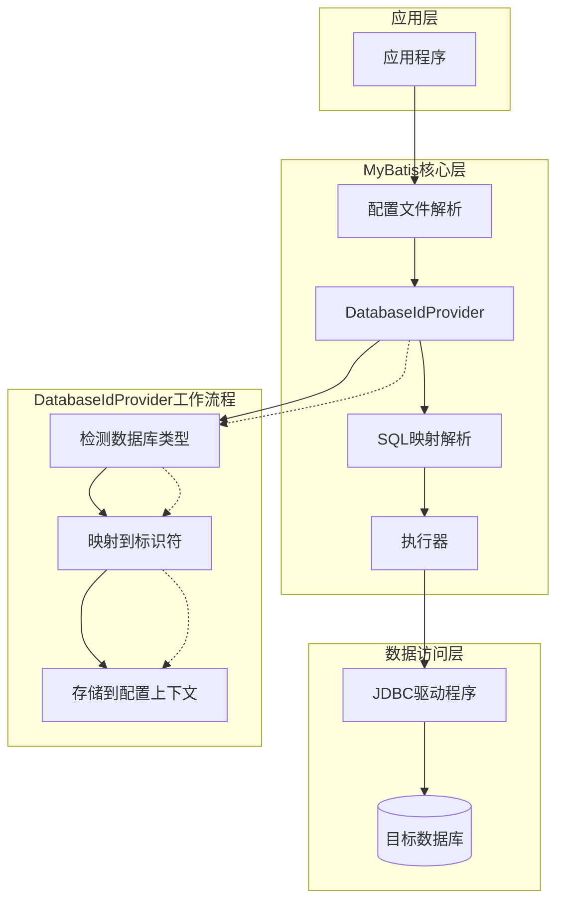
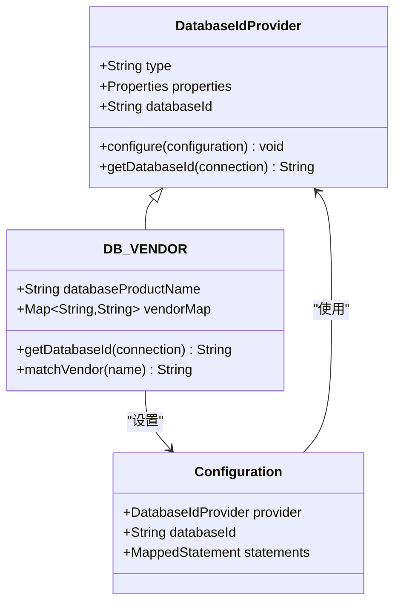
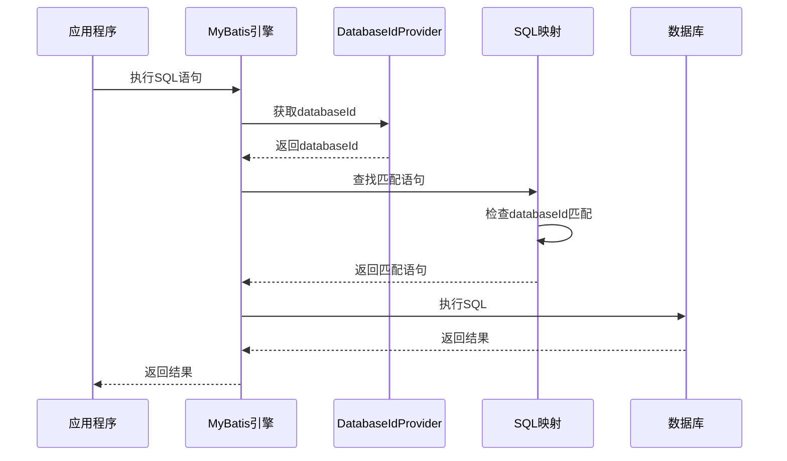
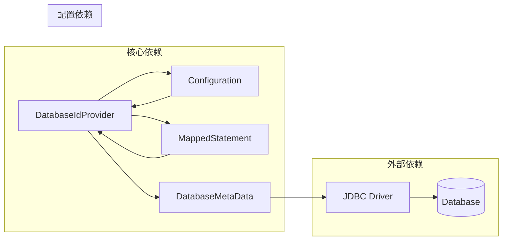

# DatabaseIdProvider数据库标识

<cite>
**本文档引用的文件**
- [config.md](file://docs/backend-base/mybatis/config.md)
- [mapper.md](file://docs/backend-base/mybatis/mapper.md)
- [mybatis-mapper.md](file://docs/backend-base/mybatis/mybatis-mapper.md)
- [dynamic-sql.md](file://docs/backend-base/mybatis/dynamic-sql.md)
</cite>

## 目录
1. [简介](#简介)
2. [项目结构](#项目结构)
3. [核心组件](#核心组件)
4. [架构概览](#架构概览)
5. [详细组件分析](#详细组件分析)
6. [依赖关系分析](#依赖关系分析)
7. [性能考量](#性能考量)
8. [故障排除指南](#故障排除指南)
9. [结论](#结论)
10. [附录](#附录)

## 简介

DatabaseIdProvider是MyBatis框架中的关键组件，负责为不同的数据库管理系统提供统一的标识符。它实现了MyBatis多数据库厂商支持的核心机制，允许开发者为不同数据库平台编写特定的SQL语句，同时保持代码的可移植性和一致性。

在现代企业级应用开发中，应用程序往往需要支持多种数据库后端，包括MySQL、Oracle、SQL Server、DB2等主流数据库。DatabaseIdProvider通过自动检测当前连接的数据库类型，为MyBatis提供相应的databaseId，从而实现数据库无关的应用程序设计。

## 项目结构

MyBatis DatabaseIdProvider相关的文档分布在项目的MyBatis基础文档中，主要包含配置说明、SQL映射和最佳实践等内容。



**图表来源**
- [config.md:185-197](file://docs/backend-base/mybatis/config.md#L185-L197)
- [mapper.md:42](file://docs/backend-base/mybatis/mapper.md#L42)

**章节来源**
- [config.md:185-197](file://docs/backend-base/mybatis/config.md#L185-L197)
- [mapper.md:42](file://docs/backend-base/mybatis/mapper.md#L42)

## 核心组件

### DatabaseIdProvider概述

DatabaseIdProvider是MyBatis的核心组件之一，负责根据当前数据库连接的元数据信息生成相应的databaseId。这个组件的实现基于DB_VENDOR策略，能够自动识别数据库产品名称并与预定义的映射关系进行匹配。

#### 主要功能特性

1. **自动数据库识别**：通过JDBC驱动程序提供的数据库元数据信息，自动识别当前连接的数据库类型
2. **映射关系管理**：维护数据库产品名称与MyBatis内部标识符之间的映射关系
3. **优先级处理**：在存在多个匹配项时，按照配置顺序选择第一个匹配的映射关系
4. **默认值处理**：当没有找到匹配的映射关系时，设置databaseId为"null"

### DB_VENDOR实现机制

DB_VENDOR是DatabaseIdProvider的默认实现策略，它的工作原理基于以下机制：



**图表来源**
- [config.md:197](file://docs/backend-base/mybatis/config.md#L197)

**章节来源**
- [config.md:185-197](file://docs/backend-base/mybatis/config.md#L185-L197)

## 架构概览

DatabaseIdProvider在整个MyBatis架构中扮演着关键的角色，它位于配置层和SQL映射层之间，为SQL语句的选择提供决策依据。



**图表来源**
- [config.md:187-197](file://docs/backend-base/mybatis/config.md#L187-L197)

## 详细组件分析

### DatabaseIdProvider配置详解

#### 基本配置结构

DatabaseIdProvider的配置采用XML格式，位于mybatis-config.xml文件中。配置的基本结构包括type属性和多个property子元素。



**图表来源**
- [config.md:189-194](file://docs/backend-base/mybatis/config.md#L189-L194)

#### 配置示例分析

标准的DatabaseIdProvider配置示例如下：

| 数据库类型 | 产品名称 | MyBatis标识符 |
|-----------|----------|---------------|
| SQL Server | SQL Server | sqlserver |
| DB2 | DB2 | db2 |
| Oracle | Oracle | oracle |

**章节来源**
- [config.md:190-194](file://docs/backend-base/mybatis/config.md#L190-L194)

### SQL映射中的databaseId使用

#### 语句选择规则

在SQL映射文件中，databaseId属性决定了语句的可见性和优先级。MyBatis遵循以下选择规则：

1. **优先级原则**：同时存在带databaseId和不带databaseId的相同语句时，带databaseId的语句优先
2. **匹配原则**：只加载与当前databaseId完全匹配的语句
3. **回退原则**：当没有匹配的带databaseId语句时，加载不带databaseId的语句



**图表来源**
- [config.md:187](file://docs/backend-base/mybatis/config.md#L187)

**章节来源**
- [config.md:187](file://docs/backend-base/mybatis/config.md#L187)

### 多数据库厂商支持机制

#### 支持的数据库类型

MyBatis通过DatabaseIdProvider支持多种主流数据库厂商：

| 数据库厂商 | 支持标识符 | 产品示例 |
|-----------|------------|----------|
| Microsoft | sqlserver | SQL Server, Azure SQL Database |
| IBM | db2 | DB2 LUW, DB2 z/OS |
| Oracle Corporation | oracle | Oracle Database, Oracle Autonomous Database |
| MySQL AB | mysql | MySQL, MariaDB |
| PostgreSQL | postgresql | PostgreSQL, TimescaleDB |

#### 配置最佳实践

1. **明确映射关系**：确保每个支持的数据库都有明确的映射关系
2. **版本兼容性**：考虑不同数据库版本的兼容性问题
3. **性能优化**：合理组织SQL语句，避免重复定义

**章节来源**
- [config.md:190-194](file://docs/backend-base/mybatis/config.md#L190-L194)

## 依赖关系分析

DatabaseIdProvider与其他MyBatis组件之间存在密切的依赖关系：



**图表来源**
- [config.md:187-197](file://docs/backend-base/mybatis/config.md#L187-L197)

**章节来源**
- [config.md:187-197](file://docs/backend-base/mybatis/config.md#L187-L197)

## 性能考量

### DatabaseIdProvider性能特征

1. **初始化成本**：DatabaseIdProvider在MyBatis初始化时创建，具有较低的运行时开销
2. **查询性能影响**：databaseId匹配过程对SQL执行性能影响微乎其微
3. **内存占用**：主要占用少量内存存储映射关系和缓存信息

### 优化建议

1. **合理的映射数量**：避免配置过多不常用的数据库映射关系
2. **语句组织**：将常用的SQL语句放在不带databaseId的版本中
3. **测试验证**：在部署前充分测试不同数据库环境下的行为

## 故障排除指南

### 常见问题及解决方案

#### 问题1：databaseId始终为null

**症状**：所有带databaseId的语句都不生效，只有不带databaseId的语句执行

**可能原因**：
1. DatabaseIdProvider配置错误
2. 数据库驱动程序不支持元数据获取
3. 映射关系配置不正确

**解决方案**：
1. 检查mybatis-config.xml中的DatabaseIdProvider配置
2. 验证数据库连接是否正常
3. 确认映射关系中的数据库产品名称与实际数据库匹配

#### 问题2：SQL语句选择不符合预期

**症状**：MyBatis选择了错误的SQL语句版本

**可能原因**：
1. databaseId匹配逻辑不符合预期
2. 同一语句存在带和不带databaseId的版本
3. 配置顺序影响了优先级

**解决方案**：
1. 检查语句的databaseId属性设置
2. 确保带databaseId的语句优先级正确
3. 验证映射关系的准确性

#### 问题3：新数据库类型支持缺失

**症状**：新增数据库类型不被识别

**解决方案**：
1. 在DatabaseIdProvider配置中添加新的映射关系
2. 测试新数据库的连接和元数据获取
3. 验证SQL语句的兼容性

**章节来源**
- [config.md:187-197](file://docs/backend-base/mybatis/config.md#L187-L197)

## 结论

DatabaseIdProvider作为MyBatis多数据库支持的核心组件，为构建跨数据库的应用程序提供了强大的基础设施。通过合理的配置和使用，开发者可以轻松实现数据库无关的应用程序设计，同时保持各数据库特有的SQL优化能力。

成功的DatabaseIdProvider配置需要：
1. 准确的数据库识别和映射
2. 清晰的SQL语句组织和优先级管理
3. 充分的测试和验证
4. 良好的维护和更新机制

随着企业应用对多数据库支持需求的增长，DatabaseIdProvider将继续发挥重要作用，帮助开发者构建更加灵活和可移植的数据库应用程序。

## 附录

### 配置示例参考

#### 完整的DatabaseIdProvider配置示例

```xml
<databaseIdProvider type="DB_VENDOR">
  <property name="SQL Server" value="sqlserver"/>
  <property name="DB2" value="db2"/>
  <property name="Oracle" value="oracle"/>
  <property name="MySQL" value="mysql"/>
  <property name="PostgreSQL" value="postgresql"/>
</databaseIdProvider>
```

#### SQL语句中的databaseId使用示例

```xml
<select id="getUser" parameterType="int" databaseId="sqlserver">
  SELECT * FROM users WHERE id = ?
</select>

<select id="getUser" parameterType="int" databaseId="oracle">
  SELECT * FROM users WHERE id = :id
</select>

<select id="getUser" parameterType="int">
  SELECT * FROM users WHERE id = #{id}
</select>
```

### 最佳实践清单

1. **配置验证**：定期验证DatabaseIdProvider配置的准确性
2. **测试覆盖**：为每个支持的数据库类型建立测试用例
3. **文档维护**：保持数据库支持列表和映射关系的文档更新
4. **性能监控**：监控不同数据库环境下的性能表现
5. **故障预案**：制定数据库切换和故障恢复的应急预案