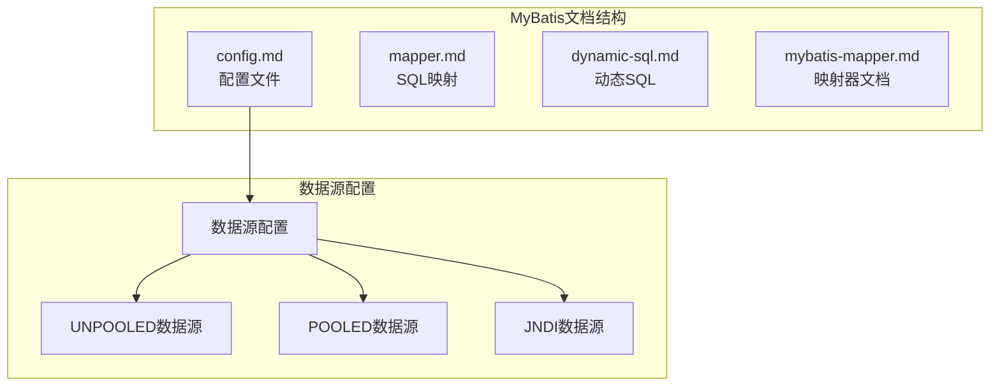
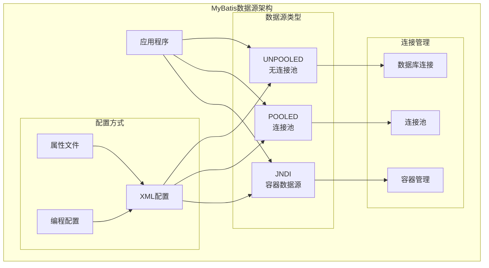
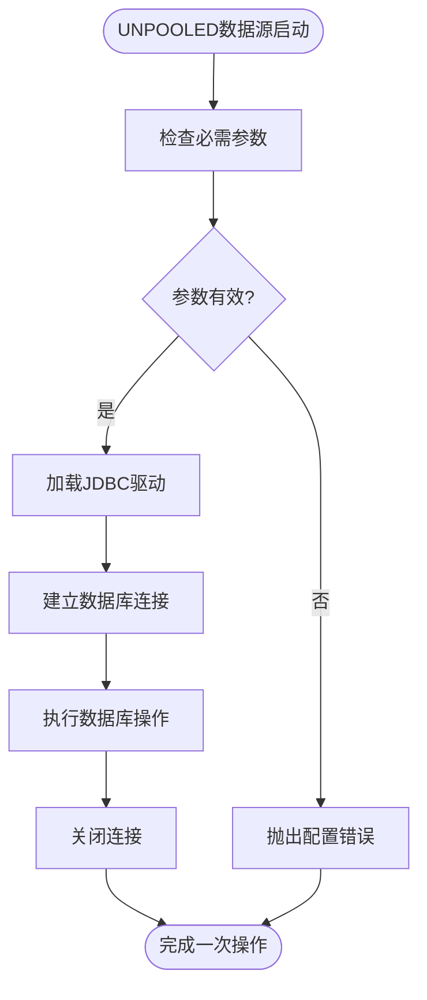
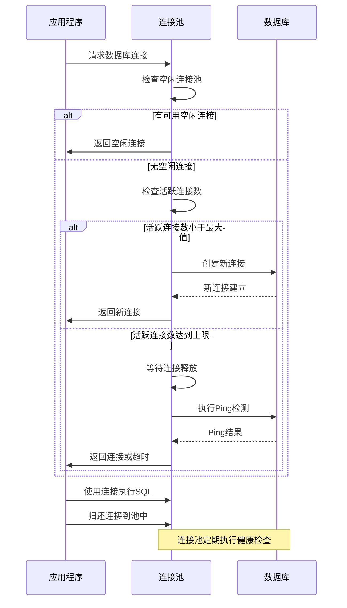
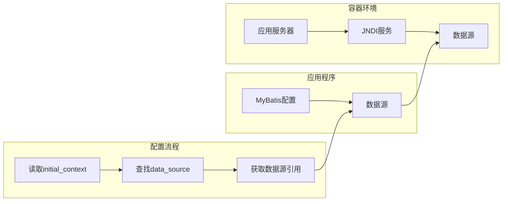
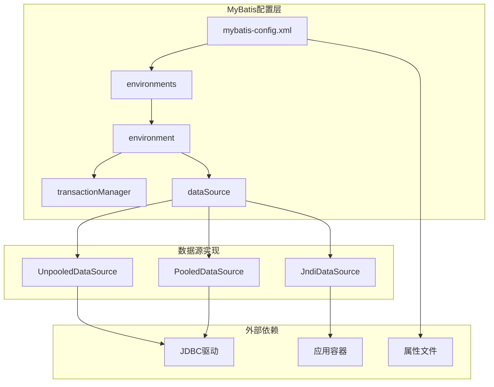

# DataSource数据源配置

<cite>
**本文档引用的文件**
- [config.md](file://docs/backend-base/mybatis/config.md)
- [mapper.md](file://docs/backend-base/mybatis/mapper.md)
- [dynamic-sql.md](file://docs/backend-base/mybatis/dynamic-sql.md)
- [mybatis-mapper.md](file://docs/backend-base/mybatis/mybatis-mapper.md)
</cite>

## 目录
1. [简介](#简介)
2. [项目结构](#项目结构)
3. [核心组件](#核心组件)
4. [架构概览](#架构概览)
5. [详细组件分析](#详细组件分析)
6. [依赖分析](#依赖分析)
7. [性能考虑](#性能考虑)
8. [故障排除指南](#故障排除指南)
9. [结论](#结论)

## 简介

MyBatis是一个优秀的持久层框架，它支持定制化SQL、存储过程以及高级映射。数据源配置是MyBatis配置中的关键组成部分，直接影响应用程序的性能和稳定性。本文档将深入解析MyBatis的三种数据源实现：UNPOOLED、POOLED和JNDI，详细说明它们的特点、适用场景以及配置方法。

## 项目结构

该项目是一个基于VuePress的文档站点，专门用于记录和分享技术知识。MyBatis相关的文档集中在`docs/backend-base/mybatis/`目录下，包含配置、映射器、动态SQL等多个方面的内容。

**图表来源**
- [config.md:148-184](file://docs/backend-base/mybatis/config.md#L148-L184)

**章节来源**
- [config.md:148-184](file://docs/backend-base/mybatis/config.md#L148-L184)

## 核心组件

MyBatis数据源配置的核心组件包括三个主要的数据源类型，每种都有其独特的特点和适用场景：

### UNPOOLED数据源

UNPOOLED数据源是最简单的数据源实现，它在每次数据库请求时都会创建和销毁连接。这种设计虽然简单，但在某些场景下非常有用。

### POOLED数据源

POOLED数据源实现了连接池机制，通过复用数据库连接来提高应用程序的性能。这是Web应用程序中最常用的数据源类型。

### JNDI数据源

JNDI数据源专为容器环境设计，允许应用程序从JNDI上下文中查找数据源配置，适用于EJB或应用服务器环境。

**章节来源**
- [config.md:152-184](file://docs/backend-base/mybatis/config.md#L152-L184)

## 架构概览

MyBatis数据源配置的整体架构展示了三种数据源类型的层次关系和配置方式。

**图表来源**
- [config.md:28-35](file://docs/backend-base/mybatis/config.md#L28-L35)
- [config.md:110-124](file://docs/backend-base/mybatis/config.md#L110-L124)

## 详细组件分析

### UNPOOLED数据源分析

UNPOOLED数据源是最基础的数据源实现，它直接管理数据库连接的生命周期。

#### 配置参数详解

UNPOOLED数据源支持以下基本配置参数：

| 参数名称 | 类型 | 描述 | 默认值 |
|---------|------|------|--------|
| driver | String | JDBC驱动的完整类名 | 必需 |
| url | String | 数据库连接URL | 必需 |
| username | String | 数据库用户名 | 必需 |
| password | String | 数据库密码 | 必需 |
| defaultTransactionIsolationLevel | Integer | 默认事务隔离级别 | 未设置 |
| defaultNetworkTimeout | Integer | 默认网络超时时间(毫秒) | 未设置 |

#### 适用场景

UNPOOLED数据源适用于以下场景：
- 简单的应用程序，不需要连接池
- 数据库连接可用性要求不高的场景
- 开发和测试环境
- 低并发的应用程序

**图表来源**
- [config.md:152-162](file://docs/backend-base/mybatis/config.md#L152-L162)

**章节来源**
- [config.md:152-162](file://docs/backend-base/mybatis/config.md#L152-L162)

### POOLED数据源分析

POOLED数据源实现了完整的连接池管理机制，是Web应用程序中最常用的选择。

#### 连接池配置参数详解

POOLED数据源除了支持UNPOOLED的所有参数外，还提供以下连接池专用配置：

| 参数名称 | 类型 | 描述 | 默认值 |
|---------|------|------|--------|
| poolMaximumActiveConnections | Integer | 最大活跃连接数 | 10 |
| poolMaximumIdleConnections | Integer | 最大空闲连接数 | 未设置 |
| poolMaximumCheckoutTime | Integer | 最大连接检查时间(毫秒) | 20000 |
| poolTimeToWait | Integer | 等待新连接的时间(毫秒) | 20000 |
| poolMaximumLocalBadConnectionTolerance | Integer | 坏连接容忍度 | 3 |
| poolPingQuery | String | Ping查询SQL | "NO PING QUERY SET" |
| poolPingEnabled | Boolean | 是否启用Ping检测 | false |
| poolPingConnectionsNotUsedFor | Integer | Ping检测间隔(毫秒) | 0 |

#### 连接池工作机制

**图表来源**
- [config.md:163-177](file://docs/backend-base/mybatis/config.md#L163-L177)

#### 连接池调优建议

基于配置参数的含义，以下是POOLED数据源的调优建议：

1. **poolMaximumActiveConnections**: 根据数据库的最大连接数和应用程序的并发需求设置
2. **poolMaximumIdleConnections**: 通常设置为活跃连接数的1/3到1/2
3. **poolMaximumCheckoutTime**: 根据数据库操作的平均时间设置，避免长时间占用连接
4. **poolTimeToWait**: 设置合理的等待时间，避免应用程序长时间阻塞
5. **poolPingEnabled**: 在生产环境中建议启用，确保连接的健康状态

**章节来源**
- [config.md:163-177](file://docs/backend-base/mybatis/config.md#L163-L177)

### JNDI数据源分析

JNDI数据源专为容器环境设计，允许应用程序从JNDI上下文中查找数据源配置。

#### 配置参数详解

JNDI数据源支持以下配置参数：

| 参数名称 | 类型 | 描述 | 默认值 |
|---------|------|------|--------|
| initial_context | String | 初始上下文名称 | 可选 |
| data_source | String | 数据源引用路径 | 必需 |

#### 容器集成优势

**图表来源**
- [config.md:178-184](file://docs/backend-base/mybatis/config.md#L178-L184)

**章节来源**
- [config.md:178-184](file://docs/backend-base/mybatis/config.md#L178-L184)

## 依赖分析

MyBatis数据源配置与其他组件的依赖关系展示了完整的数据访问层架构。

**图表来源**
- [config.md:28-35](file://docs/backend-base/mybatis/config.md#L28-L35)
- [config.md:110-124](file://docs/backend-base/mybatis/config.md#L110-L124)

**章节来源**
- [config.md:28-35](file://docs/backend-base/mybatis/config.md#L28-L35)
- [config.md:110-124](file://docs/backend-base/mybatis/config.md#L110-L124)

## 性能考虑

### 数据源类型性能对比

| 特性 | UNPOOLED | POOLED | JNDI |
|------|----------|--------|------|
| 连接创建成本 | 高 | 低 | 中等 |
| 连接复用 | 否 | 是 | 视容器而定 |
| 内存占用 | 低 | 中等 | 视容器而定 |
| 配置复杂度 | 低 | 中等 | 高 |
| 适用场景 | 小型应用 | Web应用 | 容器环境 |
| 性能表现 | 一般 | 优秀 | 优秀 |

### 选择指导原则

#### 选择UNPOOLED的场景
- 应用程序规模很小
- 数据库连接需求很少
- 开发和测试环境
- 不需要连接池的简单场景

#### 选择POOLED的场景
- Web应用程序
- 需要高并发处理能力
- 生产环境的首选方案
- 需要连接池管理的场景

#### 选择JNDI的场景
- 部署在应用服务器上
- 需要容器级别的连接池管理
- 企业级应用
- 需要统一的数据源配置管理

### 性能调优建议

1. **连接池大小调优**
   - 根据数据库的最大连接数设置`poolMaximumActiveConnections`
   - 合理设置`poolMaximumIdleConnections`避免过度占用内存

2. **超时参数优化**
   - 根据数据库响应时间调整`poolMaximumCheckoutTime`
   - 设置合适的`poolTimeToWait`避免长时间阻塞

3. **健康检查配置**
   - 启用`poolPingEnabled`确保连接有效性
   - 合理设置`poolPingConnectionsNotUsedFor`平衡性能和可靠性

## 故障排除指南

### 常见配置问题

#### 连接失败问题
- 检查JDBC驱动是否正确加载
- 验证数据库URL格式是否正确
- 确认用户名和密码配置正确

#### 连接池问题
- 监控活跃连接数是否超过限制
- 检查连接超时设置是否合理
- 验证连接池健康检查配置

#### JNDI查找问题
- 确认JNDI上下文配置正确
- 验证数据源引用路径
- 检查应用服务器的JNDI配置

### 调试技巧

1. **启用详细日志**
   - 配置MyBatis日志输出
   - 监控连接池状态变化
   - 记录数据库操作性能指标

2. **性能监控**
   - 监控连接池利用率
   - 分析数据库响应时间
   - 跟踪应用程序性能瓶颈

3. **故障诊断**
   - 使用数据库客户端工具验证连接
   - 检查防火墙和网络连接
   - 验证数据库权限配置

**章节来源**
- [config.md:163-177](file://docs/backend-base/mybatis/config.md#L163-L177)

## 结论

MyBatis数据源配置提供了灵活而强大的数据库连接管理机制。通过理解UNPOOLED、POOLED和JNDI三种数据源的特点和适用场景，开发者可以根据具体的应用需求选择最合适的数据源类型。

UNPOOLED数据源适合简单应用场景，POOLED数据源是Web应用的标准选择，而JNDI数据源则为容器环境提供了最佳的集成方案。合理的配置和调优能够显著提升应用程序的性能和稳定性。

在实际部署中，建议根据应用程序的规模、并发需求和部署环境来选择合适的数据源类型，并结合监控工具持续优化连接池配置，以达到最佳的性能表现。