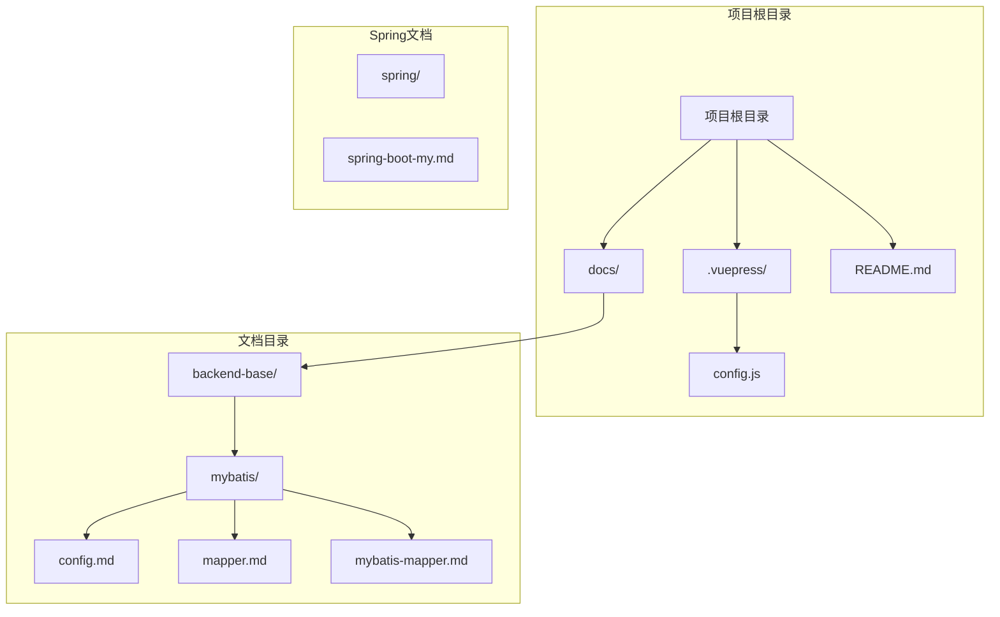
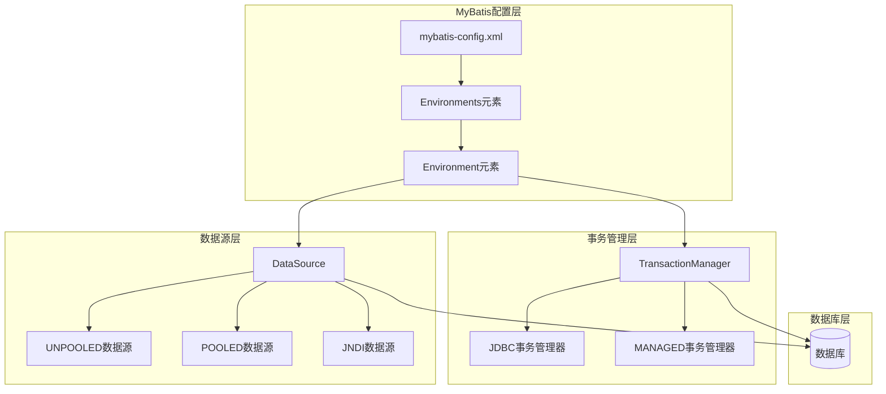
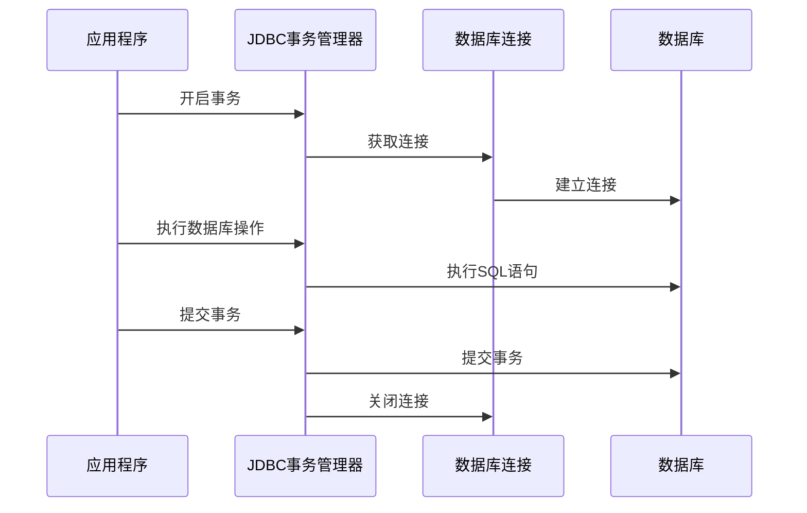
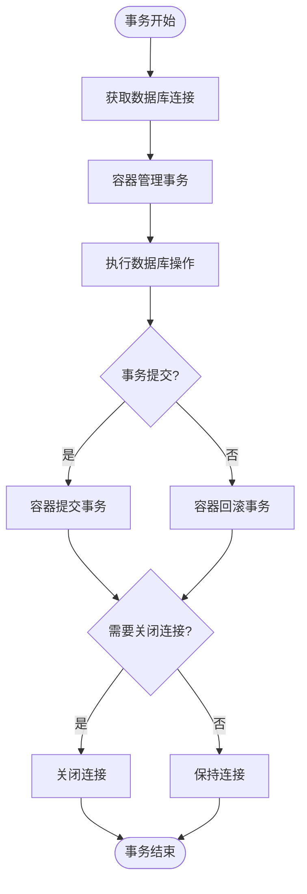
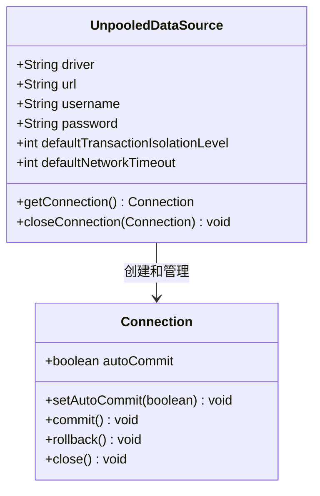
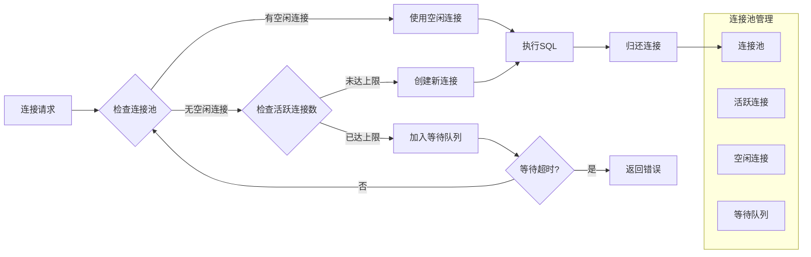
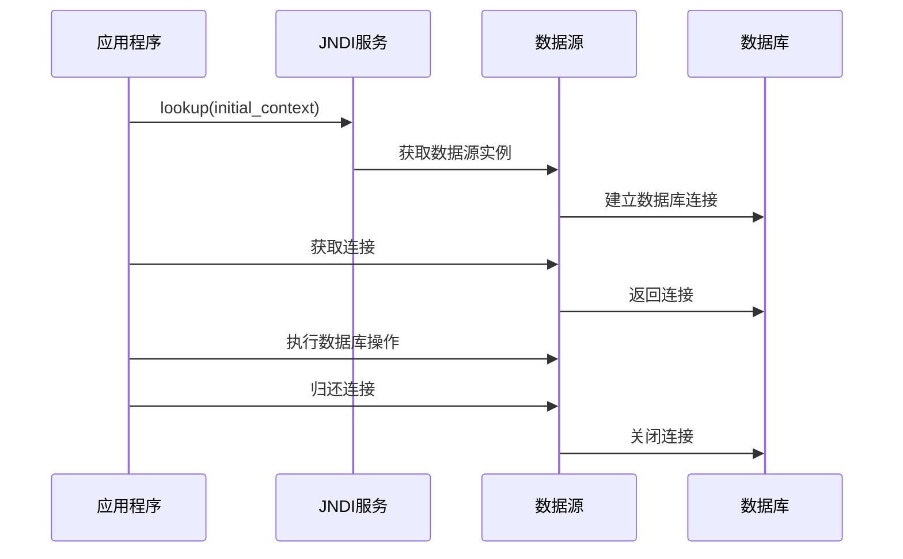
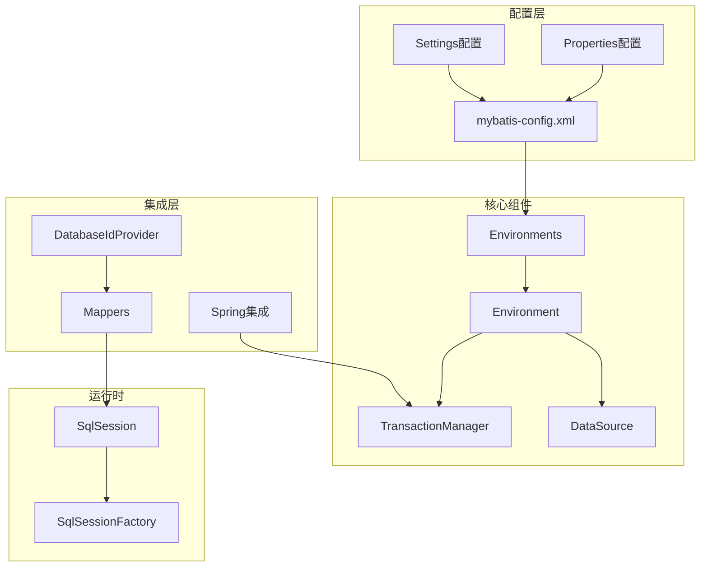

# Environments环境配置

<cite>
**本文档引用的文件**
- [config.md](file://docs/backend-base/mybatis/config.md)
- [mybatis-mapper.md](file://docs/backend-base/mybatis/mybatis-mapper.md)
- [mapper.md](file://docs/backend-base/mybatis/mapper.md)
- [spring-boot-my.md](file://docs/backend-base/spring/spring-boot-my.md)
- [config.js](file://.vuepress/config.js)
- [README.md](file://README.md)
</cite>

## 目录
1. [简介](#简介)
2. [项目结构](#项目结构)
3. [核心组件](#核心组件)
4. [架构概览](#架构概览)
5. [详细组件分析](#详细组件分析)
6. [依赖分析](#依赖分析)
7. [性能考虑](#性能考虑)
8. [故障排除指南](#故障排除指南)
9. [结论](#结论)
10. [附录](#附录)

## 简介

MyBatis Environments环境配置是MyBatis框架中用于管理多数据库环境的核心机制。该机制允许开发者在同一应用程序中配置和切换不同的数据库环境，如开发环境、测试环境和生产环境。通过Environments配置，可以为每个环境定义独立的事务管理器和数据源设置，从而实现灵活的数据库连接管理和环境切换。

本文档将深入解析MyBatis多环境配置机制，详细说明environment元素的结构、default属性的作用，以及transactionManager和dataSource的配置细节。同时，我们将提供完整的多环境配置示例和最佳实践指导。

## 项目结构

该项目是一个基于VuePress的个人技术博客，专门用于记录和分享MyBatis相关的技术知识。项目结构清晰地组织了各种技术主题的文档内容。



**图表来源**
- [config.js:1-18](file://.vuepress/config.js#L1-L18)
- [README.md:1-12](file://README.md#L1-L12)

**章节来源**
- [config.js:1-18](file://.vuepress/config.js#L1-L18)
- [README.md:1-12](file://README.md#L1-L12)

## 核心组件

MyBatis Environments环境配置主要由以下几个核心组件构成：

### 1. Environments元素结构

Environments元素是MyBatis配置文件中的顶级元素，用于定义应用程序可用的所有数据库环境。每个环境都必须具有唯一的id属性，并且可以指定一个默认环境。

### 2. Environment元素配置

Environment元素代表一个具体的数据库环境配置，包含以下关键组成部分：
- **transactionManager**: 事务管理器配置
- **dataSource**: 数据源配置

### 3. 事务管理器类型

MyBatis提供了两种事务管理器类型：
- **JDBC**: 直接使用JDBC的提交和回滚功能
- **MANAGED**: 让容器管理事务生命周期

### 4. 数据源实现类型

MyBatis支持三种数据源实现：
- **UNPOOLED**: 每次请求时创建和销毁连接
- **POOLED**: 使用连接池管理连接
- **JNDI**: 在容器环境中使用JNDI数据源

**章节来源**
- [config.md:106-147](file://docs/backend-base/mybatis/config.md#L106-L147)

## 架构概览

MyBatis Environments环境配置的整体架构体现了分层设计和模块化思想，确保了配置的灵活性和可维护性。



**图表来源**
- [config.md:106-184](file://docs/backend-base/mybatis/config.md#L106-L184)

## 详细组件分析

### Environments元素详解

Environments元素是MyBatis配置文件的顶层元素，用于定义应用程序可用的所有数据库环境。其核心特性包括：

#### 结构定义
```xml
<environments default="development">
    <environment id="development">
        <!-- 事务管理器配置 -->
        <!-- 数据源配置 -->
    </environment>
    <environment id="test">
        <!-- 测试环境配置 -->
    </environment>
    <environment id="production">
        <!-- 生产环境配置 -->
    </environment>
</environments>
```

#### default属性作用
- **默认环境选择**: `default`属性指定了应用程序启动时使用的默认数据库环境
- **环境切换机制**: 通过`environment`参数可以显式指定要使用的环境
- **运行时配置**: 可以在构建SqlSessionFactory时动态指定环境

**章节来源**
- [config.md:106-124](file://docs/backend-base/mybatis/config.md#L106-L124)

### TransactionManager事务管理器

MyBatis提供了两种事务管理器类型，每种都有其特定的使用场景和配置参数。

#### JDBC事务管理器

JDBC事务管理器是最常用的事务管理器类型，它直接使用JDBC的提交和回滚功能。

##### 配置参数
- **skipSetAutoCommitOnClose**: 控制是否在关闭连接时设置自动提交
  - 默认行为：某些驱动程序在关闭连接时启用自动提交
  - 性能优化：设置为true可跳过不必要的自动提交设置

##### 使用场景
- 传统JDBC应用程序
- 需要直接控制事务生命周期的应用
- Spring + MyBatis集成场景（Spring会覆盖配置）



**图表来源**
- [config.md:126-147](file://docs/backend-base/mybatis/config.md#L126-L147)

**章节来源**
- [config.md:126-147](file://docs/backend-base/mybatis/config.md#L126-L147)

#### MANAGED事务管理器

MANAGED事务管理器让容器负责管理事务的整个生命周期，通常用于企业级应用服务器环境。

##### 配置参数
- **closeConnection**: 控制是否关闭数据库连接
  - 默认行为：事务管理器会关闭连接
  - 容器环境：某些容器不希望连接被关闭，需要设置为false

##### 使用场景
- EJB容器环境
- 应用服务器（如Tomcat、WebLogic等）
- 与Spring框架集成的事务管理



**图表来源**
- [config.md:138-144](file://docs/backend-base/mybatis/config.md#L138-L144)

**章节来源**
- [config.md:138-144](file://docs/backend-base/mybatis/config.md#L138-L144)

### DataSource数据源

MyBatis支持三种数据源实现，每种都有其特定的适用场景和性能特点。

#### UNPOOLED数据源

UNPOOLED数据源实现每次请求时都创建和销毁数据库连接，适用于简单应用程序。

##### 配置参数
- **driver**: JDBC驱动的完整类名
- **url**: 数据库连接URL
- **username**: 数据库用户名
- **password**: 数据库密码
- **defaultTransactionIsolationLevel**: 默认事务隔离级别
- **defaultNetworkTimeout**: 默认网络超时时间（毫秒）

##### 适用场景
- 简单的桌面应用程序
- 低并发的Web应用程序
- 数据库连接可用性要求不高的场景



**图表来源**
- [config.md:152-162](file://docs/backend-base/mybatis/config.md#L152-L162)

**章节来源**
- [config.md:152-162](file://docs/backend-base/mybatis/config.md#L152-L162)

#### POOLED数据源

POOLED数据源使用连接池来管理数据库连接，提高了应用程序的性能和响应速度。

##### 配置参数
- **poolMaximumActiveConnections**: 最大活跃连接数（默认10）
- **poolMaximumIdleConnections**: 最大空闲连接数
- **poolMaximumCheckoutTime**: 连接检查的最大时间（毫秒）
- **poolTimeToWait**: 等待连接的超时时间（毫秒）
- **poolMaximumLocalBadConnectionTolerance**: 坏连接容忍度
- **poolPingQuery**: 连接健康检查查询
- **poolPingEnabled**: 是否启用连接健康检查
- **poolPingConnectionsNotUsedFor**: 连接健康检查频率

##### 性能特点
- **连接复用**: 避免频繁创建和销毁连接的开销
- **并发支持**: 支持高并发的Web应用程序
- **资源管理**: 更好地管理数据库连接资源



**图表来源**
- [config.md:163-177](file://docs/backend-base/mybatis/config.md#L163-L177)

**章节来源**
- [config.md:163-177](file://docs/backend-base/mybatis/config.md#L163-L177)

#### JNDI数据源

JNDI数据源用于在容器环境中使用JNDI查找的数据源，通常用于企业级应用。

##### 配置参数
- **initial_context**: 初始上下文的JNDI名称
- **data_source**: 数据源的JNDI名称

##### 使用场景
- 应用服务器环境（如Tomcat、WebLogic等）
- EJB容器
- 企业级应用程序
- 需要集中管理数据源的场景



**图表来源**
- [config.md:178-184](file://docs/backend-base/mybatis/config.md#L178-L184)

**章节来源**
- [config.md:178-184](file://docs/backend-base/mybatis/config.md#L178-L184)

## 依赖分析

MyBatis Environments环境配置与其他组件之间的依赖关系体现了良好的模块化设计。



**图表来源**
- [config.md:185-240](file://docs/backend-base/mybatis/config.md#L185-L240)

### 组件耦合度分析

- **低耦合设计**: Environments配置与具体的数据源实现解耦
- **可扩展性**: 新的数据源类型可以轻松添加
- **向后兼容**: 现有的配置可以无缝升级

### 外部依赖

- **数据库驱动**: 需要相应的JDBC驱动程序
- **容器支持**: JNDI数据源需要应用服务器支持
- **Spring框架**: Spring集成时的额外依赖

**章节来源**
- [config.md:185-240](file://docs/backend-base/mybatis/config.md#L185-L240)

## 性能考虑

在设计和配置MyBatis环境时，需要综合考虑多个性能因素：

### 连接池优化

对于POOLED数据源，合理的连接池配置可以显著提升应用程序性能：

- **活跃连接数**: 根据并发需求设置合适的最大活跃连接数
- **空闲连接管理**: 平衡内存使用和连接创建开销
- **超时配置**: 避免长时间阻塞等待连接

### 事务管理性能

- **JDBC模式**: 直接控制事务，性能开销较小
- **MANAGED模式**: 容器管理事务，需要考虑容器的性能影响

### 内存管理

- **连接生命周期**: 合理管理连接的创建和销毁
- **资源清理**: 确保连接正确关闭，避免内存泄漏

## 故障排除指南

### 常见配置问题

#### 环境切换失败
- **症状**: 应用程序无法连接到指定的数据库环境
- **原因**: 环境ID配置错误或环境未正确配置
- **解决**: 检查`default`属性和`environment`元素的配置

#### 事务管理器配置错误
- **症状**: 事务提交或回滚异常
- **原因**: 事务管理器类型选择不当或参数配置错误
- **解决**: 根据应用场景选择合适的事务管理器类型

#### 数据源连接问题
- **症状**: 数据库连接超时或连接失败
- **原因**: 数据源配置参数错误或网络问题
- **解决**: 检查数据库URL、用户名、密码等配置

**章节来源**
- [config.md:106-184](file://docs/backend-base/mybatis/config.md#L106-L184)

### 调试技巧

1. **启用详细日志**: 配置MyBatis日志输出
2. **监控连接池**: 使用连接池监控工具
3. **性能分析**: 分析数据库操作的性能瓶颈

## 结论

MyBatis Environments环境配置机制为多数据库环境管理提供了强大而灵活的解决方案。通过合理配置和使用，可以实现：

- **环境隔离**: 不同环境的数据库配置完全分离
- **灵活切换**: 运行时动态切换数据库环境
- **性能优化**: 根据应用场景选择最优的数据源和事务管理器
- **易于维护**: 清晰的配置结构便于维护和扩展

在实际应用中，建议根据具体的业务需求和部署环境选择合适的配置策略，并建立完善的监控和故障排除机制，确保应用程序的稳定运行。

## 附录

### 完整配置示例

以下是一个完整的MyBatis多环境配置示例：

```xml
<?xml version="1.0" encoding="UTF-8"?>
<!DOCTYPE configuration PUBLIC "-//mybatis.org//DTD Config 3.0//EN"
    "http://mybatis.org/dtd/mybatis-3-config.dtd">

<configuration>
    <!-- 属性配置 -->
    <properties resource="database.properties"/>
    
    <!-- 环境配置 -->
    <environments default="development">
        
        <!-- 开发环境 -->
        <environment id="development">
            <transactionManager type="JDBC"/>
            <dataSource type="POOLED">
                <property name="driver" value="${dev.driver}"/>
                <property name="url" value="${dev.url}"/>
                <property name="username" value="${dev.username}"/>
                <property name="password" value="${dev.password}"/>
                <property name="poolMaximumActiveConnections" value="15"/>
                <property name="poolMaximumIdleConnections" value="5"/>
            </dataSource>
        </environment>
        
        <!-- 测试环境 -->
        <environment id="test">
            <transactionManager type="JDBC"/>
            <dataSource type="POOLED">
                <property name="driver" value="${test.driver}"/>
                <property name="url" value="${test.url}"/>
                <property name="username" value="${test.username}"/>
                <property name="password" value="${test.password}"/>
                <property name="poolMaximumActiveConnections" value="10"/>
                <property name="poolMaximumIdleConnections" value="3"/>
            </dataSource>
        </environment>
        
        <!-- 生产环境 -->
        <environment id="production">
            <transactionManager type="MANAGED">
                <property name="closeConnection" value="false"/>
            </transactionManager>
            <dataSource type="JNDI">
                <property name="initial_context" value="${prod.initial_context}"/>
                <property name="data_source" value="${prod.data_source}"/>
            </dataSource>
        </environment>
    </environments>
    
    <!-- 映射器配置 -->
    <mappers>
        <mapper resource="com/example/mapper/UserMapper.xml"/>
    </mappers>
</configuration>
```

### 最佳实践建议

1. **环境分离**: 为每个环境维护独立的配置文件
2. **参数化配置**: 使用属性文件管理敏感信息
3. **性能监控**: 定期监控连接池使用情况
4. **安全考虑**: 在生产环境中使用加密的连接信息
5. **文档维护**: 保持配置文档的及时更新