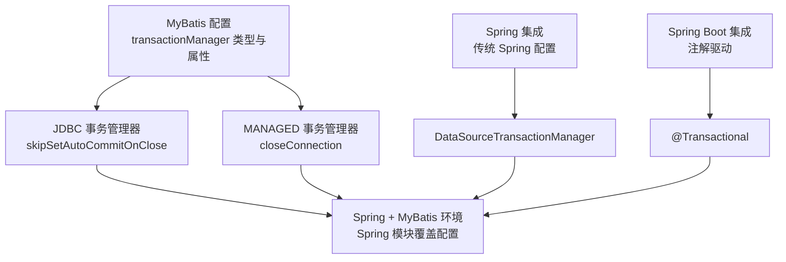
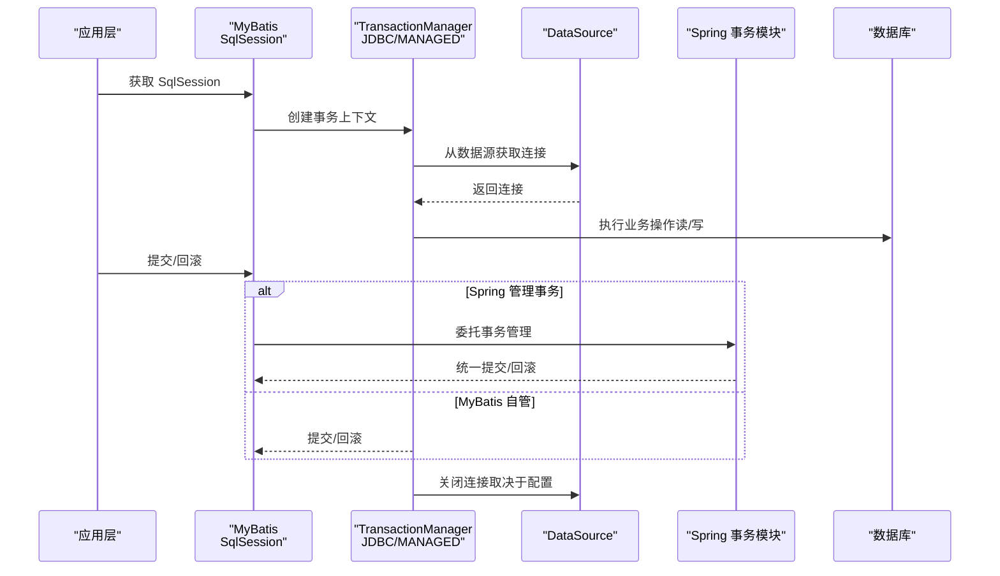
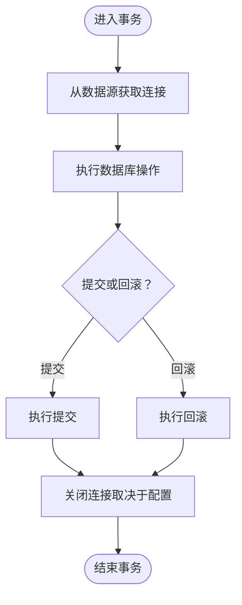
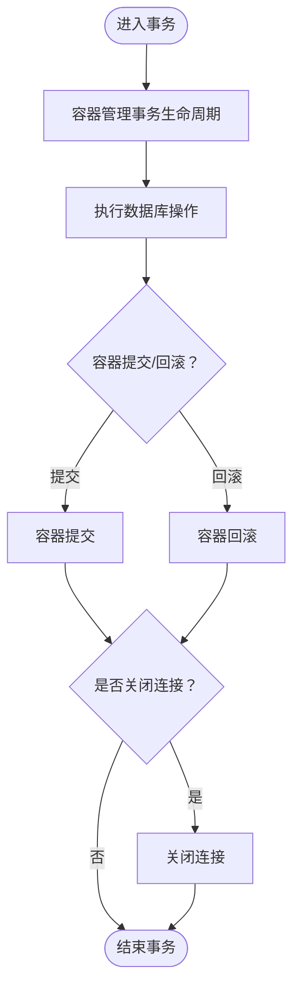
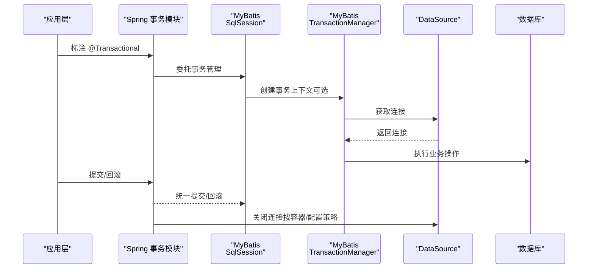
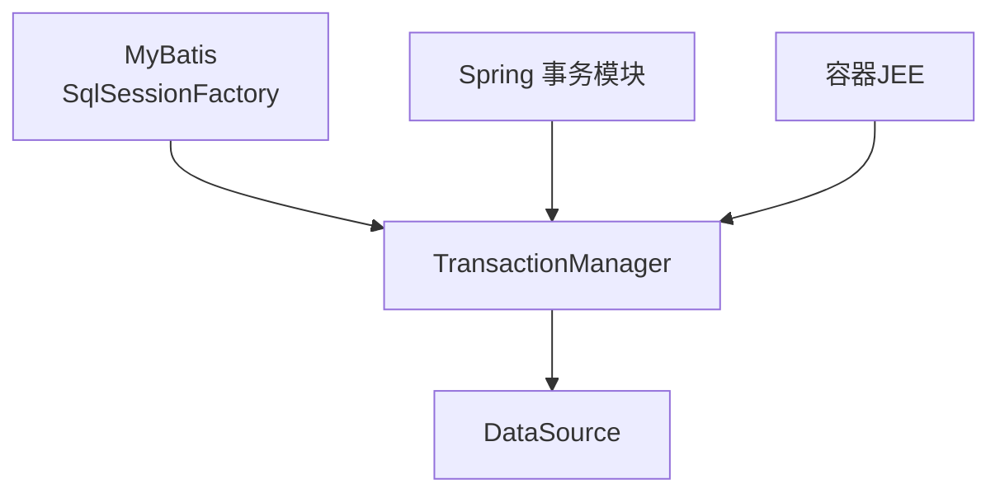

# TransactionManager事务管理器

<cite>
**本文引用的文件列表**
- [config.md](file://docs/backend-base/mybatis/config.md)
- [spring.md](file://docs/backend-base/spring/spring.md)
- [spring-boot.md](file://docs/backend-base/spring/spring-boot.md)
</cite>

## 目录
1. [简介](#简介)
2. [项目结构](#项目结构)
3. [核心组件](#核心组件)
4. [架构总览](#架构总览)
5. [组件详解](#组件详解)
6. [依赖关系分析](#依赖关系分析)
7. [性能考量](#性能考量)
8. [故障排查指南](#故障排查指南)
9. [结论](#结论)
10. [附录](#附录)

## 简介
本技术文档围绕 MyBatis 的 TransactionManager 事务管理器展开，系统阐述 JDBC 与 MANAGED 两种事务管理器的工作原理、配置参数及使用场景，并结合 Spring + MyBatis 的集成环境给出配置建议与最佳实践。重点解析以下关键点：
- JDBC 事务管理器的 skipSetAutoCommitOnClose 属性及其作用与设置方法
- MANAGED 事务管理器的 closeConnection 属性及其对容器管理事务的影响
- Spring + MyBatis 环境下的事务管理特殊考虑与配置建议
- 完整配置示例与常见问题的解决方案

## 项目结构
本文档涉及的 MyBatis 配置与事务相关内容主要位于后端基础文档中的 MyBatis 配置章节，以及 Spring/Spring Boot 集成章节。核心内容分布如下：
- MyBatis 配置：包含 transactionManager 的类型、属性与使用说明
- Spring 集成：包含传统 Spring 与 Spring Boot 的事务管理器配置与注解驱动
- 示例与最佳实践：提供 XML 配置片段与注解示例路径

**图表来源**
- [config.md:126-147](file://docs/backend-base/mybatis/config.md#L126-L147)
- [spring.md:9882-9932](file://docs/backend-base/spring/spring.md#L9882-L9932)
- [spring-boot.md:3242-3291](file://docs/backend-base/spring/spring-boot.md#L3242-L3291)

**章节来源**
- [config.md:126-147](file://docs/backend-base/mybatis/config.md#L126-L147)

## 核心组件
- JDBC 事务管理器：直接使用 JDBC 的 commit/rollback 能力，依赖数据源提供的连接管理事务作用域。默认在关闭连接时会启用自动提交以兼容部分驱动，但从特定版本起可通过 skipSetAutoCommitOnClose 属性跳过该步骤，以减少不必要的开销。
- MANAGED 事务管理器：几乎不做提交/回滚操作，交由容器（如 JEE 应用服务器）管理事务生命周期。默认会关闭连接；部分容器不希望连接被关闭，需将 closeConnection 设为 false 以阻止默认关闭行为。
- Spring + MyBatis：在 Spring 环境中，通常无需显式配置 MyBatis 的 transactionManager，因为 Spring 模块会使用自带的管理器覆盖 MyBatis 的配置。

**章节来源**
- [config.md:126-147](file://docs/backend-base/mybatis/config.md#L126-L147)

## 架构总览
下图展示了 MyBatis 事务管理器在不同环境中的交互关系，以及 Spring 对事务管理的接管。

**图表来源**
- [config.md:126-147](file://docs/backend-base/mybatis/config.md#L126-L147)
- [spring.md:9882-9932](file://docs/backend-base/spring/spring.md#L9882-L9932)
- [spring-boot.md:3242-3291](file://docs/backend-base/spring/spring-boot.md#L3242-L3291)

## 组件详解

### JDBC 事务管理器
- 工作原理
  - 直接使用 JDBC 的提交与回滚能力，事务作用域由从数据源获取的连接决定。
  - 默认行为：在关闭连接时启用自动提交，以兼容部分驱动。
  - 优化策略：从特定版本起，可通过 skipSetAutoCommitOnClose 属性跳过该步骤，避免不必要的开销。
- 配置参数
  - skipSetAutoCommitOnClose：布尔值，设为 true 可跳过关闭连接时的自动提交设置。
- 使用场景
  - 单体应用或非容器环境，需要 MyBatis 直接管理事务生命周期。
  - 需要避免在关闭连接时进行自动提交设置的场景，以提升性能或规避驱动兼容性问题。

**图表来源**
- [config.md:126-147](file://docs/backend-base/mybatis/config.md#L126-L147)

**章节来源**
- [config.md:126-147](file://docs/backend-base/mybatis/config.md#L126-L147)

### MANAGED 事务管理器
- 工作原理
  - 不主动提交或回滚连接，事务生命周期由容器（如 JEE 应用服务器）管理。
  - 默认行为：关闭连接；部分容器不希望连接被关闭，需将 closeConnection 设为 false 以阻止默认关闭。
- 配置参数
  - closeConnection：布尔值，设为 false 可阻止默认关闭连接的行为。
- 使用场景
  - 在容器环境中运行的应用，事务由容器统一管理，MyBatis 仅负责数据访问。

**图表来源**
- [config.md:126-147](file://docs/backend-base/mybatis/config.md#L126-L147)

**章节来源**
- [config.md:126-147](file://docs/backend-base/mybatis/config.md#L126-L147)

### Spring + MyBatis 环境下的事务管理
- Spring 传统配置
  - 使用 DataSourceTransactionManager 作为事务管理器，配合 AOP 切面与 tx 命名空间定义事务规则。
  - 在 Spring + MyBatis 的组合中，Spring 模块会使用自带的管理器覆盖 MyBatis 的 transactionManager 配置。
- Spring Boot 集成
  - 通过 @Transactional 注解实现声明式事务控制，无需手动配置事务管理器。
  - 事务特性与 Spring 框架保持一致，其他配置均可省略。

**图表来源**
- [config.md:146-147](file://docs/backend-base/mybatis/config.md#L146-L147)
- [spring.md:9882-9932](file://docs/backend-base/spring/spring.md#L9882-L9932)
- [spring-boot.md:3242-3291](file://docs/backend-base/spring/spring-boot.md#L3242-L3291)

**章节来源**
- [config.md:146-147](file://docs/backend-base/mybatis/config.md#L146-L147)
- [spring.md:9882-9932](file://docs/backend-base/spring/spring.md#L9882-L9932)
- [spring-boot.md:3242-3291](file://docs/backend-base/spring/spring-boot.md#L3242-L3291)

## 依赖关系分析
- MyBatis 与数据源：TransactionManager 依赖 DataSource 提供的连接，从而管理事务作用域。
- Spring 与 MyBatis：在 Spring 环境中，Spring 的事务模块接管事务管理，MyBatis 的 transactionManager 配置被覆盖。
- 容器与 MANAGED：MANAGED 事务管理器依赖容器的事务生命周期，连接关闭策略受容器影响。

**图表来源**
- [config.md:126-147](file://docs/backend-base/mybatis/config.md#L126-L147)
- [spring.md:9882-9932](file://docs/backend-base/spring/spring.md#L9882-L9932)
- [spring-boot.md:3242-3291](file://docs/backend-base/spring/spring-boot.md#L3242-L3291)

**章节来源**
- [config.md:126-147](file://docs/backend-base/mybatis/config.md#L126-L147)
- [spring.md:9882-9932](file://docs/backend-base/spring/spring.md#L9882-L9932)
- [spring-boot.md:3242-3291](file://docs/backend-base/spring/spring-boot.md#L3242-L3291)

## 性能考量
- JDBC 事务管理器
  - skipSetAutoCommitOnClose 设为 true 可避免在关闭连接时进行自动提交设置，减少不必要的开销，尤其适用于对驱动兼容性要求不高或已明确事务控制策略的场景。
- MANAGED 事务管理器
  - closeConnection 设为 false 可避免容器关闭连接，适用于容器不希望连接被关闭的场景，减少连接重建成本。
- Spring + MyBatis
  - Spring 的事务管理器通常具备更完善的性能与一致性保障，推荐在 Spring 环境中使用注解驱动或 XML 配置的方式统一管理事务。

[本节为通用性能讨论，不直接分析具体文件]

## 故障排查指南
- JDBC 事务管理器
  - 症状：关闭连接时出现自动提交相关异常或性能下降
  - 处理：将 skipSetAutoCommitOnClose 设为 true，跳过关闭连接时的自动提交设置
- MANAGED 事务管理器
  - 症状：容器报错提示连接被意外关闭
  - 处理：将 closeConnection 设为 false，阻止默认关闭连接的行为
- Spring + MyBatis
  - 症状：事务未生效或提交/回滚异常
  - 处理：确认 Spring 事务管理器已正确配置并启用注解驱动；确保 @Transactional 注解正确标注在服务层方法上

**章节来源**
- [config.md:126-147](file://docs/backend-base/mybatis/config.md#L126-L147)
- [spring.md:9882-9932](file://docs/backend-base/spring/spring.md#L9882-L9932)
- [spring-boot.md:3242-3291](file://docs/backend-base/spring/spring-boot.md#L3242-L3291)

## 结论
- JDBC 事务管理器适合需要 MyBatis 直接管理事务的场景，可通过 skipSetAutoCommitOnClose 优化性能。
- MANAGED 事务管理器适合容器管理事务的场景，可通过 closeConnection 控制连接关闭策略。
- 在 Spring + MyBatis 环境中，Spring 模块会覆盖 MyBatis 的事务管理器配置，推荐使用注解驱动或 XML 配置统一管理事务。

[本节为总结性内容，不直接分析具体文件]

## 附录
- 完整配置示例与参考路径
  - JDBC 事务管理器（含 skipSetAutoCommitOnClose）：[config.md:132-136](file://docs/backend-base/mybatis/config.md#L132-L136)
  - MANAGED 事务管理器（含 closeConnection）：[config.md:140-144](file://docs/backend-base/mybatis/config.md#L140-L144)
  - Spring 传统配置（XML + AOP + tx 命名空间）：[spring.md:9882-9932](file://docs/backend-base/spring/spring.md#L9882-L9932)
  - Spring Boot 集成（注解驱动）：[spring-boot.md:3242-3291](file://docs/backend-base/spring/spring-boot.md#L3242-L3291)
  - Spring Boot 事务注解示例：[spring-boot.md:6427-6459](file://docs/backend-base/spring/spring-boot.md#L6427-L6459)