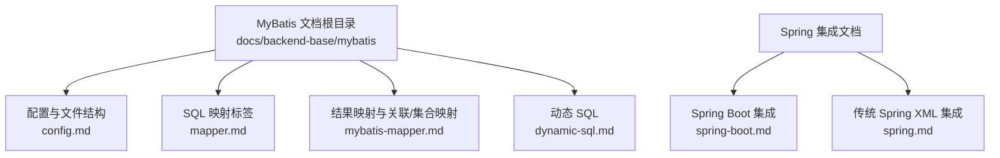
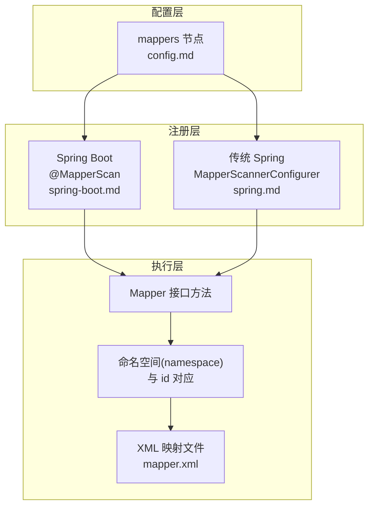
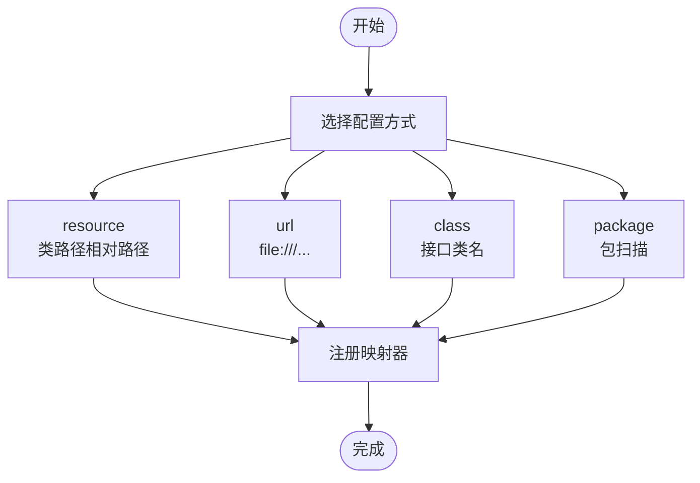
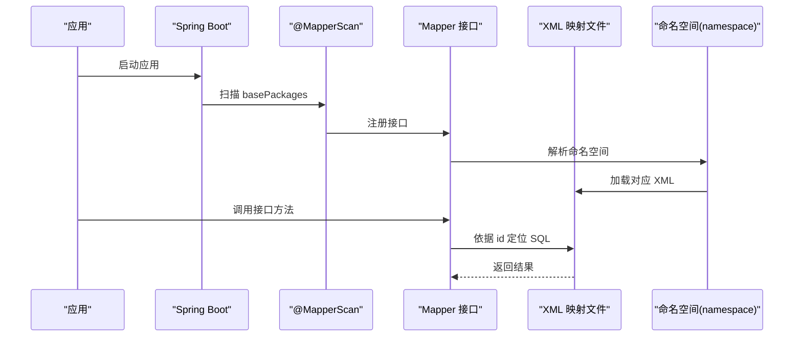
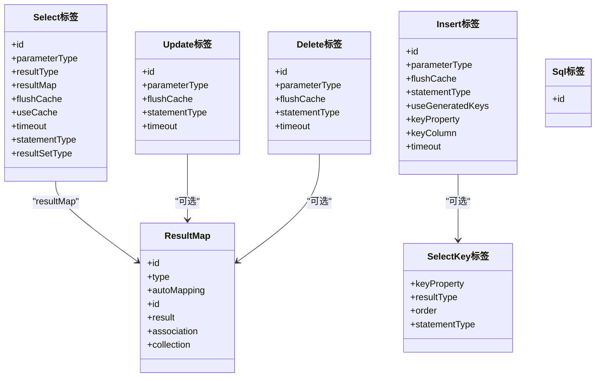
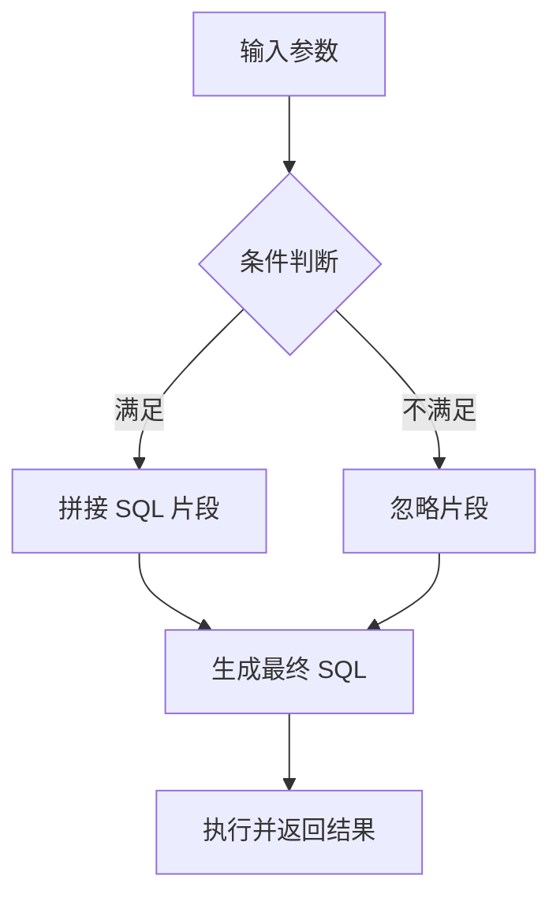
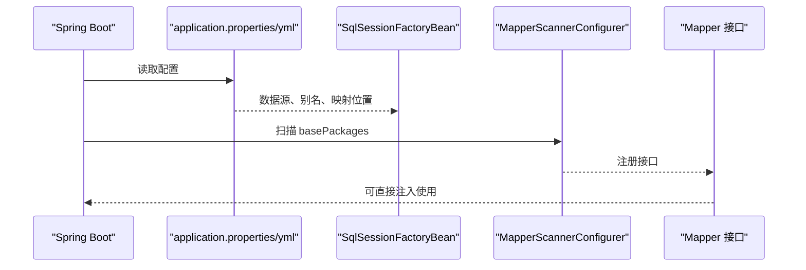
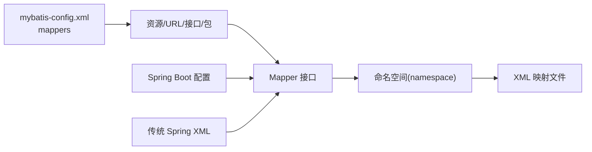

# Mappers映射器配置

<cite>
**本文引用的文件**
- [config.md](file://docs/backend-base/mybatis/config.md)
- [mapper.md](file://docs/backend-base/mybatis/mapper.md)
- [mybatis-mapper.md](file://docs/backend-base/mybatis/mybatis-mapper.md)
- [dynamic-sql.md](file://docs/backend-base/mybatis/dynamic-sql.md)
- [spring-boot.md](file://docs/backend-base/spring/spring-boot.md)
- [spring.md](file://docs/backend-base/spring/spring.md)
</cite>

## 目录
1. [简介](#简介)
2. [项目结构](#项目结构)
3. [核心组件](#核心组件)
4. [架构总览](#架构总览)
5. [详细组件分析](#详细组件分析)
6. [依赖分析](#依赖分析)
7. [性能考量](#性能考量)
8. [故障排查指南](#故障排查指南)
9. [结论](#结论)
10. [附录](#附录)

## 简介
本技术文档围绕 MyBatis 映射器（Mappers）配置展开，系统阐述映射器注册的重要性、MyBatis 查找 SQL 映射的机制，以及四种映射器配置方式：resource 资源引用、url 完全限定 URL、class 接口类名、package 包扫描。文档还解释映射器接口与 XML 映射文件的对应关系与命名约定，给出配置示例、最佳实践与常见错误排查方法，帮助读者在不同运行环境下（传统 Spring、Spring Boot）正确、高效地配置 MyBatis 映射器。

## 项目结构
MyBatis 相关文档位于 docs/backend-base/mybatis 目录，涵盖 SQL 映射标签、结果映射、动态 SQL、配置文件等主题；Spring 集成相关文档位于 docs/backend-base/spring 目录，包含 Spring Boot 与传统 Spring 的 MyBatis 集成方式及配置要点。

**图表来源**
- [config.md:199-240](file://docs/backend-base/mybatis/config.md#L199-L240)
- [mapper.md:1-242](file://docs/backend-base/mybatis/mapper.md#L1-L242)
- [mybatis-mapper.md:1-488](file://docs/backend-base/mybatis/mybatis-mapper.md#L1-L488)
- [dynamic-sql.md:1-278](file://docs/backend-base/mybatis/dynamic-sql.md#L1-L278)
- [spring-boot.md:3020-3032](file://docs/backend-base/spring/spring-boot.md#L3020-L3032)
- [spring.md:10618-10631](file://docs/backend-base/spring/spring.md#L10618-L10631)

**章节来源**
- [config.md:199-240](file://docs/backend-base/mybatis/config.md#L199-L240)
- [spring-boot.md:3020-3032](file://docs/backend-base/spring/spring-boot.md#L3020-L3032)
- [spring.md:10618-10631](file://docs/backend-base/spring/spring.md#L10618-L10631)

## 核心组件
- 映射器注册与查找机制：MyBatis 通过 mappers 配置项显式声明映射来源，支持资源引用、URL、接口类名、包扫描四种方式。
- SQL 映射标签：select、insert、update、delete、sql、selectKey 等标签用于定义 SQL 语句与参数、结果映射。
- 结果映射：resultType/resultMap、自动映射、构造方法注入、association/collection 等用于复杂对象映射。
- 动态 SQL：if/choose/where/set/trim/foreach/bind 等标签用于构建灵活的 SQL。
- Spring 集成：Spring Boot 通过注解与属性自动装配；传统 Spring 通过 XML 配置 SqlSessionFactory、MapperScannerConfigurer 等。

**章节来源**
- [config.md:199-240](file://docs/backend-base/mybatis/config.md#L199-L240)
- [mapper.md:5-84](file://docs/backend-base/mybatis/mapper.md#L5-L84)
- [mybatis-mapper.md:5-88](file://docs/backend-base/mybatis/mybatis-mapper.md#L5-L88)
- [dynamic-sql.md:3-91](file://docs/backend-base/mybatis/dynamic-sql.md#L3-L91)
- [spring-boot.md:3020-3032](file://docs/backend-base/spring/spring-boot.md#L3020-L3032)
- [spring.md:10618-10631](file://docs/backend-base/spring/spring.md#L10618-L10631)

## 架构总览
MyBatis 的映射器配置贯穿“配置层—注册层—执行层”：
- 配置层：在 mybatis-config.xml 的 mappers 节点中声明映射来源。
- 注册层：Spring Boot 使用 @MapperScan 或自动配置；传统 Spring 使用 MapperScannerConfigurer。
- 执行层：接口方法与 XML 映射文件中的 id 对应，按命名空间解析 SQL 语句并执行。

**图表来源**
- [config.md:199-240](file://docs/backend-base/mybatis/config.md#L199-L240)
- [spring-boot.md:2331](file://docs/backend-base/spring/spring-boot.md#L2331)
- [spring.md:10629-10631](file://docs/backend-base/spring/spring.md#L10629-L10631)

## 详细组件分析

### 四种映射器配置方式详解
- resource 资源引用：通过类路径相对路径声明 XML 映射文件，适合小型项目或模块化部署。
- url 完全限定 URL：支持 file:// 等绝对路径，便于跨模块或外部资源定位。
- class 接口类名：直接注册接口，要求接口与 XML 文件命名一致且位于类路径下。
- package 包扫描：批量注册包内所有接口，推荐在 Spring Boot 环境配合 @MapperScan 使用。

**图表来源**
- [config.md:203-239](file://docs/backend-base/mybatis/config.md#L203-L239)

**章节来源**
- [config.md:203-239](file://docs/backend-base/mybatis/config.md#L203-L239)

### 映射器接口与 XML 映射文件的对应关系与命名约定
- 命名空间(namespace)：XML 文件的 mapper 节点需与接口全限定类名一致，或通过 @Mapper 注解指定。
- id 对应：接口方法名与 XML 中的 id 对应，用于定位 SQL 语句。
- 文件命名：class 方式要求 XML 文件名与接口名一致（通常为 XxxMapper.xml），并位于类路径下。
- Spring Boot：@MapperScan(basePackages) 自动扫描并注册接口，无需逐个 resource/url/class 声明。

**图表来源**
- [spring-boot.md:2331](file://docs/backend-base/spring/spring-boot.md#L2331)
- [config.md:203-239](file://docs/backend-base/mybatis/config.md#L203-L239)

**章节来源**
- [spring-boot.md:2331](file://docs/backend-base/spring/spring-boot.md#L2331)
- [config.md:203-239](file://docs/backend-base/mybatis/config.md#L203-L239)

### SQL 映射标签与结果映射
- SQL 标签：select、insert、update、delete、sql、selectKey 等，支持参数映射、主键生成、结果映射等。
- 结果映射：resultType/resultMap、自动映射 mapUnderscoreToCamelCase、构造方法注入、association/collection 嵌套映射。
- 动态 SQL：if/choose/where/set/trim/foreach/bind，用于构建灵活查询与更新语句。

**图表来源**
- [mapper.md:27-44](file://docs/backend-base/mybatis/mapper.md#L27-L44)
- [mapper.md:46-84](file://docs/backend-base/mybatis/mapper.md#L46-L84)
- [mapper.md:92-107](file://docs/backend-base/mybatis/mapper.md#L92-L107)
- [mybatis-mapper.md:53-64](file://docs/backend-base/mybatis/mybatis-mapper.md#L53-L64)

**章节来源**
- [mapper.md:27-107](file://docs/backend-base/mybatis/mapper.md#L27-L107)
- [mybatis-mapper.md:53-88](file://docs/backend-base/mybatis/mybatis-mapper.md#L53-L88)

### 动态 SQL 与参数映射
- 动态 SQL：if/choose/where/set/trim/foreach/bind，支持条件拼接、集合遍历、字符串拼接等。
- 参数映射：简单参数与复杂对象参数映射，支持 @Param 注解与属性访问。

**图表来源**
- [dynamic-sql.md:3-91](file://docs/backend-base/mybatis/dynamic-sql.md#L3-L91)
- [mapper.md:218-241](file://docs/backend-base/mybatis/mapper.md#L218-L241)

**章节来源**
- [dynamic-sql.md:3-91](file://docs/backend-base/mybatis/dynamic-sql.md#L3-L91)
- [mapper.md:218-241](file://docs/backend-base/mybatis/mapper.md#L218-L241)

### Spring 集成与配置要点
- Spring Boot：通过 @MapperScan(basePackages) 扫描并注册 Mapper 接口；可通过 application.properties/yml 配置 mapper-locations、驼峰映射等。
- 传统 Spring：通过 SqlSessionFactoryBean、MapperScannerConfigurer、DataSourceTransactionManager 等 XML 配置完成注册与事务管理。

**图表来源**
- [spring-boot.md:3020-3032](file://docs/backend-base/spring/spring-boot.md#L3020-L3032)
- [spring.md:10618-10631](file://docs/backend-base/spring/spring.md#L10618-L10631)

**章节来源**
- [spring-boot.md:3020-3032](file://docs/backend-base/spring/spring-boot.md#L3020-L3032)
- [spring.md:10618-10631](file://docs/backend-base/spring/spring.md#L10618-L10631)

## 依赖分析
- 配置依赖：mappers 节点依赖类路径或 URL 资源可见性；Spring Boot 依赖 @MapperScan 与 application 配置。
- 接口依赖：Mapper 接口与 XML 映射文件的命名空间(namespace)与 id 必须一一对应。
- 运行时依赖：SqlSessionFactoryBean 提供会话工厂；MapperScannerConfigurer/Mapper 注解负责接口注册。

**图表来源**
- [config.md:199-240](file://docs/backend-base/mybatis/config.md#L199-L240)
- [spring-boot.md:2331](file://docs/backend-base/spring/spring-boot.md#L2331)
- [spring.md:10618-10631](file://docs/backend-base/spring/spring.md#L10618-L10631)

**章节来源**
- [config.md:199-240](file://docs/backend-base/mybatis/config.md#L199-L240)
- [spring-boot.md:2331](file://docs/backend-base/spring/spring-boot.md#L2331)
- [spring.md:10618-10631](file://docs/backend-base/spring/spring.md#L10618-L10631)

## 性能考量
- 使用包扫描与 @MapperScan 可减少重复配置，提升可维护性。
- 合理使用自动映射 mapUnderscoreToCamelCase，避免列名与属性名不一致导致的额外别名处理。
- 动态 SQL 中避免不必要的逗号与 AND/OR 前缀，使用 where/set/trim 等标签简化处理。
- 对于复杂关联查询，结合 association/collection 的懒加载(fetchType="lazy")优化性能。

[本节为通用指导，不直接分析具体文件]

## 故障排查指南
- 命名空间(namespace)与接口不一致：确保 XML 的 mapper 节点与接口全限定类名一致，或通过注解指定。
- id 未找到：检查接口方法名与 XML 中的 id 是否一致。
- 资源路径错误：resource/url 配置路径需与类路径或文件系统路径一致。
- Spring Boot 未注册：确认 @MapperScan(basePackages) 正确扫描到接口包。
- 列名与属性名不匹配：使用别名或开启 mapUnderscoreToCamelCase。
- 动态 SQL 语法错误：检查 where/set/trim 等标签的使用，避免末尾逗号或多余 AND/OR。

**章节来源**
- [spring-boot.md:2331](file://docs/backend-base/spring/spring-boot.md#L2331)
- [config.md:203-239](file://docs/backend-base/mybatis/config.md#L203-L239)
- [dynamic-sql.md:115-153](file://docs/backend-base/mybatis/dynamic-sql.md#L115-L153)

## 结论
MyBatis 映射器配置的核心在于“显式声明 + 命名约定 + 接口注册”。通过 resource/url/class/package 四种方式，结合 Spring Boot 的 @MapperScan 或传统 Spring 的 MapperScannerConfigurer，可实现清晰、可维护的映射器注册。配合动态 SQL 与结果映射，能够灵活应对复杂查询与对象映射需求。遵循命名约定与最佳实践，可显著降低配置成本与运行时错误。

[本节为总结，不直接分析具体文件]

## 附录
- 示例与配置参考路径：
  - [resource 配置示例:205-211](file://docs/backend-base/mybatis/config.md#L205-L211)
  - [url 配置示例:215-221](file://docs/backend-base/mybatis/config.md#L215-L221)
  - [class 配置示例:225-231](file://docs/backend-base/mybatis/config.md#L225-L231)
  - [package 配置示例:235-239](file://docs/backend-base/mybatis/config.md#L235-L239)
  - [Spring Boot 配置示例:3020-3032](file://docs/backend-base/spring/spring-boot.md#L3020-L3032)
  - [传统 Spring XML 配置示例:10618-10631](file://docs/backend-base/spring/spring.md#L10618-L10631)