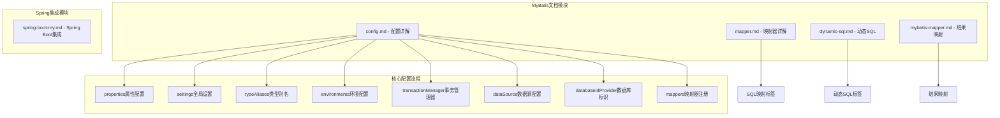
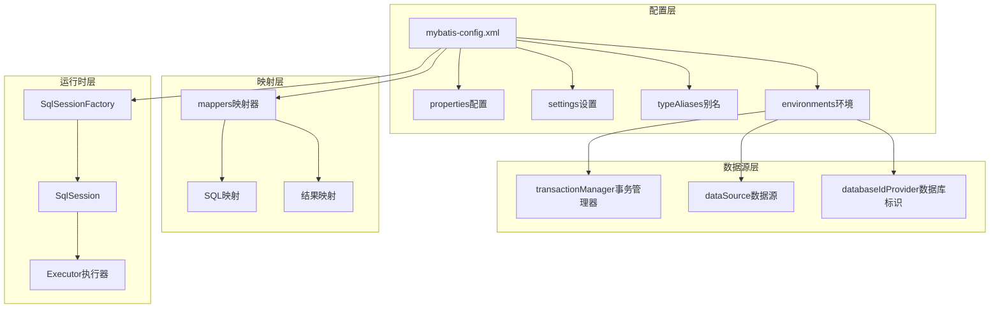
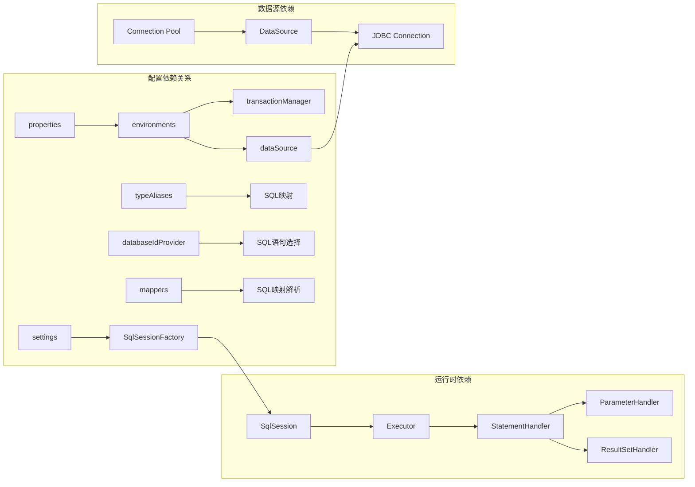

# MyBatis配置详解

<cite>
**本文档引用的文件**
- [config.md](file://docs/backend-base/mybatis/config.md)
- [mapper.md](file://docs/backend-base/mybatis/mapper.md)
- [dynamic-sql.md](file://docs/backend-base/mybatis/dynamic-sql.md)
- [mybatis-mapper.md](file://docs/backend-base/mybatis/mybatis-mapper.md)
- [spring-boot-my.md](file://docs/backend-base/spring/spring-boot-my.md)
</cite>

## 目录
1. [简介](#简介)
2. [项目结构](#项目结构)
3. [核心配置组件](#核心配置组件)
4. [架构概览](#架构概览)
5. [详细组件分析](#详细组件分析)
6. [依赖关系分析](#依赖关系分析)
7. [性能考量](#性能考量)
8. [故障排除指南](#故障排除指南)
9. [结论](#结论)

## 简介

MyBatis是一个优秀的持久层框架，它支持定制化SQL、存储过程以及高级映射。本文档深入解析MyBatis配置管理的核心要素，包括mybatis-config.xml配置文件的各个组成部分，为开发者提供完整的配置指南和最佳实践。

## 项目结构

该项目采用模块化文档结构，MyBatis相关内容分布在以下目录中：



**图表来源**
- [config.md:1-240](file://docs/backend-base/mybatis/config.md#L1-L240)
- [mapper.md:1-242](file://docs/backend-base/mybatis/mapper.md#L1-L242)
- [dynamic-sql.md:1-278](file://docs/backend-base/mybatis/dynamic-sql.md#L1-L278)
- [mybatis-mapper.md:1-488](file://docs/backend-base/mybatis/mybatis-mapper.md#L1-L488)

**章节来源**
- [config.md:1-240](file://docs/backend-base/mybatis/config.md#L1-L240)
- [mapper.md:1-242](file://docs/backend-base/mybatis/mapper.md#L1-L242)
- [dynamic-sql.md:1-278](file://docs/backend-base/mybatis/dynamic-sql.md#L1-L278)
- [mybatis-mapper.md:1-488](file://docs/backend-base/mybatis/mybatis-mapper.md#L1-L488)

## 核心配置组件

### properties属性配置

properties元素用于外部化配置，支持动态替换和默认值特性。

**关键特性：**
- 支持Java属性文件配置
- 内联属性定义
- 占位符动态替换
- 默认值特性（从3.4.2版本开始）

**配置要点：**
- 使用`resource`属性指定外部属性文件
- 支持在`SqlSessionFactoryBuilder.build()`方法中传入属性值
- 占位符语法`${property}`和默认值语法`${property:defaultValue}`

**章节来源**
- [config.md:3-52](file://docs/backend-base/mybatis/config.md#L3-L52)

### settings全局设置

settings元素提供MyBatis的全局行为配置，包含70+个设置项。

**核心设置项：**
- `cacheEnabled`: 控制二级缓存的全局开关
- `mapUnderscoreToCamelCase`: 启用驼峰命名自动映射
- `localCacheScope`: 本地缓存作用域（SESSION/STATEMENT）
- `jdbcTypeForNull`: 空值的默认JDBC类型
- `logImpl`: 指定日志实现（SLF4J/LOG4J/STDOUT等）

**章节来源**
- [config.md:54-71](file://docs/backend-base/mybatis/config.md#L54-L71)

### typeAliases类型别名

typeAliases简化Java类的全限定名书写，支持包扫描和注解配置。

**配置方式：**
- 单个类型别名定义
- 包名扫描自动别名
- 注解@Alias自定义别名

**最佳实践：**
- 使用简短且有意义的别名
- 避免别名冲突
- 结合包扫描减少配置冗余

**章节来源**
- [config.md:72-104](file://docs/backend-base/mybatis/config.md#L72-L104)

### environments环境配置

environments元素支持多环境配置，每个SqlSessionFactory实例只能选择一种环境。

**环境配置结构：**
```xml
<environments default="development">
  <environment id="development">
    <transactionManager type="JDBC"/>
    <dataSource type="POOLED"/>
  </environment>
</environments>
```

**章节来源**
- [config.md:106-124](file://docs/backend-base/mybatis/config.md#L106-L124)

## 架构概览

MyBatis配置架构采用分层设计，各组件协同工作：



**图表来源**
- [config.md:106-240](file://docs/backend-base/mybatis/config.md#L106-L240)

## 详细组件分析

### transactionManager事务管理器

MyBatis提供两种事务管理器类型：

#### JDBC事务管理器

JDBC类型的事务管理器直接使用JDBC的提交和回滚功能：

**配置特性：**
- 依赖数据源获得的连接管理事务作用域
- 默认启用自动提交以兼容某些驱动程序
- 3.5.10+版本支持`skipSetAutoCommitOnClose`属性

**配置示例：**
```xml
<transactionManager type="JDBC">
  <property name="skipSetAutoCommitOnClose" value="true"/>
</transactionManager>
```

#### MANAGED事务管理器

MANAGED类型的事务管理器让容器管理事务生命周期：

**配置特性：**
- 从不提交或回滚连接
- 让容器（如JEE应用服务器）管理事务
- 支持`closeConnection`属性控制连接关闭行为

**配置示例：**
```xml
<transactionManager type="MANAGED">
  <property name="closeConnection" value="false"/>
</transactionManager>
```

**章节来源**
- [config.md:126-147](file://docs/backend-base/mybatis/config.md#L126-L147)

### dataSource数据源配置

MyBatis支持三种数据源类型：

#### UNPOOLED无连接池数据源

**适用场景：**
- 简单应用程序
- 数据库连接可用性要求不高
- 性能要求不严格的场景

**核心属性：**
- `driver`: JDBC驱动全限定类名
- `url`: 数据库JDBC URL
- `username/password`: 数据库登录凭据
- `defaultTransactionIsolationLevel`: 默认事务隔离级别
- `defaultNetworkTimeout`: 默认网络超时时间（毫秒）

#### POOLED连接池数据源

**核心优势：**
- 复用JDBC连接对象
- 避免频繁创建连接的开销
- 支持高并发Web应用

**关键配置属性：**
- `poolMaximumActiveConnections`: 活跃连接最大数量（默认10）
- `poolMaximumIdleConnections`: 空闲连接最大数量
- `poolMaximumCheckoutTime`: 连接最大checkout时间（默认20秒）
- `poolTimeToWait`: 获取连接等待时间（默认20秒）
- `poolMaximumLocalBadConnectionTolerance`: 坏连接容忍度（默认3）
- `poolPingQuery`: 连接健康检查查询
- `poolPingEnabled`: 启用连接健康检查
- `poolPingConnectionsNotUsedFor`: 健康检查频率

#### JNDI数据源

**适用环境：**
- EJB或应用服务器容器
- 容器集中配置数据源
- JNDI上下文查找数据源

**配置属性：**
- `initial_context`: InitialContext查找上下文
- `data_source`: JNDI数据源引用路径

**章节来源**
- [config.md:148-184](file://docs/backend-base/mybatis/config.md#L148-L184)

### databaseIdProvider数据库标识提供者

databaseIdProvider支持多数据库厂商的SQL语句差异化执行：

**配置模式：**
```xml
<databaseIdProvider type="DB_VENDOR">
  <property name="SQL Server" value="sqlserver"/>
  <property name="DB2" value="db2"/>
  <property name="Oracle" value="oracle"/>
</databaseIdProvider>
```

**工作机制：**
- 根据当前数据库产品名设置databaseId
- 优先匹配带databaseId的语句
- 同时存在时舍弃不带databaseId的语句

**章节来源**
- [config.md:185-198](file://docs/backend-base/mybatis/config.md#L185-L198)

### mappers映射器注册

MyBatis提供四种映射器注册方式：

#### 资源引用方式

```xml
<mappers>
  <mapper resource="org/mybatis/builder/AuthorMapper.xml"/>
</mappers>
```

#### URL方式

```xml
<mappers>
  <mapper url="file:///var/mappers/AuthorMapper.xml"/>
</mappers>
```

#### 接口类方式

```xml
<mappers>
  <mapper class="org.mybatis.builder.AuthorMapper"/>
</mappers>
```

#### 包扫描方式

```xml
<mappers>
  <package name="org.mybatis.builder"/>
</mappers>
```

**章节来源**
- [config.md:199-240](file://docs/backend-base/mybatis/config.md#L199-L240)

## 依赖关系分析

MyBatis配置组件间的依赖关系：



**图表来源**
- [config.md:106-240](file://docs/backend-base/mybatis/config.md#L106-L240)

**章节来源**
- [config.md:106-240](file://docs/backend-base/mybatis/config.md#L106-L240)

## 性能考量

### 数据源选择策略

**UNPOOLED vs POOLED vs JNDI**

| 特性 | UNPOOLED | POOLED | JNDI |
|------|----------|--------|------|
| 连接复用 | ❌ | ✅ | ✅ |
| 配置复杂度 | 简单 | 中等 | 高 |
| 性能表现 | 一般 | 优秀 | 优秀 |
| 适用场景 | 小型应用 | Web应用 | 企业级应用 |

### 事务管理器选择

**JDBC vs MANAGED**

| 特性 | JDBC | MANAGED |
|------|------|---------|
| 事务控制 | MyBatis管理 | 容器管理 |
| 自动提交 | 可配置 | 容器控制 |
| 连接关闭 | 默认关闭 | 可配置 |
| 适用场景 | 独立应用 | 容器环境 |

### 配置优化建议

1. **连接池配置优化**
   - 根据应用并发量调整`poolMaximumActiveConnections`
   - 设置合理的`poolMaximumCheckoutTime`
   - 启用健康检查`poolPingEnabled`

2. **缓存策略优化**
   - 合理设置`localCacheScope`
   - 根据业务场景启用二级缓存
   - 配置合适的缓存刷新策略

3. **日志配置优化**
   - 生产环境使用性能较低的日志实现
   - 开发环境使用详细日志输出
   - 配置合适的日志前缀和输出格式

## 故障排除指南

### 常见配置问题

#### 数据源连接问题

**症状：** 应用启动时报连接错误

**排查步骤：**
1. 验证数据库驱动类名正确性
2. 检查JDBC URL格式
3. 确认用户名密码正确
4. 测试数据库连通性

**解决方案：**
```xml
<!-- 增加连接超时配置 -->
<property name="poolMaximumCheckoutTime" value="60000"/>
<property name="poolPingQuery" value="SELECT 1"/>
<property name="poolPingEnabled" value="true"/>
```

#### 事务管理器冲突

**症状：** 事务提交/回滚异常

**排查步骤：**
1. 检查Spring集成配置
2. 验证事务管理器类型一致性
3. 确认容器环境配置

**解决方案：**
```xml
<!-- 在Spring环境中避免手动配置事务管理器 -->
<!-- 让Spring管理事务 -->
```

#### 映射器注册问题

**症状：** SQL映射文件无法找到

**排查步骤：**
1. 验证映射器XML文件路径
2. 检查包扫描配置
3. 确认接口类完整限定名

**解决方案：**
```xml
<!-- 使用绝对路径或正确的相对路径 -->
<mappers>
  <mapper resource="com/example/mapper/UserMapper.xml"/>
  <!-- 或者使用包扫描 -->
  <package name="com.example.mapper"/>
</mappers>
```

**章节来源**
- [config.md:126-184](file://docs/backend-base/mybatis/config.md#L126-L184)

## 结论

MyBatis配置管理涉及多个相互关联的组件，每个组件都有其特定的作用和配置要求。通过合理配置properties、settings、typeAliases、environments、transactionManager、dataSource、databaseIdProvider和mappers等组件，可以构建高性能、可维护的持久层解决方案。

**关键成功因素：**
1. **明确的配置策略** - 根据应用场景选择合适的数据源和事务管理器
2. **合理的性能配置** - 优化连接池参数和缓存策略
3. **清晰的映射设计** - 使用typeAliases简化配置，合理组织SQL映射
4. **完善的监控机制** - 配置适当的日志和监控设置
5. **持续的优化改进** - 根据实际使用情况进行配置调优

通过遵循本文档提供的配置指南和最佳实践，开发者可以构建稳定可靠的MyBatis应用，充分发挥框架的性能优势和灵活性。