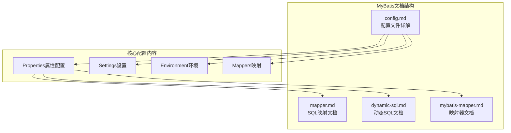
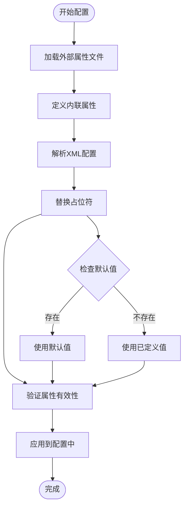
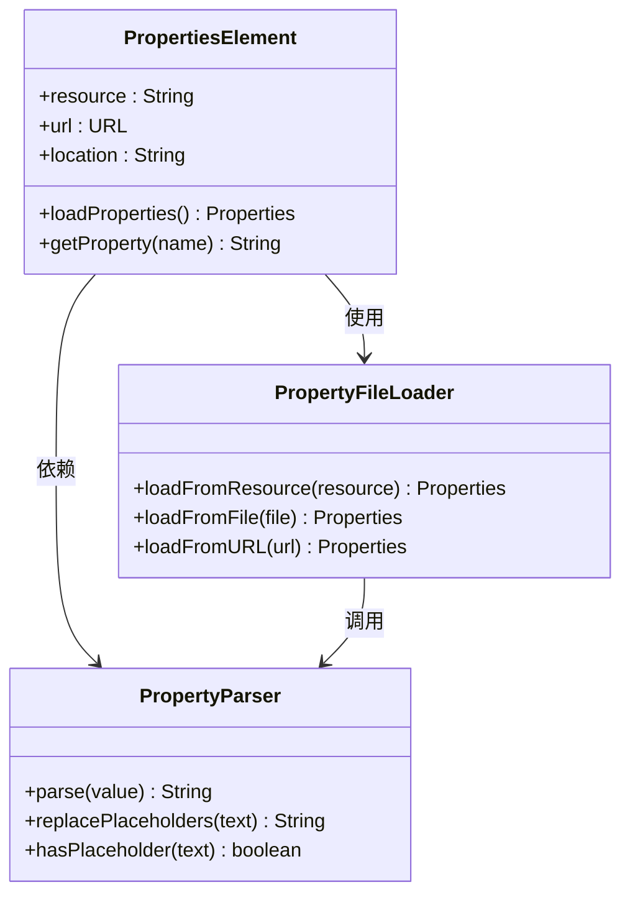
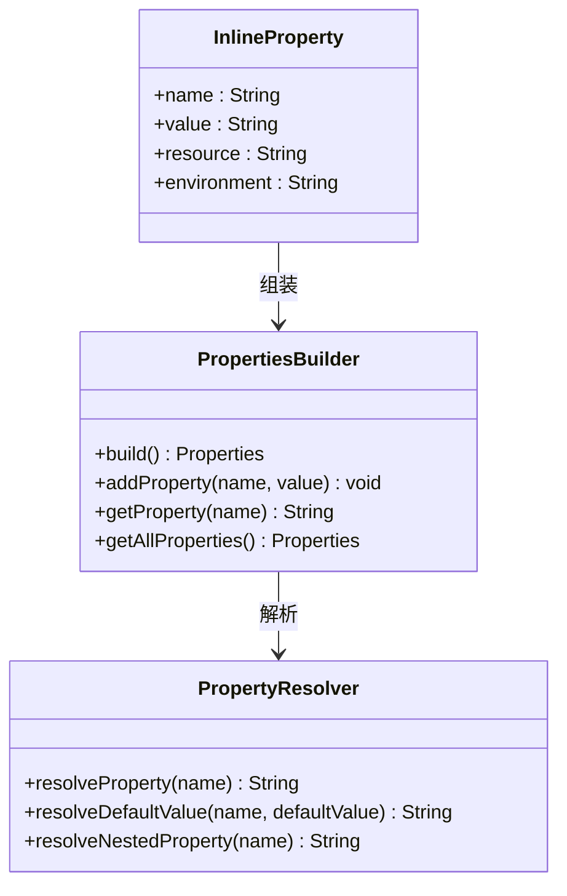
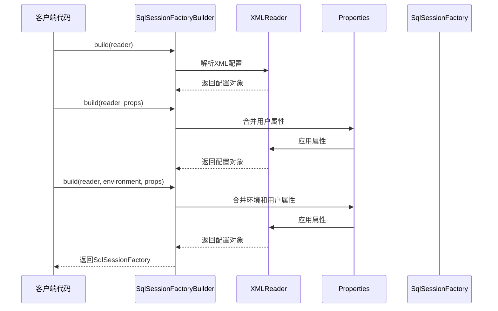
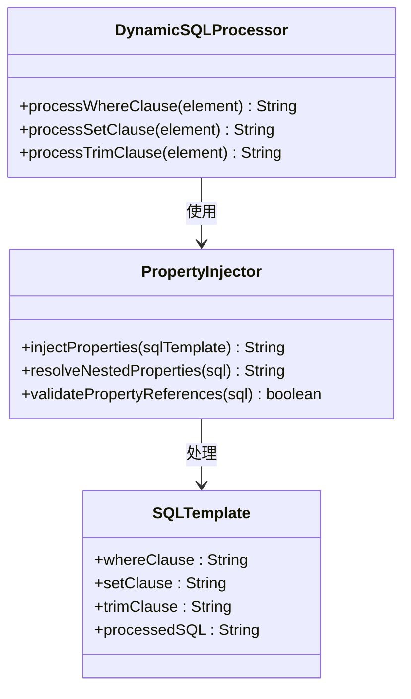
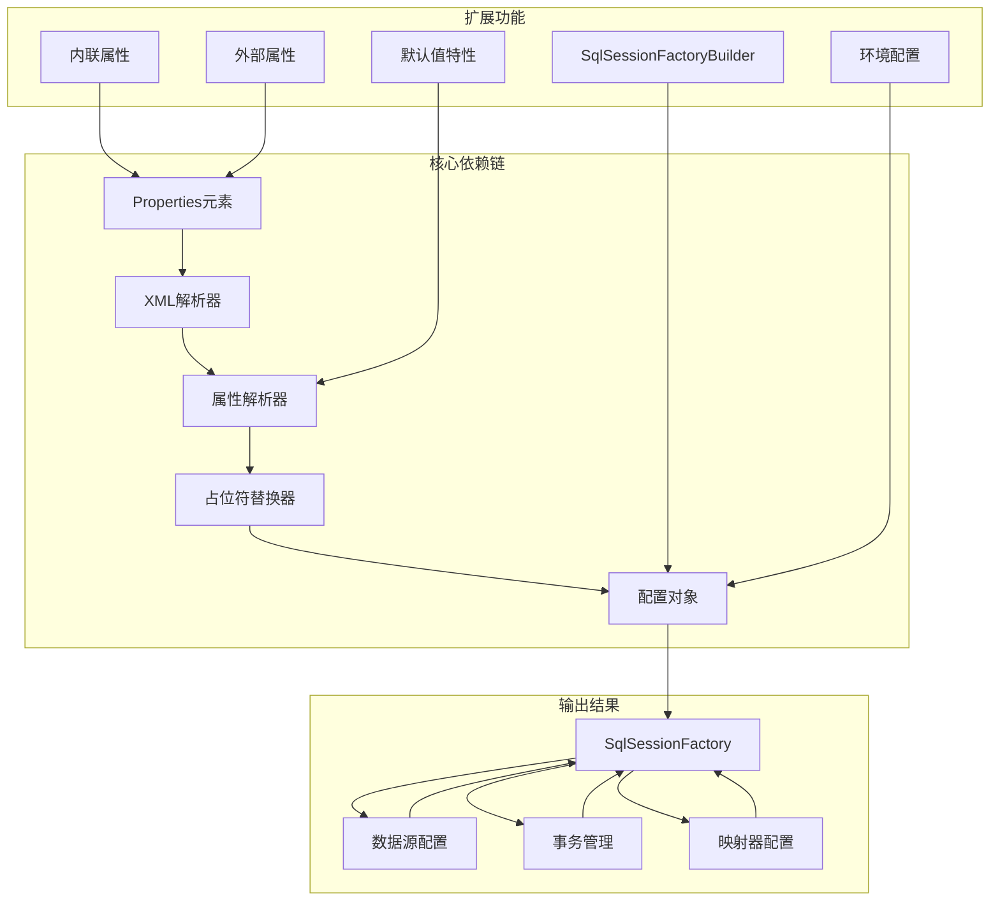

# Properties属性配置

<cite>
**本文档引用的文件**
- [config.md](file://docs/backend-base/mybatis/config.md)
- [mapper.md](file://docs/backend-base/mybatis/mapper.md)
- [dynamic-sql.md](file://docs/backend-base/mybatis/dynamic-sql.md)
- [mybatis-mapper.md](file://docs/backend-base/mybatis/mybatis-mapper.md)
</cite>

## 目录
1. [简介](#简介)
2. [项目结构](#项目结构)
3. [核心组件](#核心组件)
4. [架构概览](#架构概览)
5. [详细组件分析](#详细组件分析)
6. [依赖关系分析](#依赖关系分析)
7. [性能考虑](#性能考虑)
8. [故障排除指南](#故障排除指南)
9. [结论](#结论)

## 简介

MyBatis Properties属性配置是MyBatis框架中一个重要的配置机制，它允许开发者从外部属性文件加载配置信息，并支持在XML配置文件中进行动态属性替换。本文档将深入解释properties元素的使用方法，包括从外部属性文件加载配置和在XML中直接定义属性的方式，详细说明属性值的动态替换机制，占位符的使用语法${property}和默认值语法${property:defaultValue}，并提供完整的配置示例。

## 项目结构

MyBatis相关的文档主要集中在`docs/backend-base/mybatis/`目录下，包含以下关键文件：



**图表来源**
- [config.md:1-240](file://docs/backend-base/mybatis/config.md#L1-L240)

**章节来源**
- [config.md:1-240](file://docs/backend-base/mybatis/config.md#L1-L240)

## 核心组件

### Properties元素基础

MyBatis的properties元素提供了灵活的属性配置机制，支持两种主要的配置方式：

1. **外部属性文件配置**：从标准的Java属性文件中加载配置
2. **XML内联配置**：在XML配置文件中直接定义属性

### 属性动态替换机制

MyBatis实现了强大的属性动态替换功能，使用占位符语法`${property}`来引用已定义的属性值。



**图表来源**
- [config.md:37-52](file://docs/backend-base/mybatis/config.md#L37-L52)

**章节来源**
- [config.md:3-52](file://docs/backend-base/mybatis/config.md#L3-L52)

## 架构概览

MyBatis Properties配置系统的工作流程可以分为以下几个关键阶段：

```mermaid
sequenceDiagram
participant App as 应用程序
participant Builder as SqlSessionFactoryBuilder
participant Parser as XML解析器
participant Properties as 属性处理器
participant Config as 配置对象
App->>Builder : 创建SqlSessionFactory
Builder->>Parser : 解析XML配置
Parser->>Properties : 加载外部属性文件
Properties->>Properties : 解析内联属性
Properties->>Parser : 返回属性集合
Parser->>Parser : 替换占位符
Parser->>Config : 构建配置对象
Config-->>Builder : 返回完整配置
Builder-->>App : 返回SqlSessionFactory
```

**图表来源**
- [config.md:16-24](file://docs/backend-base/mybatis/config.md#L16-L24)

## 详细组件分析

### 外部属性文件配置

外部属性文件是MyBatis推荐的属性配置方式，支持标准的Java属性文件格式：

#### 基本配置语法



**图表来源**
- [config.md:9-14](file://docs/backend-base/mybatis/config.md#L9-L14)

#### 配置示例

外部属性文件通常包含数据库连接信息、日志配置等：

| 配置项 | 用途 | 示例值 |
|--------|------|--------|
| driver | JDBC驱动类名 | com.mysql.cj.jdbc.Driver |
| url | 数据库连接URL | jdbc:mysql://localhost:3306/mydb |
| username | 数据库用户名 | dev_user |
| password | 数据库密码 | F2Fa3!33TYyg |

**章节来源**
- [config.md:9-14](file://docs/backend-base/mybatis/config.md#L9-L14)

### XML内联属性配置

除了外部属性文件，MyBatis还支持在XML配置文件中直接定义属性：

#### 内联属性语法



**图表来源**
- [config.md:10-13](file://docs/backend-base/mybatis/config.md#L10-L13)

**章节来源**
- [config.md:10-13](file://docs/backend-base/mybatis/config.md#L10-L13)

### 占位符替换机制

MyBatis实现了高效的占位符替换机制，支持复杂的属性引用和默认值处理：

#### 占位符语法

```mermaid
flowchart LR
subgraph "占位符语法"
A[${property}] --> B[基本占位符]
C[${property:defaultValue}] --> D[默认值占位符]
end
subgraph "解析过程"
E[检测占位符] --> F{是否存在属性}
F --> |是| G[返回属性值]
F --> |否| H{是否存在默认值}
H --> |是| I[返回默认值]
H --> |否| J[抛出异常]
end
B --> E
D --> E
G --> K[替换完成]
I --> K
J --> L[配置失败]
```

**图表来源**
- [config.md:28-52](file://docs/backend-base/mybatis/config.md#L28-L52)

#### 默认值特性

从MyBatis 3.4.2版本开始，引入了默认值特性，需要显式启用：

**章节来源**
- [config.md:28-52](file://docs/backend-base/mybatis/config.md#L28-L52)

### SqlSessionFactoryBuilder集成

SqlSessionFactoryBuilder提供了灵活的属性传递机制：

#### 构建方法



**图表来源**
- [config.md:16-24](file://docs/backend-base/mybatis/config.md#L16-L24)

**章节来源**
- [config.md:16-24](file://docs/backend-base/mybatis/config.md#L16-L24)

### 高级应用场景

#### 动态SQL中的属性使用

在MyBatis的动态SQL中，属性配置同样发挥重要作用：



**图表来源**
- [dynamic-sql.md:1-278](file://docs/backend-base/mybatis/dynamic-sql.md#L1-L278)

**章节来源**
- [dynamic-sql.md:1-278](file://docs/backend-base/mybatis/dynamic-sql.md#L1-L278)

#### 映射器中的属性应用

在复杂的映射场景中，属性配置同样重要：

**章节来源**
- [mybatis-mapper.md:1-488](file://docs/backend-base/mybatis/mybatis-mapper.md#L1-L488)

## 依赖关系分析

MyBatis Properties配置系统涉及多个组件之间的复杂依赖关系：



**图表来源**
- [config.md:1-240](file://docs/backend-base/mybatis/config.md#L1-L240)

**章节来源**
- [config.md:1-240](file://docs/backend-base/mybatis/config.md#L1-L240)

## 性能考虑

### 属性加载优化

1. **延迟加载策略**：外部属性文件采用按需加载，避免不必要的I/O操作
2. **缓存机制**：解析后的属性值会被缓存，减少重复解析开销
3. **合并策略**：用户提供的属性会覆盖默认属性，支持增量配置

### 内存使用优化

- 属性集合采用轻量级数据结构存储
- 占位符解析采用流式处理，避免大文本的多次复制
- 默认值解析只在需要时触发

## 故障排除指南

### 常见问题及解决方案

#### 属性未找到错误

**问题描述**：使用`${property}`时抛出属性未找到异常

**解决方案**：
1. 检查属性文件路径是否正确
2. 验证属性名称拼写
3. 确认属性文件编码格式

#### 默认值未生效

**问题描述**：设置了默认值但未生效

**解决方案**：
1. 确认启用了默认值特性
2. 检查默认值语法格式
3. 验证属性优先级顺序

#### 属性覆盖问题

**问题描述**：用户提供的属性未覆盖默认属性

**解决方案**：
1. 检查属性合并顺序
2. 验证属性名称一致性
3. 确认属性作用域范围

**章节来源**
- [config.md:37-52](file://docs/backend-base/mybatis/config.md#L37-L52)

### 最佳实践建议

1. **属性文件组织**：将相关属性分组存储在独立的属性文件中
2. **命名规范**：使用清晰的属性命名，避免歧义
3. **环境分离**：为不同环境创建独立的属性文件
4. **安全考虑**：敏感信息使用环境变量或加密存储
5. **文档维护**：保持属性文档与代码同步更新

## 结论

MyBatis Properties属性配置系统提供了灵活、强大的配置管理能力。通过外部属性文件和XML内联配置的结合，开发者可以实现高度可配置的应用程序。占位符替换机制和默认值特性进一步增强了配置的灵活性和健壮性。

关键要点总结：
- 支持外部属性文件和内联属性两种配置方式
- 实现了高效的占位符替换和默认值处理
- 提供了完整的SqlSessionFactoryBuilder集成
- 具备良好的性能优化和错误处理机制

通过合理使用这些特性，开发者可以构建出既灵活又可靠的MyBatis应用程序配置体系。