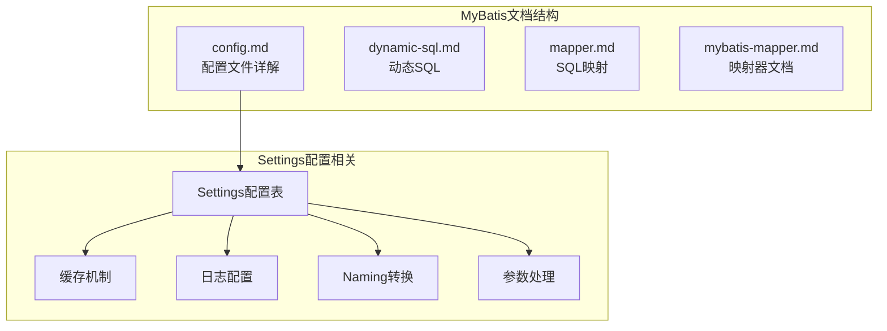
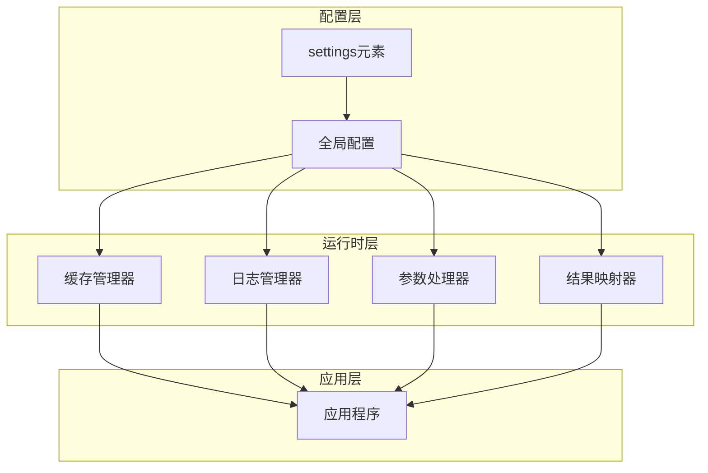

# Settings全局设置

<cite>
**本文档引用的文件**
- [config.md](file://docs/backend-base/mybatis/config.md)
- [dynamic-sql.md](file://docs/backend-base/mybatis/dynamic-sql.md)
- [mapper.md](file://docs/backend-base/mybatis/mapper.md)
- [mybatis-mapper.md](file://docs/backend-base/mybatis/mybatis-mapper.md)
</cite>

## 目录
1. [简介](#简介)
2. [项目结构](#项目结构)
3. [核心组件](#核心组件)
4. [架构概览](#架构概览)
5. [详细组件分析](#详细组件分析)
6. [依赖分析](#依赖分析)
7. [性能考虑](#性能考虑)
8. [故障排除指南](#故障排除指南)
9. [结论](#结论)

## 简介

MyBatis Settings全局设置是MyBatis框架的核心配置机制，它提供了对整个MyBatis运行时行为的统一控制。Settings配置位于MyBatis配置文件的settings元素中，可以影响缓存机制、日志输出、参数处理、结果映射等多个关键方面。

本文档将深入解析MyBatis Settings中的所有可用配置选项，包括但不限于：
- 缓存相关设置：cacheEnabled、localCacheScope
- 主键生成设置：useGeneratedKeys
- 分页和结果处理器设置：safeRowBoundsEnabled、safeResultHandlerEnabled
- 命名转换设置：mapUnderscoreToCamelCase
- 空值处理设置：jdbcTypeForNull、nullableOnForEach
- 日志配置：logPrefix、logImpl
- 参数处理设置：useActualParamName、shrinkWhitespacesInSql
- 特殊场景设置：returnInstanceForEmptyRow

## 项目结构

MyBatis相关的文档主要分布在以下文件中：

**图表来源**
- [config.md:54-70](file://docs/backend-base/mybatis/config.md#L54-L70)

**章节来源**
- [config.md:1-240](file://docs/backend-base/mybatis/config.md#L1-L240)

## 核心组件

MyBatis Settings配置系统包含以下核心组件：

### Settings配置表

| 设置名 | 描述 | 有效值 | 默认值 |
|--------|------|--------|--------|
| cacheEnabled | 全局性地开启或关闭所有映射器配置文件中已配置的任何缓存 | true \| false | true |
| useGeneratedKeys | 允许 JDBC 支持自动生成主键 | true \| false | false |
| safeRowBoundsEnabled | 是否允许在嵌套语句中使用分页（RowBounds） | true \| false | false |
| safeResultHandlerEnabled | 是否允许在嵌套语句中使用结果处理器 | true \| false | true |
| mapUnderscoreToCamelCase | 是否开启驼峰命名自动映射 | true \| false | false |
| localCacheScope | 本地缓存的作用域设置 | SESSION \| STATEMENT | SESSION |
| jdbcTypeForNull | 空值的默认JDBC类型 | JdbcType常量 | OTHER |
| returnInstanceForEmptyRow | 返回空行实例而不是null | true \| false | false |
| logPrefix | 日志名称前缀 | 任何字符串 | 未设置 |
| logImpl | 日志实现选择 | SLF4J \| LOG4J \| LOG4J2 \| JDK_LOGGING \| COMMONS_LOGGING \| STDOUT_LOGGING \| NO_LOGGING | 未设置 |
| useActualParamName | 使用方法签名中的实际参数名 | true \| false | true |
| shrinkWhitespacesInSql | 从SQL中删除多余的空格字符 | true \| false | false |
| nullableOnForEach | foreach标签的nullable属性默认值 | true \| false | false |

**章节来源**
- [config.md:56-70](file://docs/backend-base/mybatis/config.md#L56-L70)

## 架构概览

MyBatis Settings配置在整个框架中的作用机制如下：

**图表来源**
- [config.md:54-70](file://docs/backend-base/mybatis/config.md#L54-L70)

## 详细组件分析

### 缓存机制配置

#### cacheEnabled设置
- **描述**：全局性地开启或关闭所有映射器配置文件中已配置的任何缓存
- **有效值**：true \| false
- **默认值**：true
- **使用场景**：在需要完全禁用缓存的调试环境中，或在缓存策略需要严格控制的生产环境中
- **性能影响**：启用缓存可以显著提升重复查询的性能，但会增加内存使用

#### localCacheScope设置
- **描述**：MyBatis利用本地缓存机制防止循环引用和加速重复的嵌套查询
- **有效值**：SESSION \| STATEMENT
- **默认值**：SESSION
- **使用场景**：
  - SESSION：适用于需要跨查询共享缓存的场景
  - STATEMENT：适用于需要严格控制缓存生命周期的场景
- **性能影响**：SESSION模式在会话范围内缓存所有查询，提升性能但占用更多内存

**章节来源**
- [config.md:58-63](file://docs/backend-base/mybatis/config.md#L58-L63)

### 主键生成配置

#### useGeneratedKeys设置
- **描述**：允许JDBC支持自动生成主键，需要数据库驱动支持
- **有效值**：true \| false
- **默认值**：false
- **使用场景**：使用数据库自增主键的场景，如MySQL、SQL Server
- **注意事项**：某些数据库驱动不支持此特性，但仍可正常工作

**章节来源**
- [config.md:59](file://docs/backend-base/mybatis/config.md#L59)

### 分页和结果处理器配置

#### safeRowBoundsEnabled设置
- **描述**：是否允许在嵌套语句中使用分页（RowBounds）
- **有效值**：true \| false
- **默认值**：false
- **使用场景**：需要在嵌套查询中使用分页功能的场景

#### safeResultHandlerEnabled设置
- **描述**：是否允许在嵌套语句中使用结果处理器
- **有效值**：true \| false
- **默认值**：true
- **使用场景**：需要自定义结果处理逻辑的场景

**章节来源**
- [config.md:60-61](file://docs/backend-base/mybatis/config.md#L60-L61)

### 命名转换配置

#### mapUnderscoreToCamelCase设置
- **描述**：是否开启驼峰命名自动映射，即从经典数据库列名A_COLUMN映射到经典Java属性名aColumn
- **有效值**：true \| false
- **默认值**：false
- **使用场景**：数据库列名使用下划线命名，Java属性使用驼峰命名的场景
- **性能影响**：轻微的性能开销，但提供了更好的开发体验

**章节来源**
- [config.md:62](file://docs/backend-base/mybatis/config.md#L62)

### 空值处理配置

#### jdbcTypeForNull设置
- **描述**：当没有为参数指定特定的JDBC类型时，空值的默认JDBC类型
- **有效值**：JdbcType常量，常用值：NULL、VARCHAR或OTHER
- **默认值**：OTHER
- **使用场景**：需要精确控制空值处理的数据库操作
- **注意事项**：某些数据库驱动需要指定列的JDBC类型

#### nullableOnForEach设置
- **描述**：为'foreach'标签的'nullable'属性指定默认值
- **有效值**：true \| false
- **默认值**：false
- **使用场景**：使用动态SQL时需要控制集合参数的空值处理

**章节来源**
- [config.md:64-65](file://docs/backend-base/mybatis/config.md#L64-L65)

### 日志配置

#### logPrefix设置
- **描述**：指定MyBatis增加到日志名称的前缀
- **有效值**：任何字符串
- **默认值**：未设置
- **使用场景**：多模块应用中区分不同模块的日志输出

#### logImpl设置
- **描述**：指定MyBatis所用日志的具体实现
- **有效值**：SLF4J \| LOG4J \| LOG4J2 \| JDK_LOGGING \| COMMONS_LOGGING \| STDOUT_LOGGING \| NO_LOGGING
- **默认值**：未设置
- **使用场景**：集成现有日志系统或自定义日志输出
- **版本注意**：LOG4J在3.5.9版本起已被废弃

**章节来源**
- [config.md:66-67](file://docs/backend-base/mybatis/config.md#L66-L67)

### 参数处理配置

#### useActualParamName设置
- **描述**：允许使用方法签名中的名称作为语句参数名称
- **有效值**：true \| false
- **默认值**：true
- **使用场景**：需要使用方法参数名称而非#{param1}形式的场景
- **编译要求**：项目必须采用Java 8编译，并加上-parameter选项

#### shrinkWhitespacesInSql设置
- **描述**：从SQL中删除多余的空格字符
- **有效值**：true \| false
- **默认值**：false
- **使用场景**：需要优化SQL输出格式的场景
- **注意事项**：也会影响SQL中的文字字符串

**章节来源**
- [config.md:68-69](file://docs/backend-base/mybatis/config.md#L68-L69)

### 特殊场景配置

#### returnInstanceForEmptyRow设置
- **描述**：当返回行的所有列都是空时，MyBatis默认返回null。当开启这个设置时，MyBatis会返回一个空实例
- **有效值**：true \| false
- **默认值**：false
- **使用场景**：需要确保始终返回实例对象的场景
- **适用范围**：适用于嵌套的结果集（如集合或关联）

**章节来源**
- [config.md:65](file://docs/backend-base/mybatis/config.md#L65)

## 依赖分析

Settings配置项之间的依赖关系如下：

```mermaid
graph TB
subgraph "缓存相关"
cacheEnabled[cacheEnabled]
localCacheScope[localCacheScope]
cacheEnabled --> localCacheScope
end
subgraph "命名转换"
mapUnderscoreToCamelCase[mapUnderscoreToCamelCase]
namingDep[naming依赖]
mapUnderscoreToCamelCase --> namingDep
end
subgraph "日志相关"
logPrefix[logPrefix]
logImpl[logImpl]
logPrefix --> logImpl
end
subgraph "参数处理"
useActualParamName[useActualParamName]
shrinkWhitespacesInSql[shrinkWhitespacesInSql]
useActualParamName --> shrinkWhitespacesInSql
end
subgraph "安全相关"
safeRowBoundsEnabled[safeRowBoundsEnabled]
safeResultHandlerEnabled[safeResultHandlerEnabled]
safeRowBoundsEnabled --> safeResultHandlerEnabled
end
```

**图表来源**
- [config.md:56-70](file://docs/backend-base/mybatis/config.md#L56-L70)

**章节来源**
- [config.md:56-70](file://docs/backend-base/mybatis/config.md#L56-L70)

## 性能考虑

### 缓存策略优化

1. **缓存启用策略**
   - 生产环境建议启用cacheEnabled以提升查询性能
   - 对于频繁变更的数据表，考虑使用较短的缓存时间或禁用缓存

2. **本地缓存作用域**
   - SESSION模式适合需要跨查询共享缓存的应用
   - STATEMENT模式适合内存敏感的应用，避免缓存累积

### 命名转换性能

- mapUnderscoreToCamelCase设置会带来轻微的性能开销
- 在性能敏感的场景中，可以考虑使用显式的结果映射来避免自动转换

### 日志配置优化

- 生产环境建议使用具体的日志实现（如SLF4J、LOG4J2）
- 避免使用STDOUT_LOGGING进行生产部署
- 合理设置logPrefix便于日志管理和问题排查

### 参数处理优化

- useActualParamName需要Java 8编译支持，会带来编译时开销
- shrinkWhitespacesInSql可能影响SQL字符串内容，谨慎使用

## 故障排除指南

### 常见配置问题

#### 缓存相关问题
- **问题**：缓存未生效
- **原因**：cacheEnabled设置为false或localCacheScope设置不当
- **解决方案**：检查缓存配置，确保在需要的场景下启用缓存

#### 命名转换问题
- **问题**：数据库列名映射到Java属性失败
- **原因**：mapUnderscoreToCamelCase未正确配置
- **解决方案**：启用驼峰命名转换或使用显式的结果映射

#### 日志输出问题
- **问题**：日志输出不符合预期
- **原因**：logImpl未正确配置或logPrefix设置不当
- **解决方案**：检查日志实现配置，确保与现有日志系统兼容

### 性能问题诊断

#### 缓存性能问题
- **症状**：内存使用过高
- **原因**：SESSION模式下的缓存累积
- **解决方案**：切换到STATEMENT模式或优化缓存策略

#### SQL性能问题
- **症状**：SQL执行缓慢
- **原因**：shrinkWhitespacesInSql影响了SQL格式
- **解决方案**：禁用SQL压缩或检查SQL生成逻辑

**章节来源**
- [config.md:56-70](file://docs/backend-base/mybatis/config.md#L56-L70)

## 结论

MyBatis Settings全局设置为开发者提供了对框架行为的精细控制。通过合理配置这些设置，可以在性能、功能性和可维护性之间找到最佳平衡点。

### 最佳实践建议

1. **缓存配置**：在生产环境中启用缓存，根据数据变更频率调整缓存策略
2. **命名转换**：在混合项目中启用驼峰命名转换，简化开发工作
3. **日志配置**：使用企业级日志实现，避免生产环境使用标准输出
4. **参数处理**：根据团队习惯选择参数命名方式，保持一致性
5. **性能监控**：定期监控缓存命中率和内存使用情况，及时调整配置

通过深入理解和合理运用这些Settings配置，可以充分发挥MyBatis框架的潜力，构建高性能、可维护的持久层应用。