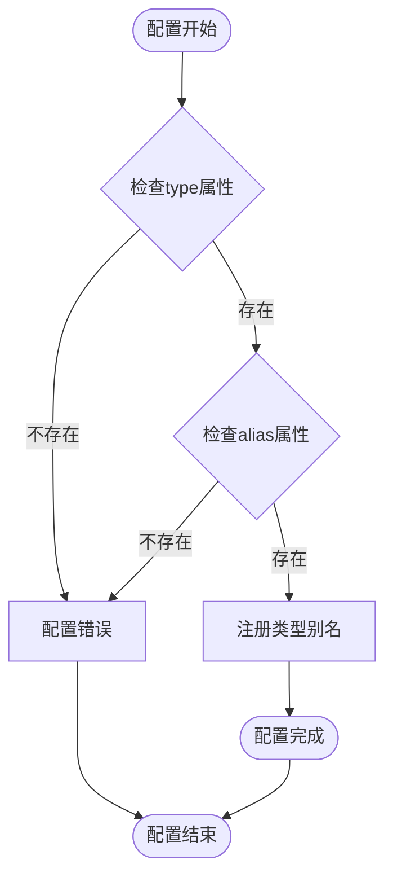
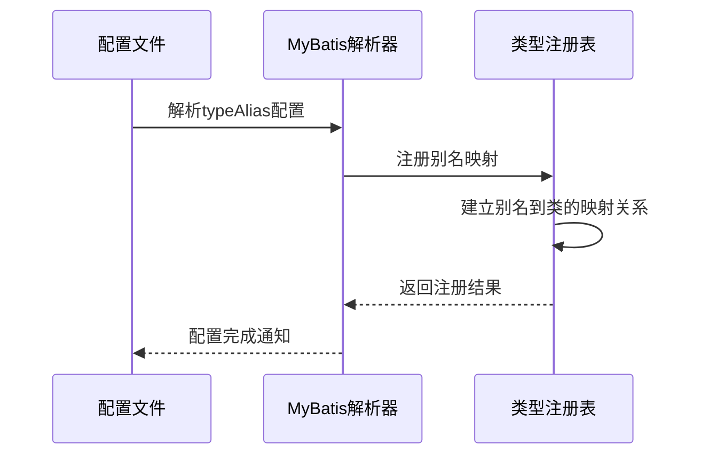
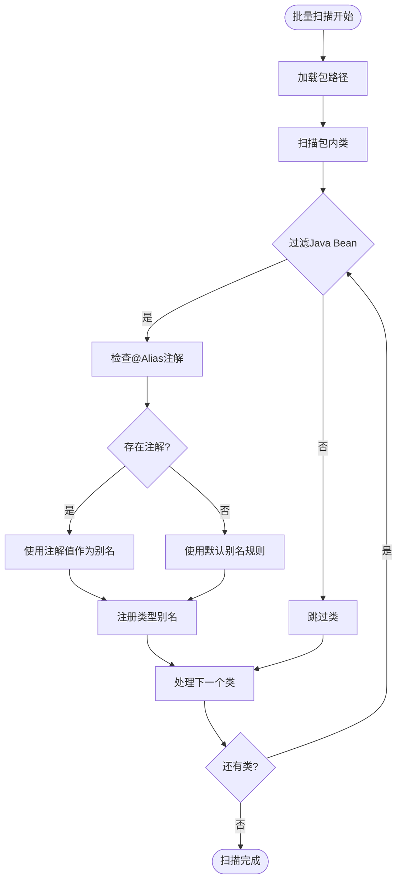
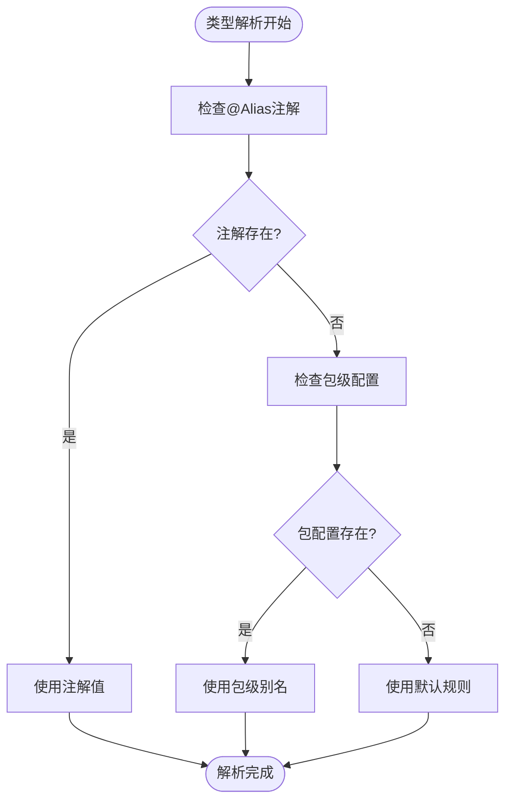
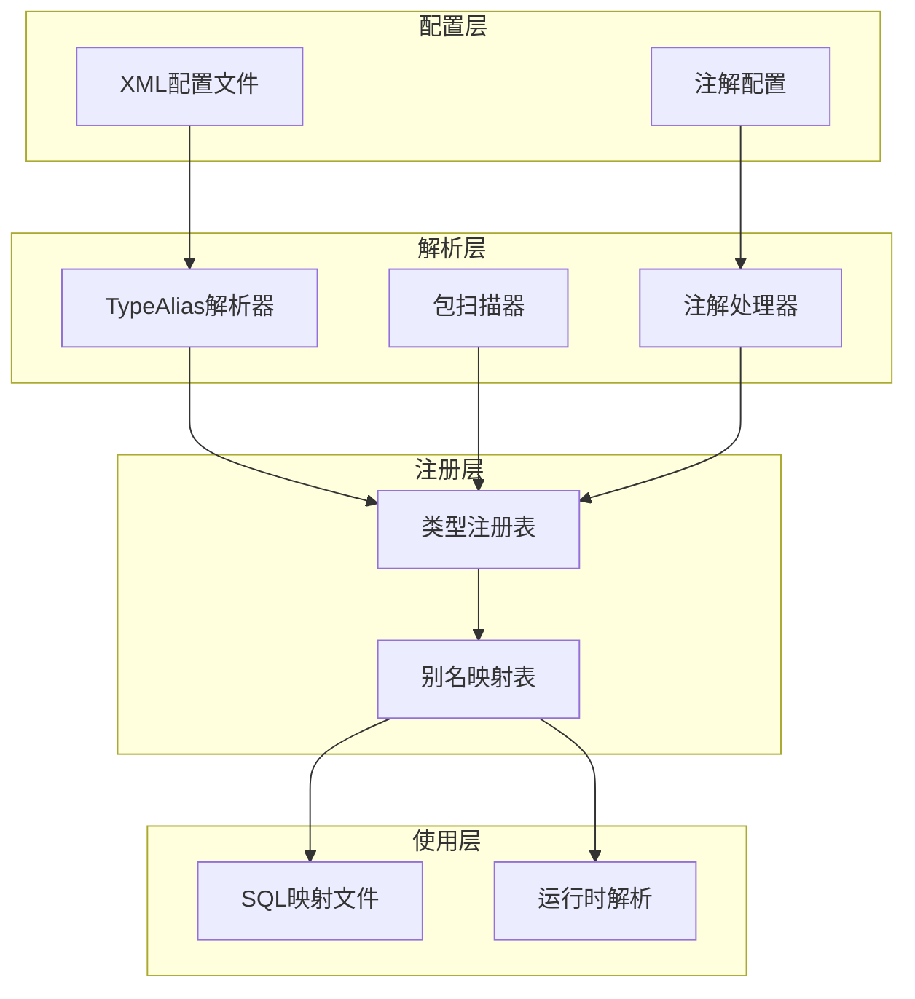
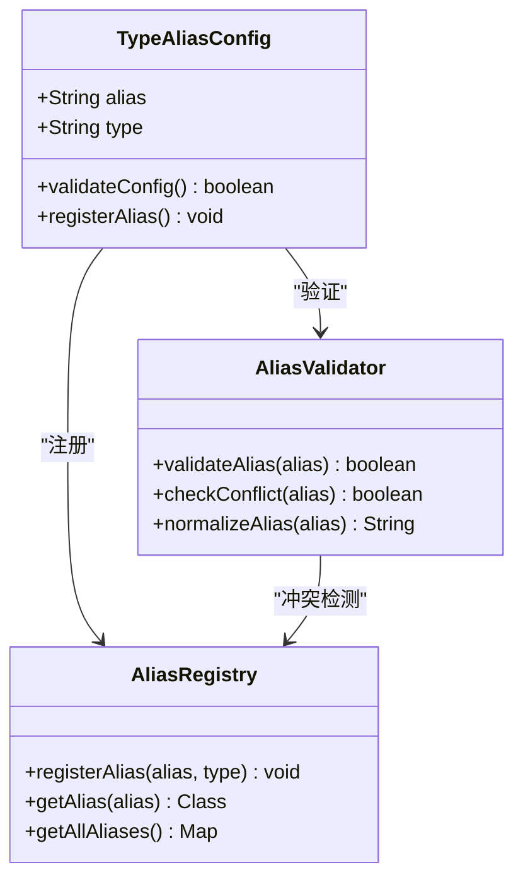
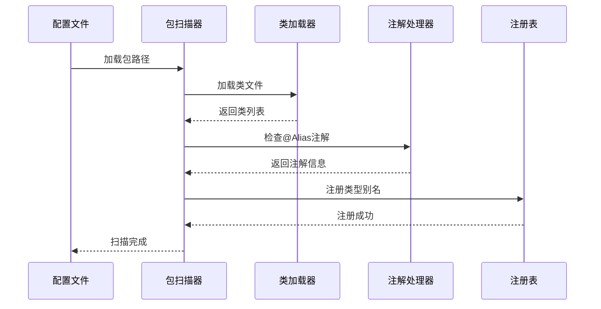
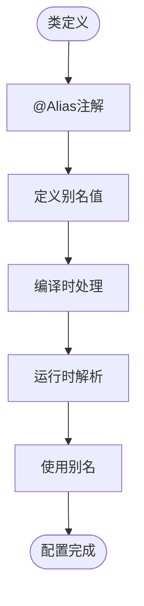

# TypeAliases类型别名

<cite>
**本文档引用的文件**
- [config.md](file://docs/backend-base/mybatis/config.md)
- [mybatis-mapper.md](file://docs/backend-base/mybatis/mybatis-mapper.md)
- [mapper.md](file://docs/backend-base/mybatis/mapper.md)
</cite>

## 目录
1. [简介](#简介)
2. [项目结构](#项目结构)
3. [核心组件](#核心组件)
4. [架构概览](#架构概览)
5. [详细组件分析](#详细组件分析)
6. [依赖分析](#依赖分析)
7. [性能考虑](#性能考虑)
8. [故障排除指南](#故障排除指南)
9. [结论](#结论)

## 简介

MyBatis TypeAliases类型别名系统是MyBatis框架中一个重要的配置特性，它允许开发者为Java类型设置简短的别名，从而减少XML配置文件中全限定类名的冗余书写。这一特性不仅提高了配置文件的可读性和简洁性，还简化了类型引用的复杂度。

类型别名系统主要服务于以下目的：
- **减少冗余**：避免在XML配置中重复书写完整的类名
- **提高可读性**：使用简洁易懂的别名替代复杂的全限定名
- **增强灵活性**：支持单个类型配置和批量包扫描两种模式
- **注解支持**：通过@Alias注解实现声明式配置

## 项目结构

MyBatis类型别名配置主要分布在以下文档文件中：

```mermaid
graph TB
subgraph "MyBatis配置文档"
A[config.md<br/>核心配置]
B[mybatis-mapper.md<br/>映射配置]
C[mapper.md<br/>SQL映射]
end
subgraph "TypeAliases配置"
D[typeAlias元素<br/>单个类型配置]
E[package元素<br/>批量包扫描]
F[@Alias注解<br/>声明式配置]
end
A --> D
A --> E
A --> F
B --> D
C --> D
```

**图表来源**
- [config.md:72-104](file://docs/backend-base/mybatis/config.md#L72-L104)
- [mybatis-mapper.md:25-35](file://docs/backend-base/mybatis/mybatis-mapper.md#L25-L35)

**章节来源**
- [config.md:72-104](file://docs/backend-base/mybatis/config.md#L72-L104)
- [mybatis-mapper.md:25-35](file://docs/backend-base/mybatis/mybatis-mapper.md#L25-L35)

## 核心组件

### typeAlias元素配置

typeAlias元素是TypeAliases系统的核心配置组件，用于为单个Java类型设置别名。

#### 基本语法结构



**图表来源**
- [config.md:76-85](file://docs/backend-base/mybatis/config.md#L76-L85)

#### 配置示例

单个类型别名配置展示了如何为特定的Java类设置简短别名：



**图表来源**
- [config.md:76-85](file://docs/backend-base/mybatis/config.md#L76-L85)

**章节来源**
- [config.md:76-85](file://docs/backend-base/mybatis/config.md#L76-L85)

### package元素批量配置

package元素提供了批量扫描和注册类型别名的功能，大大简化了配置过程。

#### 扫描机制



**图表来源**
- [config.md:89-95](file://docs/backend-base/mybatis/config.md#L89-L95)

#### 默认别名规则

当类上没有@Alias注解时，MyBatis遵循以下默认规则：
- 使用类名的首字母小写作为默认别名
- 例如：`domain.blog.Author` -> `author`

**章节来源**
- [config.md:89-95](file://docs/backend-base/mybatis/config.md#L89-L95)

### @Alias注解配置

@Alias注解提供了声明式的类型别名配置方式，允许开发者在类定义时直接指定别名。

#### 注解优先级



**图表来源**
- [config.md:99-104](file://docs/backend-base/mybatis/config.md#L99-L104)

**章节来源**
- [config.md:99-104](file://docs/backend-base/mybatis/config.md#L99-L104)

## 架构概览

TypeAliases系统在整个MyBatis配置体系中扮演着重要角色，它与XML配置文件、注解系统和运行时解析器协同工作。



**图表来源**
- [config.md:72-104](file://docs/backend-base/mybatis/config.md#L72-L104)
- [mybatis-mapper.md:25-35](file://docs/backend-base/mybatis/mybatis-mapper.md#L25-L35)

## 详细组件分析

### 单个类型配置策略

单个类型配置适用于需要精确控制每个类别的场景，特别适合以下情况：

#### 适用场景

- **特殊命名需求**：某些类需要特殊的别名表示
- **向后兼容**：保持现有配置的兼容性
- **团队规范**：统一团队内部的命名约定
- **第三方集成**：与外部系统集成时的命名映射

#### 配置最佳实践



**图表来源**
- [config.md:76-85](file://docs/backend-base/mybatis/config.md#L76-L85)

**章节来源**
- [config.md:76-85](file://docs/backend-base/mybatis/config.md#L76-L85)

### 批量包扫描策略

批量包扫描提供了高效的配置方式，特别适合大型项目。

#### 包扫描流程



**图表来源**
- [config.md:89-95](file://docs/backend-base/mybatis/config.md#L89-L95)

#### 性能优化建议

- **精确包路径**：只扫描必要的包，避免扫描整个应用
- **类过滤**：排除不需要的类，如抽象类、接口等
- **缓存机制**：利用MyBatis的缓存机制提高扫描效率

**章节来源**
- [config.md:89-95](file://docs/backend-base/mybatis/config.md#L89-L95)

### 注解配置策略

@Alias注解提供了声明式的配置方式，将配置与代码紧密结合。

#### 注解使用模式



**图表来源**
- [config.md:99-104](file://docs/backend-base/mybatis/config.md#L99-L104)

**章节来源**
- [config.md:99-104](file://docs/backend-base/mybatis/config.md#L99-L104)

## 依赖分析

TypeAliases系统与其他MyBatis组件存在密切的依赖关系：

```mermaid
graph TB
subgraph "TypeAliases系统"
A[typeAlias元素]
B[package元素]
C[@Alias注解]
end
subgraph "依赖组件"
D[XML解析器]
E[注解处理器]
F[类型注册表]
G[SQL映射解析器]
end
subgraph "被依赖组件"
H[ResultMap配置]
I[ParameterType配置]
J[ResultType配置]
end
A --> D
B --> D
C --> E
D --> F
E --> F
F --> G
G --> H
G --> I
G --> J
```

**图表来源**
- [config.md:72-104](file://docs/backend-base/mybatis/config.md#L72-L104)
- [mybatis-mapper.md:25-35](file://docs/backend-base/mybatis/mybatis-mapper.md#L25-L35)

### 优先级规则

TypeAliases系统遵循以下优先级规则：

1. **@Alias注解**：最高优先级，直接覆盖其他配置
2. **XML typeAlias配置**：次高优先级，精确指定的别名
3. **包扫描配置**：再次优先级，批量配置的别名
4. **默认规则**：最低优先级，使用类名的首字母小写

**章节来源**
- [config.md:97-104](file://docs/backend-base/mybatis/config.md#L97-L104)

## 性能考虑

### 配置性能影响

- **单个配置**：解析速度快，但配置量大
- **批量扫描**：配置简单，但扫描开销较大
- **注解配置**：编译时处理，运行时无额外开销

### 最佳实践建议

1. **混合使用**：结合多种配置方式，平衡配置复杂度和性能
2. **合理分包**：将相关类放在同一包中，便于批量扫描
3. **避免冲突**：确保别名的唯一性，避免命名冲突

## 故障排除指南

### 常见问题及解决方案

#### 命名冲突问题

**问题描述**：多个类使用相同的别名

**解决方案**：
- 检查@Alias注解的唯一性
- 避免包扫描时的重复定义
- 使用更具体的包路径

#### 类型解析失败

**问题描述**：无法找到指定的类

**解决方案**：
- 检查类的完整限定名
- 确认类存在于类路径中
- 验证包扫描路径的正确性

#### 配置顺序问题

**问题描述**：配置顺序影响解析结果

**解决方案**：
- 确保@Alias注解在类定义时正确配置
- 按照优先级顺序配置typeAlias和package
- 验证配置文件的加载顺序

**章节来源**
- [config.md:72-104](file://docs/backend-base/mybatis/config.md#L72-L104)

## 结论

MyBatis TypeAliases类型别名系统通过提供灵活的配置方式，显著改善了XML配置文件的可读性和维护性。系统支持单个类型配置、批量包扫描和注解配置三种方式，满足不同场景的需求。

关键优势包括：
- **灵活性**：多种配置方式适应不同需求
- **可维护性**：减少全限定类名的重复书写
- **性能优化**：支持批量扫描和缓存机制
- **向后兼容**：与现有配置保持兼容

通过合理使用TypeAliases系统，开发者可以构建更加清晰、易维护的MyBatis配置，提高开发效率和代码质量。