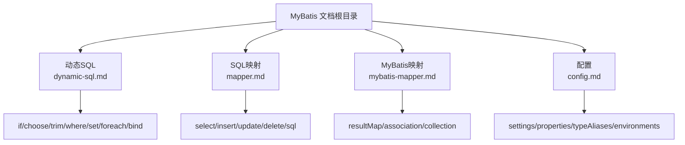
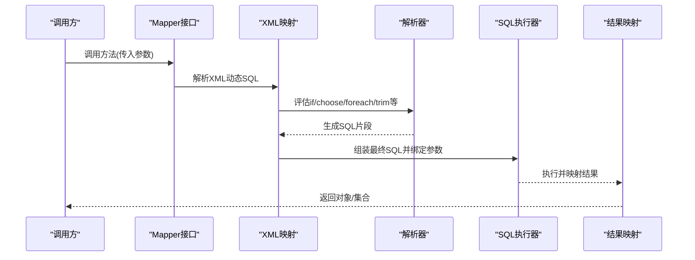
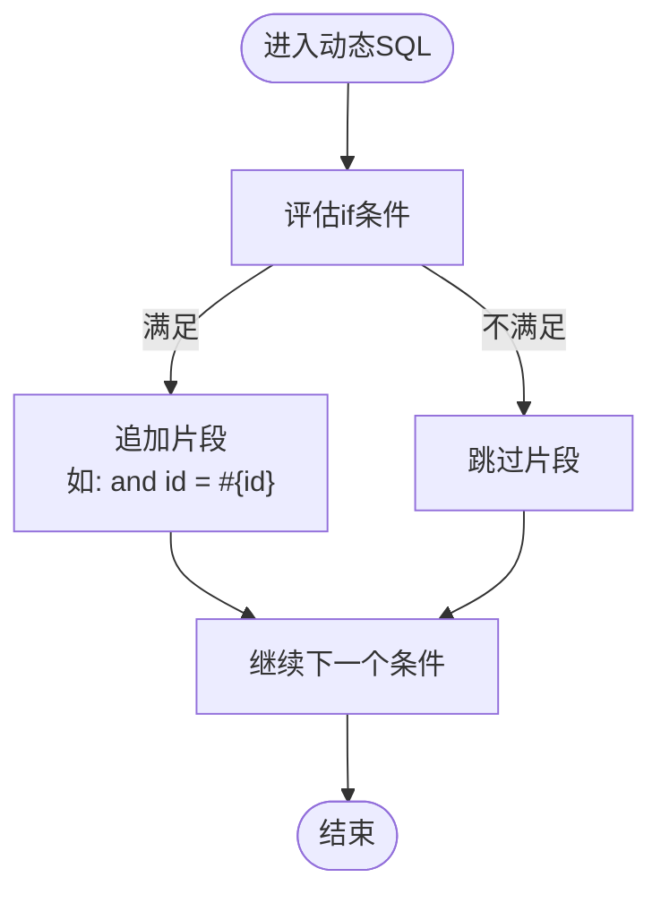
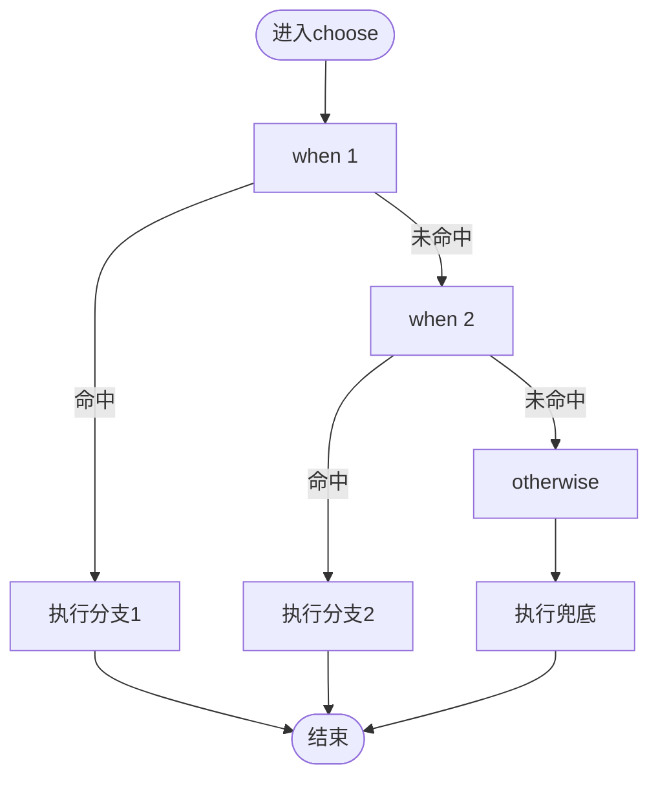
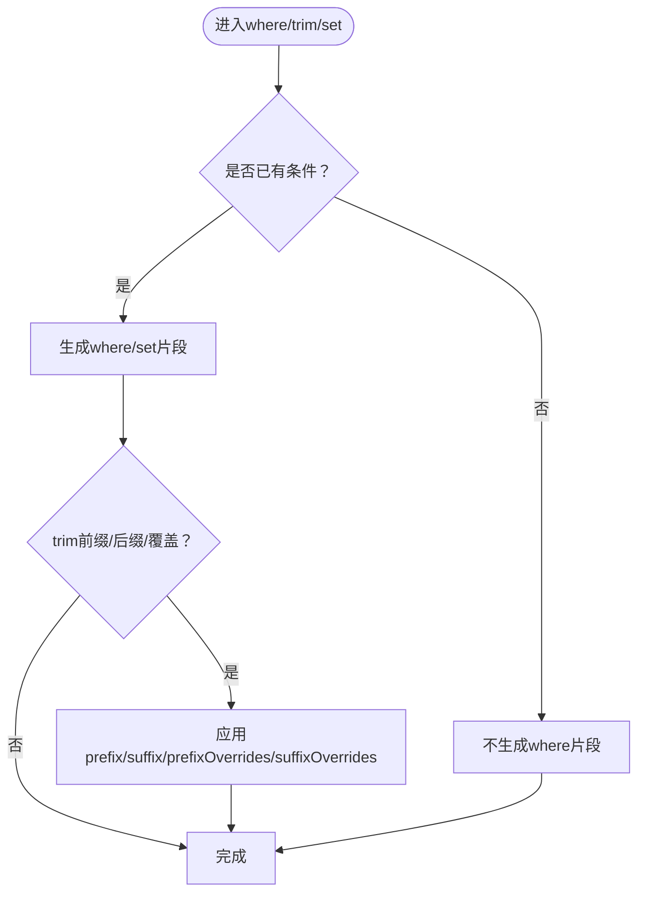
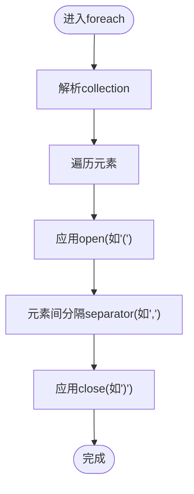
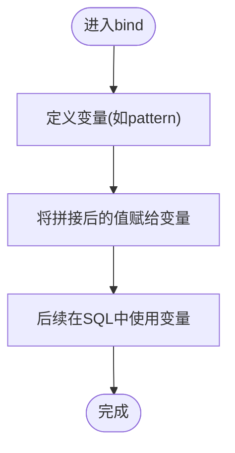
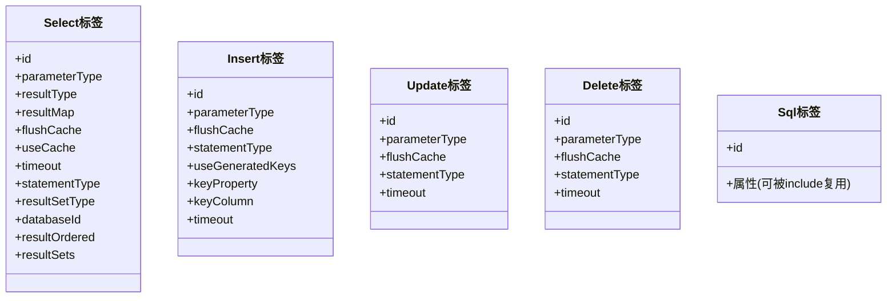
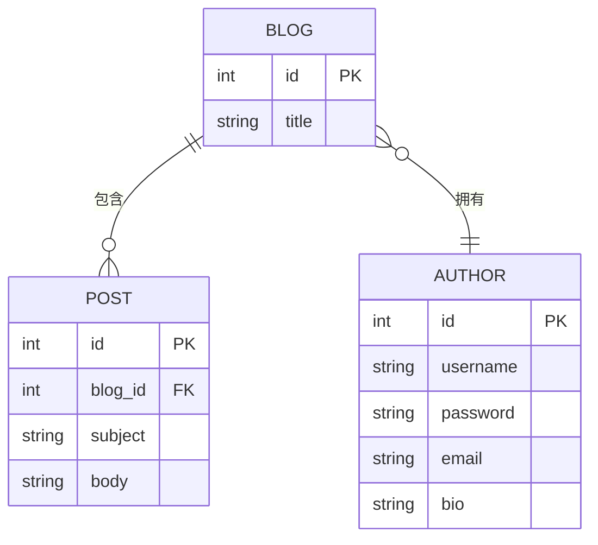
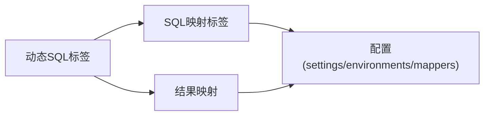

# 动态SQL构建

<cite>
**本文引用的文件**
- [dynamic-sql.md](file://docs/backend-base/mybatis/dynamic-sql.md)
- [mapper.md](file://docs/backend-base/mybatis/mapper.md)
- [mybatis-mapper.md](file://docs/backend-base/mybatis/mybatis-mapper.md)
- [config.md](file://docs/backend-base/mybatis/config.md)
</cite>

## 目录
1. [简介](#简介)
2. [项目结构](#项目结构)
3. [核心组件](#核心组件)
4. [架构总览](#架构总览)
5. [详细组件分析](#详细组件分析)
6. [依赖分析](#依赖分析)
7. [性能考量](#性能考量)
8. [故障排查指南](#故障排查指南)
9. [结论](#结论)
10. [附录](#附录)

## 简介
本技术文档围绕 MyBatis 的动态 SQL 能力展开，系统讲解 if、choose(when/otherwise)、trim(where/set)、foreach、bind 等核心标签的语法与应用场景，剖析动态 SQL 的工作原理与生成机制，结合单表查询、多表联查、批量操作、条件筛选等常见业务场景，给出可复用的实现思路与最佳实践。同时覆盖 SQL 注入防护、性能优化与调试技巧，帮助开发者构建灵活、安全、高效的动态 SQL 解决方案。

## 项目结构
本仓库与 MyBatis 动态 SQL 相关的知识主要集中在 backend-base/mybatis 文档中，涵盖：
- 动态 SQL 标签详解与示例
- SQL 映射标签与参数映射
- 结果映射（resultMap）与关联/集合映射
- MyBatis 配置项与性能相关设置

图表来源
- [dynamic-sql.md:1-278](file://docs/backend-base/mybatis/dynamic-sql.md#L1-L278)
- [mapper.md:1-242](file://docs/backend-base/mybatis/mapper.md#L1-L242)
- [mybatis-mapper.md:1-488](file://docs/backend-base/mybatis/mybatis-mapper.md#L1-L488)
- [config.md:1-240](file://docs/backend-base/mybatis/config.md#L1-L240)

章节来源
- [dynamic-sql.md:1-278](file://docs/backend-base/mybatis/dynamic-sql.md#L1-L278)
- [mapper.md:1-242](file://docs/backend-base/mybatis/mapper.md#L1-L242)
- [mybatis-mapper.md:1-488](file://docs/backend-base/mybatis/mybatis-mapper.md#L1-L488)
- [config.md:1-240](file://docs/backend-base/mybatis/config.md#L1-L240)

## 核心组件
- 动态 SQL 标签族
  - if：按条件拼接片段，常用于 where、insert、update
  - choose/when/otherwise：类似 switch 的互斥分支
  - where/trim/set：规范化 where/set 片段，自动处理 AND/OR 前缀与尾随逗号
  - foreach：批量 in 条件与批量插入
  - bind：在映射文件中定义变量，便于模糊匹配等场景
- SQL 映射标签族
  - select/insert/update/delete/sql：映射查询、增删改与可复用片段
- 结果映射
  - resultMap、association、collection：复杂对象映射与一对多/一对一/多对多
- 配置与性能
  - settings、typeAliases、environments、mappers 等配置项影响动态 SQL 的执行与缓存策略

章节来源
- [dynamic-sql.md:3-278](file://docs/backend-base/mybatis/dynamic-sql.md#L3-L278)
- [mapper.md:3-242](file://docs/backend-base/mybatis/mapper.md#L3-L242)
- [mybatis-mapper.md:5-488](file://docs/backend-base/mybatis/mybatis-mapper.md#L5-L488)
- [config.md:54-240](file://docs/backend-base/mybatis/config.md#L54-L240)

## 架构总览
MyBatis 动态 SQL 的执行链路大致如下：
- Mapper XML 中定义动态 SQL 片段
- MyBatis 解析 XML，按标签生成 SQL 节点树
- 运行时根据参数与条件评估 if/choose/foreach 等标签
- 生成最终 SQL 字符串并绑定参数
- 通过 PreparedStatement 执行，返回结果映射到 Java 对象

图表来源
- [dynamic-sql.md:3-278](file://docs/backend-base/mybatis/dynamic-sql.md#L3-L278)
- [mapper.md:3-242](file://docs/backend-base/mybatis/mapper.md#L3-L242)
- [mybatis-mapper.md:5-488](file://docs/backend-base/mybatis/mybatis-mapper.md#L5-L488)

## 详细组件分析

### if 标签
- 用途：按条件拼接 SQL 片段，常用于 where、insert、update
- 关键点：条件表达式使用 OGNL；注意空值判断与布尔表达式组合
- 典型场景：登录名/密码、状态、ID 等条件的可选拼接

图表来源
- [dynamic-sql.md:3-91](file://docs/backend-base/mybatis/dynamic-sql.md#L3-L91)

章节来源
- [dynamic-sql.md:3-91](file://docs/backend-base/mybatis/dynamic-sql.md#L3-L91)

### choose/when/otherwise 标签
- 用途：互斥分支，类似 switch-case
- 关键点：when 顺序决定优先级；otherwise 作为兜底分支
- 典型场景：按 id/loginname/password 等不同维度择一查询

图表来源
- [dynamic-sql.md:93-113](file://docs/backend-base/mybatis/dynamic-sql.md#L93-L113)

章节来源
- [dynamic-sql.md:93-113](file://docs/backend-base/mybatis/dynamic-sql.md#L93-L113)

### where/trim/set 标签
- where：自动插入 WHERE 关键字，自动剔除首部多余的 AND/OR
- trim：灵活定制前缀/后缀与要去除的多余字符
- set：自动插入 SET 关键字并去除尾部逗号
- 关键点：避免手写 AND/OR 导致语法错误；set 用于动态更新

图表来源
- [dynamic-sql.md:115-239](file://docs/backend-base/mybatis/dynamic-sql.md#L115-L239)

章节来源
- [dynamic-sql.md:115-239](file://docs/backend-base/mybatis/dynamic-sql.md#L115-L239)

### foreach 标签
- 用途：IN 条件、批量插入、批量更新
- 关键属性：collection、item、index、open、separator、close
- collection 规则：List/Array 默认使用 list/array；Map 可用 map.keys/map.values/map.entrySet()

图表来源
- [dynamic-sql.md:241-278](file://docs/backend-base/mybatis/dynamic-sql.md#L241-L278)

章节来源
- [dynamic-sql.md:241-278](file://docs/backend-base/mybatis/dynamic-sql.md#L241-L278)

### bind 标签
- 用途：在映射文件中定义变量，常用于模糊匹配等场景
- 关键点：参数名称固定为 _parameter，表示传入的查询对象

图表来源
- [dynamic-sql.md:266-278](file://docs/backend-base/mybatis/dynamic-sql.md#L266-L278)

章节来源
- [dynamic-sql.md:266-278](file://docs/backend-base/mybatis/dynamic-sql.md#L266-L278)

### SQL 映射标签与参数映射
- select/insert/update/delete/sql：映射查询、增删改与可复用片段
- 参数映射：简单参数与复杂对象参数的绑定规则
- 主键生成：useGeneratedKeys、keyProperty、selectKey/@SelectKey/@Options

图表来源
- [mapper.md:5-242](file://docs/backend-base/mybatis/mapper.md#L5-L242)

章节来源
- [mapper.md:5-242](file://docs/backend-base/mybatis/mapper.md#L5-L242)

### 结果映射与关联/集合映射
- resultMap：简化列到属性的映射，支持自动映射与手动映射
- association：一对一关联，支持嵌套 select 与嵌套结果映射
- collection：一对多集合，支持嵌套 select 与嵌套结果映射
- fetchType：eager/lazy 控制加载策略，影响性能与 N+1 问题

图表来源
- [mybatis-mapper.md:234-488](file://docs/backend-base/mybatis/mybatis-mapper.md#L234-L488)

章节来源
- [mybatis-mapper.md:234-488](file://docs/backend-base/mybatis/mybatis-mapper.md#L234-L488)

## 依赖分析
- 标签依赖
  - where/trim/set 依赖 if 的条件评估结果
  - choose/when/otherwise 与 if 可组合使用，实现互斥与可选分支
  - foreach 依赖 collection 的解析与遍历
  - bind 依赖 _parameter 的参数对象
- 映射依赖
  - select/insert/update/delete 依赖 XML 命名空间与 id 唯一性
  - resultMap 依赖列名与属性名的映射或手动配置
  - association/collection 依赖 select 语句与外键关系
- 配置依赖
  - settings 决定缓存、驼峰映射、日志实现等
  - environments 决定数据源类型与事务管理器
  - mappers 决定映射文件的扫描范围

图表来源
- [dynamic-sql.md:3-278](file://docs/backend-base/mybatis/dynamic-sql.md#L3-L278)
- [mapper.md:3-242](file://docs/backend-base/mybatis/mapper.md#L3-L242)
- [mybatis-mapper.md:5-488](file://docs/backend-base/mybatis/mybatis-mapper.md#L5-L488)
- [config.md:54-240](file://docs/backend-base/mybatis/config.md#L54-L240)

章节来源
- [dynamic-sql.md:3-278](file://docs/backend-base/mybatis/dynamic-sql.md#L3-L278)
- [mapper.md:3-242](file://docs/backend-base/mybatis/mapper.md#L3-L242)
- [mybatis-mapper.md:5-488](file://docs/backend-base/mybatis/mybatis-mapper.md#L5-L488)
- [config.md:54-240](file://docs/backend-base/mybatis/config.md#L54-L240)

## 性能考量
- 懒加载与 N+1
  - association/collection 的 fetchType 可设为 lazy，减少不必要的关联查询
  - 注意：懒加载依赖代理与延迟加载机制，需谨慎使用以避免过度查询
- 缓存策略
  - settings 中 cacheEnabled/useCache/flushCache 等影响缓存行为
  - mapUnderscoreToCamelCase 提升列名与属性名匹配效率
- 批量操作
  - foreach 的 open/separator/close 组合提升 IN 条件与批量插入效率
  - 注意：批量插入过大可能导致 SQL 过长，需结合数据库限制与分批策略
- 日志与可观测性
  - settings 中 logImpl 指定日志实现，便于定位动态 SQL 生成与执行问题

章节来源
- [mybatis-mapper.md:359-377](file://docs/backend-base/mybatis/mybatis-mapper.md#L359-L377)
- [config.md:54-71](file://docs/backend-base/mybatis/config.md#L54-L71)

## 故障排查指南
- where/trim 语法错误
  - 症状：where 片段末尾残留 AND/OR 导致 SQL 语法错误
  - 处理：使用 where/trim/set 自动规范化，或在 trim 中配置 prefixOverrides/suffixOverrides
- foreach 参数缺失
  - 症状：IN 条件为空或集合未正确传入
  - 处理：确保 collection 正确设置；List/Array 默认使用 list/array；Map 使用 map.keys/map.values/map.entrySet()
- bind 变量异常
  - 症状：_parameter 引用错误导致变量未定义
  - 处理：确认 bind 的 _parameter 引用与传入参数对象一致
- 结果映射不匹配
  - 症状：列名与属性名不一致导致映射失败
  - 处理：使用 resultMap 手动映射或启用 mapUnderscoreToCamelCase
- 日志与调试
  - 建议：在 settings 中配置合适的日志实现，观察动态 SQL 生成与执行过程

章节来源
- [dynamic-sql.md:115-239](file://docs/backend-base/mybatis/dynamic-sql.md#L115-L239)
- [dynamic-sql.md:241-278](file://docs/backend-base/mybatis/dynamic-sql.md#L241-L278)
- [config.md:54-71](file://docs/backend-base/mybatis/config.md#L54-L71)

## 结论
MyBatis 的动态 SQL 通过 if/choose/trim/where/set/foreach/bind 等标签，实现了灵活的条件拼接与复杂查询的可配置化。配合 select/insert/update/delete/sql 等映射标签与 resultMap 的结果映射能力，能够覆盖从单表查询到多表联查、从批量操作到条件筛选的广泛业务场景。通过合理配置 settings、environments、mappers 等项，结合懒加载、缓存与日志策略，可在保证安全性的同时显著提升性能与可维护性。

## 附录
- 常见业务场景建议
  - 单表查询：优先使用 where + if 组合，避免手写 AND/OR
  - 多表联查：使用 association/collection + 嵌套 select 或嵌套结果映射
  - 批量操作：使用 foreach 的 open/separator/close，注意分批与 SQL 长度限制
  - 条件筛选：结合 choose/when/otherwise 与 if，实现互斥与可选分支
- 安全与合规
  - 严格使用参数占位符绑定参数，避免字符串拼接
  - 使用 trim/where/set 规范化 SQL 片段，减少语法错误风险
  - 对敏感字段进行脱敏与权限控制，避免越权访问