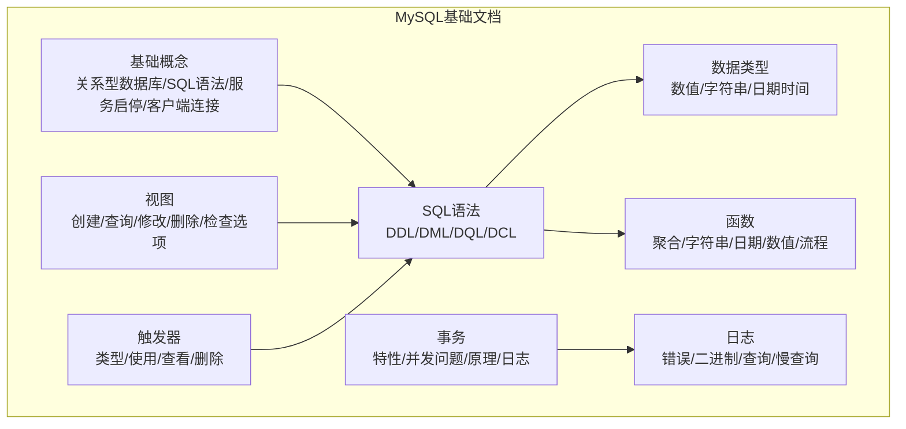
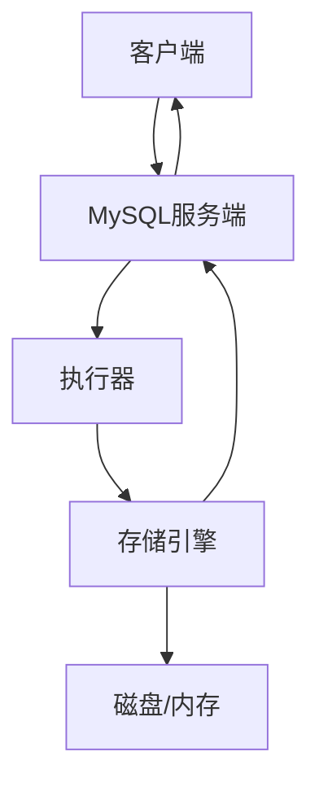
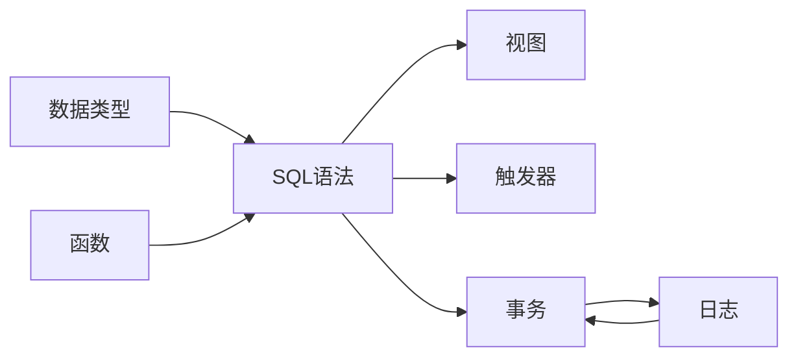

# MySQL基础概念

<cite>
**本文引用的文件**
- [docs/backend-base/mysql/base.md](file://docs/backend-base/mysql/base.md)
- [docs/backend-base/mysql/grammar.md](file://docs/backend-base/mysql/grammar.md)
- [docs/backend-base/mysql/data-type.md](file://docs/backend-base/mysql/data-type.md)
- [docs/backend-base/mysql/function.md](file://docs/backend-base/mysql/function.md)
- [docs/backend-base/mysql/transaction.md](file://docs/backend-base/mysql/transaction.md)
- [docs/backend-base/mysql/log.md](file://docs/backend-base/mysql/log.md)
- [docs/backend-base/mysql/view.md](file://docs/backend-base/mysql/view.md)
- [docs/backend-base/mysql/trigger.md](file://docs/backend-base/mysql/trigger.md)
</cite>

## 目录
1. [引言](#引言)
2. [项目结构](#项目结构)
3. [核心组件](#核心组件)
4. [架构概览](#架构概览)
5. [详细组件分析](#详细组件分析)
6. [依赖分析](#依赖分析)
7. [性能考虑](#性能考虑)
8. [故障排查指南](#故障排查指南)
9. [结论](#结论)
10. [附录](#附录)

## 引言
本入门文档面向MySQL初学者，系统梳理关系型数据库的基本概念、SQL语句通用语法规则、MySQL服务的启动停止操作、客户端连接方式等基础知识。文档同时覆盖SQL语句的书写规范、注释方法、大小写规则等实用技巧，并提供实际的操作示例和命令行连接的具体步骤，帮助读者快速掌握MySQL的基本概念和操作技能。

## 项目结构
本仓库为VuePress静态站点，MySQL相关文档位于docs/backend-base/mysql目录下，按主题划分为多个独立章节：
- 基础概念与入门：关系型数据库、SQL语法规范、服务启停、客户端连接
- 语法详解：DDL/DML/DQL/DCL语句分类与常用语法
- 数据类型：数值型、字符串、日期时间类型的详细说明
- 函数：聚合函数、字符串函数、日期时间函数、数值函数、流程函数
- 事务：事务特性、并发问题、原理与日志机制
- 日志：错误日志、二进制日志、查询日志、慢查询日志
- 视图与触发器：视图的创建、查询、修改、删除与检查选项；触发器的类型与使用

**图表来源**
- [docs/backend-base/mysql/base.md:1-30](file://docs/backend-base/mysql/base.md#L1-L30)
- [docs/backend-base/mysql/grammar.md:1-188](file://docs/backend-base/mysql/grammar.md#L1-L188)
- [docs/backend-base/mysql/data-type.md:1-59](file://docs/backend-base/mysql/data-type.md#L1-L59)
- [docs/backend-base/mysql/function.md:1-73](file://docs/backend-base/mysql/function.md#L1-L73)
- [docs/backend-base/mysql/transaction.md:1-128](file://docs/backend-base/mysql/transaction.md#L1-L128)
- [docs/backend-base/mysql/log.md:1-111](file://docs/backend-base/mysql/log.md#L1-L111)
- [docs/backend-base/mysql/view.md:1-53](file://docs/backend-base/mysql/view.md#L1-L53)
- [docs/backend-base/mysql/trigger.md:1-35](file://docs/backend-base/mysql/trigger.md#L1-L35)

**章节来源**
- [docs/backend-base/mysql/base.md:1-30](file://docs/backend-base/mysql/base.md#L1-L30)
- [docs/backend-base/mysql/grammar.md:1-188](file://docs/backend-base/mysql/grammar.md#L1-L188)
- [docs/backend-base/mysql/data-type.md:1-59](file://docs/backend-base/mysql/data-type.md#L1-L59)
- [docs/backend-base/mysql/function.md:1-73](file://docs/backend-base/mysql/function.md#L1-L73)
- [docs/backend-base/mysql/transaction.md:1-128](file://docs/backend-base/mysql/transaction.md#L1-L128)
- [docs/backend-base/mysql/log.md:1-111](file://docs/backend-base/mysql/log.md#L1-L111)
- [docs/backend-base/mysql/view.md:1-53](file://docs/backend-base/mysql/view.md#L1-L53)
- [docs/backend-base/mysql/trigger.md:1-35](file://docs/backend-base/mysql/trigger.md#L1-L35)

## 核心组件
本节聚焦MySQL入门必备的核心知识点，包括关系型数据库的概念、SQL语句的通用语法、MySQL服务的启动停止、客户端连接方式等。

- 关系型数据库：建立在关系型数据模型上，由多张相互连接的二维表组成的数据库。理解这一概念有助于后续学习表结构设计、主键外键、索引等概念。
- SQL语句通用语法：
  - 支持单行或多行书写，以分号结尾
  - 可使用空格或缩进增强可读性
  - 不区分大小写，但建议统一使用大写
  - 支持注释：使用#作为单行注释，使用/**/作为多行注释
- MySQL服务的启动与停止：提供Windows环境下使用服务名进行启动和停止的示例，便于快速验证服务状态。
- 客户端连接：
  - 使用MySQL自带客户端图形界面连接
  - 使用命令行工具连接，支持指定主机、端口、用户名、密码等参数

**章节来源**
- [docs/backend-base/mysql/base.md:3-29](file://docs/backend-base/mysql/base.md#L3-L29)

## 架构概览
MySQL的体系结构可从“客户端-服务端-存储引擎”三个层面理解：
- 客户端层：负责接收用户输入的SQL语句，进行语法解析、优化、路由至服务端
- 服务层：负责身份认证、权限校验、SQL解析与执行计划生成、缓存管理、日志记录等
- 存储引擎层：负责数据的物理存储、索引建立、事务日志、崩溃恢复等

[本图为概念性架构示意，无需图表来源]

## 详细组件分析

### 关系型数据库与SQL语法规范
- 关系型数据库的定义与特点：强调基于关系模型、多表关联、规范化设计等
- SQL语句书写规范：
  - 结构化书写，便于阅读与维护
  - 统一大写关键字，小写标识符（如表名、列名）提升可读性
  - 注释清晰，便于团队协作与后期维护
- 实践要点：养成良好的SQL书写习惯，有助于减少错误、提高开发效率

**章节来源**
- [docs/backend-base/mysql/base.md:3-12](file://docs/backend-base/mysql/base.md#L3-L12)

### MySQL服务的启动与停止
- Windows服务管理：通过服务名启动/停止MySQL服务，适用于桌面版或服务安装版
- 注意事项：确保服务名与实际安装版本一致；若服务未显示，检查服务是否已安装并启用

**章节来源**
- [docs/backend-base/mysql/base.md:14-22](file://docs/backend-base/mysql/base.md#L14-L22)

### 客户端连接方式
- 图形化客户端：适合初学者直观操作，便于可视化管理数据库对象
- 命令行客户端：支持参数化连接，适合自动化脚本与批量操作
- 常用参数：主机、端口、用户名、密码；建议在生产环境使用安全连接方式

**章节来源**
- [docs/backend-base/mysql/base.md:24-29](file://docs/backend-base/mysql/base.md#L24-L29)

### SQL语句分类与通用语法
- DDL（数据定义语言）：用于创建、修改、删除数据库、表、字段等
- DML（数据操作语言）：用于插入、更新、删除数据
- DQL（数据查询语言）：用于查询数据，支持条件、分组、排序、分页等
- DCL（数据库控制语言）：用于管理用户与权限

**章节来源**
- [docs/backend-base/mysql/grammar.md:3-128](file://docs/backend-base/mysql/grammar.md#L3-L128)

### 数据类型详解
- 数值型：整数类型（TINYINT/SMALLINT/MEDIUMINT/INT/BIGINT）、浮点数类型（FLOAT/DOUBLE）、精确数值类型（DECIMAL）
- 字符串类型：CHAR/VARCHAR/TINYTEXT/TEXT/MEDIUMTEXT/LONGTEXT等
- 日期时间类型：DATE/TIME/YEAR/DATETIME/TIMESTAMP
- 修饰符：unsigned（无符号）、auto_increment（自增）

**章节来源**
- [docs/backend-base/mysql/data-type.md:1-59](file://docs/backend-base/mysql/data-type.md#L1-L59)

### 函数体系
- 聚合函数：count/max/min/avg/sum
- 字符串函数：left/right/concat/lower/upper/trim/length等
- 日期时间函数：curdate/curtime/now/date_add/date_format/datediff等
- 数值函数：sin/cos/tan/abs/sqrt/mod/floor/ceil/round/exp/pi/rand等
- 流程函数：if/ifnull/case/when/then/else/end

**章节来源**
- [docs/backend-base/mysql/function.md:1-73](file://docs/backend-base/mysql/function.md#L1-L73)

### 事务与并发控制
- 事务特性：原子性、一致性、隔离性、持久性
- 并发问题：脏读、不可重复读、幻读
- 原理与日志：
  - 原子性/一致性/持久性：由redo log与undo log共同保障
  - 隔离性：通过锁与MVCC（多版本并发控制）实现
- 存储引擎：InnoDB支持事务，MyISAM不支持事务

**章节来源**
- [docs/backend-base/mysql/transaction.md:1-128](file://docs/backend-base/mysql/transaction.md#L1-L128)

### 日志体系
- 错误日志：mysqld启动/停止、严重错误记录，定位问题首选
- 二进制日志（binlog）：DDL/DML记录，用于主从复制与数据恢复
- 查询日志：记录所有客户端操作语句（默认关闭）
- 慢查询日志：记录执行时间超过阈值的SQL，用于性能分析

**章节来源**
- [docs/backend-base/mysql/log.md:1-111](file://docs/backend-base/mysql/log.md#L1-L111)

### 视图与触发器
- 视图：虚拟表，仅保存查询逻辑，不保存实际数据；支持创建、查询、修改、删除与检查选项
- 触发器：在insert/update/delete前后触发，用于数据完整性、日志记录、数据校验等；支持行级触发

**章节来源**
- [docs/backend-base/mysql/view.md:1-53](file://docs/backend-base/mysql/view.md#L1-L53)
- [docs/backend-base/mysql/trigger.md:1-35](file://docs/backend-base/mysql/trigger.md#L1-L35)

## 依赖分析
MySQL各模块之间存在明确的依赖关系：
- 语法模块依赖数据类型模块：DDL创建表时需选择合适的数据类型
- 函数模块服务于DQL查询：聚合函数、字符串函数、日期时间函数广泛应用于查询场景
- 事务模块依赖存储引擎与日志：InnoDB的事务特性由redo/undo日志保障
- 日志模块支撑事务与复制：binlog用于主从复制，错误日志用于问题诊断
- 视图与触发器依赖SQL语法：二者均通过SQL语句进行定义与管理

[本图为概念性依赖示意，无需图表来源]

## 性能考虑
- 合理使用索引：为高频查询字段建立索引，避免全表扫描
- 控制日志规模：定期清理binlog与慢查询日志，防止磁盘空间不足
- 优化SQL语句：使用EXPLAIN分析执行计划，避免N+1查询与不必要的JOIN
- 事务粒度：尽量缩短事务时间，减少锁竞争

[本节提供一般性指导，无需章节来源]

## 故障排查指南
- 错误日志定位：优先查看错误日志，确认启动/停止异常与严重错误
- 二进制日志分析：使用mysqlbinlog查看binlog内容，辅助数据恢复与审计
- 慢查询日志：开启慢查询日志，结合long_query_time参数定位性能瓶颈
- 权限问题：通过DCL语句检查用户权限，确保连接与操作具备相应权限

**章节来源**
- [docs/backend-base/mysql/log.md:1-111](file://docs/backend-base/mysql/log.md#L1-L111)
- [docs/backend-base/mysql/grammar.md:126-187](file://docs/backend-base/mysql/grammar.md#L126-L187)

## 结论
通过本入门文档，读者可以系统掌握MySQL的基础概念与操作技能，包括关系型数据库的理解、SQL语句的书写规范、MySQL服务的启停与客户端连接、常用的数据类型与函数、事务与日志机制、视图与触发器等。建议在实际环境中多加练习，逐步加深对MySQL体系结构与工作机制的理解。

[本节为总结性内容，无需章节来源]

## 附录
- 实战建议：
  - 在本地搭建MySQL环境，熟悉命令行与图形化工具的使用
  - 从简单表结构与查询开始，逐步尝试复杂查询与事务操作
  - 结合日志与性能分析工具，持续优化SQL与数据库配置
- 进阶方向：
  - 学习索引原理与优化策略
  - 了解备份与恢复方案
  - 探索高可用与集群部署

[本节为补充性内容，无需章节来源]