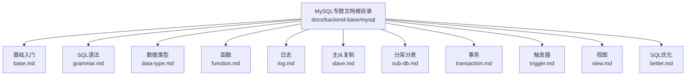
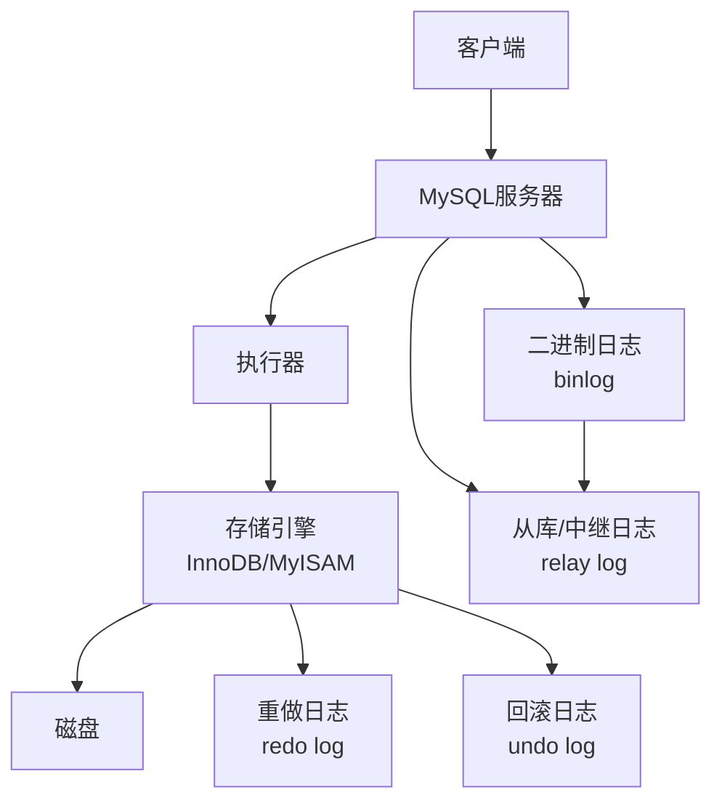
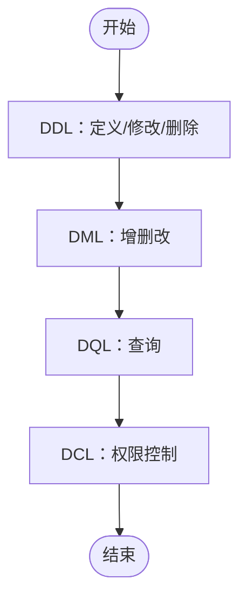
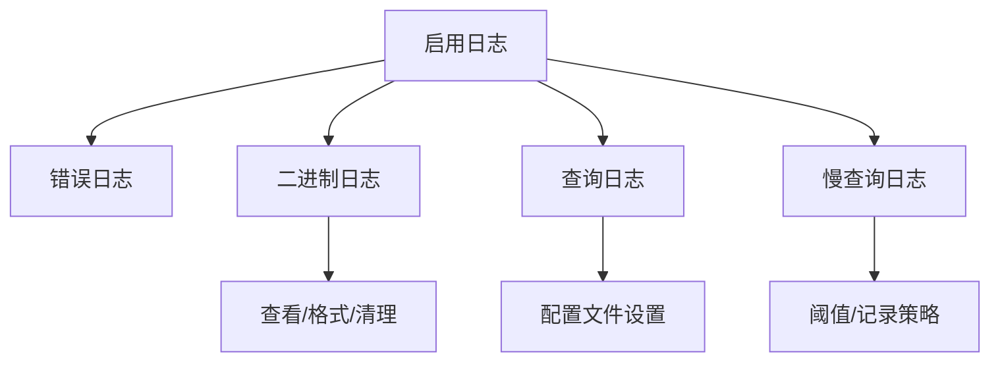
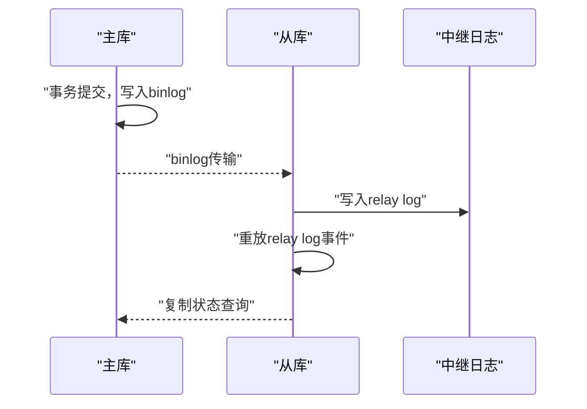
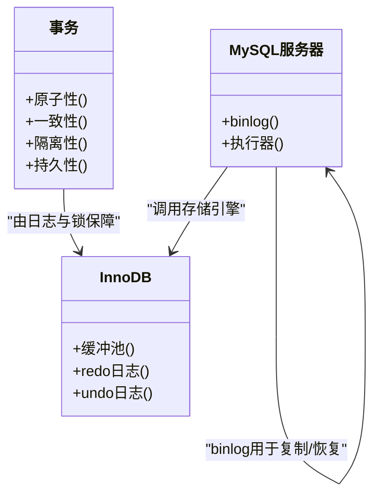
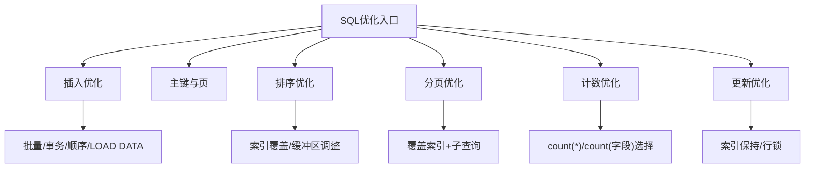
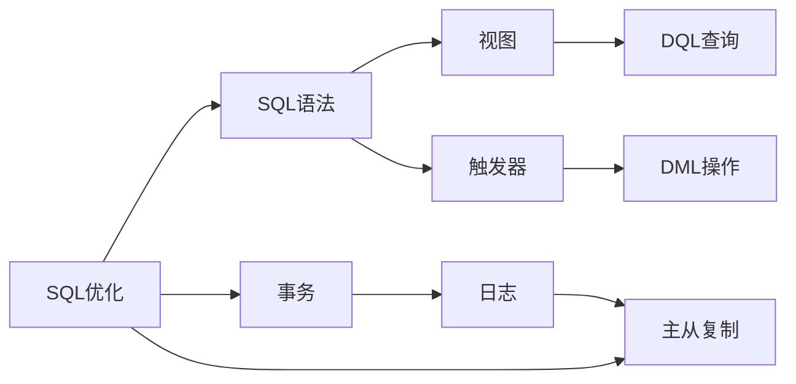

# MySQL数据库

<cite>
**本文引用的文件**
- [base.md](file://docs/backend-base/mysql/base.md)
- [grammar.md](file://docs/backend-base/mysql/grammar.md)
- [data-type.md](file://docs/backend-base/mysql/data-type.md)
- [function.md](file://docs/backend-base/mysql/function.md)
- [log.md](file://docs/backend-base/mysql/log.md)
- [slave.md](file://docs/backend-base/mysql/slave.md)
- [sub-db.md](file://docs/backend-base/mysql/sub-db.md)
- [transaction.md](file://docs/backend-base/mysql/transaction.md)
- [trigger.md](file://docs/backend-base/mysql/trigger.md)
- [view.md](file://docs/backend-base/mysql/view.md)
- [better.md](file://docs/backend-base/mysql/better.md)
</cite>

## 目录
1. [简介](#简介)
2. [项目结构](#项目结构)
3. [核心组件](#核心组件)
4. [架构概览](#架构概览)
5. [详细组件分析](#详细组件分析)
6. [依赖分析](#依赖分析)
7. [性能考虑](#性能考虑)
8. [故障排查指南](#故障排查指南)
9. [结论](#结论)
10. [附录](#附录)

## 简介
本技术文档面向数据库管理员与开发者，系统梳理MySQL数据库的基础概念、SQL语法、数据类型、函数使用、日志管理、主从复制、分库分表、事务处理、触发器、视图等核心主题，并补充SQL优化与运维实践要点。文档内容均来源于仓库中的MySQL专题文档，便于读者循序渐进掌握MySQL知识体系。

## 项目结构
MySQL相关文档位于 docs/backend-base/mysql 目录下，围绕“基础入门、语法、数据类型、函数、日志、主从复制、分库分表、事务、触发器、视图、SQL优化”等主题形成完整的知识地图。

**图表来源**
- [base.md](file://docs/backend-base/mysql/base.md)
- [grammar.md](file://docs/backend-base/mysql/grammar.md)
- [data-type.md](file://docs/backend-base/mysql/data-type.md)
- [function.md](file://docs/backend-base/mysql/function.md)
- [log.md](file://docs/backend-base/mysql/log.md)
- [slave.md](file://docs/backend-base/mysql/slave.md)
- [sub-db.md](file://docs/backend-base/mysql/sub-db.md)
- [transaction.md](file://docs/backend-base/mysql/transaction.md)
- [trigger.md](file://docs/backend-base/mysql/trigger.md)
- [view.md](file://docs/backend-base/mysql/view.md)
- [better.md](file://docs/backend-base/mysql/better.md)

**章节来源**
- [base.md](file://docs/backend-base/mysql/base.md)
- [grammar.md](file://docs/backend-base/mysql/grammar.md)
- [data-type.md](file://docs/backend-base/mysql/data-type.md)
- [function.md](file://docs/backend-base/mysql/function.md)
- [log.md](file://docs/backend-base/mysql/log.md)
- [slave.md](file://docs/backend-base/mysql/slave.md)
- [sub-db.md](file://docs/backend-base/mysql/sub-db.md)
- [transaction.md](file://docs/backend-base/mysql/transaction.md)
- [trigger.md](file://docs/backend-base/mysql/trigger.md)
- [view.md](file://docs/backend-base/mysql/view.md)
- [better.md](file://docs/backend-base/mysql/better.md)

## 核心组件
- 关系型数据库与SQL通用语法：明确SQL语句的书写规范、注释方式与客户端连接方法。
- DDL/DML/DQL/DCL：系统讲解数据库对象定义、数据操作、查询与权限控制。
- 数据类型：覆盖数值、字符串、日期时间等常用类型及其修饰符。
- 函数：聚合函数、字符串、日期时间、数值与流程函数的使用要点。
- 日志：错误日志、二进制日志、查询日志、慢查询日志的用途、配置与清理。
- 主从复制：复制原理、应用场景、搭建步骤与状态检查。
- 分库分表：垂直/水平拆分策略与适用场景。
- 事务：ACID特性、并发问题、InnoDB日志与隔离机制。
- 触发器：行级触发时机、OLD/NEW引用与典型用法。
- 视图：创建、查询、修改与检查选项。
- SQL优化：插入、排序、分页、计数、更新等常见场景的优化策略。

**章节来源**
- [base.md](file://docs/backend-base/mysql/base.md)
- [grammar.md](file://docs/backend-base/mysql/grammar.md)
- [data-type.md](file://docs/backend-base/mysql/data-type.md)
- [function.md](file://docs/backend-base/mysql/function.md)
- [log.md](file://docs/backend-base/mysql/log.md)
- [slave.md](file://docs/backend-base/mysql/slave.md)
- [sub-db.md](file://docs/backend-base/mysql/sub-db.md)
- [transaction.md](file://docs/backend-base/mysql/transaction.md)
- [trigger.md](file://docs/backend-base/mysql/trigger.md)
- [view.md](file://docs/backend-base/mysql/view.md)
- [better.md](file://docs/backend-base/mysql/better.md)

## 架构概览
下图从“客户端—MySQL服务—存储引擎”的视角展示MySQL执行路径与关键组件，帮助理解事务、日志与索引在整体架构中的作用。

**图表来源**
- [transaction.md](file://docs/backend-base/mysql/transaction.md)
- [slave.md](file://docs/backend-base/mysql/slave.md)

## 详细组件分析

### 关系型数据库与SQL基础
- 关系型数据库建立在关系模型之上，由多张相互关联的二维表组成。
- SQL语句书写规范：单行或多行、分号结尾、大小写不敏感但建议大写、支持#与/* */注释。
- 客户端连接方式：图形化客户端或命令行工具，需配置环境变量以便直接使用。

**章节来源**
- [base.md](file://docs/backend-base/mysql/base.md)

### SQL语法（DDL/DML/DQL/DCL）
- DDL：数据库、表、字段的创建、删除、修改与查询。
- DML：插入、更新、删除数据。
- DQL：基础查询、条件查询、分组查询、排序查询、分页查询与执行顺序。
- DCL：用户管理、权限授予与回收。

**图表来源**
- [grammar.md](file://docs/backend-base/mysql/grammar.md)

**章节来源**
- [grammar.md](file://docs/backend-base/mysql/grammar.md)

### 数据类型
- 数值型：TINYINT、SMALLINT、MEDIUMINT、INT、BIGINT、FLOAT、DOUBLE、DECIMAL。
- 字符串：CHAR、VARCHAR、BLOB/TEXT系列、长度与性能差异。
- 日期时间：DATE、TIME、YEAR、DATETIME、TIMESTAMP。

**章节来源**
- [data-type.md](file://docs/backend-base/mysql/data-type.md)

### 函数
- 聚合函数：count、max、min、avg、sum。
- 字符串函数：LEFT、RIGHT、CONCAT、LOWER、UPPER、TRIM、LENGTH、LPAD、RPAD、SUBSTRING、OUNDEX。
- 日期时间函数：CURDATE、CURTIME、NOW、DATE_ADD、DATE_FORMAT、DATEDIFF、ADDTIME、YEAR/MONTH/DAY/HOUR/MINUTE/SECOND等。
- 数值函数：SIN、COS、TAN、ABS、SQRT、MOD、FLOOR、CEIL、ROUND、EXP、PI、RAND。
- 流程函数：IF、IFNULL、CASE WHEN。

**章节来源**
- [function.md](file://docs/backend-base/mysql/function.md)

### 日志管理
- 错误日志：mysqld启动/停止与运行时严重错误记录，定位故障首选。
- 二进制日志（binlog）：DDL/DML记录，支持主从复制与恢复；支持STATEMENT/ROW/MIXED格式；可通过工具查看与清理。
- 查询日志（general_log）：记录所有客户端操作，需手动开启配置。
- 慢查询日志（slow_query_log）：记录超阈值SQL，支持管理语句与未使用索引语句记录。

**图表来源**
- [log.md](file://docs/backend-base/mysql/log.md)

**章节来源**
- [log.md](file://docs/backend-base/mysql/log.md)

### 主从复制
- 定义与场景：故障切换、读写分离、备份不影响主库。
- 原理：主库事务提交写binlog，从库读取binlog写入relay log，重放事件保持数据一致。
- 搭建：主库server-id、权限配置与二进制坐标；从库server-id、只读、复制源配置、开启复制、状态检查。

**图表来源**
- [slave.md](file://docs/backend-base/mysql/slave.md)

**章节来源**
- [slave.md](file://docs/backend-base/mysql/slave.md)

### 分库分表
- 垂直分库：按业务拆分不同表至不同库。
- 垂直分表：同一库内按字段拆分至多表。
- 水平分库：按策略拆分相同结构的表至多库。
- 水平分表：按策略拆分同一表至多表。

**章节来源**
- [sub-db.md](file://docs/backend-base/mysql/sub-db.md)

### 事务
- 事务特性：原子性、一致性、隔离性、持久性。
- 并发问题：脏读、不可重复读、幻读。
- 原理与保障：InnoDB通过redo/undo日志保障原子性/一致性/持久性；隔离性通过锁与MVCC实现。
- 存储引擎与缓冲池：InnoDB缓冲池提升I/O效率；SQL执行流程涉及连接、执行器与存储引擎。
- binlog与事务：binlog为逻辑日志，记录更新逻辑，配合复制与恢复。

**图表来源**
- [transaction.md](file://docs/backend-base/mysql/transaction.md)

**章节来源**
- [transaction.md](file://docs/backend-base/mysql/transaction.md)

### 触发器
- 触发时机：BEFORE/AFTER INSERT/UPDATE/DELETE。
- 引用：OLD/NEW引用变更记录。
- 语法：创建、查看、删除触发器。

**章节来源**
- [trigger.md](file://docs/backend-base/mysql/trigger.md)

### 视图
- 定义：虚拟表，仅保存查询逻辑，不存储物理数据。
- 语法：创建、查看创建语句、修改、删除。
- 检查选项：WITH CHECK OPTION（CASCADE/LOCAL）。

**章节来源**
- [view.md](file://docs/backend-base/mysql/view.md)

### SQL优化
- 插入优化：批量插入、手动事务提交、主键顺序插入、LOAD DATA导入。
- 主键与页：主键顺序组织、页分裂/合并。
- 排序优化：优先Using index，必要时增大sort_buffer_size。
- 分页优化：覆盖索引+子查询减少扫描。
- 计数优化：count(*)与count(字段)的差异与选择。
- 更新优化：行锁基于索引，避免索引失效导致锁升级。

**图表来源**
- [better.md](file://docs/backend-base/mysql/better.md)

**章节来源**
- [better.md](file://docs/backend-base/mysql/better.md)

## 依赖分析
- 组件耦合：日志模块与复制模块强相关（binlog为复制基础）；事务模块依赖InnoDB日志与锁；视图/触发器依赖DQL/DML语句；SQL优化贯穿DDL/DML/DQL。
- 外部依赖：命令行工具（如mysqlbinlog）、配置文件（/etc/my.cnf）。
- 潜在风险：慢查询日志开启不当可能导致I/O压力；binlog清理策略不当造成磁盘占用。

**图表来源**
- [grammar.md](file://docs/backend-base/mysql/grammar.md)
- [view.md](file://docs/backend-base/mysql/view.md)
- [trigger.md](file://docs/backend-base/mysql/trigger.md)
- [log.md](file://docs/backend-base/mysql/log.md)
- [slave.md](file://docs/backend-base/mysql/slave.md)
- [transaction.md](file://docs/backend-base/mysql/transaction.md)
- [better.md](file://docs/backend-base/mysql/better.md)

**章节来源**
- [grammar.md](file://docs/backend-base/mysql/grammar.md)
- [view.md](file://docs/backend-base/mysql/view.md)
- [trigger.md](file://docs/backend-base/mysql/trigger.md)
- [log.md](file://docs/backend-base/mysql/log.md)
- [slave.md](file://docs/backend-base/mysql/slave.md)
- [transaction.md](file://docs/backend-base/mysql/transaction.md)
- [better.md](file://docs/backend-base/mysql/better.md)

## 性能考虑
- 插入：批量提交、顺序主键、LOAD DATA导入。
- 排序：优先索引扫描，必要时扩大排序缓冲区。
- 分页：覆盖索引+子查询，避免深度分页。
- 计数：count(*)通常最优；MyISAM可直接读行数。
- 更新：确保走索引，避免锁升级为表锁。
- 日志：合理配置binlog格式与过期清理，平衡复制与磁盘占用。

**章节来源**
- [better.md](file://docs/backend-base/mysql/better.md)

## 故障排查指南
- 错误日志：定位启动/停止与运行时严重错误。
- 二进制日志：查看binlog格式、使用mysqlbinlog解析、清理过期日志。
- 查询/慢查询日志：开启general_log/slow_query_log，设置阈值与记录策略。
- 主从复制：检查server-id、只读配置、复制源坐标、复制状态。

**章节来源**
- [log.md](file://docs/backend-base/mysql/log.md)
- [slave.md](file://docs/backend-base/mysql/slave.md)

## 结论
本文件基于仓库MySQL专题文档，构建了从基础语法到高级主题（复制、事务、优化）的系统化知识框架。建议结合实际业务场景，逐步落地日志治理、复制架构与SQL优化策略，持续提升数据库稳定性与性能。

## 附录
- 常用命令与配置参考路径：[base.md](file://docs/backend-base/mysql/base.md)、[log.md](file://docs/backend-base/mysql/log.md)、[slave.md](file://docs/backend-base/mysql/slave.md)、[better.md](file://docs/backend-base/mysql/better.md)。
- 示例与语法片段请参见各章节对应文件路径，避免直接粘贴代码内容。