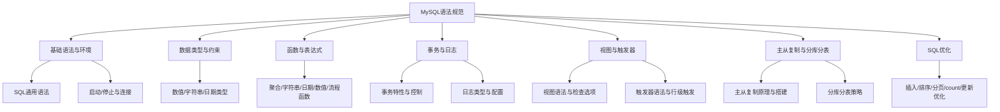
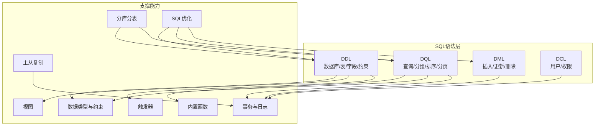
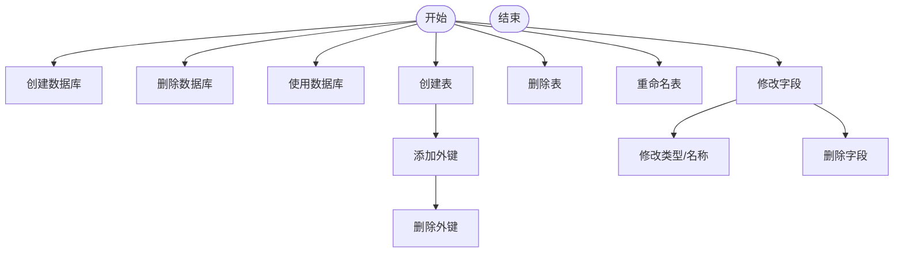
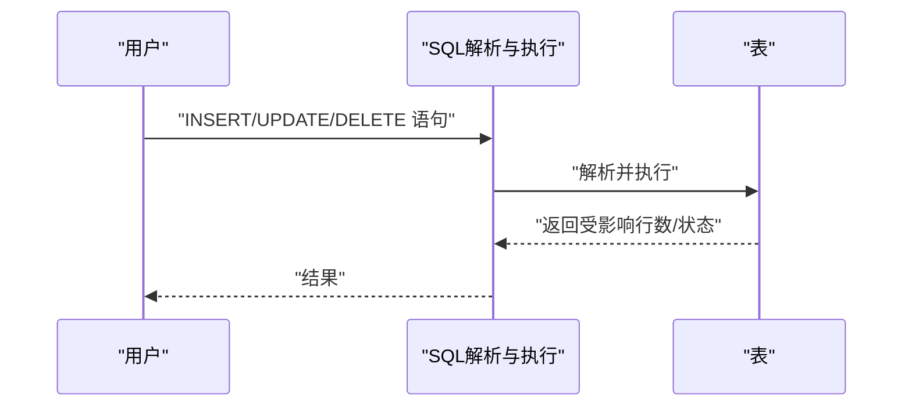
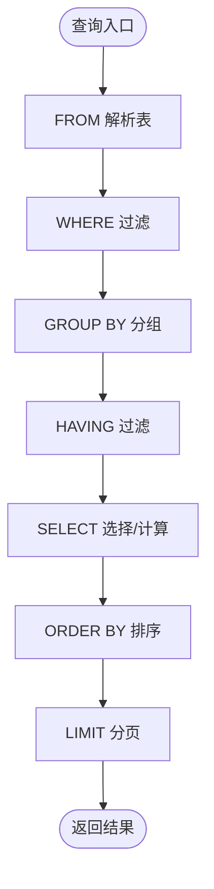
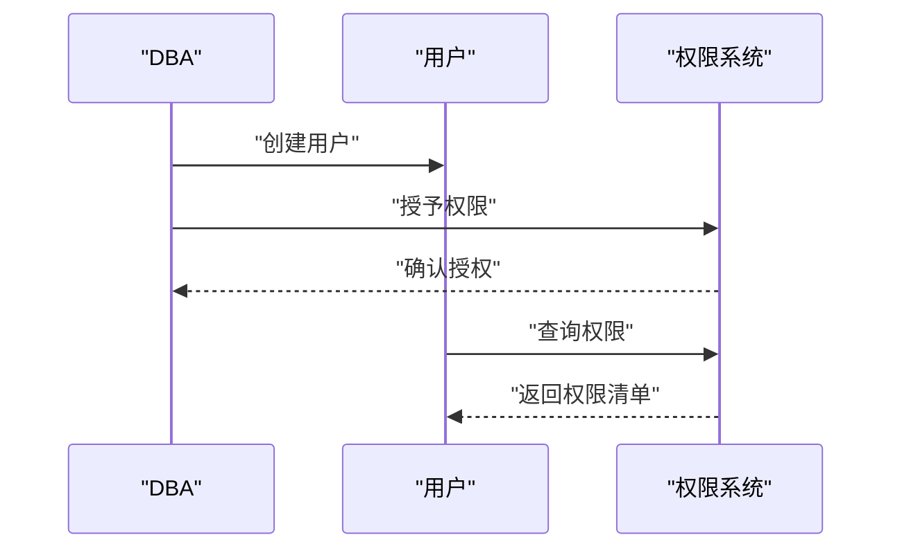
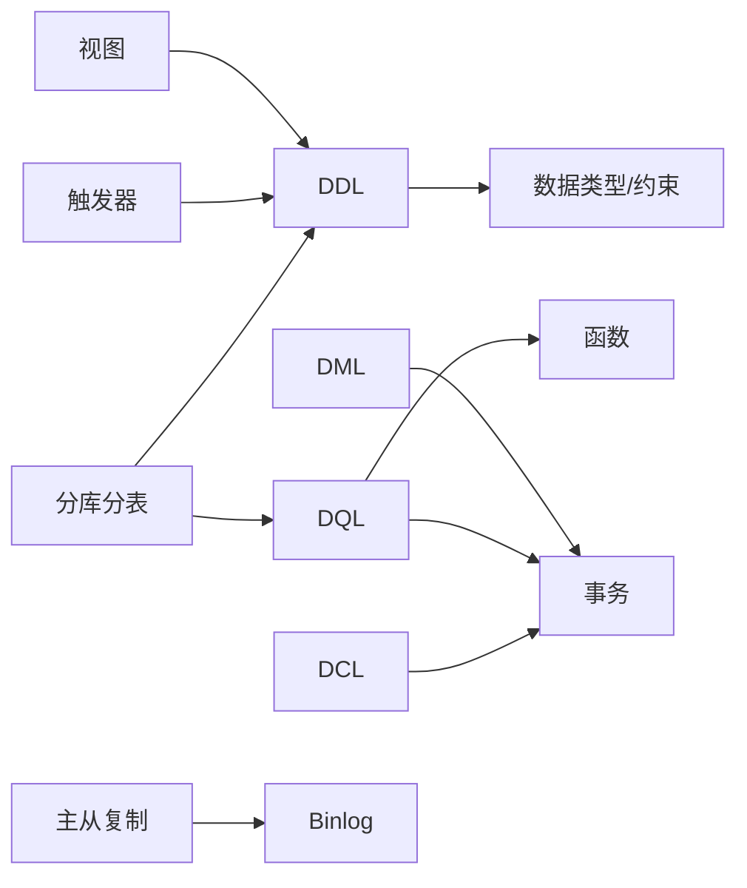

# SQL语法规范

<cite>
**本文引用的文件**
- [docs/grammar.md](file://docs/backend-base/mysql/grammar.md)
- [docs/base.md](file://docs/backend-base/mysql/base.md)
- [docs/data-type.md](file://docs/backend-base/mysql/data-type.md)
- [docs/function.md](file://docs/backend-base/mysql/function.md)
- [docs/transaction.md](file://docs/backend-base/mysql/transaction.md)
- [docs/view.md](file://docs/backend-base/mysql/view.md)
- [docs/trigger.md](file://docs/backend-base/mysql/trigger.md)
- [docs/sub-db.md](file://docs/backend-base/mysql/sub-db.md)
- [docs/log.md](file://docs/backend-base/mysql/log.md)
- [docs/slave.md](file://docs/backend-base/mysql/slave.md)
- [docs/better.md](file://docs/backend-base/mysql/better.md)
</cite>

## 目录
1. [引言](#引言)
2. [项目结构](#项目结构)
3. [核心组件](#核心组件)
4. [架构总览](#架构总览)
5. [详细组件分析](#详细组件分析)
6. [依赖分析](#依赖分析)
7. [性能考虑](#性能考虑)
8. [故障排查指南](#故障排查指南)
9. [结论](#结论)
10. [附录](#附录)

## 引言
本规范面向MySQL数据库的SQL语法系统性整理，覆盖DDL（数据定义语言）、DML（数据操作语言）、DQL（数据查询语言）、DCL（数据控制语言）等类别，结合仓库现有文档，给出语法要点、执行顺序、典型用法与常见问题处理建议。读者可据此快速掌握建表、增删改查、权限管理、事务与日志、视图与触发器、主从复制与分库分表等主题的规范与最佳实践。

## 项目结构
仓库中与MySQL语法相关的内容集中在 backend-base/mysql 目录下的多篇Markdown文档，涵盖语法、数据类型、函数、事务、视图、触发器、日志、主从复制、分库分表与SQL优化等方面。本文以这些文档为基础，形成统一的规范文档。

图表来源
- [docs/base.md:7-29](file://docs/backend-base/mysql/base.md#L7-L29)
- [docs/data-type.md:1-59](file://docs/backend-base/mysql/data-type.md#L1-L59)
- [docs/function.md:1-73](file://docs/backend-base/mysql/function.md#L1-L73)
- [docs/transaction.md:1-128](file://docs/backend-base/mysql/transaction.md#L1-L128)
- [docs/view.md:1-53](file://docs/backend-base/mysql/view.md#L1-L53)
- [docs/trigger.md:1-35](file://docs/backend-base/mysql/trigger.md#L1-L35)
- [docs/slave.md:1-121](file://docs/backend-base/mysql/slave.md#L1-L121)
- [docs/sub-db.md:1-57](file://docs/backend-base/mysql/sub-db.md#L1-L57)
- [docs/better.md:1-123](file://docs/backend-base/mysql/better.md#L1-L123)

章节来源
- [docs/base.md:1-30](file://docs/backend-base/mysql/base.md#L1-L30)
- [docs/grammar.md:1-188](file://docs/backend-base/mysql/grammar.md#L1-L188)

## 核心组件
- DDL（数据定义语言）
  - 数据库操作：查询、创建、删除、使用
  - 表操作：创建、删除、重命名、查询结构与建表语句
  - 字段操作：添加、修改、删除字段，外键约束管理
  - 字段约束：默认、非空、唯一、主键、自增、外键
- DML（数据操作语言）
  - 插入：指定字段与全字段插入
  - 更新：按条件批量更新
  - 删除：按条件删除
- DQL（数据查询语言）
  - 基本查询：全字段、多字段、别名、去重
  - 条件查询：比较与逻辑运算符、模糊匹配、空值判断
  - 分组查询：group by、having、聚合函数
  - 排序查询：order by（asc/desc）
  - 分页查询：limit（起始索引从0）
  - 执行顺序：from -> where -> group by -> having -> select -> order by -> limit
- DCL（数据控制语言）
  - 用户管理：查询、创建、修改密码、删除用户
  - 权限控制：查询、授予、回收权限（常用权限：ALL、SELECT、INSERT、UPDATE、DELETE、CREATE、ALTER、DROP）

章节来源
- [docs/grammar.md:3-188](file://docs/backend-base/mysql/grammar.md#L3-L188)

## 架构总览
下图展示MySQL中与SQL语法相关的关键概念与模块关系，便于理解各主题之间的边界与协作。

图表来源
- [docs/grammar.md:3-188](file://docs/backend-base/mysql/grammar.md#L3-L188)
- [docs/data-type.md:1-59](file://docs/backend-base/mysql/data-type.md#L1-L59)
- [docs/function.md:1-73](file://docs/backend-base/mysql/function.md#L1-L73)
- [docs/transaction.md:1-128](file://docs/backend-base/mysql/transaction.md#L1-L128)
- [docs/view.md:1-53](file://docs/backend-base/mysql/view.md#L1-L53)
- [docs/trigger.md:1-35](file://docs/backend-base/mysql/trigger.md#L1-L35)
- [docs/slave.md:1-121](file://docs/backend-base/mysql/slave.md#L1-L121)
- [docs/sub-db.md:1-57](file://docs/backend-base/mysql/sub-db.md#L1-L57)
- [docs/better.md:1-123](file://docs/backend-base/mysql/better.md#L1-L123)

## 详细组件分析

### DDL：数据库、表与字段
- 数据库操作
  - 查询所有数据库、当前库、创建（可带字符集）、删除（存在性判断）、使用
- 表操作
  - 创建表（字段定义与注释、表注释）
  - 创建含外键的表
  - 删除表、重命名表
  - 查询表结构、所有表、建表语句
- 字段操作
  - 添加字段（含外键约束）
  - 修改字段类型、名称与类型
  - 删除字段、删除外键
- 字段约束
  - default、not null、unique、primary key、auto_increment、foreign key

图表来源
- [docs/grammar.md:7-33](file://docs/backend-base/mysql/grammar.md#L7-L33)

章节来源
- [docs/grammar.md:7-44](file://docs/backend-base/mysql/grammar.md#L7-L44)

### DML：插入、更新与删除
- 插入
  - 指定字段插入、全字段插入（支持多行）
- 更新
  - 指定字段更新，可带where条件
- 删除
  - 按条件删除

图表来源
- [docs/grammar.md:45-53](file://docs/backend-base/mysql/grammar.md#L45-L53)

章节来源
- [docs/grammar.md:45-53](file://docs/backend-base/mysql/grammar.md#L45-L53)

### DQL：查询、分组、排序与分页
- 基本查询
  - 全字段、多字段、字段别名、distinct去重
- 条件查询
  - 比较运算符：>, >=, <, <=, =, !=
  - 范围：between ... and ...
  - 集合：in(...)
  - 模糊匹配：like（_、%、[]、^否定）
  - 空值：is null、is not null
  - 逻辑运算符：and/or/not
- 分组查询
  - group by + 可选 having（聚合函数仅在having中可用）
- 排序查询
  - order by 支持 asc/desc，默认 asc
- 分页查询
  - limit 起始索引从0
- 执行顺序
  - from -> where -> group by -> having -> select -> order by -> limit

图表来源
- [docs/grammar.md:54-125](file://docs/backend-base/mysql/grammar.md#L54-L125)

章节来源
- [docs/grammar.md:54-125](file://docs/backend-base/mysql/grammar.md#L54-L125)

### DCL：用户与权限
- 用户管理
  - 查询用户、创建用户（支持主机限定与通配）、修改密码、删除用户
- 权限控制
  - 常用权限：ALL、SELECT、INSERT、UPDATE、DELETE、CREATE、ALTER、DROP
  - 查询权限、授予权限、回收权限

图表来源
- [docs/grammar.md:126-188](file://docs/backend-base/mysql/grammar.md#L126-L188)

章节来源
- [docs/grammar.md:126-188](file://docs/backend-base/mysql/grammar.md#L126-L188)

### 数据类型与约束
- 数值型：整数（TINYINT/SMALLINT/MEDIUMINT/INT/BIGINT）、浮点（FLOAT/DOUBLE）、精确小数（DECIMAL[M,D]）
- 字符串：CHAR/VARCHAR/TINYTEXT/TEXT/MEDIUMTEXT/LONGTEXT 及对应BLOB族
- 日期时间：DATE/TIME/YEAR/DATETIME/TIMESTAMP
- 修饰符：unsigned、auto_increment
- 约束：default、not null、unique、primary key、foreign key

章节来源
- [docs/data-type.md:1-59](file://docs/backend-base/mysql/data-type.md#L1-L59)

### 函数与表达式
- 聚合函数：count/max/min/avg/sum
- 字符串函数：LEFT/RIGHT/CONCAT/LOWER/UPPER/LTRIM/RTRIM/TRIM/LENGTH/LPAD/RPAD/SUBSTRING/OUNDEX
- 日期与时间：CurDate/CurTime/Now/date_add/date_format/DateDiff/AddTime/Date/DayOfWeek/Year/Month/Day/Hour/Minute/Second/Time
- 数值函数：SIN/COS/TAN/ABS/SQRT/MOD/FLOOR/CEIL/ROUND/EXP/PI/RAND
- 流程函数：if/ifnull/case...when...then...else...end

章节来源
- [docs/function.md:1-73](file://docs/backend-base/mysql/function.md#L1-L73)

### 事务与日志
- 事务特性：原子性、一致性、隔离性、持久性
- 事务操作：start transaction/begin、commit、rollback
- 并发问题：脏读、不可重复读、幻读
- 原理与机制：undo log（回滚与MVCC）、redo log（WAL保障持久性）、binlog（逻辑日志，主从与恢复）
- 存储引擎与缓冲池：InnoDB的Buffer Pool、页分裂/合并
- 执行流程与连接池：驱动、连接池、执行器与存储引擎交互

章节来源
- [docs/transaction.md:1-128](file://docs/backend-base/mysql/transaction.md#L1-L128)

### 视图与触发器
- 视图
  - 创建/替换、查看创建语句、查看数据、修改（两种方式）、删除
  - 检查选项：WITH [CASCADED | LOCAL] CHECK OPTION
- 触发器
  - BEFORE/AFTER INSERT/UPDATE/DELETE 行级触发
  - 使用 NEW/OLD 引用变化记录
  - 查看与删除

章节来源
- [docs/view.md:1-53](file://docs/backend-base/mysql/view.md#L1-L53)
- [docs/trigger.md:1-35](file://docs/backend-base/mysql/trigger.md#L1-L35)

### 主从复制与分库分表
- 主从复制
  - 原理：Binlog -> 中继日志 -> 重放
  - 场景：故障切换、读写分离、备份不影响主库
  - 搭建：主库配置server-id/binlog、授权复制账号、查看主库坐标；从库配置server-id/read-only、设置源信息、启动复制、查看状态
- 分库分表
  - 垂直分库/垂直分表：按业务或字段拆分
  - 水平分库/水平分表：按策略拆分相同结构的数据
  - 目的：缓解IO/CPU瓶颈，提升性能

章节来源
- [docs/slave.md:1-121](file://docs/backend-base/mysql/slave.md#L1-L121)
- [docs/sub-db.md:1-57](file://docs/backend-base/mysql/sub-db.md#L1-L57)

### SQL优化
- 插入优化：批量插入、手动事务提交、主键顺序插入、大体量LOAD DATA
- 主键与页：InnoDB索引组织、页分裂/合并
- 排序优化：优先using index，必要时使用覆盖索引、合理联合索引顺序、适当增大sort_buffer_size
- 分页优化：覆盖索引 + 子查询分页
- count优化：count(*)与count(列)差异、MyISAM vs InnoDB
- 更新优化：行锁基于索引，避免索引失效导致锁升级

章节来源
- [docs/better.md:1-123](file://docs/backend-base/mysql/better.md#L1-L123)

## 依赖分析
- 语法依赖
  - DDL依赖数据类型与约束定义
  - DQL依赖函数与事务上下文
  - DCL依赖事务与权限系统
- 运行时依赖
  - 事务与日志共同保障ACID
  - 视图与触发器扩展SQL能力
  - 主从复制与分库分表影响查询与写入路径

图表来源
- [docs/grammar.md:3-188](file://docs/backend-base/mysql/grammar.md#L3-L188)
- [docs/transaction.md:1-128](file://docs/backend-base/mysql/transaction.md#L1-L128)
- [docs/view.md:1-53](file://docs/backend-base/mysql/view.md#L1-L53)
- [docs/trigger.md:1-35](file://docs/backend-base/mysql/trigger.md#L1-L35)
- [docs/slave.md:1-121](file://docs/backend-base/mysql/slave.md#L1-L121)
- [docs/sub-db.md:1-57](file://docs/backend-base/mysql/sub-db.md#L1-L57)

## 性能考虑
- 写入路径
  - 批量插入与事务提交减少日志刷盘次数
  - 主键顺序插入降低页分裂
  - 大数据量LOAD DATA替代INSERT
- 查询路径
  - 使用覆盖索引避免回表
  - 排序尽量走索引，避免FileSort
  - 分页使用子查询+覆盖索引
- 统计与估算
  - count(*)在InnoDB需逐行扫描，可结合业务自计数或索引优化
- 锁与并发
  - 更新走索引，避免锁升级为表锁

章节来源
- [docs/better.md:3-123](file://docs/backend-base/mysql/better.md#L3-L123)

## 故障排查指南
- 错误日志
  - 启动/停止/严重错误记录，定位故障首选
- 二进制日志（Binlog）
  - 记录DDL/DML，用于灾难恢复与主从复制
  - 查看格式、清理过期日志、使用mysqlbinlog解析
- 查询日志
  - 记录客户端所有语句（默认关闭）
- 慢查询日志
  - 配置阈值、记录未使用索引的查询、记录管理语句

章节来源
- [docs/log.md:1-111](file://docs/backend-base/mysql/log.md#L1-L111)

## 结论
本规范系统梳理了MySQL SQL语法在DDL、DML、DQL、DCL层面的要点，结合数据类型、函数、事务与日志、视图与触发器、主从复制与分库分表、SQL优化等主题，形成从语法到运行时的完整知识体系。建议在实际工程中：
- 明确建表规范（类型选择、约束设计、索引规划）
- 规范查询习惯（避免FileSort、合理分页、善用聚合）
- 重视事务与日志（一致性、持久性、可恢复性）
- 建立权限与审计（用户管理、权限最小化、日志留存）

## 附录
- SQL通用语法与环境
  - 语句书写风格、注释、启动/停止、客户端连接
- 常见语法错误与修正
  - 示例：条件判断使用is null/is not null而非= null
  - 示例：分页索引从0开始
  - 示例：聚合函数仅在having中使用
  - 示例：外键引用需在同一引擎/兼容字符集

章节来源
- [docs/base.md:7-29](file://docs/backend-base/mysql/base.md#L7-L29)
- [docs/grammar.md:65-98](file://docs/backend-base/mysql/grammar.md#L65-L98)