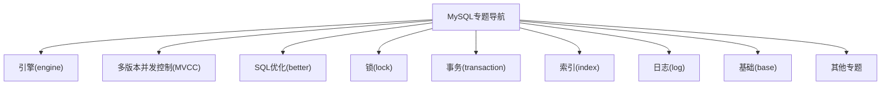
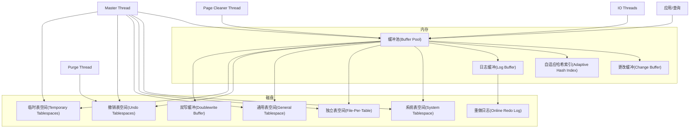
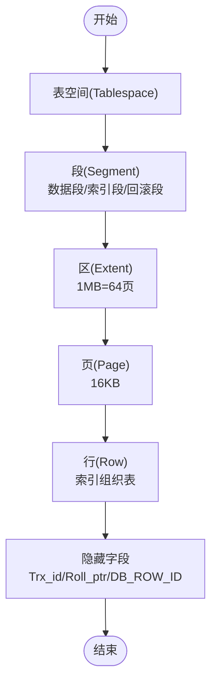
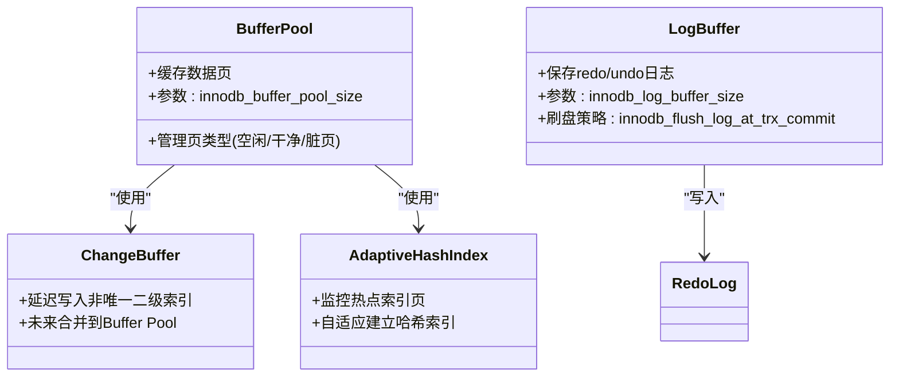
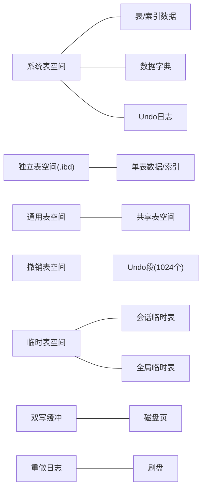
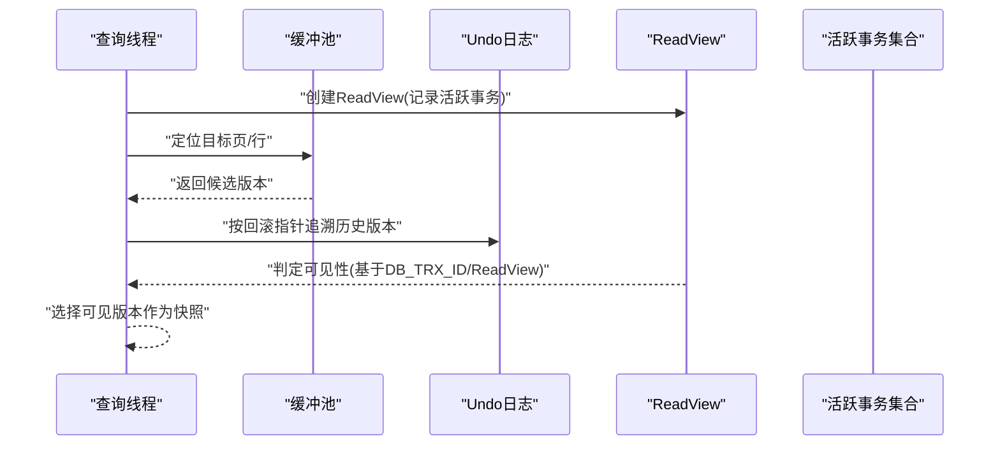
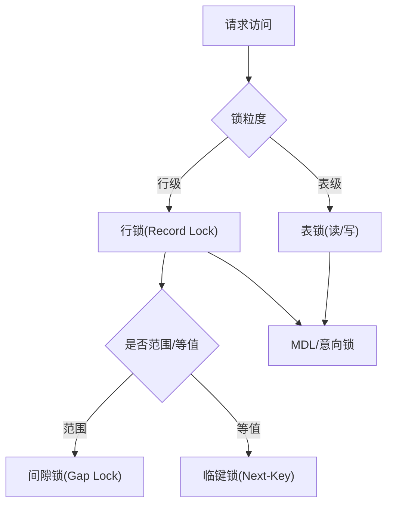
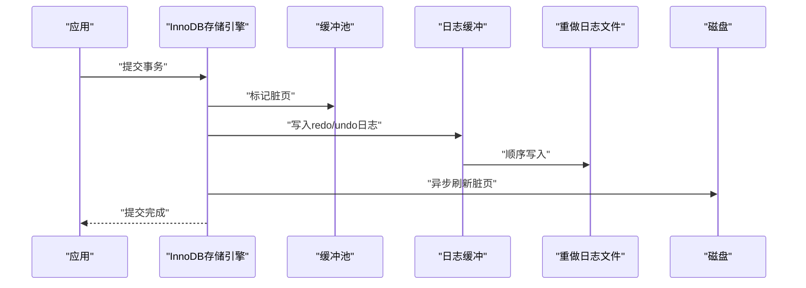
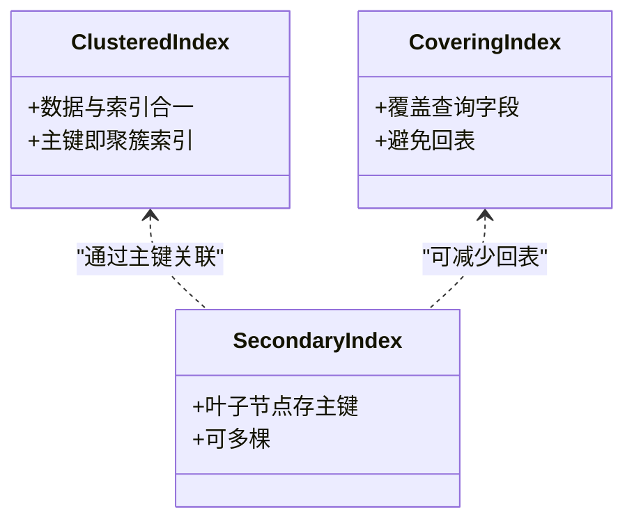
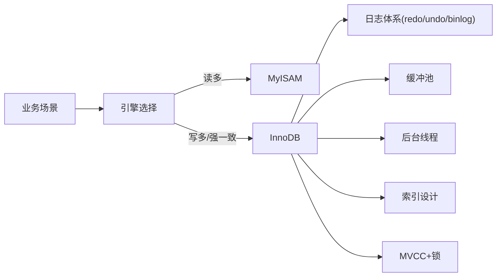

# 存储引擎机制

<cite>
**本文引用的文件**
- [engine.md](file://docs/backend-base/mysql/engine.md)
- [MVCC.md](file://docs/backend-base/mysql/MVCC.md)
- [better.md](file://docs/backend-base/mysql/better.md)
- [lock.md](file://docs/backend-base/mysql/lock.md)
- [transaction.md](file://docs/backend-base/mysql/transaction.md)
- [index.md](file://docs/backend-base/mysql/index.md)
- [log.md](file://docs/backend-base/mysql/log.md)
- [mysql.js](file://.vuepress/series/backend-base/mysql.js)
</cite>

## 目录
1. [引言](#引言)
2. [项目结构](#项目结构)
3. [核心组件](#核心组件)
4. [架构总览](#架构总览)
5. [详细组件分析](#详细组件分析)
6. [依赖分析](#依赖分析)
7. [性能考量](#性能考量)
8. [故障排查指南](#故障排查指南)
9. [结论](#结论)
10. [附录](#附录)

## 引言
本技术文档围绕MySQL存储引擎展开，重点覆盖InnoDB与MyISAM两大引擎的特性、适用场景与性能差异，系统阐述索引机制、事务支持、并发控制、MVCC、缓冲池、日志体系与后台线程等核心主题。文档旨在帮助读者建立对存储引擎底层原理的系统认知，并提供实用的选择指南与配置优化建议。

## 项目结构
本仓库中与MySQL存储引擎相关的知识主要分布在后端基础文档下的MySQL专题，涵盖引擎架构、MVCC、SQL优化、锁与事务、索引、日志等内容。章节组织遵循“从宏观到微观”的学习路径，便于读者逐步构建完整的知识体系。

图表来源
- [mysql.js:1-20](file://.vuepress/series/backend-base/mysql.js#L1-L20)

章节来源
- [mysql.js:1-20](file://.vuepress/series/backend-base/mysql.js#L1-L20)

## 核心组件
- InnoDB存储引擎
  - 逻辑存储结构：表空间、段、区、页、行
  - 内存结构：缓冲池、重做日志缓冲、自适应哈希索引、更改缓冲
  - 磁盘结构：系统表空间、独立表空间、通用表空间、撤销表空间、临时表空间、双写缓冲、重做日志
  - 后台线程：Master、IO、Purge、Page Cleaner等
- MyISAM存储引擎
  - 特点：表级锁、无事务、MyISAM将总行数存在磁盘，count(*)高效
  - 场景：读密集、不涉及强一致性的OLAP或日志归档

章节来源
- [engine.md:1-153](file://docs/backend-base/mysql/engine.md#L1-L153)
- [better.md:100-108](file://docs/backend-base/mysql/better.md#L100-L108)

## 架构总览
下图展示InnoDB存储引擎在内存与磁盘层面的关键组件及其交互关系，体现数据从缓冲池到磁盘的写入路径、日志的顺序写与崩溃恢复能力，以及后台线程在刷新脏页、合并插入缓存、回收undo等方面的作用。

图表来源
- [engine.md:34-153](file://docs/backend-base/mysql/engine.md#L34-L153)

## 详细组件分析

### InnoDB逻辑存储结构与数据页管理
- 表空间：InnoDB逻辑结构顶层，支持独立表空间（默认开启）与通用表空间
- 段：数据段（叶子节点）、索引段（非叶子节点）、回滚段
- 区：1MB为单位，包含64个连续页（默认页大小16KB）
- 页：16KB，缓冲池以页为单位管理，页类型包括空闲、干净、脏页
- 行：索引组织表，行内含隐藏字段（事务ID、回滚指针、行ID）

图表来源
- [engine.md:7-33](file://docs/backend-base/mysql/engine.md#L7-L33)

章节来源
- [engine.md:7-33](file://docs/backend-base/mysql/engine.md#L7-L33)

### InnoDB内存结构与缓冲池机制
- 缓冲池：缓存热点数据页，减少磁盘IO，典型配置占物理内存80%
- 更改缓冲：针对非唯一二级索引的写放大优化，延迟合并
- 自适应哈希索引：对热点索引页建立哈希索引，加速等值查询
- 日志缓冲：保存redo/undo日志，定期刷新至磁盘，支持不同刷盘策略

图表来源
- [engine.md:40-92](file://docs/backend-base/mysql/engine.md#L40-L92)

章节来源
- [engine.md:40-92](file://docs/backend-base/mysql/engine.md#L40-L92)

### InnoDB磁盘结构与后台线程
- 系统表空间：包含索引数据、通用表空间、undo日志等
- 独立表空间：每表一个.ibd文件，便于迁移与回收
- 通用表空间：跨表共享，需显式创建
- 撤销表空间：存储undo日志，支持多段管理
- 临时表空间：会话/全局临时表数据
- 双写缓冲：落盘前先写入双写缓冲，提升崩溃恢复可靠性
- 重做日志：保障事务持久性，采用顺序写WAL

图表来源
- [engine.md:93-124](file://docs/backend-base/mysql/engine.md#L93-L124)

章节来源
- [engine.md:93-124](file://docs/backend-base/mysql/engine.md#L93-L124)

### MVCC与隐藏字段、ReadView
- 快照读：非阻塞读，通过ReadView确定可见性
- 隐藏字段：DB_TRX_ID、DB_ROLL_PTR、DB_ROW_ID
- ReadView：记录活跃事务集合、最小/最大活跃事务ID等，决定可见性
- undo日志：支持回滚与快照读，update/delete在MVCC期间不立即删除

图表来源
- [MVCC.md:9-45](file://docs/backend-base/mysql/MVCC.md#L9-L45)

章节来源
- [MVCC.md:1-45](file://docs/backend-base/mysql/MVCC.md#L1-L45)

### 锁机制与并发控制
- 全局锁：备份一致性，阻塞写与DDL
- 表级锁：MyISAM/InnoDB/BDB等，读写互斥
- 行级锁：InnoDB，基于索引项加锁，支持共享/排他
- 间隙锁与临键锁：防止幻读，RR隔离级别下默认启用Next-Key锁
- 意向锁：减少表锁检查成本

图表来源
- [lock.md:5-109](file://docs/backend-base/mysql/lock.md#L5-L109)

章节来源
- [lock.md:1-109](file://docs/backend-base/mysql/lock.md#L1-L109)

### 事务与日志体系
- 原子性/一致性/持久性：由redo/undo日志共同保障
- 隔离性：通过锁与MVCC实现
- redo日志：顺序写，WAL思想，降低随机写开销
- binlog：逻辑日志，用于主从复制与恢复
- 事务提交策略：innodb_flush_log_at_trx_commit影响刷盘时机

图表来源
- [transaction.md:80-128](file://docs/backend-base/mysql/transaction.md#L80-L128)

章节来源
- [transaction.md:1-128](file://docs/backend-base/mysql/transaction.md#L1-L128)

### 索引机制与查询优化
- 聚集索引：数据与索引合一，主键即聚簇索引
- 二级索引：叶子节点指向主键，支持多棵
- 索引组织表：InnoDB按主键顺序存放行数据
- 优化要点：覆盖索引、最左前缀、避免索引列运算、合理使用前缀索引

图表来源
- [index.md:14-38](file://docs/backend-base/mysql/index.md#L14-L38)

章节来源
- [index.md:1-117](file://docs/backend-base/mysql/index.md#L1-L117)

### MyISAM与InnoDB对比
- MyISAM
  - 表级锁，无事务
  - count(*)高效（行数存于磁盘）
  - 适合读多写少、不强一致的场景
- InnoDB
  - 行级锁+MVCC，支持事务
  - 页级管理，缓冲池+WAL，写多场景更稳健
  - 适合高并发、强一致、复杂事务场景

章节来源
- [better.md:100-108](file://docs/backend-base/mysql/better.md#L100-L108)
- [lock.md:31-33](file://docs/backend-base/mysql/lock.md#L31-L33)

## 依赖分析
- 引擎选择依赖于业务特征：写多/读多、是否强一致、是否需要事务
- InnoDB依赖日志与缓冲池协同工作，后台线程承担刷新与回收职责
- MVCC与锁共同实现隔离性，undo与ReadView支撑快照读
- 索引设计直接影响查询与写入性能

图表来源
- [engine.md:34-153](file://docs/backend-base/mysql/engine.md#L34-L153)
- [MVCC.md:13-45](file://docs/backend-base/mysql/MVCC.md#L13-L45)
- [lock.md:69-109](file://docs/backend-base/mysql/lock.md#L69-L109)
- [better.md:100-108](file://docs/backend-base/mysql/better.md#L100-L108)

## 性能考量
- 插入优化：批量插入、手动事务、主键顺序插入、大体量数据使用LOAD DATA
- 排序优化：优先使用索引顺序扫描，必要时扩大排序缓冲
- 分页优化：覆盖索引+子查询减少回表与扫描
- 计数优化：InnoDB尽量使用覆盖计数或应用层计数；MyISAM count(*)较快但不支持条件优化
- 更新优化：行锁基于索引，避免索引失效导致锁升级

章节来源
- [better.md:3-123](file://docs/backend-base/mysql/better.md#L3-L123)

## 故障排查指南
- 错误日志：定位启动/停止与严重错误
- 二进制日志：用于主从复制与恢复，关注格式与过期清理
- 查询/慢查询日志：定位全表扫描与低效SQL
- 日志清理：reset master、purge master logs to/ before

章节来源
- [log.md:1-111](file://docs/backend-base/mysql/log.md#L1-L111)

## 结论
- InnoDB以页为单位的存储结构、缓冲池与WAL日志体系，使其在高并发与强一致场景具备优势；MyISAM以表级锁与简单计数在读多场景表现良好。
- 正确的索引设计、事务与锁策略、日志与缓冲池参数调优，是发挥存储引擎性能的关键。
- 选择引擎应结合业务特征：事务/一致性/并发强度/读写比例综合评估。

## 附录
- 存储引擎选择指南
  - 事务/强一致/高并发写入：优先InnoDB
  - 仅读/日志归档/简单统计：可考虑MyISAM
- 关键参数参考
  - 缓冲池：innodb_buffer_pool_size
  - 日志缓冲：innodb_log_buffer_size
  - 刷盘策略：innodb_flush_log_at_trx_commit
  - 独立表空间：innodb_file_per_table
  - 二进制日志格式：binlog_format

章节来源
- [engine.md:82-92](file://docs/backend-base/mysql/engine.md#L82-L92)
- [log.md:30-44](file://docs/backend-base/mysql/log.md#L30-L44)