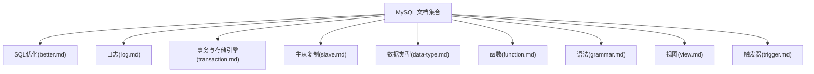
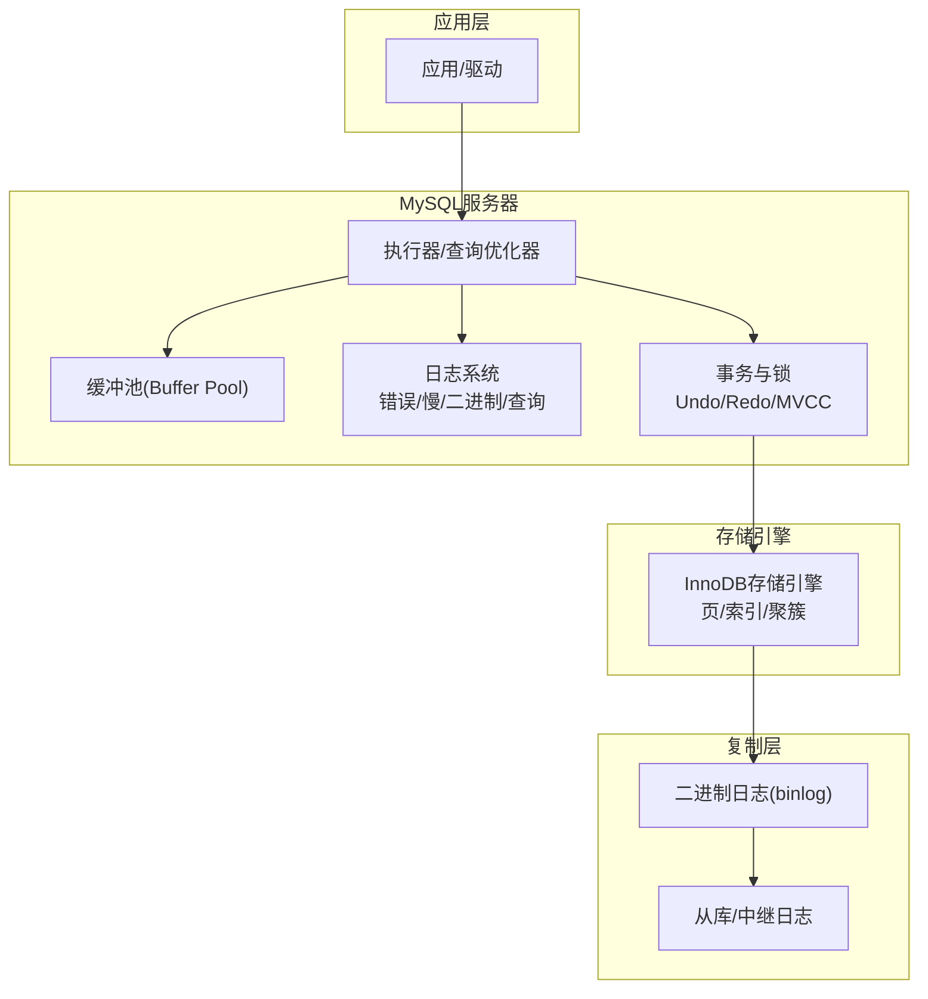
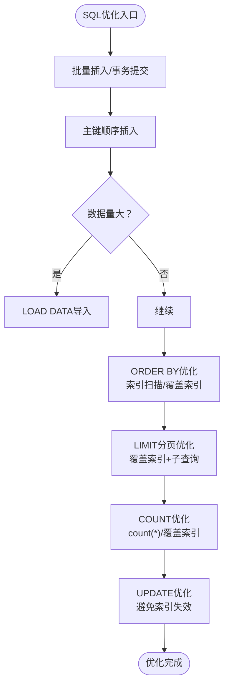
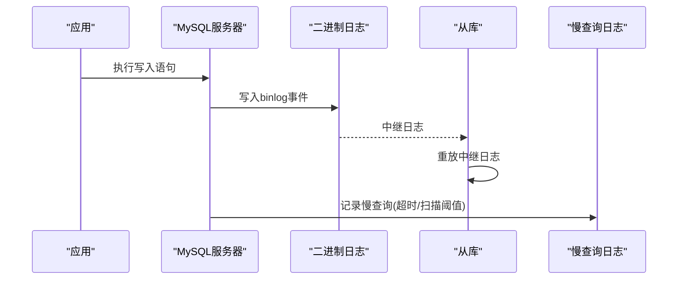
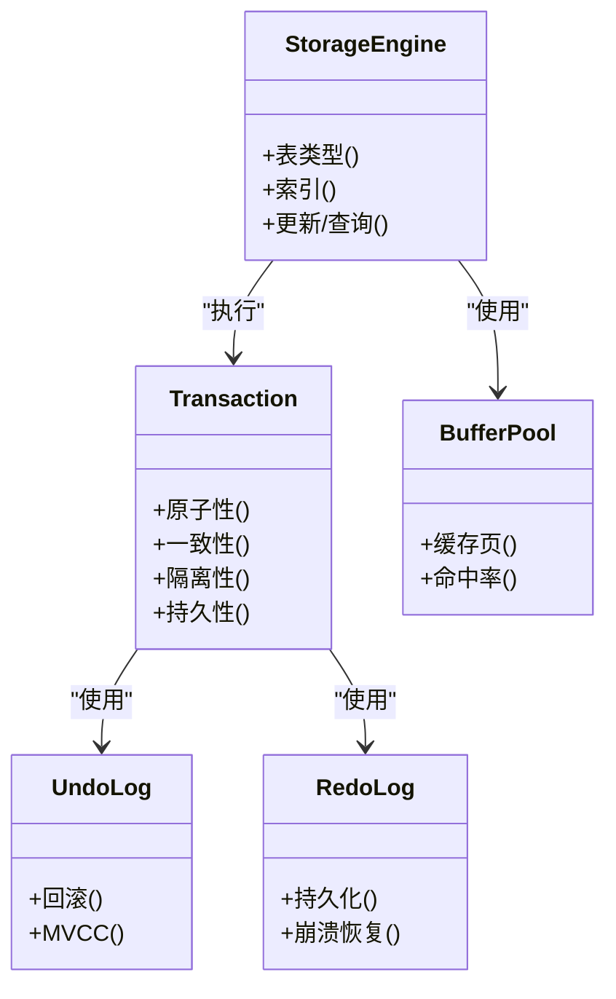
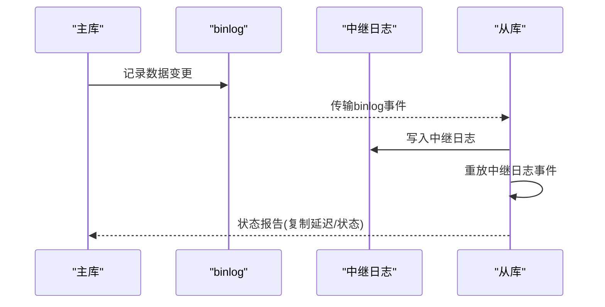
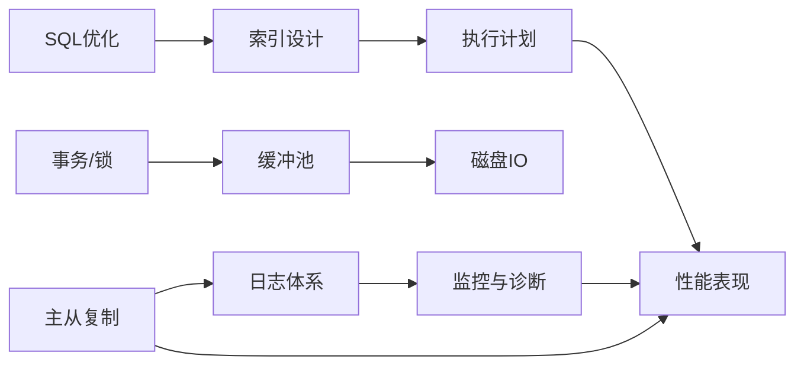

# 性能优化与调优

<cite>
**本文引用的文件**
- [better.md](file://docs/backend-base/mysql/better.md)
- [log.md](file://docs/backend-base/mysql/log.md)
- [transaction.md](file://docs/backend-base/mysql/transaction.md)
- [slave.md](file://docs/backend-base/mysql/slave.md)
- [data-type.md](file://docs/backend-base/mysql/data-type.md)
- [function.md](file://docs/backend-base/mysql/function.md)
- [grammar.md](file://docs/backend-base/mysql/grammar.md)
- [view.md](file://docs/backend-base/mysql/view.md)
- [trigger.md](file://docs/backend-base/mysql/trigger.md)
</cite>

## 目录
1. [引言](#引言)
2. [项目结构](#项目结构)
3. [核心组件](#核心组件)
4. [架构概览](#架构概览)
5. [详细组件分析](#详细组件分析)
6. [依赖分析](#依赖分析)
7. [性能考虑](#性能考虑)
8. [故障排查指南](#故障排查指南)
9. [结论](#结论)
10. [附录](#附录)

## 引言
本技术文档围绕MySQL性能优化展开，结合仓库中现有的MySQL相关文档，系统梳理索引优化、查询优化、配置参数调优、慢查询日志分析、执行计划解读、锁机制优化、数据库设计与存储引擎选择、内存配置与缓冲池优化、连接池与并发控制、主从复制与读写分离、以及监控与排障等主题。文档以循序渐进的方式呈现，既适合入门读者快速掌握关键要点，也为进阶读者提供深入的技术细节与实践建议。

## 项目结构
本仓库的MySQL相关内容集中在 backend-base/mysql 目录下，涵盖基础语法、事务与日志、SQL优化、数据类型、函数、视图、触发器、主从复制等多个方面。这些文档共同构成了MySQL性能优化的知识基础。

图表来源
- [better.md:1-123](file://docs/backend-base/mysql/better.md#L1-L123)
- [log.md:1-111](file://docs/backend-base/mysql/log.md#L1-L111)
- [transaction.md:1-128](file://docs/backend-base/mysql/transaction.md#L1-L128)
- [slave.md:1-121](file://docs/backend-base/mysql/slave.md#L1-L121)
- [data-type.md:1-59](file://docs/backend-base/mysql/data-type.md#L1-L59)
- [function.md:1-73](file://docs/backend-base/mysql/function.md#L1-L73)
- [grammar.md:1-188](file://docs/backend-base/mysql/grammar.md#L1-L188)
- [view.md:1-53](file://docs/backend-base/mysql/view.md#L1-L53)
- [trigger.md:1-35](file://docs/backend-base/mysql/trigger.md#L1-L35)

章节来源
- [better.md:1-123](file://docs/backend-base/mysql/better.md#L1-L123)
- [log.md:1-111](file://docs/backend-base/mysql/log.md#L1-L111)
- [transaction.md:1-128](file://docs/backend-base/mysql/transaction.md#L1-L128)
- [slave.md:1-121](file://docs/backend-base/mysql/slave.md#L1-L121)
- [data-type.md:1-59](file://docs/backend-base/mysql/data-type.md#L1-L59)
- [function.md:1-73](file://docs/backend-base/mysql/function.md#L1-L73)
- [grammar.md:1-188](file://docs/backend-base/mysql/grammar.md#L1-L188)
- [view.md:1-53](file://docs/backend-base/mysql/view.md#L1-L53)
- [trigger.md:1-35](file://docs/backend-base/mysql/trigger.md#L1-L35)

## 核心组件
- SQL优化：批量插入、事务提交、主键顺序插入、LOAD DATA优化、ORDER BY优化、LIMIT优化、COUNT优化、UPDATE优化。
- 日志体系：错误日志、二进制日志(binlog)、查询日志、慢查询日志，含格式、查看与清理方法。
- 事务与存储引擎：事务特性、原子性/一致性/隔离性/持久性、Undo/Redo日志、缓冲池(Buffer Pool)、存储引擎类型。
- 主从复制：复制原理、应用场景、搭建步骤、配置参数、状态查看。
- 数据类型与函数：数值/字符串/日期类型、常用函数族，支撑查询与索引设计。
- 视图与触发器：视图的创建/查询/修改/删除、检查选项；触发器的类型与使用。

章节来源
- [better.md:1-123](file://docs/backend-base/mysql/better.md#L1-L123)
- [log.md:1-111](file://docs/backend-base/mysql/log.md#L1-L111)
- [transaction.md:1-128](file://docs/backend-base/mysql/transaction.md#L1-L128)
- [slave.md:1-121](file://docs/backend-base/mysql/slave.md#L1-L121)
- [data-type.md:1-59](file://docs/backend-base/mysql/data-type.md#L1-L59)
- [function.md:1-73](file://docs/backend-base/mysql/function.md#L1-L73)
- [grammar.md:1-188](file://docs/backend-base/mysql/grammar.md#L1-L188)
- [view.md:1-53](file://docs/backend-base/mysql/view.md#L1-L53)
- [trigger.md:1-35](file://docs/backend-base/mysql/trigger.md#L1-L35)

## 架构概览
MySQL性能优化涉及多个层次：SQL层（查询与索引）、执行层（执行计划与缓冲池）、存储层（InnoDB页结构与日志）、复制层（主从复制与binlog）。下图展示与本文相关的组件交互关系。

图表来源
- [transaction.md:46-128](file://docs/backend-base/mysql/transaction.md#L46-L128)
- [log.md:15-111](file://docs/backend-base/mysql/log.md#L15-L111)
- [slave.md:1-121](file://docs/backend-base/mysql/slave.md#L1-L121)

## 详细组件分析

### SQL优化策略
- 批量插入与事务提交：减少日志开销与锁竞争，提升写入吞吐。
- 主键顺序插入：避免页分裂与随机写放大，提升写入性能。
- 大批量数据导入：使用LOAD DATA替代INSERT，显著降低解析与日志成本。
- ORDER BY优化：优先使用索引顺序扫描，必要时通过覆盖索引与合理索引设计避免FileSort。
- LIMIT分页优化：通过覆盖索引+子查询减少回表与偏移扫描。
- COUNT优化：InnoDB尽量使用count(*)或覆盖索引；MyISAM可直接读取行数，但带条件仍需扫描。
- UPDATE优化：行锁基于索引，索引失效将退化为表锁，应避免在UPDATE路径上破坏索引。

图表来源
- [better.md:3-123](file://docs/backend-base/mysql/better.md#L3-L123)

章节来源
- [better.md:1-123](file://docs/backend-base/mysql/better.md#L1-L123)

### 日志体系与慢查询分析
- 错误日志：定位启动/停止与严重错误，建议优先查看。
- 二进制日志(binlog)：DDL/DML记录，支持主从复制与恢复；支持STATEMENT/ROW/MIXED格式。
- 查询日志：记录所有客户端语句（不含SELECT/SHOW），默认关闭，开启会带来可观日志体积。
- 慢查询日志：记录超时阈值(long_query_time)与扫描行数阈值(min_examined_row_limit)的SQL；可配置记录管理语句与未使用索引的语句。

图表来源
- [log.md:15-111](file://docs/backend-base/mysql/log.md#L15-L111)
- [slave.md:1-121](file://docs/backend-base/mysql/slave.md#L1-L121)

章节来源
- [log.md:1-111](file://docs/backend-base/mysql/log.md#L1-L111)
- [slave.md:1-121](file://docs/backend-base/mysql/slave.md#L1-L121)

### 事务、锁与缓冲池
- 事务四大特性：原子性(undo)、一致性、隔离性(锁+MVCC)、持久性(redo)。
- Undo/Redo日志：保障原子性与持久性，binlog为逻辑日志，用于复制与恢复。
- 缓冲池(Buffer Pool)：热点数据缓存，减少磁盘IO；执行顺序先查BP，缺失再回磁盘并回填BP。
- 存储引擎：基于表的引擎类型，InnoDB支持事务与行级锁，MyISAM不支持事务。

图表来源
- [transaction.md:40-128](file://docs/backend-base/mysql/transaction.md#L40-L128)

章节来源
- [transaction.md:1-128](file://docs/backend-base/mysql/transaction.md#L1-L128)

### 主从复制与读写分离
- 复制原理：主库写入binlog，从库读取并重放至relay log，最终应用到从库。
- 应用场景：故障切换、读写分离、备份不影响主库。
- 关键配置：server-id、read-only、binlog格式、复制源参数、复制状态查看。

图表来源
- [slave.md:13-121](file://docs/backend-base/mysql/slave.md#L13-L121)

章节来源
- [slave.md:1-121](file://docs/backend-base/mysql/slave.md#L1-L121)

### 数据类型与函数对性能的影响
- 数据类型选择：CHAR/VARCHAR、数值类型、日期时间类型，直接影响存储与索引效率。
- 函数使用：字符串/日期/数值/流程函数，合理使用可简化SQL，但需注意函数导致的索引失效与执行代价。

章节来源
- [data-type.md:1-59](file://docs/backend-base/mysql/data-type.md#L1-L59)
- [function.md:1-73](file://docs/backend-base/mysql/function.md#L1-L73)
- [grammar.md:1-188](file://docs/backend-base/mysql/grammar.md#L1-L188)

### 视图与触发器的性能考量
- 视图：仅保存查询逻辑，不保存结果；WITH CHECK OPTION支持级联/本地检查，避免违反定义。
- 触发器：行级触发，可用于日志记录与数据校验，但会引入额外开销，需谨慎使用。

章节来源
- [view.md:1-53](file://docs/backend-base/mysql/view.md#L1-L53)
- [trigger.md:1-35](file://docs/backend-base/mysql/trigger.md#L1-L35)

## 依赖分析
- SQL优化依赖于索引设计与执行计划；不当的索引或函数使用会导致索引失效，引发全表扫描与FileSort。
- 日志系统与复制链路紧密耦合：binlog格式影响复制一致性与回放效率；慢查询日志为性能诊断提供依据。
- 事务与锁依赖于存储引擎的页结构与缓冲池：页分裂/合并、缓冲池命中率直接影响写入与读取性能。
- 视图与触发器作为应用层抽象，可能隐藏复杂逻辑，需结合执行计划与日志进行评估。

图表来源
- [better.md:67-123](file://docs/backend-base/mysql/better.md#L67-L123)
- [log.md:15-111](file://docs/backend-base/mysql/log.md#L15-L111)
- [transaction.md:68-128](file://docs/backend-base/mysql/transaction.md#L68-L128)
- [slave.md:1-121](file://docs/backend-base/mysql/slave.md#L1-L121)

章节来源
- [better.md:1-123](file://docs/backend-base/mysql/better.md#L1-L123)
- [log.md:1-111](file://docs/backend-base/mysql/log.md#L1-L111)
- [transaction.md:1-128](file://docs/backend-base/mysql/transaction.md#L1-L128)
- [slave.md:1-121](file://docs/backend-base/mysql/slave.md#L1-L121)

## 性能考虑
- 索引优化
  - 建立覆盖索引，避免回表；复合索引遵循最左前缀法则；多字段排序时注意ASC/DESC顺序。
  - 避免在WHERE/ORDER BY中对索引列使用函数或表达式，防止索引失效。
- 查询优化
  - 使用EXPLAIN分析执行计划，关注是否使用索引、是否发生FileSort、是否全表扫描。
  - 对LIMIT分页使用覆盖索引+子查询，减少偏移扫描。
  - COUNT优化：优先count(*)或覆盖索引；MyISAM可直接读取行数，但带条件仍需扫描。
- 写入优化
  - 批量插入与手动事务提交；主键顺序插入；大体量数据使用LOAD DATA。
  - 避免UPDATE路径破坏索引，减少行锁退化为表锁的风险。
- 缓冲池与内存
  - 合理配置缓冲池大小，提升热点数据命中率；关注页分裂与合并阈值。
- 日志与复制
  - binlog格式选择：ROW更安全但体积更大；STATEMENT在函数/now()场景可能不一致；MIXED折中。
  - 慢查询日志开启阈值与扫描行数阈值，结合监控定期分析慢SQL。
- 并发与连接
  - 使用连接池减少连接创建/销毁开销；避免长事务与长时间持有锁。

[本节为通用性能指导，不直接分析特定文件]

## 故障排查指南
- 错误日志定位：优先查看mysqld错误日志，定位启动/停止与严重错误。
- 慢查询日志：启用slow_query_log与long_query_time，记录慢SQL；必要时开启记录管理语句与未使用索引的语句。
- binlog清理：根据过期时间配置与清理指令，定期清理历史日志，释放磁盘空间。
- 复制状态：使用复制状态查看命令，确认复制延迟、错误与运行状态。
- 事务与锁：结合锁等待与死锁检测，定位长事务与锁冲突。

章节来源
- [log.md:1-111](file://docs/backend-base/mysql/log.md#L1-L111)
- [slave.md:1-121](file://docs/backend-base/mysql/slave.md#L1-L121)
- [transaction.md:1-128](file://docs/backend-base/mysql/transaction.md#L1-L128)

## 结论
MySQL性能优化是一个系统工程，需要从SQL设计、索引策略、执行计划、日志与复制、事务与锁、缓冲池与内存配置等多维度协同优化。结合仓库中的现有文档，可形成从基础语法到高级优化的完整知识闭环。建议在生产环境中以监控为先导，以日志为依据，以索引与执行计划为抓手，逐步迭代优化，确保系统在高并发与大数据量场景下的稳定性与高性能。

[本节为总结性内容，不直接分析特定文件]

## 附录
- 常用配置项参考
  - 慢查询日志：slow_query_log、long_query_time、log_slow_admin_statements、log_queries_not_using_indexes。
  - binlog：log_bin、binlog_format、binlog_expire_logs_seconds。
  - 缓冲池：innodb_buffer_pool_size、innodb_buffer_pool_instances。
  - 复制：server-id、read-only、replica相关状态查看命令。
- 最佳实践清单
  - 写入：批量提交、主键顺序、LOAD DATA。
  - 查询：覆盖索引、避免函数、合理LIMIT。
  - 监控：慢查询日志、binlog清理、复制状态。
  - 事务：短事务、避免长事务、合理隔离级别。

[本节为通用实践建议，不直接分析特定文件]