# 数据库管理

<cite>
**本文引用的文件**
- [base.md](file://docs/backend-base/mysql/base.md)
- [log.md](file://docs/backend-base/mysql/log.md)
- [transaction.md](file://docs/backend-base/mysql/transaction.md)
- [trigger.md](file://docs/backend-base/mysql/trigger.md)
- [view.md](file://docs/backend-base/mysql/view.md)
- [slave.md](file://docs/backend-base/mysql/slave.md)
- [better.md](file://docs/backend-base/mysql/better.md)
- [data-type.md](file://docs/backend-base/mysql/data-type.md)
- [function.md](file://docs/backend-base/mysql/function.md)
- [grammar.md](file://docs/backend-base/mysql/grammar.md)
- [sub-db.md](file://docs/backend-base/mysql/sub-db.md)
</cite>

## 目录
1. [简介](#简介)
2. [项目结构](#项目结构)
3. [核心组件](#核心组件)
4. [架构概览](#架构概览)
5. [详细组件分析](#详细组件分析)
6. [依赖分析](#依赖分析)
7. [性能考虑](#性能考虑)
8. [故障排查指南](#故障排查指南)
9. [结论](#结论)
10. [附录](#附录)

## 简介
本技术文档围绕MySQL数据库管理的关键能力与实践展开，覆盖日志管理（错误日志、慢查询日志、二进制日志等）、事务处理机制、触发器使用、视图创建与管理等核心管理功能，并结合主从复制、SQL优化、权限管理与数据类型等主题，形成一套面向运维与开发的综合性知识体系。文档以仓库内现有MySQL相关文档为基础，系统梳理各模块的理论要点与实操路径，帮助读者建立完整的数据库管理知识框架。

## 项目结构
MySQL相关知识分布在docs/backend-base/mysql目录下的多个Markdown文件中，涵盖基础语法、日志、事务、触发器、视图、主从复制、SQL优化、数据类型、函数与语法规范等主题。整体呈现“主题化文档”的组织方式，便于按需查阅与组合学习。

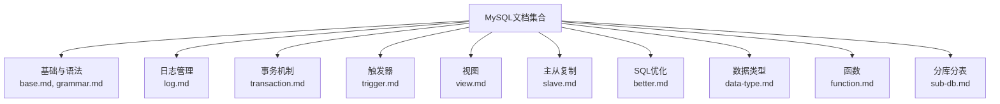

**章节来源**
- [base.md:1-30](file://docs/backend-base/mysql/base.md#L1-L30)
- [grammar.md:1-188](file://docs/backend-base/mysql/grammar.md#L1-L188)

## 核心组件
本节从数据库管理视角，提炼MySQL关键能力与其职责边界：
- 日志管理：错误日志、二进制日志、查询日志、慢查询日志的启用、查看、清理与配置要点
- 事务机制：ACID特性、并发问题、隔离级别、回滚机制与底层保障（undo/redo日志）
- 触发器：行级触发器的创建、查看与删除，以及OLD/NEW引用
- 视图：创建、查询、修改、删除与检查选项（CASCADE/LOCAL）
- 主从复制：复制原理、搭建步骤、状态查看与常见问题定位
- SQL优化：插入、排序、分页、计数、更新等优化策略
- 权限管理：用户创建、授权、回收与权限查询
- 数据类型：数值、字符串、日期时间类型的特性与选择建议
- 函数：聚合、字符串、日期时间、数值与流程函数的常用用法
- 分库分表：垂直/水平拆分策略与适用场景

**章节来源**
- [log.md:1-111](file://docs/backend-base/mysql/log.md#L1-L111)
- [transaction.md:1-128](file://docs/backend-base/mysql/transaction.md#L1-L128)
- [trigger.md:1-35](file://docs/backend-base/mysql/trigger.md#L1-L35)
- [view.md:1-53](file://docs/backend-base/mysql/view.md#L1-L53)
- [slave.md:1-121](file://docs/backend-base/mysql/slave.md#L1-L121)
- [better.md:1-123](file://docs/backend-base/mysql/better.md#L1-L123)
- [grammar.md:126-188](file://docs/backend-base/mysql/grammar.md#L126-L188)
- [data-type.md:1-59](file://docs/backend-base/mysql/data-type.md#L1-L59)
- [function.md:1-73](file://docs/backend-base/mysql/function.md#L1-L73)
- [sub-db.md:1-57](file://docs/backend-base/mysql/sub-db.md#L1-L57)

## 架构概览
MySQL数据库管理涉及“日志-事务-复制-优化-权限-类型-函数-视图-触发器-分库分表”等多维能力，它们共同构成数据库的可观测性、可靠性、可扩展性与可维护性支撑。下图展示这些能力之间的关系与交互。

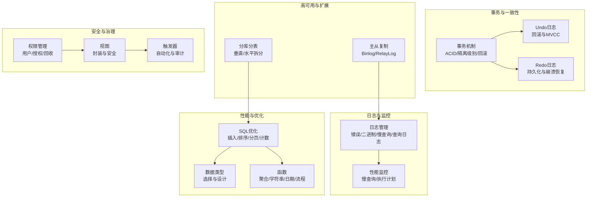

**图表来源**
- [log.md:1-111](file://docs/backend-base/mysql/log.md#L1-L111)
- [transaction.md:19-128](file://docs/backend-base/mysql/transaction.md#L19-L128)
- [slave.md:1-121](file://docs/backend-base/mysql/slave.md#L1-L121)
- [better.md:1-123](file://docs/backend-base/mysql/better.md#L1-L123)
- [grammar.md:126-188](file://docs/backend-base/mysql/grammar.md#L126-L188)
- [data-type.md:1-59](file://docs/backend-base/mysql/data-type.md#L1-L59)
- [function.md:1-73](file://docs/backend-base/mysql/function.md#L1-L73)
- [view.md:1-53](file://docs/backend-base/mysql/view.md#L1-L53)
- [trigger.md:1-35](file://docs/backend-base/mysql/trigger.md#L1-L35)
- [sub-db.md:1-57](file://docs/backend-base/mysql/sub-db.md#L1-L57)

## 详细组件分析

### 日志管理
- 错误日志：记录启动/停止与严重错误，建议优先查看；可通过变量查看位置。
- 二进制日志（Binlog）：记录DDL/DML，支持主从复制与恢复；支持STATEMENT/ROW/MIXED三种格式；可通过工具查看；支持清理与过期时间配置。
- 查询日志：记录所有客户端操作（不含SELECT/SHOW），默认关闭，需在配置文件中开启。
- 慢查询日志：记录超时与扫描阈值的SQL，默认关闭，需配置慢查询阈值与相关开关。

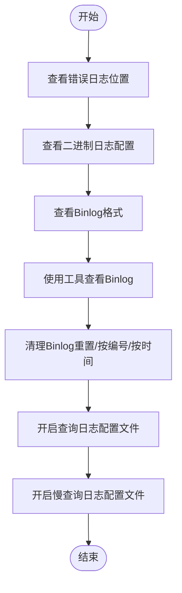

**图表来源**
- [log.md:9-111](file://docs/backend-base/mysql/log.md#L9-L111)

**章节来源**
- [log.md:1-111](file://docs/backend-base/mysql/log.md#L1-L111)

### 事务机制
- 事务特性：原子性、一致性、隔离性、持久性。
- 并发问题：脏读、不可重复读、幻读。
- 原理与保障：Undo日志保障原子性与MVCC；Redo日志保障持久性；隔离性通过锁与MVCC实现。
- 控制命令：开启、提交、回滚。

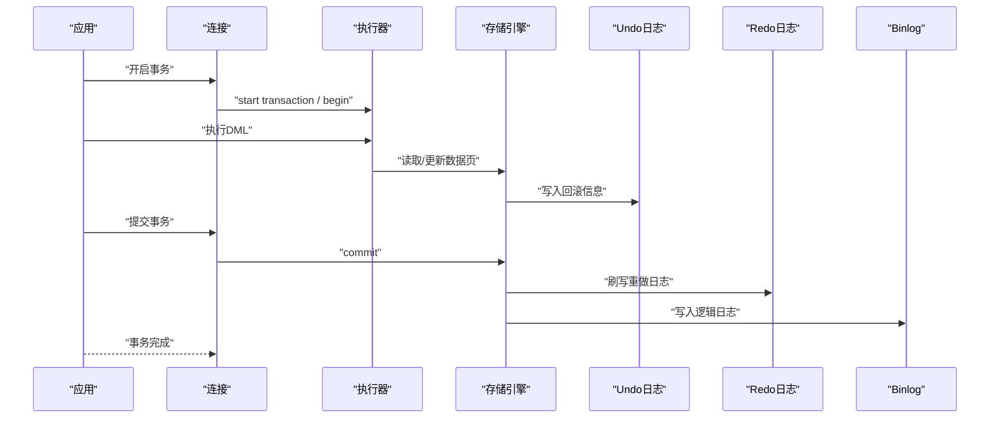

**图表来源**
- [transaction.md:19-128](file://docs/backend-base/mysql/transaction.md#L19-L128)

**章节来源**
- [transaction.md:1-128](file://docs/backend-base/mysql/transaction.md#L1-L128)

### 触发器
- 行级触发器：在INSERT/UPDATE/DELETE前后触发，引用OLD/NEW。
- 创建与删除：通过标准语法创建与删除触发器；查看触发器列表。

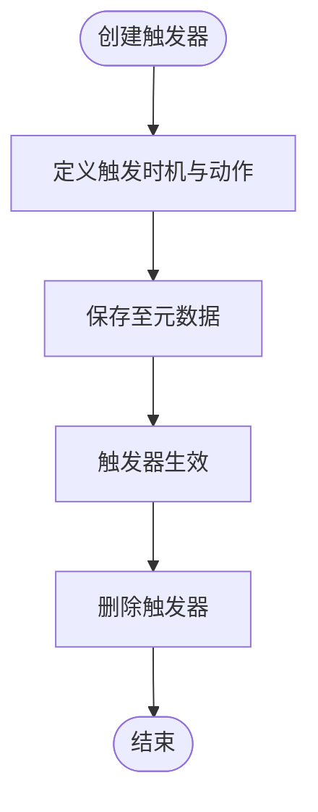

**图表来源**
- [trigger.md:13-35](file://docs/backend-base/mysql/trigger.md#L13-L35)

**章节来源**
- [trigger.md:1-35](file://docs/backend-base/mysql/trigger.md#L1-L35)

### 视图
- 视图概念：虚拟表，仅保存查询逻辑，不保存实际数据。
- 管理操作：创建、查看创建语句、修改、删除。
- 检查选项：WITH CHECK OPTION的LOCAL/CASCADE差异。

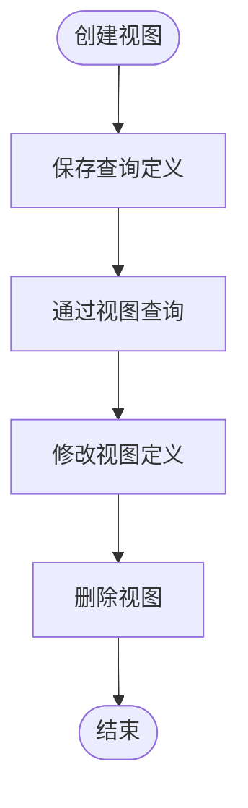

**图表来源**
- [view.md:9-53](file://docs/backend-base/mysql/view.md#L9-L53)

**章节来源**
- [view.md:1-53](file://docs/backend-base/mysql/view.md#L1-L53)

### 主从复制
- 原理：主库提交事务时写Binlog，从库读取并重放至RelayLog，再应用到自身数据。
- 搭建步骤：主库配置server-id/read-only/binlog策略与授权；从库配置server-id/read-only；设置复制源坐标；启动复制；查看状态。
- 场景：高可用切换、读写分离、备份不影响主库。

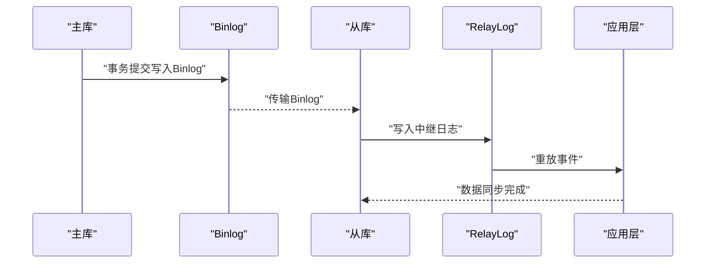

**图表来源**
- [slave.md:13-121](file://docs/backend-base/mysql/slave.md#L13-L121)

**章节来源**
- [slave.md:1-121](file://docs/backend-base/mysql/slave.md#L1-L121)

### SQL优化
- 插入优化：批量插入、手动事务提交、主键顺序插入、LOAD DATA导入。
- 排序优化：利用索引排序、覆盖索引、合理调整排序缓冲区。
- 分页优化：覆盖索引+子查询减少扫描。
- 计数优化：InnoDB计数成本高，可采用近似或外部计数。
- 更新优化：基于索引的行锁，避免锁升级。

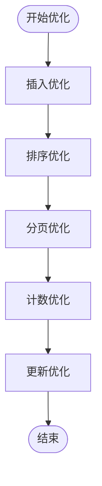

**图表来源**
- [better.md:3-123](file://docs/backend-base/mysql/better.md#L3-L123)

**章节来源**
- [better.md:1-123](file://docs/backend-base/mysql/better.md#L1-L123)

### 权限管理
- 用户管理：查询、创建、修改密码、删除用户。
- 权限控制：查询权限、授予/回收权限；常用权限包括ALL、SELECT、INSERT、UPDATE、DELETE、CREATE、ALTER、DROP等。

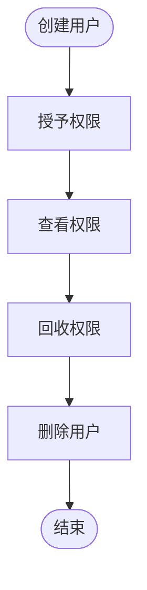

**图表来源**
- [grammar.md:130-188](file://docs/backend-base/mysql/grammar.md#L130-L188)

**章节来源**
- [grammar.md:126-188](file://docs/backend-base/mysql/grammar.md#L126-L188)

### 数据类型
- 数值型：TINYINT/S、M、I、B等整型与F、D浮点/定点类型。
- 字符串：CHAR/VARCHAR与多级文本/BLOB类型。
- 日期时间：DATE/TIME/YEAR/DATETIME/TIMESTAMP。

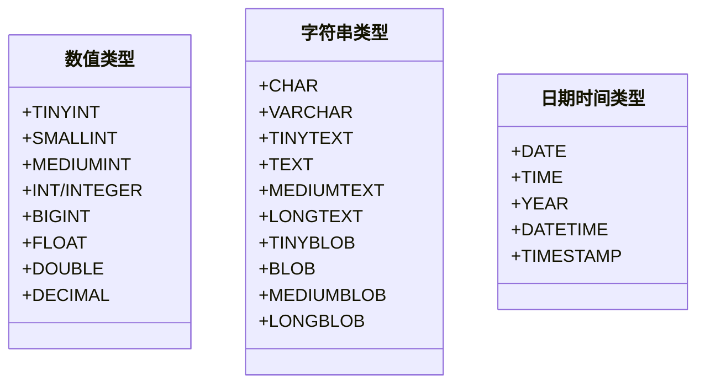

**图表来源**
- [data-type.md:3-59](file://docs/backend-base/mysql/data-type.md#L3-L59)

**章节来源**
- [data-type.md:1-59](file://docs/backend-base/mysql/data-type.md#L1-L59)

### 函数
- 聚合函数：COUNT/MIN/MAX/AVG/SUM。
- 字符串函数：LEFT/RIGHT/CONCAT/LOWER/UPPER/LTRIM/RTRIM/TRIM/LENGTH/LPAD/RPAD/SUBSTRING/OUNDEX。
- 日期时间函数：CURDATE/CURTIME/NOW/DATE_ADD/DATE_FORMAT/DATE_DIFF/ADD_TIME/DATE/WEEKDAY/YEAR/MONTH/DAY/HOUR/MINUTE/SECOND/TIME。
- 数值函数：SIN/COS/TAN/ABS/SQRT/MOD/FLOOR/CEIL/ROUND/EXP/PI/RAND。
- 流程函数：IF/IFNULL/CASE WHEN。

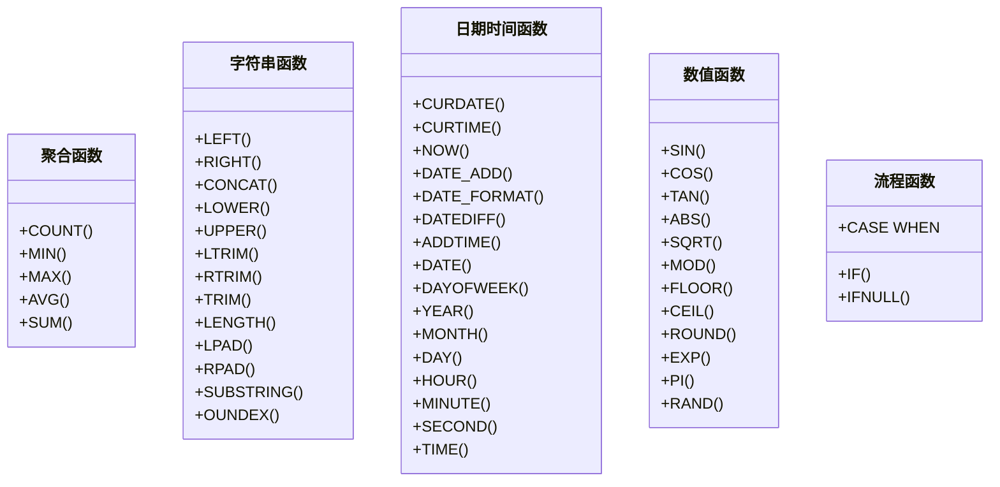

**图表来源**
- [function.md:5-73](file://docs/backend-base/mysql/function.md#L5-L73)

**章节来源**
- [function.md:1-73](file://docs/backend-base/mysql/function.md#L1-L73)

### 分库分表
- 垂直分库：按业务拆分不同表到不同库，库结构不同。
- 垂直分表：按字段拆分同一库的不同表，表结构相同。
- 水平分库：按策略拆分同一库的数据到多个库，库结构相同。
- 水平分表：按策略拆分同一表的数据到多个表，表结构相同。

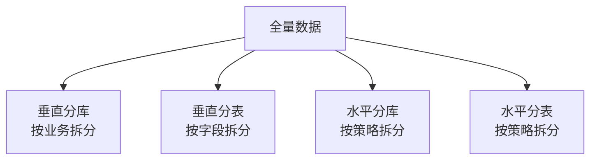

**图表来源**
- [sub-db.md:16-57](file://docs/backend-base/mysql/sub-db.md#L16-L57)

**章节来源**
- [sub-db.md:1-57](file://docs/backend-base/mysql/sub-db.md#L1-L57)

## 依赖分析
- 组件耦合：日志与复制紧密相关（Binlog是复制基础）；事务通过Undo/Redo保障一致性；视图与触发器依赖表结构；权限控制贯穿用户生命周期；SQL优化依赖数据类型与索引设计；分库分表影响查询与事务边界。
- 外部依赖：操作系统与文件系统（日志文件）、网络（主从复制）、客户端工具（mysqlbinlog、mysql）。
- 循环依赖：文档中未见直接循环依赖；各模块以“配置-启用-使用-清理/查看”为主线，逻辑清晰。

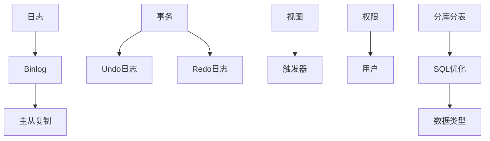

**图表来源**
- [log.md:15-111](file://docs/backend-base/mysql/log.md#L15-L111)
- [slave.md:13-121](file://docs/backend-base/mysql/slave.md#L13-L121)
- [transaction.md:80-128](file://docs/backend-base/mysql/transaction.md#L80-L128)
- [view.md:1-53](file://docs/backend-base/mysql/view.md#L1-L53)
- [trigger.md:1-35](file://docs/backend-base/mysql/trigger.md#L1-L35)
- [grammar.md:130-188](file://docs/backend-base/mysql/grammar.md#L130-L188)
- [better.md:1-123](file://docs/backend-base/mysql/better.md#L1-L123)
- [data-type.md:1-59](file://docs/backend-base/mysql/data-type.md#L1-L59)
- [sub-db.md:1-57](file://docs/backend-base/mysql/sub-db.md#L1-L57)

**章节来源**
- [log.md:1-111](file://docs/backend-base/mysql/log.md#L1-L111)
- [slave.md:1-121](file://docs/backend-base/mysql/slave.md#L1-L121)
- [transaction.md:1-128](file://docs/backend-base/mysql/transaction.md#L1-L128)
- [view.md:1-53](file://docs/backend-base/mysql/view.md#L1-L53)
- [trigger.md:1-35](file://docs/backend-base/mysql/trigger.md#L1-L35)
- [grammar.md:126-188](file://docs/backend-base/mysql/grammar.md#L126-L188)
- [better.md:1-123](file://docs/backend-base/mysql/better.md#L1-L123)
- [data-type.md:1-59](file://docs/backend-base/mysql/data-type.md#L1-L59)
- [sub-db.md:1-57](file://docs/backend-base/mysql/sub-db.md#L1-L57)

## 性能考虑
- 日志管理：合理配置Binlog格式与过期时间，定期清理以控制磁盘占用；慢查询日志用于识别热点与异常SQL。
- 事务：使用短事务与批量提交，避免长事务持有锁；合理设置隔离级别以平衡并发与一致性。
- 视图与触发器：谨慎使用复杂视图与触发器，避免在热路径上引入额外开销。
- SQL优化：优先使用覆盖索引与合适的数据类型；批量插入与LOAD DATA提升导入效率；分页查询采用子查询+覆盖索引。
- 主从复制：关注Binlog传输与RelayLog重放延迟；合理设置server-id与只读策略。

[本节为通用指导，无需特定文件来源]

## 故障排查指南
- 错误日志优先：数据库异常时首先查看错误日志定位问题。
- Binlog清理：使用清理命令或过期时间配置释放磁盘空间。
- 慢查询定位：开启慢查询日志，结合执行计划与索引设计优化。
- 事务回滚：确认事务边界与隔离级别，必要时回滚以恢复一致性。
- 主从复制：核对复制源坐标、只读配置与状态；检查Binlog格式与传输链路。
- 权限问题：核对用户权限与授权范围，必要时回收或重新授权。

**章节来源**
- [log.md:1-111](file://docs/backend-base/mysql/log.md#L1-L111)
- [transaction.md:19-128](file://docs/backend-base/mysql/transaction.md#L19-L128)
- [slave.md:1-121](file://docs/backend-base/mysql/slave.md#L1-L121)
- [grammar.md:130-188](file://docs/backend-base/mysql/grammar.md#L130-L188)

## 结论
MySQL数据库管理涉及日志、事务、复制、优化、权限、类型、函数、视图、触发器与分库分表等多个维度。通过规范的日志管理与监控、严谨的事务设计与回滚机制、稳健的主从复制与备份策略、有针对性的SQL优化与权限治理，以及合理的选择数据类型与函数使用，可以显著提升数据库的稳定性、性能与可维护性。建议在生产环境中将上述能力纳入标准化流程与自动化工具链，持续迭代优化。

[本节为总结性内容，无需特定文件来源]

## 附录
- 常用命令路径参考（以文档中路径代替具体代码片段）：
  - 启动/停止与连接：[base.md:14-30](file://docs/backend-base/mysql/base.md#L14-L30)
  - 日志查看与清理：[log.md:9-111](file://docs/backend-base/mysql/log.md#L9-L111)
  - 事务控制：[transaction.md:11-25](file://docs/backend-base/mysql/transaction.md#L11-L25)
  - 触发器管理：[trigger.md:13-35](file://docs/backend-base/mysql/trigger.md#L13-L35)
  - 视图管理：[view.md:9-53](file://docs/backend-base/mysql/view.md#L9-L53)
  - 主从复制搭建与状态查看：[slave.md:25-121](file://docs/backend-base/mysql/slave.md#L25-L121)
  - SQL优化实践：[better.md:3-123](file://docs/backend-base/mysql/better.md#L3-L123)
  - 权限管理：[grammar.md:130-188](file://docs/backend-base/mysql/grammar.md#L130-L188)
  - 数据类型参考：[data-type.md:1-59](file://docs/backend-base/mysql/data-type.md#L1-L59)
  - 函数参考：[function.md:1-73](file://docs/backend-base/mysql/function.md#L1-L73)
  - 分库分表策略：[sub-db.md:1-57](file://docs/backend-base/mysql/sub-db.md#L1-L57)