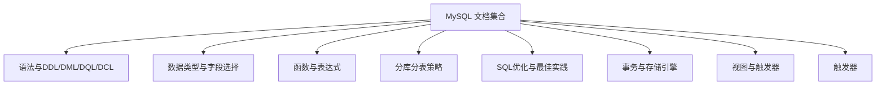
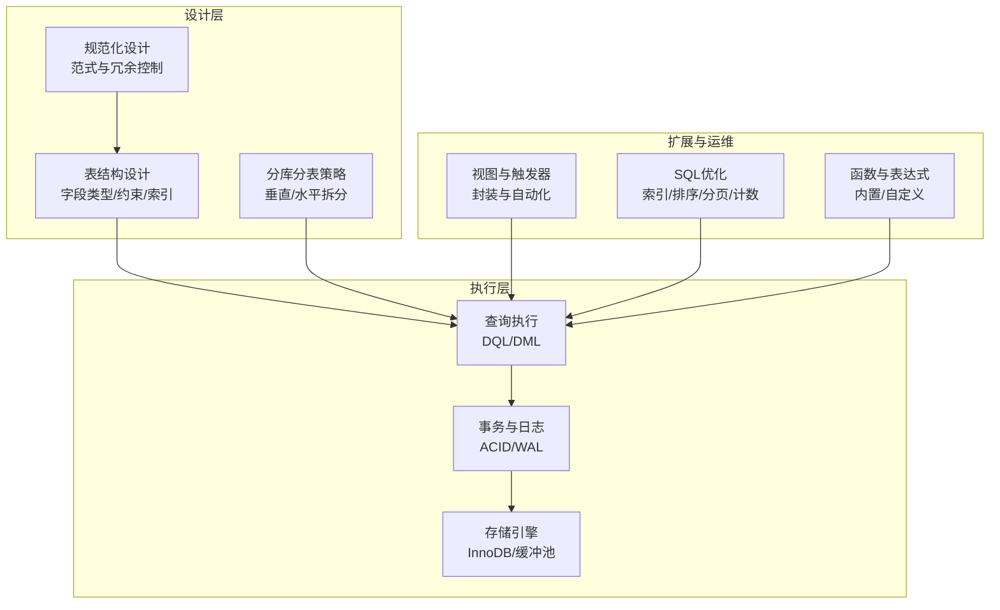
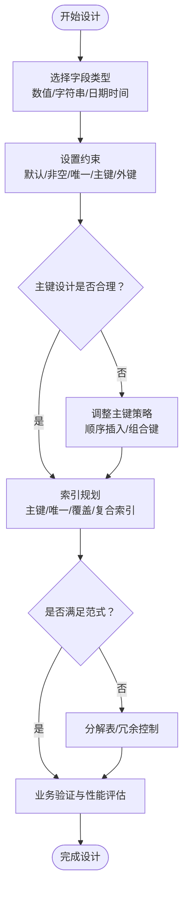
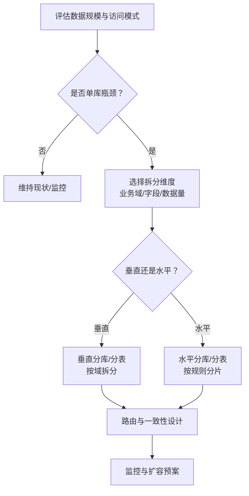
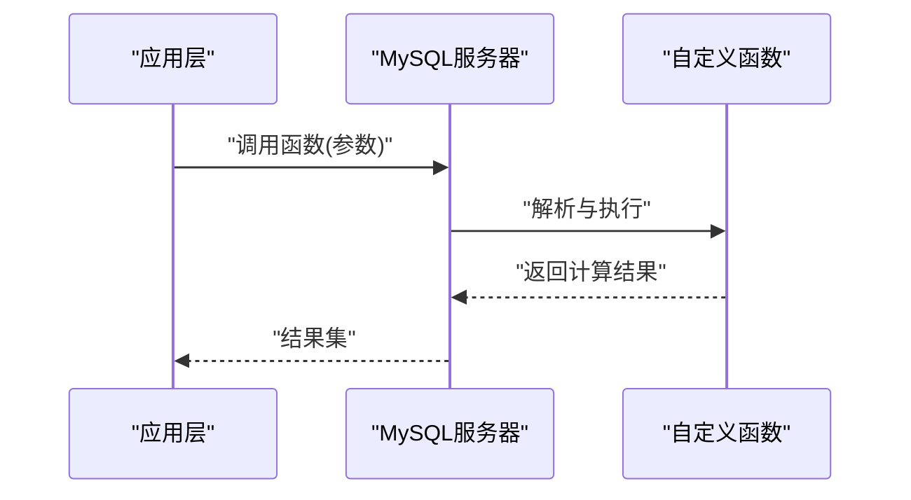
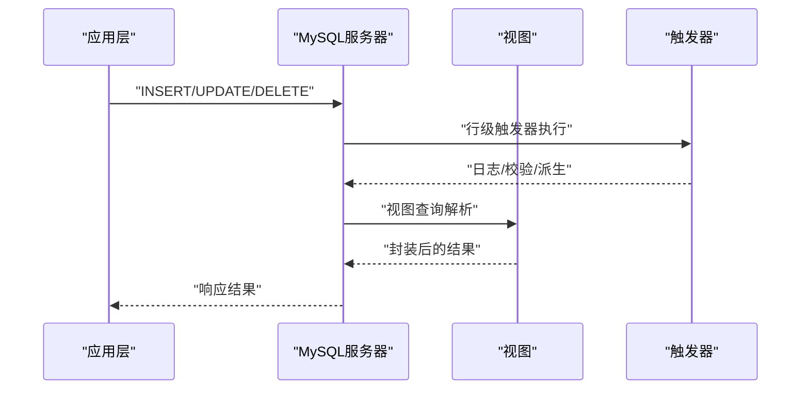
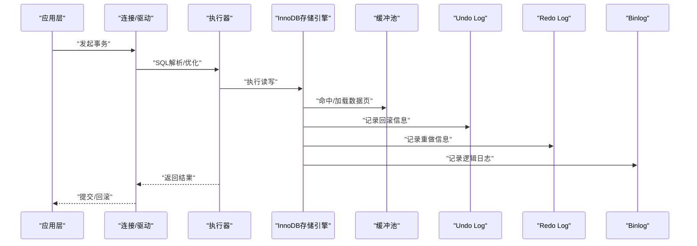
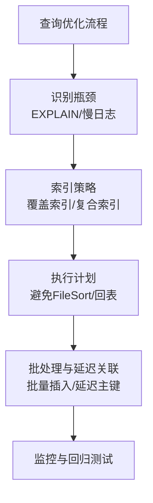
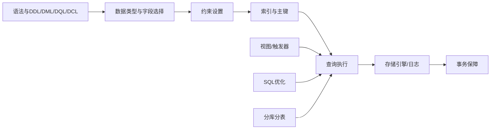

# 数据库设计

<cite>
**本文引用的文件**
- [基础语法与DDL/DML/DQL/DCL](file://docs/backend-base/mysql/grammar.md)
- [数据类型与字段选择](file://docs/backend-base/mysql/data-type.md)
- [函数与表达式](file://docs/backend-base/mysql/function.md)
- [分库分表策略](file://docs/backend-base/mysql/sub-db.md)
- [SQL优化与最佳实践](file://docs/backend-base/mysql/better.md)
- [事务与存储引擎](file://docs/backend-base/mysql/transaction.md)
- [视图与触发器](file://docs/backend-base/mysql/view.md)
- [触发器](file://docs/backend-base/mysql/trigger.md)
</cite>

## 目录
1. [引言](#引言)
2. [项目结构](#项目结构)
3. [核心组件](#核心组件)
4. [架构概览](#架构概览)
5. [详细组件分析](#详细组件分析)
6. [依赖分析](#依赖分析)
7. [性能考虑](#性能考虑)
8. [故障排查指南](#故障排查指南)
9. [结论](#结论)
10. [附录](#附录)

## 引言
本技术文档面向MySQL数据库设计与实现，围绕规范化设计原则、表结构设计、字段选择、约束设置、分库分表策略、存储函数与自定义函数、视图与触发器、事务与存储引擎、以及SQL优化与最佳实践展开，帮助读者构建高性能、可扩展、可维护的数据库设计方案。

## 项目结构
本仓库中与MySQL数据库设计相关的内容集中在“docs/backend-base/mysql”目录下，涵盖语法、数据类型、函数、分库分表、优化、事务、视图与触发器等主题，形成完整的知识体系。

## 核心组件
- 语法与DDL/DML/DQL/DCL：定义数据库对象创建、修改、删除与数据操作的规范，奠定表结构与约束的基础。
- 数据类型与字段选择：指导数值、字符串、日期时间等类型的合理选择与修饰符使用。
- 函数与表达式：提供聚合、字符串、日期时间、数值与流程函数，支撑复杂查询与数据处理。
- 分库分表策略：阐述垂直分库/分表、水平分库/分表的拆分方式与适用场景。
- SQL优化与最佳实践：覆盖插入、排序、分页、计数、更新等关键路径的优化策略。
- 事务与存储引擎：解释ACID特性、隔离级别、WAL机制、缓冲池与日志体系。
- 视图与触发器：说明视图的创建与检查选项、触发器的生命周期与应用场景。

章节来源
- [基础语法与DDL/DML/DQL/DCL:1-188](file://docs/backend-base/mysql/grammar.md#L1-L188)
- [数据类型与字段选择:1-59](file://docs/backend-base/mysql/data-type.md#L1-L59)
- [函数与表达式:1-73](file://docs/backend-base/mysql/function.md#L1-L73)
- [分库分表策略:1-57](file://docs/backend-base/mysql/sub-db.md#L1-L57)
- [SQL优化与最佳实践:1-123](file://docs/backend-base/mysql/better.md#L1-L123)
- [事务与存储引擎:1-128](file://docs/backend-base/mysql/transaction.md#L1-L128)
- [视图与触发器:1-53](file://docs/backend-base/mysql/view.md#L1-L53)
- [触发器:1-35](file://docs/backend-base/mysql/trigger.md#L1-L35)

## 架构概览
下图展示MySQL数据库设计的关键模块及其交互关系，体现从表结构设计到查询优化、事务保障与扩展策略的整体架构。

## 详细组件分析

### 表结构设计与规范化
- 设计原则
  - 第一范式：确保每列原子性，消除重复组。
  - 第二范式：在满足1NF基础上，非主属性完全依赖主键。
  - 第三范式：在满足2NF基础上，消除传递依赖。
  - 实际权衡：适度反规范化以降低JOIN成本，结合业务场景与查询热点。
- 字段选择与类型
  - 数值型：根据取值范围与精度需求选择TINYINT/SMALLINT/MEDIUMINT/INT/BIGINT/DECIMAL等。
  - 字符串：CHAR/VARCHAR的选择需综合固定长度与存储开销；BLOB/TEXT族用于大文本与二进制数据。
  - 日期时间：DATE/TIME/YEAR/DATETIME/TIMESTAMP，注意TIMESTAMP的时区与范围限制。
  - 修饰符：unsigned/auto_increment等修饰符提升性能与可读性。
- 约束设置
  - 默认值(default)、非空(not null)、唯一(unique)、主键(primary key)、自增(auto_increment)、外键(foreign key)。
  - 外键约束用于保证参照完整性，需配合合适索引避免锁升级。
- 索引与主键
  - InnoDB以聚簇索引组织数据，主键顺序插入可减少页分裂与碎片。
  - 覆盖索引可避免回表，显著提升查询与排序性能。

章节来源
- [基础语法与DDL/DML/DQL/DCL:15-44](file://docs/backend-base/mysql/grammar.md#L15-L44)
- [数据类型与字段选择:3-59](file://docs/backend-base/mysql/data-type.md#L3-L59)
- [SQL优化与最佳实践:40-66](file://docs/backend-base/mysql/better.md#L40-L66)

### 分库分表策略
- 垂直分库：按业务域拆分不同表至不同库，降低单库压力。
- 垂直分表：同一库内按字段拆分，分离热字段与冷字段。
- 水平分库：按路由规则将数据分布到多个库。
- 水平分表：按路由规则将数据分布到多个表。
- 路由策略
  - 范围分片：如按ID区间或时间范围。
  - 哈希分片：如按用户ID哈希。
  - 配置中心：集中管理分片规则与元数据。
- 事务与一致性
  - 跨分片事务需分布式事务或最终一致性方案。
  - 读写分离与异步复制需结合binlog与一致性策略。

章节来源
- [分库分表策略:16-57](file://docs/backend-base/mysql/sub-db.md#L16-L57)

### 存储函数与自定义函数
- 内置函数
  - 聚合函数：COUNT/MIN/MAX/SUM/AVG。
  - 字符串函数：LEFT/RIGHT/CONCAT/LOWER/UPPER/TRIM等。
  - 日期时间函数：CURDATE/CURTIME/NOW/DATE_ADD/DATE_FORMAT/等。
  - 数值函数：SIN/COS/TAN/ABS/SQRT/MOD/FLOOR/CEIL/ROUND/EXP/PI/RAND等。
  - 流程函数：IF/IFNULL/CASE WHEN等。
- 自定义函数
  - 在MySQL中可通过函数定义语法创建自定义函数，便于复用复杂计算与业务逻辑。
  - 注意：函数应无副作用、可预测、可缓存，避免在函数中执行DDL或长时间阻塞操作。
- 使用建议
  - 在WHERE/HAVING中避免对列施加函数，优先在应用层或物化字段中预计算。
  - 对高频调用的复杂表达式，可考虑视图或物化字段封装。

章节来源
- [函数与表达式:5-73](file://docs/backend-base/mysql/function.md#L5-L73)

### 视图与触发器
- 视图
  - 语法要点：CREATE/ALTER/DROP/REPLACE；WITH [CASCADED | LOCAL] CHECK OPTION。
  - 应用场景：封装复杂查询、权限隔离、简化业务逻辑。
  - 检查选项：CASCADED级联检查、LOCAL本地检查，确保写入一致性。
- 触发器
  - 生命周期：BEFORE/AFTER INSERT/UPDATE/DELETE，行级触发。
  - 引用上下文：OLD/NEW引用变更前后数据。
  - 应用场景：审计日志、数据校验、派生字段维护。

章节来源
- [视图与触发器:9-53](file://docs/backend-base/mysql/view.md#L9-L53)
- [触发器:13-35](file://docs/backend-base/mysql/trigger.md#L13-L35)

### 事务与存储引擎
- ACID特性
  - 原子性：事务内的所有操作要么全部成功，要么全部失败。
  - 一致性：事务完成后，数据必须保持一致性。
  - 隔离性：并发事务在不受干扰的情况下执行。
  - 持久性：事务一旦提交，对数据的改变是永久的。
- 存储引擎与日志
  - InnoDB：支持事务、聚簇索引、行级锁、MVCC。
  - Undo Log：回滚与多版本控制。
  - Redo Log：WAL顺序写，保障崩溃恢复与持久性。
  - Binlog：逻辑日志，用于主从复制与数据恢复。
- 缓冲池与页管理
  - Buffer Pool：缓存热点数据页，减少磁盘IO。
  - 页分裂/合并：主键顺序插入可降低页分裂，提升写入性能。

章节来源
- [事务与存储引擎:19-128](file://docs/backend-base/mysql/transaction.md#L19-L128)

### SQL优化与最佳实践
- 插入优化
  - 批量插入、手动事务提交、主键顺序插入、大体量数据使用LOAD DATA。
- 排序优化
  - 尽量使用“Using index”，遵循最左前缀法则，必要时增大sort_buffer_size。
- 分页优化
  - 使用覆盖索引+子查询的延迟关联，降低偏移量带来的扫描成本。
- 计数优化
  - InnoDB COUNT(*)需逐行扫描，可采用近似计数或缓存策略。
- 更新优化
  - 行锁基于索引，避免索引失效导致锁升级为表锁。

章节来源
- [SQL优化与最佳实践:3-123](file://docs/backend-base/mysql/better.md#L3-L123)

## 依赖分析
- 组件耦合
  - 表结构设计依赖数据类型与约束；查询执行依赖索引与存储引擎；事务保障依赖日志体系。
  - 视图与触发器作为逻辑封装与自动化手段，依赖底层表结构与约束。
- 外部依赖
  - 应用层通过连接池与驱动与数据库交互，需关注连接数与超时配置。
  - 分布式场景依赖配置中心与一致性协议。

## 性能考虑
- 选择合适的数据类型与修饰符，避免过度占用存储与内存。
- 合理设计主键与索引，遵循最左前缀法则，减少回表与FileSort。
- 控制事务粒度与持续时间，避免长事务与热点冲突。
- 使用覆盖索引与延迟关联优化分页查询。
- 对高频统计与聚合使用缓存或物化视图。

## 故障排查指南
- 常见问题
  - 锁升级：索引缺失导致行锁升级为表锁，检查执行计划与索引覆盖。
  - 页分裂：主键乱序插入引发页分裂与碎片，改为顺序插入。
  - 排序性能差：未使用索引排序导致FileSort，补充合适索引或调整查询。
  - 计数慢：InnoDB全表扫描，引入近似计数或缓存。
- 排查步骤
  - 使用EXPLAIN确认执行计划与索引使用情况。
  - 结合慢查询日志定位热点SQL。
  - 检查缓冲池命中率与页读写统计。
  - 核对事务隔离级别与锁等待情况。

章节来源
- [SQL优化与最佳实践:67-123](file://docs/backend-base/mysql/better.md#L67-L123)
- [事务与存储引擎:26-128](file://docs/backend-base/mysql/transaction.md#L26-L128)

## 结论
通过规范化设计、合理的字段与索引策略、完善的约束与事务保障、以及系统化的SQL优化与扩展策略，可在MySQL上构建高性能、可扩展、可维护的数据库系统。分库分表需结合业务特征与容量规划，配合视图与触发器实现逻辑封装与自动化，最终达成业务与技术的平衡。

## 附录
- 快速参考
  - DDL/DML/DQL/DCL语法与约束定义参见：[基础语法与DDL/DML/DQL/DCL:3-44](file://docs/backend-base/mysql/grammar.md#L3-L44)
  - 数据类型与修饰符参见：[数据类型与字段选择:28-59](file://docs/backend-base/mysql/data-type.md#L28-L59)
  - 常用函数参见：[函数与表达式:5-73](file://docs/backend-base/mysql/function.md#L5-L73)
  - 分库分表策略参见：[分库分表策略:16-57](file://docs/backend-base/mysql/sub-db.md#L16-L57)
  - 事务与日志参见：[事务与存储引擎:19-128](file://docs/backend-base/mysql/transaction.md#L19-L128)
  - 视图与触发器参见：[视图与触发器:9-53](file://docs/backend-base/mysql/view.md#L9-L53)、[触发器:13-35](file://docs/backend-base/mysql/trigger.md#L13-L35)