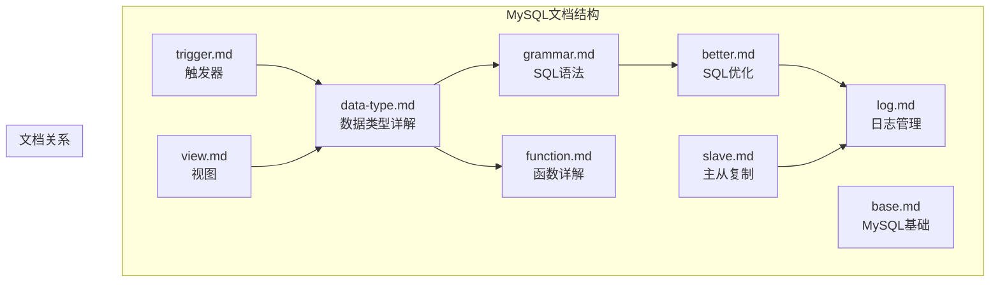
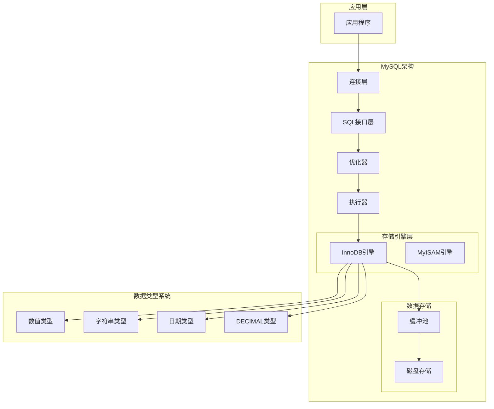
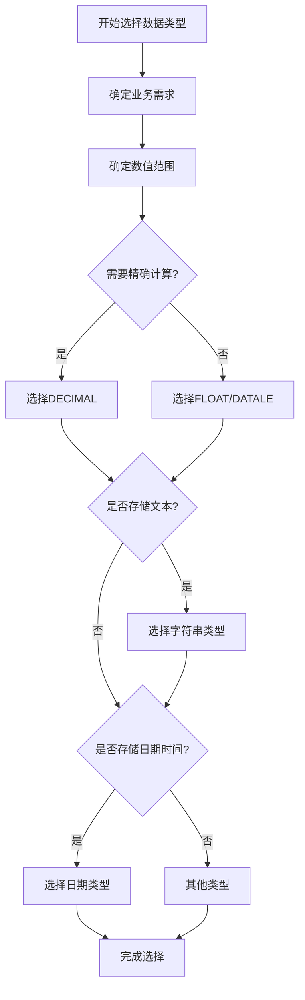
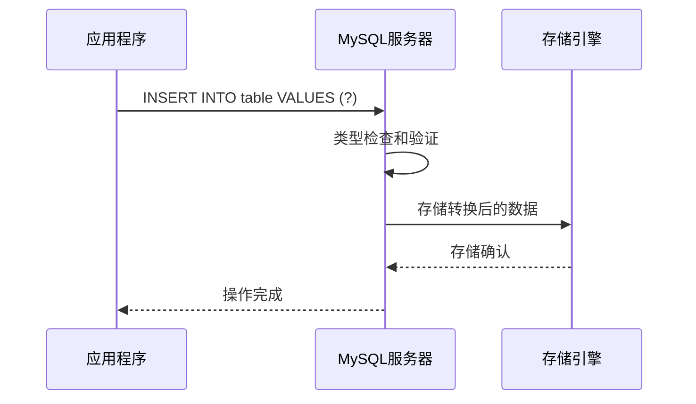
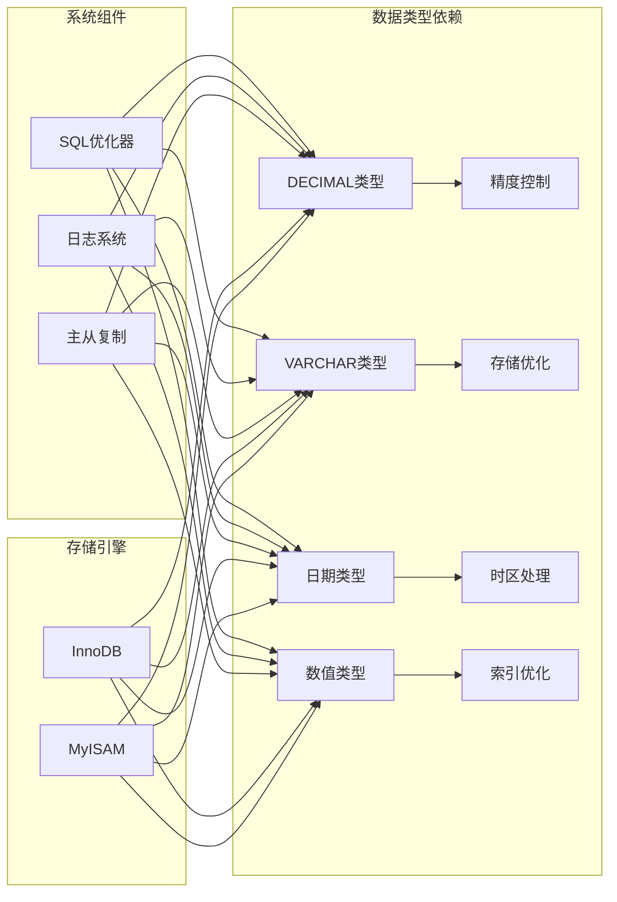
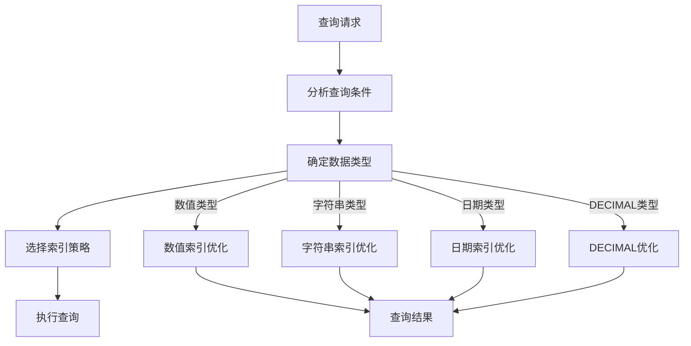
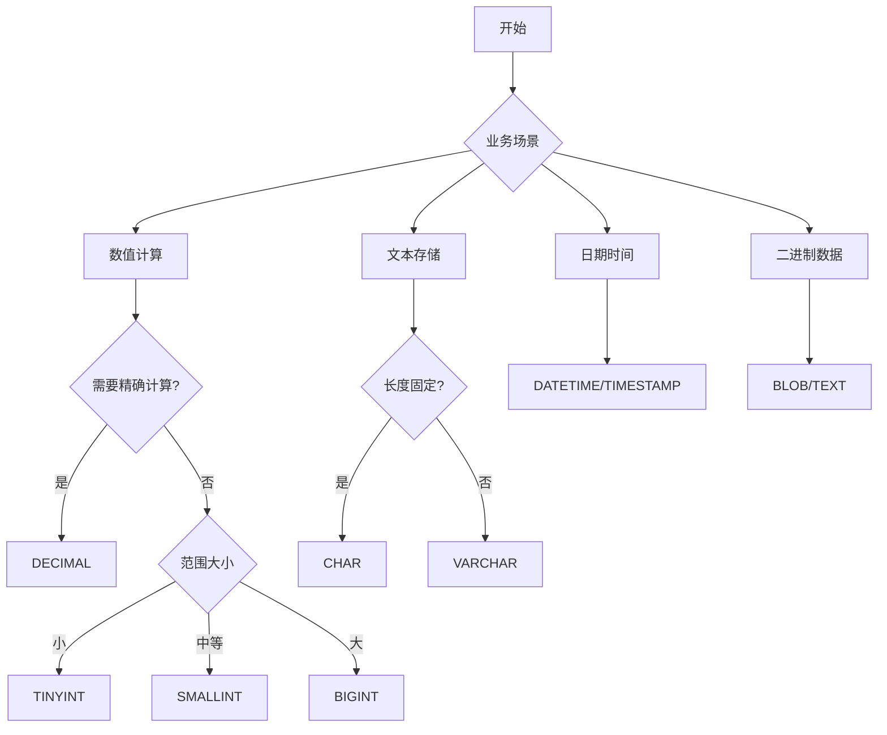

# 数据类型详解

<cite>
**本文档引用的文件**
- [data-type.md](file://docs/backend-base/mysql/data-type.md)
- [base.md](file://docs/backend-base/mysql/base.md)
- [grammar.md](file://docs/backend-base/mysql/grammar.md)
- [better.md](file://docs/backend-base/mysql/better.md)
- [function.md](file://docs/backend-base/mysql/function.md)
- [log.md](file://docs/backend-base/mysql/log.md)
- [slave.md](file://docs/backend-base/mysql/slave.md)
- [trigger.md](file://docs/backend-base/mysql/trigger.md)
- [view.md](file://docs/backend-base/mysql/view.md)
</cite>

## 目录
1. [简介](#简介)
2. [项目结构](#项目结构)
3. [核心数据类型](#核心数据类型)
4. [架构概览](#架构概览)
5. [详细组件分析](#详细组件分析)
6. [依赖关系分析](#依赖关系分析)
7. [性能考虑](#性能考虑)
8. [故障排除指南](#故障排除指南)
9. [结论](#结论)
10. [附录](#附录)

## 简介

MySQL作为一种广泛使用的关系型数据库管理系统，其数据类型设计直接影响着数据存储效率、查询性能和业务逻辑的正确性。本文档深入解析MySQL支持的各种数据类型，包括数值类型、字符串类型、日期时间类型等的特性和使用场景，为开发者提供全面的技术指导和最佳实践建议。

## 项目结构

该项目采用VuePress静态站点生成器构建，MySQL相关文档集中在`docs/backend-base/mysql/`目录下，形成了完整的MySQL知识体系：



**图表来源**
- [data-type.md:1-59](file://docs/backend-base/mysql/data-type.md#L1-L59)
- [grammar.md:1-188](file://docs/backend-base/mysql/grammar.md#L1-L188)

**章节来源**
- [data-type.md:1-59](file://docs/backend-base/mysql/data-type.md#L1-L59)
- [base.md:1-30](file://docs/backend-base/mysql/base.md#L1-L30)

## 核心数据类型

### 数值类型

MySQL数值类型涵盖了从极小到极大的各种整数和浮点数需求，每种类型都有其特定的应用场景和性能特征。

#### 整数类型

| 类型 | 存储大小 | 有符号范围 | 无符号范围 | 描述 |
|------|----------|------------|------------|------|
| TINYINT | 1字节 | (-128, 127) | (0, 255) | 小整数值 |
| SMALLINT | 2字节 | (-32768, 32767) | (0, 65535) | 大整数值 |
| MEDIUMINT | 3字节 | (-8388608, 8388607) | (0, 16777215) | 大整数值 |
| INT/INTEGER | 4字节 | (-2147483648, 2147483647) | (0, 4294967295) | 大整数值 |
| BIGINT | 8字节 | (-2^63, 2^63-1) | (0, 2^63-1) | 极大整数值 |

**使用场景建议**：
- **TINYINT**：适合存储布尔值、小范围计数器、状态标志
- **SMALLINT**：适合存储中等范围的ID、年龄、分数等
- **MEDIUMINT**：适合存储中等规模的业务ID
- **INT**：最常用的数据类型，适合大多数业务场景
- **BIGINT**：适合需要超大范围的ID生成、时间戳等

#### 浮点数类型

| 类型 | 存储大小 | 有效范围 | 描述 |
|------|----------|----------|------|
| FLOAT | 4字节 | 约±3.4×10^38 | 单精度浮点数 |
| DOUBLE | 8字节 | 约±1.79×10^308 | 双精度浮点数 |

**精度控制**：
- FLOAT和DOUBLE都是近似精度，不适合金融计算
- 对于精确计算场景，应使用DECIMAL类型

#### 精确数值类型

**DECIMAL类型**：
- 存储大小：取决于精度(M)和标度(D)的值
- 精度控制：通过M(总位数)和D(小数位数)精确控制
- 适用场景：金融计算、科学计算等需要高精度的场合

**修饰符说明**：
- **UNSIGNED**：无符号修饰符，扩展正数范围
- **AUTO_INCREMENT**：自增修饰符，常用于主键设计

### 字符串类型

MySQL字符串类型提供了灵活的文本存储方案，从固定长度到可变长度，从文本到二进制数据都有相应的类型支持。

#### 文本类型对比

| 类型 | 最大存储大小 | 描述 |
|------|-------------|------|
| CHAR | 0-255字节 | 定长字符串，指定长度即占用相应空间 |
| VARCHAR | 0-65535字节 | 变长字符串，按实际长度存储 |
| TINYTEXT | 0-255字节 | 短文本字符串 |
| TEXT | 0-65535字节 | 长文本数据 |
| MEDIUMTEXT | 0-16,777,215字节 | 中等长度文本数据 |
| LONGTEXT | 0-4,294,967,295字节 | 极大文本数据 |

#### 二进制类型

| 类型 | 最大存储大小 | 描述 |
|------|-------------|------|
| TINYBLOB | 0-255字节 | 不超过255个字符的二进制数据 |
| BLOB | 0-65535字节 | 二进制形式的长文本数据 |
| MEDIUMBLOB | 0-16,777,215字节 | 二进制形式的中等长度文本数据 |
| LONGBLOB | 0-4,294,967,295字节 | 二进制形式的极大文本数据 |

**CHAR vs VARCHAR选择**：
- CHAR：定长存储，性能略优，适合固定长度的标识符
- VARCHAR：变长存储，节省空间，适合用户输入的文本
- 性能差异主要体现在存储和检索效率上

### 日期时间类型

MySQL日期时间类型提供了丰富的日期时间处理能力，满足从简单日期到复杂时间戳的各种需求。

| 类型 | 存储大小 | 有效范围 | 格式 | 描述 |
|------|----------|----------|------|------|
| DATE | 3字节 | 1000-01-01 到 9999-12-31 | YYYY-MM-DD | 日期值 |
| TIME | 3字节 | -838:59:59 到 838:59:59 | HH:MM:SS | 时间值或持续时间 |
| YEAR | 1字节 | 1901 到 2155 | YYYY | 年份值 |
| DATETIME | 8字节 | 1000-01-01 00:00:00 到 9999-12-31 23:59:59 | YYYY-MM-DD HH:MM:SS | 混合日期和时间值 |
| TIMESTAMP | 4字节 | 1970-01-01 00:00:01 到 2038-01-19 03:14:07 | YYYY-MM-DD HH:MM:SS | 混合日期和时间值，时间戳 |

**选择建议**：
- **DATE**：仅需日期信息的场景
- **TIME**：仅需时间或持续时间的场景  
- **DATETIME**：需要精确到秒的日期时间
- **TIMESTAMP**：需要自动时间戳功能的场景

**章节来源**
- [data-type.md:1-59](file://docs/backend-base/mysql/data-type.md#L1-L59)

## 架构概览

MySQL数据类型系统与整体数据库架构的关系体现了层次化的设计理念：



**图表来源**
- [data-type.md:1-59](file://docs/backend-base/mysql/data-type.md#L1-L59)
- [better.md:1-123](file://docs/backend-base/mysql/better.md#L1-L123)

## 详细组件分析

### 数据类型选择策略

#### 业务场景分析



**图表来源**
- [data-type.md:1-59](file://docs/backend-base/mysql/data-type.md#L1-L59)

#### 性能优化考虑

**存储空间优化**：
- 选择合适的数据类型可以显著减少存储空间
- 避免过度使用VARCHAR类型
- 合理使用CHAR类型存储固定长度数据

**索引性能影响**：
- 不同数据类型的索引效率不同
- 数值类型通常比字符串类型索引更高效
- DECIMAL类型的索引性能需要特别考虑

### 数据类型转换注意事项

#### 显式类型转换



**图表来源**
- [grammar.md:17-33](file://docs/backend-base/mysql/grammar.md#L17-L33)

#### 隐式类型转换

隐式转换在某些情况下可能导致数据丢失或精度问题，需要特别注意：

**转换规则**：
- 数值到字符串：可能丢失精度
- 字符串到数值：非法字符串转换为0
- 日期字符串到日期类型：格式必须正确

**章节来源**
- [data-type.md:1-59](file://docs/backend-base/mysql/data-type.md#L1-L59)
- [grammar.md:17-33](file://docs/backend-base/mysql/grammar.md#L17-L33)

### 实际建表示例

基于文档中的语法规范，以下是典型的数据表设计示例：

**用户信息表设计**：
```sql
CREATE TABLE users (
    id INT AUTO_INCREMENT PRIMARY KEY,
    username VARCHAR(50) NOT NULL UNIQUE,
    email VARCHAR(100) NOT NULL UNIQUE,
    age TINYINT UNSIGNED,
    balance DECIMAL(10,2),
    created_at TIMESTAMP DEFAULT CURRENT_TIMESTAMP,
    updated_at TIMESTAMP DEFAULT CURRENT_TIMESTAMP ON UPDATE CURRENT_TIMESTAMP
);
```

**产品信息表设计**：
```sql
CREATE TABLE products (
    id INT AUTO_INCREMENT PRIMARY KEY,
    name VARCHAR(255) NOT NULL,
    description TEXT,
    price DECIMAL(10,2) NOT NULL,
    stock_quantity INT DEFAULT 0,
    category_id SMALLINT,
    created_date DATE,
    is_active BOOLEAN DEFAULT TRUE
);
```

**章节来源**
- [grammar.md:17-33](file://docs/backend-base/mysql/grammar.md#L17-L33)

## 依赖关系分析

MySQL数据类型系统与其他组件的依赖关系体现了数据库的整体架构：



**图表来源**
- [data-type.md:1-59](file://docs/backend-base/mysql/data-type.md#L1-L59)
- [better.md:1-123](file://docs/backend-base/mysql/better.md#L1-L123)
- [log.md:1-111](file://docs/backend-base/mysql/log.md#L1-L111)
- [slave.md:1-121](file://docs/backend-base/mysql/slave.md#L1-L121)

**章节来源**
- [better.md:1-123](file://docs/backend-base/mysql/better.md#L1-L123)
- [log.md:1-111](file://docs/backend-base/mysql/log.md#L1-L111)
- [slave.md:1-121](file://docs/backend-base/mysql/slave.md#L1-L121)

## 性能考虑

### 存储效率优化

**数据类型选择对存储效率的影响**：

| 数据类型 | 存储效率 | 内存占用 | 适用场景 |
|----------|----------|----------|----------|
| TINYINT | 高 | 1字节 | 布尔值、小范围计数 |
| SMALLINT | 高 | 2字节 | 中等范围ID、分数 |
| MEDIUMINT | 中等 | 3字节 | 中等规模业务ID |
| INT | 中等 | 4字节 | 通用业务ID |
| BIGINT | 低 | 8字节 | 超大范围ID、时间戳 |

**索引性能对比**：
- 数值类型索引通常比字符串类型更快
- DECIMAL类型索引需要特殊的优化策略
- CHAR类型在某些场景下比VARCHAR性能更好

### 查询性能优化

**基于数据类型的选择性**：



**图表来源**
- [better.md:67-86](file://docs/backend-base/mysql/better.md#L67-L86)

## 故障排除指南

### 常见数据类型问题

**数值溢出问题**：
- 检查数据范围是否超出类型限制
- 考虑使用更大范围的数据类型
- 实施数据验证和边界检查

**精度丢失问题**：
- 对于金融计算使用DECIMAL类型
- 避免在浮点数上进行精确计算
- 实施适当的舍入策略

**存储空间不足问题**：
- 评估VARCHAR的实际使用情况
- 考虑CHAR类型的固定长度优势
- 实施数据压缩和归档策略

### 性能诊断方法

**监控指标**：
- 查询执行时间
- 索引使用率
- 存储空间利用率
- 缓冲池命中率

**优化策略**：
- 定期分析查询性能
- 调整数据类型选择
- 优化索引设计
- 实施分区策略

**章节来源**
- [log.md:1-111](file://docs/backend-base/mysql/log.md#L1-L111)

## 结论

MySQL数据类型系统为不同的业务需求提供了丰富而精确的选择。通过合理选择数据类型，不仅可以优化存储空间和查询性能，还能确保数据的准确性和完整性。

**关键要点总结**：
1. **精确性优先**：金融和科学计算必须使用DECIMAL类型
2. **性能平衡**：在存储效率和查询性能之间找到平衡点
3. **业务导向**：根据具体的业务场景选择最适合的数据类型
4. **未来扩展**：考虑业务发展对数据类型选择的影响
5. **监控维护**：建立数据类型使用的监控和维护机制

通过深入理解MySQL数据类型的特点和最佳实践，开发者可以构建更加高效、可靠和可维护的数据库系统。

## 附录

### 数据类型选择决策树



### 性能基准参考

| 数据类型组合 | 存储效率 | 查询性能 | 内存占用 |
|-------------|----------|----------|----------|
| INT + VARCHAR(50) + DECIMAL(10,2) | 高 | 中等 | 低 |
| TINYINT + CHAR(10) + DATE | 高 | 高 | 低 |
| BIGINT + TEXT + TIMESTAMP | 中等 | 低 | 中等 |
| DECIMAL(20,10) + MEDIUMTEXT + DATETIME | 低 | 低 | 高 |