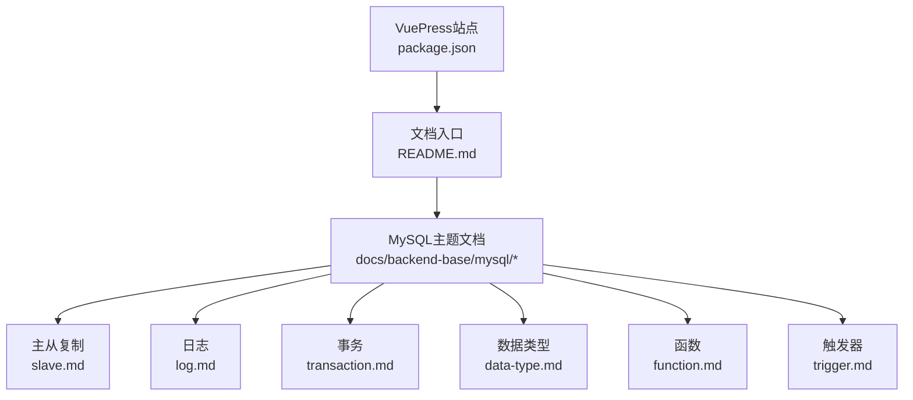
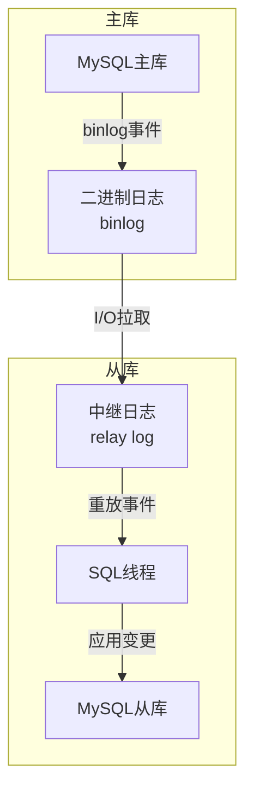
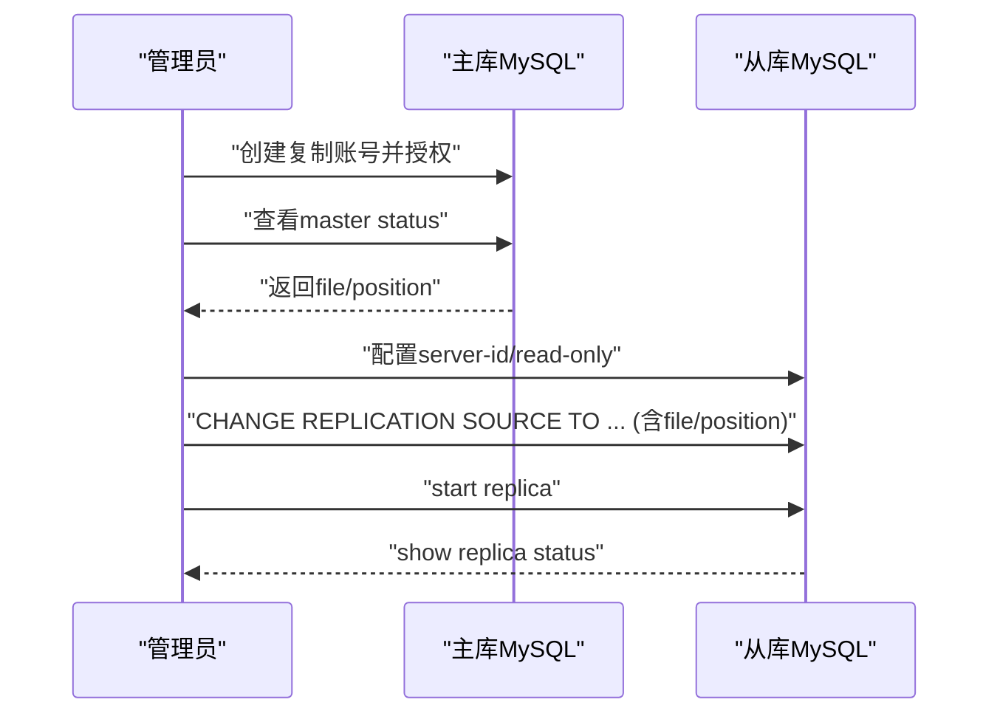
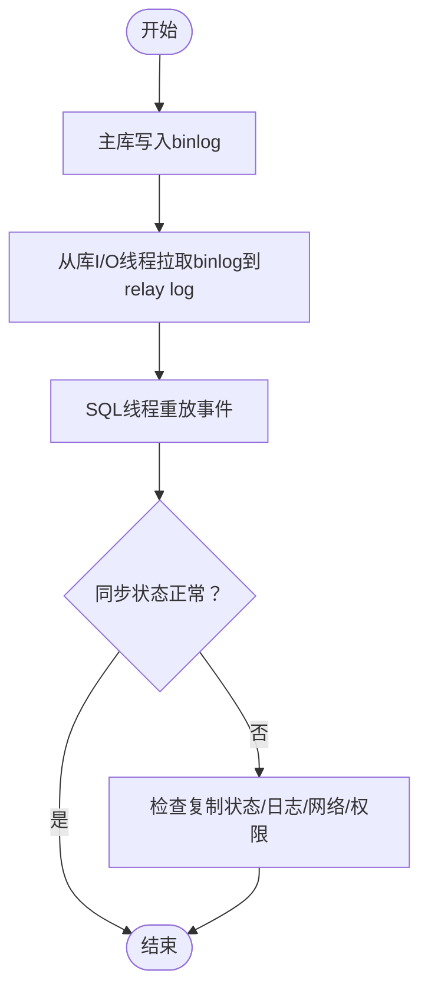
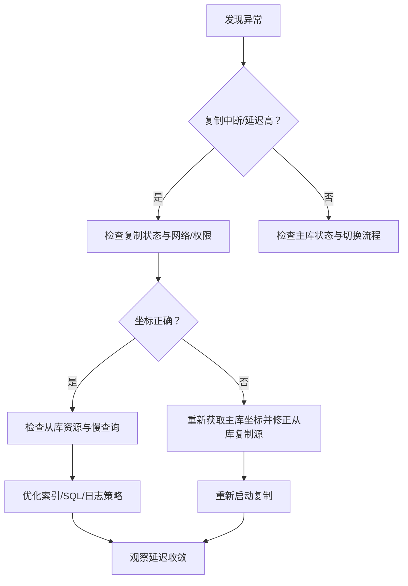

# 高可用架构

<cite>
**本文引用的文件**
- [README.md](file://README.md)
- [package.json](file://package.json)
- [docs/backend-base/mysql/slave.md](file://docs/backend-base/mysql/slave.md)
- [docs/backend-base/mysql/log.md](file://docs/backend-base/mysql/log.md)
- [docs/backend-base/mysql/transaction.md](file://docs/backend-base/mysql/transaction.md)
- [docs/backend-base/mysql/data-type.md](file://docs/backend-base/mysql/data-type.md)
- [docs/backend-base/mysql/function.md](file://docs/backend-base/mysql/function.md)
- [docs/backend-base/mysql/trigger.md](file://docs/backend-base/mysql/trigger.md)
</cite>

## 目录
1. [引言](#引言)
2. [项目结构](#项目结构)
3. [核心组件](#核心组件)
4. [架构总览](#架构总览)
5. [详细组件分析](#详细组件分析)
6. [依赖分析](#依赖分析)
7. [性能考虑](#性能考虑)
8. [故障排查指南](#故障排查指南)
9. [结论](#结论)
10. [附录](#附录)

## 引言
本技术文档围绕MySQL高可用架构展开，重点覆盖主从复制的配置与管理、数据同步机制、故障切换策略，以及半同步复制与组复制的实现原理与适用场景。同时结合仓库中现有的MySQL主题文档，给出集群部署、负载均衡、监控告警的运维实践建议，并提供可溯源的配置示例路径与故障排查方法。

## 项目结构
该项目为VuePress静态站点，文档集中在docs/backend-base/mysql目录下，涵盖MySQL基础、复制、日志、事务、函数与触发器等内容。本文档将基于这些现有文档，构建MySQL高可用架构的知识体系与实操指引。

图表来源
- [package.json:1-17](file://package.json#L1-L17)
- [README.md:1-12](file://README.md#L1-L12)
- [docs/backend-base/mysql/slave.md:1-121](file://docs/backend-base/mysql/slave.md#L1-L121)
- [docs/backend-base/mysql/log.md:1-111](file://docs/backend-base/mysql/log.md#L1-L111)
- [docs/backend-base/mysql/transaction.md:1-128](file://docs/backend-base/mysql/transaction.md#L1-L128)
- [docs/backend-base/mysql/data-type.md:1-59](file://docs/backend-base/mysql/data-type.md#L1-L59)
- [docs/backend-base/mysql/function.md:1-73](file://docs/backend-base/mysql/function.md#L1-L73)
- [docs/backend-base/mysql/trigger.md:1-35](file://docs/backend-base/mysql/trigger.md#L1-L35)

章节来源
- [README.md:1-12](file://README.md#L1-L12)
- [package.json:1-17](file://package.json#L1-L17)

## 核心组件
- 主库与从库：通过二进制日志（binlog）实现数据变更的传播与重放，维持主从一致性。
- 复制通道：包含主库binlog、从库relay log与SQL线程，形成“读取-写入-重放”的闭环。
- 权限与坐标：主库授予复制账号权限，使用show master status获取binlog坐标，从库据此建立复制源。
- 日志体系：binlog用于复制与恢复；事务日志（redo/undo）保障事务ACID；慢查询与通用查询日志辅助诊断。
- 数据与对象：数据类型、函数、触发器等基础能力支撑高可用架构的稳定性与可观测性。

章节来源
- [docs/backend-base/mysql/slave.md:1-121](file://docs/backend-base/mysql/slave.md#L1-L121)
- [docs/backend-base/mysql/log.md:1-111](file://docs/backend-base/mysql/log.md#L1-L111)
- [docs/backend-base/mysql/transaction.md:1-128](file://docs/backend-base/mysql/transaction.md#L1-L128)
- [docs/backend-base/mysql/data-type.md:1-59](file://docs/backend-base/mysql/data-type.md#L1-L59)
- [docs/backend-base/mysql/function.md:1-73](file://docs/backend-base/mysql/function.md#L1-L73)
- [docs/backend-base/mysql/trigger.md:1-35](file://docs/backend-base/mysql/trigger.md#L1-L35)

## 架构总览
下图展示MySQL主从复制在高可用中的角色与关键交互：

图表来源
- [docs/backend-base/mysql/slave.md:13-24](file://docs/backend-base/mysql/slave.md#L13-L24)
- [docs/backend-base/mysql/log.md:15-44](file://docs/backend-base/mysql/log.md#L15-L44)
- [docs/backend-base/mysql/transaction.md:107-128](file://docs/backend-base/mysql/transaction.md#L107-L128)

## 详细组件分析

### 主从复制配置与管理
- 主库配置要点
  - 设置唯一的server-id，避免冲突。
  - read-only=0确保主库可写。
  - 可选地通过binlog-do-db/binlog-ignore-db限定同步范围。
  - 重启MySQL使配置生效。
- 主库授权与坐标
  - 创建复制账号并授予REPLICATION SLAVE权限。
  - 执行show master status获取file与position。
- 从库配置要点
  - 设置唯一的server-id（与主库不同）。
  - read-only=1限制从库写入，避免数据漂移。
  - 重启MySQL。
- 从库建立复制源
  - MySQL 8.0.23及以上使用CHANGE REPLICATION SOURCE TO，指定SOURCE_HOST/SOURCE_USER/SOURCE_PASSWORD/SOURCE_LOG_FILE/SOURCE_LOG_POS。
  - 8.0.23之前使用CHANGE MASTER TO。
- 启动与状态检查
  - MySQL 8.0.22之后使用start replica；之前使用start slave。
  - 使用show replica status（或show slave status）检查复制状态。

图表来源
- [docs/backend-base/mysql/slave.md:33-121](file://docs/backend-base/mysql/slave.md#L33-L121)

章节来源
- [docs/backend-base/mysql/slave.md:33-121](file://docs/backend-base/mysql/slave.md#L33-L121)

### 数据同步机制与日志
- binlog与复制
  - binlog记录DDL/DML，是主从复制与恢复的基础。
  - 支持STATEMENT/ROW/MIXED三种格式，ROW格式更安全，适合主从一致性。
- 事务日志与持久性
  - redo log保障事务持久性与崩溃恢复；undo log支持回滚与多版本并发控制（MVCC）。
- 日志管理
  - 慢查询日志与通用查询日志用于性能诊断与审计。
  - binlog过期时间与清理策略避免磁盘膨胀。

图表来源
- [docs/backend-base/mysql/log.md:15-73](file://docs/backend-base/mysql/log.md#L15-L73)
- [docs/backend-base/mysql/transaction.md:95-128](file://docs/backend-base/mysql/transaction.md#L95-L128)

章节来源
- [docs/backend-base/mysql/log.md:15-73](file://docs/backend-base/mysql/log.md#L15-L73)
- [docs/backend-base/mysql/transaction.md:95-128](file://docs/backend-base/mysql/transaction.md#L95-L128)

### 故障切换与高可用策略
- 快速切换
  - 当主库故障时，将流量切换至从库，优先选择延迟最低、状态健康的从库。
- 读写分离
  - 写操作定向至主库；读操作分流至从库，降低主库压力。
- 备份与恢复
  - 在从库执行备份，避免影响主库；利用binlog进行增量恢复。

章节来源
- [docs/backend-base/mysql/slave.md:7-12](file://docs/backend-base/mysql/slave.md#L7-L12)

### 半同步复制与组复制
- 半同步复制
  - 在事务提交时，至少等待一个从库确认收到并写入relay log后再返回成功，提升数据安全性。
- 组复制（Group Replication）
  - 基于Paxos协议的多主/单主一致性复制，具备自动故障检测与恢复能力，适用于强一致场景。

（本节为概念性说明，结合仓库文档未直接覆盖，故不附加章节来源）

### 集群部署、负载均衡与监控告警
- 集群部署
  - 明确主从角色与server-id；统一binlog格式与同步策略；规划网络与存储。
- 负载均衡
  - 使用代理或中间件实现读写分离与故障剔除；根据延迟与健康状态动态路由。
- 监控告警
  - 关注复制延迟、I/O线程状态、SQL线程状态、binlog清理与慢查询指标；结合通用查询日志定位异常。

章节来源
- [docs/backend-base/mysql/log.md:75-111](file://docs/backend-base/mysql/log.md#L75-L111)
- [docs/backend-base/mysql/slave.md:7-12](file://docs/backend-base/mysql/slave.md#L7-L12)

## 依赖分析
- 组件耦合
  - 从库依赖主库binlog；复制状态受权限、网络、磁盘空间与binlog配置影响。
  - 事务日志与binlog共同保障数据一致性与可恢复性。
- 外部依赖
  - 系统层面的网络连通性、磁盘容量与IO性能。
  - MySQL版本差异带来的语法变化（如CHANGE MASTER/REPLICATION SOURCE）。

图表来源
- [docs/backend-base/mysql/slave.md:13-24](file://docs/backend-base/mysql/slave.md#L13-L24)
- [docs/backend-base/mysql/log.md:15-111](file://docs/backend-base/mysql/log.md#L15-L111)
- [docs/backend-base/mysql/transaction.md:95-128](file://docs/backend-base/mysql/transaction.md#L95-L128)

章节来源
- [docs/backend-base/mysql/slave.md:13-24](file://docs/backend-base/mysql/slave.md#L13-L24)
- [docs/backend-base/mysql/log.md:15-111](file://docs/backend-base/mysql/log.md#L15-L111)
- [docs/backend-base/mysql/transaction.md:95-128](file://docs/backend-base/mysql/transaction.md#L95-L128)

## 性能考虑
- binlog格式
  - 优先ROW格式以减少不确定性；在一致性与性能间权衡。
- 事务日志
  - 合理配置redo/undo大小与刷盘策略，避免频繁IO。
- 查询优化
  - 使用覆盖索引、合理LIMIT与ORDER BY，减少慢查询。
- 数据类型与存储
  - 选择合适的数据类型，避免过度占用空间与IO放大。

章节来源
- [docs/backend-base/mysql/log.md:30-44](file://docs/backend-base/mysql/log.md#L30-L44)
- [docs/backend-base/mysql/transaction.md:95-128](file://docs/backend-base/mysql/transaction.md#L95-L128)
- [docs/backend-base/mysql/better.md:1-123](file://docs/backend-base/mysql/better.md#L1-L123)
- [docs/backend-base/mysql/data-type.md:1-59](file://docs/backend-base/mysql/data-type.md#L1-L59)

## 故障排查指南
- 复制中断
  - 检查从库复制状态（show replica status/show slave status），核对网络、权限与binlog坐标。
  - 若坐标不一致，重新获取主库坐标并修正从库复制源。
- 延迟过高
  - 检查从库relay log堆积与SQL线程状态；评估从库资源瓶颈与慢查询。
- 主库异常
  - 快速切换至从库，验证数据一致性；恢复后重新建立复制。
- 日志与审计
  - 开启并定期轮转慢查询日志与通用查询日志，定位热点与异常SQL。
- 触发器与函数
  - 检查触发器是否影响复制或造成额外开销；必要时优化函数与存储过程。

图表来源
- [docs/backend-base/mysql/slave.md:115-121](file://docs/backend-base/mysql/slave.md#L115-L121)
- [docs/backend-base/mysql/log.md:90-111](file://docs/backend-base/mysql/log.md#L90-L111)
- [docs/backend-base/mysql/trigger.md:1-35](file://docs/backend-base/mysql/trigger.md#L1-L35)

章节来源
- [docs/backend-base/mysql/slave.md:115-121](file://docs/backend-base/mysql/slave.md#L115-L121)
- [docs/backend-base/mysql/log.md:90-111](file://docs/backend-base/mysql/log.md#L90-L111)
- [docs/backend-base/mysql/trigger.md:1-35](file://docs/backend-base/mysql/trigger.md#L1-L35)

## 结论
通过规范的主从复制配置、完善的日志体系与严格的运维流程，可显著提升MySQL在生产环境中的可用性与稳定性。结合半同步复制与组复制等方案，可在一致性与可用性之间取得平衡。配合负载均衡与监控告警，可实现快速故障切换与持续优化。

## 附录
- 配置示例路径
  - 主库配置与授权：[docs/backend-base/mysql/slave.md:33-67](file://docs/backend-base/mysql/slave.md#L33-L67)
  - 从库复制源与启动：[docs/backend-base/mysql/slave.md:73-121](file://docs/backend-base/mysql/slave.md#L73-L121)
  - binlog与日志管理：[docs/backend-base/mysql/log.md:15-73](file://docs/backend-base/mysql/log.md#L15-L73)
  - 事务与日志格式：[docs/backend-base/mysql/transaction.md:107-128](file://docs/backend-base/mysql/transaction.md#L107-L128)
- 运维建议
  - 统一日志格式与清理策略，定期巡检复制状态与慢查询。
  - 对关键业务实施读写分离与延迟监控，建立自动化切换预案。