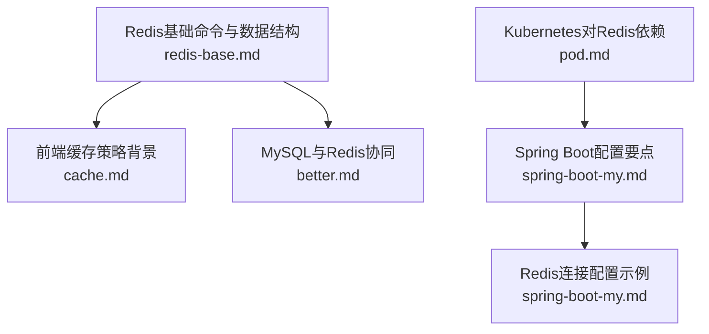
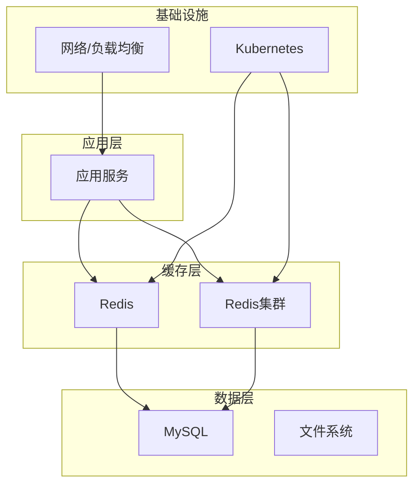
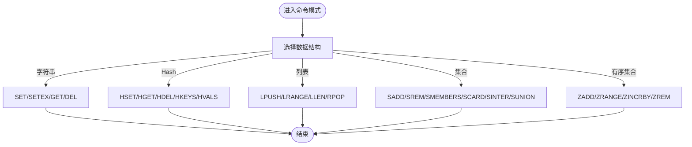
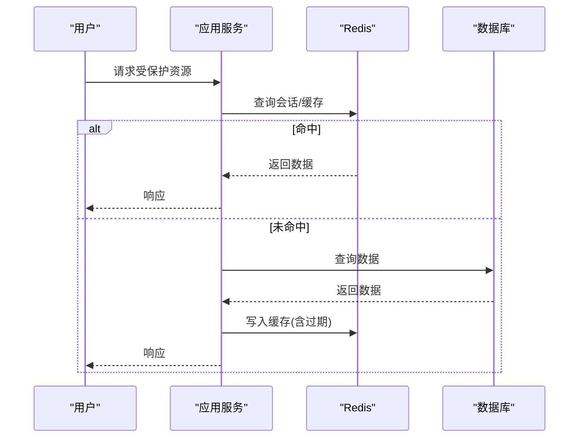
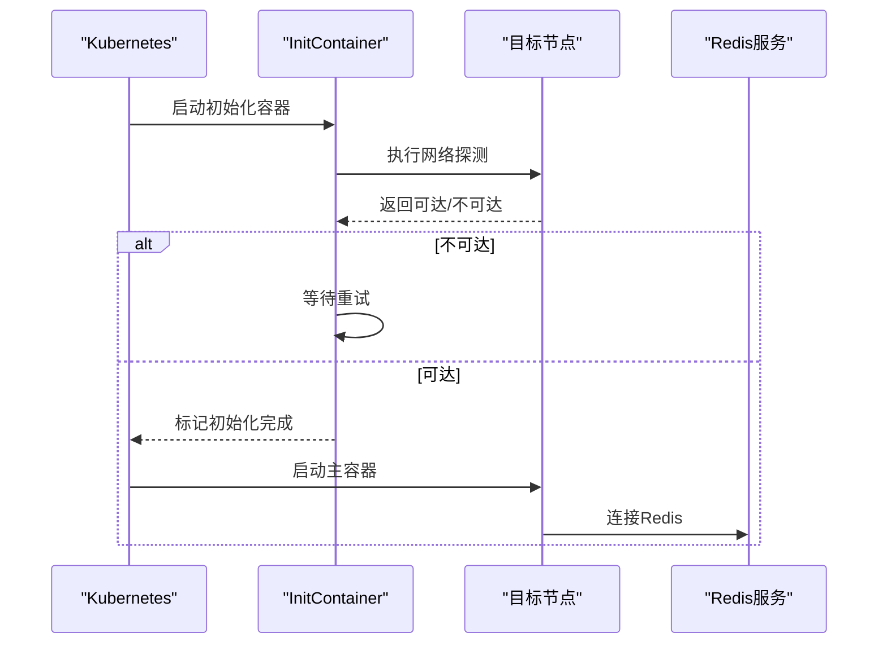
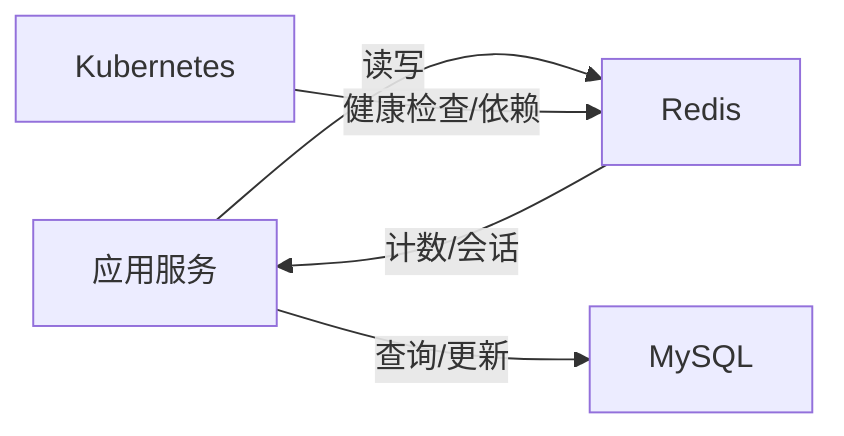

# Redis缓存

<cite>
**本文引用的文件**
- [redis-base.md](file://docs/backend-base/redis-base.md)
- [cache.md](file://docs/interview/JavaScript/cache.md)
- [better.md](file://docs/backend-base/mysql/better.md)
- [pod.md](file://docs/backend-base/k8s/pod.md)
- [spring-boot-my.md](file://docs/backend-base/spring/spring-boot-my.md)
</cite>

## 目录
1. [简介](#简介)
2. [项目结构](#项目结构)
3. [核心组件](#核心组件)
4. [架构概览](#架构概览)
5. [详细组件分析](#详细组件分析)
6. [依赖分析](#依赖分析)
7. [性能考虑](#性能考虑)
8. [故障排查指南](#故障排查指南)
9. [结论](#结论)
10. [附录](#附录)

## 简介
本技术文档围绕Redis缓存系统，系统性梳理其基础概念、数据结构、命令使用、持久化机制、集群配置与高并发应用场景（分布式锁、缓存策略、会话管理）。同时结合仓库中现有的Redis相关内容，给出运维实践建议、配置示例与使用案例，帮助缓存系统开发者建立完整的知识体系与实操能力。

## 项目结构
本仓库中与Redis相关的内容主要分布在以下位置：
- 后端基础：Redis基础命令与数据结构说明
- 面试资料：前端本地存储与缓存策略背景知识
- 数据库优化：MySQL与Redis协同的计数优化思路
- 容器编排：Kubernetes中对Redis的依赖与健康检查
- Spring生态：Spring Boot配置与Redis集成要点

图表来源
- [redis-base.md:1-89](file://docs/backend-base/redis-base.md#L1-L89)
- [cache.md:1-169](file://docs/interview/JavaScript/cache.md#L1-L169)
- [better.md:100-123](file://docs/backend-base/mysql/better.md#L100-L123)
- [pod.md:588-615](file://docs/backend-base/k8s/pod.md#L588-L615)
- [spring-boot-my.md:1053-1133](file://docs/backend-base/spring/spring-boot-my.md#L1053-L1133)

章节来源
- [redis-base.md:1-89](file://docs/backend-base/redis-base.md#L1-L89)
- [cache.md:1-169](file://docs/interview/JavaScript/cache.md#L1-L169)
- [better.md:100-123](file://docs/backend-base/mysql/better.md#L100-L123)
- [pod.md:588-615](file://docs/backend-base/k8s/pod.md#L588-L615)
- [spring-boot-my.md:1053-1133](file://docs/backend-base/spring/spring-boot-my.md#L1053-L1133)

## 核心组件
- 基础命令与数据结构：覆盖字符串、Hash、列表、集合、有序集合及通用命令，为缓存与会话管理提供基础能力。
- 缓存策略与会话管理：结合前端本地存储与后端Redis，形成多层缓存与会话持久化方案。
- 集群与持久化：提供Redis集群部署与持久化配置的实践指引。
- 高并发场景：分布式锁、缓存穿透/击穿/雪崩防护、热点数据治理等。
- 运维与故障排查：内存管理、性能优化、健康检查与故障定位。

章节来源
- [redis-base.md:5-89](file://docs/backend-base/redis-base.md#L5-L89)
- [cache.md:146-163](file://docs/interview/JavaScript/cache.md#L146-L163)
- [better.md:100-123](file://docs/backend-base/mysql/better.md#L100-L123)
- [pod.md:588-615](file://docs/backend-base/k8s/pod.md#L588-L615)
- [spring-boot-my.md:1053-1133](file://docs/backend-base/spring/spring-boot-my.md#L1053-L1133)

## 架构概览
Redis在高并发系统中的典型角色：
- 会话存储：将用户会话信息存入Redis，实现跨节点共享与快速读取。
- 缓存层：热点数据驻留内存，减少数据库压力。
- 分布式锁：基于Redis实现互斥锁，保障并发一致性。
- 计数与统计：结合MySQL的计数优化，使用Redis进行实时计数与聚合。

## 详细组件分析

### Redis基础命令与数据结构
- 字符串：键值对存储，支持过期时间设置，适用于简单缓存与计数。
- Hash：面向对象的键值存储，适合用户信息、商品详情等结构化数据。
- 列表：有序序列，支持两端操作，适用于消息队列、最近列表等。
- 集合：无序且去重，适合标签、共同兴趣等集合运算。
- 有序集合：带分数的集合，支持范围查询与排行榜。
- 通用命令：键管理、类型查询、存在性检查与删除。

图表来源
- [redis-base.md:7-88](file://docs/backend-base/redis-base.md#L7-L88)

章节来源
- [redis-base.md:5-89](file://docs/backend-base/redis-base.md#L5-L89)

### 缓存策略与会话管理
- 前端本地存储：Cookie、localStorage、sessionStorage、IndexedDB，分别适用于会话标记、长期缓存、一次性登录、大数据存储。
- 后端会话：将会话信息存入Redis，实现跨节点共享，提高扩展性与可用性。
- 缓存穿透/击穿/雪崩：通过布隆过滤器、互斥锁、过期时间随机化、热点预热等手段缓解。

图表来源
- [cache.md:146-163](file://docs/interview/JavaScript/cache.md#L146-L163)
- [redis-base.md:7-88](file://docs/backend-base/redis-base.md#L7-L88)

章节来源
- [cache.md:1-169](file://docs/interview/JavaScript/cache.md#L1-L169)
- [redis-base.md:5-89](file://docs/backend-base/redis-base.md#L5-L89)

### 集群配置与高可用
- 集群部署：多节点分片，提高吞吐与容量；主从复制，增强可用性。
- 健康检查：Kubernetes中通过liveness/readiness探针检测Redis健康状态，确保流量不被转发至不健康实例。
- 依赖管理：Pod启动前通过initContainer等待Redis可达，保证应用依赖满足。

图表来源
- [pod.md:588-615](file://docs/backend-base/k8s/pod.md#L588-L615)

章节来源
- [pod.md:588-615](file://docs/backend-base/k8s/pod.md#L588-L615)

### 持久化机制
- RDB快照：周期性生成数据快照，适合备份与灾难恢复。
- AOF追加：记录写操作日志，提供更高的数据安全性，可通过重写降低体积。
- 混合持久化：结合RDB与AOF优势，平衡性能与安全。

章节来源
- [redis-base.md:5-89](file://docs/backend-base/redis-base.md#L5-L89)

### 分布式锁
- 基于SET命令的NX/EX实现：原子性设置带过期的键，避免死锁。
- RedLock算法：在多节点环境下通过多数派达成共识，提升可靠性。
- 注意事项：锁粒度、过期时间、释放条件与幂等性。

章节来源
- [redis-base.md:7-88](file://docs/backend-base/redis-base.md#L7-L88)

### 与MySQL的协同优化
- 计数优化：对InnoDB的count操作进行缓存，使用Redis维护实时计数，降低数据库压力。
- 一致性：通过延迟双删、最终一致性策略保证缓存与数据库的一致性。

章节来源
- [better.md:100-123](file://docs/backend-base/mysql/better.md#L100-L123)

### Spring Boot中的Redis集成
- 配置文件：application.properties/yml中配置Redis连接信息。
- 多环境配置：通过引入多个配置文件实现环境隔离。
- 注入与使用：@Value注入配置，结合业务逻辑进行缓存读写。

章节来源
- [spring-boot-my.md:1053-1133](file://docs/backend-base/spring/spring-boot-my.md#L1053-L1133)

## 依赖分析
- 应用服务依赖Redis提供会话与缓存能力。
- Kubernetes通过探针与initContainer确保Redis可用性。
- MySQL与Redis协同，Redis承担高频读取与计数任务。
- Spring Boot负责将Redis配置注入到应用中。

图表来源
- [pod.md:588-615](file://docs/backend-base/k8s/pod.md#L588-L615)
- [better.md:100-123](file://docs/backend-base/mysql/better.md#L100-L123)
- [spring-boot-my.md:1053-1133](file://docs/backend-base/spring/spring-boot-my.md#L1053-L1133)

章节来源
- [pod.md:588-615](file://docs/backend-base/k8s/pod.md#L588-L615)
- [better.md:100-123](file://docs/backend-base/mysql/better.md#L100-L123)
- [spring-boot-my.md:1053-1133](file://docs/backend-base/spring/spring-boot-my.md#L1053-L1133)

## 性能考虑
- 内存管理：合理设置过期时间、淘汰策略，避免内存碎片与OOM。
- 命令优化：批量操作、Pipeline、避免大Key与热Key。
- 网络与连接：连接池配置、长连接、减少网络往返。
- 集群与分片：槽位分布均匀、热点迁移、读写分离。
- 缓存策略：多级缓存、预热、降级与熔断。

## 故障排查指南
- 健康检查：确认liveness/readiness探针配置正确，避免流量转发至不健康实例。
- 连接问题：检查Redis连接参数、网络连通性与防火墙策略。
- 性能瓶颈：监控内存使用率、命中率、慢查询日志与阻塞命令。
- 数据一致性：核对缓存更新策略与数据库同步流程。
- 集群异常：检查节点状态、槽位迁移与主从同步延迟。

章节来源
- [pod.md:736-779](file://docs/backend-base/k8s/pod.md#L736-L779)

## 结论
Redis作为高性能内存数据库，在缓存、会话、分布式锁与计数等场景中发挥关键作用。结合本仓库现有内容，建议在工程实践中：
- 明确数据结构与命令选择，构建稳定的基础能力。
- 设计合理的缓存策略与会话管理方案，兼顾性能与一致性。
- 通过集群与持久化提升可用性与安全性。
- 借助Kubernetes实现健康检查与依赖管理。
- 在Spring Boot中规范配置与注入，确保可维护性与可移植性。

## 附录
- 配置示例与使用案例：参考Spring Boot配置与命令手册，结合业务场景落地。
- 最佳实践清单：内存规划、过期策略、连接池、监控告警与应急预案。