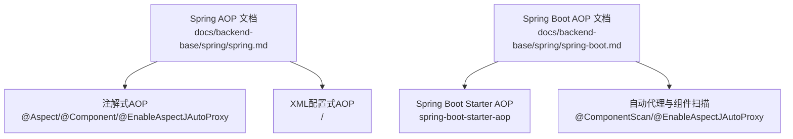
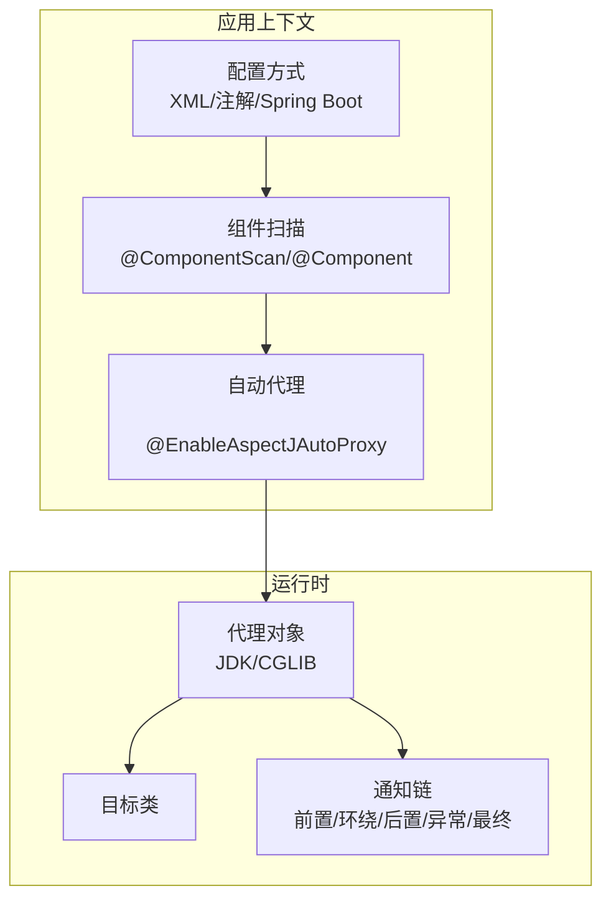
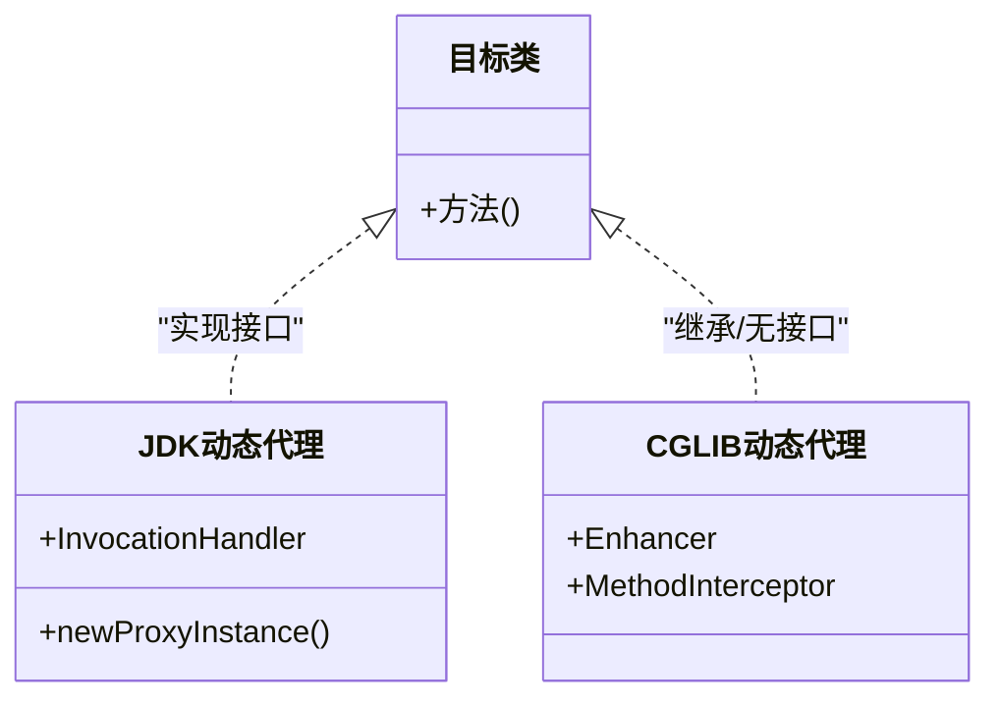
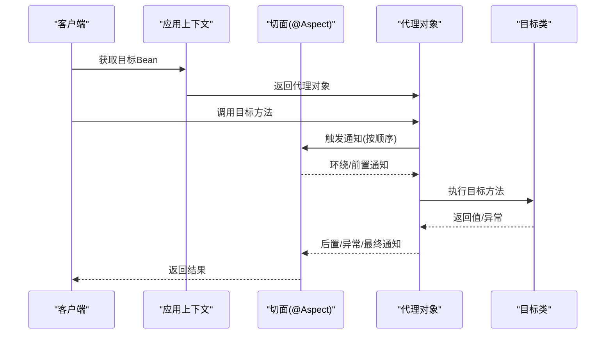
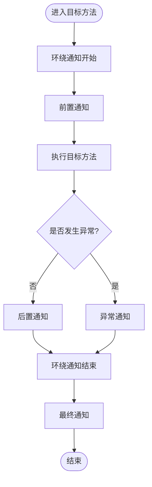
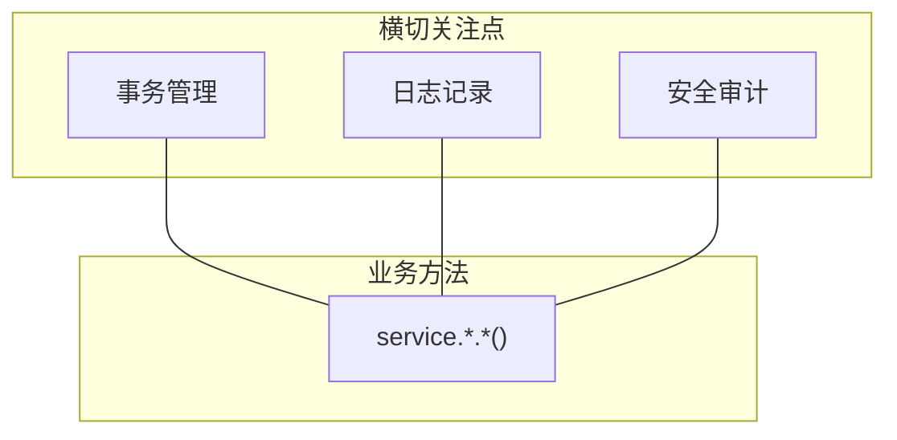
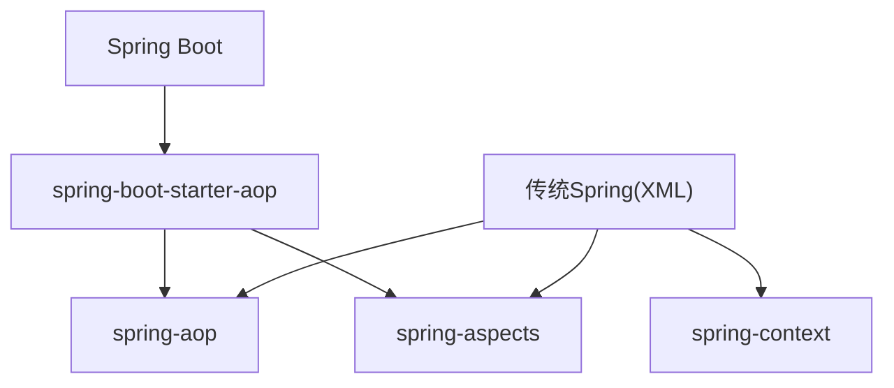

# AOP实现方式

<cite>
**本文引用的文件**
- [spring.md](file://docs/backend-base/spring/spring.md)
- [spring-boot.md](file://docs/backend-base/spring/spring-boot.md)
</cite>

## 目录
1. [引言](#引言)
2. [项目结构](#项目结构)
3. [核心组件](#核心组件)
4. [架构总览](#架构总览)
5. [详细组件分析](#详细组件分析)
6. [依赖关系分析](#依赖关系分析)
7. [性能考量](#性能考量)
8. [故障排查指南](#故障排查指南)
9. [结论](#结论)
10. [附录](#附录)

## 引言
本文件围绕Spring AOP的两种实现方式展开：基于代理的实现（JDK动态代理与CGLIB动态代理）与基于AspectJ的实现；并系统讲解注解驱动的AOP配置与XML配置方式，覆盖前置通知、后置通知、异常通知、最终通知、环绕通知等通知类型，详述切点表达式的编写规则与匹配模式，最后给出事务管理、日志记录、安全审计等典型应用场景与最佳实践。

## 项目结构
本仓库中与Spring AOP相关的知识主要集中在后端基础文档的Spring章节与Spring Boot章节中，分别覆盖传统XML配置、注解与@EnableAspectJAutoProxy、以及Spring Boot场景下的AOP使用方式。

**图表来源**
- [spring.md:8165-8265](file://docs/backend-base/spring/spring.md#L8165-L8265)
- [spring.md:8626-8705](file://docs/backend-base/spring/spring.md#L8626-L8705)
- [spring-boot.md:1897-1917](file://docs/backend-base/spring/spring-boot.md#L1897-L1917)
- [spring-boot.md:1918-2041](file://docs/backend-base/spring/spring-boot.md#L1918-L2041)

**章节来源**
- [spring.md:7986-8010](file://docs/backend-base/spring/spring.md#L7986-L8010)
- [spring.md:8165-8265](file://docs/backend-base/spring/spring.md#L8165-L8265)
- [spring.md:8626-8705](file://docs/backend-base/spring/spring.md#L8626-L8705)
- [spring-boot.md:1897-2041](file://docs/backend-base/spring/spring-boot.md#L1897-L2041)

## 核心组件
- 代理机制
  - JDK动态代理：基于接口的反射代理，适用于实现接口的目标类。
  - CGLIB动态代理：基于继承的字节码增强，适用于无接口或需强制代理类的场景。
- 切面与通知
  - 切面（Aspect）：切点（Pointcut）+ 通知（Advice）的组合。
  - 通知类型：前置、后置、异常、最终、环绕。
- 自动代理与组件扫描
  - XML：通过<aop:aspectj-autoproxy>开启AspectJ自动代理。
  - 注解：通过@EnableAspectJAutoProxy与@ComponentScan启用。
- 切点表达式
  - execution(...)语法，支持修饰符、返回值、全限定类名、方法名、参数列表、异常类型等元素的精确或通配匹配。

**章节来源**
- [spring.md:7990-7991](file://docs/backend-base/spring/spring.md#L7990-L7991)
- [spring.md:8065-8117](file://docs/backend-base/spring/spring.md#L8065-L8117)
- [spring.md:8165-8265](file://docs/backend-base/spring/spring.md#L8165-L8265)
- [spring.md:8600-8625](file://docs/backend-base/spring/spring.md#L8600-L8625)

## 架构总览
下图展示了Spring AOP在不同配置方式下的整体交互：目标类经由自动代理生成代理对象，代理对象在调用目标方法前后织入通知逻辑，最终形成横切关注点的统一处理。

**图表来源**
- [spring.md:8165-8265](file://docs/backend-base/spring/spring.md#L8165-L8265)
- [spring.md:8600-8625](file://docs/backend-base/spring/spring.md#L8600-L8625)
- [spring-boot.md:1918-2041](file://docs/backend-base/spring/spring-boot.md#L1918-L2041)

## 详细组件分析

### 基于代理的AOP实现
- JDK动态代理
  - 适用：目标类实现接口。
  - 特点：通过java.lang.reflect.Proxy生成代理类，回调InvocationHandler处理方法调用。
- CGLIB动态代理
  - 适用：目标类无接口或需代理类。
  - 特点：通过net.sf.cglib.proxy.Enhancer生成子类，回调MethodInterceptor拦截方法调用。

**图表来源**
- [spring.md:7629-7768](file://docs/backend-base/spring/spring.md#L7629-L7768)
- [spring.md:7827-7985](file://docs/backend-base/spring/spring.md#L7827-L7985)

**章节来源**
- [spring.md:7629-7768](file://docs/backend-base/spring/spring.md#L7629-L7768)
- [spring.md:7827-7985](file://docs/backend-base/spring/spring.md#L7827-L7985)

### 基于AspectJ的AOP实现
- 注解驱动（XML配置）
  - 步骤：定义目标类与切面类，纳入Spring管理；编写通知并在通知上添加切点表达式；在XML中启用自动代理。
  - 关键点：<aop:aspectj-autoproxy proxy-target-class="true/false">决定代理策略。
- 注解驱动（纯注解）
  - 使用@Configuration + @ComponentScan + @EnableAspectJAutoProxy替代XML配置。
- Spring Boot
  - 引入spring-boot-starter-aop，自动装配AOP相关组件；其余AOP编程与Spring一致。

**图表来源**
- [spring.md:8165-8265](file://docs/backend-base/spring/spring.md#L8165-L8265)
- [spring.md:8600-8625](file://docs/backend-base/spring/spring.md#L8600-L8625)
- [spring-boot.md:1918-2041](file://docs/backend-base/spring/spring-boot.md#L1918-L2041)

**章节来源**
- [spring.md:8165-8265](file://docs/backend-base/spring/spring.md#L8165-L8265)
- [spring.md:8600-8625](file://docs/backend-base/spring/spring.md#L8600-L8625)
- [spring-boot.md:1918-2041](file://docs/backend-base/spring/spring-boot.md#L1918-L2041)

### 通知类型与执行顺序
- 通知类型
  - 前置通知：@Before
  - 后置通知：@AfterReturning
  - 环绕通知：@Around
  - 异常通知：@AfterThrowing
  - 最终通知：@After
- 执行顺序
  - 环绕通知开始 -> 前置通知 -> 目标方法 -> 后置通知 -> 环绕通知结束
  - 若发生异常：异常通知执行，随后执行最终通知
  - 未发生异常：最终通知仍执行，但后置与环绕结束部分不执行

**图表来源**
- [spring.md:8288-8396](file://docs/backend-base/spring/spring.md#L8288-L8396)

**章节来源**
- [spring.md:8288-8396](file://docs/backend-base/spring/spring.md#L8288-L8396)

### 切点表达式与匹配模式
- 语法
  - execution([访问修饰符] 返回值类型 [全限定类名.]方法名(形式参数列表) [throws 异常])
- 常见匹配
  - 任意公共方法：execution(public * *(..))
  - 包及其子包：execution(* com.powernode.mall..*(..))
  - 任意方法：execution(* *(..))
  - 方法名前缀：execution(* set*(..))

**章节来源**
- [spring.md:8065-8117](file://docs/backend-base/spring/spring.md#L8065-L8117)

### XML配置方式（了解）
- 步骤
  - 定义目标类与切面类（普通Java类）
  - 在XML中声明Bean并配置<aop:config>，定义<aop:pointcut>与<aop:aspect>，绑定通知方法
- 典型配置
  - <aop:config>内嵌<aop:pointcut>与<aop:aspect>，通过method与pointcut-ref关联

**章节来源**
- [spring.md:8626-8705](file://docs/backend-base/spring/spring.md#L8626-L8705)

### 实际应用场景与最佳实践
- 事务管理
  - 使用环绕通知在目标方法前后开启/提交/回滚事务，覆盖service包下的所有方法。
- 日志记录
  - 使用前置通知记录方法签名与参数，便于审计与排障。
- 安全日志
  - 使用切点组合匹配save/delete/modify等危险操作，统一记录操作员信息。

**图表来源**
- [spring.md:8707-8823](file://docs/backend-base/spring/spring.md#L8707-L8823)
- [spring.md:8940-9037](file://docs/backend-base/spring/spring.md#L8940-L9037)

**章节来源**
- [spring.md:8707-8823](file://docs/backend-base/spring/spring.md#L8707-L8823)
- [spring.md:8940-9037](file://docs/backend-base/spring/spring.md#L8940-L9037)

## 依赖关系分析
- 传统Spring（XML）
  - 需要spring-context、spring-aop、spring-aspects依赖，并在XML中声明aop命名空间与自动代理。
- 注解方式
  - 使用@EnableAspectJAutoProxy与@ComponentScan替代XML配置。
- Spring Boot
  - 引入spring-boot-starter-aop，自动装配AOP相关组件。

**图表来源**
- [spring.md:8129-8150](file://docs/backend-base/spring/spring.md#L8129-L8150)
- [spring-boot.md:1901-1917](file://docs/backend-base/spring/spring-boot.md#L1901-L1917)

**章节来源**
- [spring.md:8129-8150](file://docs/backend-base/spring/spring.md#L8129-L8150)
- [spring-boot.md:1901-1917](file://docs/backend-base/spring/spring-boot.md#L1901-L1917)

## 性能考量
- 代理策略选择
  - 有接口：默认JDK动态代理，开销较低。
  - 无接口：CGLIB动态代理，字节码增强带来额外开销，但功能更强。
- 通知数量与顺序
  - 多个切面时，合理使用@Order控制优先级，避免通知链过长导致性能下降。
- 切点表达式复杂度
  - 过于宽泛的切点可能导致不必要的通知触发，应尽量精确匹配目标方法。

## 故障排查指南
- 未生效的自动代理
  - 检查XML中是否启用<aop:aspectj-autoproxy>，或注解方式是否添加@EnableAspectJAutoProxy与@ComponentScan。
- 代理对象类型不符
  - 当proxy-target-class="true"时强制CGLIB；若目标类无接口，务必使用CGLIB。
- 通知顺序异常
  - 确认@Order数值与期望顺序一致；检查是否存在多个切面影响执行序列。
- 切点表达式不匹配
  - 核对包路径、类名、方法名、参数列表与异常类型是否与目标方法一致。

**章节来源**
- [spring.md:8263-8265](file://docs/backend-base/spring/spring.md#L8263-L8265)
- [spring.md:8398-8491](file://docs/backend-base/spring/spring.md#L8398-L8491)
- [spring.md:8065-8117](file://docs/backend-base/spring/spring.md#L8065-L8117)

## 结论
Spring AOP通过JDK/CGLIB动态代理与AspectJ的结合，实现了强大的横切能力。在实际工程中，推荐优先使用注解驱动的@EnableAspectJAutoProxy与@ComponentScan简化配置；在Spring Boot环境下引入spring-boot-starter-aop可获得自动装配的便利。针对事务、日志、安全等横切关注点，应通过精确的切点表达式与合理的通知顺序设计，确保功能正确与性能稳定。

## 附录
- 示例参考路径
  - 注解式AOP（XML配置）：[spring.md:8165-8265](file://docs/backend-base/spring/spring.md#L8165-L8265)
  - 注解式AOP（纯注解）：[spring.md:8600-8625](file://docs/backend-base/spring/spring.md#L8600-L8625)
  - Spring Boot AOP：[spring-boot.md:1918-2041](file://docs/backend-base/spring/spring-boot.md#L1918-L2041)
  - XML配置式AOP：[spring.md:8626-8705](file://docs/backend-base/spring/spring.md#L8626-L8705)
  - 切点表达式：[spring.md:8065-8117](file://docs/backend-base/spring/spring.md#L8065-L8117)
  - 通知类型与顺序：[spring.md:8288-8396](file://docs/backend-base/spring/spring.md#L8288-L8396)
  - 事务管理案例：[spring.md:8707-8823](file://docs/backend-base/spring/spring.md#L8707-L8823)
  - 安全日志案例：[spring.md:8940-9037](file://docs/backend-base/spring/spring.md#L8940-L9037)