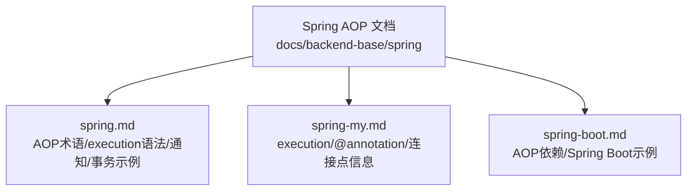
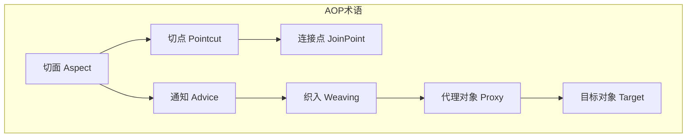
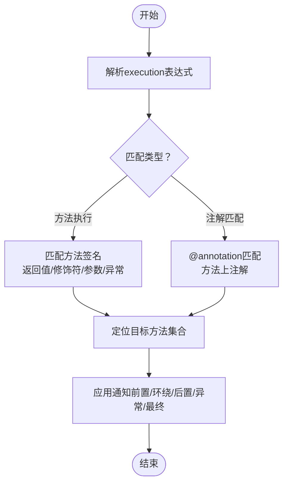
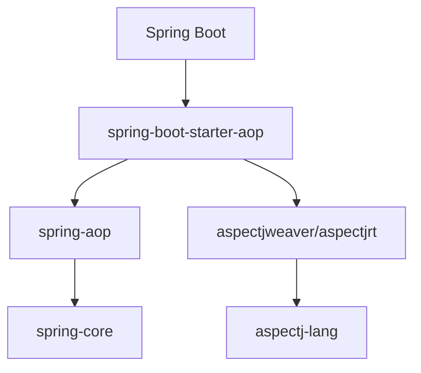

# 切点表达式详解

<cite>
**本文引用的文件**
- [spring.md](file://docs/backend-base/spring/spring.md)
- [spring-my.md](file://docs/backend-base/spring/spring-my.md)
- [spring-boot.md](file://docs/backend-base/spring/spring-boot.md)
</cite>

## 目录
1. [引言](#引言)
2. [项目结构](#项目结构)
3. [核心组件](#核心组件)
4. [架构总览](#架构总览)
5. [详细组件分析](#详细组件分析)
6. [依赖分析](#依赖分析)
7. [性能考虑](#性能考虑)
8. [故障排查指南](#故障排查指南)
9. [结论](#结论)
10. [附录](#附录)

## 引言
本文件围绕Spring AOP的切点表达式展开，系统梳理execution、within、@annotation等表达式类型，给出语法要点、匹配规则、常见组合与最佳实践，并提供复杂场景的编写思路与调试排障建议。内容来源于仓库中的Spring相关文档，确保与实际实现一致。

## 项目结构
本仓库中与Spring AOP切点表达式直接相关的文档位于docs/backend-base/spring目录，包含：
- spring.md：AOP术语、execution语法、通知类型、切点复用、事务示例等
- spring-my.md：execution与@annotation表达式说明、连接点信息获取
- spring-boot.md：Spring Boot中AOP依赖引入、前置通知示例、日志记录

**图表来源**
- [spring.md](file://docs/backend-base/spring/spring.md)
- [spring-my.md](file://docs/backend-base/spring/spring-my.md)
- [spring-boot.md](file://docs/backend-base/spring/spring-boot.md)

**章节来源**
- [spring.md](file://docs/backend-base/spring/spring.md)
- [spring-my.md](file://docs/backend-base/spring/spring-my.md)
- [spring-boot.md](file://docs/backend-base/spring/spring-boot.md)

## 核心组件
- 切点表达式（Pointcut Expression）
  - execution：匹配方法执行
  - @annotation：匹配带有指定注解的方法
- 通知（Advice）
  - 前置、后置、环绕、异常、最终通知
- 切面（Aspect）
  - 切点 + 通知的组合
- 连接点（JoinPoint）
  - 可以织入切面的位置（方法执行前后、异常抛出等）

**章节来源**
- [spring.md](file://docs/backend-base/spring/spring.md)
- [spring-my.md](file://docs/backend-base/spring/spring-my.md)

## 架构总览
下图展示AOP术语与切点表达式在Spring中的位置与关系，帮助理解“在哪里匹配、对什么方法织入、如何织入”。

**图表来源**
- [spring.md](file://docs/backend-base/spring/spring.md)

## 详细组件分析

### execution表达式
- 语法结构
  - execution([访问修饰符] 返回值类型 [全限定类名]方法名(形式参数列表) [异常])
- 关键要素
  - 访问修饰符：可选；省略表示匹配所有访问级别
  - 返回值类型：必填；* 表示任意返回类型
  - 全限定类名：可选；.. 表示当前包及其子包
  - 方法名：必填；* 表示任意方法；set* 表示以set开头的方法
  - 形参列表：必填；() 无参；(..) 任意参数；(*) 一个参数；(*, String) 第一个任意、第二个String
  - 异常：可选；省略表示任意异常类型
- 常见示例
  - 匹配某包下所有public方法
  - 匹配某包及其子包的所有方法
  - 匹配任意方法
- 性能与最佳实践
  - 尽量缩小匹配范围（包、类、方法名、参数），避免通配符过多
  - 使用@Pointcut抽取公共表达式，减少重复与维护成本
  - 避免在高频路径上使用过于复杂的正则或深层递归匹配

**图表来源**
- [spring.md](file://docs/backend-base/spring/spring.md)
- [spring-my.md](file://docs/backend-base/spring/spring-my.md)

**章节来源**
- [spring.md](file://docs/backend-base/spring/spring.md)
- [spring-my.md](file://docs/backend-base/spring/spring-my.md)

### within表达式
- 作用：匹配某个包或类内的所有方法
- 适用场景：按包或类维度批量织入，常与execution组合使用
- 注意：within通常与execution配合，形成“包/类范围 + 方法签名”的复合匹配

**章节来源**
- [spring.md](file://docs/backend-base/spring/spring.md)

### @annotation表达式
- 作用：匹配带有指定注解的方法
- 语法要点
  - @annotation(包名.注解名)
  - 可用于方法级注解匹配
- 常见用途
  - 基于注解的统一处理（如日志、鉴权、限流）
  - 与execution组合实现“注解 + 方法签名”的双重过滤

**章节来源**
- [spring-my.md](file://docs/backend-base/spring/spring-my.md)

### 切点函数与编写规则
- 访问修饰符
  - 可选；省略表示匹配所有访问级别
- 返回类型
  - 必填；* 表示任意返回类型
- 包名与类名
  - 可选；.. 表示当前包及其子包
- 方法名
  - 必填；* 表示任意方法；set* 表示以set开头的方法
- 参数匹配
  - 必填；() 无参；(..) 任意参数；(*) 一个参数；(*, String) 第一个任意、第二个String
- 异常
  - 可选；省略表示任意异常类型

**章节来源**
- [spring.md](file://docs/backend-base/spring/spring.md)

### 切点表达式示例与场景
- 包匹配
  - 匹配某包下所有方法
  - 匹配某包及其子包的所有方法
- 类匹配
  - 匹配某类的所有方法
- 方法匹配
  - 匹配以set开头的方法
  - 匹配任意方法
- 参数匹配
  - 无参方法
  - 任意参数
  - 单个参数
  - 多参数组合（如第一个任意、第二个String）

**章节来源**
- [spring.md](file://docs/backend-base/spring/spring.md)

### 复杂场景与组合
- 多条件组合
  - 使用 &&、||、! 组合多个表达式
  - 建议先拆分到@Pointcut，再在通知中组合引用
- 正则与通配
  - 优先使用包名、类名、方法名前缀/后缀通配，避免过度正则
  - 在高频路径上谨慎使用正则，防止性能退化

**章节来源**
- [spring-my.md](file://docs/backend-base/spring/spring-my.md)
- [spring.md](file://docs/backend-base/spring/spring.md)

### Spring Boot中的AOP示例
- 依赖引入
  - 引入spring-boot-starter-aop，自动引入AOP与AspectJ依赖
- 示例
  - 前置通知：在service包下任意类的任意方法执行前记录日志
  - 切点抽取：使用@Pointcut抽取公共表达式，减少重复

**章节来源**
- [spring-boot.md](file://docs/backend-base/spring/spring-boot.md)

## 依赖分析
- Spring AOP与AspectJ
  - Spring AOP底层使用JDK动态代理与CGLIB动态代理
  - 结合AspectJ可获得更强大的表达式与注解能力
- Spring Boot中的AOP
  - 通过spring-boot-starter-aop引入AOP与AspectJ依赖

**图表来源**
- [spring-boot.md](file://docs/backend-base/spring/spring-boot.md)

**章节来源**
- [spring-boot.md](file://docs/backend-base/spring/spring-boot.md)

## 性能考虑
- 切点表达式优化
  - 缩小匹配范围：优先使用包名、类名、方法名前缀/后缀通配
  - 避免在高频路径上使用(…)与深层递归匹配
  - 使用@Pointcut抽取公共表达式，减少重复解析
- 通知顺序与开销
  - 多个切面时，合理使用@Order控制执行顺序
  - 环绕通知开销较大，仅在必要时使用
- 代理策略
  - 接口优先使用JDK动态代理；无接口使用CGLIB
  - 明确代理策略有助于减少不必要的字节码增强

**章节来源**
- [spring.md](file://docs/backend-base/spring/spring.md)

## 故障排查指南
- 常见问题
  - 切点未命中：检查包名、类名、方法名、参数是否与目标一致
  - 通知未执行：确认通知类型与异常处理分支（异常通知在抛出异常时触发）
  - 多切面顺序：使用@Order调整优先级
- 调试建议
  - 在通知中打印连接点信息（目标类、方法名、参数）
  - 逐步缩小表达式范围，先粗后细
  - 使用最小可复现样例验证表达式组合

**章节来源**
- [spring.md](file://docs/backend-base/spring/spring.md)
- [spring-my.md](file://docs/backend-base/spring/spring-my.md)

## 结论
切点表达式是Spring AOP的“定位器”，精准的表达式能显著提升横切关注点的织入效率与可维护性。建议遵循“先缩小范围、再细化匹配、最后组合条件”的策略，并通过@Pointcut抽取公共表达式，结合通知顺序与代理策略，实现高性能、易维护的AOP应用。

## 附录
- 相关文档片段路径
  - execution语法与示例：[spring.md](file://docs/backend-base/spring/spring.md)
  - @annotation与连接点信息：[spring-my.md](file://docs/backend-base/spring/spring-my.md)
  - Spring Boot AOP依赖与示例：[spring-boot.md](file://docs/backend-base/spring/spring-boot.md)