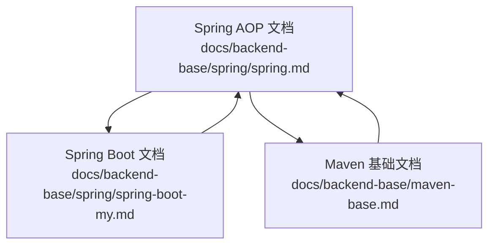
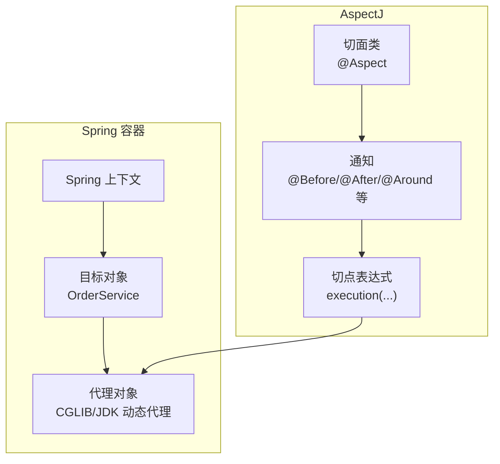
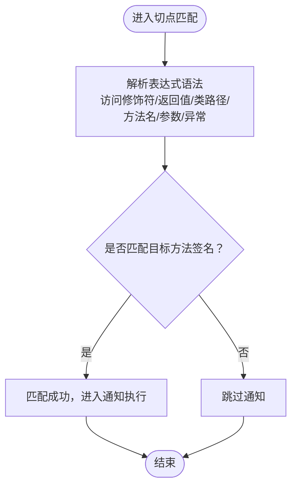
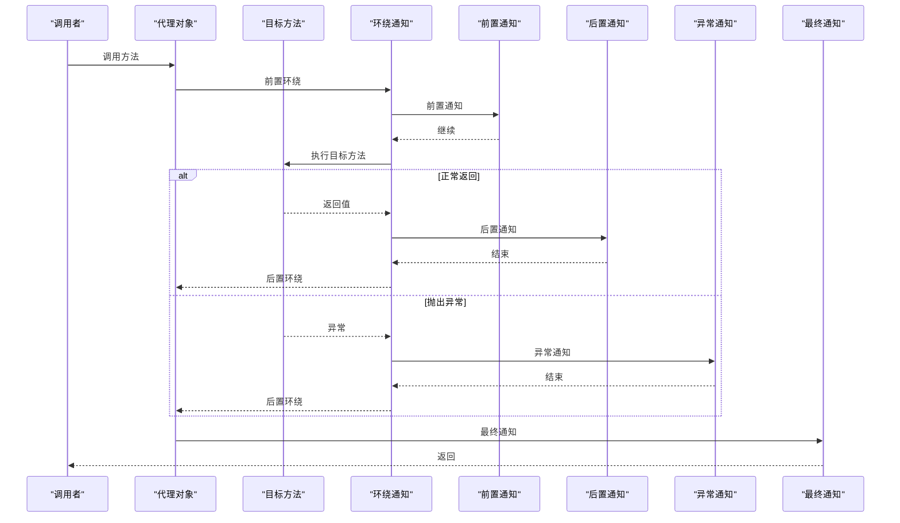
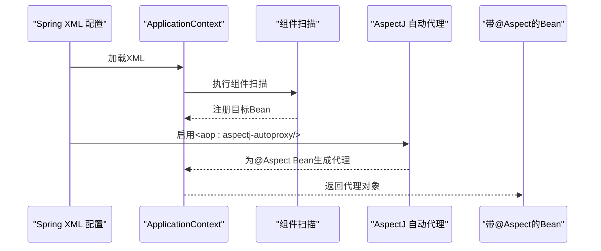
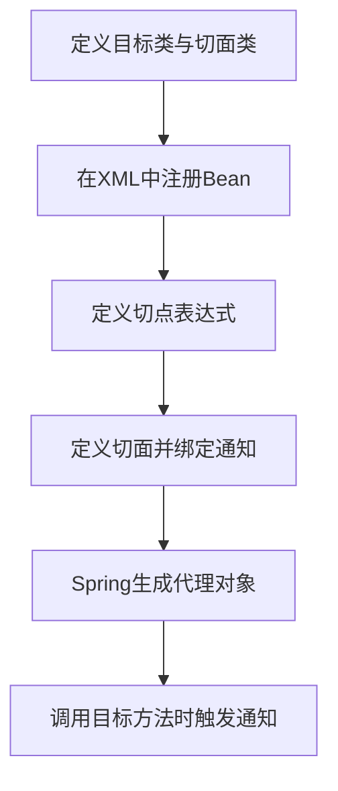
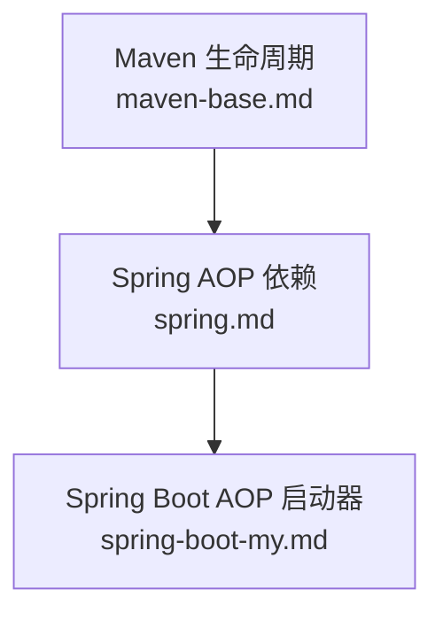

# 基于AspectJ的AOP实现

<cite>
**本文档引用的文件**
- [spring.md](file://docs/backend-base/spring/spring.md)
- [spring-boot-my.md](file://docs/backend-base/spring/spring-boot-my.md)
- [maven-base.md](file://docs/backend-base/maven-base.md)
</cite>

## 目录
1. [引言](#引言)
2. [项目结构](#项目结构)
3. [核心组件](#核心组件)
4. [架构总览](#架构总览)
5. [详细组件分析](#详细组件分析)
6. [依赖分析](#依赖分析)
7. [性能考虑](#性能考虑)
8. [故障排除指南](#故障排除指南)
9. [结论](#结论)
10. [附录](#附录)

## 引言
本技术文档围绕基于AspectJ的Spring AOP实现展开，系统讲解AspectJ的编译时织入与运行时织入机制、ajc编译器的使用与配置要点、@Aspect注解的高级用法（复杂切点表达式、参数绑定与返回值处理）、XML配置示例（Spring中集成AspectJ）、AspectJ与Spring AOP的功能差异与性能对比、适用场景，以及在实际项目中的应用案例（分布式事务、缓存管理、监控统计等）。文档同时提供配置指南与故障排除方法，帮助开发者快速落地。

## 项目结构
本仓库以文档形式呈现了大量Spring与AOP相关的知识，特别是AspectJ在Spring中的使用范式。核心内容分布在以下文件中：
- docs/backend-base/spring/spring.md：涵盖AOP术语、切点表达式、基于注解与XML的AspectJ集成、通知类型与执行顺序、实际案例（事务、安全日志）等。
- docs/backend-base/spring/spring-boot-my.md：介绍Spring Boot常用注解与配置方式，便于在Spring Boot环境中集成AOP。
- docs/backend-base/maven-base.md：提供Maven生命周期与插件的基础知识，为理解编译时织入与构建流程提供背景。

**图表来源**
- [spring.md](file://docs/backend-base/spring/spring.md)
- [spring-boot-my.md](file://docs/backend-base/spring/spring-boot-my.md)
- [maven-base.md](file://docs/backend-base/maven-base.md)

**章节来源**
- [spring.md](file://docs/backend-base/spring/spring.md)
- [spring-boot-my.md](file://docs/backend-base/spring/spring-boot-my.md)
- [maven-base.md](file://docs/backend-base/maven-base.md)

## 核心组件
- 切点表达式（Pointcut Expression）：定义通知切入的目标方法集合，语法涵盖访问修饰符、返回值类型、类路径、方法名、参数列表与异常类型。
- 通知（Advice）：在目标方法执行前后、异常或最终阶段执行的增强逻辑，包括前置、后置、环绕、异常、最终通知。
- 切面（Aspect）：切点与通知的组合，承载横切关注点。
- 织入（Weaving）：将通知应用到目标对象的过程，分为编译时织入与运行时织入。
- 自动代理（AspectJ Auto Proxy）：通过XML或注解启用AspectJ自动代理，生成目标对象的代理类。

**章节来源**
- [spring.md](file://docs/backend-base/spring/spring.md)

## 架构总览
下图展示了基于AspectJ的Spring AOP在Spring容器中的典型工作流：目标对象被纳入Spring管理，通过AspectJ自动代理生成代理对象，代理对象在调用目标方法前后织入通知。

**图表来源**
- [spring.md](file://docs/backend-base/spring/spring.md)

## 详细组件分析

### 切点表达式与高级用法
- 语法结构：访问修饰符（可选）、返回值类型、类路径（可选）、方法名、参数列表、异常类型（可选）。
- 形式参数列表规则：()无参、(..)任意参数、(*)单参、(*, String)复合条件。
- 常见示例：限定包与子包、通配方法名、任意返回值等。
- 复杂表达式：支持逻辑运算符组合，满足多条件匹配。

**图表来源**
- [spring.md](file://docs/backend-base/spring/spring.md)

**章节来源**
- [spring.md](file://docs/backend-base/spring/spring.md)

### 通知类型与执行顺序
- 通知类型：前置、后置、环绕、异常、最终通知。
- 执行顺序：环绕通知在目标方法前后分别执行；前置在目标方法前；后置在目标方法后；异常在抛出异常时；最终在finally块中。
- 优先级：可通过@Order控制多个切面的执行顺序。

**图表来源**
- [spring.md](file://docs/backend-base/spring/spring.md)

**章节来源**
- [spring.md](file://docs/backend-base/spring/spring.md)

### 基于注解的AspectJ集成（XML启用自动代理）
- 依赖引入：spring-context、spring-aop、spring-aspects。
- XML命名空间：context与aop。
- 启用自动代理：<aop:aspectj-autoproxy proxy-target-class="true/false"/>。
- 代理策略：proxy-target-class="true"使用CGLIB，false使用JDK动态代理；若无接口，Spring会自动选择CGLIB。

**图表来源**
- [spring.md](file://docs/backend-base/spring/spring.md)

**章节来源**
- [spring.md](file://docs/backend-base/spring/spring.md)

### 基于XML配置的AOP（了解）
- 目标类与切面类：目标类纳入Spring管理，切面类实现通知逻辑。
- XML配置：定义bean、pointcut、aspect与around等标签，将通知与切点绑定。

**图表来源**
- [spring.md](file://docs/backend-base/spring/spring.md)

**章节来源**
- [spring.md](file://docs/backend-base/spring/spring.md)

### Spring Boot中的AOP集成
- 依赖：spring-boot-starter-aop引入AOP与AspectJ依赖。
- 自动配置：AopAutoConfiguration提供ClassProxyingConfiguration，内部包含AutoProxyCreator，实现AspectJ自动代理。
- 组件扫描：Spring Boot通过@SpringBootApplication自动扫描组件，无需额外XML配置。

**章节来源**
- [spring-boot-my.md](file://docs/backend-base/spring/spring-boot-my.md)

### 实际项目应用案例

#### 分布式事务
- 场景：跨多个服务或数据源的业务流程，需要保证原子性与一致性。
- 方案：使用环绕通知包装业务方法，统一开启/提交/回滚事务，避免在各业务类中重复编写事务样板代码。
- 优势：集中管理事务边界，降低重复代码与维护成本。

**章节来源**
- [spring.md](file://docs/backend-base/spring/spring.md)

#### 缓存管理
- 场景：热点数据频繁读取，需要提升响应速度。
- 方案：使用环绕通知在方法调用前后进行缓存命中/失效/更新，结合缓存注解（如@Cacheable/@CacheEvict）实现声明式缓存。
- 注意：确保缓存Key与参数绑定一致，避免缓存穿透与雪崩。

**章节来源**
- [spring.md](file://docs/backend-base/spring/spring.md)

#### 监控统计
- 场景：对关键业务方法的耗时、成功率、异常率进行统计。
- 方案：使用环绕通知记录开始时间、结束时间与异常信息，输出到指标系统或日志平台。
- 建议：区分慢调用阈值与错误阈值，按业务维度聚合统计。

**章节来源**
- [spring.md](file://docs/backend-base/spring/spring.md)

## 依赖分析
- Maven生命周期与插件：理解构建阶段与插件目标有助于把握编译时织入的时机与流程。
- Spring AOP依赖：spring-context、spring-aop、spring-aspects。
- Spring Boot AOP启动器：spring-boot-starter-aop，自动引入AOP与AspectJ依赖。

**图表来源**
- [maven-base.md](file://docs/backend-base/maven-base.md)
- [spring.md](file://docs/backend-base/spring/spring.md)
- [spring-boot-my.md](file://docs/backend-base/spring/spring-boot-my.md)

**章节来源**
- [maven-base.md](file://docs/backend-base/maven-base.md)
- [spring.md](file://docs/backend-base/spring/spring.md)
- [spring-boot-my.md](file://docs/backend-base/spring/spring-boot-my.md)

## 性能考虑
- 代理策略：proxy-target-class="true"使用CGLIB，适用于无接口场景；proxy-target-class="false"使用JDK动态代理，接口场景更高效。
- 通知数量与顺序：过多通知与复杂切点表达式会增加方法调用开销，应合理拆分与排序。
- 环绕通知成本：环绕通知在目标方法前后均执行，应避免在通知中进行阻塞操作。
- 缓存与监控：缓存命中率与监控采样频率直接影响性能，需按业务特征调优。

[本节为通用指导，不直接分析具体文件]

## 故障排除指南
- 通知未生效
  - 检查是否正确启用AspectJ自动代理（XML或注解）。
  - 确认目标类与切面类均被Spring管理（@Component等）。
  - 核对切点表达式是否覆盖目标方法签名。
- 代理类型不符
  - 若无接口，Spring会自动选择CGLIB；如需强制JDK代理，检查proxy-target-class配置。
- 通知顺序异常
  - 使用@Order控制多个切面的优先级，数值越小优先级越高。
- 性能问题
  - 减少环绕通知中的同步阻塞操作，优化切点表达式复杂度。
  - 对高频方法进行缓存与限流，避免过度监控统计。

**章节来源**
- [spring.md](file://docs/backend-base/spring/spring.md)

## 结论
基于AspectJ的Spring AOP提供了强大的横切能力，通过编译时与运行时织入机制，结合灵活的切点表达式与通知体系，能够有效复用业务无关的横切逻辑。在Spring Boot环境下，AOP集成更为简洁；在传统Spring XML配置中，仍可通过自动代理实现AspectJ织入。开发者应根据业务场景选择合适的代理策略与通知类型，并通过合理的切点设计与顺序控制，平衡功能完整性与性能表现。

[本节为总结性内容，不直接分析具体文件]

## 附录

### AspectJ与Spring AOP的区别与对比
- 功能差异
  - Spring AOP：基于动态代理，仅支持方法级别的连接点，适合简单横切场景。
  - AspectJ：支持编译时/运行时织入，连接点更丰富，支持字段、构造器、静态初始化等，适合复杂横切场景。
- 性能对比
  - Spring AOP：代理开销较小，适合接口场景；无代理开销时性能更优。
  - AspectJ：编译时织入减少运行时开销，但编译成本更高；运行时织入与Spring AOP相近。
- 适用场景
  - Spring AOP：常规业务增强、简单事务与日志。
  - AspectJ：复杂横切、跨模块共享、强一致性的横切逻辑。

**章节来源**
- [spring.md](file://docs/backend-base/spring/spring.md)

### ajc编译器与配置要点（概念性说明）
- ajc编译器：AspectJ的Java编译器，支持编译时织入，将通知代码嵌入到目标类字节码中。
- 配置要点：在Maven中通过插件绑定到编译阶段，确保在目标类生成字节码前完成织入；在IDE中启用注解处理以支持IDE内织入提示。
- 与Spring集成：Spring通过AspectJ自动代理在运行时织入，无需显式使用ajc。

[本节为概念性说明，不直接分析具体文件]