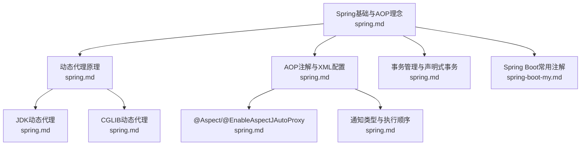
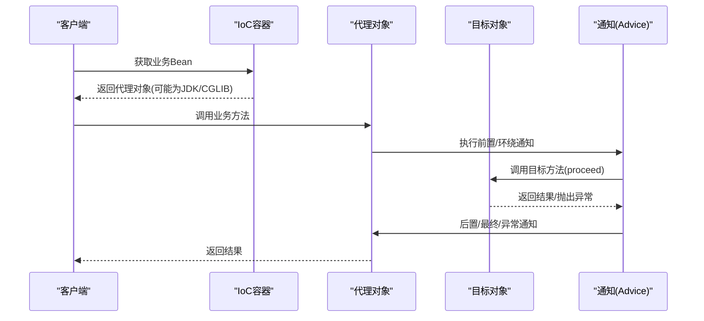
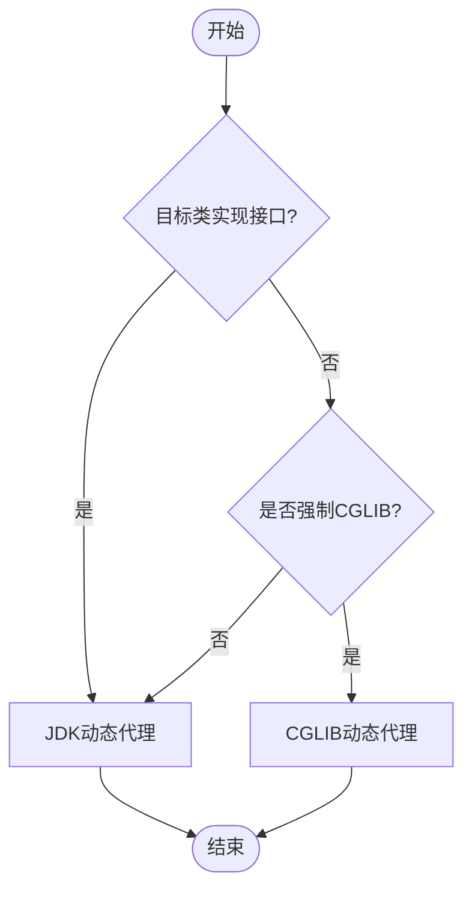
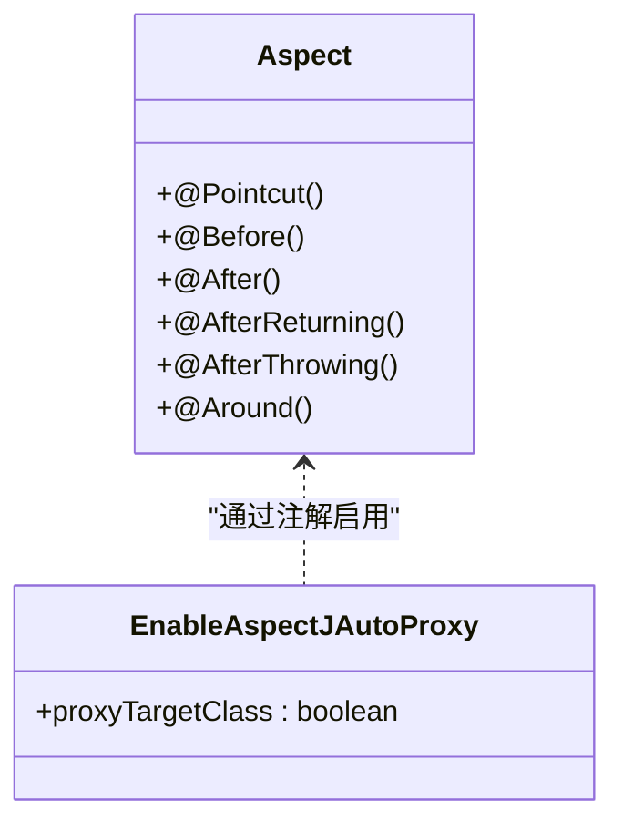
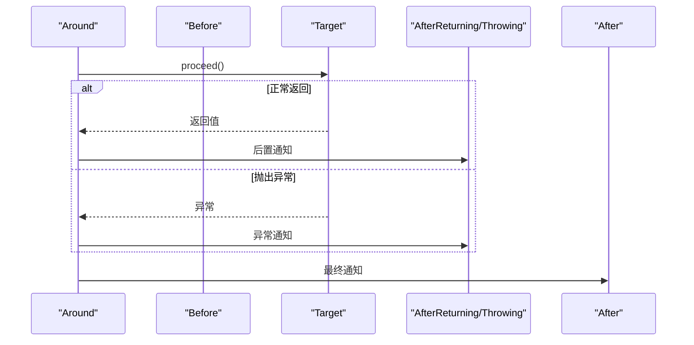
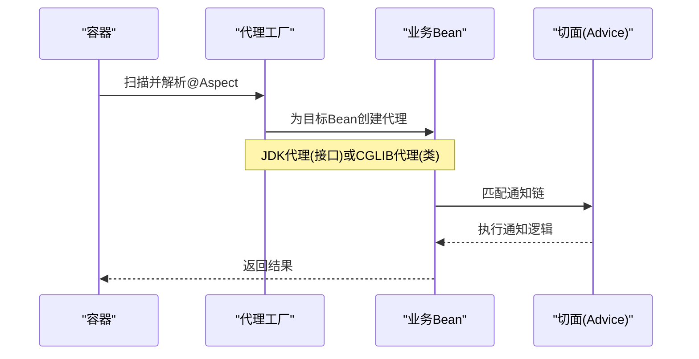
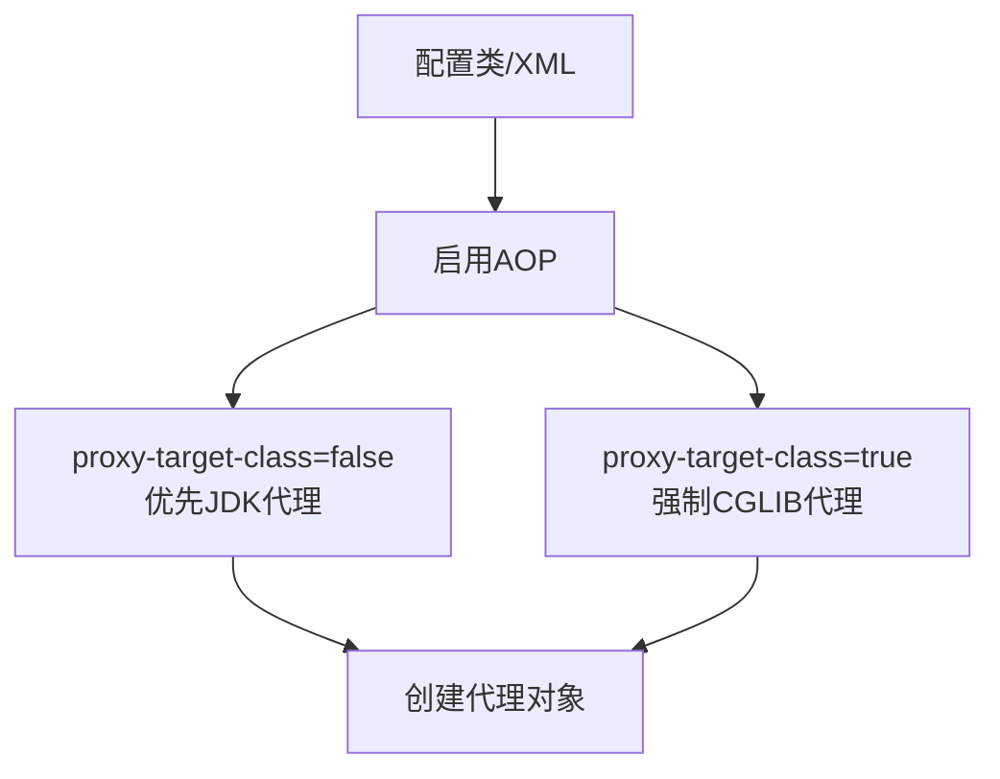
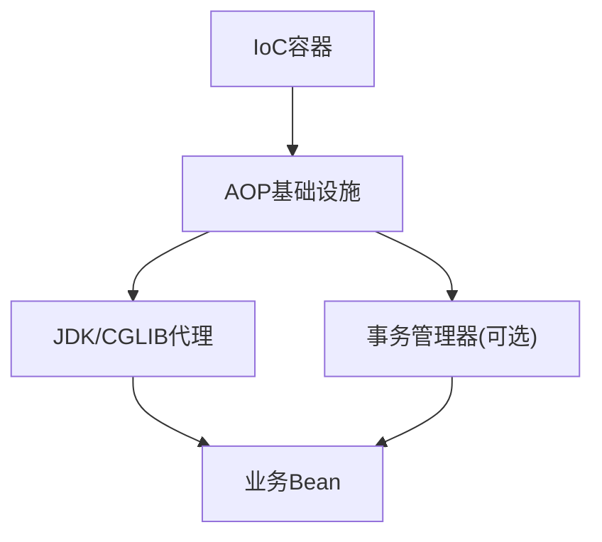

# 基于代理的AOP实现

<cite>
**本文档引用的文件**
- [spring.md](file://docs/backend-base/spring/spring.md)
- [spring-my.md](file://docs/backend-base/spring/spring-my.md)
- [spring-boot-my.md](file://docs/backend-base/spring/spring-boot-my.md)
- [spring-mvc.md](file://docs/backend-base/spring/spring-mvc.md)
</cite>

## 目录
1. [引言](#引言)
2. [项目结构](#项目结构)
3. [核心组件](#核心组件)
4. [架构总览](#架构总览)
5. [详细组件分析](#详细组件分析)
6. [依赖分析](#依赖分析)
7. [性能考量](#性能考量)
8. [故障排查指南](#故障排查指南)
9. [结论](#结论)
10. [附录](#附录)

## 引言
本技术文档围绕基于代理的Spring AOP实现展开，系统阐述动态代理机制（JDK动态代理与CGLIB代理）、@Aspect注解的使用（切点定义、通知类型与执行顺序）、@EnableAspectJAutoProxy启用AOP的方式、代理对象创建与方法拦截机制、性能影响与最佳实践，并结合事务管理、日志记录、权限控制等真实场景给出实现思路与排障建议。

## 项目结构
本仓库为知识型文档集合，与Spring AOP相关的权威资料集中在“backend-base/spring”系列文档中，涵盖：
- Spring基础与IoC/AOP理念
- 动态代理原理（JDK/CGLIB）
- 基于注解与XML的AOP实现
- 事务管理与声明式事务
- Spring Boot常用注解与配置

图表来源
- [spring.md:7986-8039](file://docs/backend-base/spring/spring.md#L7986-L8039)
- [spring.md:7512-7985](file://docs/backend-base/spring/spring.md#L7512-L7985)
- [spring.md:8118-8487](file://docs/backend-base/spring/spring.md#L8118-L8487)
- [spring.md:8707-8938](file://docs/backend-base/spring/spring.md#L8707-L8938)
- [spring-boot-my.md:43-66](file://docs/backend-base/spring/spring-boot-my.md#L43-L66)

章节来源
- [spring.md:7986-8039](file://docs/backend-base/spring/spring.md#L7986-L8039)
- [spring.md:7512-7985](file://docs/backend-base/spring/spring.md#L7512-L7985)
- [spring.md:8118-8487](file://docs/backend-base/spring/spring.md#L8118-L8487)
- [spring.md:8707-8938](file://docs/backend-base/spring/spring.md#L8707-L8938)
- [spring-boot-my.md:43-66](file://docs/backend-base/spring/spring-boot-my.md#L43-L66)

## 核心组件
- 动态代理技术
  - JDK动态代理：基于接口的代理，适用于实现接口的类
  - CGLIB动态代理：基于继承的代理，适用于无接口或强制使用类代理的场景
- AOP核心注解
  - @Aspect：定义切面
  - @EnableAspectJAutoProxy：启用基于注解的AOP自动代理
  - @Pointcut/@Before/@After/@AfterReturning/@AfterThrowing/@Around：定义切点与各类通知
- 通知执行顺序
  - @Order控制多个切面的通知执行优先级
- 事务管理
  - 基于AOP的声明式事务（@Transactional），结合平台事务管理器

章节来源
- [spring.md:7512-7985](file://docs/backend-base/spring/spring.md#L7512-L7985)
- [spring.md:8118-8487](file://docs/backend-base/spring/spring.md#L8118-L8487)
- [spring.md:8707-8938](file://docs/backend-base/spring/spring.md#L8707-L8938)

## 架构总览
下图展示了Spring AOP在运行时的代理创建与方法拦截流程，以及与IoC容器的关系。

图表来源
- [spring.md:7512-7985](file://docs/backend-base/spring/spring.md#L7512-L7985)
- [spring.md:8118-8487](file://docs/backend-base/spring/spring.md#L8118-L8487)

## 详细组件分析

### 动态代理机制：JDK动态代理 vs CGLIB代理
- JDK动态代理
  - 仅能代理实现接口的类
  - 通过java.lang.reflect.Proxy在运行时生成代理类字节码
  - 适合接口导向的业务对象
- CGLIB动态代理
  - 基于继承，可代理类（无接口亦可）
  - 通过net.sf.cglib.proxy.Enhancer在运行时生成子类
  - 性能通常优于JDK代理，底层依赖ASM
- 选择策略
  - 默认优先JDK代理（有接口时）
  - 无接口或显式配置proxy-target-class=true时使用CGLIB

图表来源
- [spring.md:7512-7985](file://docs/backend-base/spring/spring.md#L7512-L7985)
- [spring.md:8247-8266](file://docs/backend-base/spring/spring.md#L8247-L8266)

章节来源
- [spring.md:7512-7985](file://docs/backend-base/spring/spring.md#L7512-L7985)
- [spring.md:8247-8266](file://docs/backend-base/spring/spring.md#L8247-L8266)

### @Aspect注解与切点表达式
- @Aspect：声明切面类
- @EnableAspectJAutoProxy：启用基于注解的AOP自动代理
  - proxy-target-class=true：强制使用CGLIB
  - 默认false：优先JDK代理（无接口时自动降级CGLIB）
- 切点表达式
  - execution(...)：最常用，匹配方法签名
  - @annotation(...)：匹配带特定注解的方法
  - bean(...)：匹配指定Bean名称
  - 可组合使用与复用（@Pointcut）

图表来源
- [spring.md:8118-8487](file://docs/backend-base/spring/spring.md#L8118-L8487)
- [spring.md:8247-8266](file://docs/backend-base/spring/spring.md#L8247-L8266)

章节来源
- [spring.md:8118-8487](file://docs/backend-base/spring/spring.md#L8118-L8487)
- [spring.md:8247-8266](file://docs/backend-base/spring/spring.md#L8247-L8266)

### 通知类型与执行顺序
- 通知类型
  - @Before：前置通知
  - @After：最终通知（无论是否异常）
  - @AfterReturning：后置通知（正常返回时）
  - @AfterThrowing：异常通知（抛出异常时）
  - @Around：环绕通知（可控制proceed与返回值）
- 执行顺序
  - @Order数值越小优先级越高
  - 多个切面时，@Around最先执行，再按@Order升序，最后执行@After

图表来源
- [spring.md:8288-8295](file://docs/backend-base/spring/spring.md#L8288-L8295)
- [spring.md:8444-8487](file://docs/backend-base/spring/spring.md#L8444-L8487)

章节来源
- [spring.md:8288-8295](file://docs/backend-base/spring/spring.md#L8288-L8295)
- [spring.md:8444-8487](file://docs/backend-base/spring/spring.md#L8444-L8487)

### 代理对象创建与方法拦截机制
- 容器启动时扫描带@Aspect的Bean并注册切面
- 对匹配的业务Bean创建代理（JDK或CGLIB）
- 调用代理方法时，按通知顺序织入横切逻辑
- @Around可决定是否继续调用目标方法（proceed）

图表来源
- [spring.md:8118-8487](file://docs/backend-base/spring/spring.md#L8118-L8487)
- [spring.md:7512-7985](file://docs/backend-base/spring/spring.md#L7512-L7985)

章节来源
- [spring.md:8118-8487](file://docs/backend-base/spring/spring.md#L8118-L8487)
- [spring.md:7512-7985](file://docs/backend-base/spring/spring.md#L7512-L7985)

### 基于注解的AOP启用方式
- XML方式：在配置文件中启用<aop:aspectj-autoproxy proxy-target-class="true/false"/>
- 注解方式：在配置类上添加@EnableAspectJAutoProxy(proxyTargetClass = true/false)

图表来源
- [spring.md:8247-8266](file://docs/backend-base/spring/spring.md#L8247-L8266)

章节来源
- [spring.md:8247-8266](file://docs/backend-base/spring/spring.md#L8247-L8266)

### 实战场景：事务管理、日志记录、权限控制
- 事务管理
  - 基于AOP的声明式事务：@Transactional + 平台事务管理器
  - 事务属性：传播行为、隔离级别、超时、只读、异常回滚策略
- 日志记录
  - 使用@Aspect定义前置/后置通知，记录方法调用、参数、结果与耗时
- 权限控制
  - 使用@Aspect定义前置通知，校验用户角色/权限注解

章节来源
- [spring.md:8707-8938](file://docs/backend-base/spring/spring.md#L8707-L8938)
- [spring.md:8940-9037](file://docs/backend-base/spring/spring.md#L8940-L9037)
- [spring.md:9442-9543](file://docs/backend-base/spring/spring.md#L9442-L9543)

## 依赖分析
- Spring AOP依赖于IoC容器管理Bean生命周期与依赖注入
- AOP与事务管理在Spring中通过AOP实现，事务管理器作为横切关注点被织入

图表来源
- [spring.md:7986-8039](file://docs/backend-base/spring/spring.md#L7986-L8039)
- [spring.md:9442-9543](file://docs/backend-base/spring/spring.md#L9442-L9543)

章节来源
- [spring.md:7986-8039](file://docs/backend-base/spring/spring.md#L7986-L8039)
- [spring.md:9442-9543](file://docs/backend-base/spring/spring.md#L9442-L9543)

## 性能考量
- 代理选择
  - 优先JDK代理（有接口时），性能接近原生调用
  - CGLIB代理在无接口或强制使用类代理时可用，性能通常优于JDK代理
- 通知数量与顺序
  - 过多通知链会增加方法调用开销，应合并与复用切点
- @Around的使用
  - 精确控制proceed时机，避免不必要的目标方法调用
- 缓存与日志
  - 对热点方法的日志输出应谨慎，避免频繁I/O

[本节为通用指导，不直接分析具体文件]

## 故障排查指南
- 代理未生效
  - 确认@EnableAspectJAutoProxy已启用
  - 检查proxy-target-class配置与目标类是否有接口
- 通知未按预期顺序执行
  - 使用@Order调整优先级
- 切点未匹配
  - 检查execution表达式、包路径与方法签名
- 事务未生效
  - 确认@Transaction所在类为可被容器管理的Bean
  - 检查事务管理器配置与传播行为设置

章节来源
- [spring.md:8247-8266](file://docs/backend-base/spring/spring.md#L8247-L8266)
- [spring.md:8444-8487](file://docs/backend-base/spring/spring.md#L8444-L8487)
- [spring.md:9442-9543](file://docs/backend-base/spring/spring.md#L9442-L9543)

## 结论
Spring AOP通过JDK与CGLIB动态代理实现横切逻辑的织入，@Aspect与@EnableAspectJAutoProxy构成注解式AOP的核心。合理选择代理策略、设计切点与通知顺序、结合声明式事务与常见横切关注点（日志、权限、事务），可显著提升系统的可维护性与可扩展性。实践中应关注通知链长度、日志粒度与事务属性配置，以平衡功能与性能。

[本节为总结性内容，不直接分析具体文件]

## 附录
- Spring Boot常用注解（与AOP协同）
  - @SpringBootApplication、@EnableAutoConfiguration、@ComponentScan、@EnableAspectJAutoProxy、@EnableTransactionManagement等

章节来源
- [spring-boot-my.md:43-66](file://docs/backend-base/spring/spring-boot-my.md#L43-L66)