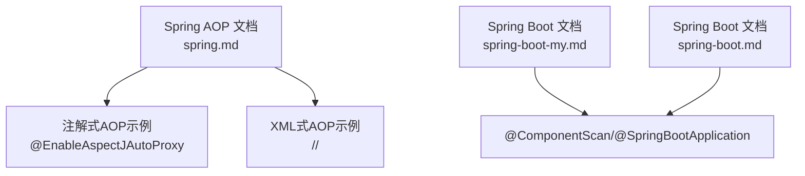
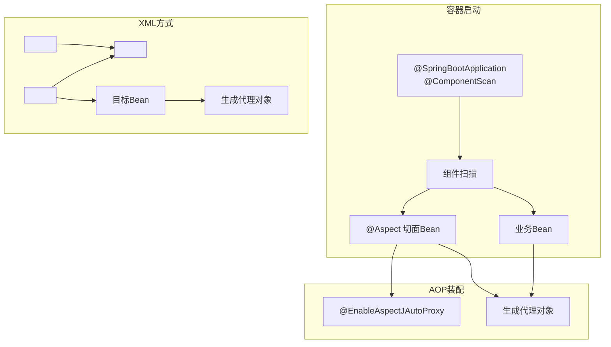
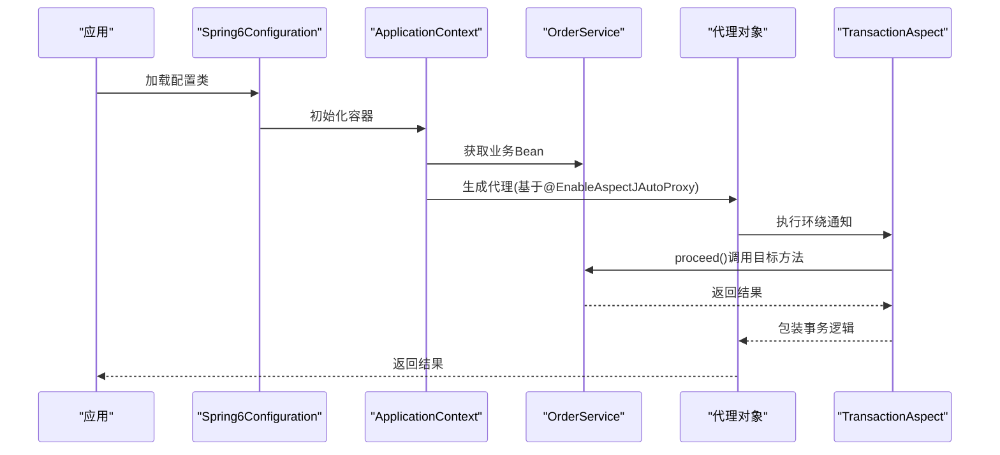
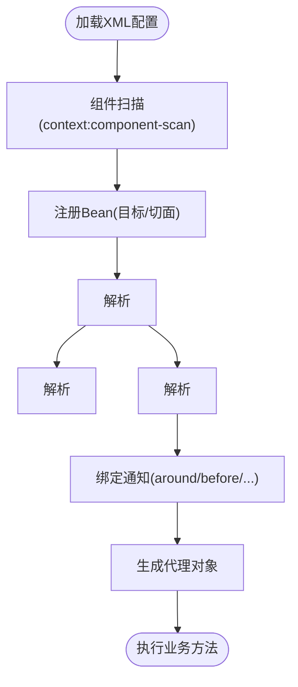
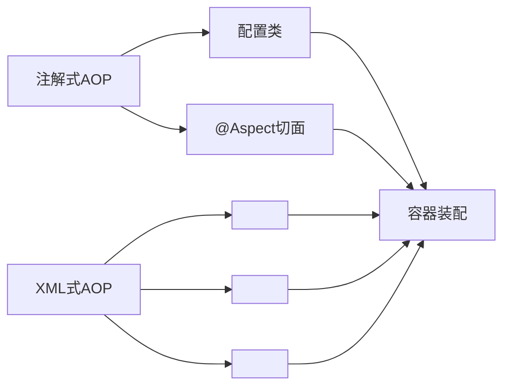

# 注解配置vs XML配置

<cite>
**本文档引用的文件**
- [spring.md](file://docs/backend-base/spring/spring.md)
- [spring-boot-my.md](file://docs/backend-base/spring/spring-boot-my.md)
- [spring-boot.md](file://docs/backend-base/spring/spring-boot.md)
</cite>

## 目录
1. [引言](#引言)
2. [项目结构](#项目结构)
3. [核心组件](#核心组件)
4. [架构总览](#架构总览)
5. [详细组件分析](#详细组件分析)
6. [依赖分析](#依赖分析)
7. [性能考虑](#性能考虑)
8. [故障排查指南](#故障排查指南)
9. [结论](#结论)
10. [附录](#附录)

## 引言
本文件围绕Spring AOP的两种主流配置方式展开：注解驱动的@EnableAspectJAutoProxy与传统的XML配置。我们将从实现原理、使用方式、性能与可维护性、团队协作与迁移策略等方面进行对比分析，并给出混合配置与决策建议，帮助读者在实际项目中做出合适的选择。

## 项目结构
本仓库为知识型文档站点，AOP相关内容主要集中在后端基础的Spring章节中，涵盖注解式AOP与XML式AOP的示例与说明。关键文件如下：
- docs/backend-base/spring/spring.md：包含注解式AOP与XML式AOP的完整示例与说明
- docs/backend-base/spring/spring-boot-my.md：包含Spring Boot常用注解与组件扫描说明
- docs/backend-base/spring/spring-boot.md：包含@SpringBootApplication与@ComponentScan等注解说明

**图表来源**
- [spring.md](file://docs/backend-base/spring/spring.md)
- [spring-boot-my.md](file://docs/backend-base/spring/spring-boot-my.md)
- [spring-boot.md](file://docs/backend-base/spring/spring-boot.md)

**章节来源**
- [spring.md](file://docs/backend-base/spring/spring.md)
- [spring-boot-my.md](file://docs/backend-base/spring/spring-boot-my.md)
- [spring-boot.md](file://docs/backend-base/spring/spring-boot.md)

## 核心组件
- 注解驱动AOP
  - @EnableAspectJAutoProxy：启用AspectJ自动代理，支持JDK/CGLIB代理
  - @Aspect：声明切面类
  - @Component：纳入IoC容器管理
  - @ComponentScan：扫描组件
- XML驱动AOP
  - <aop:config>：AOP配置根元素
  - <aop:aspect>：定义切面，引用切面类
  - <aop:pointcut>：定义切点表达式
  - <aop:aspectj-autoproxy>：启用AspectJ自动代理（XML方式）

**章节来源**
- [spring.md](file://docs/backend-base/spring/spring.md)
- [spring-boot-my.md](file://docs/backend-base/spring/spring-boot-my.md)
- [spring-boot.md](file://docs/backend-base/spring/spring-boot.md)

## 架构总览
注解式与XML式AOP在Spring容器中的作用域与生效路径如下：

**图表来源**
- [spring.md](file://docs/backend-base/spring/spring.md)
- [spring-boot-my.md](file://docs/backend-base/spring/spring-boot-my.md)
- [spring-boot.md](file://docs/backend-base/spring/spring-boot.md)

## 详细组件分析

### 注解驱动的AOP配置
- 组件扫描与自动代理
  - @SpringBootApplication包含@ComponentScan，负责扫描业务与切面Bean
  - @EnableAspectJAutoProxy启用AspectJ自动代理，支持JDK/CGLIB代理
- 切面声明与通知
  - @Aspect声明切面类
  - 通知类型：前置、后置、异常、最终、环绕
  - 切点表达式：@Pointcut或直接在通知注解中声明
- 示例要点
  - 全注解式配置：通过@Configuration类集中声明@ComponentScan与@EnableAspectJAutoProxy
  - 测试程序通过AnnotationConfigApplicationContext加载配置类

**图表来源**
- [spring.md](file://docs/backend-base/spring/spring.md)

**章节来源**
- [spring.md](file://docs/backend-base/spring/spring.md)
- [spring-boot-my.md](file://docs/backend-base/spring/spring-boot-my.md)
- [spring-boot.md](file://docs/backend-base/spring/spring-boot.md)

### XML驱动的AOP配置
- 配置元素
  - <aop:config>：AOP配置根元素
  - <aop:pointcut>：定义切点表达式
  - <aop:aspect>：定义切面，ref指向切面Bean
  - <aop:around>/<aop:before>/<aop:after>/<aop:after-returning>/<aop:after-throwing>：通知类型
- 示例要点
  - 目标Bean与切面Bean均纳入Spring管理
  - 通过ClassPathXmlApplicationContext加载XML配置
  - 执行测试程序验证AOP效果

**图表来源**
- [spring.md](file://docs/backend-base/spring/spring.md)

**章节来源**
- [spring.md](file://docs/backend-base/spring/spring.md)

### 混合配置与最佳实践
- 混合场景
  - Spring Boot项目中通过@ImportResource加载XML配置，实现注解与XML的共存
  - 适用于遗留AOP配置逐步迁移或第三方库仍依赖XML的情况
- 最佳实践
  - 优先采用注解式AOP，提升可读性与可维护性
  - 对于复杂或跨模块的AOP规则，可考虑XML集中管理
  - 明确代理策略：proxy-target-class=true强制CGLIB，false优先JDK动态代理

**章节来源**
- [spring-boot-my.md](file://docs/backend-base/spring/spring-boot-my.md)

## 依赖分析
- 组件耦合
  - 注解式：配置类与切面类通过容器装配，耦合度低
  - XML式：通过XML声明式装配，耦合度相对集中
- 外部依赖
  - AOP相关依赖：spring-aop、spring-aspects等
  - Spring Boot场景：通过starter简化依赖引入

**图表来源**
- [spring.md](file://docs/backend-base/spring/spring.md)
- [spring-boot-my.md](file://docs/backend-base/spring/spring-boot-my.md)

**章节来源**
- [spring.md](file://docs/backend-base/spring/spring.md)
- [spring-boot-my.md](file://docs/backend-base/spring/spring-boot-my.md)

## 性能考虑
- 代理策略
  - JDK动态代理：无接口时自动降级为CGLIB
  - CGLIB代理：对类进行子类化，适合无接口场景
- 启动与运行
  - 注解式AOP在容器启动时解析注解，XML式在加载XML时解析
  - 两者在运行时的代理开销相近，主要取决于通知数量与切点复杂度

[本节为通用性能讨论，不直接分析具体文件]

## 故障排查指南
- 常见问题
  - 切面未生效：确认@ComponentScan范围与@EnableAspectJAutoProxy是否正确配置
  - 通知未触发：检查切点表达式是否匹配目标方法签名
  - 代理对象为空：确认目标类存在接口且代理策略设置合理
- 排查步骤
  - 通过日志观察容器启动过程
  - 使用断点定位代理生成时机
  - 对比注解与XML配置的命名空间与元素是否齐全

**章节来源**
- [spring.md](file://docs/backend-base/spring/spring.md)
- [spring-boot-my.md](file://docs/backend-base/spring/spring-boot-my.md)

## 结论
- 注解式AOP更适合现代Spring Boot项目，具备声明清晰、迁移便利、可维护性强等优势
- XML式AOP适用于复杂规则集中管理或遗留系统的过渡场景
- 在混合配置中，应明确职责边界，避免重复定义同一切点或通知
- 选择策略建议：新项目优先注解式，复杂或跨模块场景可结合XML集中管理

[本节为总结性内容，不直接分析具体文件]

## 附录
- 关键配置参考
  - 注解式：@EnableAspectJAutoProxy、@Aspect、@ComponentScan、@SpringBootApplication
  - XML式：<aop:config>、<aop:aspect>、<aop:pointcut>、<aop:aspectj-autoproxy>
- 迁移建议
  - 从XML迁移到注解：逐步抽取XML切点与通知到注解切面类
  - 从注解迁移到XML：将复杂规则集中到XML，保持注解简洁
  - 混合迁移：先通过@ImportResource引入XML，再逐步替换为纯注解

**章节来源**
- [spring.md](file://docs/backend-base/spring/spring.md)
- [spring-boot-my.md](file://docs/backend-base/spring/spring-boot-my.md)
- [spring-boot.md](file://docs/backend-base/spring/spring-boot.md)