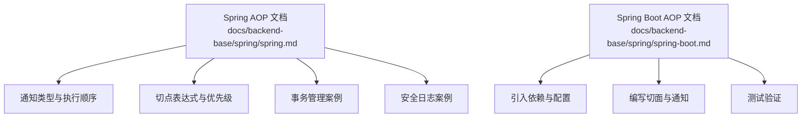
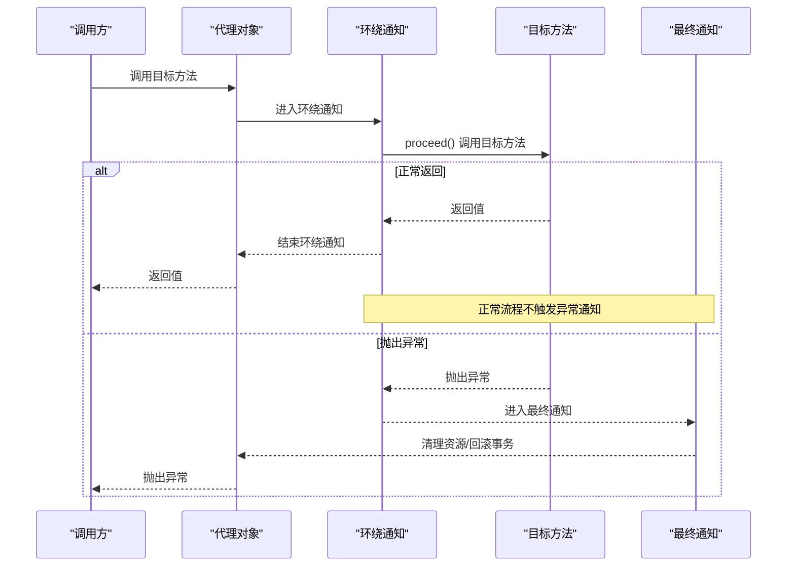
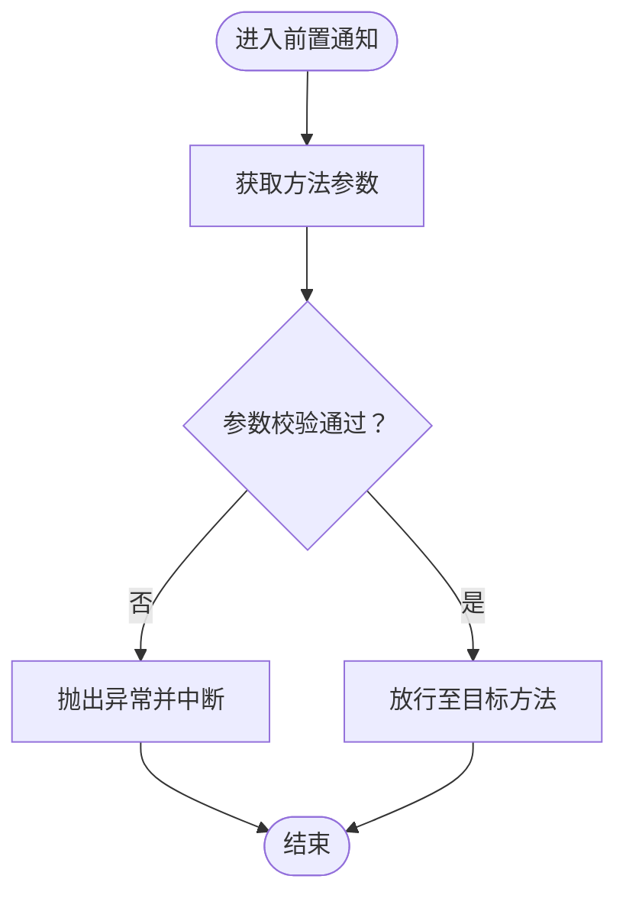
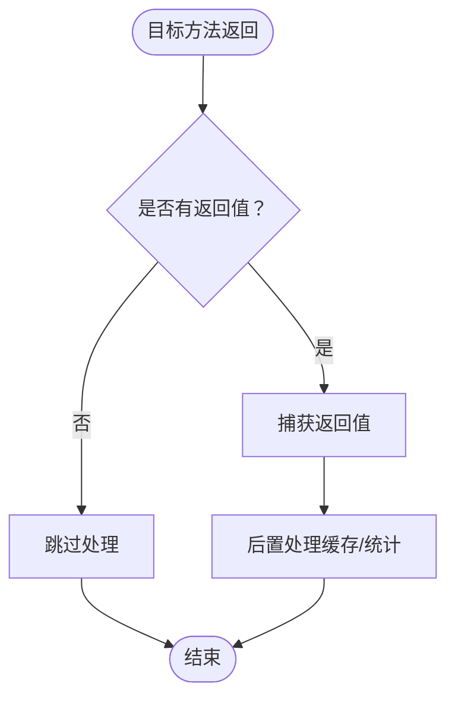
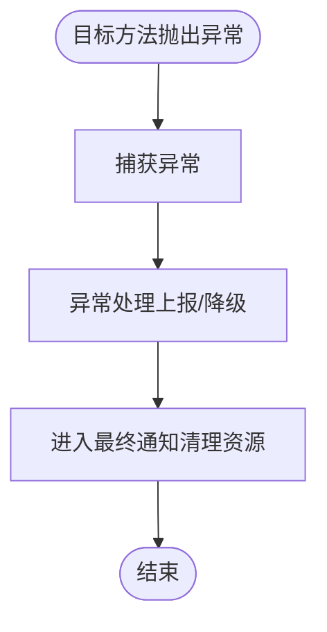
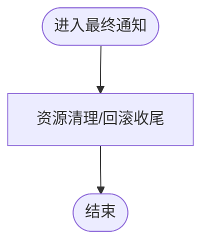
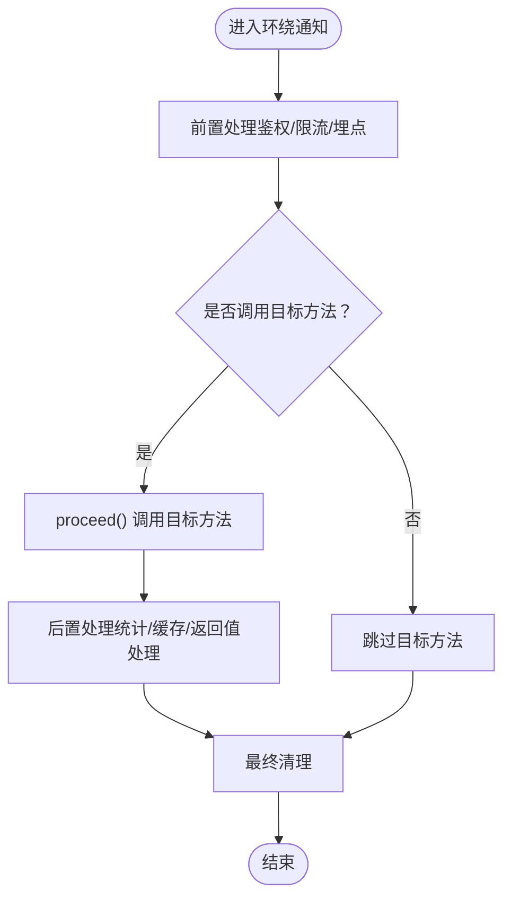
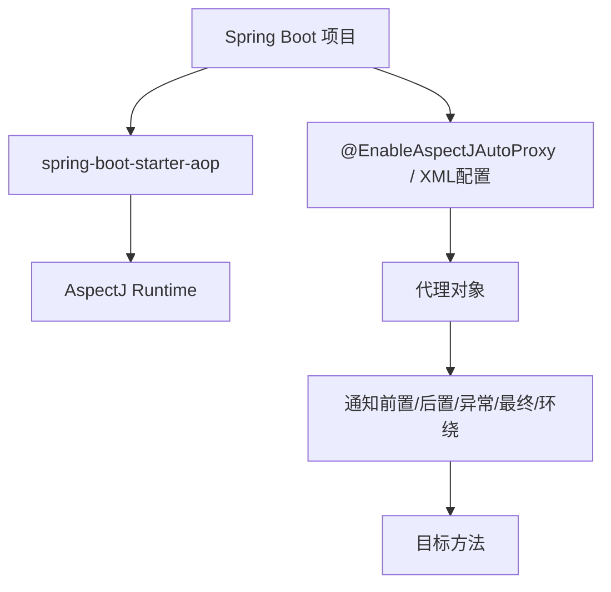

# 通知类型详解

<cite>
**本文引用的文件**
- [spring.md](file://docs/backend-base/spring/spring.md)
- [spring-boot.md](file://docs/backend-base/spring/spring-boot.md)
</cite>

## 目录
1. [引言](#引言)
2. [项目结构](#项目结构)
3. [核心组件](#核心组件)
4. [架构总览](#架构总览)
5. [详细组件分析](#详细组件分析)
6. [依赖分析](#依赖分析)
7. [性能考虑](#性能考虑)
8. [故障排查指南](#故障排查指南)
9. [结论](#结论)
10. [附录](#附录)

## 引言
本技术文档围绕Spring AOP的五种通知类型展开，系统阐述前置通知、后置通知、异常通知、最终通知与环绕通知的实现原理、参数传递、异常处理与返回值处理，给出通知执行顺序与优先级规则，并结合事务管理、日志记录、安全审计等真实案例，帮助开发者在实践中正确选择与组合通知类型，提升系统横切关注点的可维护性与性能表现。

## 项目结构
本仓库中与Spring AOP通知类型直接相关的知识主要分布在以下两份文档：
- docs/backend-base/spring/spring.md：涵盖AOP基础、通知类型、执行顺序与优先级、切点表达式优化、全注解配置、基于XML配置的AOP、以及事务管理、安全日志等实际案例。
- docs/backend-base/spring/spring-boot.md：聚焦Spring Boot环境下的AOP实现，包含引入依赖、编写切面与通知、测试验证等。

**章节来源**
- [spring.md:8288-8396](file://docs/backend-base/spring/spring.md#L8288-L8396)
- [spring.md:8398-8491](file://docs/backend-base/spring/spring.md#L8398-L8491)
- [spring.md:8540-8598](file://docs/backend-base/spring/spring.md#L8540-L8598)
- [spring.md:8599-8625](file://docs/backend-base/spring/spring.md#L8599-L8625)
- [spring.md:8626-8706](file://docs/backend-base/spring/spring.md#L8626-L8706)
- [spring.md:8707-8938](file://docs/backend-base/spring/spring.md#L8707-L8938)
- [spring.md:8940-9037](file://docs/backend-base/spring/spring.md#L8940-L9037)
- [spring-boot.md:1900-2046](file://docs/backend-base/spring/spring-boot.md#L1900-L2046)

## 核心组件
- 通知类型
  - 前置通知：在目标方法执行前执行，适合参数校验、权限检查、日志记录等。
  - 后置通知：在目标方法成功返回后执行，适合统计、缓存写入、结果归档等。
  - 异常通知：在目标方法抛出异常后执行，适合异常上报、降级处理、告警等。
  - 最终通知：无论目标方法是否抛出异常均执行，适合资源清理、事务回滚后的收尾工作。
  - 环绕通知：可同时在目标方法前后织入逻辑，具备最强控制力，适合事务、限流、熔断、性能监控等。
- 切面与优先级：通过@Order控制多个切面的执行顺序，数值越小优先级越高。
- 切点表达式：通过@Pointcut抽取公共表达式，提升可维护性；支持execution、within、@annotation等多种匹配方式。

**章节来源**
- [spring.md:8288-8296](file://docs/backend-base/spring/spring.md#L8288-L8296)
- [spring.md:8398-8491](file://docs/backend-base/spring/spring.md#L8398-L8491)
- [spring.md:8540-8598](file://docs/backend-base/spring/spring.md#L8540-L8598)

## 架构总览
下图展示了通知在目标方法执行期间的典型生命周期与控制流，体现环绕通知的中心地位与其它通知的相对位置。

**图表来源**
- [spring.md:8288-8396](file://docs/backend-base/spring/spring.md#L8288-L8396)

**章节来源**
- [spring.md:8288-8396](file://docs/backend-base/spring/spring.md#L8288-L8396)

## 详细组件分析

### 前置通知（@Before）
- 实现原理：在目标方法执行前执行，不改变目标方法行为。
- 参数传递：可通过JoinPoint获取方法签名、参数数组等。
- 异常处理：前置通知中抛出异常会阻止后续通知与目标方法执行。
- 适用场景：参数校验、鉴权、日志记录、限流预检等。
- 示例参考路径：
  - 切面与通知定义：[spring.md:8233-8244](file://docs/backend-base/spring/spring.md#L8233-L8244)
  - 测试调用与结果：[spring.md:8266-8287](file://docs/backend-base/spring/spring.md#L8266-L8287)
  - Spring Boot示例（日志记录）：[spring-boot.md:1983-2014](file://docs/backend-base/spring/spring-boot.md#L1983-L2014)

**图表来源**
- [spring-boot.md:1983-2014](file://docs/backend-base/spring/spring-boot.md#L1983-L2014)

**章节来源**
- [spring.md:8233-8244](file://docs/backend-base/spring/spring.md#L8233-L8244)
- [spring.md:8266-8287](file://docs/backend-base/spring/spring.md#L8266-L8287)
- [spring-boot.md:1983-2014](file://docs/backend-base/spring/spring-boot.md#L1983-L2014)

### 后置通知（@AfterReturning）
- 实现原理：目标方法成功返回后执行，可访问返回值。
- 参数传递：通过@AfterReturning的returning属性绑定返回值。
- 异常处理：目标方法抛出异常时不触发。
- 适用场景：缓存写入、结果归档、指标统计、幂等性处理等。
- 示例参考路径：
  - 通知定义与测试：[spring.md:8322-8326](file://docs/backend-base/spring/spring.md#L8322-L8326)
  - 执行顺序演示：[spring.md:8372-8374](file://docs/backend-base/spring/spring.md#L8372-L8374)

**图表来源**
- [spring.md:8322-8326](file://docs/backend-base/spring/spring.md#L8322-L8326)

**章节来源**
- [spring.md:8322-8326](file://docs/backend-base/spring/spring.md#L8322-L8326)
- [spring.md:8372-8374](file://docs/backend-base/spring/spring.md#L8372-L8374)

### 异常通知（@AfterThrowing）
- 实现原理：目标方法抛出异常后执行，可获取异常对象。
- 参数传递：通过throwing属性绑定异常参数。
- 异常处理：与最终通知配合，确保资源清理与状态恢复。
- 适用场景：异常上报、降级策略、告警通知、审计日志等。
- 示例参考路径：
  - 通知定义与测试：[spring.md:8327-8331](file://docs/backend-base/spring/spring.md#L8327-L8331)
  - 异常场景执行结果：[spring.md:8394-8396](file://docs/backend-base/spring/spring.md#L8394-L8396)

**图表来源**
- [spring.md:8327-8331](file://docs/backend-base/spring/spring.md#L8327-L8331)
- [spring.md:8394-8396](file://docs/backend-base/spring/spring.md#L8394-L8396)

**章节来源**
- [spring.md:8327-8331](file://docs/backend-base/spring/spring.md#L8327-L8331)
- [spring.md:8394-8396](file://docs/backend-base/spring/spring.md#L8394-L8396)

### 最终通知（@After）
- 实现原理：无论目标方法是否抛出异常均执行，常用于资源清理、回滚后的收尾。
- 参数传递：通常不携带返回值或异常参数。
- 异常处理：确保异常与正常分支都能走到清理逻辑。
- 适用场景：事务回滚、连接释放、临时文件清理、锁释放等。
- 示例参考路径：
  - 通知定义与测试：[spring.md:8332-8336](file://docs/backend-base/spring/spring.md#L8332-L8336)
  - 异常场景执行结果：[spring.md:8394-8396](file://docs/backend-base/spring/spring.md#L8394-L8396)

**图表来源**
- [spring.md:8332-8336](file://docs/backend-base/spring/spring.md#L8332-L8336)
- [spring.md:8394-8396](file://docs/backend-base/spring/spring.md#L8394-L8396)

**章节来源**
- [spring.md:8332-8336](file://docs/backend-base/spring/spring.md#L8332-L8336)
- [spring.md:8394-8396](file://docs/backend-base/spring/spring.md#L8394-L8396)

### 环绕通知（@Around）
- 实现原理：可完全控制目标方法的执行时机，是唯一能“拦截并决定是否调用目标”的通知。
- 参数传递：通过ProceedingJoinPoint.proceed()调用目标方法，可传参、可捕获返回值与异常。
- 异常处理：可在proceed()前后分别处理异常与返回值，适合事务、限流、熔断、性能监控等。
- 适用场景：事务管理、限流熔断、重试策略、链路追踪、性能埋点等。
- 示例参考路径：
  - 通知定义与测试：[spring.md:8310-8316](file://docs/backend-base/spring/spring.md#L8310-L8316)
  - 执行顺序演示：[spring.md:8372-8374](file://docs/backend-base/spring/spring.md#L8372-L8374)
  - Spring Boot示例（日志记录）：[spring-boot.md:1983-2014](file://docs/backend-base/spring/spring-boot.md#L1983-L2014)

**图表来源**
- [spring.md:8310-8316](file://docs/backend-base/spring/spring.md#L8310-L8316)
- [spring-boot.md:1983-2014](file://docs/backend-base/spring/spring-boot.md#L1983-L2014)

**章节来源**
- [spring.md:8310-8316](file://docs/backend-base/spring/spring.md#L8310-L8316)
- [spring.md:8372-8374](file://docs/backend-base/spring/spring.md#L8372-L8374)
- [spring-boot.md:1983-2014](file://docs/backend-base/spring/spring-boot.md#L1983-L2014)

## 依赖分析
- Spring AOP与AspectJ
  - Spring AOP基于JDK动态代理或CGLIB实现，AspectJ提供更强大的切点表达式与编译期织入能力。
  - Spring Boot中引入spring-boot-starter-aop即可获得AOP能力与AspectJ依赖。
- 通知与代理的关系
  - 通知在代理对象上生效，代理对象由Spring根据配置（自动代理或@EnableAspectJAutoProxy）生成。
  - 当目标类无接口时，Spring默认使用CGLIB代理；可通过配置强制使用JDK动态代理。

**图表来源**
- [spring-boot.md:1900-1917](file://docs/backend-base/spring/spring-boot.md#L1900-L1917)
- [spring.md:8262-8266](file://docs/backend-base/spring/spring.md#L8262-L8266)

**章节来源**
- [spring-boot.md:1900-1917](file://docs/backend-base/spring/spring-boot.md#L1900-L1917)
- [spring.md:8262-8266](file://docs/backend-base/spring/spring.md#L8262-L8266)

## 性能考虑
- 环绕通知开销最大：因需要显式调用proceed()并可插入复杂逻辑，建议仅在必要场景使用。
- 前置通知与最终通知开销较小：前者用于预检，后者用于收尾，适合高频调用。
- 后置通知与异常通知：在正常与异常路径上分别执行，注意避免重复计算与冗余IO。
- 切点表达式优化：使用@Pointcut抽取公共表达式，减少重复匹配与维护成本。
- 代理策略：在无接口时CGLIB代理会带来额外开销，可考虑引入接口或调整代理策略。

**章节来源**
- [spring.md:8540-8598](file://docs/backend-base/spring/spring.md#L8540-L8598)
- [spring.md:8599-8625](file://docs/backend-base/spring/spring.md#L8599-L8625)

## 故障排查指南
- 通知未生效
  - 检查是否启用自动代理（XML配置或@EnableAspectJAutoProxy）。
  - 确认切面类被Spring管理（@Component/@Aspect）。
  - 核对切点表达式是否覆盖目标方法。
- 执行顺序异常
  - 使用@Order控制多个切面的优先级，数值越小优先级越高。
  - 确保环绕通知正确调用proceed()，否则会导致目标方法不执行。
- 异常处理不当
  - 异常通知与最终通知配合使用，确保异常场景也能清理资源。
  - 注意异常穿透与异常屏蔽，避免掩盖真实问题。
- 参数与返回值处理
  - 前置通知中避免修改入参；后置通知中谨慎处理返回值。
  - 环绕通知中对异常与返回值进行统一处理，保持横切逻辑的一致性。

**章节来源**
- [spring.md:8262-8266](file://docs/backend-base/spring/spring.md#L8262-L8266)
- [spring.md:8398-8491](file://docs/backend-base/spring/spring.md#L8398-L8491)
- [spring.md:8394-8396](file://docs/backend-base/spring/spring.md#L8394-L8396)

## 结论
- 通知类型的选择应基于横切关注点的生命周期与控制需求：若需完全控制目标方法执行，优先环绕通知；若仅需在特定阶段附加逻辑，可选用前置、后置、异常或最终通知。
- 通过@Pointcut与@Order提升可维护性与可控性，结合Spring Boot的starter简化配置。
- 在事务管理、日志记录、安全审计等场景中，环绕通知与最终通知的组合能提供稳定可靠的横切保障。

## 附录
- 实际应用案例
  - 事务管理：使用环绕通知包裹目标方法，实现统一的开启、提交、回滚逻辑。
    - 参考路径：[spring.md:8894-8904](file://docs/backend-base/spring/spring.md#L8894-L8904)
  - 安全日志：使用前置通知记录操作员与方法签名，覆盖新增、删除、修改等关键操作。
    - 参考路径：[spring.md:9004-9017](file://docs/backend-base/spring/spring.md#L9004-L9017)
  - 日志记录（Spring Boot）：使用前置通知打印方法签名与参数，便于调试与审计。
    - 参考路径：[spring-boot.md:1983-2014](file://docs/backend-base/spring/spring-boot.md#L1983-L2014)

**章节来源**
- [spring.md:8894-8904](file://docs/backend-base/spring/spring.md#L8894-L8904)
- [spring.md:9004-9017](file://docs/backend-base/spring/spring.md#L9004-L9017)
- [spring-boot.md:1983-2014](file://docs/backend-base/spring/spring-boot.md#L1983-L2014)