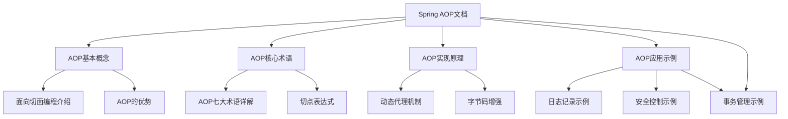
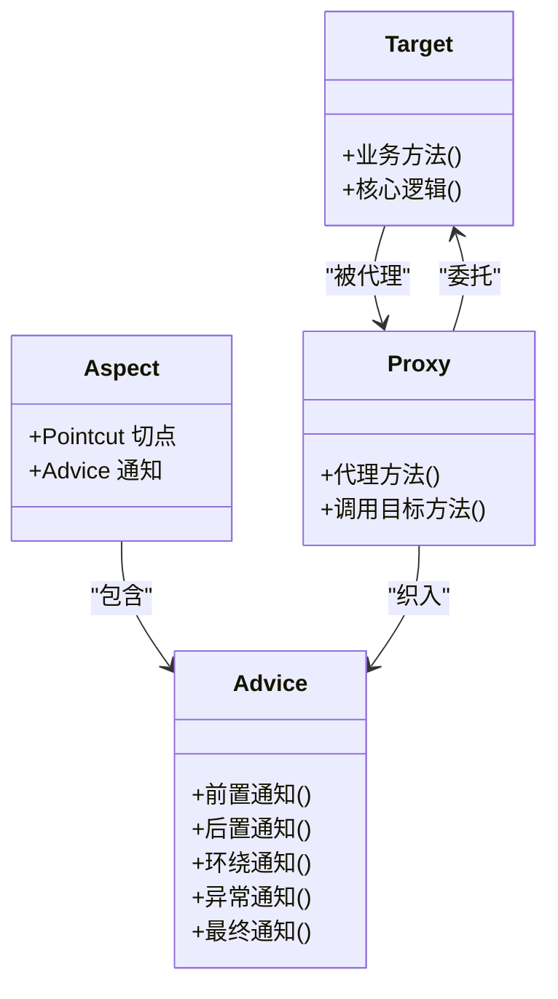
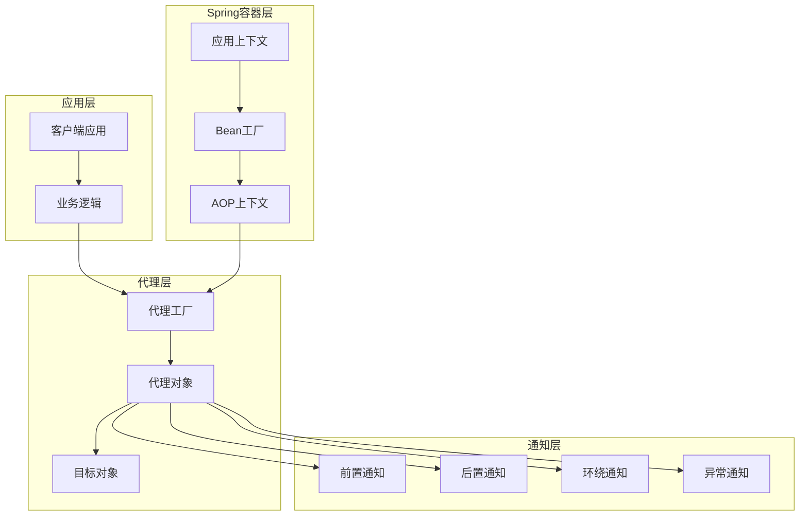
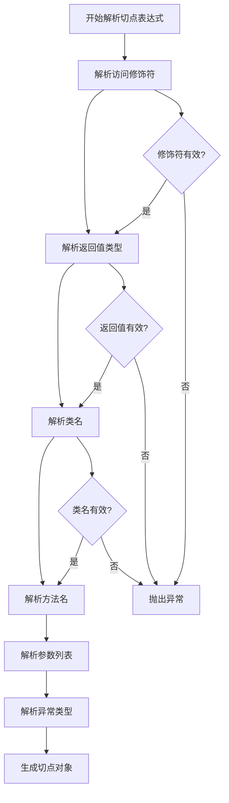
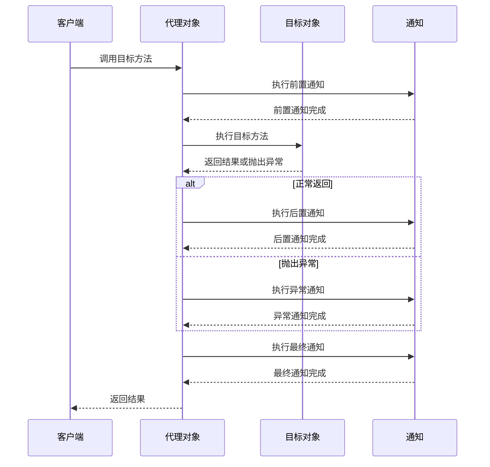
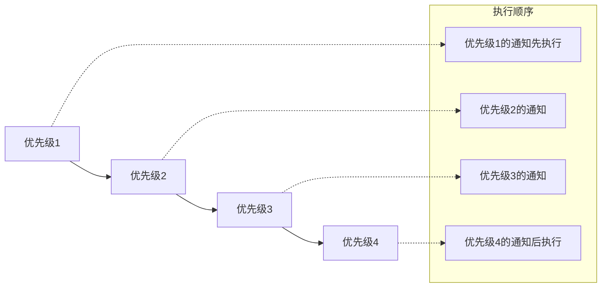
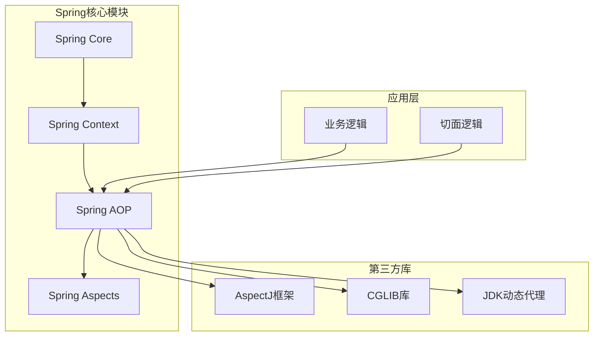

# AOP核心概念

<cite>
**本文档引用的文件**
- [spring.md](file://docs/backend-base/spring/spring.md)
</cite>

## 目录
1. [引言](#引言)
2. [项目结构](#项目结构)
3. [核心组件](#核心组件)
4. [架构概览](#架构概览)
5. [详细组件分析](#详细组件分析)
6. [依赖分析](#依赖分析)
7. [性能考虑](#性能考虑)
8. [故障排除指南](#故障排除指南)
9. [结论](#结论)

## 引言

面向切面编程（AOP，Aspect-Oriented Programming）是Spring框架的重要组成部分，它为解决横切关注点提供了优雅的解决方案。AOP通过对传统面向对象编程（OOP）的补充，实现了横切功能的模块化，使得开发者能够专注于核心业务逻辑，而不必在每个业务流程中重复编写相同的横切代码。

在现代企业级应用开发中，日志记录、事务管理、安全控制、性能监控等横切关注点几乎存在于所有业务流程中。如果没有AOP，这些横切功能会被分散在各个业务方法中，导致代码重复、维护困难和关注点分离的问题。

## 项目结构

本项目中的Spring AOP相关内容主要集中在`docs/backend-base/spring/spring.md`文件中，该文件包含了完整的AOP理论知识和实践示例。文件结构如下：



**图表来源**
- [spring.md:7986-8010](file://docs/backend-base/spring/spring.md#L7986-L8010)

**章节来源**
- [spring.md:7986-8010](file://docs/backend-base/spring/spring.md#L7986-L8010)

## 核心组件

### AOP七大术语详解

AOP的核心在于理解其七大基本术语，这些术语构成了AOP理论的基础框架：

#### 连接点（Joinpoint）
连接点是程序执行流程中可以织入切面的特定位置。在Spring AOP中，连接点通常指方法的执行点，包括方法调用前后、异常抛出等时机。

#### 切点（Pointcut）
切点定义了真正需要织入切面的具体方法。通过切点表达式精确指定通知应该应用到哪些方法上，实现对连接点的选择性应用。

#### 通知（Advice）
通知是具体的横切逻辑，即需要织入的代码。Spring AOP支持多种通知类型：
- 前置通知（@Before）：方法执行前执行
- 后置通知（@AfterReturning）：方法正常返回后执行
- 环绕通知（@Around）：方法执行前后都执行
- 异常通知（@AfterThrowing）：方法抛出异常后执行
- 最终通知（@After）：无论何种情况都会执行

#### 切面（Aspect）
切面是切点和通知的组合，代表一个完整的横切关注点模块。切面将横切逻辑与应用逻辑分离，实现关注点的模块化。

#### 织入（Weaving）
织入是将切面应用到目标对象的过程。Spring AOP通过动态代理在运行时将通知织入到目标方法中。

#### 代理对象（Proxy）
代理对象是目标对象被织入通知后产生的新对象。客户端通过代理对象调用目标方法，从而实现横切逻辑的执行。

#### 目标对象（Target）
目标对象是被织入通知的对象，即原始的业务对象。



**图表来源**
- [spring.md:8041-8060](file://docs/backend-base/spring/spring.md#L8041-L8060)

**章节来源**
- [spring.md:8013-8060](file://docs/backend-base/spring/spring.md#L8013-L8060)

## 架构概览

Spring AOP的架构基于动态代理机制，通过在运行时生成代理对象来实现横切功能的织入。整个架构可以分为以下几个层次：



**图表来源**
- [spring.md:7990-7991](file://docs/backend-base/spring/spring.md#L7990-L7991)

### 动态代理机制

Spring AOP底层使用动态代理技术实现，支持两种代理方式：

#### JDK动态代理
- 适用于实现接口的类
- 通过实现InvocationHandler接口创建代理对象
- 性能较好，但仅限于接口代理

#### CGLIB动态代理
- 适用于没有实现接口的类
- 通过继承目标类创建子类代理
- 功能强大，但性能略低于JDK代理

Spring会根据目标类的实现情况自动选择合适的代理方式，也可以通过配置强制使用某种代理方式。

**章节来源**
- [spring.md:7990-7991](file://docs/backend-base/spring/spring.md#L7990-L7991)

## 详细组件分析

### 切点表达式详解

切点表达式是AOP中最重要的概念之一，它决定了通知应该应用到哪些方法上。切点表达式的语法结构如下：

```java
execution([访问控制修饰符] 返回值类型 [全限定类名]方法名(形式参数列表) [异常])
```

#### 访问控制修饰符
- 可选参数，省略时表示所有访问级别
- 可以指定public、private、protected等

#### 返回值类型
- 必填参数，*表示任意返回类型

#### 全限定类名
- 可选参数，两个点".."表示当前包及其子包
- 省略时表示所有类

#### 方法名
- 必填参数，*表示所有方法
- 可以使用通配符如delete*表示所有delete开头的方法

#### 形式参数列表
- 必填参数，()表示无参方法
- (..)表示任意参数列表
- (*)表示单个参数
- (*, String)表示第一个参数任意类型，第二个参数为String类型

#### 异常
- 可选参数，省略时表示任意异常类型



**图表来源**
- [spring.md:8067-8116](file://docs/backend-base/spring/spring.md#L8067-L8116)

**章节来源**
- [spring.md:8065-8116](file://docs/backend-base/spring/spring.md#L8065-L8116)

### 通知类型详解

Spring AOP支持五种不同类型的通知，每种通知都有其特定的执行时机和用途：

#### 前置通知（@Before）
在目标方法执行前执行，用于预处理逻辑，如参数验证、权限检查等。

#### 后置通知（@AfterReturning）
在目标方法正常返回后执行，用于后处理逻辑，如结果转换、缓存更新等。

#### 环绕通知（@Around）
最强大的通知类型，可以完全控制目标方法的执行，既可以在方法执行前添加逻辑，也可以在方法执行后添加逻辑。

#### 异常通知（@AfterThrowing）
在目标方法抛出异常后执行，用于异常处理和资源清理。

#### 最终通知（@After）
无论目标方法是否正常执行都会执行，相当于finally块的作用。



**图表来源**
- [spring.md:8288-8396](file://docs/backend-base/spring/spring.md#L8288-L8396)

**章节来源**
- [spring.md:8288-8396](file://docs/backend-base/spring/spring.md#L8288-L8396)

### 切面优先级管理

当系统中存在多个切面时，需要控制它们的执行顺序。Spring提供了@Order注解来管理切面的优先级：

- 数字越小，优先级越高
- 同优先级的切面按声明顺序执行
- 优先级影响通知的执行顺序



**图表来源**
- [spring.md:8398-8491](file://docs/backend-base/spring/spring.md#L8398-L8491)

**章节来源**
- [spring.md:8398-8491](file://docs/backend-base/spring/spring.md#L8398-L8491)

### 切点表达式优化

为了避免切点表达式的重复编写，Spring提供了@Pointcut注解来定义可复用的切点：

```java
@Pointcut("execution(* com.powernode.spring6.service.OrderService.*(..))")
public void orderServicePointcut(){}

@Before("orderServicePointcut()")
public void beforeAdvice(){
    // 通知逻辑
}

@AfterReturning("orderServicePointcut()")
public void afterReturningAdvice(){
    // 通知逻辑
}
```

这种设计提高了代码的可维护性和复用性。

**章节来源**
- [spring.md:8493-8597](file://docs/backend-base/spring/spring.md#L8493-L8597)

## 依赖分析

Spring AOP的实现依赖于多个核心组件和技术：



**图表来源**
- [spring.md:8125-8150](file://docs/backend-base/spring/spring.md#L8125-L8150)

### 依赖关系说明

1. **Spring Core**：提供基础的IoC和DI功能
2. **Spring Context**：提供应用上下文和配置管理
3. **Spring AOP**：实现AOP的核心功能
4. **Spring Aspects**：提供对AspectJ框架的支持
5. **AspectJ**：独立的AOP框架，Spring集成了其核心功能
6. **CGLIB**：用于类级别的动态代理
7. **JDK动态代理**：用于接口级别的动态代理

**章节来源**
- [spring.md:8125-8150](file://docs/backend-base/spring/spring.md#L8125-L8150)

## 性能考虑

### 代理选择策略

Spring AOP在性能方面的考虑主要体现在代理选择策略上：

#### JDK动态代理 vs CGLIB代理
- **JDK动态代理**：性能更好，但仅适用于接口代理
- **CGLIB代理**：功能更强大，但性能略低
- **自动选择**：Spring根据目标类是否实现接口自动选择

#### 代理对象创建成本
- 代理对象的创建和维护需要额外的内存开销
- 多个切面对性能的影响需要考虑
- 通知链的长度会影响执行性能

#### 缓存策略
- Spring会缓存代理对象以减少创建成本
- 切点表达式的解析结果也会被缓存
- 合理使用@Pointcut注解可以避免重复解析

## 故障排除指南

### 常见问题及解决方案

#### 问题1：通知未生效
**症状**：切面逻辑没有被执行
**可能原因**：
- 目标类未被Spring管理
- 切点表达式配置错误
- 代理方式选择不当

**解决方案**：
- 确保目标类添加了@Component等注解
- 检查切点表达式的正确性
- 明确代理方式的配置

#### 问题2：通知执行顺序异常
**症状**：多个切面的通知执行顺序不符合预期
**解决方案**：
- 使用@Order注解明确优先级
- 检查通知类型的选择是否合适

#### 问题3：循环依赖问题
**症状**：应用启动时报循环依赖错误
**解决方案**：
- 避免在切面中依赖目标对象
- 使用@Lazy注解延迟加载

**章节来源**
- [spring.md:8398-8491](file://docs/backend-base/spring/spring.md#L8398-L8491)

## 结论

Spring AOP作为Spring框架的重要组成部分，为解决横切关注点提供了优雅而强大的解决方案。通过理解AOP的七大核心术语、掌握切点表达式的编写技巧、合理选择代理方式以及正确配置通知类型，开发者可以构建出高内聚、低耦合的应用架构。

AOP的核心价值在于：
1. **代码复用性增强**：横切逻辑集中管理，避免重复代码
2. **代码易维护**：关注点分离，逻辑更加清晰
3. **开发效率提升**：开发者专注于核心业务逻辑
4. **横切功能模块化**：日志、事务、安全等功能独立封装

在实际开发中，建议：
- 优先使用注解方式实现AOP，简化配置
- 合理设计切点表达式，避免过度复杂的匹配规则
- 通过@Order明确切面执行顺序
- 注意性能影响，避免过多的通知链
- 结合Spring事务管理，实现声明式事务控制

通过深入理解和正确运用Spring AOP，开发者可以构建出更加优雅、可维护的企业级应用。