# 切点(Pointcut)

<cite>
**本文档引用的文件**
- [spring.md](file://docs/backend-base/spring/spring.md)
</cite>

## 目录
1. [引言](#引言)
2. [项目结构](#项目结构)
3. [核心组件](#核心组件)
4. [架构概览](#架构概览)
5. [详细组件分析](#详细组件分析)
6. [依赖分析](#依赖分析)
7. [性能考虑](#性能考虑)
8. [故障排除指南](#故障排除指南)
9. [结论](#结论)

## 引言

切点(Pointcut)是Spring AOP框架中的核心概念，它定义了通知(Advice)应该应用到哪些连接点(Joinpoint)上。通过切点表达式，开发者可以精确地指定横切关注点应该织入到应用程序的哪些方法或操作中。

在Spring框架中，AOP(面向切面编程)提供了一种强大的方式来实现横切关注点，如事务管理、日志记录、安全控制等，这些关注点与核心业务逻辑相分离，提高了代码的模块化和可维护性。

## 项目结构

本项目中的Spring AOP相关内容主要集中在Spring框架文档中，特别是关于AOP术语、切点表达式和实际应用的部分。

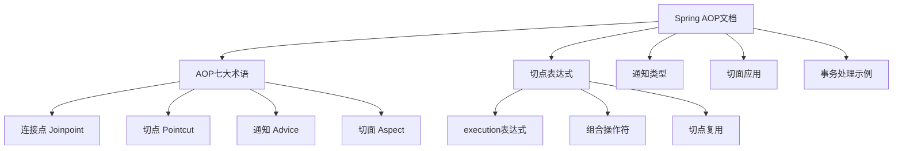

**图表来源**
- [spring.md:8013-8063](file://docs/backend-base/spring/spring.md#L8013-L8063)

**章节来源**
- [spring.md:8000-8063](file://docs/backend-base/spring/spring.md#L8000-L8063)

## 核心组件

### AOP七大术语

Spring AOP框架围绕七个核心术语构建，其中切点(Pointcut)是关键概念：

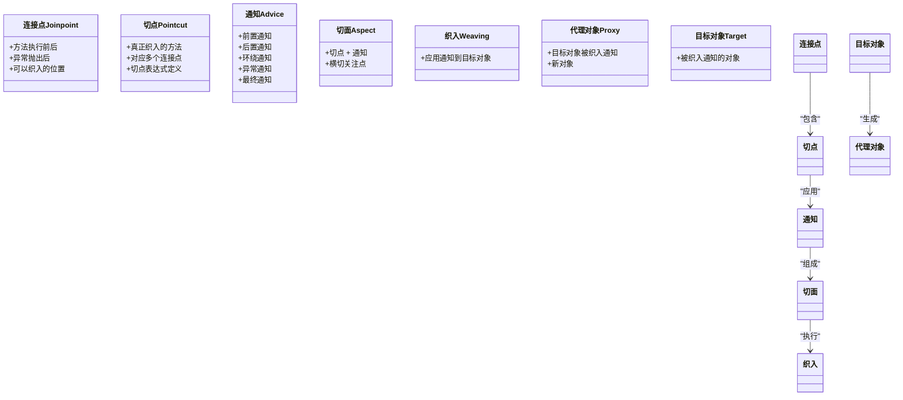

**图表来源**
- [spring.md:8013-8063](file://docs/backend-base/spring/spring.md#L8013-L8063)

### 切点表达式语法

切点表达式是定义通知应用范围的核心机制，其语法格式为：

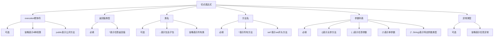

**图表来源**
- [spring.md:8065-8116](file://docs/backend-base/spring/spring.md#L8065-L8116)

**章节来源**
- [spring.md:8065-8116](file://docs/backend-base/spring/spring.md#L8065-L8116)

## 架构概览

Spring AOP的实现架构展示了切点如何在整个系统中发挥作用：

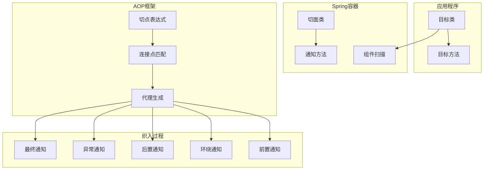

**图表来源**
- [spring.md:8118-8265](file://docs/backend-base/spring/spring.md#L8118-L8265)

**章节来源**
- [spring.md:8118-8265](file://docs/backend-base/spring/spring.md#L8118-L8265)

## 详细组件分析

### 切点表达式详解

#### execution指示器

execution指示器是最常用的切点表达式类型，用于匹配特定的方法执行：

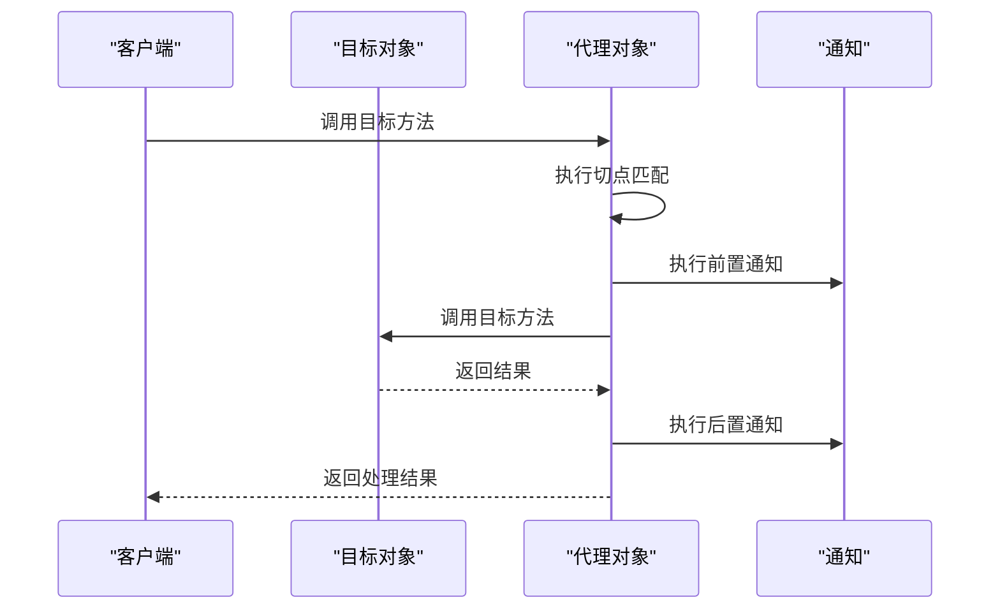

**图表来源**
- [spring.md:8238-8244](file://docs/backend-base/spring/spring.md#L8238-L8244)

#### 组合操作符

切点表达式支持逻辑操作符来组合多个切点：

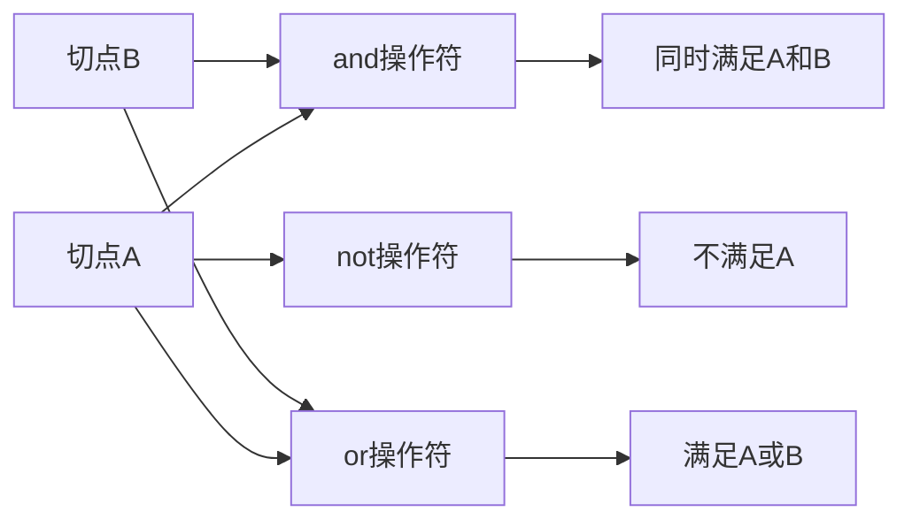

**图表来源**
- [spring.md:9013](file://docs/backend-base/spring/spring.md#L9013)

#### 切点复用

通过@Pointcut注解实现切点的复用和提取：

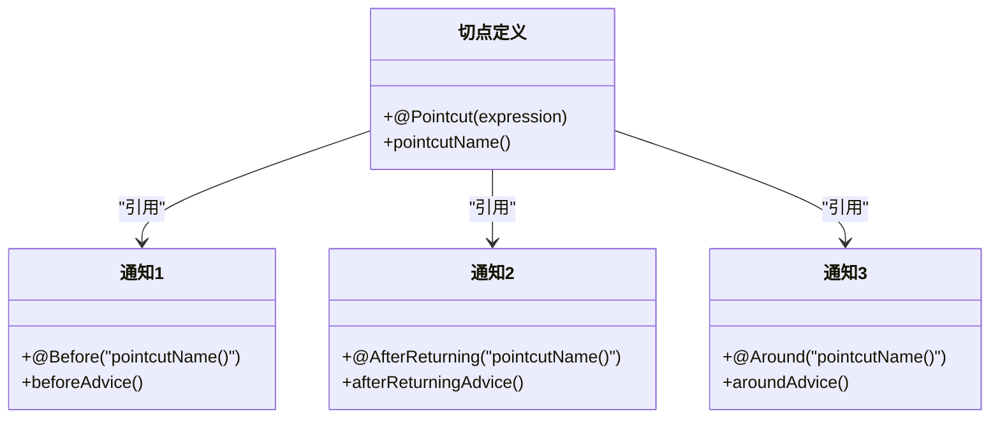

**图表来源**
- [spring.md:8560-8561](file://docs/backend-base/spring/spring.md#L8560-L8561)

**章节来源**
- [spring.md:8545-8593](file://docs/backend-base/spring/spring.md#L8545-L8593)

### 通知类型详解

Spring AOP支持五种不同类型的通知：

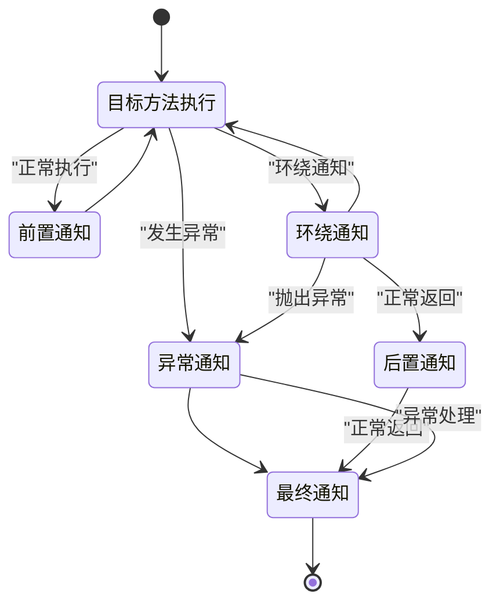

**图表来源**
- [spring.md:8288-8295](file://docs/backend-base/spring/spring.md#L8288-L8295)

**章节来源**
- [spring.md:8288-8396](file://docs/backend-base/spring/spring.md#L8288-L8396)

### 实际应用场景

#### 安全控制示例

通过切点表达式实现统一的安全控制：

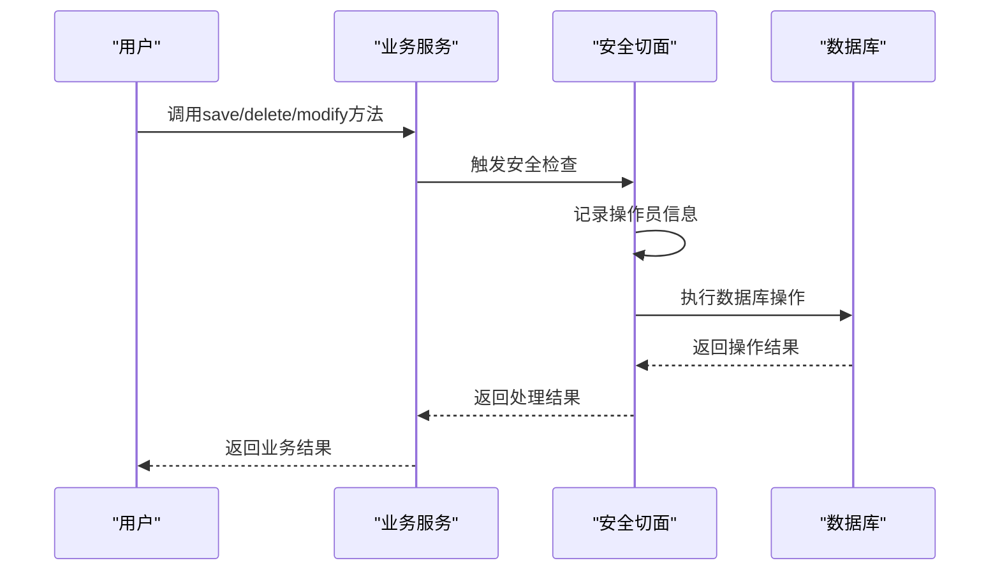

**图表来源**
- [spring.md:9000-9017](file://docs/backend-base/spring/spring.md#L9000-L9017)

**章节来源**
- [spring.md:9000-9035](file://docs/backend-base/spring/spring.md#L9000-L9035)

#### 事务处理示例

基于AOP的声明式事务管理：

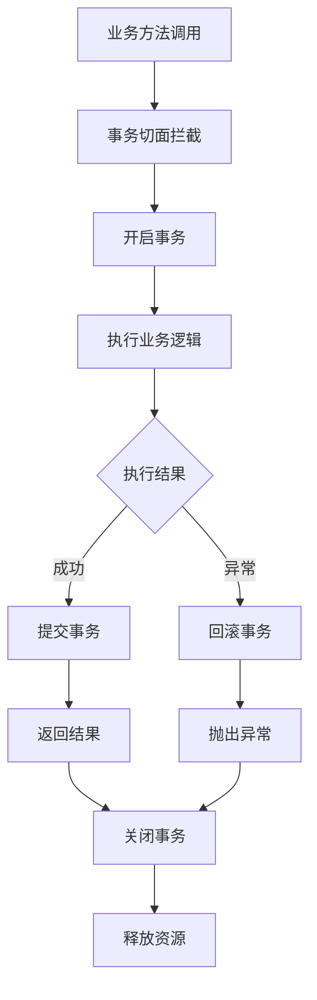

**图表来源**
- [spring.md:9442-9543](file://docs/backend-base/spring/spring.md#L9442-L9543)

**章节来源**
- [spring.md:9442-9543](file://docs/backend-base/spring/spring.md#L9442-L9543)

## 依赖分析

Spring AOP的实现依赖于多个核心模块：

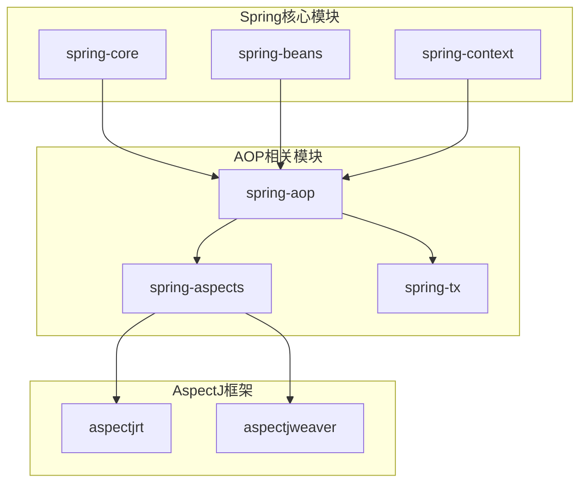

**图表来源**
- [spring.md:8129-8150](file://docs/backend-base/spring/spring.md#L8129-L8150)

**章节来源**
- [spring.md:8129-8150](file://docs/backend-base/spring/spring.md#L8129-L8150)

## 性能考虑

### 代理生成策略

Spring AOP支持两种代理生成策略：

- **JDK动态代理**：适用于接口实现类，性能较好，但仅支持接口方法
- **CGLIB代理**：适用于所有类，包括抽象类和具体类，功能更强大但性能略低

### 切点匹配性能

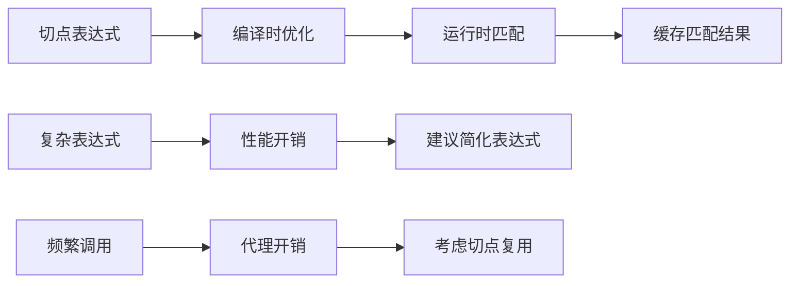

## 故障排除指南

### 常见问题及解决方案

1. **切点不匹配**
   - 检查包路径和类名是否正确
   - 确认方法签名匹配
   - 验证访问修饰符设置

2. **通知未执行**
   - 确认@Aspect注解正确配置
   - 检查@EnableAspectJAutoProxy注解
   - 验证组件扫描配置

3. **代理失效**
   - 确认目标类不是final类
   - 检查方法是否为public
   - 验证切点表达式语法

**章节来源**
- [spring.md:8263-8265](file://docs/backend-base/spring/spring.md#L8263-L8265)

## 结论

Spring AOP的切点概念为横切关注点的实现提供了强大而灵活的机制。通过精心设计的切点表达式，开发者可以精确控制通知的应用范围，实现代码的模块化和关注点分离。

关键要点包括：
- 切点表达式的精确匹配能力
- 多种通知类型的灵活组合
- 切点复用机制提高代码维护性
- 基于AOP的声明式事务管理
- 实际应用场景中的最佳实践

掌握切点的概念和使用方法，将帮助开发者构建更加模块化、可维护的企业级应用程序。