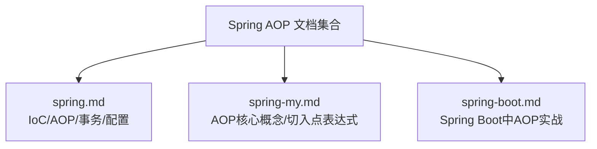
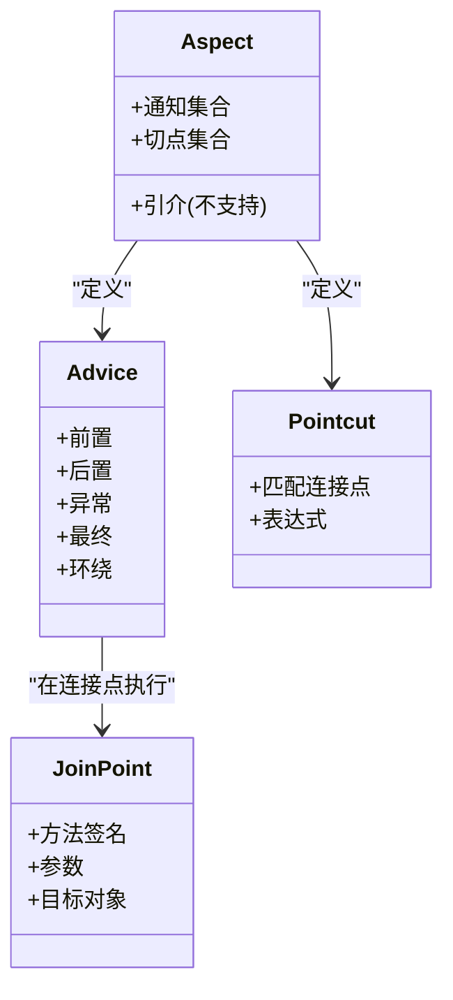
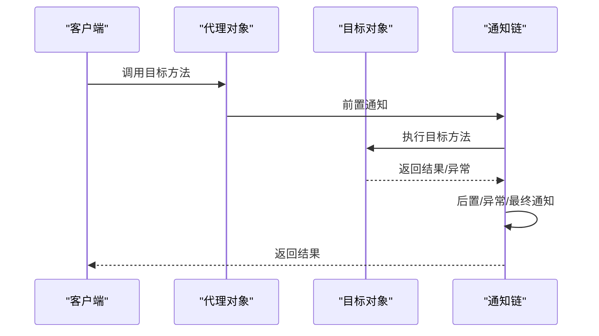
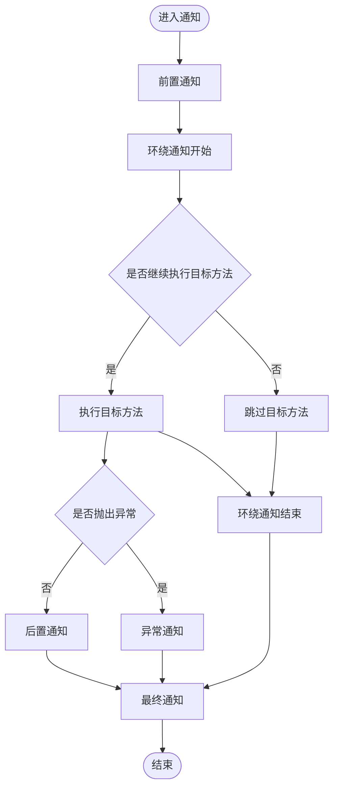
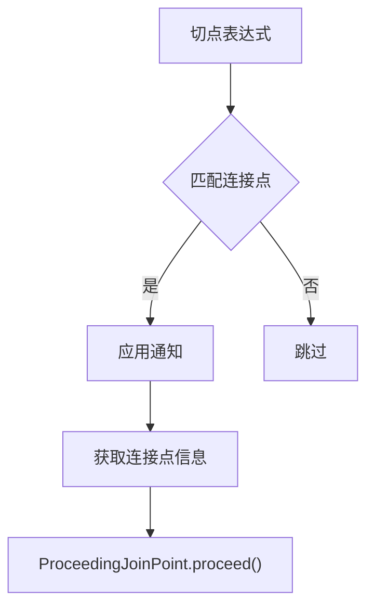
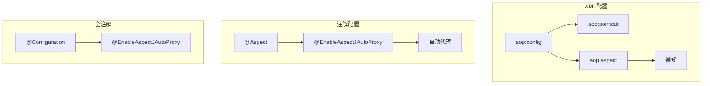
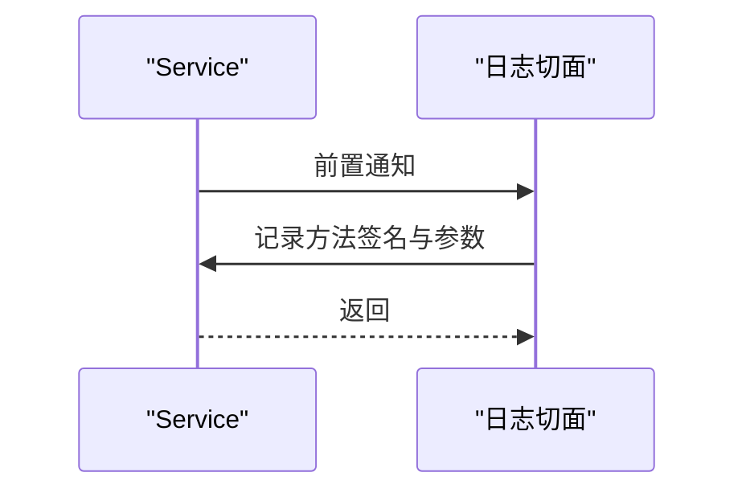
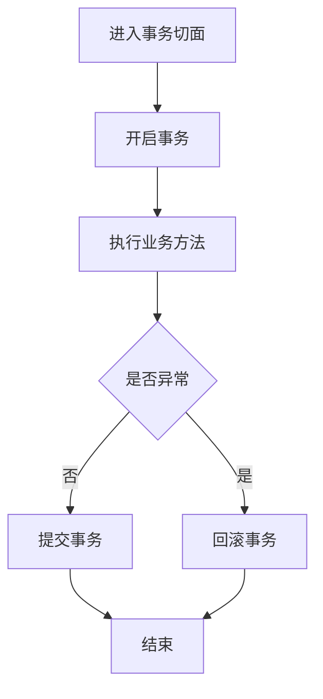
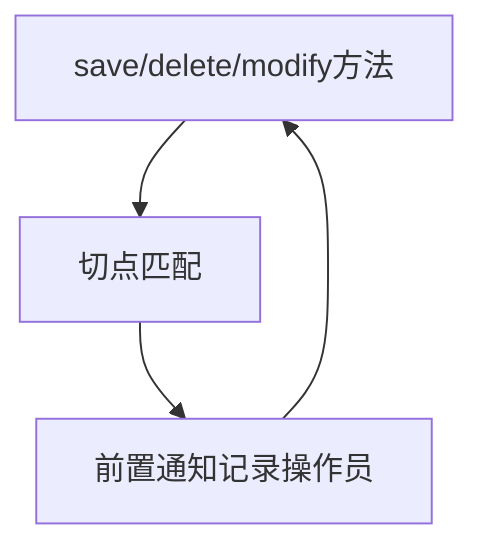
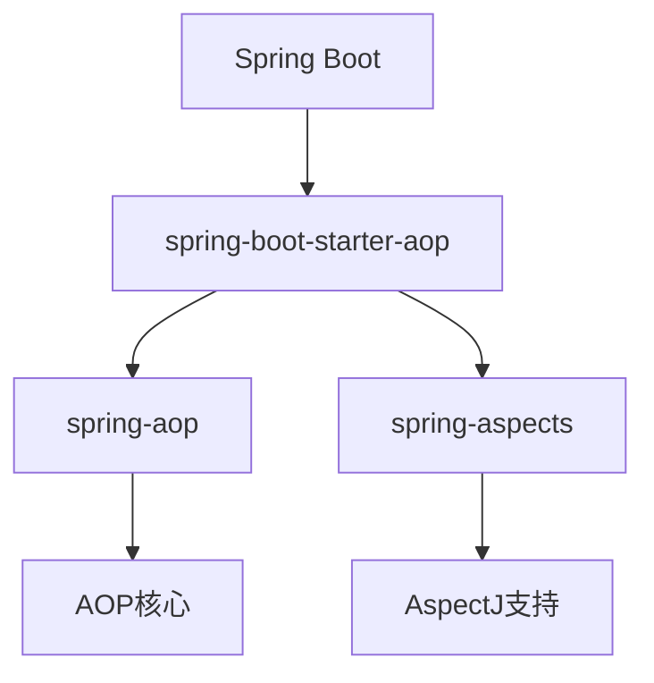

# 切面(Aspect)

<cite>
**本文引用的文件**
- [spring.md](file://docs/backend-base/spring/spring.md)
- [spring-my.md](file://docs/backend-base/spring/spring-my.md)
- [spring-boot.md](file://docs/backend-base/spring/spring-boot.md)
</cite>

## 目录
1. [引言](#引言)
2. [项目结构](#项目结构)
3. [核心组件](#核心组件)
4. [架构总览](#架构总览)
5. [详细组件分析](#详细组件分析)
6. [依赖分析](#依赖分析)
7. [性能考虑](#性能考虑)
8. [故障排查指南](#故障排查指南)
9. [结论](#结论)
10. [附录](#附录)

## 引言
本篇文档围绕Spring AOP中的“切面(Aspect)”展开，系统阐述切面的概念、组成要素（通知Advice、切点Pointcut、引介Introduction）、与传统面向对象编程的区别、横切关注点的模块化实现方式，并结合日志记录、事务管理、安全控制等真实业务场景，给出声明方式、配置方法与最佳实践，帮助开发者深入理解并正确应用切面。

## 项目结构
本仓库中与Spring AOP相关的知识主要分布在以下文档：
- docs/backend-base/spring/spring.md：涵盖IoC、AOP基础、XML与注解式AOP、事务管理等
- docs/backend-base/spring/spring-my.md：聚焦AOP核心概念与切入点表达式
- docs/backend-base/spring/spring-boot.md：展示在Spring Boot中引入AOP依赖并编写切面的实操

**章节来源**
- [spring.md:1-200](file://docs/backend-base/spring/spring.md#L1-L200)
- [spring-my.md:1200-1270](file://docs/backend-base/spring/spring-my.md#L1200-L1270)
- [spring-boot.md:1890-2100](file://docs/backend-base/spring/spring-boot.md#L1890-L2100)

## 核心组件
- 切面(Aspect)：跨越多个类的关注点模块化，如事务管理、日志记录、安全控制等
- 通知(Advice)：在连接点执行的行为，类型包括前置、后置、异常、最终、环绕
- 切点(Pointcut)：匹配连接点的谓词，决定通知在何处生效
- 连接点(JoinPoint)：程序执行过程中的点，如方法执行或异常处理
- 引介(Introduction)：允许为现有类动态添加新方法或属性的能力（Spring AOP不支持）

**图表来源**
- [spring-my.md:1214-1228](file://docs/backend-base/spring/spring-my.md#L1214-L1228)

**章节来源**
- [spring-my.md:1214-1228](file://docs/backend-base/spring/spring-my.md#L1214-L1228)
- [spring.md:8288-8396](file://docs/backend-base/spring/spring.md#L8288-L8396)

## 架构总览
Spring AOP通过动态代理在运行时为目标对象织入横切逻辑，形成通知链。切面由切点表达式定位连接点，通知在连接点前后按约定顺序执行。

**图表来源**
- [spring-my.md:1210-1212](file://docs/backend-base/spring/spring-my.md#L1210-L1212)
- [spring.md:8288-8396](file://docs/backend-base/spring/spring.md#L8288-L8396)

## 详细组件分析

### 通知类型与执行顺序
- 前置通知：方法执行前
- 环绕通知：方法前后包裹，可控制是否继续执行
- 后置通知：方法正常返回后
- 异常通知：方法抛出异常后
- 最终通知：无论何种方式退出均执行（相当于finally）

**图表来源**
- [spring.md:8288-8396](file://docs/backend-base/spring/spring.md#L8288-L8396)

**章节来源**
- [spring.md:8288-8396](file://docs/backend-base/spring/spring.md#L8288-L8396)

### 切点表达式与连接点
- execution：匹配方法执行，支持通配符与组合
- @annotation：匹配带指定注解的方法
- 连接点信息：可获取目标类名、方法名、参数、返回值等

**图表来源**
- [spring-my.md:1229-1261](file://docs/backend-base/spring/spring-my.md#L1229-L1261)

**章节来源**
- [spring-my.md:1229-1261](file://docs/backend-base/spring/spring-my.md#L1229-L1261)

### 切面声明与配置
- XML方式：通过aop:config定义切点与切面，配合通知与代理
- 注解方式：@Aspect定义切面，@EnableAspectJAutoProxy启用自动代理
- 全注解配置：使用@Configuration + @EnableAspectJAutoProxy替代XML

**图表来源**
- [spring.md:8626-8625](file://docs/backend-base/spring/spring.md#L8626-L8625)

**章节来源**
- [spring.md:8626-8625](file://docs/backend-base/spring/spring.md#L8626-L8625)

### 业务场景示例

#### 日志记录
- 场景：在service任意方法执行前统一记录方法签名与参数
- 实现：@Before + execution表达式匹配service包下任意方法

**图表来源**
- [spring-boot.md:1918-2046](file://docs/backend-base/spring/spring-boot.md#L1918-L2046)

**章节来源**
- [spring-boot.md:1918-2046](file://docs/backend-base/spring/spring-boot.md#L1918-L2046)

#### 事务管理
- 场景：围绕业务方法自动开启/提交/回滚事务
- 实现：@Around或基于@Transactional注解（底层基于AOP）

**图表来源**
- [spring.md:8880-8938](file://docs/backend-base/spring/spring.md#L8880-L8938)

**章节来源**
- [spring.md:8880-8938](file://docs/backend-base/spring/spring.md#L8880-L8938)

#### 安全日志
- 场景：对新增/删除/修改操作进行操作员记录
- 实现：@Pointcut分别定义save/delete/modify，@Before统一记录

**图表来源**
- [spring.md:8990-9037](file://docs/backend-base/spring/spring.md#L8990-L9037)

**章节来源**
- [spring.md:8990-9037](file://docs/backend-base/spring/spring.md#L8990-L9037)

## 依赖分析
- Spring AOP依赖：spring-aop、spring-aspects（可选）
- Spring Boot中引入spring-boot-starter-aop自动包含上述依赖
- AspectJ：提供更强大的切点表达式与编译时织入能力（可选）

**图表来源**
- [spring-boot.md:1901-1916](file://docs/backend-base/spring/spring-boot.md#L1901-L1916)

**章节来源**
- [spring-boot.md:1901-1916](file://docs/backend-base/spring/spring-boot.md#L1901-L1916)

## 性能考虑
- 代理策略：JDK动态代理（接口）与CGLIB（类），可通过@EnableAspectJAutoProxy(proxyTargetClass=...)或XML配置切换
- 切点表达式：尽量精确，避免过度通配，减少匹配开销
- 通知数量：合理组织通知，避免过长的通知链导致性能下降
- @Order：通过优先级控制多个切面的执行顺序，避免不必要的重复逻辑

**章节来源**
- [spring.md:8264-8265](file://docs/backend-base/spring/spring.md#L8264-L8265)
- [spring.md:8398-8491](file://docs/backend-base/spring/spring.md#L8398-L8491)

## 故障排查指南
- 通知未生效
  - 检查是否启用自动代理（XML：aop:aspectj-autoproxy；注解：@EnableAspectJAutoProxy）
  - 确认切点表达式是否覆盖目标方法
- 代理对象不生效
  - 确认目标类被Spring管理（@Component等）
  - 若使用CGLIB，确认目标类可被继承
- 通知顺序问题
  - 使用@Order控制切面优先级
- 事务失效
  - 确认事务管理器配置与@Transactional注解使用正确
  - 检查异常类型与回滚策略

**章节来源**
- [spring.md:8247-8265](file://docs/backend-base/spring/spring.md#L8247-L8265)
- [spring.md:8398-8491](file://docs/backend-base/spring/spring.md#L8398-L8491)
- [spring.md:9460-9543](file://docs/backend-base/spring/spring.md#L9460-L9543)

## 结论
切面通过将横切关注点模块化，显著提升了系统的可维护性与可扩展性。借助Spring AOP，开发者可在不侵入业务代码的前提下，统一实现日志、事务、安全等横切逻辑。掌握通知类型、切点表达式与代理策略，是高效应用AOP的关键。

## 附录
- 最佳实践
  - 使用@Pointcut抽取公共切点，提升复用与可维护性
  - 优先使用注解式AOP，必要时结合XML配置
  - 明确通知顺序与异常处理策略
  - 在Spring Boot中直接引入starter，简化依赖与配置