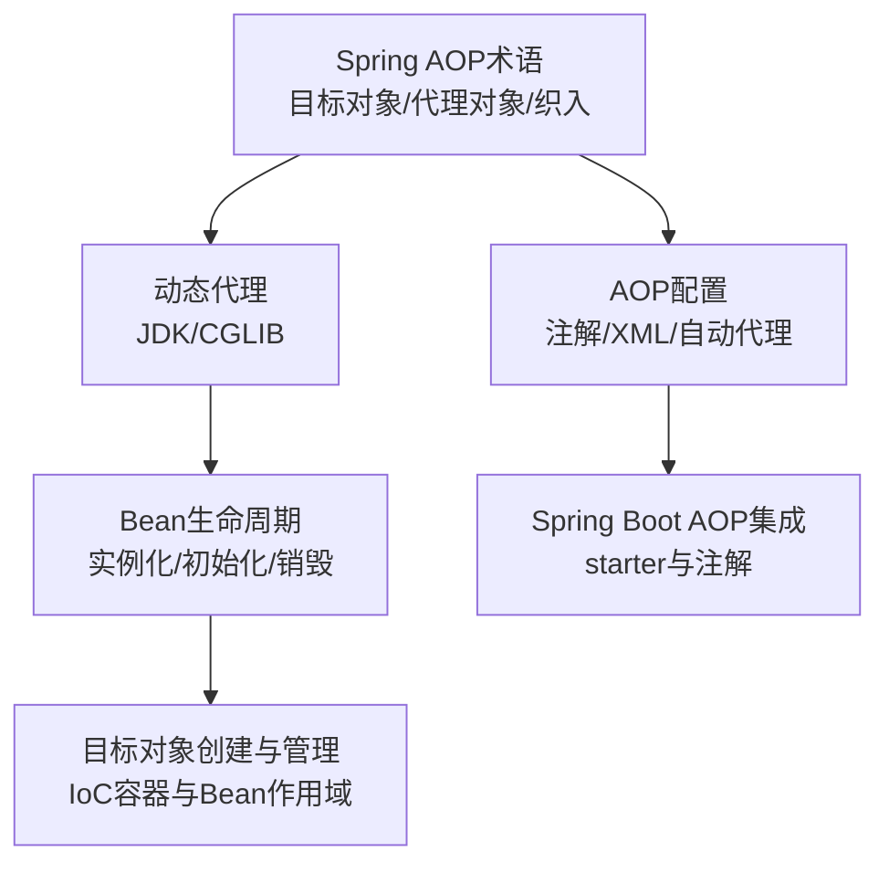
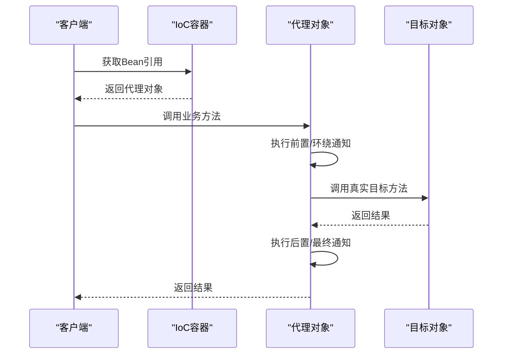
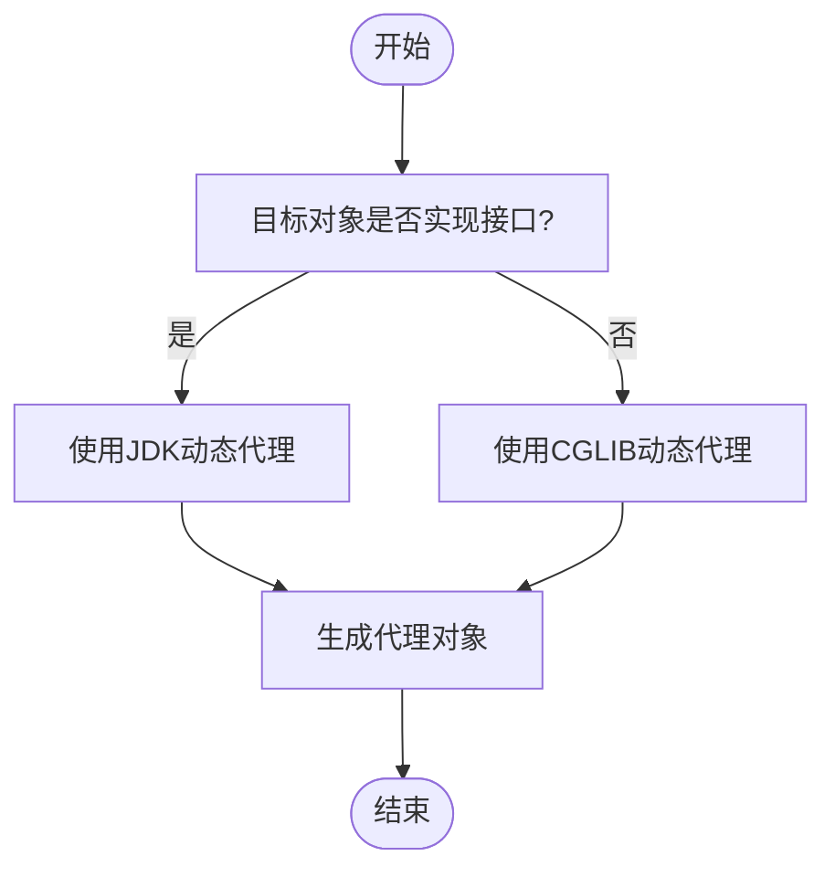
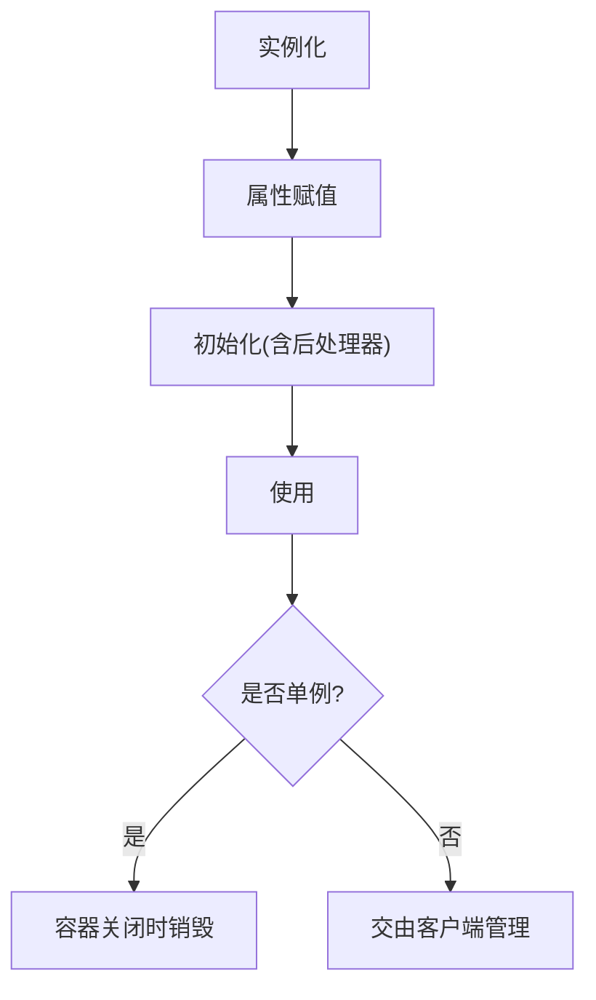
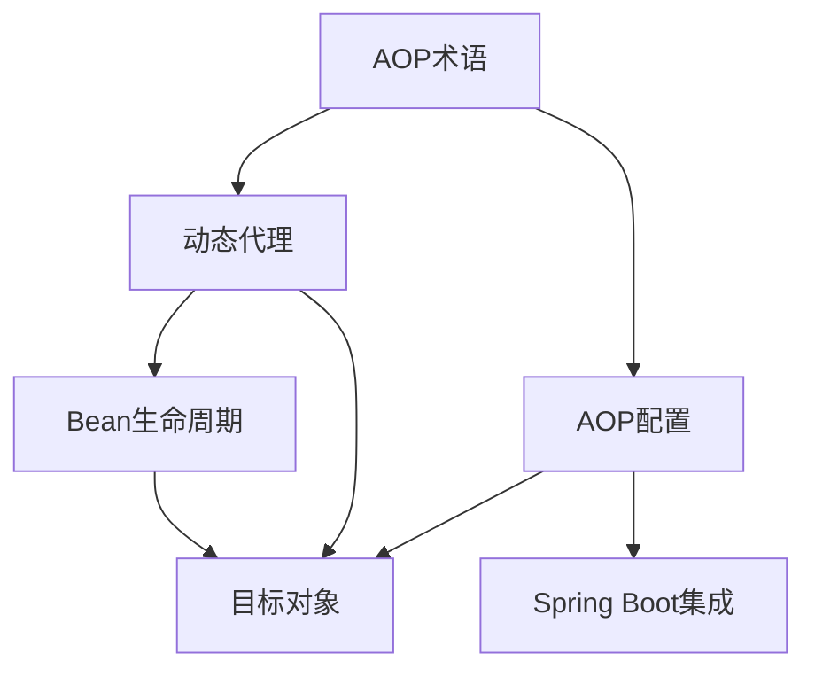

# 目标对象(Target)

<cite>
**本文引用的文件**
- [spring.md](file://docs/backend-base/spring/spring.md)
- [spring-boot.md](file://docs/backend-base/spring/spring-boot.md)
- [spring-boot-my.md](file://docs/backend-base/spring/spring-boot-my.md)
</cite>

## 目录
1. [引言](#引言)
2. [项目结构](#项目结构)
3. [核心组件](#核心组件)
4. [架构总览](#架构总览)
5. [详细组件分析](#详细组件分析)
6. [依赖分析](#依赖分析)
7. [性能考虑](#性能考虑)
8. [故障排查指南](#故障排查指南)
9. [结论](#结论)
10. [附录](#附录)

## 引言
本篇文档围绕Spring AOP中的“目标对象”展开，系统阐述其定义、在AOP体系中的地位、与“代理对象”的区别与联系、创建与管理、生命周期、配置与使用、监控与调试技巧，并给出可操作的最佳实践建议。读者无需具备深厚的AOP背景，也能循序渐进地理解目标对象的概念与应用。

## 项目结构
本仓库以知识文档为主，目标对象相关内容主要分布在Spring专题文档中，涵盖AOP术语、动态代理、Bean生命周期、以及Spring Boot中AOP的集成方式。下图展示与目标对象相关的核心章节在文档中的分布与关联：

**图表来源**
- [spring.md:7986-8061](file://docs/backend-base/spring/spring.md#L7986-L8061)
- [spring.md:7512-7985](file://docs/backend-base/spring/spring.md#L7512-L7985)
- [spring.md:4002-4271](file://docs/backend-base/spring/spring.md#L4002-L4271)
- [spring.md:8165-8265](file://docs/backend-base/spring/spring.md#L8165-L8265)
- [spring-boot.md:1897-2016](file://docs/backend-base/spring/spring-boot.md#L1897-L2016)

**章节来源**
- [spring.md:7986-8061](file://docs/backend-base/spring/spring.md#L7986-L8061)
- [spring.md:7512-7985](file://docs/backend-base/spring/spring.md#L7512-L7985)
- [spring.md:4002-4271](file://docs/backend-base/spring/spring.md#L4002-L4271)
- [spring.md:8165-8265](file://docs/backend-base/spring/spring.md#L8165-L8265)
- [spring-boot.md:1897-2016](file://docs/backend-base/spring/spring-boot.md#L1897-L2016)

## 核心组件
- 目标对象（Target）：被AOP织入通知的对象，即原始业务类或业务方法所在对象。
- 代理对象（Proxy）：目标对象被织入通知后产生的新对象，对外表现为目标对象，但内部已嵌入横切逻辑。
- 动态代理机制：Spring AOP底层依赖JDK动态代理或CGLIB动态代理，依据目标对象是否实现接口自动选择策略。
- Bean生命周期：目标对象作为Spring Bean，遵循实例化、属性赋值、初始化、使用、销毁的完整生命周期。
- AOP配置：通过注解（@Aspect、@Component、@EnableAspectJAutoProxy）或XML配置（<aop:aspectj-autoproxy>）启用自动代理。

**章节来源**
- [spring.md:7986-8061](file://docs/backend-base/spring/spring.md#L7986-L8061)
- [spring.md:7512-7985](file://docs/backend-base/spring/spring.md#L7512-L7985)
- [spring.md:4002-4271](file://docs/backend-base/spring/spring.md#L4002-L4271)
- [spring.md:8165-8265](file://docs/backend-base/spring/spring.md#L8165-L8265)

## 架构总览
下图展示了目标对象在Spring AOP中的位置与流转关系：目标对象进入IoC容器后，经由自动代理机制生成代理对象，随后在运行时由客户端通过代理对象调用，代理对象内部再调用目标对象的真实方法。

**图表来源**
- [spring.md:7986-8061](file://docs/backend-base/spring/spring.md#L7986-L8061)
- [spring.md:8165-8265](file://docs/backend-base/spring/spring.md#L8165-L8265)

## 详细组件分析

### 目标对象的定义与角色
- 定义：目标对象是被AOP切点选中并织入通知的原始业务对象，其方法成为“连接点”，可被“切点”定位并“织入”横切逻辑。
- 角色：在AOP执行链路中处于“被增强”的核心位置，承载真正的业务逻辑；对外表现与普通Bean一致，但内部已被代理对象包装。

**章节来源**
- [spring.md:8041-8061](file://docs/backend-base/spring/spring.md#L8041-L8061)

### 目标对象与代理对象的区别与联系
- 区别
  - 目标对象：原始业务类，未被织入横切逻辑。
  - 代理对象：由Spring在运行时生成的新对象，持有对目标对象的引用，并在调用前后插入通知。
- 联系
  - 代理对象对外行为与目标对象一致，客户端通常无感知差异。
  - 代理对象内部委托目标对象执行真实业务逻辑，确保横切逻辑在不侵入核心代码的前提下生效。

**章节来源**
- [spring.md:7986-8061](file://docs/backend-base/spring/spring.md#L7986-L8061)

### 动态代理与目标对象的关系
- JDK动态代理：仅能代理实现接口的目标对象；通过InvocationHandler在调用前后织入通知。
- CGLIB动态代理：可代理类（无需接口），通过MethodInterceptor拦截方法调用；适用于无接口实现的类。
- Spring自动选择：若目标对象实现接口，默认JDK代理；否则自动切换CGLIB。

**图表来源**
- [spring.md:7512-7985](file://docs/backend-base/spring/spring.md#L7512-L7985)

**章节来源**
- [spring.md:7512-7985](file://docs/backend-base/spring/spring.md#L7512-L7985)

### 目标对象的创建、管理与生命周期
- 创建与管理
  - 目标对象作为Spring Bean被容器管理，可通过@Component、XML配置等方式纳入容器。
  - 自动代理通过@EnableAspectJAutoProxy或<aop:aspectj-autoproxy>启用，容器在后处理阶段为目标对象生成代理。
- 生命周期
  - 实例化 → 属性赋值 → 初始化（含BeanPostProcessor）→ 使用 → 销毁（单例）。
  - prototype作用域：容器仅负责创建，后续生命周期不由容器管理。

**图表来源**
- [spring.md:4002-4271](file://docs/backend-base/spring/spring.md#L4002-L4271)

**章节来源**
- [spring.md:4002-4271](file://docs/backend-base/spring/spring.md#L4002-L4271)

### 目标对象的配置与使用
- 注解式配置（Spring）
  - 目标类与切面类均使用@Component纳入容器。
  - XML启用自动代理：<aop:aspectj-autoproxy proxy-target-class="true/false">。
  - 全注解配置：@Configuration + @EnableAspectJAutoProxy。
- XML配置（Spring）
  - 定义目标Bean与切面Bean，使用<aop:config>/<aop:aspect>/<aop:around>等元素织入通知。
- Spring Boot集成
  - 引入spring-boot-starter-aop，使用@EnableAspectJAutoProxy与@Aspect等注解完成AOP开发。

**章节来源**
- [spring.md:8165-8265](file://docs/backend-base/spring/spring.md#L8165-L8265)
- [spring.md:8266-8284](file://docs/backend-base/spring/spring.md#L8266-L8284)
- [spring.md:8297-8396](file://docs/backend-base/spring/spring.md#L8297-L8396)
- [spring-boot.md:1897-2016](file://docs/backend-base/spring/spring-boot.md#L1897-L2016)

### 目标对象的监控与调试技巧
- 通知顺序与异常处理
  - 前置/环绕/后置/异常/最终通知的执行顺序与异常分支行为可借助测试验证。
  - 异常发生时，最终通知仍会执行（位于finally块），后置与环绕结束部分不会执行。
- 切面优先级
  - 使用@Order控制多个切面的执行顺序，数值越小优先级越高。
- 切点复用
  - 使用@Pointcut抽取公共切点表达式，避免重复与维护成本。

**章节来源**
- [spring.md:8297-8396](file://docs/backend-base/spring/spring.md#L8297-L8396)
- [spring.md:8493-8598](file://docs/backend-base/spring/spring.md#L8493-L8598)

## 依赖分析
- AOP术语与动态代理
  - 目标对象与代理对象是AOP术语中的关键概念，二者通过动态代理实现横切逻辑的织入。
- Bean生命周期与目标对象
  - 目标对象遵循Bean生命周期，初始化阶段可被后处理器观察与增强。
- AOP配置与目标对象
  - 自动代理配置决定目标对象是否被代理；proxy-target-class控制JDK/CGLIB策略。
- Spring Boot与目标对象
  - starter简化AOP依赖与配置，目标对象与切面类仍按传统方式声明与启用。

**图表来源**
- [spring.md:7986-8061](file://docs/backend-base/spring/spring.md#L7986-L8061)
- [spring.md:7512-7985](file://docs/backend-base/spring/spring.md#L7512-L7985)
- [spring.md:4002-4271](file://docs/backend-base/spring/spring.md#L4002-L4271)
- [spring.md:8165-8265](file://docs/backend-base/spring/spring.md#L8165-L8265)
- [spring-boot.md:1897-2016](file://docs/backend-base/spring/spring-boot.md#L1897-L2016)

**章节来源**
- [spring.md:7986-8061](file://docs/backend-base/spring/spring.md#L7986-L8061)
- [spring.md:7512-7985](file://docs/backend-base/spring/spring.md#L7512-L7985)
- [spring.md:4002-4271](file://docs/backend-base/spring/spring.md#L4002-L4271)
- [spring.md:8165-8265](file://docs/backend-base/spring/spring.md#L8165-L8265)
- [spring-boot.md:1897-2016](file://docs/backend-base/spring/spring-boot.md#L1897-L2016)

## 性能考虑
- 代理策略选择
  - JDK动态代理适用于实现接口的类，开销较低；CGLIB适用于无接口类，性能略优但生成字节码成本更高。
- 通知数量与顺序
  - 切面过多或顺序不当会影响调用链长度与异常处理路径，应合理拆分与排序。
- Bean作用域
  - prototype作用域的Bean生命周期不由容器管理，避免在代理对象上产生不必要的状态共享。

[本节为通用指导，不直接分析具体文件]

## 故障排查指南
- 代理未生效
  - 检查是否启用自动代理（XML或注解）；确认proxy-target-class配置与目标对象是否实现接口。
- 通知未按预期执行
  - 核对通知顺序与异常分支；必要时使用@Order调整优先级。
- 切点表达式不匹配
  - 使用@Pointcut抽取并统一维护切点表达式，避免重复与遗漏。
- 生命周期异常
  - 单例Bean的销毁需容器正常关闭；prototype Bean的生命周期不由容器管理。

**章节来源**
- [spring.md:8165-8265](file://docs/backend-base/spring/spring.md#L8165-L8265)
- [spring.md:8297-8396](file://docs/backend-base/spring/spring.md#L8297-L8396)
- [spring.md:8493-8598](file://docs/backend-base/spring/spring.md#L8493-L8598)
- [spring.md:4002-4271](file://docs/backend-base/spring/spring.md#L4002-L4271)

## 结论
目标对象是Spring AOP中被横切逻辑增强的核心载体。通过理解其与代理对象的关系、动态代理的选择策略、以及在IoC容器中的生命周期与配置方式，开发者可以更稳健地设计与实现AOP方案。配合通知顺序、切点复用与调试技巧，可有效提升系统的可维护性与可观测性。

[本节为总结性内容，不直接分析具体文件]

## 附录
- 关键术语速览
  - 目标对象：被织入通知的对象。
  - 代理对象：织入通知后的运行时对象。
  - 动态代理：JDK/CGLIB在运行时生成代理类的技术。
  - 切点：真正织入通知的方法集合。
  - 通知：具体要织入的横切逻辑。
  - 织入：将通知应用到目标对象的过程。
- 推荐实践
  - 明确目标对象职责，保持核心业务清晰。
  - 合理选择代理策略，尽量使用JDK代理以降低复杂度。
  - 使用@Order与@Pointcut提升可维护性。
  - 在Spring Boot中通过starter简化AOP配置。

[本节为概览性内容，不直接分析具体文件]