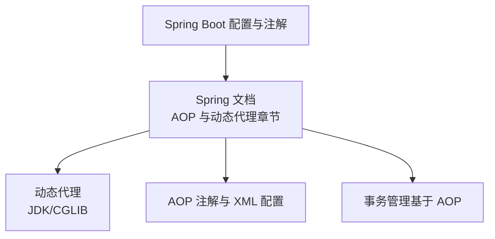
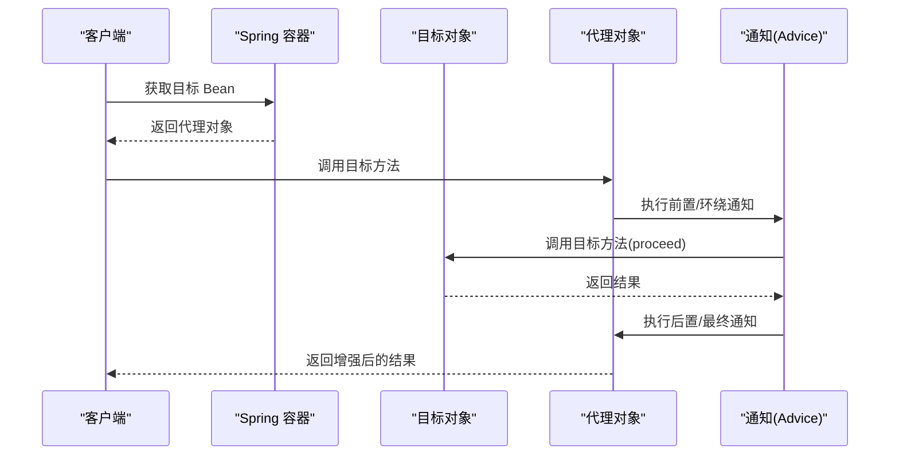
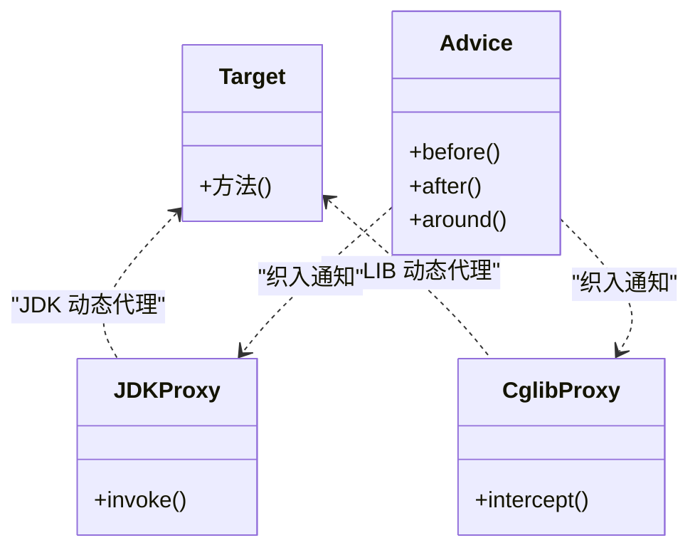
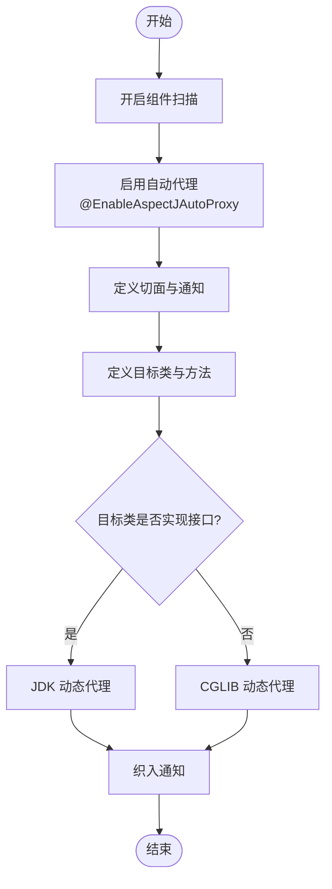
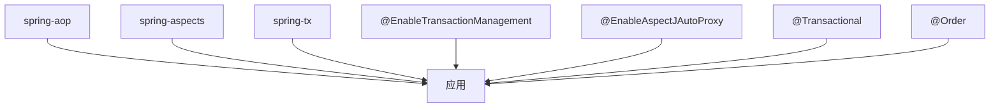

# 织入(Weaving)

<cite>
**本文引用的文件**
- [spring.md](file://docs/backend-base/spring/spring.md)
- [spring-boot-my.md](file://docs/backend-base/spring/spring-boot-my.md)
</cite>

## 目录
1. [引言](#引言)
2. [项目结构](#项目结构)
3. [核心组件](#核心组件)
4. [架构总览](#架构总览)
5. [详细组件分析](#详细组件分析)
6. [依赖分析](#依赖分析)
7. [性能考虑](#性能考虑)
8. [故障排查指南](#故障排查指南)
9. [结论](#结论)
10. [附录](#附录)

## 引言
本篇文档围绕 Spring AOP 的织入(Weaving)展开，系统阐述织入的定义、作用与实现机制，详解三种织入方式（编译时、类加载时、运行时）的差异与适用场景；深入解析动态代理与 CGLIB 代理在 Spring AOP 中的织入实现原理；给出织入过程的配置与使用路径指引；并总结织入对性能的影响及优化策略，帮助开发者建立对 AOP 织入的完整认知与实践能力。

## 项目结构
本仓库中与 Spring AOP 织入相关的内容主要集中在后端基础文档下的 Spring 章节，涵盖 AOP 基础、动态代理、CGLIB 代理、注解与 XML 配置的 AOP 开发、以及基于 AOP 的事务管理等主题。这些内容为织入概念提供了丰富的背景知识与实践示例。

**章节来源**
- [spring.md: AOP 与动态代理章节:7512-7985](file://docs/backend-base/spring/spring.md#L7512-L7985)
- [spring.md: AOP 注解与 XML 配置章节:8118-8656](file://docs/backend-base/spring/spring.md#L8118-L8656)
- [spring.md: 事务管理（基于 AOP）章节:9442-9952](file://docs/backend-base/spring/spring.md#L9442-L9952)
- [spring-boot-my.md: Spring Boot 注解与配置章节:43-288](file://docs/backend-base/spring/spring-boot-my.md#L43-L288)

## 核心组件
- AOP 核心概念与术语
  - 切面(Aspect)：横切关注点的模块化封装，包含通知与切点。
  - 通知(Advice)：在连接点执行的动作，包括前置、后置、异常、最终、环绕通知。
  - 切点(Pointcut)：匹配连接点的表达式，决定哪些方法被增强。
  - 连接点(Join Point)：程序执行过程中的某个点，如方法调用、异常抛出等。
  - 目标对象(Target)：被增强的对象。
  - 代理(Proxy)：Spring AOP 生成的增强对象，持有目标对象并转发调用。
  - 自动代理@EnableAspectJAutoProxy：开启基于 AspectJ 注解的自动代理。
  - 通知顺序与优先级：通过 @Order 控制多个切面的执行顺序。

- 动态代理与 CGLIB 代理
  - JDK 动态代理：基于接口的代理，适用于实现接口的目标类。
  - CGLIB 动态代理：基于继承的代理，适用于无接口或强制使用类代理的场景。
  - Spring 在两者间自动切换：默认优先 JDK 动态代理，若目标类无接口则使用 CGLIB。

- 织入方式
  - Spring + AspectJ 的注解式与 XML 式 AOP 开发，均属于运行时织入范畴。
  - 编译时织入与类加载时织入在本仓库文档中未直接展开，但可参考 Spring AOP 的运行时织入机制理解其差异。

**章节来源**
- [spring.md: AOP 与动态代理章节:7512-7985](file://docs/backend-base/spring/spring.md#L7512-L7985)
- [spring.md: AOP 注解与 XML 配置章节:8118-8656](file://docs/backend-base/spring/spring.md#L8118-L8656)
- [spring.md: 事务管理（基于 AOP）章节:9442-9952](file://docs/backend-base/spring/spring.md#L9442-L9952)

## 架构总览
下图展示了 Spring AOP 在运行时通过自动代理生成代理对象，将通知织入到目标对象的方法调用链路中，形成横切增强的效果。

**图表来源**
- [spring.md: AOP 注解与 XML 配置章节:8118-8656](file://docs/backend-base/spring/spring.md#L8118-L8656)

## 详细组件分析

### 织入的定义、作用与实现机制
- 定义：织入是指将切面逻辑（通知）按规则织入到目标对象的方法调用链路中，形成增强后的执行流程。
- 作用：将横切关注点（如日志、事务、安全）与核心业务解耦，提升模块化与可维护性。
- 实现机制：Spring AOP 在运行时通过自动代理生成代理对象，将通知织入到目标方法前后或异常路径中。

**章节来源**
- [spring.md: AOP 与动态代理章节:7512-7985](file://docs/backend-base/spring/spring.md#L7512-L7985)
- [spring.md: AOP 注解与 XML 配置章节:8118-8656](file://docs/backend-base/spring/spring.md#L8118-L8656)

### 三种织入方式对比与适用场景
- 编译时织入（CTW）
  - 特点：在编译阶段将切面逻辑直接嵌入到目标类字节码中，运行时无需额外代理。
  - 适用：对性能敏感、希望在编译期完成增强的场景。
  - 注意：本仓库文档未直接展开编译时织入的配置与实现细节。
- 类加载时织入（LTW）
  - 特点：在类加载阶段通过织入器修改字节码，实现增强。
  - 适用：需要对现有类库或第三方类进行增强，且无法在编译期介入的场景。
  - 注意：本仓库文档未直接展开类加载时织入的配置与实现细节。
- 运行时织入（RTW）
  - 特点：Spring AOP 默认采用的方式，通过自动代理在运行时生成代理对象，将通知织入目标方法。
  - 适用：大多数业务场景，便于配置与调试，支持注解与 XML 双通道。
  - 关键配置：启用自动代理与代理策略（JDK/CGLIB）。

**章节来源**
- [spring.md: AOP 注解与 XML 配置章节:8118-8656](file://docs/backend-base/spring/spring.md#L8118-L8656)

### 动态代理与 CGLIB 代理的织入实现原理
- JDK 动态代理
  - 通过实现 InvocationHandler 接口，在代理对象上调用目标方法时触发回调，从而织入通知。
  - 限制：仅能代理实现接口的目标类。
- CGLIB 动态代理
  - 通过继承目标类生成子类代理，拦截方法调用，实现通知织入。
  - 优势：可代理无接口类，性能优于早期 Javassist。
- Spring 代理策略
  - 默认优先 JDK 动态代理；当目标类未实现接口时自动切换至 CGLIB。
  - 可通过配置强制使用 CGLIB 或 JDK 代理。

**图表来源**
- [spring.md: 动态代理章节:7512-7985](file://docs/backend-base/spring/spring.md#L7512-L7985)

**章节来源**
- [spring.md: 动态代理章节:7512-7985](file://docs/backend-base/spring/spring.md#L7512-L7985)

### 织入过程的配置与使用路径
- 注解式 AOP（推荐）
  - 步骤要点：定义目标类与切面类，开启组件扫描与自动代理，编写通知与切点表达式。
  - 关键配置：启用自动代理与代理策略（JDK/CGLIB）。
  - 示例路径：见“基于 AspectJ 的 AOP 注解式开发”章节。
- XML 式 AOP（了解）
  - 步骤要点：定义目标 Bean、切面 Bean、配置通知与切面，使用 aop:config。
  - 示例路径：见“基于 XML 配置方式的 AOP（了解）”章节。
- 事务管理（基于 AOP）
  - 步骤要点：配置事务管理器、开启事务注解驱动、在类或方法上添加 @Transactional。
  - 示例路径：见“声明式事务之注解实现方式”章节。

**图表来源**
- [spring.md: AOP 注解与 XML 配置章节:8118-8656](file://docs/backend-base/spring/spring.md#L8118-L8656)

**章节来源**
- [spring.md: AOP 注解与 XML 配置章节:8118-8656](file://docs/backend-base/spring/spring.md#L8118-L8656)
- [spring.md: 事务管理（基于 AOP）章节:9442-9952](file://docs/backend-base/spring/spring.md#L9442-L9952)

### 通知类型与执行顺序
- 通知类型：前置、后置、环绕、异常、最终通知。
- 执行顺序：环绕通知最先执行，随后是前置通知；目标方法执行后依次执行后置与最终通知；异常时执行异常通知与最终通知。
- 多切面顺序：通过 @Order 控制优先级，数值越小优先级越高。

**章节来源**
- [spring.md: AOP 注解与 XML 配置章节:8288-8656](file://docs/backend-base/spring/spring.md#L8288-L8656)

## 依赖分析
- Spring AOP 与事务管理依赖
  - spring-aop：AOP 核心能力。
  - spring-aspects：对 AspectJ 的支持。
  - spring-tx：声明式事务管理。
- Spring Boot 注解与配置
  - @EnableTransactionManagement：开启事务注解驱动。
  - @EnableAspectJAutoProxy：开启自动代理。
  - @Transactional：声明式事务注解。
  - @Order：控制切面执行顺序。

**图表来源**
- [spring.md: AOP 注解与 XML 配置章节:8118-8656](file://docs/backend-base/spring/spring.md#L8118-L8656)
- [spring.md: 事务管理（基于 AOP）章节:9442-9952](file://docs/backend-base/spring/spring.md#L9442-L9952)
- [spring-boot-my.md: Spring Boot 注解与配置章节:43-288](file://docs/backend-base/spring/spring-boot-my.md#L43-L288)

**章节来源**
- [spring.md: AOP 注解与 XML 配置章节:8118-8656](file://docs/backend-base/spring/spring.md#L8118-L8656)
- [spring.md: 事务管理（基于 AOP）章节:9442-9952](file://docs/backend-base/spring/spring.md#L9442-L9952)
- [spring-boot-my.md: Spring Boot 注解与配置章节:43-288](file://docs/backend-base/spring/spring-boot-my.md#L43-L288)

## 性能考虑
- 代理策略选择
  - JDK 动态代理：接口代理，开销较低，适合实现接口的目标类。
  - CGLIB 动态代理：类继承代理，性能优于早期 Javassist，适合无接口或强制类代理场景。
- 通知数量与复杂度
  - 通知过多或逻辑复杂会增加方法调用链开销，应合理拆分与合并切点。
- 事务管理
  - 声明式事务通过 AOP 实现，事务边界与传播行为会影响性能，应按需配置。
- 日志与监控
  - 在高频路径上谨慎使用日志与监控，避免成为性能瓶颈。

[本节为通用性能建议，不直接分析具体文件]

## 故障排查指南
- 代理未生效
  - 检查是否开启自动代理与组件扫描。
  - 确认目标类与切面类纳入 Spring 容器管理。
- 通知未执行
  - 检查切点表达式是否正确匹配目标方法。
  - 确认通知类型与执行顺序满足预期。
- 多切面冲突
  - 使用 @Order 控制执行顺序，避免互相覆盖。
- 事务未生效
  - 检查事务管理器配置与事务注解驱动是否启用。
  - 确认异常类型与回滚策略配置。

**章节来源**
- [spring.md: AOP 注解与 XML 配置章节:8118-8656](file://docs/backend-base/spring/spring.md#L8118-L8656)
- [spring.md: 事务管理（基于 AOP）章节:9442-9952](file://docs/backend-base/spring/spring.md#L9442-L9952)

## 结论
织入是 AOP 的核心机制，Spring AOP 通过运行时织入在不改变目标代码的前提下，将横切关注点织入到目标方法调用链中。JDK 与 CGLIB 动态代理分别适用于接口与类代理场景，Spring 在两者间自动切换并提供灵活的代理策略配置。结合注解与 XML 的 AOP 开发方式，配合 @Order 与 @Transactional 等注解，可高效实现日志、事务、安全等横切功能。在实践中应关注代理策略、通知复杂度与事务配置对性能的影响，并通过合理的切点与顺序控制保障系统稳定性与可维护性。

[本节为总结性内容，不直接分析具体文件]

## 附录
- 相关实现路径（以文件与行号定位）
  - AOP 与动态代理章节：[spring.md:7512-7985](file://docs/backend-base/spring/spring.md#L7512-L7985)
  - AOP 注解与 XML 配置章节：[spring.md:8118-8656](file://docs/backend-base/spring/spring.md#L8118-L8656)
  - 事务管理（基于 AOP）章节：[spring.md:9442-9952](file://docs/backend-base/spring/spring.md#L9442-L9952)
  - Spring Boot 注解与配置章节：[spring-boot-my.md:43-288](file://docs/backend-base/spring/spring-boot-my.md#L43-L288)