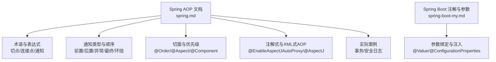
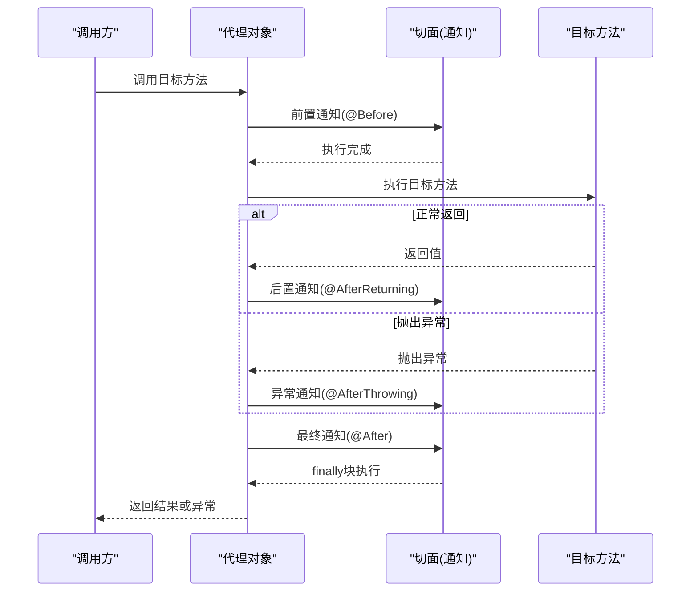
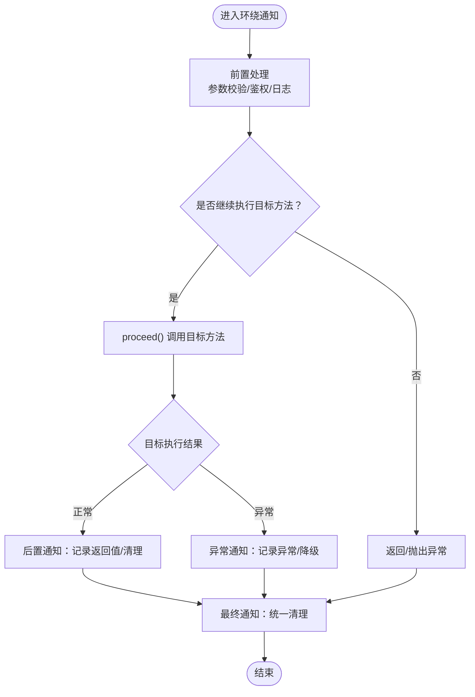
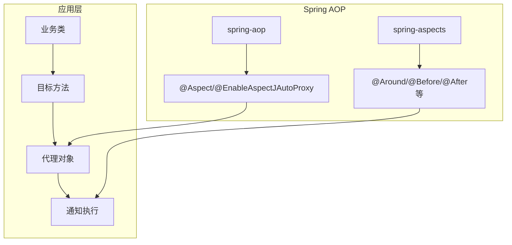

# 通知(Advice)

<cite>
**本文引用的文件**
- [spring.md](file://docs/backend-base/spring/spring.md)
- [spring-boot-my.md](file://docs/backend-base/spring/spring-boot-my.md)
</cite>

## 目录
1. [引言](#引言)
2. [项目结构](#项目结构)
3. [核心组件](#核心组件)
4. [架构总览](#架构总览)
5. [详细组件分析](#详细组件分析)
6. [依赖分析](#依赖分析)
7. [性能考虑](#性能考虑)
8. [故障排查指南](#故障排查指南)
9. [结论](#结论)
10. [附录](#附录)

## 引言
本篇文档围绕Spring AOP中的“通知(Advice)”展开，系统阐述通知的定义、作用与执行时机，详解五种通知类型：前置通知、后置通知、异常通知、最终通知、环绕通知，并给出执行顺序、生命周期管理、参数绑定与处理方法、最佳实践与常见问题排查。读者可据此快速掌握AOP通知在实际项目中的落地方式与注意事项。

## 项目结构
本仓库与Spring AOP通知相关的内容集中在“docs/backend-base/spring/spring.md”中，涵盖AOP术语、切点表达式、通知类型、执行顺序、切面优先级、基于注解与XML的AOP配置、以及事务与日志等实际案例。此外，“docs/backend-base/spring/spring-boot-my.md”提供了Spring Boot常用注解与参数绑定的基础知识，有助于理解通知参数的注入与处理。

图表来源
- [spring.md](file://docs/backend-base/spring/spring.md)
- [spring-boot-my.md](file://docs/backend-base/spring/spring-boot-my.md)

章节来源
- [spring.md:8041-8127](file://docs/backend-base/spring/spring.md#L8041-L8127)
- [spring.md:8118-8127](file://docs/backend-base/spring/spring.md#L8118-L8127)
- [spring-boot-my.md:43-288](file://docs/backend-base/spring/spring-boot-my.md#L43-L288)

## 核心组件
- 通知(Advice)：织入到目标方法的横切逻辑，包括前置、后置、异常、最终、环绕五类。
- 切点(Pointcut)：定义“在哪里”织入，使用execution等表达式匹配目标方法。
- 切面(Aspect)：切点+通知的组合，承载横切逻辑。
- 代理对象：目标对象被织入通知后产生的代理对象，承载通知执行。
- 生命周期：通知在目标方法执行前、后、异常、finally块及环绕控制下按序执行。

章节来源
- [spring.md:8041-8061](file://docs/backend-base/spring/spring.md#L8041-L8061)
- [spring.md:8065-8117](file://docs/backend-base/spring/spring.md#L8065-L8117)

## 架构总览
下图展示通知在目标方法执行期间的生命周期与执行顺序：

图表来源
- [spring.md:8290-8396](file://docs/backend-base/spring/spring.md#L8290-L8396)

章节来源
- [spring.md:8290-8396](file://docs/backend-base/spring/spring.md#L8290-L8396)

## 详细组件分析

### 通知类型与执行时机
- 前置通知(@Before)：目标方法执行之前触发，适合预处理、鉴权、参数校验等。
- 后置通知(@AfterReturning)：目标方法成功返回之后触发，适合记录返回值、清理资源等。
- 异常通知(@AfterThrowing)：目标方法抛出异常后触发，适合异常统计、降级处理等。
- 最终通知(@After)：无论是否异常都会在finally块中执行，适合统一清理、释放资源等。
- 环绕通知(@Around)：可完全控制目标方法的执行，适合性能监控、事务控制、参数拦截等。

章节来源
- [spring.md:8290-8296](file://docs/backend-base/spring/spring.md#L8290-L8296)
- [spring.md:8317-8336](file://docs/backend-base/spring/spring.md#L8317-L8336)

### 执行顺序与优先级
- 单一切面内：前置→目标→后置/异常→最终。
- 多切面时：可通过@Order(value)设定优先级，数值越小优先级越高。
- 测试表明：异常发生时，后置与环绕结束部分不会执行，最终通知仍会在finally中执行。

章节来源
- [spring.md:8398-8492](file://docs/backend-base/spring/spring.md#L8398-L8492)
- [spring.md:8393-8396](file://docs/backend-base/spring/spring.md#L8393-L8396)

### 切点表达式与复用
- execution语法：可精确匹配返回值、类名、方法名、参数与异常类型。
- 使用@Pointcut抽取公共切点，避免重复与维护成本。
- 示例：对某包下所有方法或以save/delete/modify开头的方法进行切点定义。

章节来源
- [spring.md:8067-8117](file://docs/backend-base/spring/spring.md#L8067-L8117)
- [spring.md:8545-8593](file://docs/backend-base/spring/spring.md#L8545-L8593)

### 注解式与XML式AOP
- 注解式：@Aspect、@EnableAspectJAutoProxy(proxyTargetClass=true)、@Component等。
- XML式：aop:config、aop:aspect、aop:pointcut、aop:around等。
- 全注解式配置：通过@Configuration类替代XML配置，便于迁移与维护。

章节来源
- [spring.md:8599-8625](file://docs/backend-base/spring/spring.md#L8599-L8625)
- [spring.md:8626-8706](file://docs/backend-base/spring/spring.md#L8626-L8706)

### 实际案例：事务控制
- 使用环绕通知实现事务控制：开启事务→执行目标→提交/回滚。
- 切点覆盖biz包下所有业务方法，确保事务横切一致。
- 测试验证：异常时自动回滚，正常时提交。

章节来源
- [spring.md:8880-8938](file://docs/backend-base/spring/spring.md#L8880-L8938)

### 实际案例：安全日志
- 基于前置通知记录操作员与方法签名，支持save/delete/modify等操作。
- 使用JoinPoint获取方法签名与参数，实现统一日志采集。

章节来源
- [spring.md:8990-9038](file://docs/backend-base/spring/spring.md#L8990-L9038)

### 通知参数绑定与处理
- JoinPoint：获取方法签名、参数数组、目标对象等。
- ProceedingJoinPoint：环绕通知中可proceed()调用目标方法，支持拦截与重试。
- 参数绑定：结合@Value、@ConfigurationProperties等注解，实现配置注入与参数校验。

章节来源
- [spring.md:9013-9017](file://docs/backend-base/spring/spring.md#L9013-L9017)
- [spring.md:8508-8515](file://docs/backend-base/spring/spring.md#L8508-L8515)
- [spring-boot-my.md:82-106](file://docs/backend-base/spring/spring-boot-my.md#L82-L106)

### 环绕通知流程图

图表来源
- [spring.md:8508-8515](file://docs/backend-base/spring/spring.md#L8508-L8515)
- [spring.md:8290-8396](file://docs/backend-base/spring/spring.md#L8290-L8396)

## 依赖分析
- Spring AOP依赖：spring-aop、spring-aspects、spring-context等。
- AspectJ：Spring AOP基于AspectJ实现，提供注解与XML两种配置方式。
- 事务与日志：事务控制与安全日志分别通过环绕通知与前置通知实现，体现AOP横切能力。

图表来源
- [spring.md:265-287](file://docs/backend-base/spring/spring.md#L265-L287)
- [spring.md:8118-8127](file://docs/backend-base/spring/spring.md#L8118-L8127)

章节来源
- [spring.md:265-287](file://docs/backend-base/spring/spring.md#L265-L287)
- [spring.md:8118-8127](file://docs/backend-base/spring/spring.md#L8118-L8127)

## 性能考虑
- 切点表达式应尽量精确，避免过度匹配导致代理开销增大。
- 环绕通知可实现性能监控，但需谨慎处理proceed()调用次数与异常分支。
- 多切面时合理使用@Order，减少不必要的通知链路长度。
- 日志与事务等横切逻辑应避免阻塞主线程，必要时异步化处理。

## 故障排查指南
- 通知未生效
  - 检查@EnableAspectJAutoProxy是否启用，proxyTargetClass是否正确。
  - 确认切面类被@Component扫描，且目标类在容器中。
- 执行顺序异常
  - 使用@Order调整优先级，数值越小优先级越高。
  - 排查是否存在多个切面同时对同一目标方法织入。
- 参数绑定问题
  - 使用JoinPoint/ProceedingJoinPoint获取参数数组，避免硬编码。
  - 结合@Value/@ConfigurationProperties进行配置注入与参数校验。
- 异常处理
  - 异常通知仅在抛出异常时触发，正常返回不触发。
  - 最终通知始终在finally中执行，适合统一清理。

章节来源
- [spring.md:8398-8492](file://docs/backend-base/spring/spring.md#L8398-L8492)
- [spring.md:9013-9017](file://docs/backend-base/spring/spring.md#L9013-L9017)
- [spring-boot-my.md:82-106](file://docs/backend-base/spring/spring-boot-my.md#L82-L106)

## 结论
通知是Spring AOP的核心构件，通过前置、后置、异常、最终与环绕五类通知，可实现横切关注点的统一管理。配合精确的切点表达式、合理的@Order优先级与JoinPoint参数绑定，可在不侵入业务代码的前提下，实现事务、日志、鉴权、监控等横切能力。建议在实际项目中遵循“最小侵入、最大复用”的原则，结合注解与XML两种方式，按需选择，持续优化通知链路的性能与稳定性。

## 附录
- 关键实现参考路径
  - 通知类型与顺序：[spring.md:8290-8396](file://docs/backend-base/spring/spring.md#L8290-L8396)
  - 切点表达式与复用：[spring.md:8067-8117](file://docs/backend-base/spring/spring.md#L8067-L8117)、[spring.md:8545-8593](file://docs/backend-base/spring/spring.md#L8545-L8593)
  - 注解式与XML式AOP：[spring.md:8599-8706](file://docs/backend-base/spring/spring.md#L8599-L8706)
  - 事务控制案例：[spring.md:8880-8938](file://docs/backend-base/spring/spring.md#L8880-L8938)
  - 安全日志案例：[spring.md:8990-9038](file://docs/backend-base/spring/spring.md#L8990-L9038)
  - 参数绑定与注入：[spring-boot-my.md:82-106](file://docs/backend-base/spring/spring-boot-my.md#L82-L106)