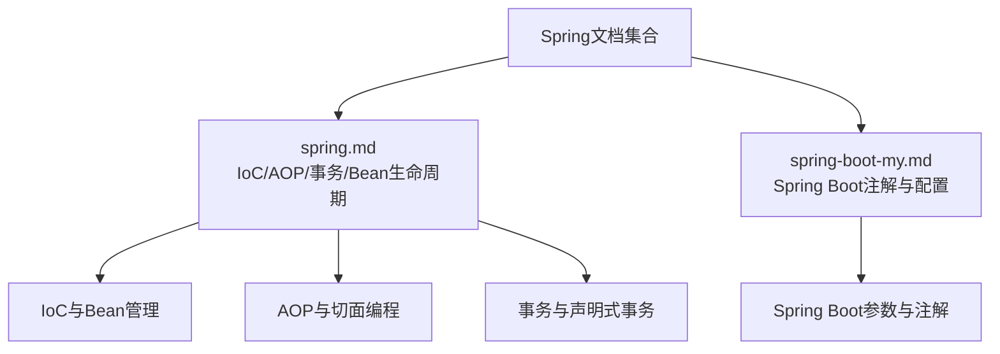
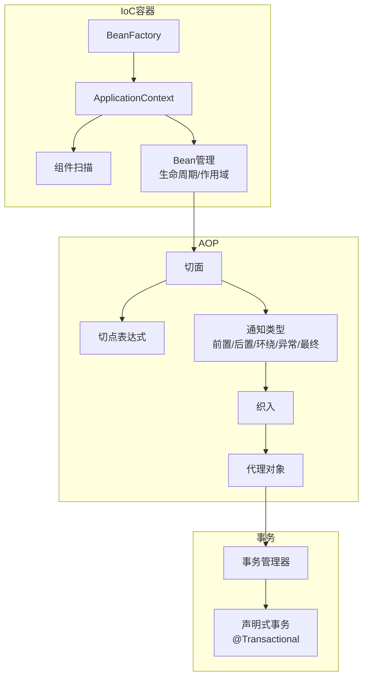
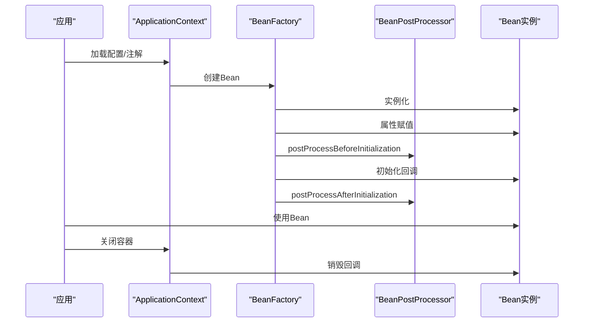
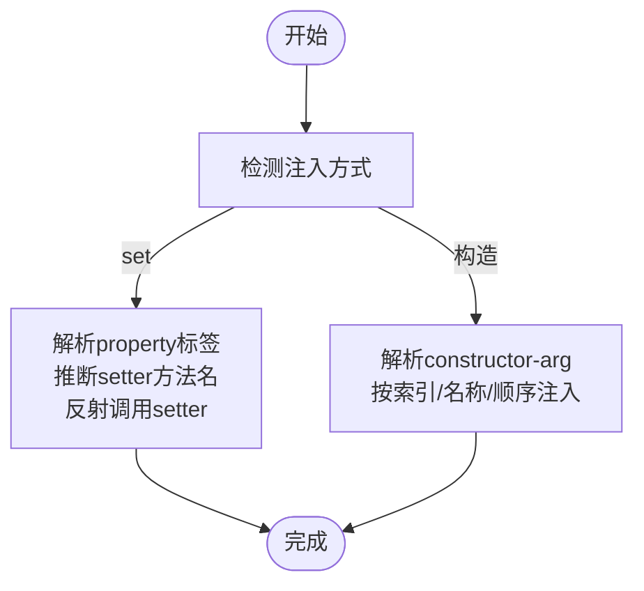
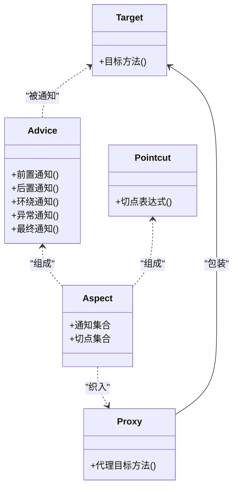
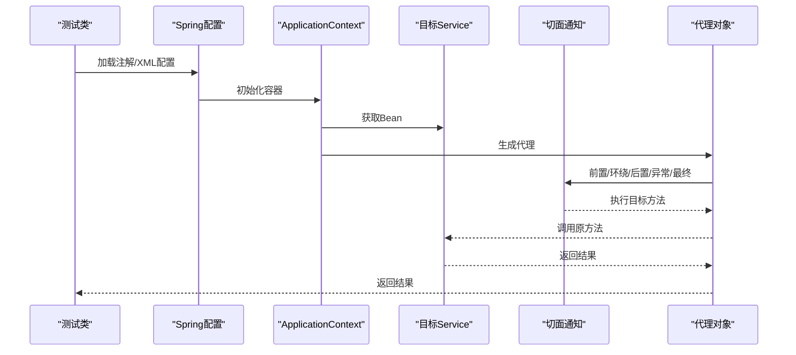
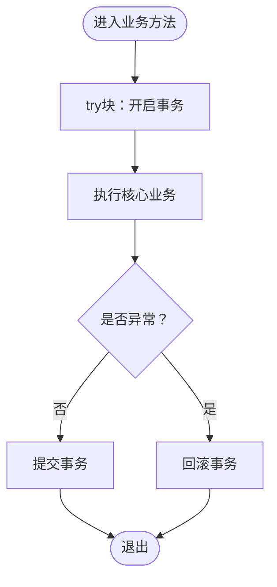
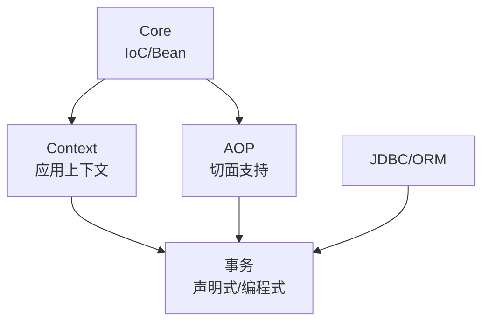

# IoC与AOP

<cite>
**本文引用的文件**
- [spring.md](file://docs/backend-base/spring/spring.md)
- [spring-boot-my.md](file://docs/backend-base/spring/spring-boot-my.md)
</cite>

## 目录
1. [引言](#引言)
2. [项目结构](#项目结构)
3. [核心组件](#核心组件)
4. [架构总览](#架构总览)
5. [详细组件分析](#详细组件分析)
6. [依赖分析](#依赖分析)
7. [性能考虑](#性能考虑)
8. [故障排查指南](#故障排查指南)
9. [结论](#结论)
10. [附录](#附录)

## 引言
本技术文档围绕Spring的IoC控制反转与AOP面向切面编程展开，系统梳理IoC容器的工作原理、Bean的创建与管理机制，详解依赖注入的两种实现方式（构造方法注入与set方法注入），并深入阐述AOP的核心概念（切面、通知、切点、织入等）。文档提供基于注解与XML配置的AOP实践范式，并结合事务管理、日志记录、安全控制等真实场景，帮助开发者建立对Spring IoC与AOP的深入理解与工程化实践能力。

## 项目结构
本仓库与Spring IoC/AOP相关的内容集中在“docs/backend-base/spring/”目录下的两篇文档：
- spring.md：系统讲解Spring框架的IoC、AOP、事务、Bean生命周期、注解与XML配置等
- spring-boot-my.md：补充Spring Boot常用注解、参数配置、统一异常处理等内容

**章节来源**
- [spring.md:1-200](file://docs/backend-base/spring/spring.md#L1-L200)
- [spring-boot-my.md:1-100](file://docs/backend-base/spring/spring-boot-my.md#L1-L100)

## 核心组件
- IoC容器与Bean管理
  - 容器初始化：解析配置文件/注解，创建Bean实例，维护Bean关系
  - Bean生命周期：实例化、属性赋值、初始化、使用、销毁
  - 作用域：singleton/prototype等
- 依赖注入（DI）
  - set方法注入：通过反射调用setter完成属性赋值
  - 构造方法注入：通过构造函数完成依赖注入
- AOP核心概念
  - 切面（Aspect）、通知（Advice）、切点（Pointcut）、织入（Weaving）、代理对象（Proxy）、目标对象（Target）
  - 通知类型：前置、后置、环绕、异常、最终
- 事务管理
  - 编程式事务与声明式事务
  - 基于注解与XML的事务配置

**章节来源**
- [spring.md:4002-4271](file://docs/backend-base/spring/spring.md#L4002-L4271)
- [spring.md:769-1108](file://docs/backend-base/spring/spring.md#L769-L1108)
- [spring.md:8041-8593](file://docs/backend-base/spring/spring.md#L8041-L8593)
- [spring.md:8707-9054](file://docs/backend-base/spring/spring.md#L8707-L9054)

## 架构总览
下图展示了Spring IoC与AOP在系统中的角色与交互关系：IoC容器负责Bean的创建与装配，AOP通过切面与通知对目标方法进行织入，事务管理作为AOP的典型应用贯穿业务层。

**图表来源**
- [spring.md:8041-8593](file://docs/backend-base/spring/spring.md#L8041-L8593)
- [spring.md:8707-9054](file://docs/backend-base/spring/spring.md#L8707-L9054)

## 详细组件分析

### IoC容器与Bean生命周期
- 生命周期阶段
  - 实例化、属性赋值、初始化、使用、销毁
  - Aware回调（BeanNameAware、BeanClassLoaderAware、BeanFactoryAware）与InitializingBean/DisposableBean
  - BeanPostProcessor在初始化前后钩入
- 作用域差异
  - singleton：容器完整生命周期管理
  - prototype：容器仅负责创建，后续生命周期不由容器管理

**图表来源**
- [spring.md:4002-4271](file://docs/backend-base/spring/spring.md#L4002-L4271)

**章节来源**
- [spring.md:4002-4271](file://docs/backend-base/spring/spring.md#L4002-L4271)

### 依赖注入：构造方法注入与set方法注入
- set方法注入
  - 通过反射调用setter完成属性赋值
  - property标签name对应属性名，ref引用其他Bean
- 构造方法注入
  - 通过构造函数完成依赖注入
  - constructor-arg支持index/name/ref多种方式

**图表来源**
- [spring.md:769-1108](file://docs/backend-base/spring/spring.md#L769-L1108)

**章节来源**
- [spring.md:769-1108](file://docs/backend-base/spring/spring.md#L769-L1108)

### AOP核心概念与通知类型
- 核心术语
  - 连接点（Joinpoint）、切点（Pointcut）、通知（Advice）、切面（Aspect）、织入（Weaving）、代理对象（Proxy）、目标对象（Target）
- 通知类型
  - 前置通知（@Before）、后置通知（@AfterReturning）、环绕通知（@Around）、异常通知（@AfterThrowing）、最终通知（@After）

**图表来源**
- [spring.md:8041-8593](file://docs/backend-base/spring/spring.md#L8041-L8593)

**章节来源**
- [spring.md:8041-8593](file://docs/backend-base/spring/spring.md#L8041-L8593)

### AOP实战：注解与XML配置
- 注解式开发（Spring + AspectJ）
  - 目标类与切面类纳入容器管理（@Component）
  - 组件扫描与@EnableAspectJAutoProxy
  - 通知方法编写与切点表达式
- XML式开发（Spring AOP）
  - aop:config、aop:aspect、aop:pointcut、aop:around等标签
  - ref引用切面Bean

**图表来源**
- [spring.md:8165-8683](file://docs/backend-base/spring/spring.md#L8165-L8683)

**章节来源**
- [spring.md:8165-8683](file://docs/backend-base/spring/spring.md#L8165-L8683)

### AOP实际案例：事务管理
- 场景：多条DML必须同时成功或同时失败
- 实现：环绕通知包裹目标方法，捕获异常并回滚
- 测试：覆盖正常提交与异常回滚两种分支

**图表来源**
- [spring.md:8707-9054](file://docs/backend-base/spring/spring.md#L8707-L9054)

**章节来源**
- [spring.md:8707-9054](file://docs/backend-base/spring/spring.md#L8707-L9054)

### AOP实际案例：安全日志
- 场景：对新增、删除、修改操作进行安全记录
- 实现：定义多个切点，前置通知记录操作员与方法名

**章节来源**
- [spring.md:8940-9038](file://docs/backend-base/spring/spring.md#L8940-L9038)

### Spring Boot中的参数配置与常用注解
- 参数配置优先级：命令行参数 > 系统属性 > properties > yml > yaml
- 常用注解：@SpringBootApplication、@EnableAutoConfiguration、@ImportResource、@Value、@ConfigurationProperties、@RestController、@RequestMapping、@RequestParam、@PathVariable、@ResponseBody、@Bean、@Controller/@Service/@Repository/@Component、@ComponentScan、@Autowired、@Configuration、@Import、@ConditionalOnExpression、@ConditionalOnClass、@ConditionalOnProperty、@ConditionOnMissingBean
- 参数校验与统一异常处理

**章节来源**
- [spring-boot-my.md:1-647](file://docs/backend-base/spring/spring-boot-my.md#L1-L647)

## 依赖分析
- Spring模块关系
  - Core：IoC与Bean管理
  - Context：扩展BeanFactory，提供上下文能力
  - AOP：面向切面编程支持
  - JDBC/ORM：事务与持久化集成
  - Web/WebFlux：Web层框架
- AOP与事务的关系
  - 事务管理基于AOP实现，通过切面织入事务控制逻辑

**图表来源**
- [spring.md:147-198](file://docs/backend-base/spring/spring.md#L147-L198)
- [spring.md:9442-9483](file://docs/backend-base/spring/spring.md#L9442-L9483)

**章节来源**
- [spring.md:147-198](file://docs/backend-base/spring/spring.md#L147-L198)
- [spring.md:9442-9483](file://docs/backend-base/spring/spring.md#L9442-L9483)

## 性能考虑
- 组件扫描与命名空间
  - 合理划分base-package，避免过度扫描
  - 使用命名空间（context/aop/tx）提升解析效率
- 代理策略
  - @EnableAspectJAutoProxy可配置proxyTargetClass，影响CGLIB与JDK动态代理的选择
- Bean作用域
  - singleton单例可减少对象创建开销；prototype由调用方管理生命周期
- 日志与监控
  - 结合日志框架与AOP记录关键路径耗时，定位性能瓶颈

[本节为通用建议，不直接分析具体文件]

## 故障排查指南
- Bean无法注入
  - 确认组件扫描路径正确
  - 检查@Autowired是否与@Component配合使用
  - 若存在多个候选Bean，使用@Qualifier指定名称
- 切面未生效
  - 确认@EnableAspectJAutoProxy已启用
  - 检查切点表达式是否匹配目标方法
  - 确认目标类与切面类均纳入容器管理
- 事务未回滚
  - 确认异常类型与回滚规则
  - 检查事务管理器配置与命名空间
  - 确认目标方法可见性与调用链（同一类内调用不会触发事务代理）
- 日志与安全记录未输出
  - 检查前置通知是否正确绑定切点
  - 确认目标方法签名与切点表达式一致

**章节来源**
- [spring.md:8165-8683](file://docs/backend-base/spring/spring.md#L8165-L8683)
- [spring.md:8707-9054](file://docs/backend-base/spring/spring.md#L8707-L9054)
- [spring-boot-my.md:1-647](file://docs/backend-base/spring/spring-boot-my.md#L1-L647)

## 结论
通过本技术文档，读者可以系统掌握Spring IoC容器的Bean生命周期与依赖注入机制，理解AOP的核心概念与通知类型，并能在实际项目中运用注解与XML两种方式实现AOP。结合事务管理、日志记录与安全控制等场景，开发者可快速构建高内聚、低耦合的企业级应用。

[本节为总结性内容，不直接分析具体文件]

## 附录
- 参考路径
  - IoC与Bean生命周期：[spring.md:4002-4271](file://docs/backend-base/spring/spring.md#L4002-L4271)
  - 依赖注入（set/构造）：[spring.md:769-1108](file://docs/backend-base/spring/spring.md#L769-L1108)
  - AOP核心与通知：[spring.md:8041-8593](file://docs/backend-base/spring/spring.md#L8041-L8593)
  - AOP注解与XML配置：[spring.md:8165-8683](file://docs/backend-base/spring/spring.md#L8165-L8683)
  - 事务管理案例：[spring.md:8707-9054](file://docs/backend-base/spring/spring.md#L8707-L9054)
  - Spring Boot参数与注解：[spring-boot-my.md:1-647](file://docs/backend-base/spring/spring-boot-my.md#L1-L647)