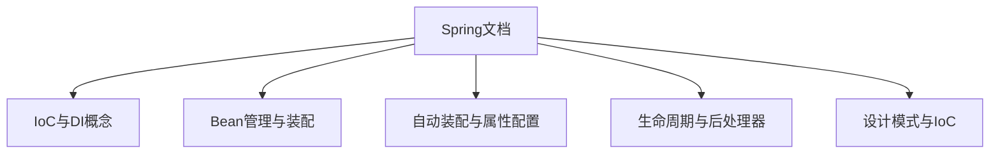
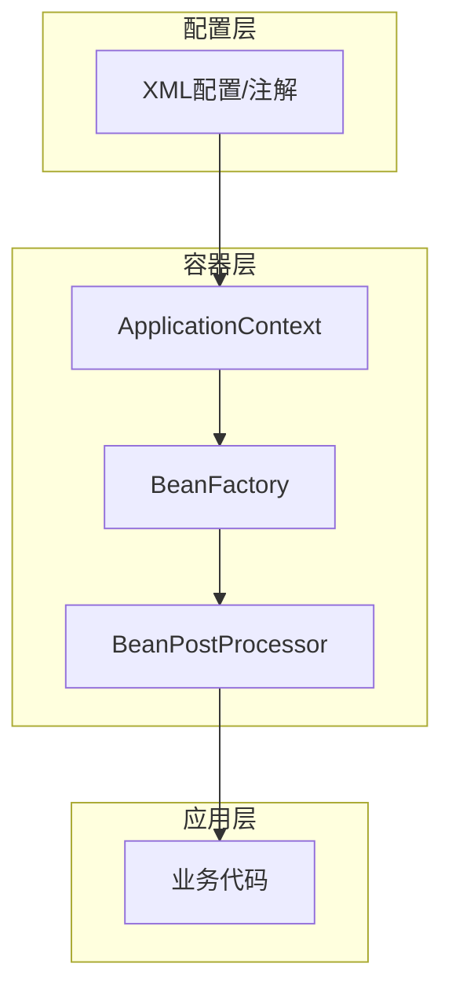
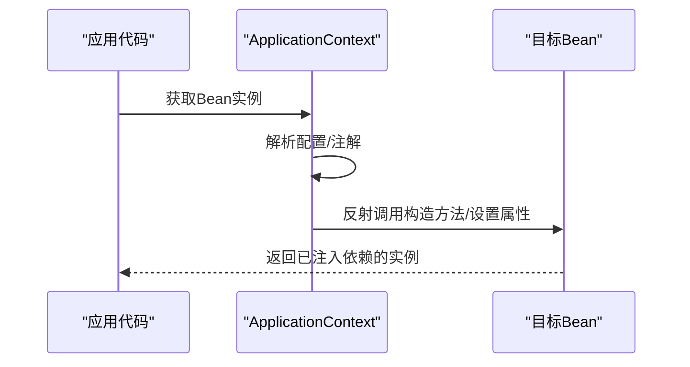
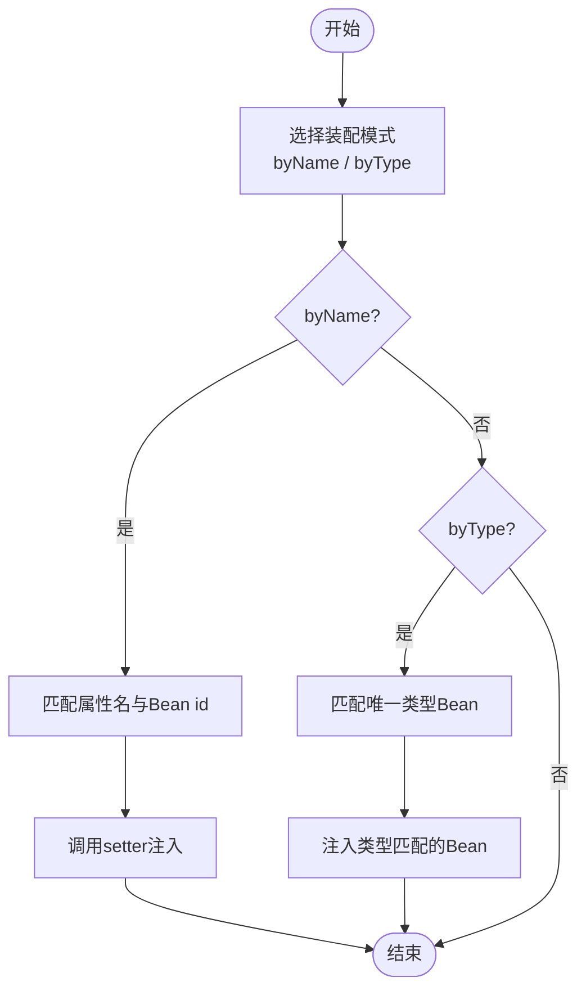
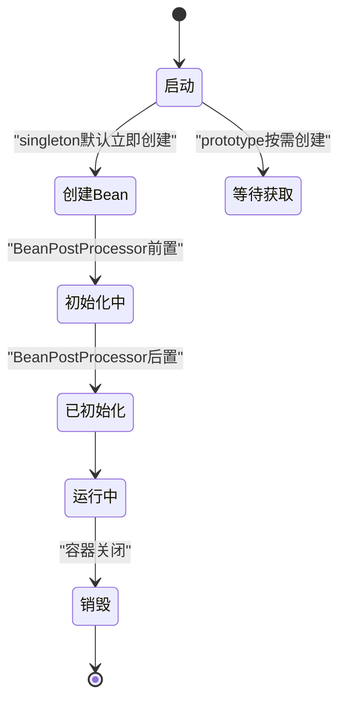
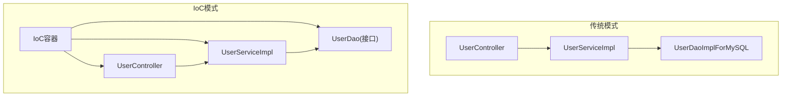
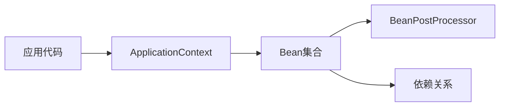

# IoC核心概念

<cite>
**本文引用的文件**
- [spring.md](file://docs/backend-base/spring/spring.md)
- [spring-boot-my.md](file://docs/backend-base/spring/spring-boot-my.md)
</cite>

## 目录
1. [引言](#引言)
2. [项目结构](#项目结构)
3. [核心组件](#核心组件)
4. [架构总览](#架构总览)
5. [详细组件分析](#详细组件分析)
6. [依赖分析](#依赖分析)
7. [性能考虑](#性能考虑)
8. [故障排查指南](#故障排查指南)
9. [结论](#结论)
10. [附录](#附录)

## 引言
本篇文档围绕Spring IoC（控制反转）的核心理念与实现展开，系统阐述控制反转的基本原理、依赖倒置原则（DIP）与开闭原则（OCP）在IoC中的体现，IoC容器的工作机制（对象创建、生命周期管理、依赖关系维护），并通过传统编程模式与IoC模式的对比，帮助读者理解IoC带来的解耦、可测试性与可扩展性优势。

## 项目结构
本仓库中与Spring IoC相关的内容集中在后端基础文档下的Spring章节，涵盖：
- IoC与DI的基本概念、实现方式（set注入、构造注入）
- Bean管理（创建、装配、作用域）
- 自动装配（按名称、按类型）
- 引入外部属性配置
- Bean生命周期与后处理器
- 与设计模式的关系（工厂模式）

**章节来源**
- [spring.md:100-135](file://docs/backend-base/spring/spring.md#L100-L135)
- [spring.md:742-766](file://docs/backend-base/spring/spring.md#L742-L766)

## 核心组件
- 控制反转（IoC）：将对象的创建权与依赖关系的维护权从应用代码中剥离，交由容器统一管理，从而降低耦合度，提升扩展性与可测试性。
- 依赖注入（DI）：IoC的具体实现手段，通过set方法注入或构造方法注入等方式，将依赖关系在运行时注入到目标对象中。
- Bean：Spring容器管理的组件单元，包含对象的创建、属性赋值与关系维护。
- ApplicationContext：Spring容器的核心接口，负责Bean的创建与管理。
- 自动装配：按名称（byName）或按类型（byType）自动完成依赖注入。
- 作用域（Scope）：singleton（默认）、prototype等，决定Bean实例的创建策略。
- 后处理器（BeanPostProcessor）：在Bean初始化前后执行自定义逻辑，用于扩展容器能力。

**章节来源**
- [spring.md:742-766](file://docs/backend-base/spring/spring.md#L742-L766)
- [spring.md:1119-1118](file://docs/backend-base/spring/spring.md#L1119-L1118)
- [spring.md:2488-2696](file://docs/backend-base/spring/spring.md#L2488-L2696)
- [spring.md:2801-2931](file://docs/backend-base/spring/spring.md#L2801-L2931)
- [spring.md:4113-4288](file://docs/backend-base/spring/spring.md#L4113-L4288)

## 架构总览
IoC容器通过解析配置（XML或注解），在启动时创建Bean并完成依赖注入，运行时提供Bean实例供应用使用。容器内部通过反射机制调用构造方法或setter方法，实现对象创建与关系装配。

**图表来源**
- [spring.md:742-766](file://docs/backend-base/spring/spring.md#L742-L766)
- [spring.md:4113-4288](file://docs/backend-base/spring/spring.md#L4113-L4288)

**章节来源**
- [spring.md:742-766](file://docs/backend-base/spring/spring.md#L742-L766)
- [spring.md:4113-4288](file://docs/backend-base/spring/spring.md#L4113-L4288)

## 详细组件分析

### 1. 控制反转与依赖注入
- 控制反转的核心在于“反转”：将对象创建与依赖关系维护的权利从应用代码转移到容器。
- 依赖注入的两种常见方式：
  - set注入：通过反射调用setter方法完成属性赋值。
  - 构造注入：通过反射调用构造方法完成依赖注入。
- 容器在装配时支持多种注入形式：简单类型、数组、集合、Map、Properties，以及null与特殊字符处理。

**图表来源**
- [spring.md:1119-1118](file://docs/backend-base/spring/spring.md#L1119-L1118)
- [spring.md:1200-1500](file://docs/backend-base/spring/spring.md#L1200-L1500)
- [spring.md:2000-2500](file://docs/backend-base/spring/spring.md#L2000-L2500)

**章节来源**
- [spring.md:1119-1118](file://docs/backend-base/spring/spring.md#L1119-L1118)
- [spring.md:1200-1500](file://docs/backend-base/spring/spring.md#L1200-L1500)
- [spring.md:2000-2500](file://docs/backend-base/spring/spring.md#L2000-L2500)

### 2. 自动装配（byName/byType）
- byName：根据属性名与Bean id匹配，调用对应setter完成注入。
- byType：根据属性类型匹配唯一Bean，若存在多个同类型Bean则报错。
- 自动装配依赖setter方法的存在，构造方法不参与自动装配。

**图表来源**
- [spring.md:2488-2696](file://docs/backend-base/spring/spring.md#L2488-L2696)

**章节来源**
- [spring.md:2488-2696](file://docs/backend-base/spring/spring.md#L2488-L2696)

### 3. Bean作用域与生命周期
- 作用域（Scope）：
  - singleton（默认）：容器启动时创建，后续多次获取为同一实例。
  - prototype：每次getBean()创建新实例。
  - request/session/application/websocket等（Web场景）。
- 生命周期：
  - 容器启动：解析配置，创建Bean实例（默认singleton）。
  - 初始化：执行BeanPostProcessor前置/后置逻辑。
  - 运行：应用通过容器获取Bean实例。
  - 销毁：容器关闭时触发destroyMethod（如配置）。

**图表来源**
- [spring.md:2801-2931](file://docs/backend-base/spring/spring.md#L2801-L2931)
- [spring.md:4113-4288](file://docs/backend-base/spring/spring.md#L4113-L4288)

**章节来源**
- [spring.md:2801-2931](file://docs/backend-base/spring/spring.md#L2801-L2931)
- [spring.md:4113-4288](file://docs/backend-base/spring/spring.md#L4113-L4288)

### 4. 传统编程模式 vs IoC模式
- 传统模式：在业务代码中直接new依赖对象，导致上层强依赖下层，违反DIP与OCP。
- IoC模式：将对象创建与依赖注入交给容器，业务代码只面向接口编程，降低耦合、提升扩展与测试便利性。

**图表来源**
- [spring.md:100-135](file://docs/backend-base/spring/spring.md#L100-L135)

**章节来源**
- [spring.md:100-135](file://docs/backend-base/spring/spring.md#L100-L135)

### 5. 设计原则在IoC中的体现
- 依赖倒置原则（DIP）：业务代码依赖抽象（接口），而非具体实现；IoC容器负责实例化与注入，从而实现“上层不依赖下层”。
- 开闭原则（OCP）：扩展新实现时无需修改既有代码，只需在容器中替换或新增Bean定义，符合“对扩展开放，对修改关闭”。

**章节来源**
- [spring.md:100-135](file://docs/backend-base/spring/spring.md#L100-L135)
- [spring.md:742-766](file://docs/backend-base/spring/spring.md#L742-L766)

### 6. Spring Boot中的IoC实践
- @Bean：在配置类中定义Bean，支持initMethod/destroyMethod等属性。
- @ImportResource：加载XML配置文件，实现传统IoC配置与Spring Boot的结合。
- @Value/@ConfigurationProperties：从外部配置注入属性，便于参数化与环境隔离。

**章节来源**
- [spring-boot-my.md:161-172](file://docs/backend-base/spring/spring-boot-my.md#L161-L172)
- [spring-boot-my.md:72-80](file://docs/backend-base/spring/spring-boot-my.md#L72-L80)
- [spring-boot-my.md:82-91](file://docs/backend-base/spring/spring-boot-my.md#L82-L91)
- [spring-boot-my.md:93-106](file://docs/backend-base/spring/spring-boot-my.md#L93-L106)

## 依赖分析
IoC容器通过以下依赖关系组织系统：
- 应用代码依赖容器接口（如ApplicationContext）获取Bean。
- 容器内部依赖BeanPostProcessor扩展生命周期。
- Bean之间通过setter或构造方法建立依赖关系，容器负责装配。

**图表来源**
- [spring.md:742-766](file://docs/backend-base/spring/spring.md#L742-L766)
- [spring.md:4113-4288](file://docs/backend-base/spring/spring.md#L4113-L4288)

**章节来源**
- [spring.md:742-766](file://docs/backend-base/spring/spring.md#L742-L766)
- [spring.md:4113-4288](file://docs/backend-base/spring/spring.md#L4113-L4288)

## 性能考虑
- 单例Bean在容器启动时创建，减少运行时对象创建开销。
- 原型Bean按需创建，适合大对象或高并发场景，但需注意内存与GC压力。
- 自动装配按类型匹配时，若存在多个同类型Bean会导致装配失败，应避免歧义。
- 后处理器与反射调用带来额外开销，应在必要时使用并谨慎配置。

## 故障排查指南
- 空指针异常：确认依赖的setter方法是否存在，或构造方法参数是否正确。
- 自动装配失败：byName需属性名与Bean id一致；byType需唯一性。
- 多实例Bean未按预期创建：检查scope配置与获取时机。
- 特殊字符注入报错：使用转义字符或CDATA包裹。
- 属性注入失败：确认value/ref使用正确，简单类型使用value，对象使用ref。

**章节来源**
- [spring.md:1119-1118](file://docs/backend-base/spring/spring.md#L1119-L1118)
- [spring.md:2488-2696](file://docs/backend-base/spring/spring.md#L2488-L2696)
- [spring.md:2801-2931](file://docs/backend-base/spring/spring.md#L2801-L2931)
- [spring.md:2265-2390](file://docs/backend-base/spring/spring.md#L2265-L2390)

## 结论
IoC通过将对象创建与依赖关系维护从应用代码中剥离，显著降低了模块间的耦合度，提升了系统的可扩展性与可测试性。结合依赖倒置与开闭原则，IoC为现代企业级应用提供了稳定、可演进的架构基石。Spring通过多种装配方式、作用域与生命周期管理，以及与设计模式的融合，为IoC理念提供了完整而强大的实现。

## 附录
- 传统模式与IoC模式的对比可参考文档中的示例与图示，理解“谁来创建对象、谁来维护关系”的转变。
- Spring Boot中通过注解与XML配置结合，延续IoC思想，简化配置与部署。