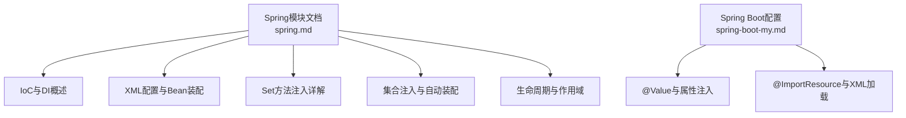
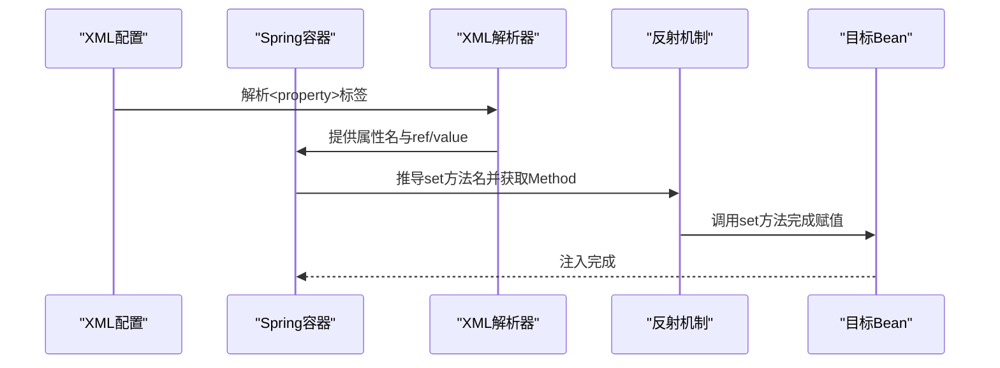
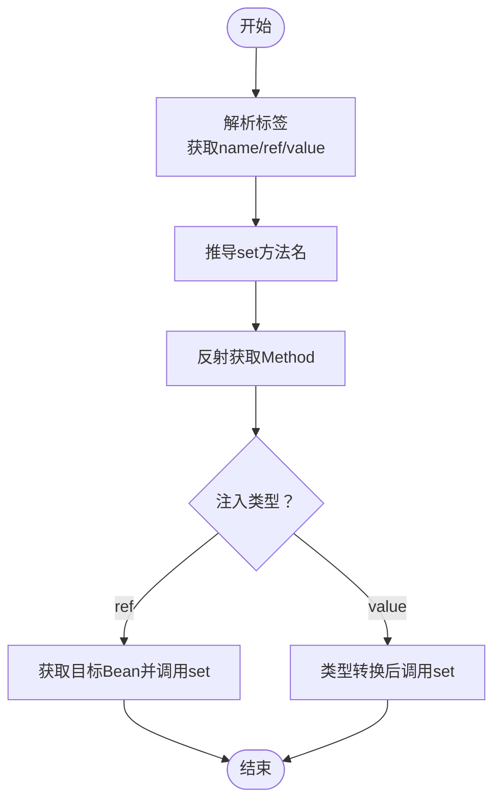
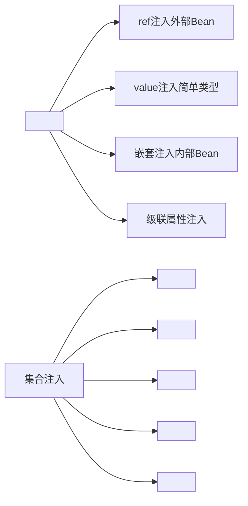
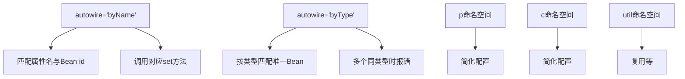
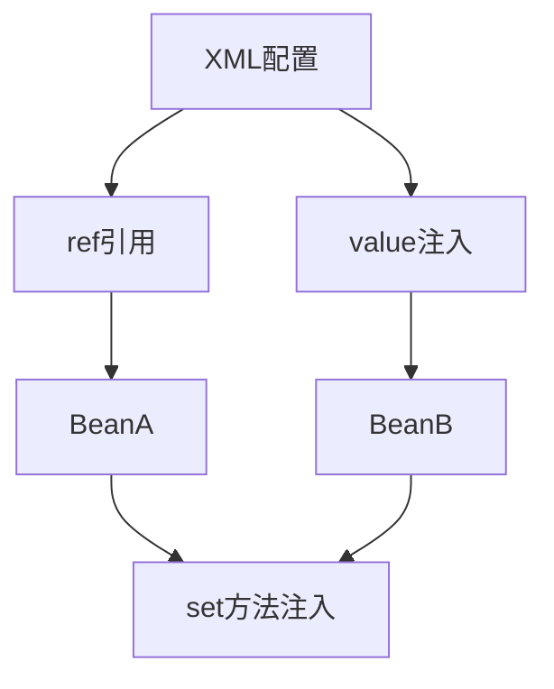

# Set方法注入

<cite>
**本文档引用的文件**
- [spring.md](file://docs/backend-base/spring/spring.md)
- [spring-boot-my.md](file://docs/backend-base/spring/spring-boot-my.md)
</cite>

## 目录
1. [引言](#引言)
2. [项目结构](#项目结构)
3. [核心组件](#核心组件)
4. [架构概览](#架构概览)
5. [详细组件分析](#详细组件分析)
6. [依赖分析](#依赖分析)
7. [性能考虑](#性能考虑)
8. [故障排除指南](#故障排除指南)
9. [结论](#结论)
10. [附录](#附录)

## 引言
本文件围绕Spring框架中的Set方法注入展开，系统阐述其工作原理、配置方式、典型场景、最佳实践及与构造方法注入的差异。内容基于仓库中的Spring文档，重点聚焦于通过反射机制调用属性对应的set方法进行依赖赋值的过程，覆盖基本数据类型、对象类型、集合类型等注入场景，并讨论安全性与初始化时机等潜在问题。

## 项目结构
本项目为技术文档仓库，Set方法注入相关内容主要位于Spring模块文档中，涵盖：
- Spring基础与IoC/DI概念
- XML配置与Bean装配
- Set方法注入的实现原理与配置语法
- 集合注入、自动装配、生命周期管理等高级特性

**章节来源**
- [spring.md:1-120](file://docs/backend-base/spring/spring.md#L1-L120)
- [spring.md:1119-1136](file://docs/backend-base/spring/spring.md#L1119-L1136)

## 核心组件
- Set方法注入：基于set方法实现的依赖注入，底层通过反射机制调用属性对应的set方法给属性赋值。
- XML配置：通过<property>标签指定属性名与注入目标（ref或value），实现Bean间关系的维护。
- 反射机制：在运行时动态获取Method并调用invoke，完成属性赋值。
- 自动装配：支持按名称(byName)与按类型(byType)的自动装配策略。

**章节来源**
- [spring.md:769-965](file://docs/backend-base/spring/spring.md#L769-L965)
- [spring.md:2488-2696](file://docs/backend-base/spring/spring.md#L2488-L2696)

## 架构概览
Set方法注入在Spring中的工作流可概括为：容器解析XML配置，定位目标Bean与其属性；根据<property>标签推导set方法名，通过反射获取Method并调用，完成依赖赋值。该流程贯穿Bean的实例化与初始化阶段。

**图表来源**
- [spring.md:911-917](file://docs/backend-base/spring/spring.md#L911-L917)
- [spring.md:5317-5447](file://docs/backend-base/spring/spring.md#L5317-L5447)

**章节来源**
- [spring.md:911-917](file://docs/backend-base/spring/spring.md#L911-L917)
- [spring.md:5317-5447](file://docs/backend-base/spring/spring.md#L5317-L5447)

## 详细组件分析

### Set方法注入工作原理
- 属性名推导：根据<property>标签的name属性，将set方法名推导为set + 首字母大写 + 剩余部分。
- 反射调用：通过Class.getDeclaredMethod获取对应set方法，再通过Method.invoke完成赋值。
- ref与value：ref用于注入外部Bean，value用于注入简单类型值。

**图表来源**
- [spring.md:911-917](file://docs/backend-base/spring/spring.md#L911-L917)
- [spring.md:5384-5437](file://docs/backend-base/spring/spring.md#L5384-L5437)

**章节来源**
- [spring.md:911-917](file://docs/backend-base/spring/spring.md#L911-L917)
- [spring.md:5384-5437](file://docs/backend-base/spring/spring.md#L5384-L5437)

### XML配置语法与典型场景
- 外部Bean注入：通过<property name="..." ref="beanId"/>完成。
- 内部Bean注入：在<property>中嵌套<bean>标签。
- 简单类型注入：使用<property name="..."><value>...</value></property>或value属性。
- 级联属性赋值：通过property name使用“对象.属性”形式，要求提供getter方法。
- 集合注入：数组(array)、列表(list)、集合(set)、映射(map)、属性(props)等。

**图表来源**
- [spring.md:1120-1136](file://docs/backend-base/spring/spring.md#L1120-L1136)
- [spring.md:1165-1247](file://docs/backend-base/spring/spring.md#L1165-L1247)
- [spring.md:1556-1667](file://docs/backend-base/spring/spring.md#L1556-L1667)
- [spring.md:1671-1831](file://docs/backend-base/spring/spring.md#L1671-L1831)
- [spring.md:1835-1956](file://docs/backend-base/spring/spring.md#L1835-L1956)
- [spring.md:1960-2021](file://docs/backend-base/spring/spring.md#L1960-L2021)
- [spring.md:2025-2085](file://docs/backend-base/spring/spring.md#L2025-L2085)

**章节来源**
- [spring.md:1120-1136](file://docs/backend-base/spring/spring.md#L1120-L1136)
- [spring.md:1165-1247](file://docs/backend-base/spring/spring.md#L1165-L1247)
- [spring.md:1556-1667](file://docs/backend-base/spring/spring.md#L1556-L1667)
- [spring.md:1671-1831](file://docs/backend-base/spring/spring.md#L1671-L1831)
- [spring.md:1835-1956](file://docs/backend-base/spring/spring.md#L1835-L1956)
- [spring.md:1960-2021](file://docs/backend-base/spring/spring.md#L1960-L2021)
- [spring.md:2025-2085](file://docs/backend-base/spring/spring.md#L2025-L2085)

### 自动装配与命名空间
- byName自动装配：根据属性名与Bean id匹配，底层仍通过set方法注入。
- byType自动装配：根据属性类型匹配唯一Bean，若存在多个相同类型将报错。
- p命名空间：简化set注入的XML配置，基于setter方法。
- c命名空间：简化构造注入的XML配置，基于构造方法。
- util命名空间：复用配置，减少重复定义。

**图表来源**
- [spring.md:2490-2611](file://docs/backend-base/spring/spring.md#L2490-L2611)
- [spring.md:2265-2325](file://docs/backend-base/spring/spring.md#L2265-L2325)
- [spring.md:2327-2388](file://docs/backend-base/spring/spring.md#L2327-L2388)
- [spring.md:2391-2486](file://docs/backend-base/spring/spring.md#L2391-L2486)

**章节来源**
- [spring.md:2490-2611](file://docs/backend-base/spring/spring.md#L2490-L2611)
- [spring.md:2265-2325](file://docs/backend-base/spring/spring.md#L2265-L2325)
- [spring.md:2327-2388](file://docs/backend-base/spring/spring.md#L2327-L2388)
- [spring.md:2391-2486](file://docs/backend-base/spring/spring.md#L2391-L2486)

### 生命周期与作用域
- 单例(singleton)：默认作用域，容器初始化时创建，生命周期完整。
- 原型(prototype)：每次getBean时创建，容器不管理其完整生命周期。
- Bean生命周期：实例化 → 属性赋值 → 初始化 → 使用 → 销毁。
- Bean后处理器：在初始化前后插入自定义逻辑。

**章节来源**
- [spring.md:2801-2931](file://docs/backend-base/spring/spring.md#L2801-L2931)
- [spring.md:4016-4265](file://docs/backend-base/spring/spring.md#L4016-L4265)

### 循环依赖与初始化时机
- singleton + set注入：可解决循环依赖，通过三级缓存提前暴露早期Bean实例。
- prototype + set注入：若所有Bean均为prototype，将无法解决循环依赖，抛出异常。
- 构造注入：实例化与属性赋值不可分离，通常无法解决循环依赖。

**章节来源**
- [spring.md:4348-4663](file://docs/backend-base/spring/spring.md#L4348-L4663)

### 反射机制与类型转换
- 反射调用：通过Class.getDeclaredMethod获取Method，再invoke调用。
- 类型转换：简单类型注入时，根据属性类型进行相应转换（如String到基本类型、枚举、URL等）。
- 特殊字符处理：XML特殊字符需使用转义或CDATA包裹。

**章节来源**
- [spring.md:5384-5437](file://docs/backend-base/spring/spring.md#L5384-L5437)
- [spring.md:2180-2261](file://docs/backend-base/spring/spring.md#L2180-L2261)

### Spring Boot中的属性注入
- @ImportResource：在Spring Boot中加载XML配置文件。
- @Value：从配置文件注入简单属性值。
- 属性配置文件：支持properties/yml/yaml及其优先级。

**章节来源**
- [spring-boot-my.md:72-80](file://docs/backend-base/spring/spring-boot-my.md#L72-L80)
- [spring-boot-my.md:82-91](file://docs/backend-base/spring/spring-boot-my.md#L82-L91)
- [spring-boot-my.md:24-41](file://docs/backend-base/spring/spring-boot-my.md#L24-L41)

## 依赖分析
Set方法注入的依赖关系体现在XML配置与运行时反射调用两个层面：
- 配置层面：通过ref建立Bean间的依赖关系。
- 运行时：通过反射调用set方法，完成属性赋值与依赖注入。

**图表来源**
- [spring.md:916-917](file://docs/backend-base/spring/spring.md#L916-L917)
- [spring.md:5384-5437](file://docs/backend-base/spring/spring.md#L5384-L5437)

**章节来源**
- [spring.md:916-917](file://docs/backend-base/spring/spring.md#L916-L917)
- [spring.md:5384-5437](file://docs/backend-base/spring/spring.md#L5384-L5437)

## 性能考虑
- 反射调用成本：反射获取Method与invoke存在性能开销，建议在容器初始化阶段完成，避免频繁调用。
- 类型转换：简单类型注入时的类型转换逻辑较为完善，但仍需注意日期、URL等特殊类型的格式与校验。
- 自动装配：byType在存在多个同类型Bean时会报错，应确保类型唯一性以避免装配失败。

[本节为通用指导，不涉及具体文件分析]

## 故障排除指南
- set方法缺失：若缺少对应的set方法，注入将失败。确认属性名与set方法名匹配规则。
- 循环依赖：singleton + set注入可解决；prototype + set注入或构造注入在双向依赖时可能失败。
- 自动装配冲突：byType存在多个同类型Bean时会报错，需调整配置或使用byName。
- 特殊字符与CDATA：XML中特殊字符需转义或使用CDATA包裹，避免解析错误。
- URL有效性：Spring 6对URL注入进行有效性校验，非法URL将报错。

**章节来源**
- [spring.md:917-919](file://docs/backend-base/spring/spring.md#L917-L919)
- [spring.md:2680-2696](file://docs/backend-base/spring/spring.md#L2680-L2696)
- [spring.md:2180-2261](file://docs/backend-base/spring/spring.md#L2180-L2261)
- [spring.md:1549-1552](file://docs/backend-base/spring/spring.md#L1549-L1552)

## 结论
Set方法注入通过反射机制调用set方法完成依赖赋值，具备灵活性高、易于测试等优势；同时需关注安全性（反射权限、类型转换）、初始化时机（生命周期管理）与循环依赖（作用域与注入方式）等问题。结合XML配置、自动装配与命名空间，可实现多样化的依赖注入场景。在Spring Boot环境中，可通过@ImportResource与@Value等注解补充XML配置，满足现代应用的属性注入需求。

[本节为总结性内容，不涉及具体文件分析]

## 附录
- 最佳实践
  - 优先提供完整的setter方法，确保可注入性。
  - 使用p命名空间简化XML配置，提升可读性。
  - 明确Bean作用域，单例Bean适合Set注入，原型Bean需谨慎处理生命周期。
  - 避免循环依赖，必要时重构设计或采用延迟初始化策略。
  - 对URL、日期等特殊类型，确保格式正确或通过FactoryBean处理。

- 与构造方法注入的对比
  - 构造注入：在实例化阶段完成依赖赋值，适合不可变依赖与强制依赖；循环依赖场景受限。
  - Set注入：支持可选依赖与运行时替换，灵活性更高；需关注初始化顺序与循环依赖。

**章节来源**
- [spring.md:967-1117](file://docs/backend-base/spring/spring.md#L967-L1117)
- [spring.md:4348-4663](file://docs/backend-base/spring/spring.md#L4348-L4663)