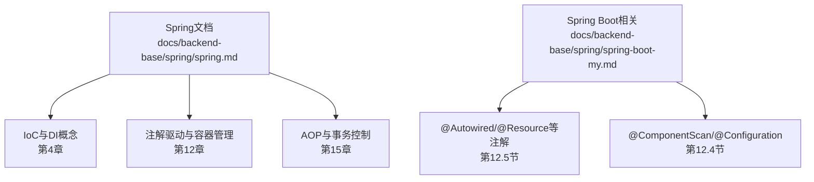
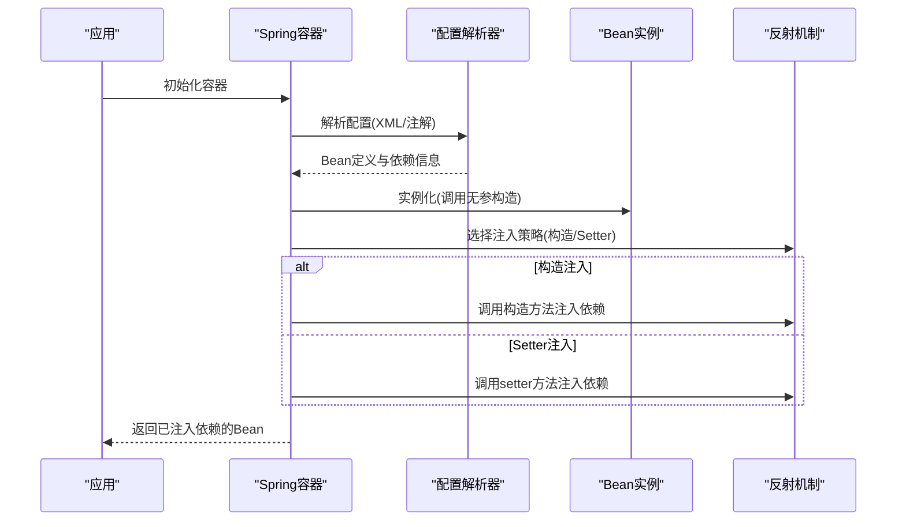
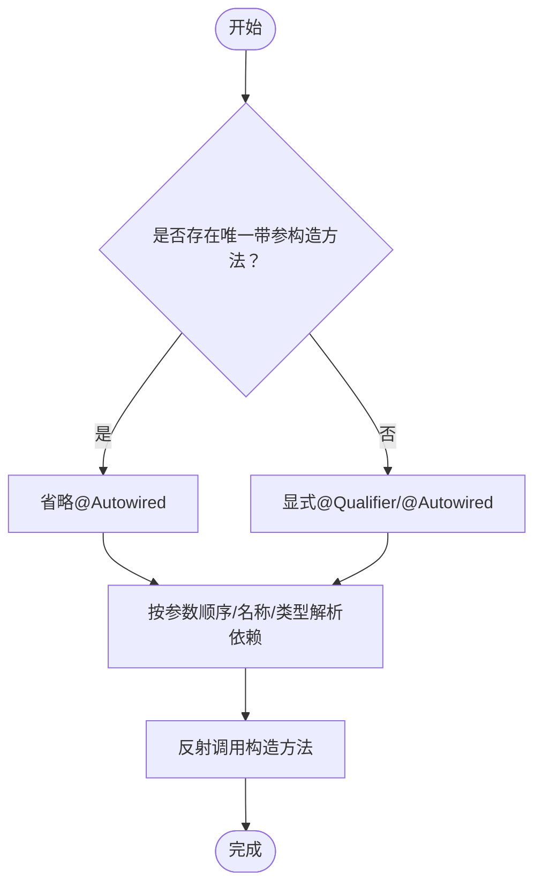
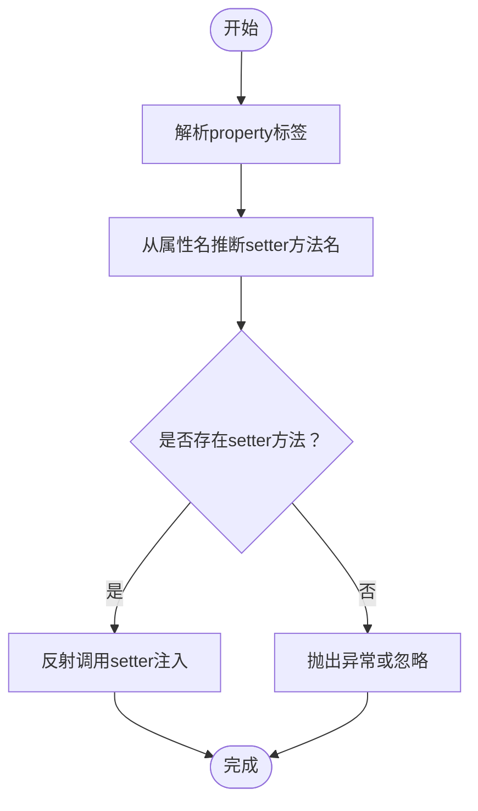
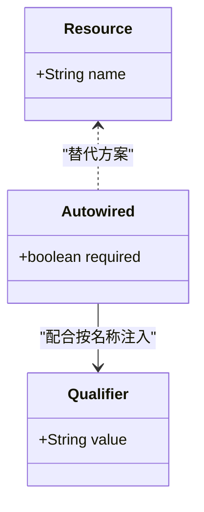
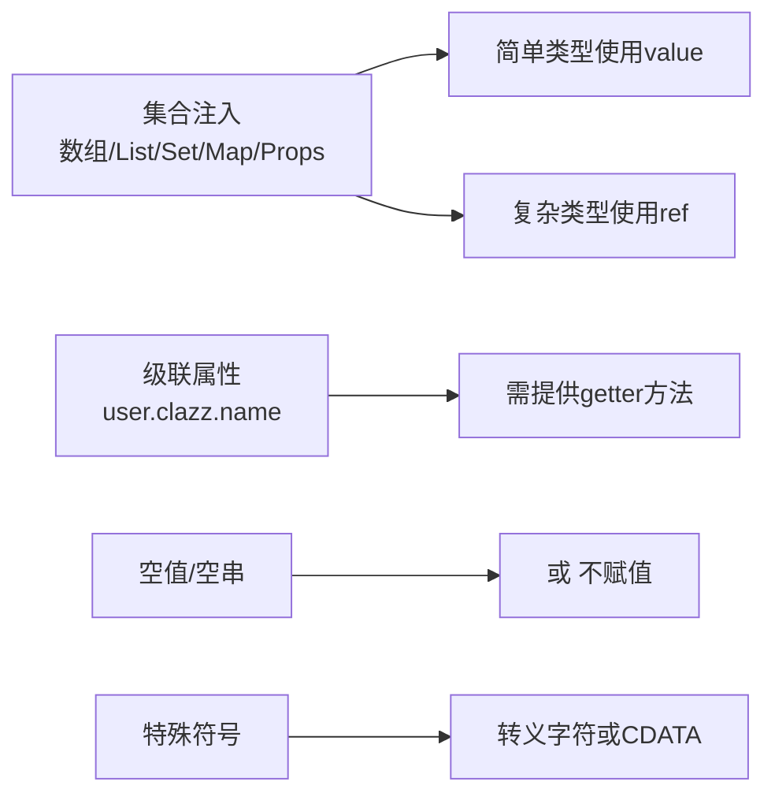
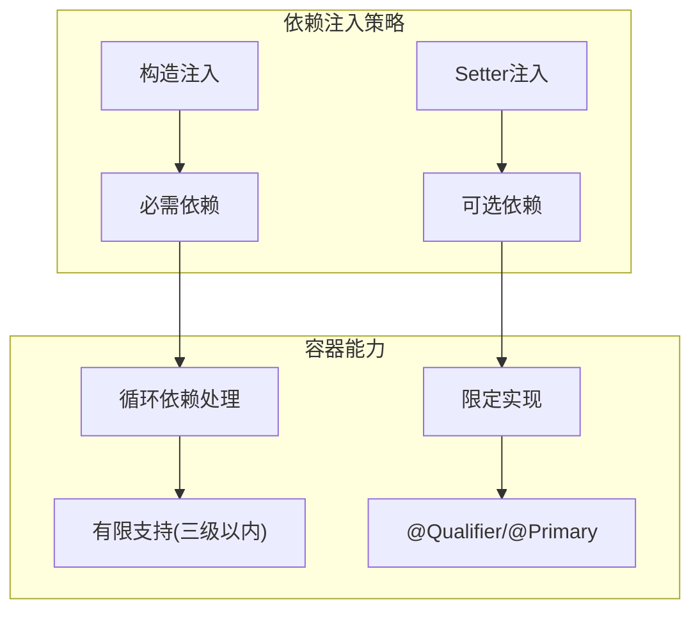

# 依赖注入实现

<cite>
**本文档引用的文件**
- [spring.md](file://docs/backend-base/spring/spring.md)
- [spring-boot-my.md](file://docs/backend-base/spring/spring-boot-my.md)
</cite>

## 目录
1. [引言](#引言)
2. [项目结构](#项目结构)
3. [核心组件](#核心组件)
4. [架构总览](#架构总览)
5. [详细组件分析](#详细组件分析)
6. [依赖关系分析](#依赖关系分析)
7. [性能考虑](#性能考虑)
8. [故障排查指南](#故障排查指南)
9. [结论](#结论)
10. [附录](#附录)

## 引言
本技术文档围绕Spring依赖注入（DI）的两种主要实现方式进行系统化阐述，包括构造方法注入与set方法注入。文档不仅解释每种注入方式的实现原理、优缺点与适用场景，还结合Spring框架的底层机制（如反射、容器管理、注解驱动）给出实践指导与问题排查方法。读者可据此在实际项目中做出合理选择并规避常见陷阱。

## 项目结构
本仓库与Spring相关的知识主要集中在后端基础文档中的Spring章节，涵盖IoC、DI、注解驱动、AOP等内容。本文档聚焦于依赖注入的实现方式与底层机制，其余章节（如AOP、JDBC、Spring MVC等）作为背景知识参考。

**图表来源**
- [spring.md](file://docs/backend-base/spring/spring.md)
- [spring-boot-my.md](file://docs/backend-base/spring/spring-boot-my.md)

**章节来源**
- [spring.md: 第4章](file://docs/backend-base/spring/spring.md)
- [spring.md: 第12章](file://docs/backend-base/spring/spring.md)
- [spring-boot-my.md: 第12.5节](file://docs/backend-base/spring/spring-boot-my.md)

## 核心组件
- 依赖注入（DI）：通过容器在运行时将对象间的依赖关系注入，从而降低耦合度，提升可测试性与可维护性。
- 控制反转（IoC）：将对象的创建与关系维护权交给容器，实现“反转”。
- 两种注入方式：
  - 构造方法注入：通过调用构造方法完成依赖注入，适合必需依赖与不可变对象。
  - set方法注入：通过反射调用setter方法完成依赖注入，适合可选或可替换依赖。

**章节来源**
- [spring.md: 第4.2节](file://docs/backend-base/spring/spring.md)
- [spring.md: 第4.2.1节](file://docs/backend-base/spring/spring.md)
- [spring.md: 第4.2.2节](file://docs/backend-base/spring/spring.md)

## 架构总览
Spring容器在启动时解析配置（XML或注解），通过反射机制创建Bean并完成依赖注入。容器负责：
- Bean生命周期管理（实例化、属性填充、初始化）
- 依赖关系解析（byType/byName）
- 注入策略选择（构造注入 vs set注入）

**图表来源**
- [spring.md: 第4.2节](file://docs/backend-base/spring/spring.md)
- [spring.md: 第4.2.1节](file://docs/backend-base/spring/spring.md)
- [spring.md: 第4.2.2节](file://docs/backend-base/spring/spring.md)

## 详细组件分析

### 构造方法注入
- 实现原理：容器通过反射调用带参构造方法，按参数顺序/名称/类型推断完成依赖注入。
- 优点：
  - 依赖不可变，线程安全友好
  - 明确必填依赖，避免半初始化对象
  - 更利于单元测试与Mock
- 缺点：
  - 参数过多时可读性下降
  - 子类覆写构造方法时需保持签名一致性
- 适用场景：
  - 必需依赖（如Repository、Service）
  - 不可变对象（值对象、配置对象）
- 最佳实践：
  - 仅保留一个带参构造方法时可省略@Autowired
  - 多个构造方法时显式标注@Autowired
  - 使用c命名空间简化XML配置

**图表来源**
- [spring.md: 第4.2.2节](file://docs/backend-base/spring/spring.md)
- [spring.md: 第2327节](file://docs/backend-base/spring/spring.md)

**章节来源**
- [spring.md: 第4.2.2节](file://docs/backend-base/spring/spring.md)
- [spring.md: 第2327节](file://docs/backend-base/spring/spring.md)

### set方法注入
- 实现原理：容器通过反射调用setter方法，依据属性名推断setter方法名并注入依赖。
- 优点：
  - 配置灵活，支持可选依赖
  - 便于后续替换或热插拔
- 缺点：
  - 依赖可变，存在竞态风险
  - 可能出现半初始化状态
- 适用场景：
  - 可选依赖（日志、监控、缓存等）
  - 可替换策略（适配器、策略模式）
- 最佳实践：
  - 保持setter方法可见性与一致性
  - 使用p命名空间简化XML配置
  - 复杂对象可通过集合注入（List/Set/Map）

**图表来源**
- [spring.md: 第4.2.1节](file://docs/backend-base/spring/spring.md)
- [spring.md: 第2265节](file://docs/backend-base/spring/spring.md)

**章节来源**
- [spring.md: 第4.2.1节](file://docs/backend-base/spring/spring.md)
- [spring.md: 第2265节](file://docs/backend-base/spring/spring.md)

### 注解驱动的注入（@Autowired/@Resource）
- @Autowired：默认按类型(byType)注入，可配合@Qualifier按名称注入；支持属性、setter、构造方法、构造参数。
- @Resource：默认按名称(byName)注入，未指定name时使用属性名；找不到再回退到按类型(byType)。
- 使用建议：
  - @Autowired适用于Spring生态内的组件
  - @Resource跨平台兼容性更好（JDK扩展包）
  - 多实现类时优先使用@Qualifier限定名称

**图表来源**
- [spring-boot-my.md: 第12.5.2节](file://docs/backend-base/spring/spring-boot-my.md)
- [spring-boot-my.md: 第12.5.3节](file://docs/backend-base/spring/spring-boot-my.md)

**章节来源**
- [spring-boot-my.md: 第12.5.2节](file://docs/backend-base/spring/spring-boot-my.md)
- [spring-boot-my.md: 第12.5.3节](file://docs/backend-base/spring/spring-boot-my.md)

### 复杂依赖关系处理
- 集合注入：支持数组、List、Set、Map、Properties，可混合简单类型与复杂类型。
- 级联属性：通过“属性名.子属性”实现深层对象注入。
- 空值与特殊符号：提供null与CDATA处理方案。
- 命名空间简化：p命名空间用于setter注入，c命名空间用于构造注入。

**图表来源**
- [spring.md: 第1671节](file://docs/backend-base/spring/spring.md)
- [spring.md: 第1556节](file://docs/backend-base/spring/spring.md)
- [spring.md: 第2089节](file://docs/backend-base/spring/spring.md)
- [spring.md: 第2180节](file://docs/backend-base/spring/spring.md)

**章节来源**
- [spring.md: 第1671节](file://docs/backend-base/spring/spring.md)
- [spring.md: 第1556节](file://docs/backend-base/spring/spring.md)
- [spring.md: 第2089节](file://docs/backend-base/spring/spring.md)
- [spring.md: 第2180节](file://docs/backend-base/spring/spring.md)

## 依赖关系分析
- 组件耦合：构造注入强调“必需依赖”，set注入强调“可选依赖”。二者结合可覆盖大多数场景。
- 循环依赖：Spring容器在单例作用域下对三级以内循环依赖提供有限支持（如通过三级缓存解决），超出范围将抛出异常。应尽量通过拆分接口、引入事件/延迟初始化等方式规避。
- 可选依赖：通过@Autowired(required=false)或@Nullable注解明确表达可选性，避免强制注入失败。
- 多实现类：使用@Qualifier或@Primary限定具体实现，或通过构造注入的参数名/类型精确匹配。

**图表来源**
- [spring.md: 第4.2.1节](file://docs/backend-base/spring/spring.md)
- [spring.md: 第4.2.2节](file://docs/backend-base/spring/spring.md)
- [spring-boot-my.md: 第12.5.2节](file://docs/backend-base/spring/spring-boot-my.md)

**章节来源**
- [spring.md: 第4.2.1节](file://docs/backend-base/spring/spring.md)
- [spring.md: 第4.2.2节](file://docs/backend-base/spring/spring.md)
- [spring-boot-my.md: 第12.5.2节](file://docs/backend-base/spring/spring-boot-my.md)

## 性能考虑
- 反射成本：依赖注入涉及反射调用，建议在关键路径避免频繁创建容器或大量反射操作。
- Bean数量：过多Bean会增加容器初始化与依赖解析时间，应按模块拆分配置。
- 延迟初始化：对非关键路径的Bean使用懒加载，减少启动时间。
- 集合注入：批量注入时优先使用集合类型，减少多次反射调用次数。

[本节为通用指导，不直接分析具体文件]

## 故障排查指南
- 未找到匹配Bean：检查类型/名称是否唯一，确认@ComponentScan范围与注解使用正确。
- 循环依赖异常：重构设计，避免直接循环引用；必要时引入事件或延迟初始化。
- setter方法缺失：set注入必须提供setter方法，否则注入失败。
- 构造参数不匹配：核对参数顺序、名称或类型，必要时使用@Qualifier限定。
- XML特殊符号：遇到<、>、&等需转义或使用CDATA。
- 级联属性异常：确保父属性提供getter方法，且顺序与依赖关系正确。

**章节来源**
- [spring.md: 第4.2.1节](file://docs/backend-base/spring/spring.md)
- [spring.md: 第4.2.2节](file://docs/backend-base/spring/spring.md)
- [spring.md: 第2180节](file://docs/backend-base/spring/spring.md)
- [spring.md: 第1669节](file://docs/backend-base/spring/spring.md)

## 结论
- 构造方法注入更适合必需依赖与不可变对象，强调“必须可用”；set方法注入更适合可选依赖与可替换策略，强调“可配置”。
- 注解驱动（@Autowired/@Resource）与命名空间（p/c/util）显著简化配置，提升开发效率。
- 复杂依赖关系（集合、级联、空值、特殊符号）可通过Spring提供的多种机制优雅处理。
- 在实际工程中，应结合业务特性与团队约定选择合适的注入方式，并重视循环依赖与可选依赖的处理策略。

[本节为总结性内容，不直接分析具体文件]

## 附录
- 代码示例路径（以文件路径代替具体代码）：
  - 构造注入示例：[spring.md: 第967节](file://docs/backend-base/spring/spring.md)
  - set注入示例：[spring.md: 第769节](file://docs/backend-base/spring/spring.md)
  - 注解驱动示例：[spring-boot-my.md: 第12.5.2节](file://docs/backend-base/spring/spring-boot-my.md)
  - 命名空间简化：[spring.md: 第2265节](file://docs/backend-base/spring/spring.md)、[spring.md: 第2327节](file://docs/backend-base/spring/spring.md)