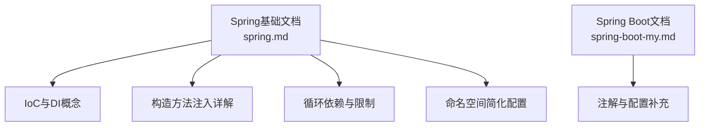
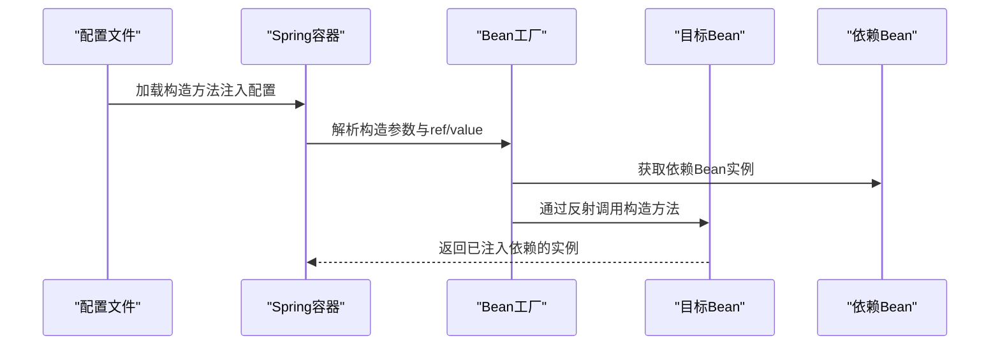
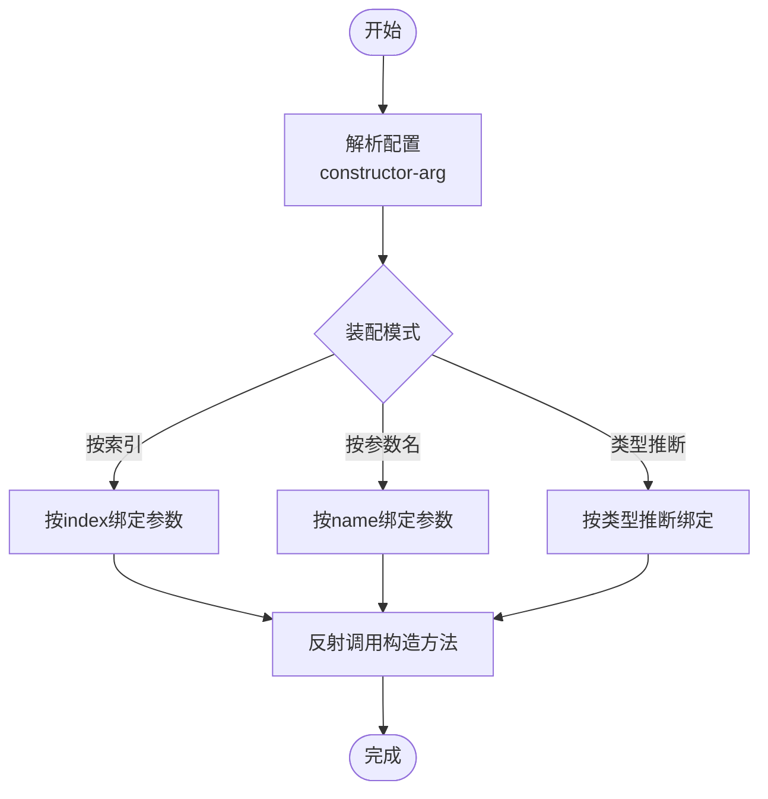
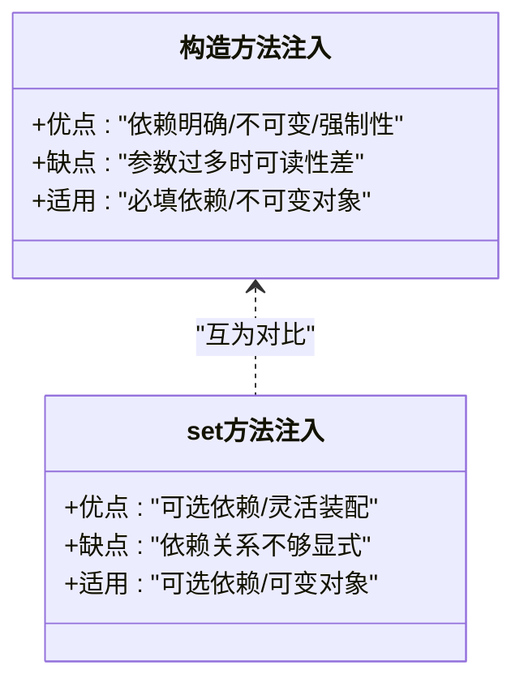
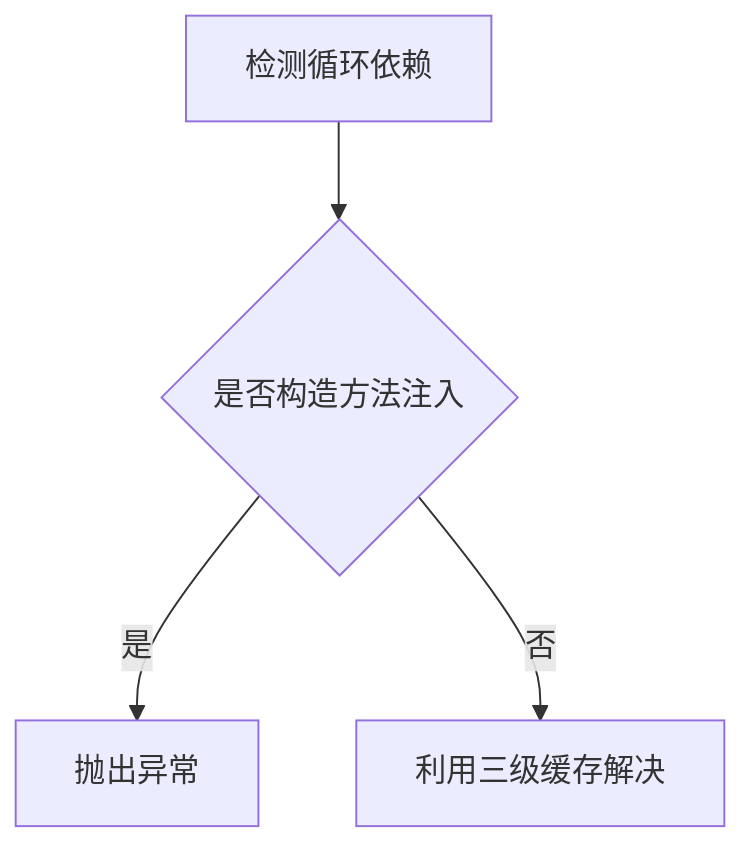
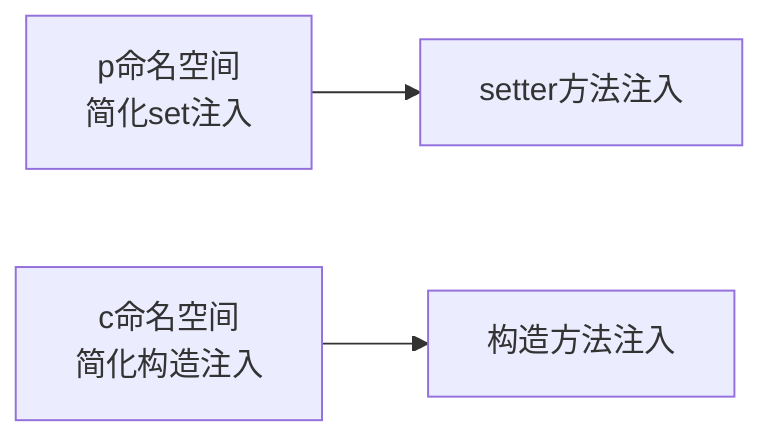
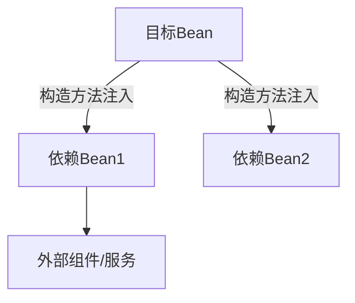

# 构造方法注入

<cite>
**本文引用的文件**
- [spring.md](file://docs/backend-base/spring/spring.md)
- [spring-boot-my.md](file://docs/backend-base/spring/spring-boot-my.md)
</cite>

## 目录
1. [引言](#引言)
2. [项目结构](#项目结构)
3. [核心组件](#核心组件)
4. [架构总览](#架构总览)
5. [详细组件分析](#详细组件分析)
6. [依赖分析](#依赖分析)
7. [性能考量](#性能考量)
8. [故障排查指南](#故障排查指南)
9. [结论](#结论)
10. [附录](#附录)

## 引言
本技术文档围绕Spring框架中的构造方法注入展开，系统阐述其原理、优势与局限、最佳实践与使用场景，并对比set方法注入，给出配置方式与注意事项。读者可据此在不同业务场景中正确选择与实施构造方法注入，提升代码质量与可维护性。

## 项目结构
本仓库与Spring构造方法注入相关的内容主要集中在后端基础文档中的Spring章节，涵盖IoC与DI、构造方法注入、循环依赖、命名空间简化配置等内容。Spring Boot相关文档中包含注解与配置的补充知识。

**图表来源**
- [spring.md:120-135](file://docs/backend-base/spring/spring.md#L120-L135)
- [spring.md:967-1117](file://docs/backend-base/spring/spring.md#L967-L1117)
- [spring.md:4600-4663](file://docs/backend-base/spring/spring.md#L4600-L4663)
- [spring.md:2327-2390](file://docs/backend-base/spring/spring.md#L2327-L2390)
- [spring-boot-my.md:43-288](file://docs/backend-base/spring/spring-boot-my.md#L43-L288)

**章节来源**
- [spring.md:120-135](file://docs/backend-base/spring/spring.md#L120-L135)
- [spring.md:967-1117](file://docs/backend-base/spring/spring.md#L967-L1117)
- [spring.md:4600-4663](file://docs/backend-base/spring/spring.md#L4600-L4663)
- [spring.md:2327-2390](file://docs/backend-base/spring/spring.md#L2327-L2390)
- [spring-boot-my.md:43-288](file://docs/backend-base/spring/spring-boot-my.md#L43-L288)

## 核心组件
- 控制反转（IoC）与依赖注入（DI）
  - IoC是降低耦合度、提升扩展性的设计思想；DI是实现IoC的具体手段，常见方式包括set注入与构造方法注入。
- 构造方法注入
  - 通过调用构造方法完成依赖注入，强调依赖关系的不可变性与强制性，适合不可变对象与必填依赖。
- 循环依赖与限制
  - 构造方法注入在单例作用域下无法解决相互依赖问题，原因在于实例化与属性赋值无法分离。
- 命名空间简化
  - p命名空间用于简化set注入，c命名空间用于简化构造方法注入，提升配置可读性。

**章节来源**
- [spring.md:120-135](file://docs/backend-base/spring/spring.md#L120-L135)
- [spring.md:967-1117](file://docs/backend-base/spring/spring.md#L967-L1117)
- [spring.md:4600-4663](file://docs/backend-base/spring/spring.md#L4600-L4663)
- [spring.md:2327-2390](file://docs/backend-base/spring/spring.md#L2327-L2390)

## 架构总览
下图展示了Spring容器在构造方法注入场景下的关键交互：容器解析配置、通过反射调用构造方法、完成依赖装配与对象实例化。

**图表来源**
- [spring.md:967-1117](file://docs/backend-base/spring/spring.md#L967-L1117)

## 详细组件分析

### 构造方法注入原理与实现
- 原理
  - 通过反射调用目标类的构造方法，将配置文件中声明的依赖按参数顺序或参数名注入到构造方法中。
- 配置要点
  - 支持通过索引（index）、参数名（name）或类型自动推断（不指定索引与参数名）进行装配。
  - 支持简单类型与复杂对象混合注入。
- 示例场景
  - 单个依赖注入：构造方法仅接收一个依赖对象。
  - 多个依赖注入：构造方法接收多个依赖对象，可通过index或name精确绑定。
  - 复杂对象注入：构造方法参数为复杂对象，配合命名空间简化配置。

**图表来源**
- [spring.md:1070-1117](file://docs/backend-base/spring/spring.md#L1070-L1117)

**章节来源**
- [spring.md:967-1117](file://docs/backend-base/spring/spring.md#L967-L1117)
- [spring.md:1070-1117](file://docs/backend-base/spring/spring.md#L1070-L1117)

### 与set方法注入的对比
- 适用场景
  - 构造方法注入：适用于必填依赖、不可变对象、强制性依赖。
  - set方法注入：适用于可选依赖、可变对象、灵活装配。
- 可读性与可维护性
  - 构造方法注入：参数过多时可读性下降，建议拆分对象或使用命名空间简化。
  - set方法注入：配置直观，适合复杂对象的属性装配。
- 循环依赖
  - 构造方法注入：单例作用域下无法解决相互依赖。
  - set方法注入：可借助三级缓存机制解决单例循环依赖。

**图表来源**
- [spring.md:967-1117](file://docs/backend-base/spring/spring.md#L967-L1117)
- [spring.md:4600-4663](file://docs/backend-base/spring/spring.md#L4600-L4663)

**章节来源**
- [spring.md:967-1117](file://docs/backend-base/spring/spring.md#L967-L1117)
- [spring.md:4600-4663](file://docs/backend-base/spring/spring.md#L4600-L4663)

### 循环依赖与限制
- 现象与原因
  - 构造方法注入在单例作用域下若出现相互依赖，会抛出循环依赖异常，原因在于实例化与属性赋值无法分离。
- 解决策略
  - 优先使用set注入与单例缓存机制解决循环依赖。
  - 若必须使用构造方法注入，应避免相互依赖，或通过重构降低耦合。

**图表来源**
- [spring.md:4600-4663](file://docs/backend-base/spring/spring.md#L4600-L4663)

**章节来源**
- [spring.md:4600-4663](file://docs/backend-base/spring/spring.md#L4600-L4663)

### 命名空间简化配置
- p命名空间
  - 基于setter方法的简化配置，适合set注入场景。
- c命名空间
  - 基于构造方法的简化配置，适合构造方法注入场景，支持按参数位置或参数名绑定。

**图表来源**
- [spring.md:2327-2390](file://docs/backend-base/spring/spring.md#L2327-L2390)

**章节来源**
- [spring.md:2327-2390](file://docs/backend-base/spring/spring.md#L2327-L2390)

### Spring Boot中的相关能力补充
- 注解与配置
  - Spring Boot文档中包含常用注解与配置方式，可与构造方法注入结合使用，提升开发效率。
- 参数校验与统一异常处理
  - 结合Spring Validation与全局异常处理，可在构造阶段进行参数校验与错误处理。

**章节来源**
- [spring-boot-my.md:43-288](file://docs/backend-base/spring/spring-boot-my.md#L43-L288)

## 依赖分析
- 组件耦合
  - 构造方法注入强调依赖的不可变性，降低运行期状态变更带来的副作用。
- 直接与间接依赖
  - 通过构造方法注入的依赖属于直接依赖；间接依赖可通过容器管理与装配策略进行控制。
- 外部依赖与集成
  - 构造方法注入便于与外部组件集成，通过参数传递实现解耦。

[本图为概念示意，不直接映射具体源文件]

## 性能考量
- 反射调用成本
  - 构造方法注入依赖反射调用，通常在容器初始化阶段完成，对运行时性能影响有限。
- 配置解析与实例化
  - 复杂配置与大量依赖会增加容器初始化时间，建议合理拆分与延迟加载策略。
- 缓存与单例
  - 单例Bean可复用实例，减少重复创建成本；循环依赖场景需避免构造注入。

[本节为通用指导，不直接分析具体文件]

## 故障排查指南
- 循环依赖异常
  - 现象：构造方法注入导致的单例循环依赖异常。
  - 排查：确认是否存在相互依赖；优先使用set注入或重构依赖关系。
- 参数绑定失败
  - 现象：按索引、参数名或类型推断绑定失败。
  - 排查：核对构造方法签名、配置文件参数顺序与类型一致性。
- 空指针与未初始化
  - 现象：依赖未注入导致空指针。
  - 排查：确认构造方法注入配置完整、依赖Bean已定义并可解析。

**章节来源**
- [spring.md:4600-4663](file://docs/backend-base/spring/spring.md#L4600-L4663)
- [spring.md:1070-1117](file://docs/backend-base/spring/spring.md#L1070-L1117)

## 结论
构造方法注入通过构造函数参数传递依赖对象，强调依赖关系的明确性与不可变性，适合必填依赖与不可变对象。在单例作用域下，若出现相互依赖，应优先考虑set注入或重构设计。结合命名空间与Spring Boot注解，可显著提升配置可读性与开发效率。实践中应根据业务需求与团队约定选择合适的注入方式，并遵循最佳实践以保障代码质量与可维护性。

## 附录
- 代码示例路径参考
  - 单个依赖注入示例：[spring.md:995-1022](file://docs/backend-base/spring/spring.md#L995-L1022)
  - 多个依赖注入示例：[spring.md:1038-1070](file://docs/backend-base/spring/spring.md#L1038-L1070)
  - 不指定索引与参数名示例：[spring.md:1085-1096](file://docs/backend-base/spring/spring.md#L1085-L1096)
  - 循环依赖异常示例：[spring.md:4600-4663](file://docs/backend-base/spring/spring.md#L4600-L4663)
  - 命名空间简化示例：[spring.md:2327-2390](file://docs/backend-base/spring/spring.md#L2327-L2390)