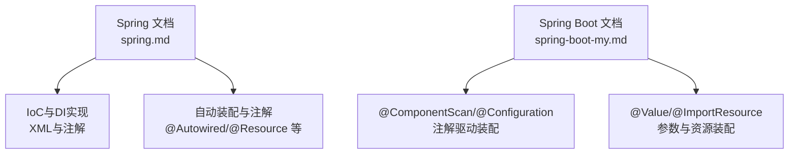
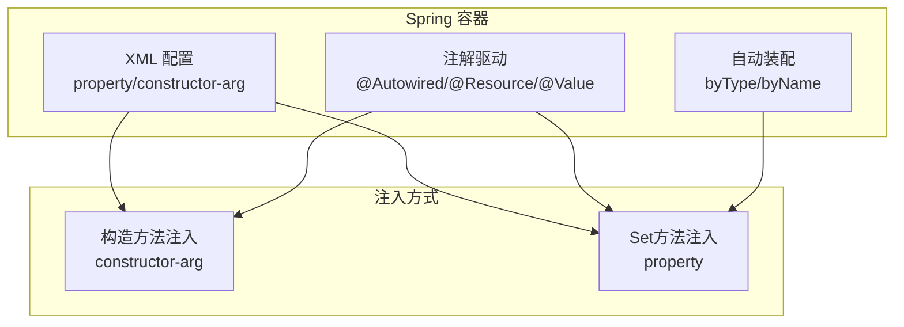
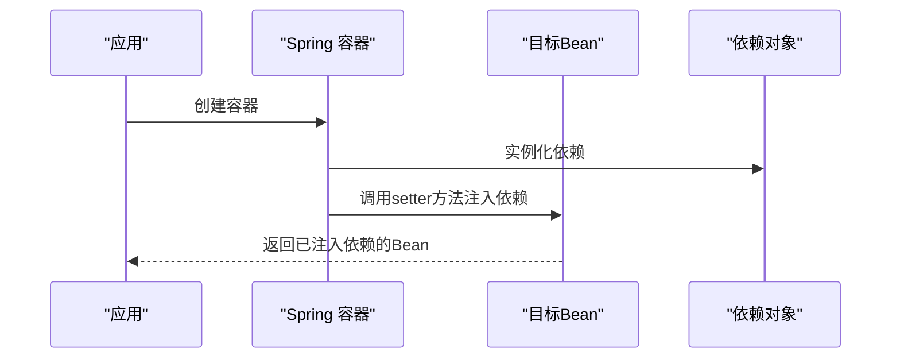
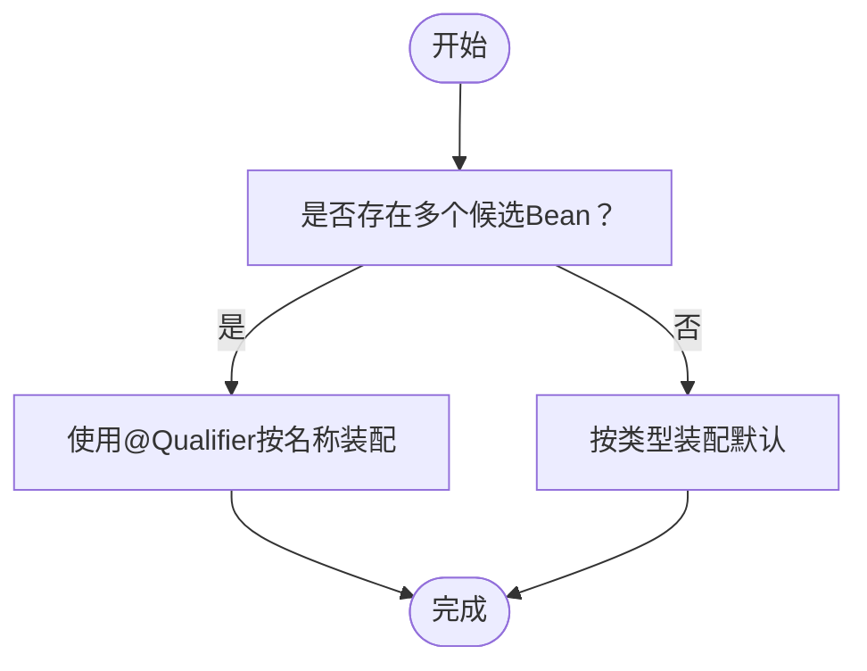
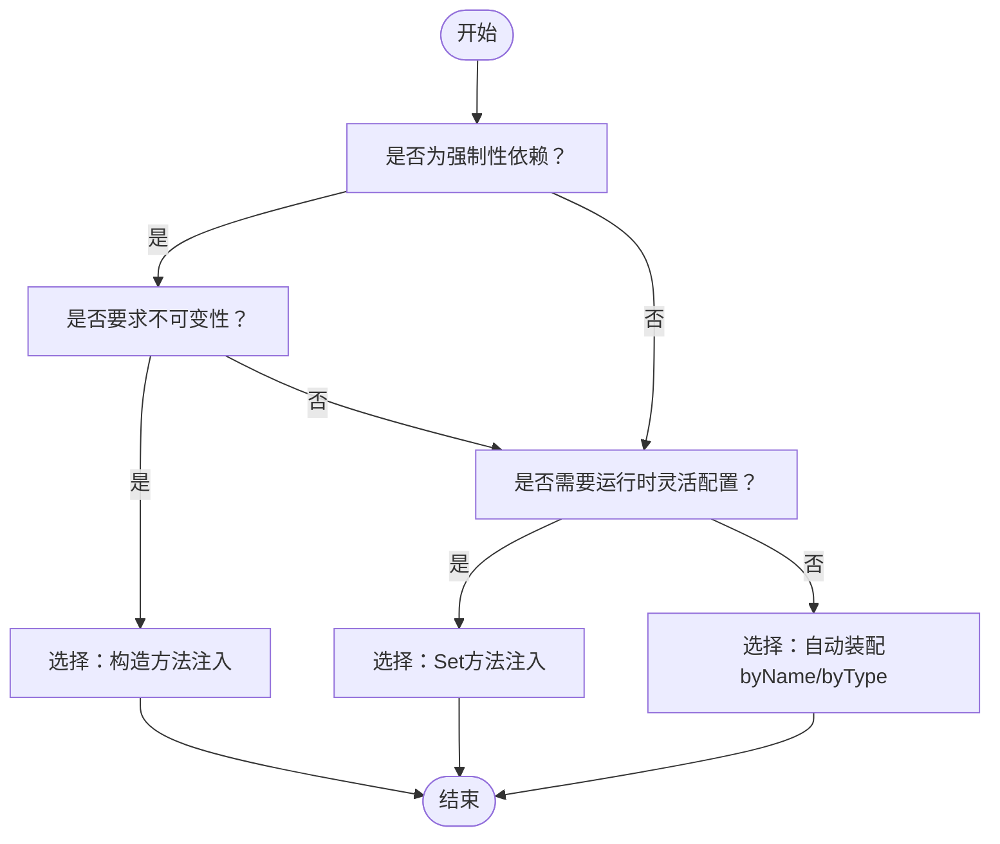

# 注入方式对比与选择

<cite>
**本文引用的文件**
- [spring.md](file://docs/backend-base/spring/spring.md)
- [spring-boot-my.md](file://docs/backend-base/spring/spring-boot-my.md)
</cite>

## 目录
1. [引言](#引言)
2. [项目结构](#项目结构)
3. [核心组件](#核心组件)
4. [架构总览](#架构总览)
5. [详细组件分析](#详细组件分析)
6. [依赖分析](#依赖分析)
7. [性能考量](#性能考量)
8. [故障排查指南](#故障排查指南)
9. [结论](#结论)
10. [附录](#附录)

## 引言
本文件围绕Spring依赖注入的两种主流方式——构造方法注入与Set方法注入，进行系统化对比与选择指导。内容涵盖性能差异、安全性考虑、可测试性影响、代码可读性、适用场景与混合使用策略，并提供决策树与实践建议，帮助开发者在真实项目中做出合理选择。

## 项目结构
本仓库包含Spring与Spring Boot相关文档，其中Spring章节详细讲解了IoC与DI的实现方式，包括XML配置与注解驱动的装配策略；Spring Boot章节补充了注解与自动装配的使用方式。这些内容为本文件的对比分析提供了充分的背景材料。

图表来源
- [spring.md](file://docs/backend-base/spring/spring.md)
- [spring-boot-my.md](file://docs/backend-base/spring/spring-boot-my.md)

章节来源
- [spring.md](file://docs/backend-base/spring/spring.md)
- [spring-boot-my.md](file://docs/backend-base/spring/spring-boot-my.md)

## 核心组件
- 构造方法注入：通过调用构造方法完成依赖注入，强调不可变性与强制性依赖的完整性。
- Set方法注入：通过反射调用setter方法完成依赖注入，适合可选依赖与复杂配置场景。
- 注解驱动：@Autowired/@Qualifier/@Resource等注解提供按类型/名称装配能力，简化XML配置。
- 自动装配：byType/byName自动装配减少显式配置，提升开发效率。

章节来源
- [spring.md: 依赖注入实现（set注入/构造注入）](file://docs/backend-base/spring/spring.md)
- [spring.md: 自动装配（byName/byType）](file://docs/backend-base/spring/spring.md)
- [spring.md: 注解驱动（@Autowired/@Qualifier/@Resource）](file://docs/backend-base/spring/spring.md)
- [spring-boot-my.md: 注解与装配（@ComponentScan/@Configuration/@Value）](file://docs/backend-base/spring/spring-boot-my.md)

## 架构总览
下图展示了Spring容器中依赖注入的两种实现路径及其与注解驱动的关系。

图表来源
- [spring.md](file://docs/backend-base/spring/spring.md)
- [spring-boot-my.md](file://docs/backend-base/spring/spring-boot-my.md)

## 详细组件分析

### 构造方法注入（Constructor Injection）
- 实现原理：通过调用构造方法完成依赖注入，底层使用反射机制传入依赖对象。
- 优点
  - 强制性依赖：构造阶段即完成必需依赖的注入，避免运行时空指针。
  - 不可变性：依赖注入后对象状态稳定，便于并发安全与单元测试。
  - 显式契约：构造函数签名清晰表达依赖关系，便于阅读与维护。
- 适用场景
  - 强制性依赖：业务逻辑必须依赖的组件，不可为null。
  - 不可变性要求：对象创建后不应再变更依赖。
  - 复杂对象初始化：需要在构造阶段完成一系列初始化步骤。
- 注意事项
  - 参数过多时可考虑分层构造或工厂方法。
  - 与自动装配结合时需注意类型唯一性，避免歧义。

图表来源
- [spring.md: 构造注入示例与参数装配](file://docs/backend-base/spring/spring.md)

章节来源
- [spring.md: 构造注入实现与参数装配](file://docs/backend-base/spring/spring.md)

### Set方法注入（Setter Injection）
- 实现原理：通过反射调用setter方法完成依赖注入，底层使用反射机制。
- 优点
  - 灵活配置：适合可选依赖与复杂配置场景，便于在运行时替换依赖。
  - 兼容性强：无需修改构造函数即可调整依赖。
- 适用场景
  - 可选依赖：某些依赖并非始终必需。
  - 复杂配置：需要在运行时根据环境动态配置依赖。
  - 与自动装配结合：byName/byType自动装配减少显式配置。
- 注意事项
  - 需提供setter方法，保持属性可变性。
  - 可能存在中间态，需在业务逻辑中处理未注入的情况。

图表来源
- [spring.md: Set注入实现与自动装配](file://docs/backend-base/spring/spring.md)

章节来源
- [spring.md: Set注入实现与自动装配](file://docs/backend-base/spring/spring.md)

### 注解驱动与自动装配
- @Autowired：默认按类型装配，可与@Qualifier按名称装配，支持属性/构造方法/构造方法参数/setter方法。
- @Resource：默认按名称装配，未指定名称时使用属性名，找不到再按类型装配，适用于标准注解。
- 自动装配：byName/byType减少XML配置，提升开发效率，但需注意类型唯一性与命名一致性。

图表来源
- [spring.md: @Autowired/@Qualifier/@Resource](file://docs/backend-base/spring/spring.md)

章节来源
- [spring.md: 注解驱动与自动装配](file://docs/backend-base/spring/spring.md)

## 依赖分析
- 组件耦合
  - 构造注入强调依赖在创建时即确定，降低运行时变更风险。
  - Set注入提供运行时灵活性，但可能引入中间态与并发问题。
- 直接/间接依赖
  - 构造注入更易暴露深层依赖，便于审查与重构。
  - Set注入可通过自动装配减少显式依赖声明。
- 循环依赖
  - 构造注入在循环依赖场景下更易暴露问题，需通过重构或使用@Lazy等手段规避。
  - Set注入在某些场景下可借助延迟初始化缓解循环依赖。

章节来源
- [spring.md: 自动装配（byName/byType）](file://docs/backend-base/spring/spring.md)
- [spring.md: 注解驱动（@Autowired/@Qualifier/@Resource）](file://docs/backend-base/spring/spring.md)

## 性能考量
- 初始化成本
  - 构造注入在对象创建时完成依赖注入，初始化路径更短，适合高频创建场景。
  - Set注入在对象创建后通过setter注入，可能增加一次反射调用。
- 内存占用
  - 两者在内存占用上差异较小，主要取决于依赖对象本身。
- 并发安全
  - 构造注入完成后对象不可变，天然具备并发安全性。
  - Set注入若在运行时可变，需额外同步措施。

章节来源
- [spring.md: 构造注入与Set注入实现原理](file://docs/backend-base/spring/spring.md)

## 故障排查指南
- 空指针异常
  - 构造注入：确认必需依赖是否正确装配，避免遗漏。
  - Set注入：检查setter方法是否被调用，必要时添加初始化校验。
- 类型歧义
  - @Autowired默认按类型装配，若存在多个候选Bean，使用@Qualifier指定名称。
- 名称不匹配
  - @Resource默认按名称装配，未指定名称时使用属性名，确保Bean名称与属性名一致或显式指定。
- 自动装配冲突
  - byType装配时确保类型唯一，byName装配时确保名称唯一且正确。

章节来源
- [spring.md: @Autowired/@Qualifier/@Resource](file://docs/backend-base/spring/spring.md)
- [spring.md: 自动装配（byName/byType）](file://docs/backend-base/spring/spring.md)

## 结论
- 构造方法注入更适合强制性依赖与不可变性要求高的场景，强调初始化完整性与并发安全。
- Set方法注入更适合可选依赖与复杂配置场景，强调运行时灵活性与自动装配能力。
- 注解驱动与自动装配显著提升开发效率，但需关注类型唯一性与命名一致性。
- 混合使用时，建议以构造注入为主、Set注入为辅，关键依赖通过构造注入，可选依赖通过Set注入或自动装配。

## 附录

### 决策树与选择指南

### 实战建议
- 优先使用构造方法注入表达强制依赖，确保对象创建即完整。
- 对可选依赖与复杂配置使用Set注入或自动装配，提升灵活性。
- 注解驱动装配时，明确@Qualifier与@Resource的装配策略，避免歧义。
- 在循环依赖场景下，优先重构依赖关系，必要时使用延迟初始化或@Lazy。

章节来源
- [spring.md: 构造注入/Set注入/自动装配/注解驱动](file://docs/backend-base/spring/spring.md)
- [spring-boot-my.md: 注解与装配（@ComponentScan/@Configuration/@Value）](file://docs/backend-base/spring/spring-boot-my.md)