# Spring Boot开发

<cite>
**本文引用的文件**
- [README.md](file://README.md)
- [spring-boot.md](file://docs/backend-base/spring/spring-boot.md)
- [spring-boot-my.md](file://docs/backend-base/spring/spring-boot-my.md)
- [deploy.yml](file://.github/workflows/deploy.yml)
</cite>

## 目录
1. [引言](#引言)
2. [项目结构](#项目结构)
3. [核心组件](#核心组件)
4. [架构总览](#架构总览)
5. [详细组件分析](#详细组件分析)
6. [依赖分析](#依赖分析)
7. [性能考虑](#性能考虑)
8. [故障排查指南](#故障排查指南)
9. [结论](#结论)
10. [附录](#附录)

## 引言
本技术文档围绕Spring Boot快速开发展开，系统阐述自动配置机制、Starter启动器与“约定优于配置”的理念，提供从项目创建、配置、打包到部署的完整流程说明。文档同时覆盖Web开发、数据访问、安全配置、监控与健康检查等常用功能，并给出微服务架构下的最佳实践建议，帮助开发者高效构建企业级应用。

## 项目结构
该仓库为文档型项目，Spring Boot相关内容集中在docs/backend-base/spring目录下，包含Spring Boot入门、自动配置、Starter、配置文件、Web开发、模板引擎、消息转换器、监控与健康检查等主题。CI/CD方面，仓库提供GitHub Actions工作流，用于自动化构建与部署静态站点。

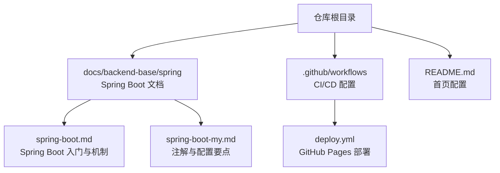

图表来源
- [spring-boot.md](file://docs/backend-base/spring/spring-boot.md)
- [spring-boot-my.md](file://docs/backend-base/spring/spring-boot-my.md)
- [deploy.yml](file://.github/workflows/deploy.yml)
- [README.md](file://README.md)

章节来源
- [README.md](file://README.md)
- [spring-boot.md](file://docs/backend-base/spring/spring-boot.md)
- [spring-boot-my.md](file://docs/backend-base/spring/spring-boot-my.md)
- [deploy.yml](file://.github/workflows/deploy.yml)

## 核心组件
- 自动配置与Starter
  - 自动配置通过@EnableAutoConfiguration扫描类路径，按需装配Web、数据访问、监控等组件。
  - Starter将一组依赖与自动配置打包，开发者仅需引入对应Starter即可快速集成功能。
- 核心注解
  - @SpringBootApplication：组合@Configuration、@EnableAutoConfiguration、@ComponentScan，作为应用入口。
  - @EnableAutoConfiguration：开启自动配置。
  - @ComponentScan：扫描组件，默认扫描主类所在包及子包。
  - @Value、@ConfigurationProperties、@EnableConfigurationProperties：配置注入与属性绑定。
  - @RestController、@RequestMapping、@ResponseBody、@RequestBody、@RequestParam、@PathVariable：Web开发常用注解。
- 配置体系
  - application.properties/yml/yaml优先级与命令行参数、系统属性覆盖规则。
  - 配置文件位置与导入策略，支持多环境与模块化配置。
- Web与消息转换
  - 默认提供多种HttpMessageConverter，支持JSON、XML、表单等。
  - 可扩展自定义消息转换器与媒体类型。
- 模板引擎
  - Thymeleaf自动配置与核心语法，适用于传统Web页面渲染。
- 监控与健康检查
  - 自动暴露健康检查、指标等生产监控能力。

章节来源
- [spring-boot.md](file://docs/backend-base/spring/spring-boot.md)
- [spring-boot-my.md](file://docs/backend-base/spring/spring-boot-my.md)

## 架构总览
Spring Boot通过“约定优于配置”简化开发，Starter聚合依赖与自动配置，自动配置根据类路径与条件装配组件，开发者通过少量配置即可完成Web、数据、安全、监控等功能集成。

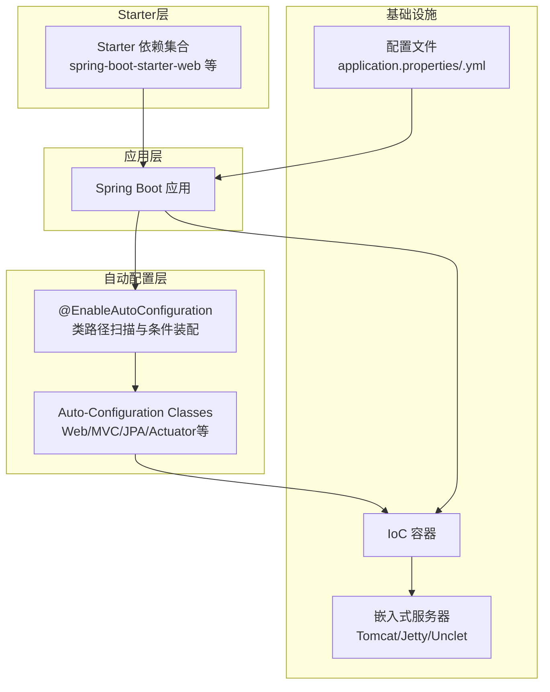

图表来源
- [spring-boot.md](file://docs/backend-base/spring/spring-boot.md)

## 详细组件分析

### 自动配置与Starter机制
- 自动配置原理
  - 启动时加载Starter传递引入的自动配置依赖，扫描152个自动配置类，按条件筛选并装配组件。
  - 属性绑定：配置文件与属性类绑定，驱动组件初始化。
- Starter实现
  - 依赖聚合、传递、版本管理与自动配置协同工作，简化依赖与配置。

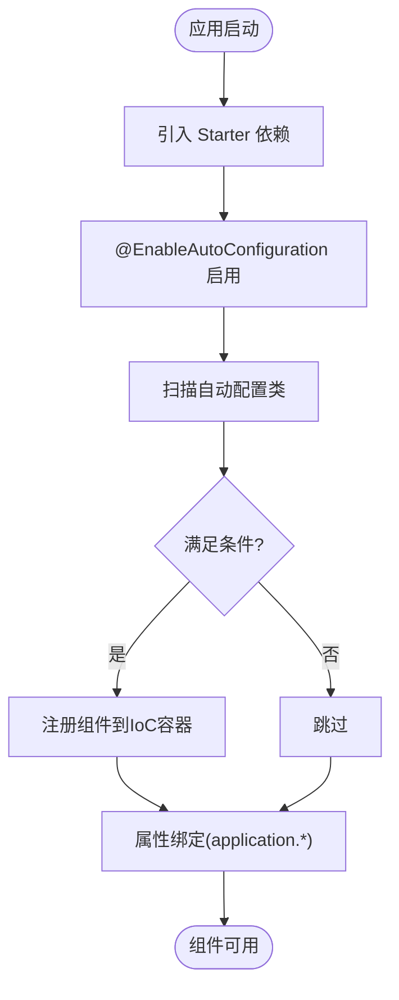

图表来源
- [spring-boot.md](file://docs/backend-base/spring/spring-boot.md)

章节来源
- [spring-boot.md](file://docs/backend-base/spring/spring-boot.md)

### 核心注解与使用
- @SpringBootApplication
  - 组合注解，包含@EnableAutoConfiguration与@ComponentScan，作为应用入口。
- @EnableAutoConfiguration
  - 开启自动配置，按类路径装配组件。
- @ComponentScan
  - 扫描组件，默认扫描主类所在包及子包。
- 配置注入
  - @Value：从配置文件注入简单属性。
  - @ConfigurationProperties/@EnableConfigurationProperties：批量绑定属性到对象。
- Web注解
  - @RestController、@RequestMapping、@ResponseBody、@RequestBody、@RequestParam、@PathVariable等。

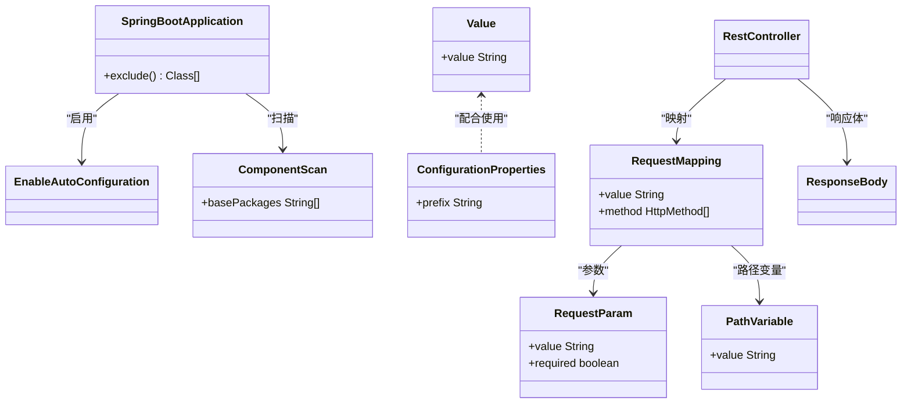

图表来源
- [spring-boot-my.md](file://docs/backend-base/spring/spring-boot-my.md)

章节来源
- [spring-boot-my.md](file://docs/backend-base/spring/spring-boot-my.md)

### 配置体系与优先级
- 配置文件优先级（从高到低）
  - 命令行参数 > 系统属性 > properties > yml > yaml
- 位置与导入
  - 支持classpath:/config、classpath:/、file:./config、file:./等多位置。
  - 支持spring.config.import按模块导入配置文件。
- YAML与Properties
  - YAML支持层级结构，更易读；两者共存时Properties优先解析。

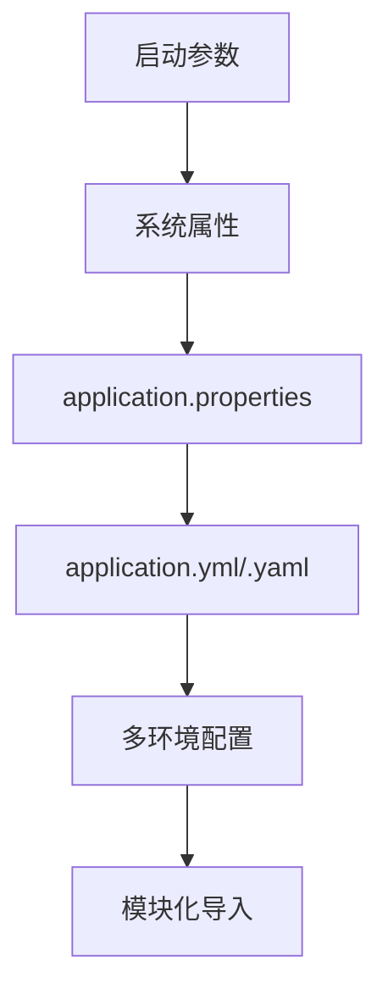

图表来源
- [spring-boot.md](file://docs/backend-base/spring/spring-boot.md)

章节来源
- [spring-boot.md](file://docs/backend-base/spring/spring-boot.md)

### Web开发与消息转换
- 默认消息转换器
  - ByteArray/String/Resource/ResourceRegion/Form/MappingJackson2等。
- 自定义消息转换器
  - 引入Jackson YAML依赖，新增媒体类型，自定义Converter并注册。
- Thymeleaf集成
  - 自动配置类与默认前缀/后缀，支持表达式、片段复用等。

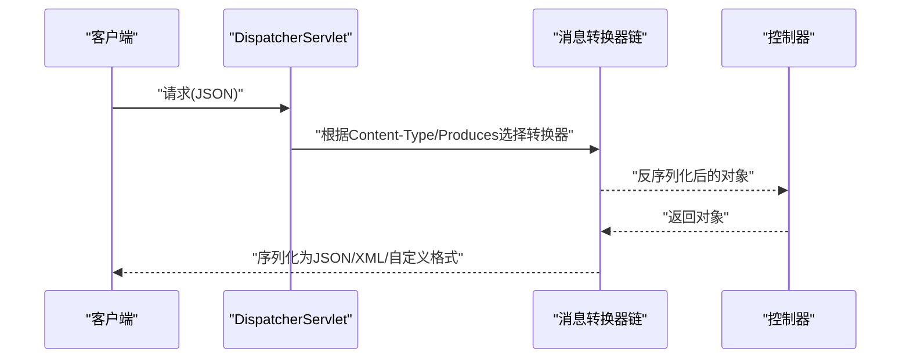

图表来源
- [spring-boot.md](file://docs/backend-base/spring/spring-boot.md)

章节来源
- [spring-boot.md](file://docs/backend-base/spring/spring-boot.md)

### 数据访问与MyBatis
- Starter与依赖
  - 引入spring-boot-starter-web与MyBatis相关依赖，自动配置数据源与SQL会话工厂。
- 配置与使用
  - application.properties中配置数据源、MyBatis映射文件路径等。
  - Mapper接口与XML映射文件按约定放置，自动扫描注册。

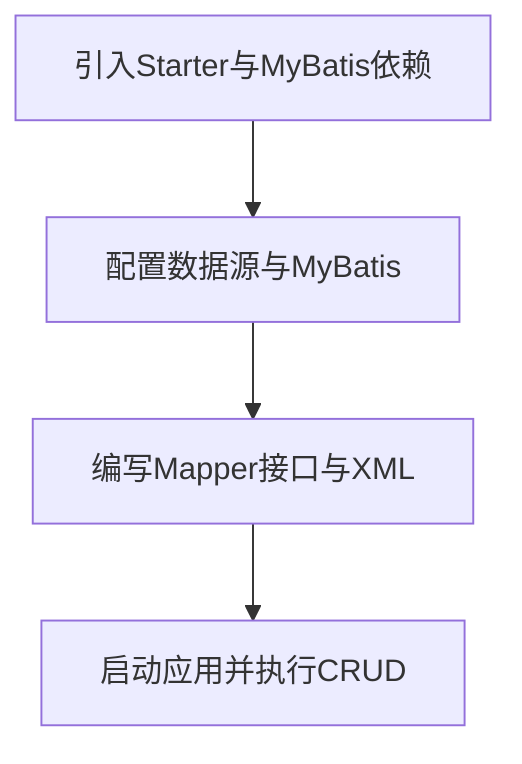

图表来源
- [spring-boot.md](file://docs/backend-base/spring/spring-boot.md)

章节来源
- [spring-boot.md](file://docs/backend-base/spring/spring-boot.md)

### 安全配置与认证授权
- Starter与依赖
  - 引入spring-boot-starter-security与相关依赖。
- 配置要点
  - WebSecurityConfigurerAdapter或基于方法级安全注解（@PreAuthorize等）。
  - 用户详情与密码编码器配置，内存或数据库用户存储。
- OAuth2/JWT
  - 可选引入OAuth2或JWT相关Starter，按需配置资源服务器与客户端。

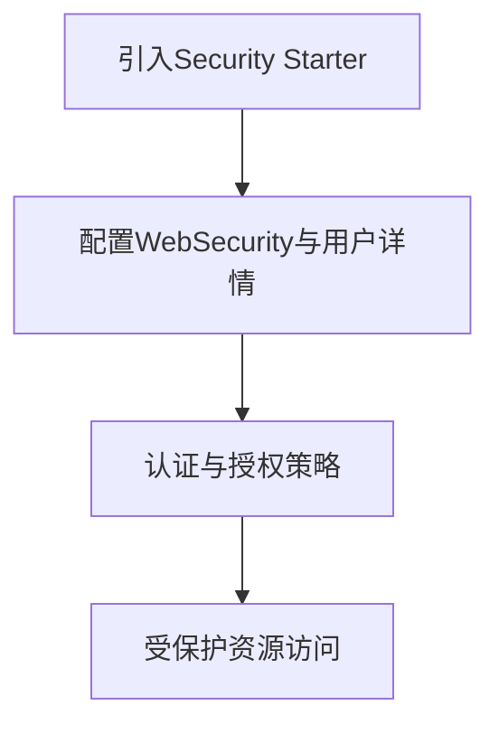

图表来源
- [spring-boot.md](file://docs/backend-base/spring/spring-boot.md)

章节来源
- [spring-boot.md](file://docs/backend-base/spring/spring-boot.md)

### 监控与健康检查
- Actuator
  - 引入spring-boot-starter-actuator，自动暴露健康检查、指标、环境信息等端点。
- 自定义健康指示器
  - 实现HealthIndicator，提供业务健康状态。
- 生产监控
  - 结合Prometheus/Grafana或Cloud Native监控体系采集指标。

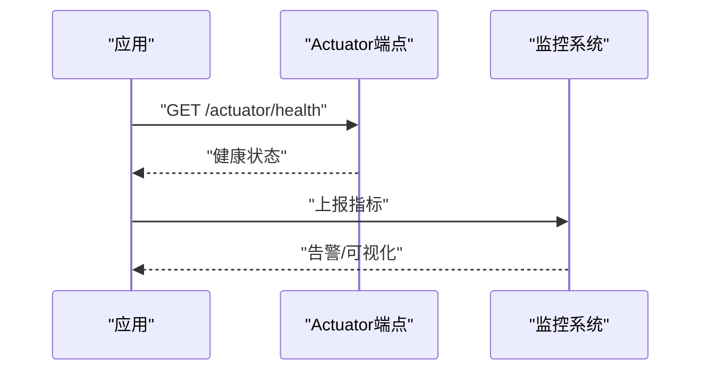

图表来源
- [spring-boot.md](file://docs/backend-base/spring/spring-boot.md)

章节来源
- [spring-boot.md](file://docs/backend-base/spring/spring-boot.md)

### 微服务架构下的最佳实践
- 服务拆分与边界
  - 按业务域拆分服务，明确职责边界，避免过度耦合。
- 配置中心
  - 使用Spring Cloud Config或本地配置文件，集中管理多环境配置。
- 服务发现与网关
  - 使用Eureka/Nacos注册发现，Gateway路由转发。
- 断路器与限流
  - Resilience4j/Hystrix实现熔断与降级，Sentinel/Gateway限流。
- 日志与追踪
  - 结合Zipkin/Sleuth实现分布式追踪，统一日志采集与检索。
- 安全与鉴权
  - OAuth2/JWT统一认证，RBAC权限控制，敏感接口HTTPS与令牌校验。

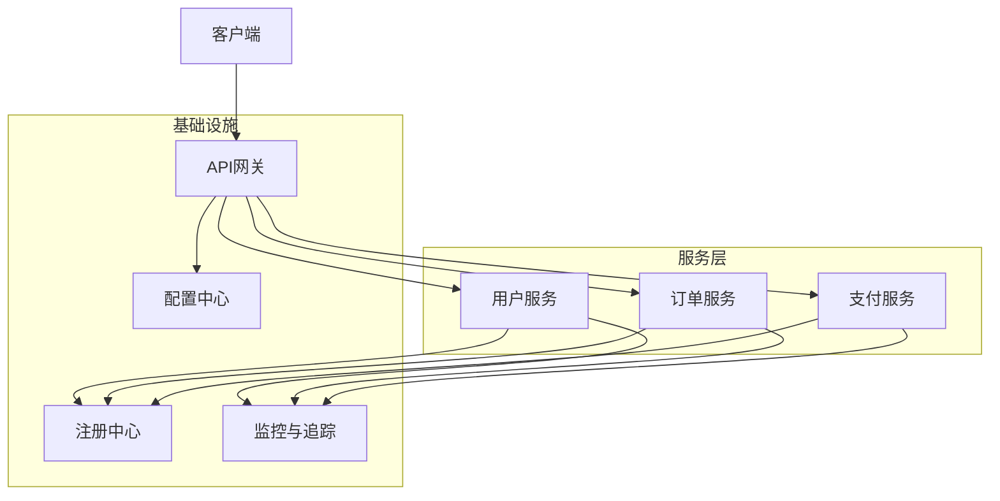

图表来源
- [spring-boot.md](file://docs/backend-base/spring/spring-boot.md)

章节来源
- [spring-boot.md](file://docs/backend-base/spring/spring-boot.md)

## 依赖分析
- Starter与自动配置
  - web启动器传递引入spring-boot-autoconfigure，自动装配Web相关组件。
- 配置与版本管理
  - 通过spring-boot-dependencies统一管理版本，避免依赖冲突。
- 插件与构建
  - spring-boot-maven-plugin负责打包可执行jar，包含嵌入式服务器与依赖。

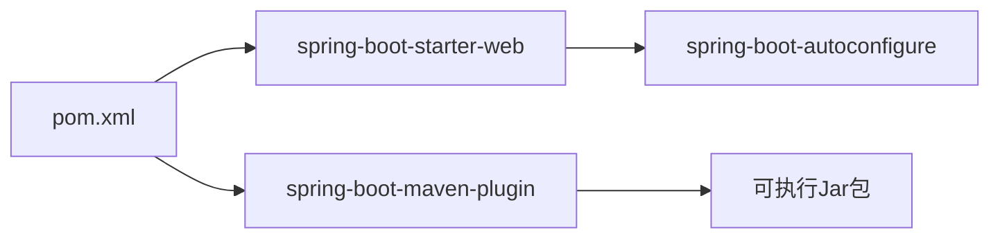

图表来源
- [spring-boot.md](file://docs/backend-base/spring/spring-boot.md)

章节来源
- [spring-boot.md](file://docs/backend-base/spring/spring-boot.md)

## 性能考虑
- 启动性能
  - 合理使用Starter，避免引入不必要的自动配置；利用条件注解减少无效装配。
- 运行性能
  - 选择合适的嵌入式服务器与线程池配置；启用压缩与缓存；合理设置连接池大小。
- 监控与调优
  - 利用Actuator指标与APM工具定位瓶颈，持续优化关键路径。

## 故障排查指南
- 配置优先级问题
  - 检查命令行参数、系统属性、配置文件位置与导入顺序，确认最终生效值。
- 自动配置未生效
  - 排查类路径依赖、条件注解与属性开关；必要时排除特定自动配置类。
- Web请求异常
  - 检查消息转换器链、媒体类型与@RequestBody/@ResponseBody使用是否正确。
- 部署与运行
  - 使用spring-boot-maven-plugin打包；确认JDK版本与依赖版本兼容；在容器中设置合适JVM参数。

章节来源
- [spring-boot.md](file://docs/backend-base/spring/spring-boot.md)
- [spring-boot-my.md](file://docs/backend-base/spring/spring-boot-my.md)

## 结论
Spring Boot通过自动配置与Starter大幅降低配置成本，结合“约定优于配置”的理念，使开发者能聚焦业务逻辑。配合完善的Web、数据、安全、监控与微服务生态，可高效构建现代化企业级应用。建议在实践中遵循模块化、可观察性与安全性原则，持续优化性能与稳定性。

## 附录
- CI/CD与部署
  - 使用GitHub Actions在推送master时自动构建并部署至GitHub Pages，适合文档类站点的自动化发布。

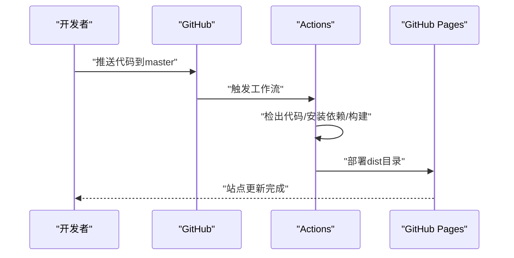

图表来源
- [deploy.yml](file://.github/workflows/deploy.yml)

章节来源
- [deploy.yml](file://.github/workflows/deploy.yml)