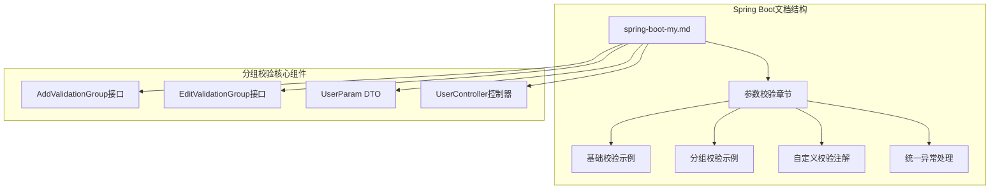
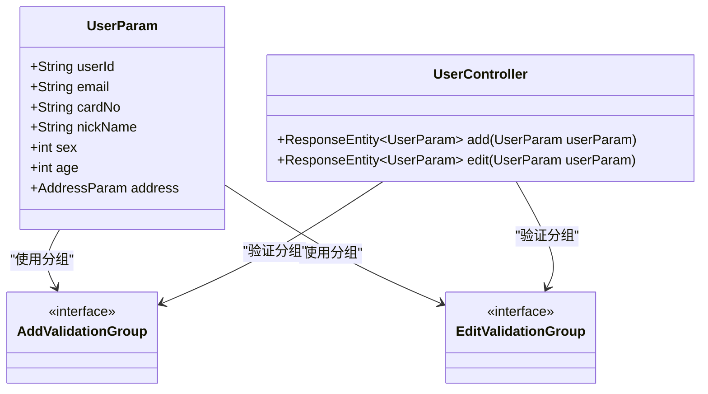
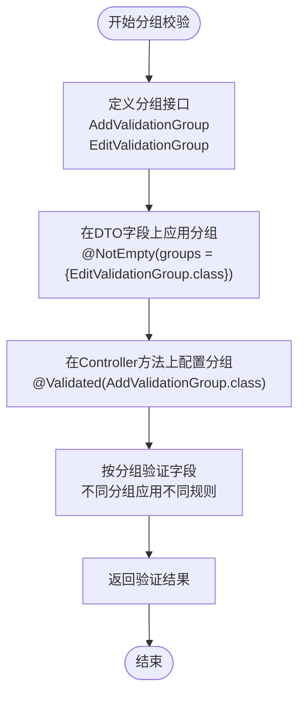
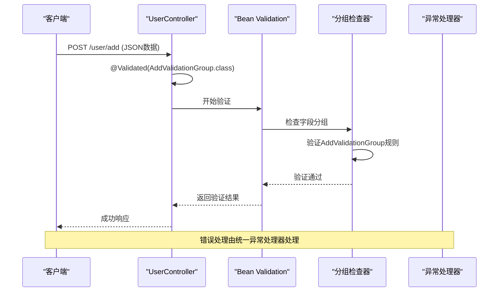
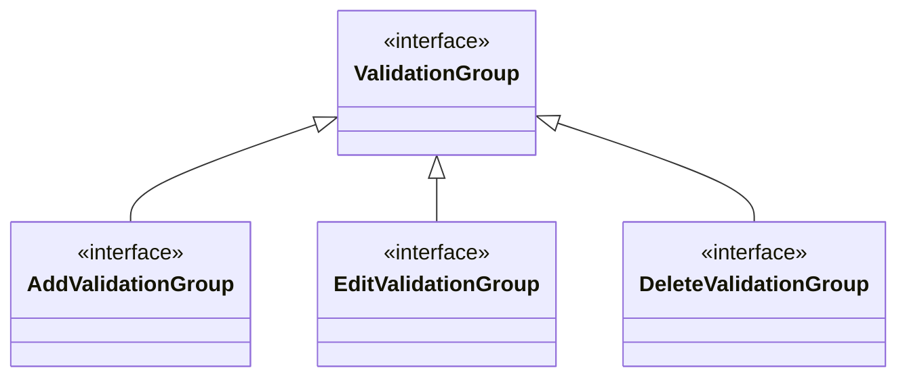
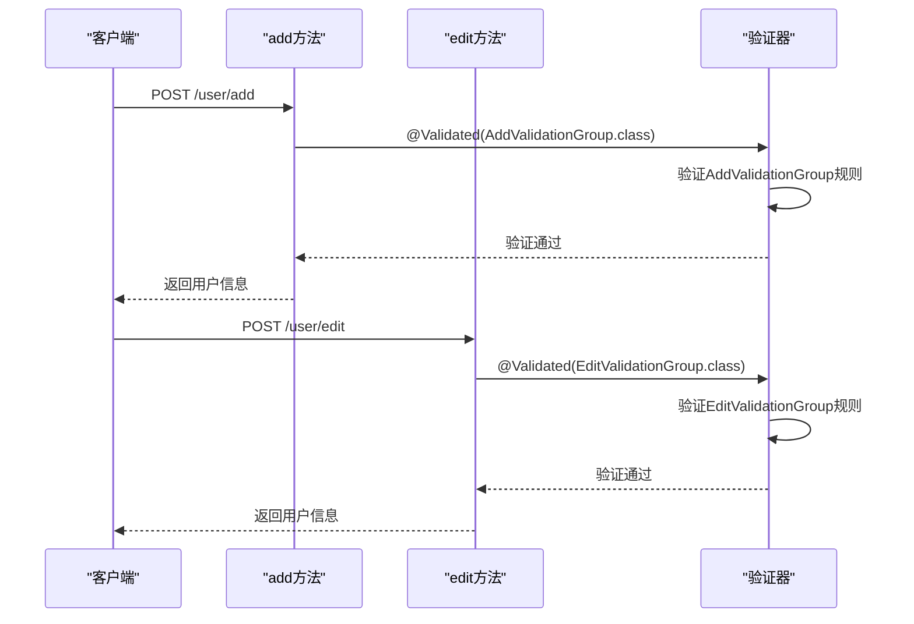
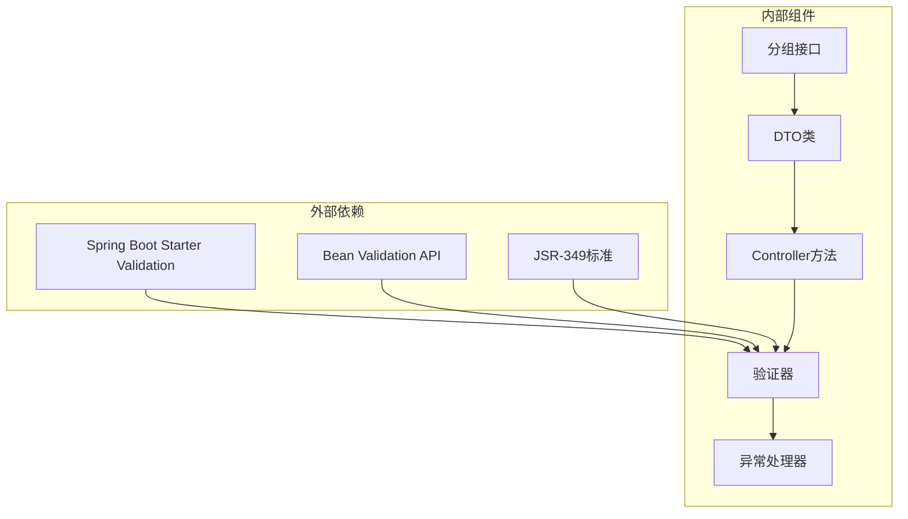

# 分组校验

<cite>
**本文档引用的文件**
- [spring-boot-my.md](file://docs/backend-base/spring/spring-boot-my.md)
</cite>

## 目录
1. [简介](#简介)
2. [项目结构](#项目结构)
3. [核心组件](#核心组件)
4. [架构概览](#架构概览)
5. [详细组件分析](#详细组件分析)
6. [依赖关系分析](#依赖关系分析)
7. [性能考虑](#性能考虑)
8. [故障排除指南](#故障排除指南)
9. [结论](#结论)

## 简介

Spring Boot分组校验是一种强大的参数验证机制，它允许开发者为同一个DTO类在不同业务场景下应用不同的校验规则。当一个DTO类需要在新增用户和编辑用户等不同业务场景下采用不同校验规则时，分组校验提供了优雅的解决方案。

分组校验的核心优势在于：
- **灵活性**：同一DTO类可支持多种业务场景
- **可维护性**：避免重复代码和分散的校验逻辑
- **可扩展性**：轻松添加新的业务场景和校验规则
- **类型安全**：编译时检查确保校验规则的一致性

## 项目结构

该项目采用文档驱动的组织方式，Spring Boot相关的内容集中在`docs/backend-base/spring/`目录下。分组校验功能的完整实现示例位于`spring-boot-my.md`文件中。



**图表来源**
- [spring-boot-my.md:289-452](file://docs/backend-base/spring/spring-boot-my.md#L289-L452)

**章节来源**
- [spring-boot-my.md:1-647](file://docs/backend-base/spring/spring-boot-my.md#L1-L647)

## 核心组件

### 分组接口设计

分组校验的基础是定义分组接口，这些接口无需实现任何方法，仅作为标记使用：



**图表来源**
- [spring-boot-my.md:392-449](file://docs/backend-base/spring/spring-boot-my.md#L392-L449)

### DTO字段分组配置

在DTO类中，通过`groups`属性为特定字段指定适用的分组：



**图表来源**
- [spring-boot-my.md:399-452](file://docs/backend-base/spring/spring-boot-my.md#L399-L452)

**章节来源**
- [spring-boot-my.md:392-452](file://docs/backend-base/spring/spring-boot-my.md#L392-L452)

## 架构概览

分组校验的实现遵循标准的Spring MVC验证流程，但增加了分组维度的控制：



**图表来源**
- [spring-boot-my.md:417-449](file://docs/backend-base/spring/spring-boot-my.md#L417-L449)

## 详细组件分析

### 分组接口实现

分组接口的设计遵循最小化原则，仅作为标记使用：



**图表来源**
- [spring-boot-my.md:392-396](file://docs/backend-base/spring/spring-boot-my.md#L392-L396)

### 字段级分组配置

字段级别的分组配置展示了如何为同一字段在不同分组下设置不同的校验规则：

```mermaid
flowchart LR
subgraph "字段分组配置"
A[userId字段] --> B[EditValidationGroup分组]
A --> C[AddValidationGroup分组]
end
subgraph "分组规则"
B --> D[@NotEmpty规则]
C --> E[无规则或宽松规则]
end
subgraph "验证场景"
F[新增用户] --> G[AddValidationGroup]
H[编辑用户] --> I[EditValidationGroup]
end
G --> E
I --> D
```

**图表来源**
- [spring-boot-my.md:409](file://docs/backend-base/spring/spring-boot-my.md#L409)

### 控制器方法分组应用

控制器方法通过`@Validated`注解指定使用的分组：



**图表来源**
- [spring-boot-my.md:433](file://docs/backend-base/spring/spring-boot-my.md#L433)
- [spring-boot-my.md:446](file://docs/backend-base/spring/spring-boot-my.md#L446)

**章节来源**
- [spring-boot-my.md:387-452](file://docs/backend-base/spring/spring-boot-my.md#L387-L452)

### 常用校验注解对比

分组校验与条件校验的主要区别体现在注解的使用方式和验证时机：

| 注解类型 | 位置 | 功能 | 适用场景 |
|---------|------|------|----------|
| @Validated | 方法参数 | 支持分组验证 | 新增、编辑等不同业务场景 |
| @Valid | 字段、方法参数 | 基础验证 | 简单的字段验证 |
| @NotEmpty | 字段 | 非空验证 | 必填字段 |
| @NotBlank | 字段 | 非空白验证 | 字符串验证 |
| @NotNull | 字段 | 非null验证 | 对象验证 |

**章节来源**
- [spring-boot-my.md:454-467](file://docs/backend-base/spring/spring-boot-my.md#L454-L467)

## 依赖关系分析

分组校验功能的实现依赖于Spring Boot的自动配置和Bean Validation标准：



**图表来源**
- [spring-boot-my.md:295-303](file://docs/backend-base/spring/spring-boot-my.md#L295-L303)

**章节来源**
- [spring-boot-my.md:289-303](file://docs/backend-base/spring/spring-boot-my.md#L289-L303)

## 性能考虑

分组校验的性能特点：

- **零开销接口**：分组接口不包含任何方法，不会产生额外的运行时开销
- **编译时检查**：分组类型在编译时进行检查，避免运行时错误
- **延迟验证**：验证过程在参数绑定完成后执行，不影响正常的数据传输
- **内存效率**：分组接口的实例化成本极低

最佳实践建议：
- 合理设计分组数量，避免过度细分
- 为常用的业务场景定义专门的分组
- 在DTO类中保持分组配置的清晰性和一致性

## 故障排除指南

### 常见问题及解决方案

1. **分组接口未定义**
   - 症状：编译错误，提示分组接口不存在
   - 解决方案：确保分组接口在正确的位置定义

2. **字段分组配置错误**
   - 症状：验证规则不生效或触发意外的验证
   - 解决方案：检查字段上的`groups`属性配置

3. **控制器方法分组不匹配**
   - 症状：参数验证失败，提示缺少必要的字段
   - 解决方案：确认控制器方法使用的分组与DTO字段配置一致

4. **异常处理配置问题**
   - 症状：验证错误无法正确处理
   - 解决方案：检查统一异常处理器的配置

**章节来源**
- [spring-boot-my.md:585-627](file://docs/backend-base/spring/spring-boot-my.md#L585-L627)

## 结论

Spring Boot分组校验提供了一种优雅而强大的解决方案，用于处理同一DTO类在不同业务场景下的差异化校验需求。通过合理设计分组接口、精确配置字段分组和正确应用控制器方法分组，可以构建出既灵活又可维护的参数验证体系。

关键成功因素包括：
- 清晰的分组命名约定
- 一致的字段分组配置策略
- 完善的异常处理机制
- 充分的单元测试覆盖

分组校验不仅提高了代码的可读性和可维护性，还为复杂的业务场景提供了灵活的扩展能力，是Spring Boot应用开发中的重要工具。