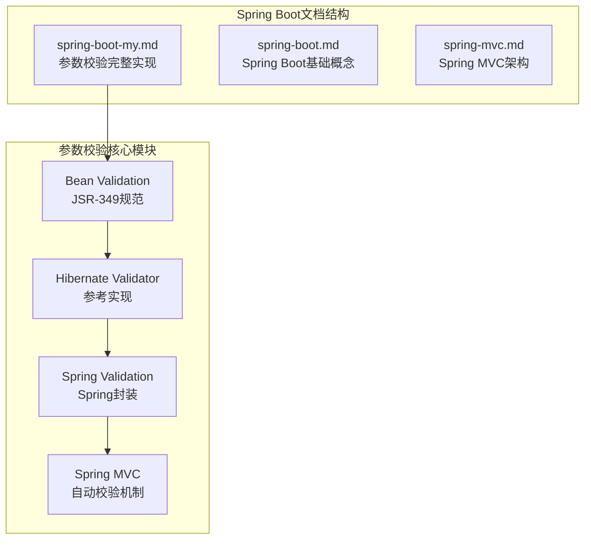
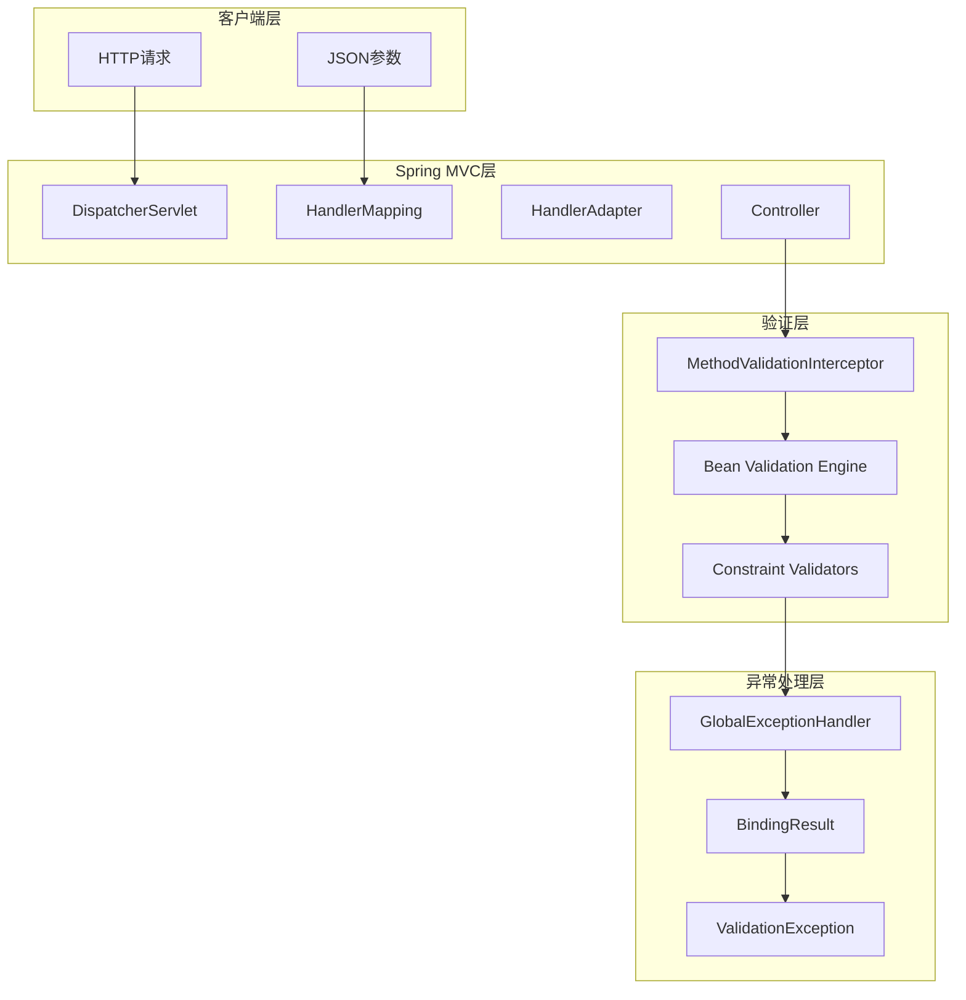
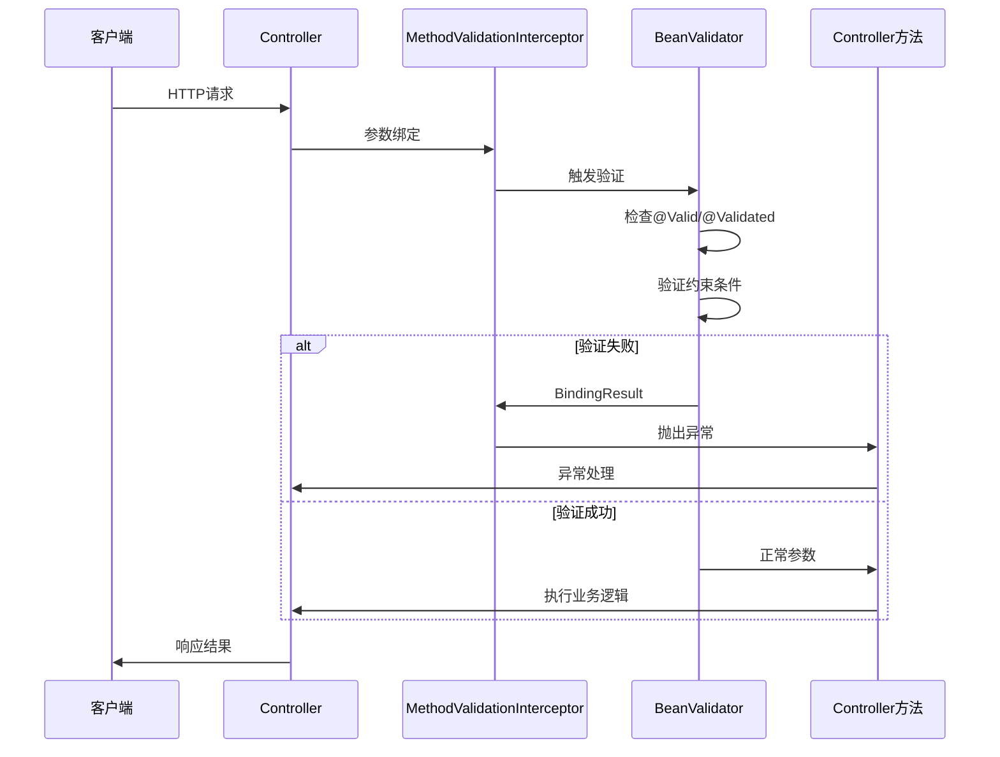
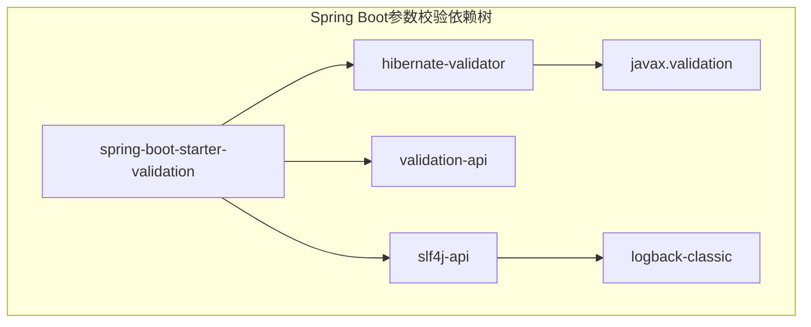
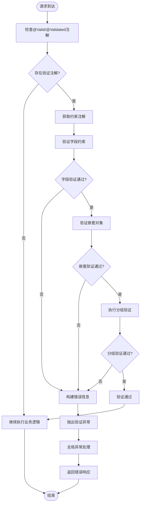

# 参数校验

<cite>
**本文档引用的文件**
- [spring-boot-my.md](file://docs/backend-base/spring/spring-boot-my.md)
- [spring-boot.md](file://docs/backend-base/spring/spring-boot.md)
- [spring-mvc.md](file://docs/backend-base/spring/spring-mvc.md)
</cite>

## 目录
1. [简介](#简介)
2. [项目结构](#项目结构)
3. [核心组件](#核心组件)
4. [架构概览](#架构概览)
5. [详细组件分析](#详细组件分析)
6. [依赖分析](#依赖分析)
7. [性能考虑](#性能考虑)
8. [故障排除指南](#故障排除指南)
9. [结论](#结论)

## 简介

Spring Boot参数校验是现代Java Web开发中的重要组成部分，它基于JSR-349规范，通过对Hibernate Validator的封装，为Spring MVC提供了强大的参数自动校验机制。本文档将详细介绍Spring Validation的实现原理、使用方法以及最佳实践。

Spring Validation作为JSR-349规范的实现，提供了以下核心功能：
- **声明式验证**：通过注解方式声明验证规则
- **自动校验**：Spring MVC自动触发参数验证
- **分组验证**：支持按场景分组的条件验证
- **自定义验证器**：支持业务逻辑的自定义验证规则
- **统一异常处理**：提供标准化的错误处理机制

## 项目结构

该项目采用文档驱动的结构，参数校验相关内容主要集中在Spring Boot相关文档中：



**图表来源**
- [spring-boot-my.md:289-583](file://docs/backend-base/spring/spring-boot-my.md#L289-L583)

**章节来源**
- [spring-boot-my.md:289-583](file://docs/backend-base/spring/spring-boot-my.md#L289-L583)

## 核心组件

### Bean Validation (JSR-349) 核心注解

Spring Validation基于JSR-349规范，提供了丰富的内置验证注解：

#### 基础验证注解
- **@NotNull**：验证对象不为null
- **@NotEmpty**：验证集合、数组、字符串不为空
- **@NotBlank**：验证字符串不为空白
- **@AssertTrue/@AssertFalse**：验证布尔值
- **@Null**：验证对象必须为null

#### 数值范围验证注解
- **@Min/@Max**：验证数值范围
- **@DecimalMin/@DecimalMax**：验证小数范围
- **@Positive/@PositiveOrZero**：验证正数
- **@Negative/@NegativeOrZero**：验证负数

#### 字符串验证注解
- **@Email**：验证邮箱格式
- **@Pattern**：验证正则表达式
- **@Size**：验证长度范围
- **@URL**：验证URL格式

#### 时间验证注解
- **@Future/@FutureOrPresent**：验证未来时间
- **@Past/@PastOrPresent**：验证过去时间

**章节来源**
- [spring-boot-my.md:470-495](file://docs/backend-base/spring/spring-boot-my.md#L470-L495)

### Spring Validation扩展注解

Spring Validation在JSR-349基础上提供了更多实用注解：

#### 高级验证注解
- **@CreditCardNumber**：验证信用卡号码
- **@Length**：验证字符串长度
- **@Range**：验证数值范围
- **@SafeHtml**：验证安全HTML内容

#### 数据校验注解
- **@LuhnCheck**：Luhn算法校验
- **@Mod10Check**：模10校验
- **@Mod11Check**：模11校验

**章节来源**
- [spring-boot-my.md:497-519](file://docs/backend-base/spring/spring-boot-my.md#L497-L519)

## 架构概览

Spring Boot参数校验的整体架构体现了分层设计和依赖注入的理念：



**图表来源**
- [spring-boot-my.md:352-385](file://docs/backend-base/spring/spring-boot-my.md#L352-L385)
- [spring-boot-my.md:585-627](file://docs/backend-base/spring/spring-boot-my.md#L585-L627)

### 核心验证流程



**图表来源**
- [spring-boot-my.md:352-385](file://docs/backend-base/spring/spring-boot-my.md#L352-L385)

## 详细组件分析

### 实现步骤详解

#### 1. 添加Maven依赖

Spring Boot参数校验的核心依赖是spring-boot-starter-validation：

```xml
<dependency>
    <groupId>org.springframework.boot</groupId>
    <artifactId>spring-boot-starter-validation</artifactId>
</dependency>
```

这个依赖自动引入了：
- **hibernate-validator**：JSR-349规范的参考实现
- **validation-api**：JSR-349规范接口
- **group-impl**：分组验证支持

#### 2. 创建DTO参数封装

参数校验的最佳实践是将请求参数封装到专门的DTO类中：

```java
@Data
@Builder
@ApiModel(value = "User", subTypes = {AddressParam.class})
public class UserParam implements Serializable {
    private static final long serialVersionUID = 1L;
    
    @NotEmpty(message = "用户ID不能为空")
    private String userId;
    
    @NotEmpty(message = "邮箱不能为空")
    @Email(message = "邮箱格式不正确")
    private String email;
    
    @NotEmpty(message = "身份证号不能为空")
    @Pattern(regexp = "^(\\d{6})(\\d{4})(\\d{2})(\\d{2})(\\d{3})([0-9]|X)$", 
             message = "身份证格式不正确")
    private String cardNo;
    
    @NotEmpty(message = "昵称不能为空")
    @Length(min = 1, max = 10, message = "昵称长度必须在1-10之间")
    private String nickName;
    
    @Max(value = 100, message = "年龄不能超过100岁")
    private int age;
    
    @Valid
    private AddressParam address;
}
```

#### 3. Controller中使用@Valid/@Validated注解

##### 使用@Valid注解

```java
@PostMapping("add")
public ResponseEntity<String> add(@Valid @RequestBody UserParam userParam, 
                                BindingResult bindingResult) {
    if (bindingResult.hasErrors()) {
        List<ObjectError> errors = bindingResult.getAllErrors();
        errors.forEach(p -> {
            FieldError fieldError = (FieldError) p;
            log.error("参数错误: 对象={}, 字段={}, 错误信息={}", 
                     fieldError.getObjectName(), fieldError.getField(), 
                     fieldError.getDefaultMessage());
        });
        return ResponseEntity.badRequest().body("参数验证失败");
    }
    return ResponseEntity.ok("验证通过");
}
```

##### 使用@Validated注解

```java
@PostMapping("add")
public ResponseEntity<UserParam> add(@Validated(AddValidationGroup.class) 
                                  @RequestBody UserParam userParam) {
    return ResponseEntity.ok(userParam);
}

@PostMapping("edit")
public ResponseEntity<UserParam> edit(@Validated(EditValidationGroup.class) 
                                   @RequestBody UserParam userParam) {
    return ResponseEntity.ok(userParam);
}
```

**章节来源**
- [spring-boot-my.md:295-385](file://docs/backend-base/spring/spring-boot-my.md#L295-L385)

### 分组校验机制

分组校验是Spring Validation的重要特性，允许根据不同的业务场景应用不同的验证规则。

#### 分组接口定义

```java
public interface AddValidationGroup {
}

public interface EditValidationGroup {
}
```

这些接口不需要实现，仅作为分组标记使用。

#### 字段级分组应用

```java
@NotEmpty(message = "{user.msg.userId.notEmpty}", groups = {EditValidationGroup.class})
private String userId;
```

#### 控制器级分组应用

```java
@PostMapping("add")
public ResponseEntity<UserParam> add(@Validated(AddValidationGroup.class) 
                                  @RequestBody UserParam userParam) {
    return ResponseEntity.ok(userParam);
}

@PostMapping("edit")
public ResponseEntity<UserParam> edit(@Validated(EditValidationGroup.class) 
                                   @RequestBody UserParam userParam) {
    return ResponseEntity.ok(userParam);
}
```

**章节来源**
- [spring-boot-my.md:387-452](file://docs/backend-base/spring/spring-boot-my.md#L387-L452)

### @Validated vs @Valid 注解对比

| 特性 | @Validated | @Valid |
|------|------------|--------|
| **分组支持** | ✅ 支持 | ❌ 不支持 |
| **适用范围** | 类型、方法、方法参数 | 成员属性、嵌套类型 |
| **验证触发时机** | 方法参数绑定时 | 字段级验证 |
| **使用场景** | 控制器参数验证 | DTO字段验证 |

#### @Validated注解使用场景

```java
@RestController
@RequestMapping("/user")
public class UserController {
    
    @PostMapping("add")
    public ResponseEntity<UserParam> add(@Validated(AddValidationGroup.class) 
                                      @RequestBody UserParam userParam) {
        return ResponseEntity.ok(userParam);
    }
    
    @PostMapping("edit")
    public ResponseEntity<UserParam> edit(@Validated(EditValidationGroup.class) 
                                       @RequestBody UserParam userParam) {
        return ResponseEntity.ok(userParam);
    }
}
```

#### @Valid注解使用场景

```java
@Valid
private AddressParam address;

@NotEmpty(groups = {EditValidationGroup.class})
private String userId;
```

**章节来源**
- [spring-boot-my.md:454-467](file://docs/backend-base/spring/spring-boot-my.md#L454-L467)

### 自定义校验注解

Spring Validation支持创建自定义验证注解，满足复杂的业务需求。

#### 1. 定义校验器

```java
public class TelephoneNumberValidator implements ConstraintValidator<TelephoneNumber, String> {
    private static final String REGEX_TEL = "0\\d{2,3}[-]?\\d{7,8}|0\\d{2,3}\\s?\\d{7,8}|13[0-9]\\d{8}|15[1089]\\d{8}";

    @Override
    public boolean isValid(String s, ConstraintValidatorContext constraintValidatorContext) {
        try {
            return Pattern.matches(REGEX_TEL, s);
        } catch (Exception e) {
            return false;
        }
    }
}
```

#### 2. 定义注解

```java
@Target({METHOD, FIELD, ANNOTATION_TYPE, CONSTRUCTOR, PARAMETER, TYPE_USE})
@Retention(RUNTIME)
@Documented
@Constraint(validatedBy = {TelephoneNumberValidator.class})
public @interface TelephoneNumber {
    String message() default "无效的电话号码";
    Class<?>[] groups() default {};
    Class<? extends Payload>[] payload() default {};
}
```

#### 3. 使用自定义注解

```java
@TelephoneNumber(message = "无效的电话号码")
private String telephone;
```

**章节来源**
- [spring-boot-my.md:521-583](file://docs/backend-base/spring/spring-boot-my.md#L521-L583)

### 统一异常处理

Spring Boot提供了完善的异常处理机制，统一处理各种验证异常：

```java
@RestControllerAdvice
public class GlobalExceptionHandler {
    
    @ExceptionHandler(value = {BindException.class, 
                              ValidationException.class, 
                              MethodArgumentNotValidException.class})
    @ResponseStatus(code = HttpStatus.BAD_REQUEST)
    public ResponseResult<ExceptionData> handleParameterVerificationException(Exception e) {
        ExceptionData.ExceptionDataBuilder exceptionDataBuilder = ExceptionData.builder();
        
        if (e instanceof BindException) {
            BindingResult bindingResult = ((MethodArgumentNotValidException) e).getBindingResult();
            bindingResult.getAllErrors().stream()
                    .map(DefaultMessageSourceResolvable::getDefaultMessage)
                    .forEach(exceptionDataBuilder::error);
        } else if (e instanceof ConstraintViolationException) {
            exceptionDataBuilder.error(e.getMessage());
        } else {
            exceptionDataBuilder.error("参数验证失败");
        }
        
        return ResponseResultEntity.fail(exceptionDataBuilder.build(), "参数验证失败");
    }
}
```

**章节来源**
- [spring-boot-my.md:585-627](file://docs/backend-base/spring/spring-boot-my.md#L585-L627)

## 依赖分析

### 核心依赖关系



**图表来源**
- [spring-boot-my.md:295-303](file://docs/backend-base/spring/spring-boot-my.md#L295-L303)

### 验证流程依赖



**图表来源**
- [spring-boot-my.md:352-385](file://docs/backend-base/spring/spring-boot-my.md#L352-L385)

**章节来源**
- [spring-boot-my.md:295-303](file://docs/backend-base/spring/spring-boot-my.md#L295-L303)

## 性能考虑

### 验证性能优化策略

1. **延迟验证**：仅在必要时触发验证
2. **缓存约束元数据**：避免重复解析注解
3. **批量验证**：减少验证器实例创建
4. **异步验证**：对于耗时验证使用异步处理

### 内存使用优化

- 合理使用分组验证，避免不必要的验证开销
- 避免深度嵌套的对象验证
- 使用合适的验证注解，避免过度验证

## 故障排除指南

### 常见问题及解决方案

#### 1. 验证注解不生效

**问题症状**：添加了@Valid/@Validated注解但验证未触发

**解决方案**：
- 确认已添加spring-boot-starter-validation依赖
- 检查注解使用位置是否正确
- 确认参数绑定使用@RequestBody注解

#### 2. 分组验证不按预期工作

**问题症状**：分组验证规则未按预期应用

**解决方案**：
- 确认分组接口定义正确
- 检查注解中groups属性设置
- 验证控制器中@Validated注解的分组参数

#### 3. 自定义验证注解失效

**问题症状**：自定义验证注解不触发

**解决方案**：
- 确认ConstraintValidator实现正确
- 检查注解定义中的validatedBy属性
- 验证注解使用位置和参数

#### 4. 异常处理不正确

**问题症状**：验证异常未被正确捕获和处理

**解决方案**：
- 确认GlobalExceptionHandler配置正确
- 检查异常类型处理逻辑
- 验证响应格式一致性

**章节来源**
- [spring-boot-my.md:585-627](file://docs/backend-base/spring/spring-boot-my.md#L585-L627)

## 结论

Spring Boot参数校验为Java Web开发提供了强大而灵活的验证机制。通过JSR-349规范和Hibernate Validator的实现，结合Spring MVC的自动校验功能，开发者可以轻松实现声明式参数验证。

### 主要优势

1. **声明式验证**：通过注解声明验证规则，代码简洁清晰
2. **自动触发**：Spring MVC自动处理参数验证，无需手动调用
3. **分组支持**：灵活的分组验证机制适应复杂业务场景
4. **扩展性强**：支持自定义验证注解和验证器
5. **统一处理**：提供标准化的异常处理机制

### 最佳实践

1. **合理使用注解**：根据业务需求选择合适的验证注解
2. **分组验证**：为不同场景定义专用的验证分组
3. **自定义验证**：对于复杂业务逻辑实现自定义验证器
4. **异常处理**：建立统一的异常处理机制
5. **性能优化**：合理设计验证策略，避免性能瓶颈

通过遵循本文档的指导和最佳实践，开发者可以充分利用Spring Boot参数校验的强大功能，构建高质量、可靠的Web应用程序。