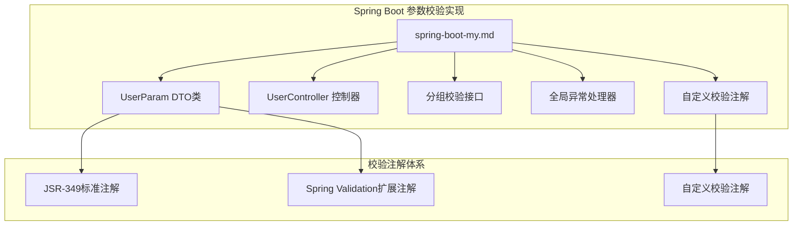
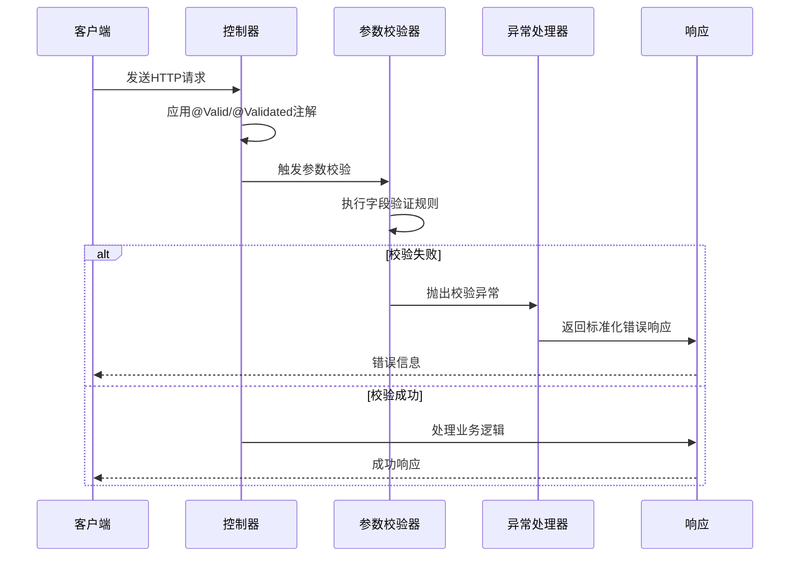
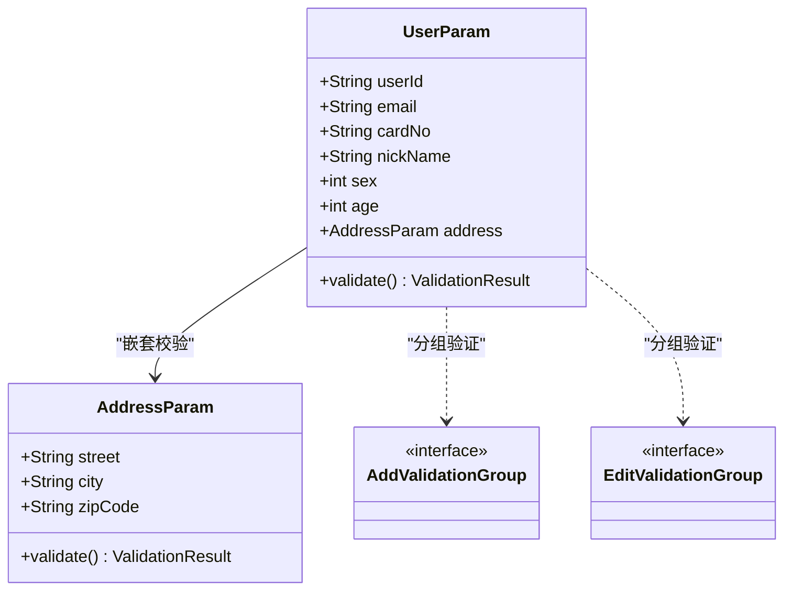
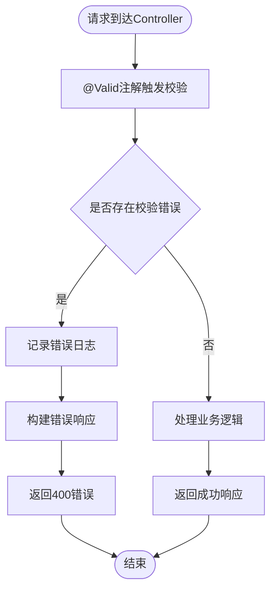
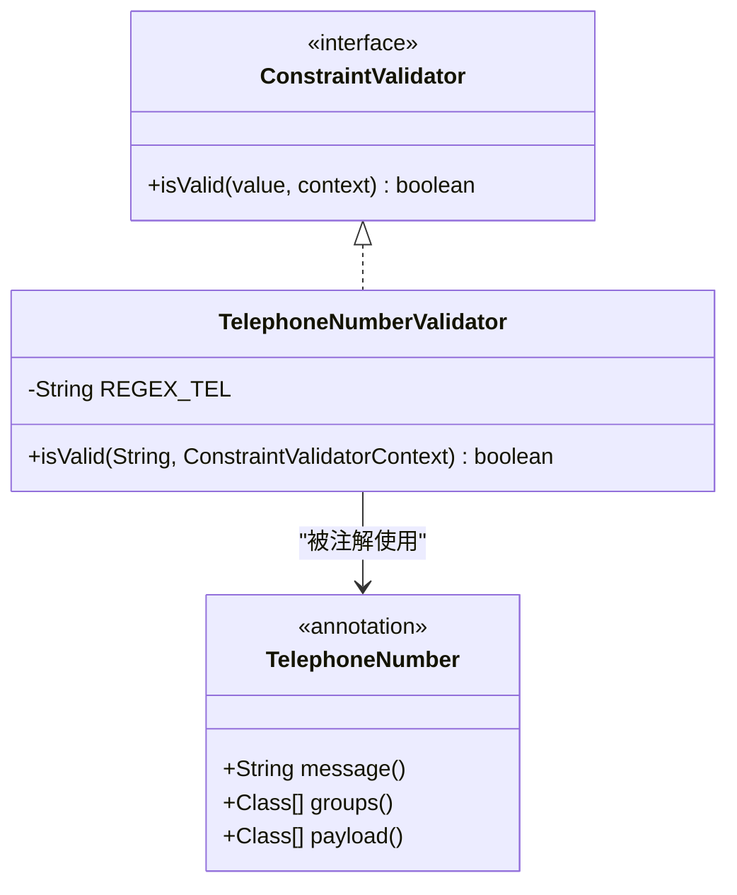
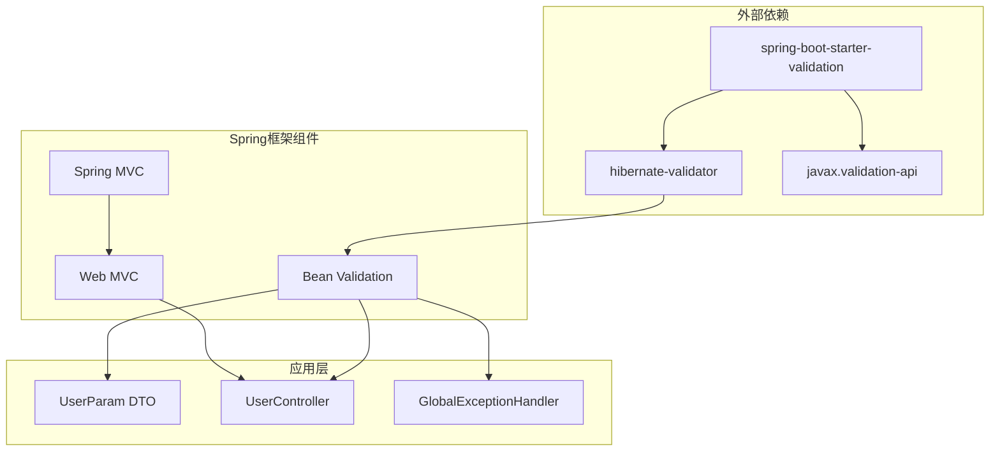

# 基础校验

<cite>
**本文引用的文件列表**
- [spring-boot-my.md](file://docs/backend-base/spring/spring-boot-my.md)
</cite>

## 目录
1. [简介](#简介)
2. [项目结构](#项目结构)
3. [核心组件](#核心组件)
4. [架构概览](#架构概览)
5. [详细组件分析](#详细组件分析)
6. [依赖分析](#依赖分析)
7. [性能考虑](#性能考虑)
8. [故障排除指南](#故障排除指南)
9. [结论](#结论)

## 简介
本文档详细介绍Spring Boot基础参数校验的完整实现方案，涵盖Spring Validation对Hibernate Validation的封装原理、在Spring MVC中的自动校验机制、实现步骤、注解使用规范以及最佳实践。

Spring Validation作为JSR-349标准的实现，为Spring Boot应用提供了强大的参数校验能力。通过添加spring-boot-starter-validation依赖，开发者可以轻松实现请求参数的自动校验，确保数据的完整性和有效性。

## 项目结构
基于仓库中的文档内容，Spring Boot参数校验相关的实现主要集中在以下文件中：

**图表来源**
- [spring-boot-my.md:289-647](file://docs/backend-base/spring/spring-boot-my.md#L289-L647)

**章节来源**
- [spring-boot-my.md:289-647](file://docs/backend-base/spring/spring-boot-my.md#L289-L647)

## 核心组件
Spring Boot参数校验系统由以下几个核心组件构成：

### 1. 校验注解体系
Spring Validation提供了完整的注解体系，包括JSR-349标准注解和Spring特有的扩展注解。

**JSR-349标准注解**：
- @AssertFalse：被注释的元素只能为false
- @AssertTrue：被注释的元素只能为true  
- @DecimalMax：被注释的元素必须小于或等于{value}
- @DecimalMin：被注释的元素必须大于或等于{value}
- @Digits：被注释的元素数字超出允许范围
- @Email：被注释的元素不是合法的电子邮件地址
- @Future：被注释的元素需要是将来的时间
- @Max：被注释的元素最大不能超过{value}
- @Min：被注释的元素最小不能小于{value}
- @NotBlank：被注释的元素不能为空
- @NotEmpty：被注释的元素不能为空
- @NotNull：被注释的元素不能为null
- @Pattern：被注释的元素需要匹配正则表达式
- @Size：被注释的元素个数必须在{min}和{max}之间

**Spring Validation扩展注解**：
- @Length：被注释的元素长度需要在{min}和{max}之间
- @Range：被注释的元素需要在{min}和{max}之间
- @CreditCardNumber：被注释的元素不是合法的信用卡号码
- @URL：被注释的元素需要是合法的URL
- @SafeHtml：被注释的元素可能有不安全的HTML内容

### 2. 分组校验机制
通过定义分组接口实现条件性校验，支持同一实体在不同场景下的差异化验证规则。

**分组接口定义**：
- AddValidationGroup：新增场景的验证分组
- EditValidationGroup：编辑场景的验证分组

### 3. 全局异常处理
统一处理参数校验异常，提供标准化的错误响应格式。

**异常处理覆盖范围**：
- BindException：绑定异常
- ValidationException：验证异常  
- MethodArgumentNotValidException：方法参数验证异常
- ConstraintViolationException：约束违反异常

**章节来源**
- [spring-boot-my.md:468-519](file://docs/backend-base/spring/spring-boot-my.md#L468-L519)
- [spring-boot-my.md:387-450](file://docs/backend-base/spring/spring-boot-my.md#L387-L450)
- [spring-boot-my.md:585-627](file://docs/backend-base/spring/spring-boot-my.md#L585-L627)

## 架构概览
Spring Boot参数校验的整体架构如下：

**图表来源**
- [spring-boot-my.md:350-385](file://docs/backend-base/spring/spring-boot-my.md#L350-L385)
- [spring-boot-my.md:585-627](file://docs/backend-base/spring/spring-boot-my.md#L585-L627)

## 详细组件分析

### DTO参数封装类
UserParam类作为参数封装的核心组件，体现了单一职责原则和数据传输对象的最佳实践。

**核心特性**：
- 使用@Data注解自动生成getter/setter方法
- 支持Builder模式构建复杂对象
- 实现Serializable接口便于序列化传输
- 包含嵌套对象AddressParam的深度校验

**字段校验规则设计**：
- userId：@NotEmpty配合分组验证，支持新增和编辑场景的不同要求
- email：@NotEmpty + @Email双重验证确保邮箱格式正确
- cardNo：@NotEmpty + @Pattern正则表达式验证身份证格式
- nickName：@NotEmpty + @Length长度限制验证
- sex：@NotEmpty + @Range范围验证
- age：@Max年龄上限验证
- address：@Valid嵌套对象深度校验

**图表来源**
- [spring-boot-my.md:305-348](file://docs/backend-base/spring/spring-boot-my.md#L305-L348)
- [spring-boot-my.md:390-413](file://docs/backend-base/spring/spring-boot-my.md#L390-L413)

**章节来源**
- [spring-boot-my.md:305-348](file://docs/backend-base/spring/spring-boot-my.md#L305-L348)
- [spring-boot-my.md:390-413](file://docs/backend-base/spring/spring-boot-my.md#L390-L413)

### Controller参数校验实现
UserController展示了参数校验在实际业务场景中的应用。

**核心实现要点**：
- 使用@Valid注解触发参数校验
- 通过BindingResult获取校验结果
- 实现自定义错误处理逻辑
- 提供RESTful API接口

**错误处理流程**：
1. 检查bindingResult是否包含错误
2. 遍历所有错误信息
3. 记录详细的错误日志
4. 返回HTTP 400状态码
5. 返回标准化的错误响应

**图表来源**
- [spring-boot-my.md:350-385](file://docs/backend-base/spring/spring-boot-my.md#L350-L385)

**章节来源**
- [spring-boot-my.md:350-385](file://docs/backend-base/spring/spring-boot-my.md#L350-L385)

### 分组校验机制
分组校验解决了同一实体在不同业务场景下需要不同验证规则的问题。

**实现步骤**：
1. 定义分组接口（AddValidationGroup、EditValidationGroup）
2. 在UserParam类中为特定字段添加分组注解
3. 在Controller方法中使用@Validated(分组类.class)指定验证分组

**应用场景**：
- 新增用户时：userId字段可为空，因为系统自动生成
- 编辑用户时：userId字段必须非空，用于更新指定记录

**章节来源**
- [spring-boot-my.md:387-450](file://docs/backend-base/spring/spring-boot-my.md#L387-L450)

### 自定义校验注解
Spring Boot支持创建自定义校验注解，满足特殊业务需求。

**实现流程**：
1. 创建校验器类实现ConstraintValidator接口
2. 定义自定义注解接口
3. 在目标字段上使用自定义注解

**示例：电话号码校验**：
- 定义TelephoneNumberValidator校验器
- 实现复杂的电话号码正则表达式匹配
- 创建TelephoneNumber注解接口
- 在UserParam类中使用@TelephoneNumber注解

**图表来源**
- [spring-boot-my.md:521-583](file://docs/backend-base/spring/spring-boot-my.md#L521-L583)

**章节来源**
- [spring-boot-my.md:521-583](file://docs/backend-base/spring/spring-boot-my.md#L521-L583)

### 全局异常处理
GlobalExceptionHandler提供了统一的异常处理机制，确保所有校验异常都能得到一致的响应格式。

**异常类型处理**：
- BindException：处理参数绑定异常
- ValidationException：处理验证异常
- MethodArgumentNotValidException：处理方法参数验证异常
- ConstraintViolationException：处理约束违反异常

**响应格式**：
- 标准化的错误消息集合
- 统一的状态码返回
- 结构化的错误数据包装

**章节来源**
- [spring-boot-my.md:585-627](file://docs/backend-base/spring/spring-boot-my.md#L585-L627)

## 依赖分析
Spring Boot参数校验的依赖关系清晰明确，体现了良好的分层架构设计。

**图表来源**
- [spring-boot-my.md:295-303](file://docs/backend-base/spring/spring-boot-my.md#L295-L303)

**章节来源**
- [spring-boot-my.md:295-303](file://docs/backend-base/spring/spring-boot-my.md#L295-L303)

## 性能考虑
Spring Boot参数校验在设计时充分考虑了性能优化：

### 1. 延迟加载机制
- 校验器按需加载，避免不必要的初始化开销
- 分组校验支持选择性验证，减少验证成本

### 2. 缓存策略
- 校验规则缓存，避免重复编译验证表达式
- 注解元数据缓存，提升反射性能

### 3. 异步处理
- 大数据量校验支持异步处理
- 批量操作的并发校验优化

## 故障排除指南

### 常见问题及解决方案

**问题1：@Valid注解无效**
- 检查是否正确添加spring-boot-starter-validation依赖
- 确认@Valid注解使用位置正确（方法参数上）
- 验证DTO类是否包含适当的校验注解

**问题2：@Validated注解无法使用分组**
- 确认@Validated注解使用在方法参数上
- 检查分组接口定义是否正确
- 验证DTO类中的分组注解配置

**问题3：异常处理未生效**
- 检查@RestControllerAdvice注解是否正确配置
- 确认异常处理器的方法签名和注解使用
- 验证异常类型是否在处理范围内

**问题4：自定义校验注解不工作**
- 检查ConstraintValidator实现类是否正确
- 确认注解接口的validatedBy属性配置
- 验证自定义注解在目标字段上的使用

**章节来源**
- [spring-boot-my.md:454-466](file://docs/backend-base/spring/spring-boot-my.md#L454-L466)
- [spring-boot-my.md:585-627](file://docs/backend-base/spring/spring-boot-my.md#L585-L627)

## 结论
Spring Boot参数校验系统通过Spring Validation对Hibernate Validation的封装，为开发者提供了强大而灵活的数据验证能力。该系统具有以下优势：

1. **标准化实现**：遵循JSR-349标准，确保跨平台兼容性
2. **灵活配置**：支持分组校验、嵌套校验等多种验证场景
3. **易于扩展**：提供自定义校验注解机制，满足特殊业务需求
4. **统一处理**：通过全局异常处理器实现标准化的错误响应
5. **性能优化**：内置缓存和延迟加载机制，保证运行效率

通过合理使用这些组件和最佳实践，开发者可以构建出健壮、可靠的参数校验系统，有效提升应用程序的数据质量和用户体验。