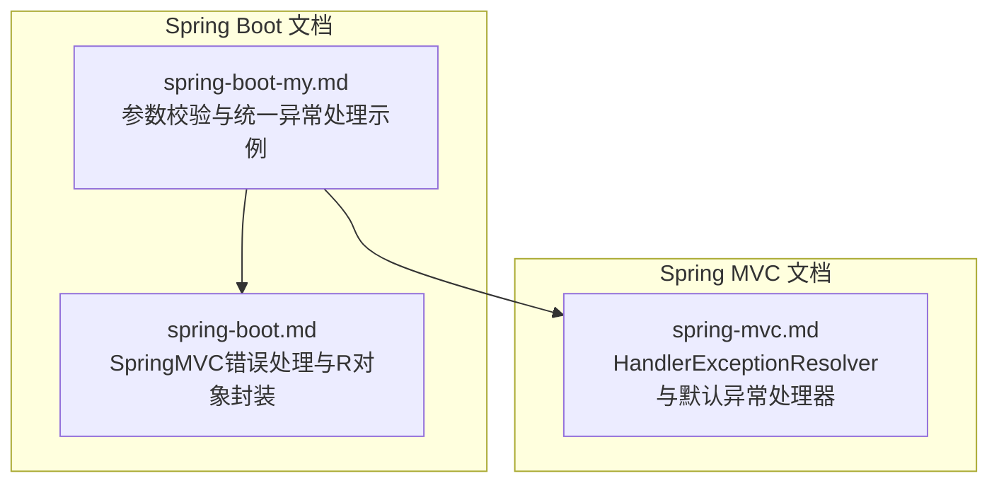
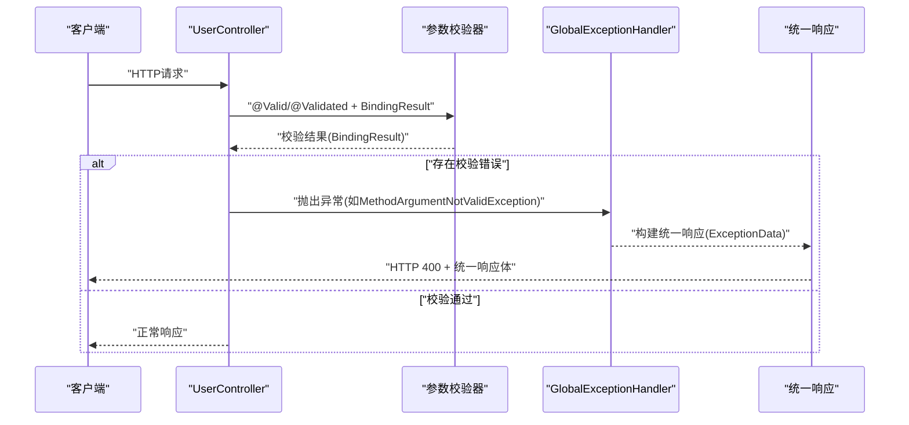
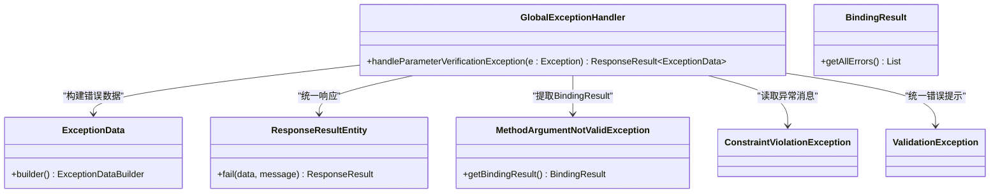
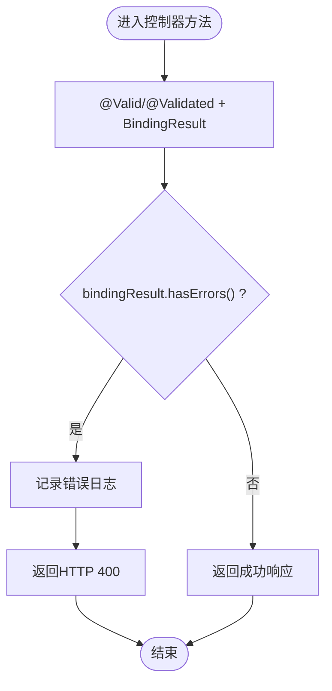
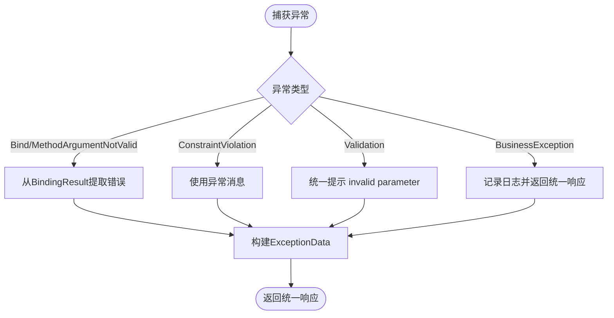
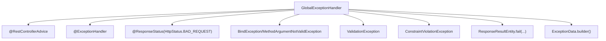

# 统一异常处理

<cite>
**本文引用的文件列表**
- [spring-boot-my.md](file://docs/backend-base/spring/spring-boot-my.md)
- [spring-boot.md](file://docs/backend-base/spring/spring-boot.md)
- [spring-mvc.md](file://docs/backend-base/spring/spring-mvc.md)
</cite>

## 目录
1. [简介](#简介)
2. [项目结构](#项目结构)
3. [核心组件](#核心组件)
4. [架构总览](#架构总览)
5. [详细组件分析](#详细组件分析)
6. [依赖关系分析](#依赖关系分析)
7. [性能考量](#性能考量)
8. [故障排查指南](#故障排查指南)
9. [结论](#结论)
10. [附录](#附录)

## 简介
本技术文档围绕Spring Boot参数校验异常的统一处理展开，系统讲解如何使用@ControllerAdvice实现全局异常处理，重点覆盖参数校验失败的统一响应机制。文档将深入解析GlobalExceptionHandler类的实现细节，包括对BindException、ValidationException、MethodArgumentNotValidException、ConstraintViolationException等异常类型的处理策略；说明如何从BindingResult中提取详细错误信息并构建统一响应格式；对比不同异常类型（参数绑定异常、Bean验证异常、方法参数验证异常）的处理差异；并提供自定义业务异常（BusinessException）的统一处理示例与最佳实践，最后给出性能优化与安全注意事项。

## 项目结构
本仓库为知识型文档集合，统一异常处理相关内容主要分布在Spring Boot与Spring MVC相关章节中。关键实现与示例集中在以下文件：
- docs/backend-base/spring/spring-boot-my.md：包含参数校验与统一异常处理的完整示例
- docs/backend-base/spring/spring-boot.md：包含SpringMVC错误处理与R对象封装示例
- docs/backend-base/spring/spring-mvc.md：包含HandlerExceptionResolver与默认异常处理器说明

**图表来源**
- [spring-boot-my.md:585-647](file://docs/backend-base/spring/spring-boot-my.md#L585-L647)
- [spring-boot.md:5875-5956](file://docs/backend-base/spring/spring-boot.md#L5875-L5956)
- [spring-mvc.md:5076-5103](file://docs/backend-base/spring/spring-mvc.md#L5076-L5103)

**章节来源**
- [spring-boot-my.md:585-647](file://docs/backend-base/spring/spring-boot-my.md#L585-L647)
- [spring-boot.md:5875-5956](file://docs/backend-base/spring/spring-boot.md#L5875-L5956)
- [spring-mvc.md:5076-5103](file://docs/backend-base/spring/spring-mvc.md#L5076-L5103)

## 核心组件
- 全局异常处理器：GlobalExceptionHandler，使用@RestControllerAdvice注解，集中处理参数校验异常与自定义业务异常
- 参数校验异常处理：统一拦截BindException、ValidationException、MethodArgumentNotValidException、ConstraintViolationException
- 统一响应构建：通过ResponseResultEntity.fail与ExceptionData构建统一响应体
- 控制器层参数校验：UserController结合@Valid/@Validated与BindingResult进行参数校验

**章节来源**
- [spring-boot-my.md:585-647](file://docs/backend-base/spring/spring-boot-my.md#L585-L647)
- [spring-boot-my.md:352-385](file://docs/backend-base/spring/spring-boot-my.md#L352-L385)

## 架构总览
统一异常处理在Spring MVC/Spring Boot中通过@ControllerAdvice与@ExceptionHandler实现全局拦截，结合BindingResult与Bean Validation异常类型，形成从控制器到全局异常处理的完整链路。

**图表来源**
- [spring-boot-my.md:352-385](file://docs/backend-base/spring/spring-boot-my.md#L352-L385)
- [spring-boot-my.md:585-647](file://docs/backend-base/spring/spring-boot-my.md#L585-L647)

## 详细组件分析

### GlobalExceptionHandler 类实现
- 注解与职责
  - 使用@RestControllerAdvice标识为全局异常处理类
  - 使用@ExceptionHandler统一拦截多种参数校验异常类型
  - 使用@ResponseStatus(code = HttpStatus.BAD_REQUEST)设置状态码
- 异常类型处理策略
  - BindException：从MethodArgumentNotValidException中获取BindingResult，遍历getAllErrors并提取默认消息
  - ValidationException：通用校验异常，统一记录并返回“invalid parameter”
  - ConstraintViolationException：Bean验证异常，若异常消息非空则直接加入错误列表
  - 其他情况：统一返回“invalid parameter”
- 统一响应构建
  - 使用ExceptionData.builder()构建错误数据
  - 通过ResponseResultEntity.fail(exceptionData, “invalid parameter”)输出统一响应

**图表来源**
- [spring-boot-my.md:585-647](file://docs/backend-base/spring/spring-boot-my.md#L585-L647)

**章节来源**
- [spring-boot-my.md:585-647](file://docs/backend-base/spring/spring-boot-my.md#L585-L647)

### 参数校验与BindingResult使用
- 控制器层使用@Valid/@Validated与BindingResult接收校验结果
- 当bindingResult.hasErrors()为真时，遍历错误并记录日志，返回HTTP 400
- 该模式与GlobalExceptionHandler配合，确保参数校验失败时统一处理

**图表来源**
- [spring-boot-my.md:352-385](file://docs/backend-base/spring/spring-boot-my.md#L352-L385)

**章节来源**
- [spring-boot-my.md:352-385](file://docs/backend-base/spring/spring-boot-my.md#L352-L385)

### 不同异常类型的处理差异
- BindException/MethodArgumentNotValidException
  - 通过BindingResult.getAllErrors()提取字段级错误消息
  - 适用于@Valid/@Validated参数校验失败场景
- ValidationException
  - 通用校验异常，统一提示“invalid parameter”
- ConstraintViolationException
  - Bean验证（如REST接口参数校验）异常，优先使用异常消息
- BusinessException（自定义）
  - 通过@ExceptionHandler(BusinessException.class)统一处理
  - 记录日志并返回统一响应，避免泄露内部堆栈

**图表来源**
- [spring-boot-my.md:585-647](file://docs/backend-base/spring/spring-boot-my.md#L585-L647)

**章节来源**
- [spring-boot-my.md:585-647](file://docs/backend-base/spring/spring-boot-my.md#L585-L647)

### 自定义业务异常处理最佳实践
- 使用@ExceptionHandler(BusinessException.class)拦截业务异常
- 记录本地化消息与异常信息，避免向客户端暴露内部堆栈
- 返回统一响应格式，便于前端一致处理

**章节来源**
- [spring-boot-my.md:629-647](file://docs/backend-base/spring/spring-boot-my.md#L629-L647)

## 依赖关系分析
- GlobalExceptionHandler依赖于：
  - Spring MVC注解：@RestControllerAdvice、@ExceptionHandler、@ResponseStatus
  - Bean Validation异常类型：BindException、ValidationException、MethodArgumentNotValidException、ConstraintViolationException
  - 统一响应工具：ResponseResultEntity.fail
  - 错误数据模型：ExceptionData.builder()

**图表来源**
- [spring-boot-my.md:585-647](file://docs/backend-base/spring/spring-boot-my.md#L585-L647)

**章节来源**
- [spring-boot-my.md:585-647](file://docs/backend-base/spring/spring-boot-my.md#L585-L647)

## 性能考量
- 异常处理链路尽量轻量化：避免在异常处理器中执行复杂计算或IO操作
- 统一响应构建应避免重复序列化开销，优先复用已有工具类
- 对于高频参数校验失败，建议在控制器层尽早校验并短路，减少异常传播成本
- 日志记录遵循级别区分，避免在异常处理器中产生过多I/O

## 故障排查指南
- 参数校验未触发异常处理器
  - 检查是否正确使用@Valid/@Validated与BindingResult
  - 确认控制器方法签名与参数校验注解一致
- 统一响应未按预期返回
  - 核对GlobalExceptionHandler的异常类型匹配与@ExceptionHandler声明
  - 确认ResponseResultEntity.fail的调用参数与ExceptionData构建逻辑
- 自定义业务异常未被捕获
  - 确认@ExceptionHandler(BusinessException.class)所在类被Spring扫描
  - 检查异常抛出点是否为BusinessException实例

**章节来源**
- [spring-boot-my.md:585-647](file://docs/backend-base/spring/spring-boot-my.md#L585-L647)
- [spring-boot.md:5875-5956](file://docs/backend-base/spring/spring-boot.md#L5875-L5956)

## 结论
通过@RestControllerAdvice与@ExceptionHandler实现的全局异常处理，能够有效统一参数校验失败与自定义业务异常的响应格式，提升系统的可观测性与一致性。结合BindingResult与Bean Validation异常类型，可实现从字段级错误到通用错误的全量覆盖。建议在实际项目中遵循统一响应规范、合理分级日志与异常处理链路，持续优化性能与安全性。

## 附录
- 相关Spring MVC默认异常处理器说明可参考spring-mvc.md中的HandlerExceptionResolver与默认实现介绍
- R对象封装与错误码枚举可参考spring-boot.md中的R与CodeEnum示例

**章节来源**
- [spring-mvc.md:5076-5103](file://docs/backend-base/spring/spring-mvc.md#L5076-L5103)
- [spring-boot.md:6284-6425](file://docs/backend-base/spring/spring-boot.md#L6284-L6425)