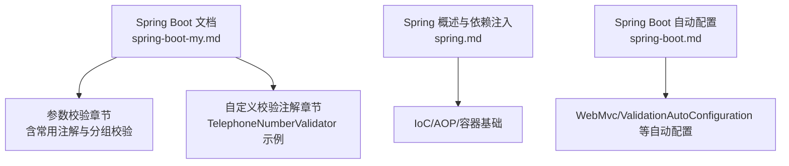
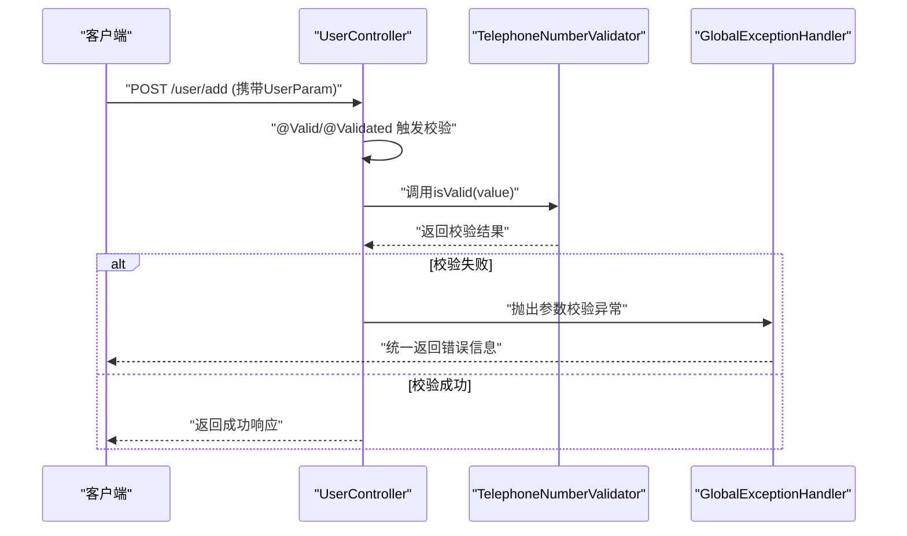
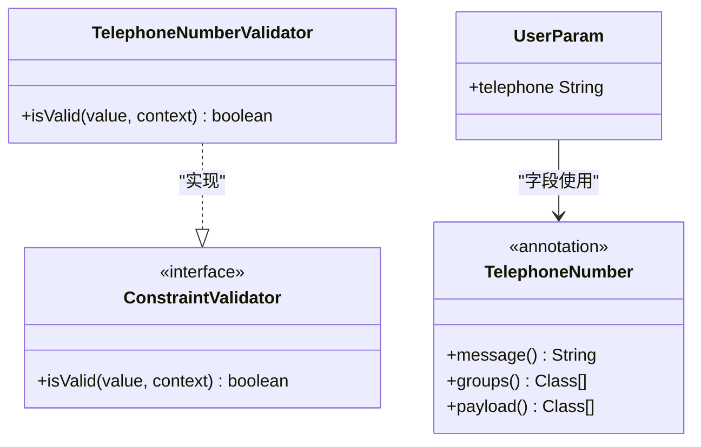
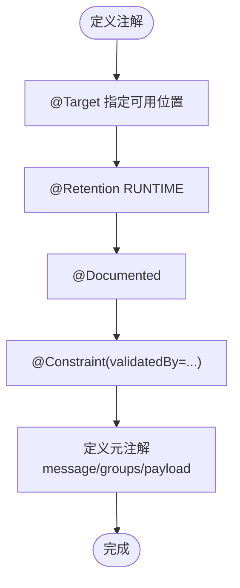
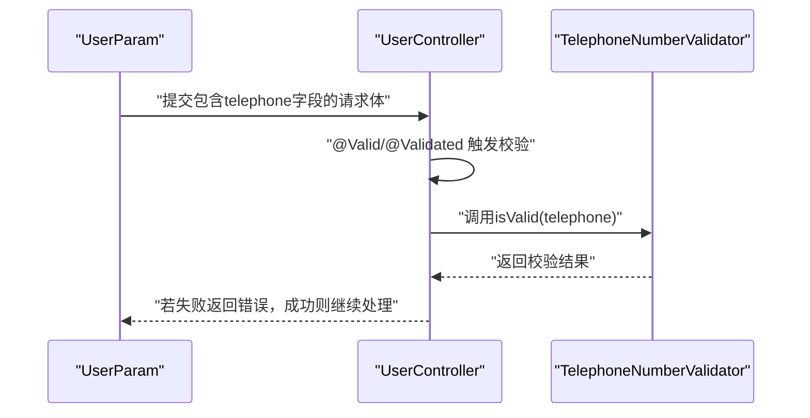
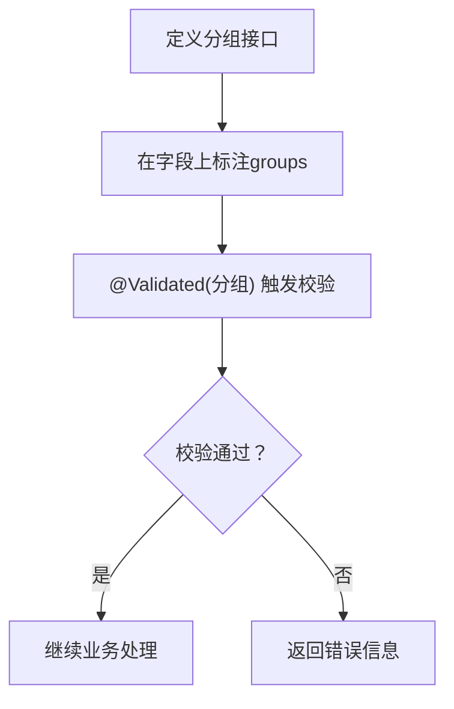
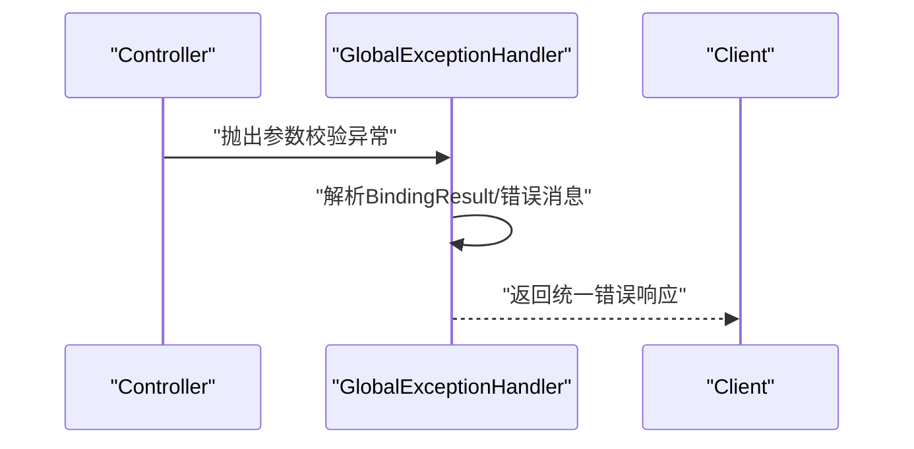
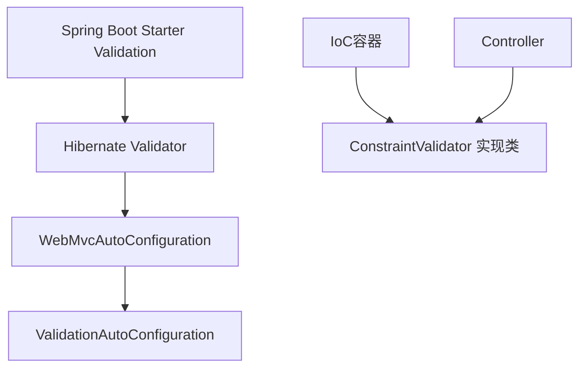

# 自定义校验

<cite>
**本文引用的文件**
- [spring-boot-my.md](file://docs/backend-base/spring/spring-boot-my.md)
- [spring.md](file://docs/backend-base/spring/spring.md)
- [spring-boot.md](file://docs/backend-base/spring/spring-boot.md)
</cite>

## 目录
1. [引言](#引言)
2. [项目结构](#项目结构)
3. [核心组件](#核心组件)
4. [架构概览](#架构概览)
5. [详细组件分析](#详细组件分析)
6. [依赖分析](#依赖分析)
7. [性能考虑](#性能考虑)
8. [故障排查指南](#故障排查指南)
9. [结论](#结论)
10. [附录](#附录)

## 引言
本技术文档围绕Spring Boot自定义参数校验注解展开，目标是帮助读者系统掌握从零实现自定义校验注解的完整流程，包括校验器实现类的编写、注解定义、在DTO字段上的使用，以及异常处理与最佳实践。本文以TelephoneNumberValidator为例，详细说明校验逻辑、正则表达式使用与异常处理策略，并总结自定义校验注解的标准结构与常见扩展场景（如身份证号码、密码强度等）。

## 项目结构
本仓库中与“自定义校验”主题直接相关的知识主要集中在后端基础文档中，尤其是Spring Boot与Spring Validation相关内容。下图给出与校验相关的文档组织关系概览。

图表来源
- [spring-boot-my.md:289-583](file://docs/backend-base/spring/spring-boot-my.md#L289-L583)
- [spring.md:1-200](file://docs/backend-base/spring/spring.md#L1-L200)
- [spring-boot.md:4030-4050](file://docs/backend-base/spring/spring-boot.md#L4030-L4050)

章节来源
- [spring-boot-my.md:289-583](file://docs/backend-base/spring/spring-boot-my.md#L289-L583)
- [spring.md:1-200](file://docs/backend-base/spring/spring.md#L1-L200)
- [spring-boot.md:4030-4050](file://docs/backend-base/spring/spring-boot.md#L4030-L4050)

## 核心组件
- 自定义校验注解：用于在DTO字段上声明业务规则，例如手机号码格式校验。
- 校验器实现类：实现ConstraintValidator接口，承载具体的校验逻辑与正则表达式。
- DTO与Controller：在DTO字段上使用自定义注解，并在Controller中通过@Valid/@Validated触发校验。
- 异常处理：统一捕获校验异常，返回标准化错误信息。

章节来源
- [spring-boot-my.md:521-583](file://docs/backend-base/spring/spring-boot-my.md#L521-L583)

## 架构概览
下图展示从请求进入Controller到触发自定义校验注解的整体流程，包括注解、校验器、异常处理的关键节点。

图表来源
- [spring-boot-my.md:350-384](file://docs/backend-base/spring/spring-boot-my.md#L350-L384)
- [spring-boot-my.md:521-583](file://docs/backend-base/spring/spring-boot-my.md#L521-L583)
- [spring-boot-my.md:585-627](file://docs/backend-base/spring/spring-boot-my.md#L585-L627)

章节来源
- [spring-boot-my.md:350-384](file://docs/backend-base/spring/spring-boot-my.md#L350-L384)
- [spring-boot-my.md:521-583](file://docs/backend-base/spring/spring-boot-my.md#L521-L583)
- [spring-boot-my.md:585-627](file://docs/backend-base/spring/spring-boot-my.md#L585-L627)

## 详细组件分析

### 组件A：TelephoneNumberValidator（校验器）
TelephoneNumberValidator实现了ConstraintValidator接口，负责对字符串类型的手机号字段进行校验。其核心逻辑包括：
- 定义正则表达式，覆盖中国大陆手机号与部分固话格式。
- 在isValid方法中使用Pattern.matches进行匹配，并对异常进行兜底返回false，避免异常传播影响整体流程。
- 通过注解的message/groups/payload元注解提供可配置的错误信息、分组与负载。

图表来源
- [spring-boot-my.md:525-538](file://docs/backend-base/spring/spring-boot-my.md#L525-L538)
- [spring-boot-my.md:558-563](file://docs/backend-base/spring/spring-boot-my.md#L558-L563)
- [spring-boot-my.md:579-580](file://docs/backend-base/spring/spring-boot-my.md#L579-L580)

章节来源
- [spring-boot-my.md:525-538](file://docs/backend-base/spring/spring-boot-my.md#L525-L538)
- [spring-boot-my.md:558-563](file://docs/backend-base/spring/spring-boot-my.md#L558-L563)
- [spring-boot-my.md:579-580](file://docs/backend-base/spring/spring-boot-my.md#L579-L580)

### 组件B：自定义注解定义（TelephoneNumber）
自定义注解TelephoneNumber通过元注解声明：
- @Target：指定注解可使用的元素类型（方法、字段、构造器、参数、类型使用等）。
- @Retention：声明注解在运行时可见。
- @Documented：标记注解可被文档工具提取。
- @Constraint(validatedBy = {...})：绑定具体的校验器实现类。
- 元注解message、groups、payload：分别用于错误消息、分组与负载。

图表来源
- [spring-boot-my.md:544-564](file://docs/backend-base/spring/spring-boot-my.md#L544-L564)

章节来源
- [spring-boot-my.md:544-564](file://docs/backend-base/spring/spring-boot-my.md#L544-L564)

### 组件C：在DTO字段上使用自定义注解
在DTO类的字段上使用自定义注解，即可在Controller接收参数时触发校验。示例中UserParam的telephone字段使用了TelephoneNumber注解，并配合@Valid/@Validated在Controller中触发校验。

图表来源
- [spring-boot-my.md:568-583](file://docs/backend-base/spring/spring-boot-my.md#L568-L583)
- [spring-boot-my.md:350-384](file://docs/backend-base/spring/spring-boot-my.md#L350-L384)

章节来源
- [spring-boot-my.md:568-583](file://docs/backend-base/spring/spring-boot-my.md#L568-L583)
- [spring-boot-my.md:350-384](file://docs/backend-base/spring/spring-boot-my.md#L350-L384)

### 组件D：分组校验与常用注解
- 分组校验：通过定义AddValidationGroup/EditValidationGroup等接口，结合@NotEmpty等注解的groups属性，实现同一DTO在不同场景下的差异化校验。
- 常用注解：文档列举了JSR-349与Spring Validation中的常用注解，如@Email、@Pattern、@Length、@Range、@URL等，便于扩展更多业务规则。

图表来源
- [spring-boot-my.md:387-450](file://docs/backend-base/spring/spring-boot-my.md#L387-L450)
- [spring-boot-my.md:468-519](file://docs/backend-base/spring/spring-boot-my.md#L468-L519)

章节来源
- [spring-boot-my.md:387-450](file://docs/backend-base/spring/spring-boot-my.md#L387-L450)
- [spring-boot-my.md:468-519](file://docs/backend-base/spring/spring-boot-my.md#L468-L519)

### 组件E：统一异常处理
通过@RestControllerAdvice与@ExceptionHandler，统一捕获BindException、ValidationException、MethodArgumentNotValidException等参数校验异常，将错误信息标准化输出。

图表来源
- [spring-boot-my.md:585-627](file://docs/backend-base/spring/spring-boot-my.md#L585-L627)

章节来源
- [spring-boot-my.md:585-627](file://docs/backend-base/spring/spring-boot-my.md#L585-L627)

## 依赖分析
- Spring Validation与Hibernate Validator：Spring Boot通过starter-validation引入JSR-303/JSR-349标准的参数校验能力。
- WebMvc与ValidationAutoConfiguration：WebMvc自动配置在ValidationAutoConfiguration之后加载，确保校验器在Web环境中可用。
- IoC容器与依赖注入：Spring容器负责管理校验器与注解的生命周期，结合@Valid/@Validated实现参数自动校验。

图表来源
- [spring-boot-my.md:295-303](file://docs/backend-base/spring/spring-boot-my.md#L295-L303)
- [spring-boot.md:4034-4035](file://docs/backend-base/spring/spring-boot.md#L4034-L4035)

章节来源
- [spring-boot-my.md:295-303](file://docs/backend-base/spring/spring-boot-my.md#L295-L303)
- [spring-boot.md:4034-4035](file://docs/backend-base/spring/spring-boot.md#L4034-L4035)

## 性能考虑
- 正则表达式优化：尽量使用高效且稳定的正则表达式，避免回溯与过度量词，必要时预编译Pattern并缓存。
- 异常处理成本：统一异常处理会增加一次异常捕获与序列化过程，建议在生产环境合理裁剪错误细节，避免敏感信息泄露。
- 校验链路：在DTO较多字段时，优先使用分组校验减少不必要的校验开销；对高频字段可考虑在服务层补充前置校验。
- 缓存与复用：对频繁使用的校验器实例与正则表达式结果进行缓存，降低重复计算成本。

## 故障排查指南
- 校验未生效
  - 确认已在Controller方法参数上使用@Valid或@Validated。
  - 确认DTO字段上已标注自定义注解。
  - 检查是否遗漏spring-boot-starter-validation依赖。
- 错误信息不友好
  - 在注解中配置message属性，或通过国际化消息源提供本地化错误信息。
  - 在GlobalExceptionHandler中统一收集BindingResult的错误信息。
- 正则表达式异常
  - 在isValid方法中对异常进行捕获并返回false，避免异常向上抛出。
  - 对边界输入进行单元测试覆盖，确保正则表达式健壮性。

章节来源
- [spring-boot-my.md:585-627](file://docs/backend-base/spring/spring-boot-my.md#L585-L627)
- [spring-boot-my.md:525-538](file://docs/backend-base/spring/spring-boot-my.md#L525-L538)

## 结论
通过本文的系统梳理，读者可以掌握在Spring Boot中实现自定义参数校验注解的完整流程：定义校验器、声明注解、在DTO字段上使用、结合分组与统一异常处理。TelephoneNumberValidator示例展示了正则表达式与异常兜底的实现要点。在此基础上，可扩展更多业务场景的自定义校验注解，如身份证号码、密码强度等，并结合性能优化与最佳实践提升系统的稳定性与可维护性。

## 附录
- 常用注解参考：Email、Pattern、Length、Range、URL等，便于快速扩展业务规则。
- 分组校验：通过接口分组实现同一DTO在不同场景下的差异化校验。
- Spring与Spring Boot基础：IoC、AOP、自动配置等概念有助于理解校验器在容器中的装配与执行。

章节来源
- [spring-boot-my.md:468-519](file://docs/backend-base/spring/spring-boot-my.md#L468-L519)
- [spring.md:1-200](file://docs/backend-base/spring/spring.md#L1-L200)
- [spring-boot.md:4034-4035](file://docs/backend-base/spring/spring-boot.md#L4034-L4035)