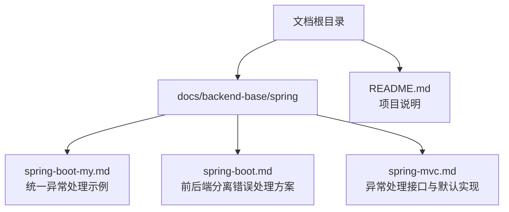
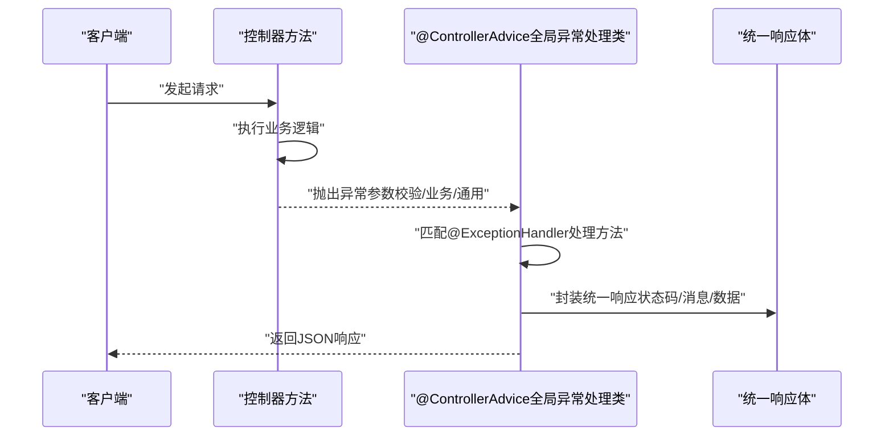
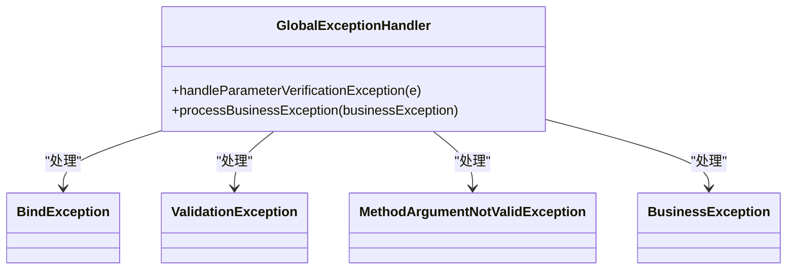
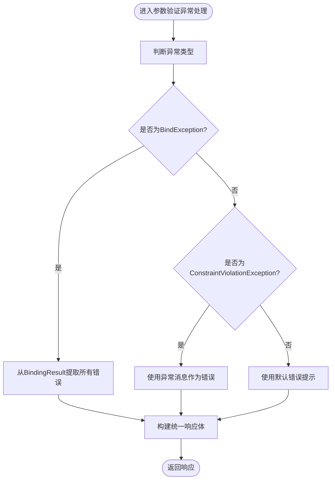
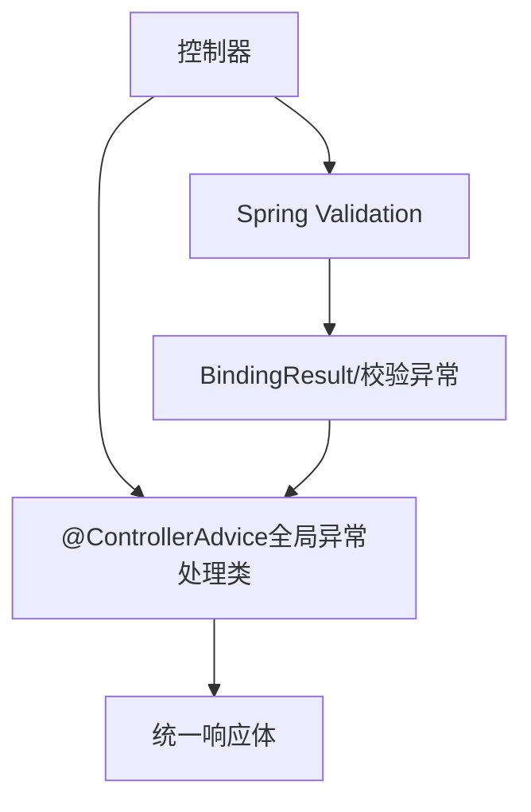

# 异常处理

<cite>
**本文引用的文件**
- [spring-boot-my.md](file://docs/backend-base/spring/spring-boot-my.md)
- [spring-boot.md](file://docs/backend-base/spring/spring-boot.md)
- [spring-mvc.md](file://docs/backend-base/spring/spring-mvc.md)
- [README.md](file://README.md)
</cite>

## 目录
1. [简介](#简介)
2. [项目结构](#项目结构)
3. [核心组件](#核心组件)
4. [架构总览](#架构总览)
5. [详细组件分析](#详细组件分析)
6. [依赖分析](#依赖分析)
7. [性能考虑](#性能考虑)
8. [故障排查指南](#故障排查指南)
9. [结论](#结论)
10. [附录](#附录)

## 简介
本技术文档围绕Spring Boot在前后端分离场景下的统一异常处理展开，系统讲解@ControllerAdvice注解的作用与全局异常处理类的实现方法，覆盖参数验证异常、业务异常、通用异常的处理策略；解释@ExceptionHandler注解的使用与异常处理优先级；提供针对BindException、ValidationException、MethodArgumentNotValidException等常见异常类型的处理思路与最佳实践；并给出自定义异常类的创建与异常信息标准化方案，以及在异常处理中返回统一响应格式与状态码的实现要点。

## 项目结构
本仓库为知识型文档站点，异常处理相关内容集中在后端基础模块的Spring专题文档中，涵盖：
- Spring Boot统一异常处理示例与最佳实践
- Spring MVC异常处理接口与默认实现
- 前后端分离与服务端渲染两类项目的错误处理差异
- 错误响应统一格式与状态码规范

图表来源
- [spring-boot-my.md](file://docs/backend-base/spring/spring-boot-my.md)
- [spring-boot.md](file://docs/backend-base/spring/spring-boot.md)
- [spring-mvc.md](file://docs/backend-base/spring/spring-mvc.md)
- [README.md](file://README.md)

章节来源
- [README.md:1-12](file://README.md#L1-L12)

## 核心组件
- 全局异常处理类
  - 使用@ControllerAdvice注解标识的类，作为全局异常处理入口，集中处理各类异常并返回统一响应。
  - 示例参考：[GlobalExceptionHandler:590-626](file://docs/backend-base/spring/spring-boot-my.md#L590-L626)
- 参数校验异常处理
  - 针对BindException、ValidationException、MethodArgumentNotValidException等参数验证异常，统一提取校验错误信息并返回。
  - 示例参考：[handleParameterVerificationException:608-624](file://docs/backend-base/spring/spring-boot-my.md#L608-L624)
- 业务异常处理
  - 针对自定义业务异常（如BusinessException），记录日志并返回标准化失败响应。
  - 示例参考：[processBusinessException:639-645](file://docs/backend-base/spring/spring-boot-my.md#L639-L645)
- 错误响应统一格式
  - 使用统一响应体（如ResponseResult/ResponseResultEntity）封装状态码、消息与数据体，确保前后端一致的契约。
  - 参考：[统一异常处理示例:585-647](file://docs/backend-base/spring/spring-boot-my.md#L585-L647)
- Spring MVC异常处理接口
  - HandlerExceptionResolver接口与默认实现（DefaultHandlerExceptionResolver、SimpleMappingExceptionResolver），用于理解Spring MVC层面的异常处理机制。
  - 参考：[异常处理接口与默认实现:5088-5103](file://docs/backend-base/spring/spring-mvc.md#L5088-L5103)

章节来源
- [spring-boot-my.md:585-647](file://docs/backend-base/spring/spring-boot-my.md#L585-L647)
- [spring-mvc.md:5088-5103](file://docs/backend-base/spring/spring-mvc.md#L5088-L5103)

## 架构总览
下图展示了前后端分离项目中，控制器方法抛出异常后，由全局异常处理类统一捕获并返回标准化响应的整体流程。

图表来源
- [spring-boot-my.md:585-647](file://docs/backend-base/spring/spring-boot-my.md#L585-L647)

## 详细组件分析

### 全局异常处理类（@ControllerAdvice）
- 作用
  - 作为全局异常处理入口，对所有控制器抛出的异常进行统一捕获与处理，避免异常穿透至客户端。
- 关键点
  - 使用@RestControllerAdvice简化响应体输出。
  - 通过@ExceptionHandler标注不同异常类型的处理方法，实现分类处理。
  - 结合@ResponseStatus或统一响应体返回标准HTTP状态码与错误信息。
- 示例参考
  - [GlobalExceptionHandler类:590-626](file://docs/backend-base/spring/spring-boot-my.md#L590-L626)
  - [processBusinessException处理业务异常:639-645](file://docs/backend-base/spring/spring-boot-my.md#L639-L645)

图表来源
- [spring-boot-my.md:585-647](file://docs/backend-base/spring/spring-boot-my.md#L585-L647)

章节来源
- [spring-boot-my.md:585-647](file://docs/backend-base/spring/spring-boot-my.md#L585-L647)

### 参数验证异常处理策略
- 覆盖范围
  - BindException：方法参数绑定失败时抛出。
  - ValidationException：参数校验失败时抛出。
  - MethodArgumentNotValidException：@Valid/@Validated参数校验失败时抛出。
  - ConstraintViolationException：Bean Validation约束校验失败时抛出。
- 处理策略
  - 从BindingResult中提取所有错误信息，统一拼接到统一响应体的错误列表中。
  - 对于非BindException/ConstraintViolationException，返回统一的“参数无效”提示。
  - 记录警告日志，便于问题追踪与定位。
- 示例参考
  - [handleParameterVerificationException:608-624](file://docs/backend-base/spring/spring-boot-my.md#L608-L624)

图表来源
- [spring-boot-my.md:608-624](file://docs/backend-base/spring/spring-boot-my.md#L608-L624)

章节来源
- [spring-boot-my.md:608-624](file://docs/backend-base/spring/spring-boot-my.md#L608-L624)

### 业务异常处理策略
- 场景
  - 业务规则触发的异常（如账户不存在、余额不足、权限不足等）。
- 处理策略
  - 记录错误日志，屏蔽敏感堆栈信息，返回标准化失败响应。
  - 使用统一响应体承载业务异常对象与本地化消息。
- 示例参考
  - [processBusinessException:639-645](file://docs/backend-base/spring/spring-boot-my.md#L639-L645)

章节来源
- [spring-boot-my.md:639-645](file://docs/backend-base/spring/spring-boot-my.md#L639-L645)

### 通用异常处理策略
- 场景
  - 未被业务异常覆盖的其他异常（如系统异常、未知异常）。
- 处理策略
  - 记录错误日志，返回统一的“内部服务器错误”响应。
  - 可选：在统一响应体中包含traceId或错误码，便于问题追踪。
- 参考
  - [前后端分离错误处理方案:5990-5994](file://docs/backend-base/spring/spring-boot.md#L5990-L5994)

章节来源
- [spring-boot.md:5990-5994](file://docs/backend-base/spring/spring-boot.md#L5990-L5994)

### @ExceptionHandler注解与优先级
- 作用
  - 在控制器类内使用@ExceptionHandler可实现局部异常处理；在全局异常处理类中使用可实现跨控制器的全局异常处理。
- 优先级
  - 局部异常处理方法优先于全局异常处理方法执行。
  - 若控制器内存在匹配的局部处理方法，则不会进入全局处理流程。
- 参考
  - [局部控制与全局控制示例:5875-5956](file://docs/backend-base/spring/spring-boot.md#L5875-L5956)

章节来源
- [spring-boot.md:5875-5956](file://docs/backend-base/spring/spring-boot.md#L5875-L5956)

### 统一响应格式与状态码
- 统一响应体
  - 使用统一响应体封装code、msg、data等字段，确保前后端一致的契约。
  - 参考：[统一异常处理示例中的响应封装:585-647](file://docs/backend-base/spring/spring-boot-my.md#L585-L647)
- 状态码
  - 参数校验错误：使用@ResponseStatus标注BAD_REQUEST（400）。
  - 业务异常：根据业务语义返回相应状态码（如400、401、403、404、500等）。
  - 通用异常：统一返回500。
- 参考
  - [参数验证异常处理中的状态码设置:606-608](file://docs/backend-base/spring/spring-boot-my.md#L606-L608)
  - [前后端分离错误处理方案:5990-5994](file://docs/backend-base/spring/spring-boot.md#L5990-L5994)

章节来源
- [spring-boot-my.md:585-647](file://docs/backend-base/spring/spring-boot-my.md#L585-L647)
- [spring-boot.md:5990-5994](file://docs/backend-base/spring/spring-boot.md#L5990-L5994)

### 自定义异常类与标准化处理
- 自定义异常类
  - 建议定义业务异常基类与具体业务异常类型，便于统一捕获与差异化处理。
  - 参考：[业务异常处理示例:639-645](file://docs/backend-base/spring/spring-boot-my.md#L639-L645)
- 标准化处理
  - 在全局异常处理类中为自定义异常提供专门的处理方法，记录日志并返回统一响应。
  - 保持异常消息的本地化与可读性，避免泄露内部实现细节。

章节来源
- [spring-boot-my.md:639-645](file://docs/backend-base/spring/spring-boot-my.md#L639-L645)

## 依赖分析
- 组件耦合
  - 全局异常处理类与控制器解耦，通过注解机制实现横切处理。
  - 参数校验异常处理依赖Spring Validation与BindingResult。
- 外部依赖
  - Spring MVC/Spring Boot Web（异常处理与统一响应）
  - Spring Validation（参数校验）

图表来源
- [spring-boot-my.md:585-647](file://docs/backend-base/spring/spring-boot-my.md#L585-L647)

章节来源
- [spring-boot-my.md:585-647](file://docs/backend-base/spring/spring-boot-my.md#L585-L647)

## 性能考虑
- 异常处理的性能开销
  - 全局异常处理应尽量避免复杂计算与IO操作，聚焦于日志记录与响应封装。
- 日志记录
  - 对业务异常与通用异常分别记录不同级别的日志，避免过多的堆栈打印影响性能。
- 统一响应体
  - 使用轻量级响应体结构，减少序列化开销。

## 故障排查指南
- 常见问题
  - 局部异常处理未生效：确认控制器内的@ExceptionHandler是否覆盖了目标异常类型。
  - 全局异常处理未生效：检查是否启用了@RestControllerAdvice或@ControllerAdvice。
  - 参数校验异常未返回统一格式：确认控制器方法是否正确使用@Valid/@Validated，并在全局异常处理中捕获对应异常类型。
- 参考
  - [前后端分离错误处理方案:5990-5994](file://docs/backend-base/spring/spring-boot.md#L5990-L5994)
  - [Spring MVC异常处理接口与默认实现:5088-5103](file://docs/backend-base/spring/spring-mvc.md#L5088-L5103)

章节来源
- [spring-boot.md:5990-5994](file://docs/backend-base/spring/spring-boot.md#L5990-L5994)
- [spring-mvc.md:5088-5103](file://docs/backend-base/spring/spring-mvc.md#L5088-L5103)

## 结论
通过@ControllerAdvice与@ExceptionHandler实现的全局异常处理，能够有效提升Spring Boot应用在前后端分离场景下的稳定性与一致性。结合参数校验异常、业务异常与通用异常的分类处理策略，配合统一响应体与状态码规范，可显著改善用户体验与问题定位效率。建议在团队内形成统一的异常处理规范与文档，持续优化日志与监控体系，保障系统的长期可维护性。

## 附录
- 相关文档
  - [统一异常处理示例:585-647](file://docs/backend-base/spring/spring-boot-my.md#L585-L647)
  - [Spring MVC异常处理接口与默认实现:5088-5103](file://docs/backend-base/spring/spring-mvc.md#L5088-L5103)
  - [前后端分离错误处理方案:5990-5994](file://docs/backend-base/spring/spring-boot.md#L5990-L5994)