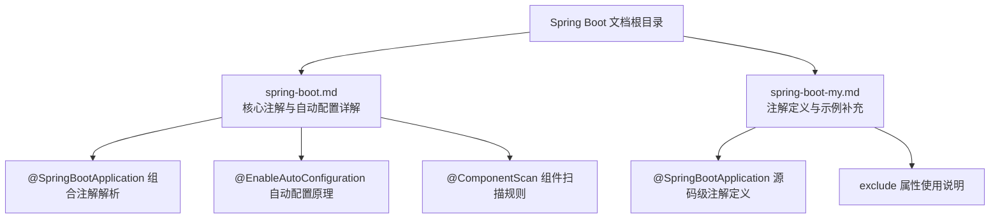
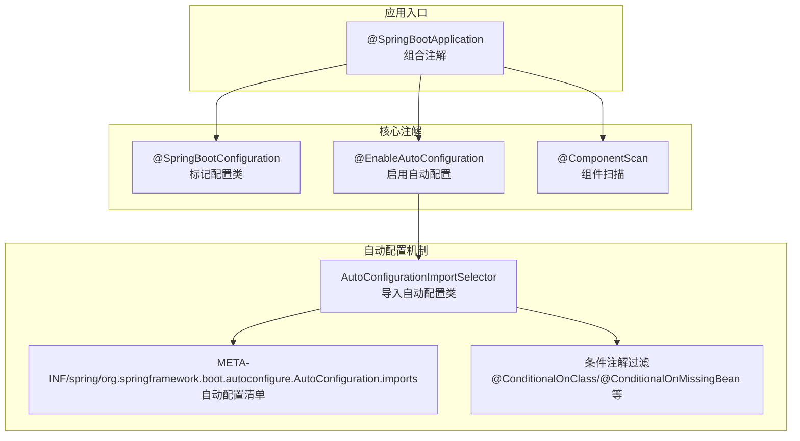
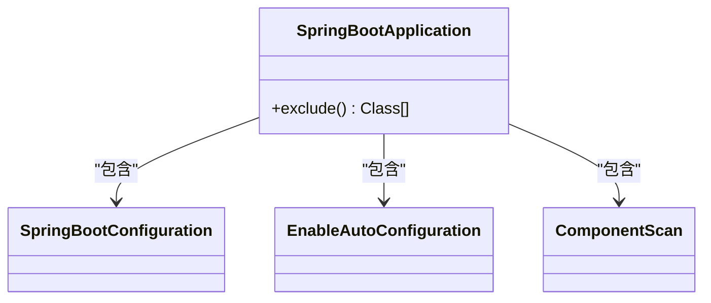
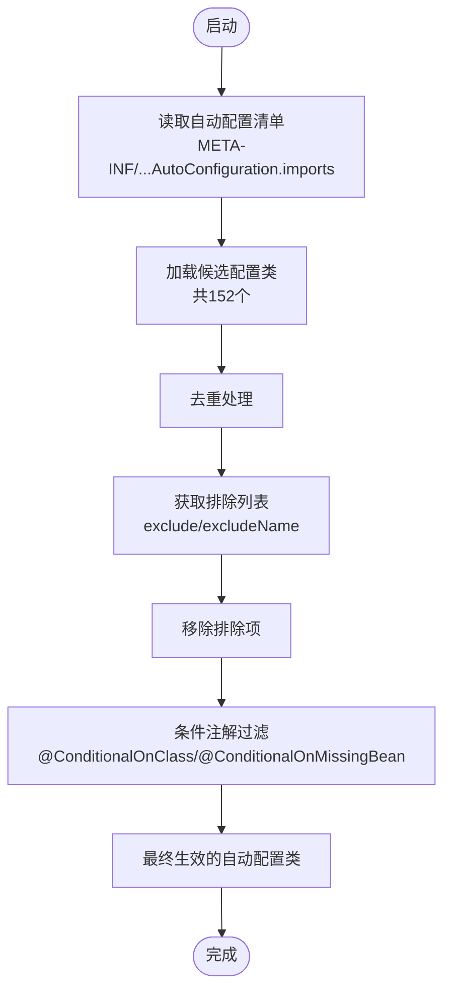
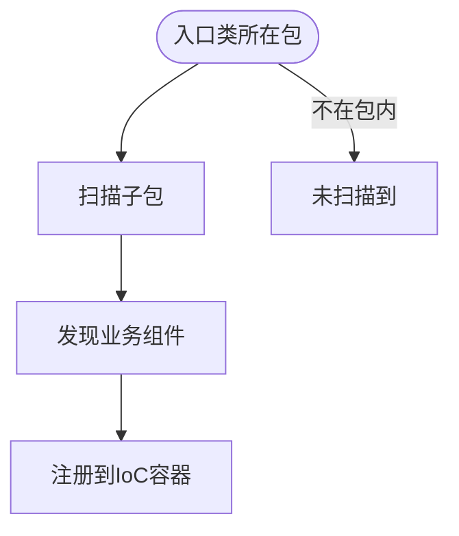
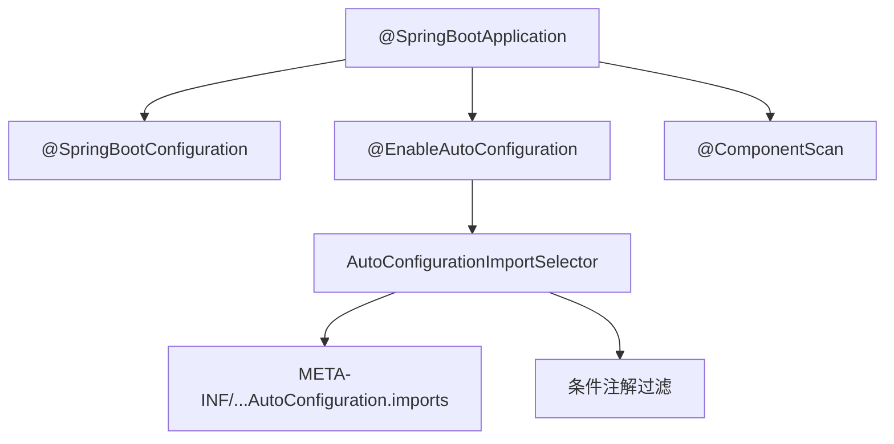

# @SpringBootApplication主注解

<cite>
**本文档引用的文件**
- [spring-boot.md](file://docs/backend-base/spring/spring-boot.md)
- [spring-boot-my.md](file://docs/backend-base/spring/spring-boot-my.md)
</cite>

## 目录
1. [简介](#简介)
2. [项目结构](#项目结构)
3. [核心组件](#核心组件)
4. [架构总览](#架构总览)
5. [详细组件分析](#详细组件分析)
6. [依赖分析](#依赖分析)
7. [性能考虑](#性能考虑)
8. [故障排查指南](#故障排查指南)
9. [结论](#结论)
10. [附录](#附录)

## 简介
@SpringBootApplication 是 Spring Boot 应用的启动入口注解，它是一个组合注解，整合了 @SpringBootConfiguration、@EnableAutoConfiguration、@ComponentScan 的能力，旨在以最少的配置完成应用的启动与自动装配。本文将深入解析该注解的内部组成、执行顺序、作用机制，以及在实际开发中的最佳实践与常见使用场景。

## 项目结构
本仓库中与 Spring Boot 注解相关的内容主要集中在后端基础文档下的 spring 子目录中，包含：
- spring-boot.md：系统讲解 Spring Boot 核心机制、自动配置原理、注解使用与最佳实践
- spring-boot-my.md：补充注解说明与示例，包含 @SpringBootApplication 的源码级注解定义与 exclude 属性说明

**章节来源**
- [spring-boot.md:553-670](file://docs/backend-base/spring/spring-boot.md#L553-L670)
- [spring-boot-my.md:45-66](file://docs/backend-base/spring/spring-boot-my.md#L45-L66)

## 核心组件
@SpringBootApplication 由三个核心注解组成，分别承担不同职责：

- @SpringBootConfiguration：标记主配置类，使入口类具备注册 Bean 的能力，相当于传统 XML 中的 <context:component-scan> 配置。
- @EnableAutoConfiguration：启用自动配置，根据类路径与条件注解筛选并加载所需的自动配置类，实现“约定优于配置”。
- @ComponentScan：开启组件扫描，默认扫描入口类所在包及其子包，确保业务组件（如 Controller、Service、Repository）被纳入 IoC 容器。

此外，@SpringBootApplication 提供 exclude 属性，用于排除不需要的自动配置类，提升启动性能与可控性。

**章节来源**
- [spring-boot.md:560-670](file://docs/backend-base/spring/spring-boot.md#L560-L670)
- [spring-boot-my.md:45-66](file://docs/backend-base/spring/spring-boot-my.md#L45-L66)

## 架构总览
下图展示了 @SpringBootApplication 在应用启动过程中的作用与与其他注解的协作关系：

**图表来源**
- [spring-boot.md:3914-3931](file://docs/backend-base/spring/spring-boot.md#L3914-L3931)
- [spring-boot.md:3780-3808](file://docs/backend-base/spring/spring-boot.md#L3780-L3808)

**章节来源**
- [spring-boot.md:3914-3931](file://docs/backend-base/spring/spring-boot.md#L3914-L3931)
- [spring-boot.md:3780-3808](file://docs/backend-base/spring/spring-boot.md#L3780-L3808)

## 详细组件分析

### @SpringBootApplication 组合注解
- 角色定位：应用启动入口，承载配置类、自动配置与组件扫描三大职责。
- 关键点：
  - @SpringBootConfiguration：使入口类成为配置类，可通过 @Bean 注册自定义 Bean。
  - @EnableAutoConfiguration：通过 @Import(AutoConfigurationImportSelector.class) 导入自动配置类清单，并结合条件注解进行筛选。
  - @ComponentScan：默认扫描入口类所在包及子包，确保业务组件被纳入容器。
  - exclude 属性：排除不需要的自动配置类，避免不必要的 Bean 注册与启动耗时。

**图表来源**
- [spring-boot-my.md:45-66](file://docs/backend-base/spring/spring-boot-my.md#L45-L66)

**章节来源**
- [spring-boot-my.md:45-66](file://docs/backend-base/spring/spring-boot-my.md#L45-L66)
- [spring-boot.md:560-670](file://docs/backend-base/spring/spring-boot.md#L560-L670)

### @EnableAutoConfiguration 自动配置机制
- 核心流程：
  - 通过 AutoConfigurationImportSelector 读取 META-INF/spring/org.springframework.boot.autoconfigure.AutoConfiguration.imports 清单。
  - 加载 152 个候选自动配置类，随后进行去重、排除、条件注解过滤，最终保留 26 个与当前场景相关的配置。
- 条件注解过滤：
  - @ConditionalOnClass：类存在时才生效。
  - @ConditionalOnMissingBean：容器中不存在指定 Bean 时才创建。
  - @ConditionalOnProperty：基于配置文件属性值决定是否生效。
- 排除策略：
  - 注解元数据与属性中获取排除列表，支持按类名或类名集合进行排除。

**图表来源**
- [spring-boot.md:3780-3808](file://docs/backend-base/spring/spring-boot.md#L3780-L3808)

**章节来源**
- [spring-boot.md:3780-3808](file://docs/backend-base/spring/spring-boot.md#L3780-L3808)
- [spring-boot.md:3841-3846](file://docs/backend-base/spring/spring-boot.md#L3841-L3846)

### @ComponentScan 组件扫描规则
- 默认扫描范围：入口类所在包及其子包。
- 作用：替代传统 XML 中的 <context:component-scan base-package="...">，自动发现并注册业务组件（如 @Controller、@Service、@Repository、@Component）。
- 注意事项：若业务组件位于入口类包之外，将不会被扫描到，需调整包结构或使用 @ComponentScan 的 basePackages 指定扫描路径。

**图表来源**
- [spring-boot.md:618-670](file://docs/backend-base/spring/spring-boot.md#L618-L670)

**章节来源**
- [spring-boot.md:618-670](file://docs/backend-base/spring/spring-boot.md#L618-L670)

### exclude 属性的使用场景与配置选项
- 使用场景：
  - 排除与业务无关的自动配置类，减少启动时间与内存占用。
  - 当引入第三方依赖与 Spring Boot 自动配置产生冲突时，可通过排除特定配置类规避。
- 配置选项：
  - exclude：排除指定的自动配置类（Class<?>[]）。
  - excludeName：排除指定的自动配置类名（String[]）。
- 实践建议：
  - 在确认不需要某类自动配置时再使用排除，避免遗漏关键配置。
  - 结合日志与监控观察排除效果，必要时逐步回退以定位问题。

**章节来源**
- [spring-boot-my.md:59-65](file://docs/backend-base/spring/spring-boot-my.md#L59-L65)
- [spring-boot.md:3790-3791](file://docs/backend-base/spring/spring-boot.md#L3790-L3791)

## 依赖分析
- 组合注解依赖关系：
  - @SpringBootApplication 依赖 @SpringBootConfiguration、@EnableAutoConfiguration、@ComponentScan。
- 自动配置依赖关系：
  - @EnableAutoConfiguration 依赖 AutoConfigurationImportSelector 与 META-INF 清单文件。
  - 条件注解（@ConditionalOnClass、@ConditionalOnMissingBean 等）决定最终生效的配置类。
- 组件扫描依赖关系：
  - @ComponentScan 默认扫描入口类所在包及子包，确保业务组件被注册到容器。

**图表来源**
- [spring-boot.md:3914-3931](file://docs/backend-base/spring/spring-boot.md#L3914-L3931)
- [spring-boot.md:3780-3808](file://docs/backend-base/spring/spring-boot.md#L3780-L3808)

**章节来源**
- [spring-boot.md:3914-3931](file://docs/backend-base/spring/spring-boot.md#L3914-L3931)
- [spring-boot.md:3780-3808](file://docs/backend-base/spring/spring-boot.md#L3780-L3808)

## 性能考虑
- 启动性能优化：
  - 合理使用 exclude 排除不必要的自动配置类，减少候选配置数量与条件判断开销。
  - 控制组件扫描范围，避免扫描过多无关包，降低启动时间。
- 运行时性能：
  - 自动配置类仅在启动阶段生效，运行时对性能影响有限；但过多的自动配置可能导致容器初始化复杂度上升。
- 最佳实践：
  - 在开发阶段开启详细日志，定位启动慢的原因；在生产阶段关闭冗余日志，减少 IO 开销。

## 故障排查指南
- 常见问题与排查思路：
  - 组件未被扫描到：检查包结构是否在入口类所在包或子包内，或调整 @ComponentScan 的 basePackages。
  - 自动配置未生效：确认引入的启动器与依赖是否正确，检查条件注解是否满足；必要时使用 exclude 排除冲突配置。
  - 启动过慢：使用 exclude 排除非必要自动配置类，缩小候选配置范围。
- 参考路径：
  - 组件扫描与包结构问题：[spring-boot.md:618-670](file://docs/backend-base/spring/spring-boot.md#L618-L670)
  - 自动配置排除与条件注解：[spring-boot.md:3780-3808](file://docs/backend-base/spring/spring-boot.md#L3780-L3808)
  - 注解定义与 exclude 属性：[spring-boot-my.md:45-66](file://docs/backend-base/spring/spring-boot-my.md#L45-L66)

**章节来源**
- [spring-boot.md:618-670](file://docs/backend-base/spring/spring-boot.md#L618-L670)
- [spring-boot.md:3780-3808](file://docs/backend-base/spring/spring-boot.md#L3780-L3808)
- [spring-boot-my.md:45-66](file://docs/backend-base/spring/spring-boot-my.md#L45-L66)

## 结论
@SpringBootApplication 通过组合 @SpringBootConfiguration、@EnableAutoConfiguration、@ComponentScan，实现了“零 XML、零样板代码”的 Spring Boot 启动体验。理解其内部机制与执行顺序，有助于在实际开发中合理使用 exclude 属性、优化启动性能，并有效排查组件扫描与自动配置相关问题。建议在保持“约定优于配置”的同时，结合项目实际需求进行适度定制与排除，以达到最佳的开发与运维体验。

## 附录
- 示例参考路径（不展示具体代码内容，仅提供定位）：
  - 主入口类与 @SpringBootApplication 使用示例：[spring-boot.md:72-87](file://docs/backend-base/spring/spring-boot.md#L72-L87)
  - @SpringBootConfiguration 与 @Bean 注册示例：[spring-boot.md:574-589](file://docs/backend-base/spring/spring-boot.md#L574-L589)
  - @ComponentScan 扫描到与扫描不到的对比示例：[spring-boot.md:627-669](file://docs/backend-base/spring/spring-boot.md#L627-L669)
  - @EnableAutoConfiguration 自动配置原理与清单文件：[spring-boot.md:3914-3931](file://docs/backend-base/spring/spring-boot.md#L3914-L3931)
  - @SpringBootApplication 源码级注解定义与 exclude 属性：[spring-boot-my.md:45-66](file://docs/backend-base/spring/spring-boot-my.md#L45-L66)